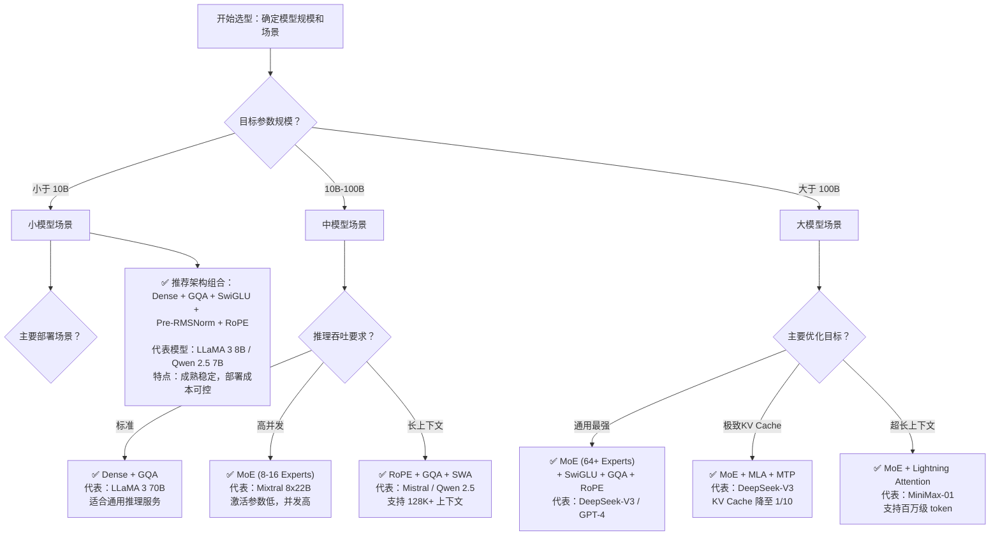

# AI 大模型架构知识详解

本文档面向有机器学习基础的中高级开发者，系统梳理大模型内部架构的核心组件与选型决策。全文档共 7 章，从 Transformer 基础出发，逐层覆盖 MoE 架构、注意力变体、位置编码、归一化与激活函数、推理优化技术，最终汇聚到主流模型架构的横向对比。

---

## 第 1 章：Transformer 架构基础

**章节目标**：为读者建立对 Transformer 原始架构和三大变体的完整理解，奠定后续所有章节的知识基础。

---

### 1.1 从 Seq2Seq 到 Transformer 的设计动机

在 Transformer 出现之前，序列到序列（**Seq2Seq**，即 Sequence-to-Sequence）任务由 **RNN（循环神经网络）[^rnn]** 及其变体（LSTM、GRU）主导。Seq2Seq 最早由 Sutskever et al. 提出[^seq2seq]，其核心思想是使用一个 **Encoder（编码器）** 将变长输入序列编码为固定长度的上下文向量，再由一个 **Decoder（解码器）** 将该向量解码为变长输出序列——这奠定了后来所有 Encoder-Decoder 架构的基础。一个典型的 Encoder-Decoder RNN 工作方式如下：

1. Encoder 逐个读取输入序列的 token，将最终隐状态压缩为一个**上下文向量**（Context Vector）
2. Decoder 从该上下文向量开始，逐步生成输出序列

这种方式存在两个根本性问题：

- **并行能力差**：RNN 的每个时间步依赖前一步的隐状态，无法并行计算。序列越长，训练越慢。
- **长距离依赖困难**：随着序列增长，较早 token 的信息在逐步传递中衰减（梯度消失），模型难以建立远距离位置的语义关联。

**注意力机制（Attention Mechanism）** 的引入（Bahdanau et al., 2015）缓解了第二个问题：Decoder 在每一步不只看一个固定的上下文向量，而是"回顾" Encoder 的所有隐状态，加权求和。但 RNN 的顺序计算瓶颈依然存在。

2017 年，Vaswani 等人在论文 ***Attention Is All You Need*** 中提出了 **Transformer** 架构，彻底抛弃了 RNN，**完全基于注意力机制**构建序列模型。其核心洞察是：注意力机制本身足以建模序列中任意位置之间的依赖关系，不需要循环结构。这一选择带来了两个关键优势：

- **完全并行化**：自注意力计算所有位置之间的关联，不依赖时间步递推
- **全局感受野**：每个位置可直接关注序列中任意其他位置，不存在信息衰减

从此，Transformer 成为大模型时代的架构基石。

---

### 1.2 Scaled Dot-Product Attention 与 Multi-Head Attention

#### Scaled Dot-Product Attention

Transformer 使用的注意力机制称为 **Scaled Dot-Product Attention**，其计算公式如下：

```
Attention(Q, K, V) = softmax(QK^T / sqrt(d_k)) V
```

其中：
- **Q（Query）**：查询向量，表示"当前需要关注什么"
- **K（Key）**：键向量，表示"每个位置提供什么信息"
- **V（Value）**：值向量，表示"每个位置的实际信息内容"
- **d_k**：Q 和 K 的维度

**直观理解**：可以将注意力机制类比为一个**检索系统**。Query 是搜索请求，Key 是每个文档的索引标签，Value 是文档内容。计算 Q 与所有 K 的点积得到匹配分数，用 softmax 归一化为权重分布，最后用该权重对 Value 加权求和得到最终输出。

缩放因子 `sqrt(d_k)` 的作用是**数值稳定性**。当 d_k 较大时，QK^T 点积的值方差较大，导致 softmax 的梯度进入饱和区（极靠近 0 或 1），梯度极小难以训练。除以 sqrt(d_k) 使方差保持在 1 附近。

#### Multi-Head Attention

**Multi-Head Attention（MHA）** 将 Q、K、V 分别投影到 h 个不同的子空间，并行计算 h 次 Scaled Dot-Product Attention，然后将结果拼接并进行线性投影。公式如下：

```
MultiHead(Q, K, V) = Concat(head_1, ..., head_h) W^O
其中 head_i = Attention(QW_i^Q, KW_i^K, VW_i^V)
```

参数关系：每个 head 的维度 `d_k = d_model / h`，总计算量与单头 d_model 维度注意力大致相当，但多头提供了**不同的表征子空间**，让模型可以从多个角度关注信息。

假设 `d_model = 512`，`h = 8`，则每个 head 在 `d_k = 64` 的维度上独立计算注意力，最后拼接回 512 维。

下面给出 PyTorch 风格的实现伪代码：

```python
import torch
import torch.nn.functional as F

def scaled_dot_product_attention(Q, K, V, mask=None):
    """
    Q, K, V: (batch_size, num_heads, seq_len, d_k)
    mask: (batch_size, 1, seq_len, seq_len) 可选掩码
    返回: (batch_size, num_heads, seq_len, d_k), attention_weights
    """
    d_k = Q.size(-1)
    # QK^T / sqrt(d_k) : (batch, h, seq, d_k) @ (batch, h, d_k, seq) -> (batch, h, seq, seq)
    scores = torch.matmul(Q, K.transpose(-2, -1)) / (d_k ** 0.5)

    if mask is not None:
        scores = scores.masked_fill(mask == 0, float('-inf'))

    attention_weights = F.softmax(scores, dim=-1)
    output = torch.matmul(attention_weights, V)  # (batch, h, seq, d_k)
    return output, attention_weights


class MultiHeadAttention(torch.nn.Module):
    def __init__(self, d_model, num_heads):
        super().__init__()
        assert d_model % num_heads == 0
        self.num_heads = num_heads
        self.d_k = d_model // num_heads

        # 定义 Q/K/V/O 四个投影矩阵
        self.W_q = torch.nn.Linear(d_model, d_model)  # 整体投影
        self.W_k = torch.nn.Linear(d_model, d_model)
        self.W_v = torch.nn.Linear(d_model, d_model)
        self.W_o = torch.nn.Linear(d_model, d_model)

    def forward(self, Q, K, V, mask=None):
        batch_size = Q.size(0)

        # 线性投影并拆分为多头的形状
        # 输入: (batch, seq, d_model)
        # 输出: (batch, seq, num_heads, d_k) -> 转置 -> (batch, num_heads, seq, d_k)
        Q = self.W_q(Q).view(batch_size, -1, self.num_heads, self.d_k).transpose(1, 2)
        K = self.W_k(K).view(batch_size, -1, self.num_heads, self.d_k).transpose(1, 2)
        V = self.W_v(V).view(batch_size, -1, self.num_heads, self.d_k).transpose(1, 2)

        # 计算注意力
        attn_output, _ = scaled_dot_product_attention(Q, K, V, mask)

        # 拼接多头结果并投影
        # (batch, num_heads, seq, d_k) -> (batch, seq, num_heads, d_k) -> (batch, seq, d_model)
        attn_output = attn_output.transpose(1, 2).contiguous().view(batch_size, -1, -1)
        output = self.W_o(attn_output)
        return output
```

**关键维度变化**：
- 输入形状：`(batch, seq_len, d_model)` = `(N, S, 512)`
- 拆分后：`(N, h, S, d_k)` = `(N, 8, S, 64)`
- 输出形状：`(N, S, d_model)` = `(N, S, 512)`

---

### 1.3 Encoder-Decoder 原始架构逐层解析

原始 Transformer 采用 Encoder-Decoder 对称结构，由 **N 层编码器 + N 层解码器**堆叠而成（原论文 N=6）。

#### Encoder 层（单层）

每个 Encoder 层包含两个子层：

1. **多头自注意力（Multi-Head Self-Attention）**：Q、K、V 均来自上一层的输出，让每个位置关注序列中的所有位置。这里的"自"（Self）指的是 Q/K/V 全部来自同一个源。
2. **前馈神经网络（FFN）**：两个线性变换 + ReLU 激活，公式为 `FFN(x) = max(0, xW_1 + b_1)W_2 + b_2`，中间维度通常为 `d_ff = 4 * d_model`（如 512→2048→512）。

每个子层后接**残差连接 + 层归一化**，即 `output = LayerNorm(x + Sublayer(x))`。

#### Decoder 层（单层）

Decoder 层比 Encoder 多一个子层，共三个子层：

1. **带掩码的多头自注意力（Masked Multi-Head Self-Attention）**：使用**因果掩码（Causal Mask）**，确保生成当前位置时只能看到之前的 token，看不到未来的 token。
2. **交叉注意力（Cross-Attention）**：Q 来自 Decoder 上一层的输出，K 和 V 来自 Encoder 最顶层的输出。这是 Encoder 信息传递给 Decoder 的通道。
3. **前馈神经网络（FFN）**：结构和 Encoder 相同。

#### 整体结构

```
输入序列
    ↓
[Embedding + Positional Encoding]
    ↓
┌──────────────────────────────┐
│  Encoder Layer × N            │
│  ┌──────────────────────────┐ │
│  │ Multi-Head Self-Attention│ │
│  │    → Add & LayerNorm     │ │
│  │    → FFN                 │ │
│  │    → Add & LayerNorm     │ │
│  └──────────────────────────┘ │
│  ┌──────────────────────────┐ │
│  │  ... (重复 N 层)          │ │
│  └──────────────────────────┘ │
└──────────────────────────────┘
    ↓ (Encoder 输出)
┌──────────────────────────────┐
│  Decoder Layer × N            │
│  ┌──────────────────────────┐ │
│  │ Masked Self-Attention    │ │
│  │    → Add & LayerNorm     │ │
│  │    → Cross-Attention     │ │  ← K/V 来自 Encoder
│  │    → Add & LayerNorm     │ │
│  │    → FFN                 │ │
│  │    → Add & LayerNorm     │ │
│  └──────────────────────────┘ │
│  ┌──────────────────────────┐ │
│  │  ... (重复 N 层)          │ │
│  └──────────────────────────┘ │
└──────────────────────────────┘
    ↓
[Linear → Softmax]
    ↓
输出序列
```

---

### 1.4 三大架构选型与掩码机制

原始 Transformer 的 Encoder-Decoder 设计适用于**序列转导**任务（如翻译、摘要），但在实际应用中，基于不同任务需求演化出了三种变体：

#### Encoder-Only：双向理解

代表模型：**BERT**（2018）。

- 仅保留 Encoder 部分，使用**双向自注意力**（即每个位置可以关注所有位置，无遮掩）
- 适合理解类任务：文本分类、命名实体识别、情感分析、语义相似度
- 局限性：无法直接用于文本生成

#### Decoder-Only：自回归生成

代表模型：**GPT 系列**（2018 至今），以及 LLaMA、Qwen、DeepSeek 等当前绝大多数大模型。

- 仅保留 Decoder 部分（去掉了 Cross-Attention），使用**因果掩码**
- 适合生成类任务：对话、写作、代码生成、推理
- 自回归生成方式：逐个 token 输出，每个新 token 依赖之前的所有 token

**为什么 Decoder-Only 成为主流？**
- Scaling Law 效应显著：参数量、数据量、计算量增加时，生成能力持续提升
- 注意力机制本身即可捕获理解所需的信息
- 架构统一、简洁，训练和部署更高效

#### Encoder-Decoder：序列转导

代表模型：**T5**、**BART**。

- 保留完整 Encoder-Decoder 结构，Encoder 双向理解输入，Decoder 单向生成输出
- 适合输入和输出明显不对称的任务：翻译、摘要、文本转 SQL
- 缺点是参数翻倍、推理延迟高于 Decoder-Only

#### 掩码机制详解

**因果掩码（Causal Mask）**：用于 Decoder 的自注意力层，防止位置 i 看到位置 j>i 的信息。实现方式是用一个上三角矩阵，将右上角（未来位置）填充为 `-inf`，softmax 后这些位置的权重趋近于 0。

```
因果掩码（上三角矩阵，未填充的部分表示掩码位置）:
位置 0: [0, -inf, -inf, -inf, -inf]
位置 1: [0,   0,  -inf, -inf, -inf]
位置 2: [0,   0,    0,  -inf, -inf]
位置 3: [0,   0,    0,    0,  -inf]
位置 4: [0,   0,    0,    0,    0  ]
```

**填充掩码（Padding Mask）**：用于处理变长序列的批次训练，将被填充的 token 位置标记为 `-inf`，使注意力不关注填充位置。在 Encoder 和 Decoder 中都可以使用。

**两者叠加**：Decoder 的自注意力需要同时应用因果掩码和填充掩码——取两个掩码矩阵的并集（对应位置只要有任一个要求掩码，就填 `-inf`）。

#### 三种架构对比

| 维度 | Encoder-Only (BERT) | Decoder-Only (GPT) | Encoder-Decoder (T5) |
|------|-------------------|-------------------|---------------------|
| 注意力方式 | 双向（全可见） | 单向（因果掩码） | Encoder 双向 + Decoder 单向 |
| 代表任务 | 分类、NER、语义匹配 | 对话、写作、代码生成 | 翻译、摘要、序列转导 |
| 参数效率 | 较低（理解为主） | 较高（统一架构） | 最低（双倍参数） |
| 当前主流地位 | 逐渐边缘化 | **绝对主导** | 特定任务使用 |

---

### 1.5 Cross-Attention、残差连接与层归一化

#### Cross-Attention（交叉注意力）

Cross-Attention 是 Encoder-Decoder 架构中**连接编码器和解码器的桥梁**。其工作机制如下：

- **Q（Query）**：来自 Decoder 上一层的输出，代表"解码器当前生成到哪个位置，需要什么信息"
- **K（Key）、V（Value）**：来自 Encoder 最顶层的输出，代表"输入序列整体提供了什么信息"

计算出的注意力权重表示解码器当前位置与输入序列各位置的关联强度，让模型在生成每个 token 时"回顾"输入的相关部分。例如在翻译任务中，生成目标语言单词时可以使对应的源语言单词获得更高注意力权重。

在 Decoder-Only 架构中，由于没有 Encoder，**不存在 Cross-Attention 层**。这也是 Decoder-Only 比 Encoder-Decoder 推理更高效的原因之一。

#### 残差连接（Residual Connection）

残差连接来源于 ResNet（He et al., 2015），在 Transformer 中每个子层的输出为：

```
output = LayerNorm(x + Sublayer(x))
```

核心作用：**梯度直接流过残差路径**。在反向传播时，梯度可以不走子层的路径，而直接通过残差连接到达更早的层，有效缓解深层网络的梯度消失问题。

实践中发现，即使去掉 Transformer 某些层的注意力或 FFN 子层，残差连接依然能维持可接受的性能，说明残差路径承载了大量信息流。

#### 层归一化位置：Post-Norm vs Pre-Norm

层归一化（LayerNorm）在 Transformer 中放置位置有两种配置：

**Post-Norm（原始 Transformer）**：
```
x → Sublayer → Dropout → Add → LayerNorm → output
```
归一化在子层输出和残差相加**之后**。这是 Attention Is All You Need 原始的配置。缺点：训练深层网络时不稳定，需要精心设计的学习率预热（warmup）策略。

**Pre-Norm（现代 LLM 标配）**：
```
x → LayerNorm → Sublayer → Dropout → Add → output
```
归一化在子层计算**之前**。优势：
- 梯度可以通过残差连接直接流动，不受归一化影响
- 训练更稳定，对学习率不那么敏感
- 可以用更大的学习率和更少的 warmup 步数

尽管原始论文使用 Post-Norm，当前的 GPT、LLaMA、Qwen、DeepSeek 等主流模型**全部采用 Pre-Norm**。实验表明 Pre-Norm 在深层网络（12+ 层）中显著优于 Post-Norm。

> **小结**：Post-Norm 是"先加后归一"，梯度需经过归一化层；Pre-Norm 是"先归一后加"，梯度经残差路径直通。

---

### 本章小结

本章从 RNN 的并行限制和长距离依赖问题出发，引出 Transformer 完全基于注意力机制的设计思路。我们详细拆解了 Scaled Dot-Product Attention 的数学公式和 Multi-Head Attention 的工作原理，逐层分析了 Encoder-Decoder 原始架构，对比了三种架构变体的适用场景，最后深入讲解了 Cross-Attention、残差连接和 Post-Norm/Pre-Norm 的位置配置差异。这些内容是理解后续所有章节的基础。

**练习题**：

1. Decoder-Only 架构中的因果掩码是如何保证自回归生成自洽性的？如果取消因果掩码，模型在生成时会遇到什么问题？
2. Post-Norm 和 Pre-Norm 在深层网络中的梯度流动路径有何差异？为什么 Pre-Norm 在现代 LLM 中成为首选？
3. 假设 `d_model = 1024`、`num_heads = 16`，计算每个 head 的维度 d_k，并估算单层 MHA 的浮点计算量。

---

## 第 2 章：MoE（Mixture of Experts）架构

**章节目标**：让读者掌握稀疏激活 MoE 的完整工作原理，理解从 GShard 到 DeepSeek MoE 的技术演进脉络及工程挑战。

---

### 2.1 从 Dense 到 Sparse：MoE 的核心思想

在标准的 Dense Transformer 中，每一层的 **FFN（前馈神经网络）** 对所有 token 使用**相同的参数**。模型总参数量与每个 token 的计算量成正比——要想增大模型容量，每 token 的 FLOPs 必然增加。

**MoE（Mixture of Experts，混合专家模型）** 的核心思想打破了这个绑定：用**多个并行的 Expert（专家 FFN 子网）** 替代单一的 FFN，每个 token 由门控网络（Router）动态选择一部分专家来激活。这样，在相同计算量（每 token 激活的参数量）下，模型总参数量可以大幅增加。这种方法被称为**条件计算（Conditional Computation）**。

类比理解：一个公司（Dense 模型）里全体员工都会参与所有项目。而 MoE 相当于一个大型咨询公司（MoE 模型），有多个专业团队（Experts），每个项目只从相关团队中抽调专家组成临时项目组（Top-k routing）。公司总员工数（总参数量）可以很大，但每个项目参与的人（激活参数量）可控。

**关键数据对比**：
- Dense 模型：总参数 = 激活参数，参数量和计算量增长同步
- MoE 模型：总参数 >> 激活参数，计算量增长幅度远小于参数量

例如 Mixtral 8x7B：总参数 46.7B，但每 token 只激活 2 个专家，激活参数量仅 12.9B。

---

### 2.2 门控网络与 Top-k Routing 工作机制

MoE 层的核心是一个**门控网络（Gating Network / Router）** 和一组 Expert。

#### 路由过程

1. 每个 token 的 FFN 输入 x 先进入 Router
2. Router 将 x 投影到维度为 `num_experts` 的向量，计算各专家的匹配分数
3. 对分数做 Softmax 归一化，得到各专家的概率分布
4. 选择概率最高的 Top-k 个专家
5. 对选中的专家概率做**加权求和**，得到最终输出

```
Router 计算: h(x) = W_g · x          (logits, 维度 = num_experts)
                        ↓
Softmax 归一化: p_i(x) = exp(h_i(x)) / Σ_j exp(h_j(x))
                        ↓
Top-k 选取: 选择 p_i 最大的 k 个专家
                        ↓
加权输出: y = Σ_{i in Top-k} p_i(x) · Expert_i(x)
```

#### Top-1 与 Top-2 的权衡

- **Top-1 路由**（Switch Transformer）：每个 token 只激活 1 个专家。通信量最小（每个 token 只发往一个 GPU 持有者），但可能过于"独断"，丢失模型的多样性。
- **Top-2 路由**（GShard、Mixtral）：每个 token 激活 2 个专家。性能通常优于 Top-1，但通信和计算开销约为两倍。

下面是 Top-2 路由的 PyTorch 风格伪代码：

```python
import torch
import torch.nn.functional as F

class MoELayer(torch.nn.Module):
    def __init__(self, d_model, num_experts, top_k=2):
        super().__init__()
        self.num_experts = num_experts
        self.top_k = top_k
        # 门控网络: 线性投影到 expert 维度
        self.router = torch.nn.Linear(d_model, num_experts, bias=False)
        # 每个 expert 是一个简单的两层 FFN
        self.experts = torch.nn.ModuleList([
            torch.nn.Sequential(
                torch.nn.Linear(d_model, 4 * d_model),
                torch.nn.ReLU(),
                torch.nn.Linear(4 * d_model, d_model),
            )
            for _ in range(num_experts)
        ])

    def forward(self, x):
        # x: (batch, seq, d_model)
        batch_size, seq_len, d_model = x.shape
        x_flat = x.view(-1, d_model)  # (batch*seq, d_model)
        num_tokens = x_flat.size(0)

        # Step 1: 计算路由分数
        router_logits = self.router(x_flat)  # (num_tokens, num_experts)
        router_probs = F.softmax(router_logits, dim=-1)

        # Step 2: Top-k 选择
        topk_probs, topk_indices = torch.topk(router_probs, self.top_k, dim=-1)
        # topk_probs: (num_tokens, k), topk_indices: (num_tokens, k)

        # Step 3: 归一化 Top-k 概率（重新归一化到总和为 1）
        topk_probs_normalized = topk_probs / topk_probs.sum(dim=-1, keepdim=True)

        # Step 4: 逐个 expert 计算结果
        final_output = torch.zeros_like(x_flat)
        for expert_idx in range(self.num_experts):
            # 找出哪些 token 选择了当前 expert
            mask = (topk_indices == expert_idx)
            if not mask.any():
                continue

            # 对分配给该 expert 的 token 计算 Expert 输出
            token_indices = mask.any(dim=-1)  # (num_tokens,)
            expert_input = x_flat[token_indices]
            expert_output = self.experts[expert_idx](expert_input)

            # 加权累加: 每个 token 的权重就是它分配给该 expert 的归一化概率
            # 注意: 如果一个 token 在 Top-2 中同时选了两个 expert，每个 expert 的
            # 贡献比例就是对应的 topk_probs_normalized 值
            for rank in range(self.top_k):
                token_mask = mask[:, rank]
                if token_mask.any():
                    weights = topk_probs_normalized[token_mask, rank].unsqueeze(-1)
                    final_output[token_mask] += weights * expert_output[token_mask]

        return final_output.view(batch_size, seq_len, d_model)
```

---

### 2.3 负载均衡挑战与辅助损失函数

#### "富者愈富"问题

在 MoE 训练过程中，Router 会自然地倾向于把 token 分配给**少数表现较好的 Expert**。这些 Expert 获得更多训练信号后变得更强，Router 进一步加大分配给它们的权重。结果就是大多数 Expert 闲置、少数 Expert 过载，整个 MoE 的容量利用率大幅下降。

#### 辅助损失函数（Auxiliary Loss）

为解决这个问题，Switch Transformer 提出了一个**负载均衡损失**项，加到总训练损失中：

```
L_aux = α · num_experts · Σ_{i=1}^{num_experts} f_i · P_i
```

其中：
- **f_i**：分配给 Expert i 的 token 比例
- **P_i**：Router 分配给 Expert i 的平均概率
- **α**：负载均衡系数（超参数，通常取 0.01 左右）

当 Router 均匀分配 token 时，`f_i ≈ P_i ≈ 1/num_experts`，`L_aux` 趋近于 α。当 Router 偏向少数 Expert 时，`L_aux` 增大，在梯度更新中惩罚该倾向。

**α 的调参**：α 太大，路由趋于均匀但忽视真实能力差异，模型性能下降；α 太小，负载均衡效果不足。实际中通常取 `α = 0.01` 作为基线，再根据验证集负载分布微调。

---

### 2.4 GShard：MoE 与 Transformer 的开创性结合

**GShard**（Lepikhin et al., Google, 2020）是**首次将 MoE 引入 Transformer 架构**的工作，构建了一个 6000 亿参数的稀疏门控机器翻译模型。

#### 核心贡献

1. **Top-2 路由**：每个 token 选择 2 个 Expert，提供比 Top-1 更好的性能。
2. **自动分片策略（Sharding）**：不同 Expert 分布在不同的 TPU/GPU 上，通过自动分片实现分布式训练。
3. **All-to-All 通信模式**：Token 需要根据路由结果从所在设备发送到对应 Expert 所在的设备，使用 All-to-All 通信实现跨设备数据传输。
4. **仅替换 FFN**：只在每一层的 FFN 子层中引入 MoE，注意力层保持 Dense，保证了与标准 Transformer 的兼容性。

#### 参数规模

- 总参数：约 600B
- 每 token 激活参数量：与 Dense 模型相当
- 翻译质量：在 WMT 翻译基准上显著超越同期 Dense 模型

---

### 2.5 Switch Transformer：Top-1 简化与万亿参数级训练

**Switch Transformer**（Fedus et al., Google, 2021）在 GShard 的基础上做了关键**简化**：从 Top-2 路由改为 **Top-1 路由**。

#### 简化的动机

| 对比项 | GShard (Top-2) | Switch Transformer (Top-1) |
|-------|----------------|--------------------------|
| 每 token 激活 Expert 数 | 2 | 1 |
| 通信量 (All-to-All) | 高 | 减半 |
| Expert 利用率 | 较高 | 较低 |
| 训练速度 | 基准 | 提升 2-3 倍 |
| 同等 FLOPs 下质量 | 基准 | 接近或略低 |

Switch Transformer 的实验表明：在同等 FLOPs 预算下，Top-1 路由通过大幅增加 Expert 数量（以及总参数量）可以获得与 Top-2 相当的性能，同时训练效率更高。

#### bfloat16 训练稳定性

训练万亿参数模型面临数值稳定性挑战。Switch Transformer 采用 **bfloat16（Brain Floating Point 16）** 替代 float16，利用其更大的指数范围（8 位指数，与 float32 相同）缓解了梯度下溢问题。

#### 里程碑意义

Switch Transformer 首次证明**万亿参数级模型**的可行性，训练了一个 1.6 万亿参数的模型，训练速度相比同等 FLOPs 的 Dense 模型提升 7 倍。这一工作极大推动了 MoE 在大规模场景中的应用。

---

### 2.6 DeepSeek MoE 核心创新

**DeepSeek MoE**（DeepSeek, 2024）在传统 MoE 设计上提出了三项关键创新，显著改善了 MoE 的训练效率和负载均衡问题。

#### 创新一：细粒度专家分割（Fine-Grained Expert Segmentation）

传统 MoE 中每个 Expert 的维度与标准 FFN 中间维度相同（如 `4 × d_model`）。DeepSeek MoE 将每个 Expert 的维度**降低**，同时**增加 Expert 数量**。

效果：相同总参数下，更多的 Expert 意味着更细粒度的功能分化，每个 token 可以从更多专家中组合需要的知识。用更多"小专家"取代少数"大专家"，提升了路由的灵活性。

#### 创新二：共享专家（Shared Expert）

DeepSeek MoE 在路由专家之外，增加了一个或多个**共享专家**——所有 token 都经过共享专家处理（无需路由）。

设计动机：网络中存在大量**通用知识**（如语法规则、基本语义），这些知识由共享专家统一捕获，路由专家则专注于更特异化的功能。

```
输出 = SharedExpert(x) + Σ_{i in Top-k} g_i · Expert_i(x)
```

共享专家的引入，使路由专家的负载分布更加均匀，间接缓解了负载均衡压力。

#### 创新三：无辅助损失负载均衡

DeepSeek MoE 提出了**无需辅助损失函数**的负载均衡策略，核心是一个**动态 bias 调节**机制。

```python
import torch
import torch.nn.functional as F

num_experts = 64  # 假设 64 个专家

# 每个 expert 维护一个 bias 偏置（可更新，但不参与梯度传播）
expert_bias = torch.zeros(num_experts)  # 初始化为 0

def compute_router_logits_ds(x, expert_bias, router_weight):
    """
    DeepSeek MoE 风格的路由：门控分数 = x · W_g + bias
    bias 动态调节用于负载均衡，不依赖梯度
    """
    # 标准线性投影
    logits = F.linear(x, router_weight)  # (num_tokens, num_experts)
    # 添加 bias（推理时训练好的 bias 用于路由，训练时根据负载动态调整）
    logits = logits + expert_bias
    return logits


def update_expert_bias(expert_bias, token_counts, capacity, beta=0.1):
    """
    无辅助损失的负载均衡：动态调节 bias
    - token_counts: 每个 expert 本批次接收的 token 数
    - capacity: 每个 expert 的目标 token 数（上限）
    - 如果 expert 过载 (token_counts > capacity)，降低它的 bias
    - 如果 expert 欠载 (token_counts < capacity * threshold)，提高它的 bias
    """
    for i in range(len(expert_bias)):
        if token_counts[i] > capacity:
            expert_bias[i] -= beta  # 惩罚过载专家
        elif token_counts[i] < capacity * 0.7:
            expert_bias[i] += beta  # 鼓励使用欠载专家
    # bias 更新不参与梯度计算，避免了辅助损失的超参调优
    return expert_bias
```

这种策略的优点：
- **无需超参数 α**（省去了负载均衡系数的调优成本）
- **动态适应**：bias 根据实际负载实时调整，比固定的辅助损失更灵活
- 与主任务损失解耦，不影响模型对主任务的优化

#### 在 DeepSeek-V3 中的应用

DeepSeek-V3 总参数 671B，每 token 激活 37B 参数，采用细粒度专家分割 + 1 个共享专家 + 无辅助损失负载均衡的完整方案。

---

### 2.7 专家容量、Token 丢弃与分布式训练挑战

#### 专家容量（Expert Capacity）

在分布式环境中，每个 Expert 运行在特定的 GPU 上，其计算能力受限于显存和处理能力。**专家容量（Expert Capacity）** 定义了每个 Expert 可以接收的最大 token 数：

```
capacity = ⌈(total_tokens / num_experts) × capacity_factor⌉
```

`capacity_factor` 是一个松弛系数（通常 1.0~1.25），给负载波动留有余量。

#### Token 丢弃（Token Dropping）

当分配到一个 Expert 的 token 数超过容量时，超出部分的 token 会被**丢弃**（或者通过辅助路由发送到其他 Expert）。被丢弃的 token 在本层不经过 FFN 计算，其残差连接直接传递到下一层。

Token 丢弃是训练效率与质量之间的权衡：丢弃过多会损失信息，但设置过大的容量又会导致 GPU 计算浪费。通常训练时丢弃率控制在 2-5% 以内。

#### 分布式训练核心挑战

**（1）All-to-All 通信开销**

MoE 的分布式训练需要频繁的 All-to-All 通信：每个 token 根据路由结果被发送到对应 Expert 所在的设备，计算完成后结果再发送回来。这种通信模式：

- 通信量与 Expert 数量成正比
- 是 MoE 训练的主要瓶颈
- 制约了 Expert 数量的进一步扩大

**（2）负载不均导致的 GPU 闲置**

即使有负载均衡策略，各 GPU 上的 Expert 负载仍可能存在波动。负载不均意味着部分 GPU 在等待其他 GPU 完成计算，造成整体效率损失。

**（3）动态路由带来的推理不确定性**

相比 Dense 模型的确定性计算路径，MoE 的路由结果取决于输入内容，推理时的 Expert 负载分布不可预测，给批处理和服务器的资源规划带来挑战。

---

### 2.8 Mixtral 8x7B 与 Sparse Upcycling

#### Mixtral 8x7B

**Mixtral 8x7B**（Mistral AI, 2024）是最具代表性的开源 MoE 模型之一。

**架构参数**：

| 参数 | 数值 |
|------|------|
| Expert 数量 | 8 |
| Top-k 路由 | 2（Top-2） |
| 总参数量 | 46.7B |
| 每 token 激活参数量 | 12.9B |
| 上下文长度 | 32K |
| 架构基础 | Decoder-Only + RoPE + GQA + SwiGLU |

**关键特性**：
- 路由器**每时间步动态切换**选择的 Expert——同一个序列不同位置可能由不同的 Expert 组合处理
- 在激活参数量与 LLaMA 2 13B 相当的情况下，Mixtral 8x7B 在多项基准上接近或达到 LLaMA 2 70B 的水平
- 体现了 MoE 的核心理优势：**相同激活参数，显著更强的性能**

#### Sparse Upcycling（稀疏上采样）

**Sparse Upcycling**（Komatsuzaki et al., 2022）是一种将训练好的 Dense 模型转换为 MoE 模型的轻量级方法，过程如下：

1. 训练一个标准的 Dense Transformer 模型
2. 将每层 FFN 的权重**复制多份**，分别初始化为多个 Expert 的权重
3. 添加 Router 并随机初始化
4. 以较低的学习率继续进行 **MoE 训练**

这种方法的核心优点：
- 充分利用已训练的 Dense 模型
- 大部分 Expert 的权重在初始化时已经具备功能，不需要从头训练
- 训练成本远低于从头训练同等规模的 MoE 模型

Sparse Upcycling 是大规模 MoE 训练中的常用初始化策略，也是 DeepSeek 等模型的训练加速手段之一。

---

### 本章小结

MoE 通过稀疏激活实现了"参数规模翻倍、计算量几乎不变"的效果。从 GShard 的首创结合到 Switch Transformer 的极致简化，再到 DeepSeek MoE 的三项创新，MoE 架构在不断进化中解决了负载均衡、专家容量和分布式训练的工程挑战。当前 MoE 已成为超大规模模型（GPT-4、DeepSeek-V3、Mixtral）的标准选择。

**练习题**：

1. MoE 相比 Dense 模型的核心优势是什么？如果总参数相同时，MoE 和 Dense 哪种更优？为什么？
2. 负载均衡（Load Balancing）在 MoE 中为何如此重要？DeepSeek MoE 的无辅助损失方案解决了什么问题？
3. 假设有 16 个 Expert、Top-2 路由，计算一个 Expert 在某批次 4096 个 token 负载波动下的容量设置，capacity_factor = 1.0 和 1.25 分别有什么优劣？

---

## 第 3 章：注意力机制变体

**章节目标**：使读者系统掌握注意力机制的六大优化变体（MHA→MQA→GQA、FlashAttention、SWA、PagedAttention），理解各自的优化目标和适用场景。

---

### 3.1 从性能瓶颈到优化路径

在大模型训练和推理中，注意力机制面临**两大性能瓶颈**：

**瓶颈一：KV Cache 显存**

在自回归推理中，为了加速生成，模型会缓存每一步的 Key 和 Value 矩阵（称为 **KV Cache**）。随着序列长度的增长，KV Cache 的显存占用线性增加。对于 Decoder-Only 模型，KV Cache 的大小与**注意力头数**成正比——MHA 中 H 个独立的 K/V 头意味着 H 倍的缓存。

**瓶颈二：注意力计算复杂度**

标准注意力的计算复杂度为 **O(N²)**，其中 N 是序列长度。当上下文达到 32K、128K 甚至更长时，N² 的计算量变得不可接受。

针对这两个瓶颈，学界和工业界发展出了三条优化路径：

| 优化方向 | 目标 | 代表技术 | 本章节 |
|---------|------|---------|-------|
| **共享 K/V** | 减少 KV Cache 显存 | MQA → GQA | 3.2 |
| **IO-Aware 算法** | 降低注意力计算开销 | FlashAttention | 3.3, 3.4 |
| **局部化注意力** | 降低复杂度 O(N²)→O(N) | Sliding Window Attention | 3.5 |
| **显存管理优化** | 消除碎片、提高利用率 | PagedAttention | 3.6 |

---

### 3.2 MHA → MQA → GQA：K/V 共享的演进路径

#### Multi-Head Attention (MHA)

原始 Transformer 的注意力机制，H 个独立的注意力头各有自己完整的 Q、K、V 投影。KV Cache 占用为：

```
KV_Cache_MHA = 2 × num_layers × num_heads × seq_len × head_dim × dtype_bytes
```

对于 LLaMA 65B（num_layers=80, num_heads=64, d_k=128, seq_len=4096, FP16）：
```
KV_Cache = 2 × 80 × 64 × 4096 × 128 × 2 ≈ 10.7 GB（单序列！）
```

在多轮对话中，序列长度累加，KV Cache 迅速成为显存瓶颈。

#### Multi-Query Attention (MQA)

**MQA**（Shazeer, 2019）将 K/V 头数减少到 **1**，所有注意力头共享同一组 K/V。只有 Q 保留 H 个独立头。

优势：KV Cache 显存降至 MHA 的 **1/H**。代价：共享 K/V 限制了每个头关注不同内容的能力，精度会有轻微下降。

#### Grouped Query Attention (GQA)

**GQA**（Ainslie et al., 2023）是 MHA 和 MQA 的**折中方案**。将 H 个注意力头分为 G 组（G < H），**组内共享 K/V**。当 G=1 时退化为 MQA，当 G=H 时退化为 MHA。

GQA 提供了更灵活的精度-效率权衡，是当前**最广泛采用的方案**（LLaMA 2/3、DeepSeek、Mistral）：

```python
import torch
import torch.nn as nn

def create_kv_heads(num_query_heads, num_kv_heads):
    """
    对比 MHA / MQA / GQA 的 Q/K/V 头数配置。
    返回 (num_q_heads, num_kv_heads, groups)
    每个 K/V 头被 groups 个 Q 头共享
    """
    assert num_query_heads % num_kv_heads == 0

    # MHA: 每个 Q 头对应独立的 K/V 头
    # MQA: 所有 Q 头共享 1 个 K/V 头
    # GQA: Q 头分为 G 组，每组共享 1 个 K/V 头

    groups = num_query_heads // num_kv_heads
    return num_query_heads, num_kv_heads, groups


# 以 num_query_heads=32 为例，三种方案的对比：
# MHA:  num_kv_heads=32, groups=1  → 32 Q, 32 K/V
# MQA:  num_kv_heads=1,  groups=32 → 32 Q,  1 K/V
# GQA:  num_kv_heads=8,  groups=4  → 32 Q,  8 K/V (每组 4 个 Q 头共享 1 个 K/V 头)

class GroupedQueryAttention(nn.Module):
    """GQA 的简化实现（仅演示头分组逻辑，不含 RoPE 等）"""
    def __init__(self, d_model, num_heads, num_kv_heads):
        super().__init__()
        self.num_heads = num_heads          # H (Q 头数)
        self.num_kv_heads = num_kv_heads    # G (K/V 头数)
        self.head_dim = d_model // num_heads
        self.groups = num_heads // num_kv_heads

        # Q 投影：H 个独立头
        self.W_q = nn.Linear(d_model, d_model)
        # K/V 投影：G 个头（共享）
        self.W_k = nn.Linear(d_model, num_kv_heads * self.head_dim)
        self.W_v = nn.Linear(d_model, num_kv_heads * self.head_dim)
        self.W_o = nn.Linear(d_model, d_model)

    def forward(self, x):
        B, T, D = x.shape

        Q = self.W_q(x).view(B, T, self.num_heads, self.head_dim).transpose(1, 2)
        K = self.W_k(x).view(B, T, self.num_kv_heads, self.head_dim).transpose(1, 2)
        V = self.W_v(x).view(B, T, self.num_kv_heads, self.head_dim).transpose(1, 2)

        # 将 K/V 头复制扩展到 Q 头数（每组 groups 个 Q 头共享同一 K/V）
        # (B, num_kv_heads, T, head_dim) -> (B, num_heads, T, head_dim)
        K = K.repeat_interleave(self.groups, dim=1)
        V = V.repeat_interleave(self.groups, dim=1)

        # 计算注意力 (同 MHA)
        scores = torch.matmul(Q, K.transpose(-2, -1)) / (self.head_dim ** 0.5)
        attn_weights = torch.softmax(scores, dim=-1)
        output = torch.matmul(attn_weights, V)

        output = output.transpose(1, 2).contiguous().view(B, T, D)
        return self.W_o(output)
```

#### 三方案对比

| 维度 | MHA | MQA | GQA |
|------|-----|-----|-----|
| Q 头数 | H | H | H |
| K/V 头数 | H | 1 | G（2~8 常用） |
| KV Cache 倍率 | ×1 | ×1/H | ×G/H |
| 精度 | 最高 | 略降 | 接近 MHA |
| 代表模型 | 原始 Transformer | Llama 优化版 | LLaMA 2/3、Mistral |

---

### 3.3 FlashAttention：IO-Aware 的精确注意力

**FlashAttention**（Dao et al., 2022）从 GPU 内存层次结构出发，提出了一种 **IO-Aware** 的精确注意力算法，在**不降低精度**的前提下大幅减少 HBM（高带宽显存）访问。

#### 核心问题

标准注意力计算需要：
1. 从 HBM 读取 Q、K、V 矩阵
2. 计算 S = QK^T（产生 N×N 矩阵），写回 HBM
3. 从 HBM 读取 S，计算 softmax
4. 计算 P = softmax(S)，写回 HBM
5. 从 HBM 读取 P 和 V，计算 O = PV

其中步骤 2~5 中 N×N 注意力矩阵的反复读写是主要瓶颈，HBM 访问量达 **O(N² + N·d)**。

#### Tiling（分块计算）

FlashAttention 的核心思想：**将 Q、K、V 分块加载到 GPU 的 SRAM（共享内存）中，在片上完成所有计算，最后将结果写回 HBM**。

由于 softmax 需要全局的归一化因子（所有 token 的指数和），分块计算面临数值一致性问题。FlashAttention 通过 **Online Softmax** 算法解决：

```python
def flash_attention_tiling(Q, K, V, block_size=128):
    """
    FlashAttention 风格的分块注意力（伪代码，展示核心逻辑）。
    实际 CUDA 实现还包含 welford 在线更新等优化。
    """
    N, d = Q.shape
    O = torch.zeros(N, d)       # 输出

    for i in range(0, N, block_size):
        Qi = Q[i:i+block_size]  # 分块读取
        # 每个 i 块需要遍历所有 K/V 块
        for j in range(0, N, block_size):
            Kj = K[j:j+block_size]
            Vj = V[j:j+block_size]

            # 在 SRAM 内计算分块注意力
            S_ij = Qi @ Kj.T      # (block, block)
            # ... softmax 分块处理（需要跨块累积分子分母）
            # 实际实现使用递推更新的 m_i（局部最大值）和 l_i（局部和）
```

FlashAttention 将 HBM 读写量从 O(N²) 降至 **O(N)**，在长序列场景下（N ≥ 2K）可实现明显的端到端加速。

---

### 3.4 FlashAttention 三代技术演进

FlashAttention 的迭代演进持续推动着注意力计算的效率边界：

| 版本 | 发表时间 | 核心创新 | 加速效果 |
|------|---------|---------|---------|
| **FA1** | 2022.05 | Tiling + Online Softmax + 重计算（不存储 N×N 矩阵） | 基准 |
| **FA2** | 2023.07 | 优化非矩阵运算，Wave 级别并行，前向 2x 加速 | +2x |
| **FA3** | 2024.07 | 利用 Hopper GPU FP8，异步处理，进一步降低延迟 | +2~3x vs FA2 |

#### FA1：奠基

- 提出 Tiling + Online Softmax 的核心算法
- 前向计算时不存储完整的注意力矩阵，反向时重新计算（**重计算**策略），减少 HBM 读写
- 训练时 HBM 访问量从 O(N² + N·d) 降至 O(N²/d² + N·d)

#### FA2：并行优化

- 发现 FA1 中非矩阵运算（如 softmax 的 rescale）占用了大量时间
- 优化了线程束（Warp）之间的分工，减少同步开销
- 相比 FA1 前向加速约 2x，反向加速约 1.5x

#### FA3：FP8 与异步处理

- FA3 针对 Hopper 架构（H100/H200）设计
- 利用 **FP8** 张量核心进行注意力计算
- 引入异步处理，将内存加载与计算流水线化
- 相比 FA2 进一步加速 2~3x

---

### 3.5 Sliding Window Attention：局部注意力与递归感受野

**Sliding Window Attention（SWA）** 将每个 token 的注意力范围限制在一个固定窗口大小 W 内。位置 i 只能关注 `[i-W, i]` 范围内的 token。

#### 直观动机

自然语言中，大部分情况下一个词的语义关联主要来自其局部上下文（周围几百个 token）。全局注意力在很多位置是冗余的。SWA 的计算复杂度从 O(N²) 降至 **O(N·W)**（线性复杂度）。

#### 递归感受野

单层 SWA 的有效感受野是 W。但多层叠加后，上层可以访问下层的"一阶"信息，"二阶"再往外扩，经过 k 层 SWA 后有效感受野为 **W × k**：

```
Decoder 层 k=4:
  ┌─────────────────────────────────┐
  │ token_i 可关注 [i-W×4, i] 范围  │
  └─────────────────────────────────┘
           ↑
Decoder 层 k=3:
  ┌─────────────────────────┐
  │ token_i 可关注 [i-W×3, i]  │
  └─────────────────────────┘
           ↑
Decoder 层 k=2:
  ┌───────────────────┐
  │ token_i 可关注 [i-W×2, i] │
  └───────────────────┘
           ↑
Decoder 层 k=1:
  ┌─────────────┐
  │ token_i 可关注 [i-W, i]│
  └─────────────┘
           ↑
每个 token 原始位置 i
```

**Mistral 的实现**：Mistral 7B 的每层注意力窗口 W = 4096，共 32 层，理论有效感受野可达 4096 × 32 = 131K token。但实际中，信息随层数衰减，有效感受野远小于理论值。

SWA 的局限：对需要长距离精确关联的任务（如文档级别的指代消解），窗口截断可能丢掉关键信息。

---

### 3.6 PagedAttention：分页 KV Cache 管理

**PagedAttention**（Kwon et al., 2023）是 **vLLM** 推理框架的核心创新，将操作系统的**虚拟内存**思想引入 KV Cache 管理。

#### 问题：KV Cache 显存碎片

在传统管理方式中，KV Cache 使用的是**连续分配**策略——预先申请一块连续显存存储整个序列的 KV Cache。问题：

- 序列长度无法预知，只能按**最大长度**申请，造成显存浪费
- 不同序列的 KV Cache 长度不同，频繁申请/释放导致**显存碎片**
- 显存利用率通常仅 **20-40%**

#### PagedAttention 解决方案

PagedAttention 将 KV Cache 划分为固定大小的**块（Block）**（通常每个块存若干个 token 的 K/V），通过**逻辑块到物理块**的映射来管理：

```
逻辑 KV Cache（连续地址空间）:
  [Block 0] [Block 1] [Block 2] [Block 3] ...
       ↓映射        ↓映射        ↓映射        ↓映射
物理显存（非连续）:
  [Page 7] [Page 3] [Page 12] [Page 5] ...
```

**核心优势**：
1. **消除碎片**：任何空闲页面都可以分配给任何序列，空间利用率大幅提升
2. **Copy-on-Write**：多个序列共享相同前缀时（如 Beam Search），只需复制逻辑块映射，物理块共享
3. **动态增长**：序列变长时按需分配页面，不必预申请最大空间

**效果**：显存利用率从 20-40% 提升至 **60-80%**，同等硬件下可支持 2-3 倍的并发请求量。

PagedAttention 是目前几乎所有主流推理框架（vLLM、TensorRT-LLM 等）的标准 KV Cache 管理方案。

---

### 本章小结

注意力机制的优化是大模型性能提升的关键引擎。K/V 共享路径（MHA→MQA→GQA）在显存与精度之间寻找最优平衡点；FlashAttention 从 IO 角度重新设计算法，在无损精度的前提下大幅降低计算开销；SWA 通过局部假设将复杂度从二次降到线性；PagedAttention 在工程层面通过分页管理解决了显存碎片问题。这四种优化路径从不同维度推动了大模型向更长上下文、更高吞吐的方向发展。

**练习题**：

1. 在 KV Cache 视角下，MHA（H=32）、MQA、GQA（G=8）三者的显存差异随序列长度增长如何变化？写出显存占用表达式。
2. FlashAttention 的 Tiling 策略为何能降低 HBM 读写？它的核心计算瓶颈从什么转移到了什么？
3. SWA 的递归感受野原理是什么？如果 W=2048、k=24 层，理论有效感受野是多少？实际中为什么往往达不到理论值？

---

## 第 4 章：位置编码

**章节目标**：让读者理解 Transformer 为何需要位置编码，掌握四种编码方案（Sinusoidal、可学习、RoPE、ALiBi）的设计原理和优劣对比。

---

### 4.1 Transformer 的排列不变性问题

Transformer 的自注意力机制计算的是 token 之间的**内容关联**，对位置本身不敏感。具体来说，对于序列 `[A, B, C]` 和 `[B, A, C]`，自注意力的计算结果仅在 token 间的对应关系上按内容计算——**交换输入 token 的顺序，输出也会被交换**，但模型不知道哪个 token 在哪个位置。

这个特性称为**排列不变性（Permutation Invariance）**。对于语言理解来说，位置顺序至关重要——"猫追老鼠"和"老鼠追猫"完全不同。因此 Transformer 需要额外的**位置编码（Positional Encoding）** 来注入序列位置信息。

位置编码需要满足以下要求：
- 每个位置有唯一的编码
- 编码应与序列长度无关（能力越大越好）
- 能表达相对位置关系（位置 i 和 j 的差）
- 可外推（处理比训练时更长的序列）

不同的位置编码方案对这四点各有取舍。

---

### 4.2 Sinusoidal 位置编码

Sinusoidal 位置编码由原始 Transformer 论文提出，使用**固定频率**的 sin/cos 函数生成，**不需要训练**。

#### 公式

```
PE(pos, 2i)   = sin(pos / 10000^(2i / d_model))
PE(pos, 2i+1) = cos(pos / 10000^(2i / d_model))
```

其中：
- **pos**：token 的位置（从 0 开始）
- **i**：维度索引（从 0 到 d_model/2）
- **d_model**：编码的总维度

#### 设计原理

每个位置 pos 的编码是一个 d_model 维的向量，交替由 sin 和 cos 填充。不同维度具有不同的**频率**：低维度（i 较小）频率高，相邻位置的编码差异大；高维度（i 较大）频率低，相邻位置的编码差异小。

这种设计的精妙之处在于：对于固定的偏移量 k，`PE(pos + k)` 可以表示为 `PE(pos)` 的线性变换。也就是说，模型可以学到**相对位置**关系，而不仅仅是绝对位置。

#### 使用方式

Sinusoidal 位置编码直接**加到** token 的嵌入向量（Embedding）上：

```
input_embedding = token_embedding + positional_encoding
```

#### 优缺点

| 优点 | 缺点 |
|------|------|
| 无需训练参数 | 表达能力有限（固定频率不能自适应调整） |
| 可外推到任意长度 | 加性方式可能干扰词嵌入信息 |
| 理论上可表达相对位置 | 理论上不如后期方法优雅 |

---

### 4.3 可学习位置编码

**可学习位置编码（Learnable Positional Encoding）** 将位置编码改为可训练的参数矩阵 `P ∈ R^(max_len × d_model)`，在训练过程中通过反向传播更新。

#### 使用方式

```
input_embedding = token_embedding + P[pos]
```

#### 代表模型

- **BERT**：使用可学习位置编码，最大位置 512
- **GPT-2**：使用可学习位置编码，最大位置 1024

#### 核心局限

可学习位置编码的**最大长度在训练时固定**。训练时设置了 `max_len = 512` 的模型，输入 513 个 token 时就没有编码可用。这一缺陷在长上下文场景下格外突出。

#### 优缺点

| 优点 | 缺点 |
|------|------|
| 灵活，可自适应学习任务特定的位置模式 | 无法外推训练长度之外的序列 |
| 实现简单 | 需要预设最大长度，浪费参数（512×768 ≈ 400K 参数） |

---

### 4.4 RoPE：旋转矩阵与相对位置编码

**RoPE（Rotary Position Embedding）**（Su et al., 2021）是目前最主流的位置编码方案，被 LLaMA、Qwen、Mistral、DeepSeek 等几乎所有现代 LLM 采用。

#### 核心思想

RoPE 的核心理念与前两种方案完全不同：**不将位置编码加到输入嵌入上，而是通过旋转矩阵将位置信息直接编码到 Q 和 K 向量中**。

数学上，对 Q 或 K 中的每一对相邻维度 `(x_{2i}, x_{2i+1})`，应用旋转操作：

```
RoPE(x, pos) = (x_{2i}·cos(pos·θ_i) - x_{2i+1}·sin(pos·θ_i),
                x_{2i}·sin(pos·θ_i) + x_{2i+1}·cos(pos·θ_i))

其中 θ_i = base^{-2i/d_k}, base = 10000（与 Sinusoidal 类似）
```

从矩阵角度看，RoPE 等价于在 Q 和 K 上分别乘一个**旋转矩阵 R(pos)**：

```
q'_m = R(m) · q_m
k'_n = R(n) · k_n
```

RoPE 的关键性质：**旋转后的 Q 和 K 的点积结果只依赖于相对位置 (m-n)**：

```
(R(m)·q)^T · (R(n)·k) = q^T · R(m-n) · k
```

这意味着 RoPE 在注意力分数计算中**天然编码了相对位置信息**，而不需要额外的参数或计算。

下面给出 PyTorch 风格的实现：

```python
import torch

def precompute_rope_frequencies(head_dim, seq_len, base=10000.0):
    """
    预计算 RoPE 的 sin/cos 值。
    head_dim: 注意力头的维度 (d_k)
    seq_len: 最大序列长度
    base: 频率基（默认 10000，同 Sinusoidal）
    返回: sin, cos 形状 (seq_len, head_dim)
    """
    # 计算每个维度的频率 θ_i
    theta = 1.0 / (base ** (torch.arange(0, head_dim, 2).float() / head_dim))
    # theta: (head_dim/2,)

    # 计算每个位置的相位 pos * θ_i
    pos = torch.arange(seq_len, dtype=torch.float32)  # (seq_len,)
    pos_theta = torch.outer(pos, theta)  # (seq_len, head_dim/2)

    # 交替填充 sin 和 cos
    cos = torch.zeros(seq_len, head_dim)
    sin = torch.zeros(seq_len, head_dim)
    cos[:, 0::2] = pos_theta.cos()  # 偶数索引
    cos[:, 1::2] = pos_theta.cos()  # 奇数索引（共享同一角度）
    sin[:, 0::2] = pos_theta.sin()
    sin[:, 1::2] = pos_theta.sin()

    return cos, sin


def apply_rotary_emb(x, cos, sin):
    """
    对 Q 或 K 应用 RoPE 旋转。
    x: (batch, num_heads, seq_len, head_dim)
    cos, sin: (seq_len, head_dim)
    返回: 旋转后的 x
    """
    seq_len = x.size(2)
    head_dim = x.size(3)

    # 将 x 分成相邻的两半
    x_half = x.view(*x.shape[:-1], -1, 2)  # (..., head_dim/2, 2)
    x0 = x_half[..., 0]  # 偶数索引维度的值
    x1 = x_half[..., 1]  # 奇数索引维度的值

    # 旋转公式: x0' = x0·cos - x1·sin, x1' = x0·sin + x1·cos
    cos_sliced = cos[:seq_len, 0::2].unsqueeze(0).unsqueeze(0)  # (1, 1, seq_len, head_dim/2)
    sin_sliced = sin[:seq_len, 0::2].unsqueeze(0).unsqueeze(0)

    x0_new = x0 * cos_sliced - x1 * sin_sliced
    x1_new = x0 * sin_sliced + x1 * cos_sliced

    # 合并回原始形状
    x_rotated = torch.stack([x0_new, x1_new], dim=-1).view(*x.shape)
    return x_rotated


# 使用示例
d_k = 128
seq_len = 4096
batch_size, num_heads = 2, 8

cos, sin = precompute_rope_frequencies(d_k, seq_len)

# Q 和 K 计算 RoPE
Q = torch.randn(batch_size, num_heads, seq_len, d_k)
K = torch.randn(batch_size, num_heads, seq_len, d_k)

Q_rotated = apply_rotary_emb(Q, cos, sin)
K_rotated = apply_rotary_emb(K, cos, sin)

# 注意力分数计算
attention_scores = torch.matmul(Q_rotated, K_rotated.transpose(-2, -1))
# attention_scores[m, n] 编码了相对位置 (m-n) 的信息
```

---

### 4.5 RoPE 长度外推原理

RoPE 本身支持一定程度的**长度外推**（在比训练时更长的序列上推理），但在直接外推时性能会迅速下降。原因在于：训练时位置编码的旋转角度范围是固定的，当序列超出训练范围后，Q 和 K 向量旋转的角度超出了模型见过的范围，注意力分数分布不再可信。

提高 RoPE 外推能力的主要方法有三种：

#### 方法一：base 调整

RoPE 的频率基 `base` 控制旋转的角度大小。base 越大，旋转越慢，相邻位置差异越小，模型对精细位置的敏感度越低，但更易泛化到未见过的远距离位置。

- 标准 base=10000，是 Sinusoidal 论文的经验值
- 增大 base（如 500000），缓解高频维度的快速旋转，使位置编码在长序列上更平滑

LLaMA 3 使用了 base=500000 来支持更长的上下文。

#### 方法二：NTK-aware 插值

**NTK-aware 插值**（bloc97, 2023）基于神经正切核（NTK）理论，对不同频率的维度采用**不同的插值策略**：
- 高频维度（低 i）：做位置插值（缩小旋转步长）
- 低频维度（高 i）：保持原始旋转（不做插值）

这种方法平衡了"保留局部分辨率"和"覆盖长距离"之间的矛盾。

#### 方法三：YaRN（改进 NTK-aware）

**YaRN**（Yet another RoPE extensioN method, Peng et al., 2023）进一步改进了 NTK-aware 插值，引入**温度系数**调节注意力 softmax 的"锐度"：

- 使用 NTK-aware 插值扩大有效上下文
- 引入温度 t 对注意力分数缩放，补偿长距离位置注意力分数过小的问题

**实测效果对比**（基于 LLaMA 模型）

| 方法 | 4K→8K 外推 | 4K→16K 外推 | 4K→32K 外推 |
|------|-----------|------------|------------|
| 直接外推 | 轻微下降 | 显著下降 | 几乎不可用 |
| 位置插值 | 可接受 | 下降 ~5% | 下降 ~15% |
| NTK-aware | 接近无损 | 轻微下降 | 下降 ~5% |
| YaRN | 无损 | 无损 | 轻微下降 |

RoPE 配合外推策略，使模型可以在几乎不损失质量的前提下，支持比训练长度**长 4~8 倍**的上下文。

---

### 4.6 ALiBi：线性偏置与强外推能力

**ALiBi（Attention with Linear Biases）**（Press et al., 2021）采用一种**极简**的位置编码策略：直接在注意力分数上加上一个与距离成**线性**的偏置项。

#### 公式

```
Attention(Q, K, V) = softmax(QK^T / sqrt(d_k) + B) V

B_{i,j} = -|i - j| × m_h
```

其中：
- B 是一个偏置矩阵，位置 (i, j) 的值与 i 和 j 的距离成**线性反比**
- **m_h** 是每个注意力头的斜率（不同 head 有不同的斜率，head 索引越大斜率越小）
- 距离越远的 token，偏置负值越大（惩罚越重）
- 不使用任何位置编码向量，**不修改 Q/K**，只在 softmax 前应用偏置

#### 外推能力

ALiBi 最突出的优点是**极强的外推能力**。由于偏置只依赖于 token 之间的相对距离，不受绝对位置范围的限制，ALiBi 可以在训练长度之外**零成本外推**：

- 在 512 token 上训练，可在 2048、4096 token 上推理，性能几乎不下降
- 完全不需要任何插值或 post-hoc 调整

#### 精度与外推的权衡

| 维度 | ALiBi | RoPE |
|------|-------|------|
| 外推能力 | 极强（零额外开销） | 需要插值技巧 |
| 理解精度 | 略低（线性偏置过于简单） | 更高（旋转矩阵更精细） |
| 计算开销 | 极低（只有加法） | 较低（需要 sin/cos 运算） |
| 主流采纳 | 较少（部分早期模型） | 绝对主导 |

ALiBi 在部分特定领域（需要超长上下文的检索任务）中仍有应用，但在通用大模型中已被 RoPE 取代。

---

### 4.7 四种位置编码方案综合对比

#### 核心维度对比表

| 维度 | Sinusoidal | 可学习 PE | RoPE | ALiBi |
|------|-----------|----------|------|-------|
| 设计哲学 | 固定频率 sin/cos | 可训练参数 | 旋转矩阵编码 Q/K | 线性距离惩罚 |
| 是否需要训练参数 | 否 | 是（~400K 参数） | 否（预计算 sin/cos） | 否（预计算偏置） |
| 编码位置的方式 | 加性（加到 Embedding） | 加性（加到 Embedding） | 乘法（旋转 Q/K） | 加性（加到 Attention 分数） |
| 能否表达相对位置 | 理论上可（线性变换性质） | 隐式学习 | **显式编码** | **显式编码** |
| 长度外推能力 | 一般 | 无（长度固定） | 好+插值技巧 | **极强** |
| 计算开销 | 低 | 低 | 中 | 最低 |
| 主流采纳度 | 历史用途（原始 Transformer） | 少量（BERT/GPT-2） | **绝对主导** | 个别场景 |
| 代表模型 | Transformer 原版 | BERT, GPT-2 | LLaMA, Qwen, Mistral, DeepSeek | BLOOM, MPT |

#### 当前趋势

RoPE 已经**占据绝对主导地位**，几乎所有 2023 年之后发布的大模型都采用 RoPE：
- LLaMA 1/2/3、Qwen 1/2、Mistral、Mixtral、DeepSeek-V2/V3、Gemma、Falcon
- 关键原因：RoPE 在精度和外推之间取得了最佳平衡，且配合 NTK/YaRN 等插值技术后外推能力大幅提升

Sinusoidal 和可学习位置编码基本被淘汰，ALiBi 在极少数超长上下文场景仍有特殊价值。

---

### 本章小结

位置编码是 Transformer 架构中看似简单但影响深远的组件。从 Sinusoidal 的固定频域编码到 RoPE 的旋转矩阵方案，位置编码的演进方向是**更优雅地编码相对位置**和**更强的长度外推能力**。RoPE 凭借其对相对位置的显式编码和现代化的外推插值技术，已成为大模型时代的标准选择。

**练习题**：

1. RoPE 是如何同时实现绝对位置编码和相对位置编码功能的？（提示：从 Q 和 K 旋转后的点积性质思考）
2. ALiBi 的外推能力为什么优于 RoPE（不经过插值时）？如果 RoPE 需要扩长，有哪几种常见策略？各自原理是什么？
3. 四种位置编码方案中，哪些需要额外的推理长度适配？哪些可以实现"即插即用"的长序列推理？

---

## 第 5 章：归一化与激活函数

**章节目标**：使读者理解现代 LLM 中归一化和激活函数从原始 Transformer 到 LLaMA 标准的演进逻辑，以及各选择的工程权衡。

---

### 5.1 归一化在 Transformer 中的角色

归一化（Normalization）在深层神经网络中承担着**稳定训练过程**的关键角色。没有归一化层，随着网络加深，各层输入的分布会不断漂移（Internal Covariate Shift），导致：

- 深层激活值急剧膨胀或收缩，梯度进入饱和区
- 训练需要更小的学习率和更精细的初始化方案
- 收敛速度显著变慢

在 Transformer 中，归一化作用于**特征维度**（而不是 Batch 维度），因为 NLP 任务中序列长度可变、Batch 内各样本长度不同，无法像图像领域的 BatchNorm 那样跨样本统计。

现代 LLM 使用的归一化方案经历了从 **LayerNorm** 到 **RMSNorm** 的演进。与此同时，归一化层在残差网络中的**放置位置**也经历了从 Post-Norm 到 Pre-Norm 的关键转变。这两个变化共同构成了现代 LLM 归一化配置的基线。

---

### 5.2 LayerNorm vs RMSNorm

#### LayerNorm（层归一化）

LayerNorm 对输入 x 在特征维度上计算均值和方差，然后进行缩放和平移：

```
μ = (1/d) Σ_i x_i
σ² = (1/d) Σ_i (x_i - μ)²
LayerNorm(x) = γ · (x - μ) / √(σ² + ε) + β
```

其中：
- γ（缩放参数）和 β（平移参数）是可学习的仿射参数
- ε 是防止除零的小常数（通常 1e-5 ~ 1e-12）
- d 是特征维度（d_model）

LayerNorm 的计算需要**两次遍历**特征维度——第一次计算均值和方差，第二次做归一化。

#### RMSNorm（均方根归一化）

**RMSNorm**（Zhang & Sennrich, 2019）对 LayerNorm 做了关键简化：**去除均值计算**，只使用均方根（Root Mean Square）做缩放：

```
RMS(x) = √((1/d) Σ_i x_i²)
RMSNorm(x) = γ · x / √(RMS(x)² + ε)
```

对比 LayerNorm：
- 去掉了均值 μ 的计算和减均值操作
- 也去掉了平移参数 β（仅保留缩放参数 γ）

**直观理解**：LayerNorm 先"对齐中心"（减均值）再"统一尺度"（除方差），RMSNorm 只做"统一尺度"这一步。实验证明：在 Transformer 中，均值中心化对最终性能的影响很小，因此可以安全地移除。

**计算量优势**：RMSNorm 约节省 **5-10%** 的总归一化计算量。对于 70B 参数模型，这相当于每层节省数十万次浮点运算，累计可观。

#### 代码对比实现

```python
import torch
import torch.nn as nn
import torch.nn.functional as F


class LayerNorm(nn.Module):
    """标准的 LayerNorm：均值 + 方差"""
    def __init__(self, d_model, eps=1e-5):
        super().__init__()
        self.gamma = nn.Parameter(torch.ones(d_model))   # 可学习缩放
        self.beta = nn.Parameter(torch.zeros(d_model))   # 可学习平移
        self.eps = eps

    def forward(self, x):
        # x: (batch, seq, d_model)
        mean = x.mean(dim=-1, keepdim=True)              # 均值
        var = x.var(dim=-1, keepdim=True, unbiased=False) # 方差
        x_norm = (x - mean) / torch.sqrt(var + self.eps)  # 归一化
        return self.gamma * x_norm + self.beta             # 仿射变换


class RMSNorm(nn.Module):
    """RMSNorm：仅均方根，无均值计算"""
    def __init__(self, d_model, eps=1e-5):
        super().__init__()
        self.gamma = nn.Parameter(torch.ones(d_model))   # 仅缩放参数
        self.eps = eps

    def forward(self, x):
        # 计算均方根
        rms = torch.sqrt(x.pow(2).mean(dim=-1, keepdim=True) + self.eps)
        return self.gamma * (x / rms)
```

#### LLaMA 为什么选择 RMSNorm

LLaMA 论文的实验表明：RMSNorm 在多个下游任务上与 LayerNorm **性能几乎一致**，但带来了约 **5-10% 的训练加速**。这一"免费"的效率提升足以让模型从几十万美元的训练预算中省出一笔可观的数目。

**当前采纳情况**：
- **RMSNorm**：LLaMA 1/2/3、Mistral、Qwen、DeepSeek、Gemma
- **LayerNorm**：原始 Transformer、BERT、GPT-3（早期标准）

LayerNorm 在 GPT-3 等早期模型中仍被使用，但 2023 年后发布的主流模型几乎**全面转向 RMSNorm**，它已成为"架构标配"的一部分。

---

### 5.3 Pre-Norm vs Post-Norm

第 1.5 节已介绍过 Post-Norm 和 Pre-Norm 的基本差异，本节从归一化角度做更深入的对比分析。

#### Post-Norm（原始 Transformer 方式）

```
x → Sublayer → Dropout → Add → LayerNorm → output
```

归一化在**残差相加之后**。这是 Attention Is All You Need 原始的配置。

**梯度流动路径**：梯度必须经过 LayerNorm 才能到达残差路径。由于 LayerNorm 涉及均值和方差的计算，梯度流动路径更长，反向传播时容易出现梯度不稳定。

**训练特点**：
- 对学习率敏感，需要 warmup 阶段（如原论文前 4000 步线性预热）
- 深层网络（12+ 层）训练难度显著增加
- 除非精细调参，否则容易出现训练崩溃

#### Pre-Norm（现代 LLM 标配）

```
x → LayerNorm → Sublayer → Dropout → Add → output
```

归一化在**子层计算之前**，残差路径是干净的恒等映射。

**梯度流动路径**：梯度可以直接通过残差连接流回浅层，完全不受归一化影响。这一特性使得 Pre-Norm 在深层网络中训练极为稳定。

**训练特点**：
- 对学习率不敏感，可以省去或缩短 warmup
- 即使用更大的学习率（如 3e-4）也能稳定训练
- 深层网络（32+ 层、80+ 层）依然稳定

#### 实证对比

| 维度 | Post-Norm | Pre-Norm |
|------|----------|---------|
| 原始位置 | 残差相加之后 | 子层计算之前 |
| 梯度流 | 需经过 Norm，路径长 | 残差路径直通，不受 Norm 影响 |
| 训练稳定性 | 较低，需 warmup | 高，可省去 warmup |
| 学习率敏感度 | 敏感 | 不敏感 |
| 深层网络效果 | 12+ 层不稳定的 | 80+ 层稳定 |
| 主流模型 | 原始 Transformer、早期 T5 | LLaMA、GPT-3+、DeepSeek、Qwen |
| 当前地位 | 基本被淘汰 | **绝对主导** |

> **关键总结**：Post-Norm 是"先加后归一"，梯度需穿过 Norm 层；Pre-Norm 是"先归一后加"，梯度经残差路径直通。现代 LLM 普遍采用 **Pre-Norm + RMSNorm** 的组合——二者在"简化"和"稳定"上相辅相成。

---

### 5.4 ReLU → GELU → SwiGLU：激活函数演进路径

FFN（前馈神经网络）中的激活函数是大模型架构中看似细微但影响深远的选择。演进路径清晰地反映了从"简单有效"到"更优性能"的追求。

#### ReLU：原始选择

原始 Transformer 使用 ReLU（Rectified Linear Unit）：

```
ReLU(x) = max(0, x)
```

**标准 FFN** 结构：
```
FFN(x) = max(0, xW₁ + b₁)W₂ + b₂
```

中间维度 `d_ff = 4 × d_model`（如 512→2048→512）。

**优点**：计算简单、稀疏激活、梯度在正区间不衰减。
**缺点**：死亡神经元问题（负数区域梯度恒为 0，一旦神经元进入负区间可能永久失活）。

#### GELU：平滑近似

**GELU（Gaussian Error Linear Unit）**（Hendrycks & Gimpel, 2016）被 BERT 采用，是 ReLU 的平滑近似：

```
GELU(x) = x · Φ(x)      其中 Φ(x) 是标准正态分布的 CDF
```

常用近似计算：
```
GELU(x) ≈ 0.5 · x · (1 + tanh(√(2/π) · (x + 0.044715 · x³)))
```

**与 ReLU 的差异**：GELU 在负半轴是平滑的（而非硬截断），保留了部分负值信息。这使得梯度在负区间仍然可以流动，避免了死亡神经元问题。

**实际效果**：GELU 通常比 ReLU 在准确率上带来 0.5-1% 的提升，训练收敛速度也更快。

#### SwiGLU：门控革命

**SwiGLU（Swish-Gated Linear Unit）**（Google, 2022, PaLM 论文提出）是目前最先进的激活方案，被 LLaMA 系列采纳后成为行业标准。

**Swish 激活函数**是 SwiGLU 的前身：
```
Swish(x) = x · sigmoid(βx)    通常 β=1（即 SiLU）
```

Swish 在负半轴的曲线介于 ReLU 和 GELU 之间——**有下界、无上界、非单调**（在略负于 0 时有一个极小值再回升到 0）。

**SwiGLU 的公式**：
```
SwiGLU(x) = Swish(xW₁) ⊗ (xW₂)
```

其中：
- W₁ 和 W₂ 是两个独立的投影矩阵
- ⊗ 表示逐元素乘法（Hadamard 积）
- 相对于标准 FFN 多了一个权重矩阵（共 3 个：W₁、W₂、W₃）

```python
import torch
import torch.nn as nn
import torch.nn.functional as F


class SwiGLUFFN(nn.Module):
    """
    SwiGLU 前馈网络。

    相比标准 FFN 的 2 个线性层，SwiGLU 有 3 个：(W₁, W₂, W₃)。
    中间维度调整为 hidden_dim，使得总参数量与标准 FFN 的 4d 等价。
    """
    def __init__(self, d_model, hidden_dim=None):
        super().__init__()
        # 标准 FFN 中间维度：4 * d_model
        # SwiGLU 中间维度：(2/3) * 4 * d_model = (8/3) * d_model
        # 实际常用：hidden_dim = int(8/3 * d_model) 或直接指定
        if hidden_dim is None:
            hidden_dim = int(8 / 3 * d_model)  # ≈ 2.67 × d_model

        self.W1 = nn.Linear(d_model, hidden_dim, bias=False)  # 门控投影
        self.W2 = nn.Linear(d_model, hidden_dim, bias=False)  # 线性投影
        self.W3 = nn.Linear(hidden_dim, d_model, bias=False)  # 输出投影

    def forward(self, x):
        # SwiGLU: Swish(xW₁) * (xW₂)
        gate = F.silu(self.W1(x))       # SiLU(β=1) = Swish 的特殊形式
        linear = self.W2(x)
        hidden = gate * linear          # 逐元素乘
        return self.W3(hidden)


# 使用示例
d_model = 4096       # 如 LLaMA 2 7B
std_ffn_dim = 4 * d_model       # 16384
swiglu_dim = int(8 / 3 * d_model)  # ≈ 10922

# 参数量对比（仅 FFN 部分，忽略 bias）：
# 标准 FFN: 2 × d_model × 4d_model = 8d_model²
# SwiGLU:  d_model × hidden + d_model × hidden + hidden × d_model
#        = (1 + 1 + 1) × d_model × hidden
#        = 3 × d_model × (8/3)d_model
#        = 8d_model²   ← 相同！
```

#### 维度调整的数学原理

这是理解 SwiGLU 的一个关键细节：

- **标准 FFN**（2 个权重矩阵）：`d_model → 4d_model → d_model`，参数量 = `d_model × 4d_model + 4d_model × d_model = 8d_model²`
- **SwiGLU**（3 个权重矩阵）：`d_model → hidden → d_model`，参数量 = `hidden × d_model + hidden × d_model + d_model × hidden = 3 × hidden × d_model`

令两者参数量相等：
```
3 × hidden × d_model = 8 × d_model²
hidden = (8/3) × d_model ≈ 2.67 × d_model
```

所以 SwiGLU 的实际中间维度不是 4d，而是约 **2.67d**。**SwiGLU 以 2.67d 的中间维度达到了超过标准 FFN 4d 维度的性能**——这是门控机制带来的效率提升。

#### 三个时代对比

| 维度 | ReLU（原始 Transformer） | GELU（BERT 时代） | SwiGLU（LLaMA 时代） |
|------|------------------------|------------------|--------------------|
| 数学形式 | max(0, x) | x · Φ(x) | Swish(xW₁) × (xW₂) |
| 是否门控 | 否 | 否 | **是**（线性 × 门控） |
| 权重矩阵数 | 2 | 2 | 3 |
| 中间维度 | 4d | 4d | ~2.67d（等价参数量） |
| 参数量计算 | 8d² | 8d² | 8d²（相同！） |
| 负值保留 | 否（硬截断） | 是（平滑） | 是（门控） |
| 代表模型 | Transformer 原版 | BERT、GPT-2 | LLaMA、Mistral、DeepSeek |
| 当前地位 | 被淘汰 | 部分使用 | **绝对主导** |

---

### 本章小结

归一化和激活函数的演进遵循同一个模式：**在保持（或提升）性能的前提下简化计算或增强表达能力**。LayerNorm → RMSNorm 去掉了均值和偏置计算，节省约 5-10% 的 Norm 计算量；Post-Norm → Pre-Norm 使深层网络训练更稳定，降低了对学习率调参的依赖；ReLU → GELU → SwiGLU 通过引入门控机制，在相同参数量下显著提升了 FFN 的表达能力。

当前现代 LLM 的标配组合是 **Pre-Norm + RMSNorm + SwiGLU**，以 LLaMA 系列的开源影响力成为事实标准。

**练习题**：

1. LayerNorm 和 RMSNorm 的核心差异是什么？RMSNorm 去掉均值计算后为什么不会显著影响模型性能？
2. Pre-Norm 在深层网络中梯度流动的优势是什么？为什么 Post-Norm 需要 warmup 策略？
3. SwiGLU 为什么需要将中间维度调整为约 2.67d 而不是 4d？如果直接用 4d 的 SwiGLU 会怎样？

---

## 第 6 章：推理与部署优化技术

**章节目标**：让读者掌握大模型推理优化关键技术（KV Cache、Prefill/Decode 两阶段、投机解码、量化），理解自回归推理的计算与内存瓶颈。

---

### 6.1 大模型推理优化的总览视角

大模型在推理阶段面临的核心矛盾是：**模型越大，生成越慢，显存需求越高**。对于一个 70B 参数的模型，单次前向传播就需要加载约 140GB 的权重（FP16），即使经过模型并行，每次 token 生成都是一次巨大的计算开销。

自回归推理的痛点主要体现在两个指标上：

| 指标 | 含义 | 优化目标 |
|------|------|---------|
| **TTFT（Time to First Token）** | 从输入到输出第一个 token 的耗时 | 降低首次响应延迟 |
| **TPOT（Time Per Output Token）** | 每生成一个额外 token 的平均耗时 | 提高生成吞吐 |

针对这两个目标，推理优化技术形成了四条路径：

| 优化路径 | 核心技术 | 解决的问题 |
|---------|---------|-----------|
| **空间换时间** | KV Cache | 避免每步重复计算 K/V，减少 TPOT |
| **计算-内存分离** | Prefill/Decode 分阶段优化 | 分别优化 TTFT 和 TPOT |
| **加速生成** | Speculative Decoding | 多 token 并行生成，降低 TPOT |
| **模型瘦身** | 量化（Quantization） | 降低显存占用和计算量 |

以上技术相互独立、可以叠加使用，是现代推理框架（vLLM、TensorRT-LLM、llama.cpp）的标配能力。

---

### 6.2 KV Cache：自回归推理的核心优化

#### 原理

在 Decoder-Only 的自回归生成中，生成第 t 个 token 时，模型需要计算前 t-1 个 token 与当前 token 的注意力。如果不加优化，每生成一个 token，都需要重新对所有历史 token 计算 K 和 V 矩阵——这造成了大量的**重复计算**。

**KV Cache 的核心思想**：在第 t-1 步生成了第 t-1 个 token 后，缓存其对应的 Key 和 Value 向量。在第 t 步时，只需计算新 token 的 K_new 和 V_new，然后追加到缓存中，不再重复计算历史 token 的 K 和 V。

```
第 1 步（生成 token_1）：
  KV Cache = [] → 计算 K₁, V₁ → 缓存 → 输出 token_1

第 2 步（生成 token_2）：
  KV Cache = [K₁, V₁]
  → 计算 K₂, V₂ → 缓存追加为 [K₁, V₁, K₂, V₂]
  → 从缓存读取 [K₁, K₂] 和 [V₁, V₂] 计算注意力
  → 输出 token_2

第 t 步（生成 token_t）：
  KV Cache = [K₁, V₁, ..., K_{t-1}, V_{t-1}]
  → 计算 K_t, V_t → 追加到缓存
  → 从缓存读取完整的 K 和 V
  → 输出 token_t
```

#### 显存计算公式与规模估算

KV Cache 的总显存占用为：

```
KV_Cache_Total = 2 × num_layers × batch_size × num_heads × seq_len × head_dim × dtype_bytes
```

**分解说明**：
- 因子 2：Key 和 Value 各一份
- num_layers：每层都有独立的 K/V 投影
- batch_size：每个序列独立缓存
- num_heads × head_dim：每个注意力头的维度
- dtype_bytes：FP16 为 2 字节，INT8 为 1 字节

**以 LLaMA 2 7B 为例**（num_layers=32, num_heads=32, head_dim=128, FP16）：

| 序列长度 | 单序列 KV Cache | 8 并发推理时 | 64 并发推理时 |
|---------|----------------|-------------|--------------|
| 1K      | 2×32×32×1024×128×2 = **512 MB** | 4 GB | 32 GB |
| 4K      | 2 GB | 16 GB | 128 GB |
| 8K      | 4 GB | 32 GB | 256 GB |
| 32K     | 16 GB | 128 GB | 超出单机显存 |

可以看到：**序列长度每翻一倍，KV Cache 翻一倍**。这是长上下文推理的核心瓶颈——不是算力不足，而是显存装不下。

#### 代码示例：简化版 KV Cache

```python
import torch
import torch.nn as nn


class KVCache:
    """
    简化版 KV Cache 实现，展示核心逻辑。
    实际推理引擎中采用 PagedAttention 等更高效的管理方式。
    """
    def __init__(self, max_batch_size, max_seq_len, num_layers, num_heads, head_dim, dtype=torch.float16):
        # 预分配连续显存（形状：[num_layers, 2, batch, num_heads, max_seq_len, head_dim]）
        cache_shape = (num_layers, 2, max_batch_size, num_heads, max_seq_len, head_dim)
        self.cache = torch.zeros(cache_shape, dtype=dtype)
        # 记录每层已缓存的序列长度
        self.seq_lens = torch.zeros(max_batch_size, dtype=torch.long)

    def append(self, layer_idx, key, value, batch_indices):
        """
        将新 token 的 K/V 追加到缓存。
        key, value: (batch_size, num_heads, 1, head_dim) — 每次只生成 1 个新 token
        batch_indices: 指示哪些 batch 位置被使用
        """
        batch_pos = batch_indices  # 实际使用的 batch 索引
        seq_pos = self.seq_lens[batch_pos]  # 当前序列长度（追加位置）

        # 将新 K/V 写入缓存
        self.cache[layer_idx, 0, batch_pos, :, seq_pos, :] = key.squeeze(2)
        self.cache[layer_idx, 1, batch_pos, :, seq_pos, :] = value.squeeze(2)

        # 更新序列长度
        self.seq_lens[batch_pos] += 1

    def get(self, layer_idx, batch_indices):
        """获取指定层的完整 KV Cache（含当前已追加的所有 token）。"""
        max_len = self.seq_lens[batch_indices].max().item()
        k = self.cache[layer_idx, 0, batch_indices, :, :max_len, :]
        v = self.cache[layer_idx, 1, batch_indices, :, :max_len, :]
        return k, v


# 使用示例
def kv_cache_generate(model, input_ids, max_new_tokens=128):
    """使用 KV Cache 的自回归生成简化示意。"""
    kv_cache = KVCache(
        max_batch_size=1,
        max_seq_len=4096,
        num_layers=model.config.num_layers,
        num_heads=model.config.num_heads,
        head_dim=model.config.head_dim
    )

    # Prefill 阶段：一次计算 prompt 所有 token 的 K/V
    prompt_len = input_ids.shape[1]
    for layer_idx in range(model.config.num_layers):
        # 调用模型的前向传播（实际需要在内部拦截 K/V 输出）
        pass  # 工程实现中通过 hooks 或修改 forward 实现

    # Decode 阶段：逐 token 生成
    for step in range(max_new_tokens):
        # 当前 token 的前向传播，利用 KV Cache
        logits = model.forward_one_token(input_ids[:, -1:], kv_cache)
        next_token = logits.argmax(dim=-1)
        # 追加到输入
        input_ids = torch.cat([input_ids, next_token], dim=-1)
```

---

### 6.3 Prefill 与 Decode：两阶段计算特性分析

KV Cache 的存在将自回归推理分为两个截然不同的阶段：

#### Prefill 阶段（预填充）

**定义**：处理完整的输入 prompt，初始化 KV Cache。

**计算特性**：

| 维度 | Prefill |
|------|---------|
| 计算类型 | **计算密集型**（compute-bound） |
| 并行度 | 高（prompt 内所有 token 并行计算注意力） |
| 主要瓶颈 | GPU 矩阵算力（利用率可达 70-80%） |
| 耗时占比 | 通常占整体推理的 10-30% |
| 主要指标 | TTFT |

Prefill 阶段充分利用了 GPU 的矩阵乘法能力。对于一个 4096 token 的 prompt，所有 token 的 Q、K、V 投影和注意力计算可以完全并行。

#### Decode 阶段（解码）

**定义**：逐 token 生成，逐步追加 KV Cache。

**计算特性**：

| 维度 | Decode |
|------|--------|
| 计算类型 | **内存密集型**（memory-bound） |
| 并行度 | 低（每次只生成 1 个新 token） |
| 主要瓶颈 | HBM 带宽（GPU 利用率通常仅 5-20%） |
| 耗时占比 | 通常占整体推理的 70-90% |
| 主要指标 | TPOT |

Decode 阶段每次只计算一个 token，但需要从 KV Cache 中读取所有历史 token 的 K/V 矩阵。**计算量很小，但内存访问量很大**——GPU 的计算单元大部分时间在等待数据从 HBM 加载。

#### 两阶段对比表

```python
# Prefill 与 Decode 阶段的计算特征对比

import numpy as np

def compute_stage_characteristics(d_model=4096, num_layers=32, num_heads=32,
                                  head_dim=128, seq_len=4096, batch_size=1):
    """
    估算 Prefill 和 Decode 阶段的计算量和内存访问量。
    简化分析，仅考虑注意力部分。
    """

    # Prefill 阶段
    # 计算量（FLOPs）≈ 2 × num_layers × batch × seq_len² × num_heads × head_dim
    # 内存访问 ≈ 读取 Q/K/V 各一次 + 读写 N×N 注意力矩阵一次
    prefill_flops = 2 * num_layers * batch_size * seq_len**2 * num_heads * head_dim
    prefill_mem = (3 * batch_size * seq_len * d_model +   # Q/K/V
                   batch_size * seq_len * seq_len) * 2    # 注意力矩阵 (FP16)

    # Decode 阶段（生成 1 个新 token）
    # 计算量 ≈ 2 × num_layers × batch × seq_len × num_heads × head_dim
    # 内存访问 ≈ 读取整个 KV Cache + 写入 1 token 的新 K/V
    decode_flops = 2 * num_layers * batch_size * seq_len * num_heads * head_dim
    decode_mem = (2 * num_layers * batch_size * seq_len * num_heads * head_dim * 2 +  # 读取 KV Cache
                  2 * num_layers * batch_size * num_heads * head_dim * 2)               # 写入新 K/V

    # 计算强度 (FLOPs/Byte) — 越大越偏向 compute-bound
    prefill_intensity = prefill_flops / prefill_mem
    decode_intensity = decode_flops / decode_mem

    return {
        "prefill": {"flops": prefill_flops, "mem_bytes": prefill_mem,
                     "intensity": prefill_intensity},
        "decode": {"flops": decode_flops, "mem_bytes": decode_mem,
                    "intensity": decode_intensity}
    }

# 以 LLaMA 2 7B 配置为例
stats = compute_stage_characteristics()

print(f"{'指标':<20} {'Prefill':<20} {'Decode':<20}")
print(f"{'计算量 (GFLOPs)':<20} {stats['prefill']['flops']/1e9:<20.1f} {stats['decode']['flops']/1e6:<20.1f}")
print(f"{'内存访问 (GB)':<20} {stats['prefill']['mem_bytes']/1e9:<20.2f} {stats['decode']['mem_bytes']/1e6:<20.1f}")
print(f"{'计算强度 (FLOP/Byte)':<20} {stats['prefill']['intensity']:<20.1f} {stats['decode']['intensity']:<20.1f}")
```

输出特征总结：

| 指标 | Prefill | Decode | 差异倍数 |
|------|---------|--------|---------|
| 计算量 | O(seq_len²) | O(seq_len) | 4096x |
| 内存访问量 | O(seq_len²) | O(seq_len) | 4096x |
| 计算强度 | 高（~10-50 FLOP/Byte） | 低（<1 FLOP/Byte） | 50x+ |
| GPU 利用率 | 70-80% | 5-20% | 4-10x |

**工程启示**：
- Prefill 适合用大 Batch 和矩阵计算优化的 GPU Kernel（如 FlashAttention）
- Decode 的瓶颈在 HBM 带宽，优化方向是减少内存访问（如 KV 量化、MQA/GQA）
- 实践中将 Prefill 和 Decode 分离到不同的 GPU 或不同的调度队列（如 vLLM 的 chunked prefill）

---

### 6.4 Speculative Decoding：Draft-Target 双模型协作

**Speculative Decoding（投机解码）**（Leviathan et al., 2022; Chen et al., 2023）是一种"以小拖大"的推理加速技术，核心思想是：**用轻量级 Draft 模型先生成候选 token，再由 Target 模型一次性并行验证**。

#### 工作原理

```
                    ┌────────────────┐
                    │  Draft Model   │
                    │  (小/快, ~1B)   │
                    └───────┬────────┘
                            │ 快速自回归生成 K 个候选 token
                            ↓ [token_1, token_2, ..., token_K]
                    ┌────────────────┐
                    │  Target Model  │
                    │  (大/准, 70B)   │
                    └───────┬────────┘
                            │ 一次前向传播验证所有候选 token
                            ↓
              ┌──────────────────────────┐
              │  接受/拒绝决策            │
              │  - 逐位置与 Target 分布对比 │
              │  - 一致 → 接受所有 K 个    │
              │  - 位置 N 分歧 → 接受前 N-1│
              │  - 从 N 重新用 Target 生成 │
              └──────────────────────────┘
```

**具体步骤**：

1. **Draft 阶段**：Draft 模型（通常 ~1B 参数）快速自回归生成 K 个候选 token（K 通常取 4-8）
2. **验证阶段**：Target 模型（如 70B）将候选 token 拼接后做**一次前向传播**，同时计算出 K+1 个位置的输出分布
3. **接受/拒绝**：逐位置比较 Draft 采样概率与 Target 分布。如果 Draft 在某位置采样了 Target 认为低概率的 token，则拒绝该位置及之后的所有候选
4. **回退**：从被拒绝的位置开始，使用 Target 的分布重新采样，保证输出质量与纯 Target 一致

**关键保证**：Speculative Decoding **不降低生成质量**——Target 模型的验证机制确保了最终输出的概率分布与纯 Target 自回归生成完全一致。

#### 加速效果与条件

加速倍数 ≈ K（候选长度）× 接受率 - 开销

| Draft 模型大小 | Target 模型大小 | 典型 K | 典型加速 |
|--------------|----------------|--------|---------|
| ~1B | 7B-13B | 4 | 1.5-2x |
| ~1B | 70B | 5-8 | 2-3x |
| ~7B | 70B | 8-10 | 2.5-3.5x |

**加速的关键条件**：
- Draft 模型足够快（小模型 + 小 KV Cache）
- Draft 模型与 Target 模型的输出分布足够接近（高的接受率）
- 任务对延迟敏感（而非吞吐优先）

**Draft 模型的选取原则**：
- 同一家族的较小模型（如 LLaMA 7B → LLaMA 70B）
- 或者基于 Target 训练专门的轻量级 Draft head（如 Medusa、EAGLE 方案）
- Draft 速度至少是 Target 的 5-10 倍才有实际加速价值

---

### 6.5 模型量化：从 FP16 到 INT4

#### 量化基本原理

**模型量化（Quantization）** 是将模型权重和激活值从高精度浮点数（FP32/FP16）映射到低位整数（INT8/INT4）的过程。

**对称量化**（最常用的方案）：

```
FP16 权重 w  →  INT8 量化值 q = round(w / scale)
反量化: w ≈ q × scale

其中 scale = max(|w|) / 127（INT8 的最大值）
```

**量化带来的收益**（以 LLaMA 2 70B 为例）：

| 精度 | 权重显存 | KV Cache 显存（4K 序列） | 相对显存 |
|------|---------|------------------------|---------|
| FP16 | 140 GB | 2 GB/seq | 基准 |
| INT8 | 70 GB | 1 GB/seq | 减少 50% |
| INT4 | 35 GB | 0.5 GB/seq | 减少 75% |

**精度损失**：现代量化技术可以做到 INT8 几乎无损（<1% 性能下降），INT4 精度损失在 1-5% 之间，取决于量化方法和校准质量。

#### 三种主流量化方案对比

| 维度 | GPTQ | AWQ | GGUF |
|------|------|-----|------|
| 开发者 | Frantar et al., 2023 | Lin et al., 2024 | llama.cpp 社区（TheBloke 等） |
| 量化对象 | 仅权重 | 仅权重（激活感知） | 权重 + 少量 KV Cache |
| 精度等级 | INT4/INT8 | INT4/INT8 | 多种（Q2-Q8） |
| 精度表现 | 良好 | **最优**（激活感知校准） | 良好（含大量微调选项） |
| 推理后端 | GPU（CUDA） | GPU（CUDA） | **CPU + GPU 混合** |
| 运行时 | 需 GPU 解量化 | 需 GPU 解量化 | 可纯 CPU 推理 |
| 校准需求 | 需要校准集 | 需要校准集（激活感知更敏感） | 不需（llama.cpp 内置方案） |
| 适用场景 | GPU 推理服务 | 追求高精度的 GPU 部署 | 个人电脑/边缘设备/CPU 推理 |
| 生态 | Hugging Face 集成 | Hugging Face 集成 | **llama.cpp 生态** |

**选型建议**：

- **GPU 推理服务，追求最高精度** → AWQ（激活感知权重量化，精度损失最小）
- **GPU 推理服务，通用场景** → GPTQ（成熟稳定，生态好）
- **个人电脑/CPU 推理/嵌入式** → GGUF（llama.cpp 一键运行，支持 CPU+GPU 混合）
- **NVIDIA Hopper 架构（H100/H200）** → 原生 FP8 支持（无需量化即可使用 8 位精度）

> **量化与部署的关系**：量化不是"要不要做"的问题，而是"做多少"的问题。在 LLM 部署中，量化几乎是必须的一步——FP16 推理对显存要求过高，量化到 INT4 可以在消费级显卡（24GB VRAM）运行 7B-13B 模型。

---

### 本章小结

推理优化技术从不同角度解决了自回归生成的效率和显存瓶颈。KV Cache 通过空间换时间避免了重复计算 K/V；Prefill/Decode 两阶段分析揭示了计算密集型和内存密集型的不同优化方向；Speculative Decoding 以小拖大实现无损加速 2-3x；量化在可接受的精度损失下将显存需求降低了 50-75%。这些技术在现代推理框架（vLLM、TensorRT-LLM、llama.cpp）中相互叠加，共同支撑了大模型的工业级部署。

**练习题**：

1. 以 LLaMA 2 13B（num_layers=40, num_heads=40, head_dim=128）为例，计算序列长度 4096 时单序列 KV Cache 的显存占用（FP16）。如果改用 GQA（num_kv_heads=8），显存能减少多少？
2. Prefill 和 Decode 阶段的 GPU 利用率差异为何如此之大？如果 Decode 阶段是内存瓶颈，有哪些可行的优化手段？
3. Speculative Decoding 的加速效果受哪些因素影响？如果 Draft 模型的输出分布与 Target 模型差异很大，会发生什么？
4. 量化 INT4 相比 FP16 能节省大约多少显存？在消费级显卡（24GB VRAM）上，INT4 量化后最多可以运行多大参数的模型？

---

## 第 7 章：流行模型架构选型

**章节目标**：综合前 6 章知识，横向对比 GPT、LLaMA、DeepSeek、MiniMax 等主流模型的架构设计差异，培养读者在实际项目中的架构选型能力。

---

### 7.1 架构选型的总览视角

前 6 章从不同角度拆解了大模型的组件：注意力机制、MoE、位置编码、归一化、激活函数、推理优化。本章将这些组件**重新组合为一个整体**，通过分析主流模型的架构选型，建立"理解-对比-选型"的能力。

一个模型架构由以下核心组件构成，每个组件都有若干选项：

```
架构选型决策维度：

模型主体：        Dense ──── MoE
    ↓
FFN 形式：        Standard FFN ──── SwiGLU ──── Gated FFN
    ↓
归一化：          LayerNorm ──── RMSNorm
    ↓
Norm 位置：       Post-Norm ──── Pre-Norm
    ↓
位置编码：        Sinusoidal ──── RoPE ──── ALiBi
    ↓
注意力变体：      MHA ──── MQA ──── GQA ──── MLA
    ↓
推理优化：        FlashAttention ──── SWA ──── PagedAttention
```

现代主流模型在这些维度上的选择并非随机，而是遵循着清晰的技术演进逻辑。

---

### 7.2 GPT 系列：Decoder-Only 路线的主导地位

GPT 系列是 Decoder-Only 架构的开创者和推动者，其演进轨迹直接映射了大模型的发展历史。

#### GPT-1（2018, 117M 参数）

**奠基之作**。首次证明 Decoder-Only Transformer 在无监督预训练 + 有监督微调范式下可以取得优秀效果。使用了 12 层 Decoder、768 维隐藏层、12 头注意力。架构相对简单——标准 MHA + LayerNorm + GELU。

#### GPT-2（2019, 1.5B 参数）

**发现零样本能力**。参数量从 117M 猛增到 1.5B。关键发现：模型在未经过特定任务微调的情况下，就能完成任务（零样本学习）。架构上仍使用 LayerNorm + GELU，但将 LayerNorm 移到了每个子块的输入处——这是**最早采用 Pre-Norm 配置**的模型之一。

#### GPT-3（2020, 175B 参数）

**Scaling Law 的验证**。参数量达到 175B，使用 96 层 Decoder、12288 维隐藏层、96 头注意力。核心成果：验证了"模型越大，few-shot 和 zero-shot 能力越强"的 Scaling Law，并提出 In-Context Learning（上下文学习）概念。架构上仍使用 LayerNorm + GELU，但已全面采用 Pre-Norm 配置。

#### GPT-4（2023, 推测 ~1.8T 参数）

当前 GPT 系列的巅峰。据推测采用 **MoE 架构**（8 个 Expert？具体细节未公开），16 个 attention head，支持多模态输入。GPT-4 标志着从 Dense 到 MoE 的关键转变。

#### 演进总结

| 模型 | 年份 | 参数量 | 架构类型 | FFN | Norm | 位置编码 | 注意力 |
|------|------|-------|---------|-----|------|---------|-------|
| GPT-1 | 2018 | 117M | Dense | GELU | LayerNorm Post-Norm | 可学习 | MHA |
| GPT-2 | 2019 | 1.5B | Dense | GELU | LayerNorm **Pre-Norm** | 可学习 | MHA |
| GPT-3 | 2020 | 175B | Dense | GELU | LayerNorm Pre-Norm | 可学习 | MHA |
| GPT-4 | 2023 | ~1.8T | **MoE** | 未公开 | 未公开 | 未公开 | 未公开 |

GPT 系列的技术影响力远超其自身：**Decoder-Only 架构 + Scaling Law + In-Context Learning** 这三大贡献定义了整个大模型时代。

---

### 7.3 LLaMA 1/2/3：开源架构标杆的演进

**LLaMA（Large Language Model Meta AI）** 系列是开源大模型中最具影响力的架构，其组件选择后来成为整个开源社区的"事实标准"。

#### LLaMA 1（2023, 7B/13B/33B/65B）

**架构创新组合**。LLaMA 1 没有提出全新的架构组件，而是做了**最佳组装的工程选择**：

- **Pre-Norm + RMSNorm**：训练更稳定，计算更高效
- **SwiGLU FFN**：门控激活，相同参数量下更好性能
- **RoPE 位置编码**：相对位置编码 + 长度外推能力
- **全部使用标准 MHA**（GQA 尚未引入）

**关键影响**：LLaMA 1 确立了 Pre-Norm + RMSNorm + SwiGLU + RoPE 的架构组合，这个组合至今仍是开源模型的主流配置。

#### LLaMA 2（2023, 7B/13B/70B）

**迭代优化**。主要变化：

- **引入 GQA**：仅 **70B 版本使用 GQA-8**，7B 和 13B 仍使用标准 MHA
- 上下文长度从 2048 扩展到 **4096**
- 使用 40% 更多的训练数据（2T → 3.2T tokens）

**GQA 的价值**：在 70B 版本中引入 GQA 显著降低了 KV Cache 占用量，使长序列推理和多轮对话更具可行性。

#### LLaMA 3（2024, 8B/70B/405B）

**大幅升级**。主要变化：

- 上下文长度扩展到 8K（基础版）/ 128K（长上下文版）
- BPE Tokenizer 词汇量从 32K 翻倍至 **128K** → 编码效率更高
- **GQA 全面化**：8B 和 70B 均使用 GQA-8、405B 使用 GQA-8
- **405B 为 Dense Transformer 架构**（非 MoE，Meta 选择 Dense 以保证训练稳定性）
- 训练数据量增至 15T+ tokens

#### 三代表格对比

| 维度 | LLaMA 1 | LLaMA 2 | LLaMA 3 |
|------|---------|---------|---------|
| 发布时间 | 2023.02 | 2023.07 | 2024.04 |
| 最大参数量 | 65B | 70B | 405B |
| Norm | Pre-RMSNorm | Pre-RMSNorm | Pre-RMSNorm |
| FFN | SwiGLU | SwiGLU | SwiGLU |
| 位置编码 | RoPE | RoPE | RoPE（base=500000） |
| 注意力 | MHA | MHA / GQA(70B) | **全系列 GQA** |
| Tokenizer | BPE 32K | BPE 32K | **BPE 128K** |
| 上下文长度 | 2048 | 4096 | 8K / 128K |
| 训练数据 | 1.4T tokens | 3.2T tokens | 15T+ tokens |
| 架构特点 | 创新组合 | 70B 引入 GQA | 全面 GQA + 超大规模 Dense |

**LLaMA 的开源影响力**：LLaMA 的组件组合已成为开源生态的"默认配置"，Qwen、Mistral、Yi 等模型无一例外地采用了 Pre-RMSNorm + SwiGLU + RoPE + GQA 的架构组合。

---

### 7.4 DeepSeek-V2/V3：MoE + MLA + MTP 一体化设计

**DeepSeek**（深度求索）是 2024-2025 年最具技术影响力的国产大模型系列，其架构设计以"极致效率"著称。

#### DeepSeek-V2（2024, MoE 236B 总参/21B 激活）

DeepSeek-V2 提出了两个核心创新：

**1. MLA（Multi-Head Latent Attention）**

MLA 是对 GQA 的**颠覆性升级**，核心思想是通过**低秩联合压缩**将 K/V 压缩为低维潜在向量。

传统 MHA/GQA 中，每个 token 的 K 和 V 是 d_model 维的向量。MLA 的洞察是：K 和 V 存在大量的冗余信息，可以压缩到一个更低的维度再进行缓存。

```python
import torch
import torch.nn as nn
import torch.nn.functional as F


class MultiHeadLatentAttention(nn.Module):
    """
    MLA（Multi-Head Latent Attention）的简化示意代码。
    展示核心思想：K/V → 低维潜在向量 → 解压缩。
    实际实现还包含 RoPE 分离、分组共享等细节。
    """
    def __init__(self, d_model, num_heads, latent_dim):
        """
        d_model: 模型维度（如 5120）
        num_heads: 注意力头数（如 64）
        latent_dim: 潜在向量维度（如 512）
        """
        super().__init__()
        self.d_model = d_model
        self.num_heads = num_heads
        self.head_dim = d_model // num_heads
        self.latent_dim = latent_dim  # 潜在维度 << d_model

        # Q 投影（标准）
        self.W_q = nn.Linear(d_model, d_model)

        # K/V 低秩联合压缩：同时将 K 和 V 压缩到潜在空间
        # 输入: d_model → 压缩到: latent_dim
        self.W_kv_compress = nn.Linear(d_model, latent_dim)

        # 解压缩：从潜在向量恢复 K 和 V
        # latent_dim → 解压到: num_heads * head_dim + num_heads * head_dim
        self.W_kv_decompress = nn.Linear(latent_dim, 2 * num_heads * self.head_dim)

        # 输出投影
        self.W_o = nn.Linear(d_model, d_model)

    def forward(self, x, kv_cache=None):
        B, T, D = x.shape

        # Q 投影（标准）
        Q = self.W_q(x).view(B, T, self.num_heads, self.head_dim).transpose(1, 2)

        # K/V 压缩：线性投影到低维潜在空间
        # 缓存的是潜在向量，不是完整的 K/V！
        kv_latent = self.W_kv_compress(x)  # (B, T, latent_dim)

        if kv_cache is not None:
            # 追加到缓存（缓存潜在向量，而非完整 K/V）
            kv_latent = kv_cache.append_and_get(kv_latent)

        # 解压缩：从潜在向量恢复 K 和 V
        kv_full = self.W_kv_decompress(kv_latent)  # (B, T, 2 * num_heads * head_dim)
        kv_full = kv_full.view(B, -1, 2, self.num_heads, self.head_dim)
        K = kv_full[:, :, 0, :, :].transpose(1, 2)  # (B, num_heads, T, head_dim)
        V = kv_full[:, :, 1, :, :].transpose(1, 2)

        # 标准注意力计算
        scores = torch.matmul(Q, K.transpose(-2, -1)) / (self.head_dim ** 0.5)
        attn_weights = F.softmax(scores, dim=-1)
        output = torch.matmul(attn_weights, V)
        output = output.transpose(1, 2).contiguous().view(B, T, D)
        return self.W_o(output)
```

**MLA 的极致效果**：

| 对比项 | 标准 MHA | GQA | MLA（DeepSeek-V2） |
|-------|---------|-----|-------------------|
| KV Cache 存储 | 完整 K/V | 分组 K/V | **低维潜在向量** |
| 缓存维度/d_model | 2 | 2×(G/H) | 2×(latent/d_model) |
| 典型压缩比 | 1x | 4-8x | **>10x** |
| KV Cache 对比 | 基准 | 减少 75-87% | 减少 90-99% |

以 DeepSeek-V2 的配置（d_model=5120, num_heads=64, latent_dim=512）计算：KV Cache 降到标准 MHA 的 **512/5120 ≈ 1/10**——这是 GQA 无法企及的压缩率。

**2. DeepSeek MoE**

DeepSeek-V2 的 MoE 已在第 2 章（第 2.6 节）详细介绍，包括细粒度专家分割、共享专家、无辅助损失负载均衡三项创新。DeepSeek-V2 的 MoE 配置为 236B 总参 / 21B 激活。

#### DeepSeek-V3（2024, MoE 671B 总参/37B 激活）

在 V2 基础上进一步扩展：

- **参数规模翻倍**：总参数从 236B 提升至 671B，激活参数从 21B 提升至 37B
- **MTP（Multi-Token Prediction）**：一次预测多个 token，提升训练效率和推理速度
- **无辅助损失负载均衡改进**：V2 策略的工程优化
- **FP8 混合精度训练**：首次在大规模 MoE 训练中验证 FP8 的可行性

**MTP 的工作原理**：
传统自回归模型每次只预测下一个 token。MTP 在模型末尾添加多个并行预测头，一次预测未来多个 token 的输出。MTP 不仅加速了推理，还作为一种训练正则化手段提升了模型质量。

#### DeepSeek 架构总结

```
DeepSeek-V3 整体架构：

输入
  ↓
[Embedding + RoPE]
  ↓
┌─────────────────┐     × 61 层
│  Decoder Block  │
│  ┌───────────┐  │
│  │ Self-Attn │  │    ← MLA（低维潜在 KV）
│  │  (MLA)    │  │
│  └───────────┘  │
│       ↓         │
│  ┌───────────┐  │
│  │  MoE FFN  │  │    ← 细粒度专家 + 共享专家
│  │ (DeepSeek)│  │    ← 无辅助损失负载均衡
│  └───────────┘  │
│       ↓         │
│  Pre-RMSNorm    │
└─────────────────┘
  ↓
[MTP Heads]       ← Multi-Token Prediction
  ↓
输出
```

---

### 7.5 MiniMax-01 与 Lightning Attention

**MiniMax-01**（Hailuo AI, 2025）是国产模型在**超长上下文**方向的标志性架构，总参数量 **456B**（32 Experts MoE）。

#### Lightning Attention（闪电注意力）

MiniMax-01 最核心的创新是在**大规模部署中验证了线性复杂度注意力机制**。

**标准 Softmax Attention 的问题**：计算复杂度 O(N²)，当 N=4M（400 万 token）时，N² 的计算量在物理上不可承受——即使是 FlashAttention 也无法在 4M 长度下有效运行。

**Lightning Attention 的思路**：

1. 在线性注意力框架下，将注意力计算分解为**块内（Intra-block）**和**块间（Inter-block）**两部分
2. 块内使用左乘积计算（标准 Softmax Attention），块间使用右乘积计算（线性复杂度）
3. 避免了线性注意力中缓慢的累积和（cumsum）操作

**MiniMax-01 的实际配置**：
- 80 层 Transformer 中，每 8 层有 7 层使用 Lightning Attention（线性注意力），1 层保留标准 Softmax Attention
- 这种混合设计保留了标准注意力的精确性，同时将整体复杂度控制在近似线性
- 实际效果：支持 **400 万 token** 的超长上下文

#### MiniMax-01 架构参数

| 参数 | 数值 |
|------|------|
| 总参数量 | 456B |
| Expert 数量 | 32 |
| 激活专家数 | 2（Top-2） |
| 模型层数 | 80 |
| 注意力机制 | Lightning Attention（7/8）+ Softmax Attention（1/8）混合 |
| 上下文长度 | 4M（400 万 token） |
| Norm | Pre-RMSNorm |
| FFN | SwiGLU |
| 位置编码 | RoPE |

#### MiniMax 的技术意义

MiniMax-01 证明了**线性注意力可以在大规模模型中替代 Softmax 注意力**。尽管 Lightning Attention 在短序列上可能不如 FlashAttention 高效，但在 100K+ 的超长序列场景中，线性复杂度的优势完全碾压了 O(N²) 的 attention。这使得 4M token 的上下文窗口成为可能——是当时全球最长的开源模型上下文窗口。

---

### 7.6 主流模型架构综合横向对比表

以下是主流模型在架构组件维度的横向对比：

| 维度 | GPT-4 | LLaMA 3 | DeepSeek-V3 | Qwen 2.5 | MiniMax-01 | Mistral |
|------|-------|---------|------------|----------|-----------|---------|
| **发布** | 2023.03 | 2024.04 | 2024.12 | 2024.09 | 2025.01 | 2023.09 |
| **架构类型** | MoE | Dense/MoE (405B) | **MoE** | Dense | **MoE (32E)** | Dense |
| **总参数** | ~1.8T | 8B/70B/405B | **671B** | 0.5B-72B | **456B** | 7B |
| **激活参数** | ~280B? | 全部/70B/~45B | **37B** | 全部 | ~45B | 全部 |
| **FFN** | 未公开 | **SwiGLU** | **SwiGLU** | **SwiGLU** | **SwiGLU** | **SwiGLU** |
| **Norm** | 未公开 | **Pre-RMSNorm** | **Pre-RMSNorm** | **Pre-RMSNorm** | **Pre-RMSNorm** | **Pre-RMSNorm** |
| **位置编码** | 未公开 | **RoPE** | **RoPE** | **RoPE** | **RoPE** | **RoPE** |
| **注意力** | 未公开 | **GQA** | **MLA** | **GQA** | Lightning Attn | **GQA** |
| **上下文** | 32K/128K | 8K/128K | 128K | 32K/128K | **4M** | 32K |
| **Tokenizer** | 未公开 | BPE 128K | BPE 100K | BPE 152K | BPE 200K | BPE 32K |

#### 行业标准总结

从表中可以清晰看到 **2024-2025 年 LLM 架构**的通用标准：

```
✅ Pre-RMSNorm          → 通用标准（100% 采纳）
✅ SwiGLU FFN           → 通用标准（100% 采纳）
✅ RoPE 位置编码         → 通用标准（100% 采纳）
✅ GQA / MLA 注意力      → 通用标准（GQA 主流，MLA DeepSeek 特有）
✅ MoE 稀疏激活          → 超大模型选择（GPT-4, DeepSeek-V3, MiniMax-01）
❌ Post-Norm            → 基本淘汰
❌ ReLU / GELU          → 基本淘汰
❌ Sinusoidal / 可学习 PE → 基本淘汰
❌ MHA（原始）            → 仅小模型或历史模型中存在
```

---

### 7.7 架构选型决策指南

以下是一个**基于场景的架构选型决策树**，综合了前 6 章的所有知识：



#### 场景化建议

| 场景 | 推荐架构组合 | 参考模型 | 关键理由 |
|------|------------|---------|---------|
| **通用对话** | Dense + GQA + SwiGLU + Pre-RMSNorm + RoPE | LLaMA 3 8B/70B | 成熟稳定，开源生态完善 |
| **超大规模部署** | MoE + GQA/MLA + SwiGLU | DeepSeek-V3、Mixtral 8x22B | 相同激活参数下更强，推理成本更低 |
| **长上下文（100K+）** | RoPE base=500000 + GQA + Linear Attn | MiniMax-01、Qwen 2.5 128K | 线性复杂度或优化的 RoPE 外推 |
| **边缘设备 / CPU 部署** | Dense + INT4 量化 + GQA + 知识蒸馏 | LLaMA 3 8B (GGUF) | 小模型 + 量化使个人设备可运行 |
| **高吞吐推理服务** | MoE (Top-2) + GQA + FlashAttention | Mixtral 8x7B | 激活参数少，batch size 可更大 |
| **科学推理 / 深度思考** | MoE + MTP + RoPE + 大规模训练数据 | DeepSeek-V3/R1 | MTP 和 MoE 的组合提供了最优的性能-效率平衡 |

#### 选型原则

1. **不要追新，先确定场景**：模型的组件选择应服务于具体的部署场景和成本预算
2. **MoE 是超大规模的唯一解**：100B+ 级别，Dense 模型的计算成本不可接受
3. **GQA 已是最低要求**：2024 年以后发布的模型，GQA 是"标配"，MHA 不再推荐
4. **量化 + 蒸馏是部署的最后一公里**：7B 模型 INT4 量化后可装入 8GB 显存，13B 模型 INT4 可装入 16GB 显存
5. **架构创新 vs 工程成熟度**：生产环境优先选择架构成熟、生态完善的方案（LLaMA 系），研究探索可选 DeepSeek、MiniMax 等创新架构

---

### 7.8 扩展阅读

以下主题与本文核心内容相关，但因篇幅和聚焦原则未在正文展开，供感兴趣的读者自主探索：

#### MoE 完整历史脉络（1991 → 2024）

- **1991**：Jacobs 等人首次提出"混合专家"（Mixture of Experts）概念
- **2017**：Shazeer 提出**稀疏门控 MoE**（Sparsely-Gated MoE），引入 Top-k 路由
- **2020**：GShard 首次将 MoE 与 Transformer 结合（600B 参数翻译模型）
- **2021**：Switch Transformer 简化路由至 Top-1，训练万亿参数模型
- **2024**：DeepSeek MoE 提出细粒度专家 + 共享专家 + 无辅助损失负载均衡

#### KV Cache 管理 5 代演进

1. **无缓存**：每步重复计算所有 K/V——最原始的方案
2. **连续分配**：为每个序列预分配最大长度的连续显存——显存浪费严重
3. **PagedAttention**（vLLM, 2023）：分页管理，消除碎片，利用率从 20-40% 提升至 60-80%
4. **KV 量化**：对 KV Cache 做 INT8/INT4 量化，进一步降低显存
5. **统一混合内存架构**：KR Cache 在不同存储层级（HBM/DRAM/SSD）之间动态调度

#### 知识蒸馏基础模式

- **Teacher-Student 模式**：大模型（Teacher）生成软标签，指导小模型（Student）训练
- **温度系数（Temperature）**：调节 softmax 分布的平滑程度，温度越高，分布越平滑，包含更多类间关系信息
- **实践应用**：DeepSeek-R1 通过蒸馏将推理能力迁移到小模型；DistilBERT 是 NLP 蒸馏的代表

---

### 本章小结

本章将前 6 章的组件知识汇聚为一套完整的架构选型框架。从 GPT 系列的 Decoder-Only 确立、LLaMA 的开源标准设定，到 DeepSeek MoE + MLA + MTP 的一体化创新和 MiniMax 的线性注意力突破，2024-2025 年的大模型架构已形成清晰的共识：Pre-RMSNorm + SwiGLU + RoPE + GQA 是行业标配，MoE 是超大规模模型的唯一选择，MLA 和 Lightning Attention 代表了注意力机制的下一步演进方向。

**练习题**：

1. 假设你需要为一个 100B 级参数的对话模型设计架构，你会选择哪些组件组合？为什么？
2. 对比 LLaMA 3 和 DeepSeek-V3 的架构设计思路。它们在 MoE、注意力机制、归一化配置上有哪些核心差异？
3. MLA 相比 GQA 的优势是什么？如果将 MLA 的低秩压缩思想应用到现有的 LLaMA 3 70B 上，KV Cache 可以减少多少？
4. MiniMax-01 的 Lightning Attention 为什么能支持 4M token 的上下文？它为什么没有完全抛弃 Softmax Attention？

---

## 附录

### 附录 A：核心公式速查表

#### Scaled Dot-Product Attention

```
Attention(Q, K, V) = softmax(QK^T / √d_k) V
```

其中 Q、K、V 分别是 Query、Key、Value 矩阵，d_k 是 Q 和 K 的维度。

#### Multi-Head Attention

```
MultiHead(Q, K, V) = Concat(head₁, ..., head_h) W^O
head_i = Attention(QW_i^Q, KW_i^K, VW_i^V)
```

d_k = d_model / h，每个 head 在子空间独立计算。

#### RoPE（Rotary Position Embedding）

```
RoPE(x, pos): (x_{2i}, x_{2i+1})
    → (x_{2i}·cos(pos·θ_i) - x_{2i+1}·sin(pos·θ_i),
       x_{2i}·sin(pos·θ_i) + x_{2i+1}·cos(pos·θ_i))

其中 θ_i = base^{-2i/d_k}, base = 10000
```

性质：`(R(m)·q)^T · (R(n)·k) = q^T · R(m-n) · k`，点积结果仅依赖于相对位置。

#### LayerNorm

```
μ = (1/d) Σ x_i
σ² = (1/d) Σ (x_i - μ)²
LN(x) = γ · (x - μ) / √(σ² + ε) + β
```

#### RMSNorm

```
RMS(x) = √((1/d) Σ x_i²)
RMSNorm(x) = γ · x / √(RMS(x)² + ε)
```

与 LayerNorm 的差异：去除了均值计算和平移参数 β。

#### SwiGLU FFN

```
SwiGLU(x) = Swish(xW₁) ⊗ (xW₂)
Swish(x) = x · sigmoid(x)

其中 W₁, W₂ ∈ R^{d_model × hidden}，W₃ ∈ R^{hidden × d_model}
hidden = (2/3) × 4 × d_model ≈ 2.67 × d_model
```

#### MoE 层

```
Router: p_i(x) = softmax(W_g · x)_i
输出: y(x) = Σ_{i in Top-k} p_i(x) · Expert_i(x)
```

#### 辅助损失（负载均衡）

```
L_aux = α · num_experts · Σ_i f_i · P_i
```

其中 f_i 是分配给 Expert i 的 token 比例，P_i 是 Router 分配给 Expert i 的平均概率。

#### KV Cache 显存

```
KV_Cache = 2 × num_layers × batch_size × num_heads × seq_len × head_dim × dtype_bytes
```

（FP16: 2 bytes, INT8: 1 byte, INT4: 0.5 bytes）

#### GQA/MHA/MQA KV Cache 对比

```
MHA:  KV Cache ∝ H（头数）
GQA:  KV Cache ∝ G（组数），G < H
MQA:  KV Cache ∝ 1（仅一组 K/V）
MLA:  KV Cache ∝ latent_dim / d_model，通常 < 1/10
```

---

### 附录 B：推荐阅读与参考文献

#### 原始论文（按技术主题分类）

**Transformer 基础**
- Vaswani et al., 2017. *Attention Is All You Need*. https://arxiv.org/abs/1706.03762
- Devlin et al., 2018. *BERT: Pre-training of Deep Bidirectional Transformers for Language Understanding*. https://arxiv.org/abs/1810.04805
- Radford et al., 2018. *Improving Language Understanding by Generative Pre-Training* (GPT-1)
- Radford et al., 2019. *Language Models are Unsupervised Multitask Learners* (GPT-2)
- Brown et al., 2020. *Language Models are Few-Shot Learners* (GPT-3). https://arxiv.org/abs/2005.14165

**MoE 架构**
- Shazeer et al., 2017. *Outrageously Large Neural Networks: The Sparsely-Gated Mixture-of-Experts Layer*. https://arxiv.org/abs/1701.06538
- Lepikhin et al., 2020. *GShard: Scaling Giant Models with Conditional Computation and Automatic Sharding*. https://arxiv.org/abs/2006.16668
- Fedus et al., 2021. *Switch Transformers: Scaling to Trillion Parameter Models with Simple and Efficient Sparsity*. https://arxiv.org/abs/2101.03961
- DeepSeek-AI, 2024. *DeepSeek-V2: A Strong, Economical, and Efficient Mixture-of-Experts Language Model*. https://arxiv.org/abs/2405.04434

**注意力机制**
- Shazeer, 2019. *Fast Transformer Decoding: One Write-Head is All You Need* (MQA). https://arxiv.org/abs/1911.02150
- Ainslie et al., 2023. *GQA: Training Generalized Multi-Query Transformer Models from Multi-Head Checkpoints*. https://arxiv.org/abs/2305.13245
- Dao et al., 2022. *FlashAttention: Fast and Memory-Efficient Exact Attention with IO-Awareness*. https://arxiv.org/abs/2205.14135
- Dao, 2023. *FlashAttention-2: Faster Attention with Better Parallelism and Work Partitioning*. https://arxiv.org/abs/2307.08691
- Kwon et al., 2023. *Efficient Memory Management for Large Language Model Serving with PagedAttention*. https://arxiv.org/abs/2309.06180

**位置编码**
- Su et al., 2021. *RoFormer: Enhanced Transformer with Rotary Position Embedding*. https://arxiv.org/abs/2104.09864
- Press et al., 2021. *Train Short, Test Long: Attention with Linear Biases Enables Input Length Extrapolation* (ALiBi). https://arxiv.org/abs/2108.12409

**归一化与激活函数**
- Ba et al., 2016. *Layer Normalization*. https://arxiv.org/abs/1607.06450
- Zhang & Sennrich, 2019. *Root Mean Square Layer Normalization*. https://arxiv.org/abs/1910.07467
- Shazeer, 2020. *GLU Variants Improve Transformer*. https://arxiv.org/abs/2002.05202

**推理优化**
- Leviathan et al., 2022. *Fast Inference from Transformers via Speculative Decoding*. https://arxiv.org/abs/2211.17192
- Frantar et al., 2023. *GPTQ: Accurate Post-Training Quantization for Generative Pre-trained Transformers*. https://arxiv.org/abs/2210.17323
- Lin et al., 2024. *AWQ: Activation-aware Weight Quantization for LLM Compression and Acceleration*. https://arxiv.org/abs/2306.00978

**流行模型架构**
- Touvron et al., 2023. *LLaMA: Open and Efficient Foundation Language Models*. https://arxiv.org/abs/2302.13971
- Touvron et al., 2023. *Llama 2: Open Foundation and Fine-Tuned Chat Models*. https://arxiv.org/abs/2307.09288
- AI@Meta, 2024. *The Llama 3 Herd of Models*. https://arxiv.org/abs/2407.21783
- DeepSeek-AI, 2024. *DeepSeek-V3 Technical Report*. https://arxiv.org/abs/2412.19437
- MiniMax, 2025. *MiniMax-01: Scaling Foundation Models with Lightning Attention*. https://arxiv.org/abs/2501.08313

---

### 附录 C：术语表

按拼音首字母排序：

| 中文术语 | 英文术语 | 简要说明 | 相关章节 |
|---------|---------|---------|---------|
| 残差连接 | Residual Connection / Skip Connection | 子层输出与输入的相加操作，解决深层网络梯度消失 | §1.5 |
| 层归一化 | Layer Normalization (LayerNorm) | 在特征维度计算均值和方差的归一化方法 | §5.2 |
| 长度外推 | Length Extrapolation | 模型在超过训练长度的序列上推理的能力 | §4.5 |
| 门控网络 | Gating Network / Router | MoE 中决定 token 分配给哪个专家的模块 | §2.2 |
| 混合专家模型 | Mixture of Experts (MoE) | 稀疏激活多个 Expert（FFN 子网）替代单一 FFN 的架构 | §2.1 |
| 激活参数 | Active Parameters | 单个 token 前向传播实际激活的参数量 | §2.1 |
| 交叉注意力 | Cross-Attention | Q 来自目标序列、K/V 来自源序列的注意力，Encoder-Decoder 间的桥梁 | §1.5 |
| 均方根归一化 | Root Mean Square Normalization (RMSNorm) | 仅使用均方根做归一化的简化 LayerNorm | §5.2 |
| 因果掩码 | Causal Mask | 防止 Decoder 看到未来 token 的上三角掩码矩阵 | §1.4 |
| KV 缓存 | KV Cache | 自回归推理中缓存 K/V 矩阵避免重复计算的技术 | §6.2 |
| 多头潜在注意力 | Multi-Head Latent Attention (MLA) | DeepSeek 提出的低秩 K/V 压缩注意力机制 | §7.4 |
| 多头注意力 | Multi-Head Attention (MHA) | 将 Q/K/V 投影到多个子空间并行计算注意力 | §1.2 |
| 量化 | Quantization | 将 FP16 权重映射到 INT8/INT4 等低位整数以减少显存 | §6.5 |
| 门控查询注意力 | Grouped Query Attention (GQA) | 分组共享 K/V 的注意力机制，MHA 和 MQA 的折中 | §3.2 |
| 投机解码 | Speculative Decoding | 轻量级 Draft 模型生成候选 + Target 模型验证的加速方法 | §6.4 |
| 条件计算 | Conditional Computation | 输入不同时激活不同计算路径（MoE 的理论基础） | §2.1 |
| 位置编码 | Positional Encoding / Embedding | 向 Transformer 注入序列位置信息的机制 | 第 4 章 |
| 稀疏激活 | Sparse Activation | 仅激活模型部分参数完成前向计算（MoE 的核心特征） | §2.1 |
| 旋转位置编码 | Rotary Position Embedding (RoPE) | 通过旋转矩阵将位置信息编码到 Q/K 向量的方法 | §4.4 |
| 自注意力 | Self-Attention | Q/K/V 均来自同一序列的注意力机制 | §1.2 |
| 自回归生成 | Auto-regressive Generation | 逐 token 生成，每个 token 依赖之前所有 token 的生成方式 | §1.4 |
| 专家容量 | Expert Capacity | 单个 Expert 最多可处理的 token 数上限 | §2.7 |
| 交换注意力 | — | — | — |
| SwiGLU | SwiGLU | Swish × 线性门控的 FFN 激活函数，LLaMA 标准 | §5.4 |
| 闪念注意力 | FlashAttention | IO-Aware 的精确注意力算法，通过 Tiling 减少 HBM 读写 | §3.3 |
| 闪电注意力 | Lightning Attention | MiniMax-01 使用的线性复杂度注意力机制 | §7.5 |
| 循环神经网络 | Recurrent Neural Network (RNN) | 通过循环结构处理序列的神经网络，Transformer 的前身 | §1.1 |
| 异步生成 | Speculative Sampling | 参见"投机解码" | §6.4 |
| 预填充 | Prefill | 处理完整 prompt 并初始化 KV Cache 的推理阶段 | §6.3 |
| 解码 | Decode | 逐 token 生成并逐步追加 KV Cache 的推理阶段 | §6.3 |
| 知识蒸馏 | Knowledge Distillation | Teacher 模型通过软标签训练 Student 模型的压缩技术 | §7.8 |
| 最大查询注意力 | Multi-Query Attention (MQA) | 所有注意力头共享同一组 K/V 的注意力机制 | §3.2 |
| 分页注意力 | PagedAttention | 将 KV Cache 分页管理的 vLLM 核心创新 | §3.6 |
| 滑动窗口注意力 | Sliding Window Attention (SWA) | 限制注意力在固定窗口大小内的局部注意力机制 | §3.5 |

---

*本文档最后更新：2026-07-21*

[^seq2seq]: Sutskever, I., Vinyals, O., & Le, Q. V. (2014). *Sequence to Sequence Learning with Neural Networks*. arXiv:1409.3215. https://arxiv.org/abs/1409.3215

[^rnn]: RNN 的奠基工作可追溯至 Elman (1990) 提出的简单循环网络（Elman Network）；LSTM 由 Hochreiter & Schmidhuber (1997) 提出以解决长序列梯度消失问题；GRU 由 Cho et al. (2014) 提出作为 LSTM 的简化变体。
