# AI 编码助手核心概念

AI 编码助手（如 Claude Code、Cursor、Windsurf、GitHub Copilot 等）已成为现代开发者不可或缺的工具。本文将系统介绍这类工具的核心概念，帮助您理解并掌握 AI 辅助开发的工作原理。

---

## 目录

### 第一部分：基础概念
- [1. 记忆与上下文系统](#1-记忆与上下文系统)
- [2. 规则系统](#2-规则系统)
- [3. 技能系统](#3-技能系统)
- [4. MCP协议详解](#4-mcp协议详解)
- [5. Agent智能体系统](#5-agent智能体系统)
- [6. 多代理团队协作](#6-多代理团队协作)

### 第二部分：进阶应用
- [7. 自定义工作流](#7-自定义工作流)
- [8. 性能优化](#8-性能优化)
- [9. 安全实践](#9-安全实践)

### 第三部分：工程实践
- [10. CI/CD集成](#10-cicd集成)

### 第四部分：入门与总结
- [11. 概念之间的关系](#11-概念之间的关系)
- [12. 快速开始](#12-快速开始)
- [13. 总结](#13-总结)

### 第五部分：配置实战
- [14. Claude Code 配置实战](#14-claude-code-配置实战)
- [15. MCP server 搭建实战](#15-mcp-server-搭建实战)
- [16. Agent 编写实战](#16-agent-编写实战)

---

## 第一部分：基础概念

本部分介绍 AI 编码助手的核心概念，帮助您理解工具的工作原理。

### 1. 记忆与上下文系统

#### 1.1 什么是上下文？

**上下文（Context）** 是 AI 理解当前任务所需的信息总和。没有上下文，AI 就如同失忆般不知道：
- 您正在开发什么项目
- 之前做了什么修改
- 项目的技术栈和规范

#### 1.2 上下文包含哪些内容？

| 类型 | 说明 | 示例 |
|------|------|------|
| **项目信息** | 项目结构、技术栈、依赖 | "这是 Flutter 项目，使用 Bloc 状态管理" |
| **对话历史** | 当前会话的聊天记录 | 之前的代码修改请求 |
| **文件状态** | 当前打开的文件、修改内容 | "UserService.java 有以下修改..." |
| **任务进度** | 正在执行的任务进度 | "已完成用户登录，正在开发注册" |

#### 1.3 记忆机制的实现

大多数 AI 编码助手通过以下方式实现记忆：

**方式一：项目配置文件**
在项目根目录创建配置文件，向 AI 传递项目信息：

```
项目根目录/
├── CLAUDE.md          # 项目概述和规范
├── .claude/
│   └── settings.json  # AI 行为配置
└── memory/            # 记忆目录
    ├── active-context.md    # 当前工作焦点
    ├── module-structure.md  # 代码结构
    └── task_records/        # 任务历史
```

**方式二：自动上下文收集**
AI 自动收集的信息：
- 当前终端输出
- 代码错误信息
- 选中的代码片段
- 文件变更状态

#### 1.4 上下文窗口与 1M Context

> **重要概念：上下文窗口（Context Window）**
>
> 上下文窗口是 AI 一次能"记住"的内容上限（以 token 计）。超出这个限制，早期的信息会被压缩或"遗忘"。

**2026 年 Claude 模型家族窗口对比**（T1）

| 模型 | 发布日期 | 上下文窗口 | 输入定价（/M tokens） | 输出定价（/M tokens） | 定位 |
|------|----------|-----------|----------------------|----------------------|------|
| **Haiku 4.5** | 2025-10-15 | 200K | $1 | $5 | 最快最省的小模型；首个支持 extended reasoning 的 Haiku；多代理场景优选 |
| **Sonnet 4.6** | 2026 上半年 | 1M（GA，标准定价） | $3 | $15 | Free/Pro 默认模型；接近 Opus 性能、成本低 |
| **Sonnet 5** | 2026-06-30 | 1M（默认，无需 beta） | $2（intro，至 8 月底）/ $3（标准） | $10（intro）/ $15（标准） | 最具 agent 能力的 Sonnet；代理/编码/推理全面提升；新版 tokenizer |
| **Opus 4.8** | 2026-05-28 | 1M（默认，无需 beta） | $5（常规）/$10（fast） | $25（常规）/$50（fast） | 最强通用模型；fast mode 输出 2.5x 速度 |
| **Fable 5**（Mythos 级） | 2026-06-09 | 1M（默认，最高 1000 万扩展；最大输出 128K） | $10 | $50 | Mythos-class 最高级；benchmark 领先；adaptive thinking 内置；最大输出 128k |
| **Mythos 5** | 2026-06-09 | 1M（默认） | 不公开 | 不公开 | 安全专精旗舰；与 Fable 5 同源；仅向获批企业开放 |

> ⚠️ **数据可信度说明**：Haiku 4.5 / Sonnet 4.6 / Sonnet 5 / Opus 4.8 / Fable 5 / Mythos 5 的核心规格有多个来源交叉验证（含 Anthropic 官方文档），可信度高。Mythos 5 定价未公开披露。

**1M Context 含义**：模型一次能"记住"100 万 tokens（约 75 万英文单词），是早期 200K 窗口的 5 倍。

**1M Context 现状（2026-06）**：
- **Opus 4.8**：1M context **默认**开启，无需特殊 beta header，标准定价
- **Opus 4.6 / Sonnet 4.6**：1M context 已 **GA**（曾为 beta 加价，现已标准定价）
- **Haiku 4.5**：保持 200K

**启用方式**：
- Opus 4.8 及之后版本：默认 1M，无需任何额外操作
- Claude Code 中：可通过模型名后缀（如 `[1m]`）或环境变量启用 1M（具体语法以 Claude Code 版本和官方文档为准）
- API 直接调用：Opus 4.8 直接用，无需 beta header

**适用场景**：大型代码库整体分析、长文档处理、跨文件重构、长会话不丢上下文。

**优化策略**（当上下文仍然紧张时）：
- 使用 `@` 符号引用特定文件
- 在配置文件中总结关键信息
- 定期清理不相关的上下文

#### 1.5 Prompt Caching 机制

上下文窗口解决"能记多少"的问题，而 **Prompt Caching（提示缓存）** 解决"反复记有多贵"的问题。它是理解「为什么频繁切上下文很贵」的关键。

**核心机制**：
- **5 分钟 TTL（默认）**：缓存的 prompt 前缀（system prompt、稳定的上下文）在生成后 5 分钟内可复用，超时过期
- **开发者可控的 cache breakpoints**：通过 API 层 `cache_control` 标记指定哪部分 prompt 被缓存，把稳定前缀（如 system prompt、长文档）与易变部分（如最新一轮对话）分开
- **1 小时 TTL（扩展）**：近期 Claude Code 版本支持 `ENABLE_PROMPT_CACHING_1H` 标志，将缓存延长到 1 小时，专为长会话和 agent 工作流设计，缓解空闲间隙的缓存重建成本

**缓存命中收益**：
- 节省 70-90% 的 token 成本（缓存读取定价远低于常规输入定价）
- 降低首 token 延迟

**Cache miss 代价**（隐性成本大头）：
- 5 分钟空闲后第一次调用需要重建缓存（cache write），成本高于常规写入
- 这正是为什么"频繁切换会话 / 不断开新上下文"会显著推高费用

**API 层 cache_control 用法示例**（C1）：

```json
{
  "model": "claude-opus-4-8",
  "max_tokens": 1024,
  "system": [
    {
      "type": "text",
      "text": "你是项目代码助手，遵循以下规范……（一大段稳定 system prompt）"
    },
    {
      "type": "text",
      "text": "项目结构摘要……（稳定上下文）",
      "cache_control": { "type": "ephemeral" }
    }
  ],
  "messages": [
    { "role": "user", "content": "这次的临时问题……" }
  ]
}
```

把 `cache_control` 标在"稳定前缀"末尾，使其后的易变部分（messages）每次增量更新，而稳定前缀命中缓存。这是大型 system prompt、长文档问答、agent 多轮工作流省钱的关键手段。

> 💡 **实践提示**：保持会话连续性可让缓存持续命中；长会话场景考虑开启 1 小时 TTL；频繁重启新会话会反复触发 cache miss。

---

### 2. 规则系统

#### 2.1 为什么需要规则？

AI 虽然强大，但需要明确指导才能：
- 遵循项目的编码规范
- 避免做出不安全或不当的操作
- 按特定方式输出结果

#### 2.2 规则的两大类型

**类型一：全局规则（适用于所有项目）**

| 规则类型 | 位置 | 说明 |
|---------|------|------|
| 用户级规则 | 用户主目录的 `.claude/` | 对所有项目生效 |
| IDE 插件规则 | IDE 配置目录 | 特定编辑器设置 |

**类型二：项目级规则（仅当前项目）**

```
项目根目录/
├── CLAUDE.md              # 项目概述 + 基本规范
├── .claude/
│   ├── rules/             # 规则文件目录
│   │   ├── coding-style.md    # 编码风格规范
│   │   ├── security.md        # 安全规范
│   │   └── git-convention.md # Git 提交规范
│   └── settings.local.json   # 本地权限设置
```

#### 2.3 常见规则示例

**编码风格规则**：
```markdown
# 编码风格规范

## Java 代码规范
1. 使用 4 空格缩进
2. 类名使用 UpperCamelCase
3. 方法名使用 lowerCamelCase
4. 常量使用 UPPER_SNAKE_CASE

## Flutter 代码规范
1. 优先使用 Bloc 而非 Cubit
2. 每个 Widget 文件不超过 300 行
3. 使用 flutter analyze 检查后再提交
```

**安全规则**：
```markdown
# 安全规范

## 禁止的行为
- 禁止在代码中硬编码密钥/密码
- 禁止使用不安全的加密算法（如 MD5）
- 禁止直接拼接 SQL 语句

## 必须遵守
- 所有用户输入必须验证
- 敏感操作需要日志记录
- 使用环境变量存储配置
```

#### 2.4 规则优先级

当多级规则冲突时，按以下优先级覆盖（M3）：

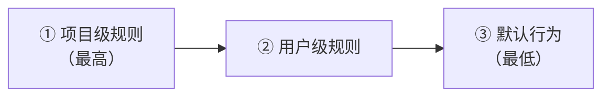

即：项目级规则 > 用户级规则 > 默认行为。项目级规则总能在当前项目覆盖更宽泛的设置，便于团队在共享仓库内统一约束。

---

### 3. 技能系统

#### 3.1 什么是技能？

**技能（Skills）** 是 AI 编码助手的能力扩展机制。需要精确界定它的定位：技能本质是一份 **Markdown 指令包**——由提示词、模板和规范组成，告诉 AI「在某种场景下应该怎么做」。它**不是**「调用外部工具」（那是 MCP 的职责，见 §4），而是把可重复的多步骤工作流沉淀成 AI 可加载的指令。

#### 3.2 SKILL.md 结构（两部分）

Claude Skills 的真实结构由两部分组成：**YAML frontmatter**（告诉 AI **何时**用）+ **Markdown 正文**（告诉 AI **如何**用）。

**frontmatter 部分**（C2，参考项目 `.claude/skills/doc-quick/SKILL.md`）：

```yaml
---
name: doc-quick              # 必填，技能的唯一标识（kebab-case）
description: "Markdown 文档快速操作助手。用于不需要完整 doc-do 工作流的简单文档任务……"  # 必填，何时触发
model: inherit               # 可选：inherit 或指定模型
color: blue                  # 可选：UI 颜色
icon: 📄                     # 可选：UI 图标
---
```

必填字段只有 `name` 和 `description`；`allowed-tools`（实验性）、`model`、`color`、`icon` 为可选。

**Markdown 正文部分**：

```markdown
# Markdown 文档写作助手

## 技能概览
（功能与触发关键词表格）

## 通用工作流模板
1. 扫描 → 找到目标文件
2. 分析 → 理解内容结构
3. 执行 → 实施修改
4. 确认 → 向用户报告结果

## 搜索验证规则
（涉及技术内容时必须搜索验证……）
```

正文才是技能的"肉"，包含执行步骤、模板、规范、决策规则等。

#### 3.3 Progressive Disclosure（渐进式披露）

Claude 启动时**不会**加载所有技能的完整正文，而是只扫描每个技能的 `name` + `description`（约 100 tokens/技能）。只有当 Claude 判断某技能匹配当前任务时，才加载完整 SKILL.md 正文。

**关键启示**：
- `description` 必须精准描述「何时用」，写得太模糊技能永远不会被触发
- 加载阶段几乎不占上下文，因此可以在项目中放很多技能而不拖慢启动
- 技能正文可以很长（含详细模板和规范），只在真正用到时才消耗上下文

#### 3.4 技能的触发方式

**方式一：斜杠命令**
```
/commit     → 触发代码提交
/organize   → 触发文档整理
/search     → 触发代码搜索
```

**方式二：关键词触发**
```
"帮我提交代码" → 自动识别需要 commit
"搜索这个错误" → 自动识别需要 search
```

**方式三：手动选择**
通过 UI 菜单选择需要的技能。

**底层机制**：Skill 工具的 description 实际上包含所有可用技能的 `name`/`description` 组合列表，模型据此判断是否调用某技能——这正是 Progressive Disclosure 在工具层的体现。

#### 3.5 常见技能类型

| 技能类型 | 功能 | 示例 |
|---------|------|------|
| **代码生成** | 根据描述生成代码 | "写一个用户登录接口" |
| **代码审查** | 分析代码问题 | "审查这段代码" |
| **调试助手** | 帮助定位和修复 bug | "这个报错怎么解决" |
| **文档生成** | 生成代码文档 | "为这个类生成文档" |
| **版本控制** | Git 操作 | "提交并推送代码" |
| **工作流编排** | 沉淀多步骤规范流程 | 项目中的 `doc-do`、`doc-quick`、`graphify` |

---

### 4. MCP协议详解

#### 4.1 什么是 MCP？

**MCP（Model Context Protocol，模型上下文协议）** 是一个标准化的开源协议，用于在 AI 大模型与外部工具、数据源之间建立统一的通信桥梁。由 Anthropic（Claude 的开发商）在 2024 年推出，旨在解决 AI 助手与各种外部服务集成时的碎片化问题。

**MCP 架构总图**（M4）：

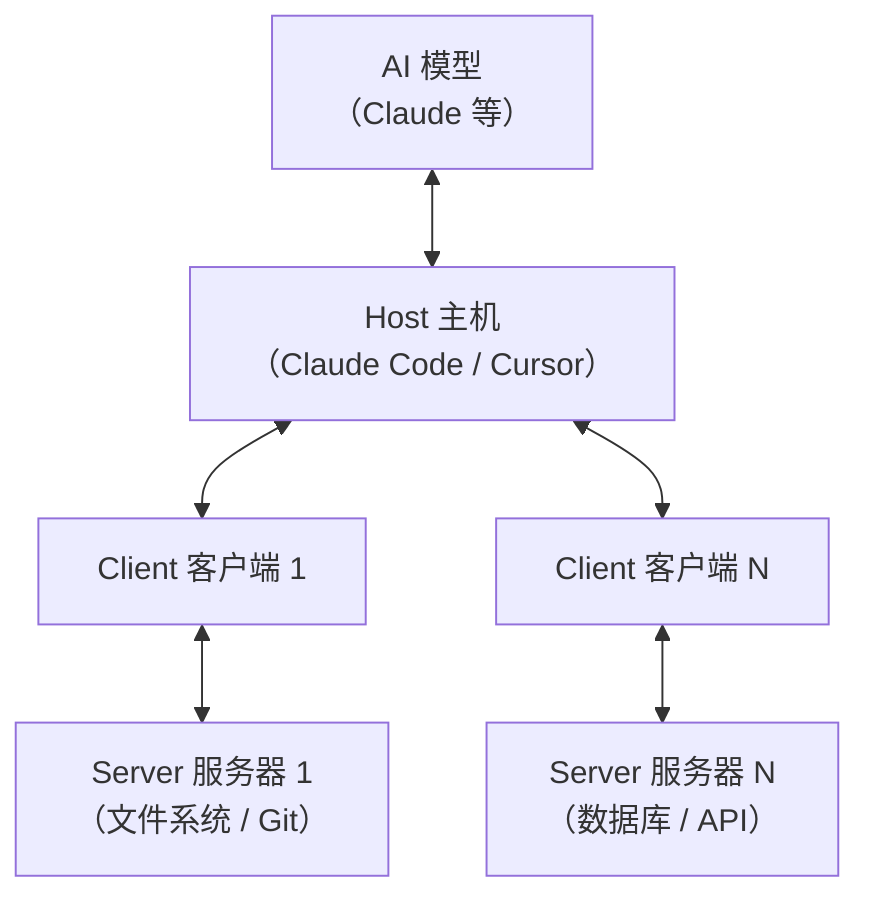

三个角色各司其职：**Host** 是管理 AI 模型的应用（IDE、聊天 app）；**Client** 是 Host 内部的连接器，与**单个** Server 维持 1:1 连接；**Server** 暴露能力（原语）给 Client。

#### 4.2 MCP 三大原语（精确区分）

MCP 的核心是三种原语（Primitives），按「控制方」维度区分（T2）：

| 原语 | 方向 | 控制方 | 本质 | 类比 |
|------|------|--------|------|------|
| **Tools** | Server → Model 调用 | **Model-controlled**（模型决定何时调用） | 模型可调用的函数/动作（带 `inputSchema`） | POST 接口 |
| **Resources** | Server 暴露给 Client | **App-controlled**（应用决定何时取） | 静态或动态数据/上下文（文件、DB schema、日志） | GET 接口 |
| **Prompts** | Server 提供给 User | **User-controlled**（用户主动选择） | 预定义可复用提示词模板（带 `arguments`） | UI 模板菜单 |

**关键区别**：Tools 由**模型**自主决定调用（autonomous，类似「模型想用就用」）；Resources/Prompts 由**应用或用户**决定（user-driven，类似「应用/用户主动取」）。这是初学 MCP 最容易混淆的点。

**三种原语的 JSON 定义示例**（C3）：

```json
{
  "tools": [
    {
      "name": "read_file",
      "description": "读取文件内容",
      "inputSchema": {
        "type": "object",
        "properties": { "path": { "type": "string" } },
        "required": ["path"]
      }
    }
  ],
  "resources": [
    {
      "uri": "file:///project/README.md",
      "name": "project-readme",
      "mimeType": "text/markdown"
    }
  ],
  "prompts": [
    {
      "name": "git-commit",
      "description": "生成 Git 提交信息",
      "arguments": [
        { "name": "changed_files", "description": "变更的文件列表", "required": true }
      ]
    }
  ]
}
```

#### 4.3 传输层与工作原理

**传输层（Transports）— 重要更正**

MCP 规范（2025-06-18 起）规定两种推荐传输：

- **stdio**：本地进程通信，推荐优先使用（规范要求 Clients SHOULD support stdio whenever possible）
- **Streamable HTTP**：当前推荐的 HTTP 传输，2025-06-18 引入
  - **单端点**（取代旧 HTTP+SSE 的双端点设计）
  - 可选 SSE 升级做 server→client 流式
  - 集成 OAuth 2.1 授权
- **HTTP+SSE（旧双端点传输）**：**已废弃**（deprecated），新项目不应使用

> ⚠️ 早期文档常写成「TCP/STDIO」并不准确，正确表述是「stdio 或 Streamable HTTP」。

**MCP 连接流程**（M5，三阶段生命周期）：

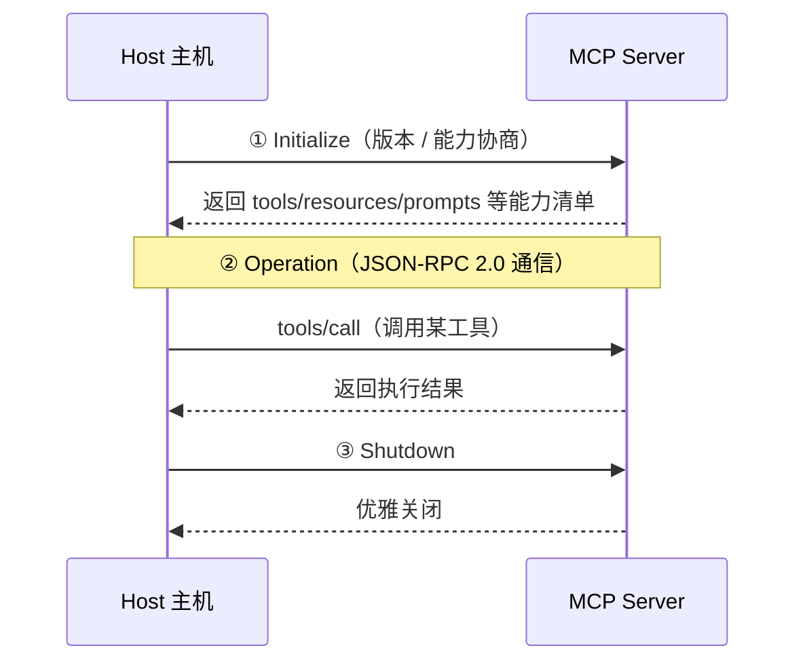

**工具调用示例**（M6）：

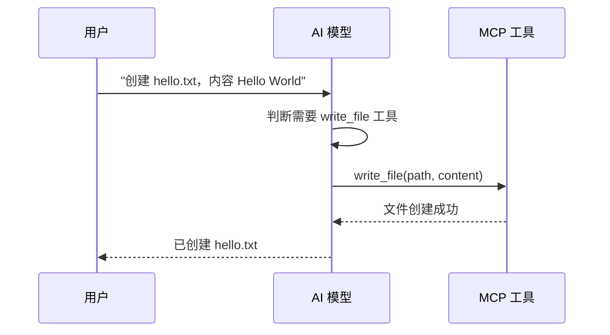

#### 4.4 Host / Client / Server 生命周期

进一步精确化三者关系（T3）：

| 角色 | 职责 | 数量关系 |
|------|------|----------|
| **Host** | 管理 AI 模型，编排多个 Client | 一个 Host 含多个 Client |
| **Client** | 与**单个** Server 维持 1:1 连接，路由请求 | 每个 Client 对应一个 Server |
| **Server** | 暴露能力（原语）给 Client | 一个 Server 可被多个 Host 的 Client 连接 |

**三阶段生命周期**（来源 CodiLime / MCP 规范）：

1. **Initialize（初始化）**：版本与能力协商。Client 与 Server 互相声明支持的能力（tools / resources / prompts / sampling / roots 等），协商协议版本。
2. **Operation（运行）**：进入正常 JSON-RPC 2.0 通信，按需调用原语、传递通知。
3. **Shutdown（关闭）**：优雅关闭连接，释放资源。

#### 4.5 MCP 高级能力（反向请求机制）

除三大原语外，MCP 还定义了三种「反向请求」高级能力——它们让 Server 不只是被动提供能力，还能主动向 Client/Host/User 发起请求（T4）：

| 能力 | 方向 | 作用 | 典型场景 |
|------|------|------|----------|
| **Roots** | Client → Server | Client 暴露 URI/文件作为工作区边界给 Server | 让 Server 知道项目根目录、实现 workspace 感知 |
| **Sampling** | Server → Client | Server 请求 Client/Host 的 LLM 生成补全 | Server 需要推理但不内置 LLM，复用宿主模型 |
| **Elicitation** | Server → Client → User | Server 请求结构化用户输入（带 schema 校验） | 工具执行中途问用户确认 / 补充信息 |

**方向记忆法**：Tools / Resources / Prompts 是 Server→Client 的「能力暴露」（Server 把能做的事告诉 Client）；Roots / Sampling / Elicitation 是双向的「增强能力」（让协议更灵活、更可交互）。

#### 4.6 常用 MCP 服务器

**官方维护的服务器**

| 服务器 | 功能 | 安装命令 |
|--------|------|----------|
| **Filesystem** | 本地文件读写 | `npx @modelcontextprotocol/server-filesystem` |
| **Git** | Git 操作 | `npx @modelcontextprotocol/server-git` |
| **GitHub** | GitHub API | `npx @modelcontextprotocol/server-github` |
| **Brave Search** | 网页搜索 | `npx @modelcontextprotocol/server-brave-search` |
| **Sequential Thinking** | 渐进式思考 | `npx @modelcontextprotocol/server-sequential-thinking` |

**社区服务器**

| 服务器 | 功能 |
|--------|------|
| **PostgreSQL** | 数据库操作 |
| **MySQL** | 数据库操作 |
| **Slack** | 消息通知 |
| **Puppeteer** | 浏览器自动化 |
| **Memory** | 知识图谱存储 |

#### 4.7 MCP 配置示例

**本地文件系统服务器**

```jsonc
// claude.json 配置示例
{
  "mcpServers": {
    "filesystem": {
      "command": "npx",
      "args": ["-y", "@modelcontextprotocol/server-filesystem", "/Users/ziogn/projects"]
    }
  }
}
```

**多服务器配置**

```json
{
  "mcpServers": {
    "filesystem": {
      "command": "npx",
      "args": ["-y", "@modelcontextprotocol/server-filesystem", "./src"]
    },
    "git": {
      "command": "npx",
      "args": ["-y", "@modelcontextprotocol/server-git"]
    }
  }
}
```

> 💡 **Gotcha（项目级配置位置）**：项目级 MCP 配置应放在**项目根目录的 `.mcp.json`**，而不是 `.claude/.mcp.json`。用户级配置则放在 `~/.claude.json`。放错位置会导致 Claude Code 找不到该项目级 server。

#### 4.8 技能 vs 子代理 vs MCP 工具（三方决策表）

当前读者最容易混淆的三种扩展机制是 **Skill / Subagent / MCP Tool**。它们本质不同，选错了既浪费又会出问题（T5）：

| 机制 | 本质 | 上下文 | 何时选 |
|------|------|--------|--------|
| **Skill** | Markdown 指令包（提示词 + 模板 + 规范） | **共享**主上下文 | 可重复的多步骤工作流 / 规范（如 doc-do、commit 规范） |
| **Subagent** | 隔离的 Claude 实例 | **独立**上下文窗口 | 需要上下文隔离的专门任务（如搜索、验证、审查） |
| **MCP Tool** | 外部进程暴露的函数 | **无状态**函数调用 | 访问外部系统 / 数据（DB、API、文件系统） |

**互补关系**（M7）：

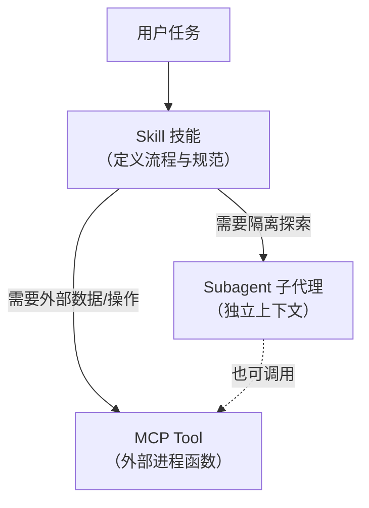

简记：**Skill 管"怎么做"，Subagent 管"独立干"，MCP 管"连外部"**。三者经常组合使用——一个 Skill 可以编排多个 Subagent，每个 Subagent 又可调用 MCP 工具。

#### 4.9 MCP 最佳实践与生态

**安全配置**

```jsonc
{
  "mcpServers": {
    "filesystem": {
      "command": "npx",
      "args": [
        "-y",
        "@modelcontextprotocol/server-filesystem",
        "./src",        // 只允许访问 src 目录
        "./tests"       // 和 tests 目录
      ]
    }
  }
}
```

**生产环境建议**

| 实践 | 说明 |
|------|------|
| **最小权限** | 只暴露必要的目录和功能 |
| **环境变量** | 使用环境变量存储敏感凭证 |
| **版本锁定** | 锁定 MCP 服务器版本 |
| **监控日志** | 记录工具调用日志 |
| **定期更新** | 及时更新安全补丁 |

**调试技巧**

```bash
# 在 Claude Code 中使用 /mcp 命令查看连接状态
# 测试工具可用性：在对话中直接询问 "有哪些 MCP 工具可用？"
```

**为什么 MCP 重要？**

1. **标准化**：统一的协议减少集成工作量
2. **可扩展**：轻松添加新的工具和数据源
3. **可移植**：一次配置，多个 AI 助手可用
4. **安全可控**：清晰的权限控制

**发展趋势**

- 当前（2024-2025）：基础工具（文件系统、Git、搜索）、简单数据源（数据库）、社区贡献服务器
- 未来（2025+）：企业级集成（CRM、ERP）、AI Agent 协作、自动化工作流、更多垂直领域服务器

---

### 5. Agent智能体系统

#### 5.1 什么是 Agent？

**Agent（智能体/代理）** 是具有特定职责和自主能力的 AI 程序。与普通的 AI 对话不同，Agent 可以：
- 自主规划和分解任务
- 调用多种工具完成复杂操作
- 保持状态并持续执行多步骤工作

**Anthropic 核心论点**（《Building Effective AI Agents》）：最成功的 Agent 实现用**简单、可组合的模式**，而不是复杂的框架。理解这一点能避免在 Agent 设计上过度工程化——往往几个简单模式的组合，效果优于一个臃肿的"全能框架"。

#### 5.2 Agent 与普通 AI 的区别

| 特性 | 普通 AI 对话 | Agent 智能体 |
|------|-------------|-------------|
| 交互方式 | 问答式，一次一轮 | 自主执行，持续工作 |
| 工具调用 | 需要明确指示 | 可以自动判断和调用 |
| 任务跨度 | 单次问答 | 多步骤复杂任务 |
| 状态保持 | 依赖上下文窗口 | 可长期保持任务状态 |

#### 5.3 Agent 设计模式（Anthropic 5 种 + ReAct）

Anthropic 定义了从「最不 agentic」到「最 agentic」的渐进谱系（T6）：

| 模式 | 自主度 | 结构 | 适用场景 |
|------|--------|------|----------|
| **Prompt Chaining** | 低 | 任务分解为顺序 LLM 调用串 | 流程固定的任务（生成 → 验证 → 翻译） |
| **Routing** | 低 | 分类输入，导向专门处理者 | 客服分流、不同类型走不同逻辑 |
| **Parallelization**（Sectioning / Voting） | 中 | 多个 LLM 调用同时跑 | 独立子任务、投票提升质量 |
| **Orchestrator-Workers** | 中高 | 一个 LLM 动态协调其他 LLM（workers） | 复杂任务、子任务数不确定（"golden pattern"） |
| **Evaluator-Optimizer**（Reflection） | 中高 | 一个 LLM 生成，另一个评估，循环改进 | 有明确评估标准的迭代优化 |
| **Agentic（ReAct 式）** | 高 | 自主推理 + 行动循环，用工具 | 开放式、步骤数不确定的复杂任务 |

> 💡 **golden pattern**：Orchestrator-Workers 被 Anthropic 标注为"黄金模式"——主 agent 动态拆解任务、按需分配给 worker、再汇总，适合大多数真实复杂场景。

**ReAct（Reasoning + Acting）**：Agent 在循环中交替「**思考**（Thought）→ **行动**（Action / Tool use）→ **观察**（Observation）」，直到完成任务。这是 Claude Code 等编码 agent 的核心循环——你看到的「读文件 → 改代码 → 跑测试 → 根据结果再改」正是 ReAct 的体现。

**Agent 设计模式谱系**（M9）：

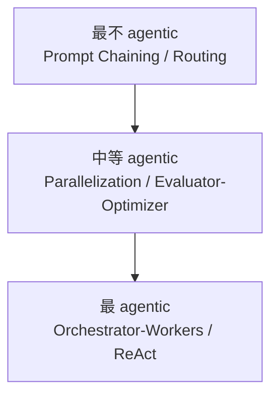

#### 5.4 Tool Use（函数调用）机制

Agent 自主能力的底层是 **Tool Use（工具调用 / 函数调用）**，它的循环是：

1. 模型输出结构化的工具调用请求（含工具名 + 参数 JSON）
2. Host 执行工具，把结果作为 Observation（观察）回灌
3. 模型基于结果决定下一步（继续调用别的工具、总结、或结束）

**Tool use 请求/响应 JSON 结构**（C4）：

```jsonc
// 模型发起的工具调用请求（response 中）
{
  "type": "tool_use",
  "name": "get_weather",
  "input": { "city": "Shanghai", "unit": "celsius" }
}

// Host 执行后回灌的工具结果（下一轮 request 中）
{
  "type": "tool_result",
  "tool_use_id": "toolu_01ABC",
  "content": "Shanghai 当前 28°C，晴"
}
```

模型并不"真的"执行工具——它只是产出「我想调用 get_weather，参数是……」的结构化指令，真正的执行由 Host 完成，结果再喂回模型。这种分离让模型可以安全地驱动任意工具，而宿主保持对执行的完全控制。

#### 5.5 Subagent 与上下文隔离

**Subagent（子代理）** 是 Agent 体系里非常关键的模式：一个隔离的 Claude 实例，拥有**独立、干净的上下文窗口**，预装自己的 system prompt 和受限的工具集（T7）：

| 维度 | 说明 |
|------|------|
| **核心价值** | 独立上下文窗口，把搜索/分析的中间产物隔离在子代理内，不污染主代理上下文（避免主上下文爆炸） |
| **代价** | 子代理上下文相对"贫瘠"（context-poor），重要上下文需显式传入，不能假设它知道主代理的一切 |
| **预装内容** | 自己的 system prompt（在 `.claude/agents/*.md` 正文里定义）+ 受限工具集 |
| **可调用 MCP** | 是，子代理可调用 MCP 工具访问外部 |
| **递归限制** | 不能再开子代理（避免无限嵌套） |
| **返回方式** | 只返回单条最终消息给主代理，中间过程不外泄 |

典型用法：让主代理把"在 200 个文件里搜索某个模式"这种会产生大量中间产物的任务委派给 search subagent，subagent 在自己的上下文里翻完所有文件，只把精炼的结论返回——主代理的上下文保持干净。

#### 5.6 Agent 的配置结构

一个 Agent 配置文件（如 Claude Code 的 `.claude/agents/*.md`）由两部分组成：**YAML frontmatter**（元数据）+ **Markdown 正文**（作为 system prompt）：

```yaml
---
name: git-manager              # 必填，Agent 名称
description: "Git 版本控制专家……"  # 必填，描述何时委派给此 Agent
model: opus                     # 使用的 AI 模型（opus / sonnet / haiku / inherit）
# 可选 tools 列表（限制工具访问，注意：当前版本 allowed-tools 限制可能未完全生效）
---

（markdown 正文 = 该 Agent 的 system prompt）
你是专业的 Git 版本控制专家，负责代码提交和推送的完整工作流程。
……
```

正文就是该 Agent 被委派时使用的 system prompt，定义它的角色、工作流程、规范。

#### 5.7 常见 Agent 类型

| Agent 类型 | 职责 | 适用场景 |
|-----------|------|----------|
| **代码开发 Agent** | 编写和修改代码 | 功能开发、Bug 修复 |
| **代码审查 Agent** | 审查代码质量 | PR 审查、代码检查 |
| **文档 Agent** | 生成和管理文档 | 写文档、整理文档 |
| **测试 Agent** | 编写测试用例 | 单元测试、集成测试 |
| **运维 Agent** | 部署和运维 | 服务器部署、监控 |
| **数据 Agent** | 数据分析和处理 | 数据处理、报表生成 |

---

### 6. 多代理团队协作

#### 6.1 为什么需要多代理？

现实中的复杂任务往往需要多种能力：
- 写代码 + 写测试 + 部署
- 查文档 + 写代码 + 提交

单个 Agent 难以面面俱到，**多代理协作**可以：

1. **专业化分工**：每个 Agent 专注特定领域
2. **并行工作**：多个 Agent 同时处理不同任务
3. **质量保障**：不同 Agent 互相检查和补充

#### 6.2 协作模式（映射 Claude Code 实现）

**模式一：主从协作 / Orchestrator-Worker**（M10）

主 Agent 作为协调者，理解需求、动态分配任务给子 Agent、汇总结果。Claude Code 中对应主 Agent 通过 Agent 工具调用多个 subagent：

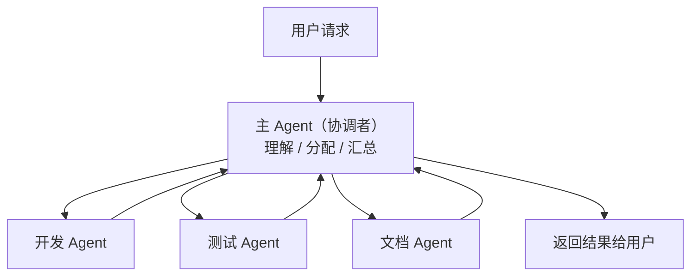

适用场景：子任务数动态、需要协调。这正是 Anthropic 标注的 "golden pattern"。

**模式二：流水线协作 / Pipeline**（M11）

任务沿固定流程串行传递，每一步由专门的 Agent 处理。本项目的 `doc-do` 工作流就是典型流水线：


适用场景：固定流程、每步专业化。

**模式三：并行协作 / Parallel + worktree**（M12）

多个 Agent 同时执行独立子任务，最后合并结果。Claude Code 中对应并行 subagent + 各自 git worktree 隔离：

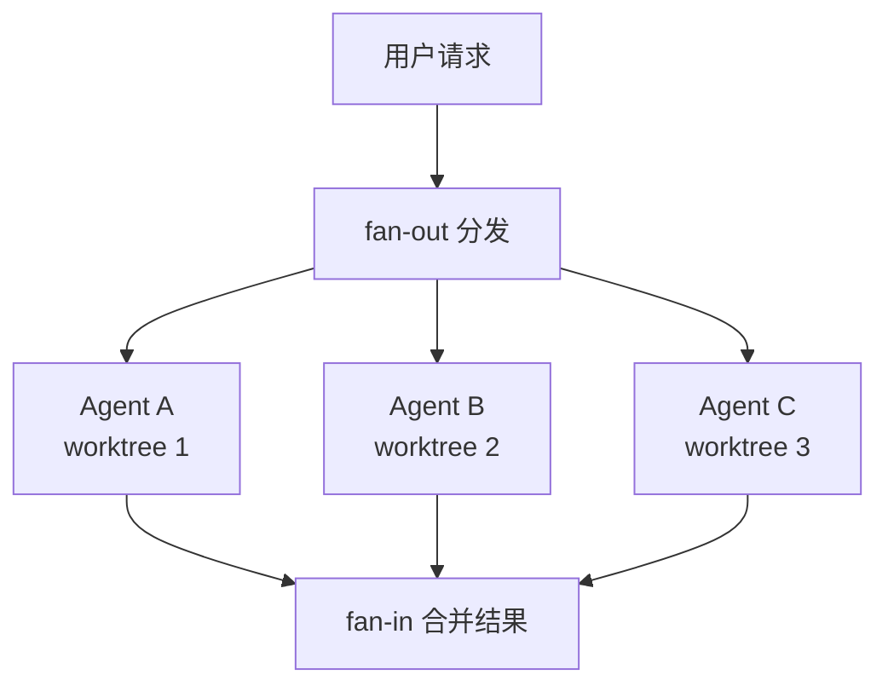

适用场景：独立子任务、需避免文件冲突。

#### 6.3 Claude Code worktree 隔离与 Agent Teams

Claude Code 在多代理隔离上有几个值得注意的具体机制：

**worktree 隔离**：
- subagent 和用户手动开的 session 可以各自使用独立的 git worktree 隔离，互不干扰
- **但 agent teams 不隔离 worktree**（重要区分）
- 已知 bug（[Issue #33045](https://github.com/anthropics/claude-code/issues/33045)）：`isolation: "worktree"` 对 team 当前可能不生效

**Agent Teams**（实验特性）：
- 一个 session 当 team lead，协调多个 Claude Code 实例
- 默认禁用，需 `CLAUDE_CODE_EXPERIMENTAL_AGENT_TEAMS=1` 环境变量启用
- 通过**共享任务列表**（shared task list）+ status flag 协调，避免冲突
- 适合需要多个 Claude 实例长期并行推进的大型任务

#### 6.4 协作示例

**场景：完成一个功能并部署**（M13）

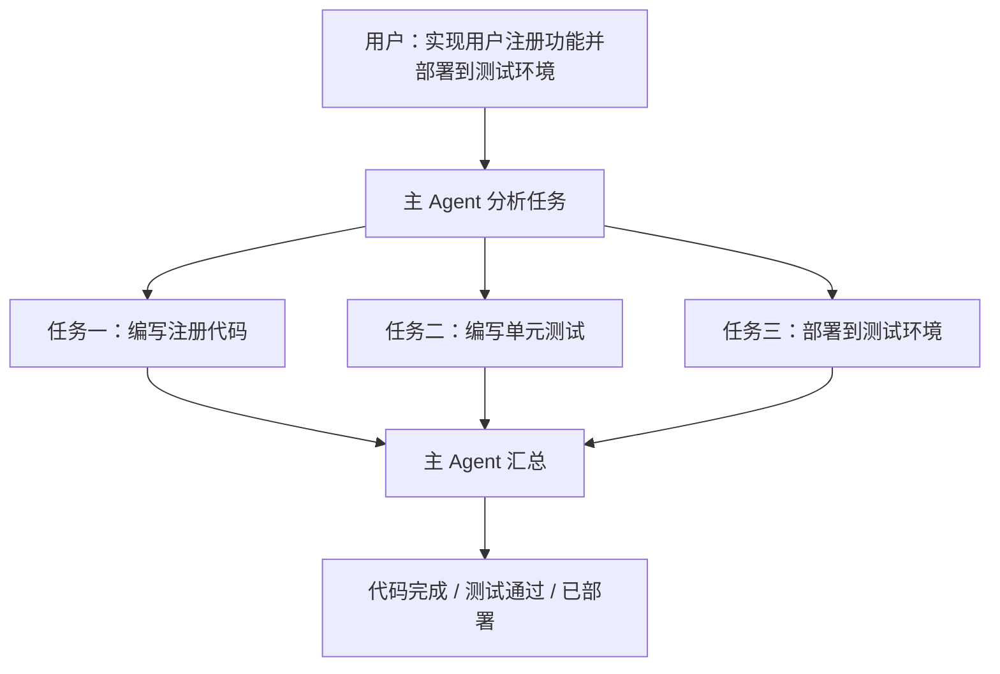

#### 6.5 多代理配置示例

```json
{
  "team": [
    {
      "name": "git-manager",
      "role": "version-control",
      "description": "负责代码提交和版本控制"
    },
    {
      "name": "code-reviewer",
      "role": "code-review",
      "description": "负责代码审查和质量检查"
    },
    {
      "name": "doc-writer",
      "role": "documentation",
      "description": "负责文档编写和更新"
    }
  ],
  "workflow": {
    "default": "sequential",
    "on_deploy": ["git-manager", "code-reviewer", "deploy-agent"]
  }
}
```

#### 6.6 多代理最佳实践

| 原则 | 说明 |
|------|------|
| **明确分工** | 每个 Agent 有清晰的职责边界 |
| **定义接口** | Agent 之间传递的信息格式要明确 |
| **错误处理** | 某个 Agent 失败时的回退策略 |
| **结果验证** | 最终结果需要主 Agent 确认 |
| **状态同步** | 保持各 Agent 之间的状态一致 |

---

## 第二部分：进阶应用

本部分介绍如何利用规则、技能和代理创建自定义工作流，以及性能优化和安全实践。

### 7. 自定义工作流

#### 7.1 什么是自定义工作流？

**自定义工作流**是将规则、技能和 Agent 有机组合的自动化流程。通过预先定义好的工作流，用户可以让 AI 按照既定步骤完成复杂任务，确保工作过程规范、可控、可重复。

#### 7.2 为什么需要自定义工作流？

在日常开发中，很多任务有固定的处理模式：
- 代码提交：检查状态 → 分析变更 → 编写提交信息 → 提交 → 推送
- Bug 修复：复现问题 → 定位代码 → 修复 → 编写测试 → 验证
- 功能开发：需求分析 → 设计实现 → 编写测试 → 代码审查 → 合并

每次都手动指挥 AI 执行这些步骤效率低下，**自定义工作流**可以：
1. **自动化执行**：减少重复性指令
2. **规范化操作**：确保每一步都按照规范执行
3. **可追溯性**：完整记录执行过程
4. **可复用性**：相同类型的任务可以重复使用

#### 7.3 工作流的组成要素

自定义工作流由规则、技能、代理三层组合，配合工作流引擎调度（M14）：

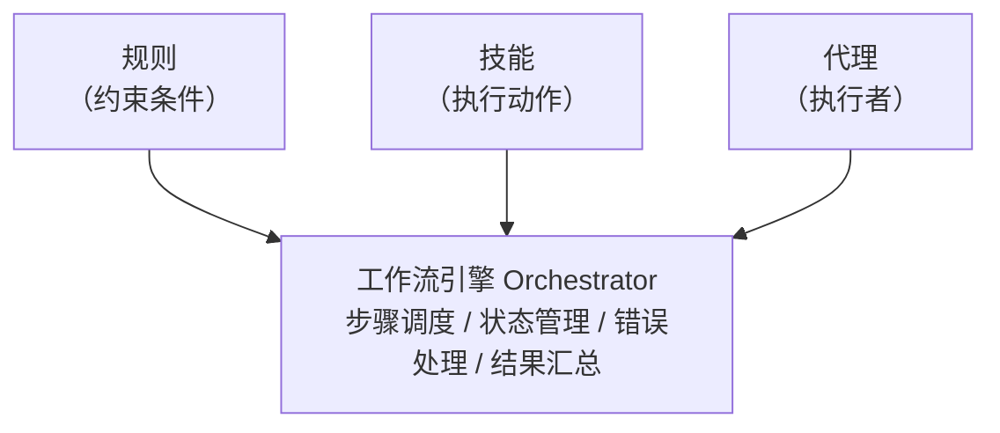

#### 7.4 工作流类型

**类型一：线性工作流**

按固定顺序执行的步骤，每一步完成后自动进入下一步。

```
任务输入 → 步骤1 → 步骤2 → 步骤3 → 最终结果
```

**适用场景**：流程固定的任务，如"代码提交工作流"、"发布工作流"

**类型二：条件分支工作流**

根据中间结果选择不同的执行路径（M15）：

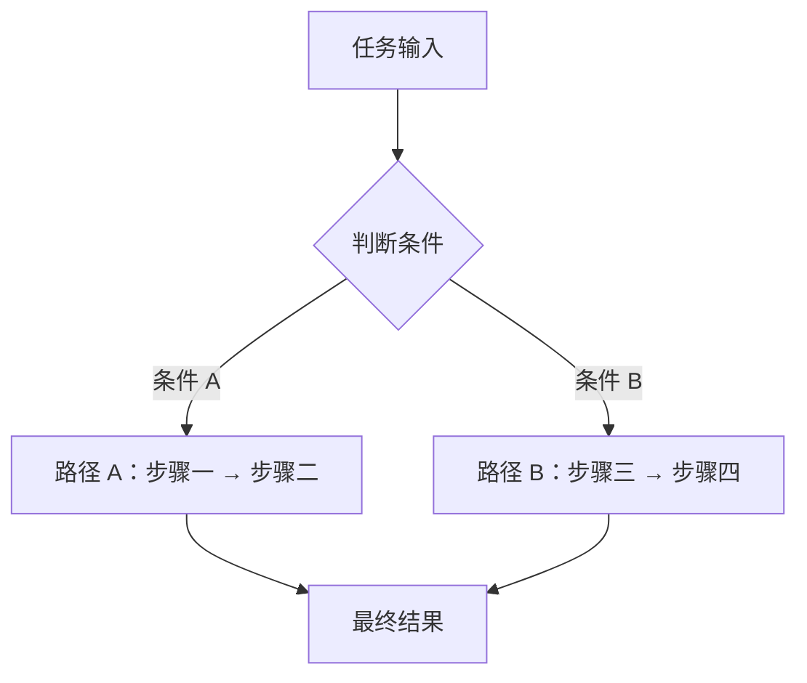

**适用场景**：需要根据情况做出决策的任务，如"Bug修复工作流"

**类型三：并行工作流**

多个步骤同时执行，最后汇总结果。

```
        ┌─→ 分支1: 步骤A
任务输入 ┼─→ 分支2: 步骤B
        └─→ 分支3: 步骤C
            ↓
        合并结果 → 最终输出
```

**适用场景**：可以同时进行的多任务，如"全面代码审查"

#### 7.5 工作流配置示例

**示例一：代码提交工作流**

```yaml
---
name: git-commit-workflow
description: 规范的代码提交流程
triggers:
  - "提交代码"
  - "commit"
  - "提交"
---

# 工作流步骤

## 步骤1: 检查状态
- 检查 git status
- 显示变更文件列表

## 步骤2: 分析变更
- 区分文件类型（代码/配置/文档）
- 识别变更性质（新增/修改/删除）

## 步骤3: 编写提交信息
- 按照 Conventional Commits 格式
- 规则: `<type>: <description>`

## 步骤4: 执行提交
- git add <files>
- git commit -m "<message>"

## 步骤5: 推送到远程（可选）
- 询问是否需要推送
- 如需要，执行 git push
```

**示例二：Bug 修复工作流**

```yaml
---
name: bug-fix-workflow
description: 规范的 Bug 修复流程
triggers:
  - "修复bug"
  - "fix bug"
  - "修复问题"
---

# 工作流步骤

## 步骤1: 复现问题
- 分析错误信息
- 尝试复现 bug

## 步骤2: 定位根因
- 阅读相关代码
- 找出问题根源

## 步骤3: 制定修复方案
- 分析影响范围
- 制定修复计划

## 步骤4: 执行修复
- 修改代码
- 编写或更新测试

## 步骤5: 验证修复
- 运行测试
- 确认问题已解决
```

#### 7.6 工作流的高级特性

**错误处理与回退**

```yaml
workflow:
  name: deploy-workflow

  on_error:
    - 记录错误日志
    - 通知相关人员
    - 回滚变更
    - 输出错误报告

  retry:
    max_attempts: 3
    delay_seconds: 5
    strategy: exponential_backoff
```

**状态持久化**

```yaml
workflow:
  name: multi-task-workflow

  checkpoint:
    enabled: true
    save_after:
      - step_1_complete
      - step_2_complete
      - step_3_complete

  resume:
    enabled: true
```

**人工确认点**

```yaml
workflow:
  name: production-deploy

  approval_points:
    - step: before_deploy
      message: "确认要部署到生产环境吗？"
      required: true
```

#### 7.7 实际应用场景

**场景一：自动化代码审查**

```
用户输入: "审查这个 PR"

工作流执行:
  1. 获取 PR 变更内容
  2. 并行执行多个审查维度
     - 代码风格检查
     - 安全性检查
     - 性能检查
     - 最佳实践检查
  3. 汇总审查结果
  4. 输出最终审查意见
```

**场景二：自动化文档生成**

```
用户输入: "为这个模块生成文档"

工作流执行:
  1. 读取模块代码
  2. 提取关键类和函数
  3. 生成 API 文档
  4. 生成使用示例
  5. 检查文档完整性
  6. 输出完整文档
```

#### 7.8 工作流最佳实践

| 原则 | 说明 |
|------|------|
| **单一职责** | 每个工作流专注完成一类任务 |
| **步骤精简** | 步骤不宜过多，建议 5-7 步为宜 |
| **明确触发** | 关键词触发条件要明确 |
| **错误处理** | 必须考虑失败情况的处理 |
| **可观测性** | 每一步执行要有清晰的日志输出 |
| **可测试性** | 复杂工作流要先在测试环境验证 |

#### 7.9 创建自定义工作流的步骤

1. **分析任务流程**
   - 梳理任务的完整步骤
   - 识别可自动化和需人工确认的环节

2. **定义规则约束**
   - 明确每一步的规范要求
   - 设置检查点和验收标准

3. **配置技能调用**
   - 确定需要使用的技能
   - 定义输入输出格式

4. **指定 Agent 执行**
   - 选择合适的 Agent 类型
   - 配置 Agent 的行为参数

5. **组装并测试**
   - 组合成完整工作流
   - 在测试场景中验证

6. **迭代优化**
   - 根据使用反馈调整
   - 不断完善工作流细节

---

### 8. 性能优化

#### 8.1 上下文管理优化

**策略一：按需加载**
```
# 只加载当前任务相关的文件
@src/user service.ts    # 只引用需要的文件
@tests/user service.test.ts
```

**策略二：分层记忆**
```yaml
memory/
├── global-context.md     # 项目全局信息（始终加载）
├── module-context/       # 按模块加载
│   ├── user-module.md
│   └── order-module.md
└── task-context/         # 按任务加载
    └── current-task.md
```

**策略三：摘要优先**
```
# 不加载完整代码，而是加载摘要
## UserService 摘要
- 位置: src/services/UserService.ts
- 主要方法: login(), register(), logout()
- 依赖: AuthService, UserRepository
```

#### 8.2 Token 使用优化

**Token 消耗的主要来源**

| 来源 | 占比 | 优化方式 |
|------|------|----------|
| 对话历史 | 40-60% | 定期总结，压缩历史 |
| 代码文件 | 20-30% | 使用摘要而非全文 |
| 规则文件 | 10-15% | 精简规则，按需加载 |
| 系统提示 | 5-10% | 优化提示词结构 |

> 💡 **隐性成本大头**：除了上表的显性 token，**prompt cache miss** 是另一项容易被忽视的开销——频繁切会话 / 开新上下文会反复触发 cache write（见 §1.5）。长会话保持连续性，往往比"反复开新窗口"更省钱。

**高效 prompt 技巧**

**技巧一：明确任务边界**
```
# 不推荐
帮我看看这个代码有什么问题

# 推荐
检查 src/services/auth.ts 中的登录函数：
1. 是否有SQL注入风险
2. 密码存储是否安全
```

**技巧二：提供结构化输入**
```
# 推荐
## 问题描述
- 用户反馈：无法登录
- 复现条件：账号密码正确但提示"用户不存在"
- 错误日志：AuthService.java:42 NullPointerException

## 需要分析
1. 可能的原因
2. 排查方向
```

**技巧三：分步执行而非一次询问**
```
# 推荐（分步请求）
1. 先实现用户注册和登录
2. 测试通过后再实现个人信息修改
3. 依次实现剩余功能
```

#### 8.3 响应速度优化

**工具调用优化**

| 优化方式 | 说明 |
|----------|------|
| 批量读取 | 一次性读取多个相关文件，而非逐个 |
| 缓存结果 | 避免重复读取未变更的文件 |
| 异步操作 | 并行执行独立的工具调用 |
| 限制范围 | 指定具体文件/目录，避免全局搜索 |

**模型选择策略（2026 模型家族）**

| 场景 | 推荐模型 | 原因 |
|------|----------|------|
| 简单代码生成 / 多代理 worker | Haiku 4.5 | 最快最省，$1/$5，多代理场景优选 |
| 日常开发 / 编码辅助 | Sonnet 5 | 最具 agent 能力的 Sonnet；intro 价 $2/$10 性价比极高 |
| 代码审查 / 日常开发 | Sonnet 4.6 | Free/Pro 默认，平衡速度和能力，$3/$15 |
| 复杂架构设计 / 深度推理 | Opus 4.8 | 最强通用模型，$5/$25 |
| 最高难度 / benchmark 级任务 | Fable 5 | Mythos 级最强，$10/$50，按需选用 |

> 💡 多代理场景下，把 worker subagent 配置成 Haiku 4.5（`model: haiku`）能显著降低并行成本；主协调 Agent 用 Opus 4.8 保证质量。

---

### 9. 安全实践

#### 9.1 敏感信息保护

**常见敏感信息类型**

| 类型 | 示例 | 风险等级 |
|------|------|----------|
| **认证凭证** | API密钥、Token、密码 | 极高 |
| **个人隐私** | 身份证、手机号、邮箱 | 高 |
| **业务机密** | 定价策略、用户数据 | 高 |
| **基础设施** | 数据库连接、服务器地址 | 中高 |
| **内部信息** | 员工信息、代码仓库地址 | 中 |

**敏感信息处理规则**

```markdown
# 安全规则 - 敏感信息保护

## 禁止行为
- 禁止在对话中直接提供真实的生产环境凭证
- 禁止上传包含敏感信息的日志文件
- 禁止在代码注释中保留调试用的密钥
- 禁止通过 AI 服务传输隐私数据

## 必须遵守
- 使用环境变量或配置文件管理密钥
- 使用 .env 文件并加入 .gitignore
- 敏感操作需要二次确认
- 定期轮换 API 密钥
```

**安全工作区配置**

```json
{
  "security": {
    "allowedDirectories": ["/project/src", "/project/test"],
    "blockedPatterns": ["**/.env", "**/credentials.json", "**/*.key"],
    "confirmationRequired": ["delete", "force-push", "deploy"]
  }
}
```

#### 9.2 代码安全审查

**AI 辅助安全审查要点**

```markdown
# 安全审查清单

## 输入验证
- [ ] 所有用户输入是否经过验证？
- [ ] 边界条件是否被处理？
- [ ] 特殊字符是否被正确转义？

## 认证授权
- [ ] 敏感操作是否需要认证？
- [ ] 权限检查是否在服务端执行？

## 数据保护
- [ ] 敏感数据是否加密存储？
- [ ] 密码是否使用强哈希算法？
- [ ] API响应是否暴露敏感信息？

## 常见漏洞检查
- [ ] SQL注入：使用参数化查询
- [ ] XSS：输出转义
- [ ] CSRF：使用Token验证
- [ ] 命令注入：避免直接执行用户输入
```

**自动安全检查集成**

AI 生成代码后，可自动执行以下三类安全检查：

##### 9.2.1 硬编码检查
- 搜索: `password=`, `api_key=`, `token=`, `secret=`
- 如发现，提示使用环境变量

##### 9.2.2 不安全函数检查
- Java: `Runtime.exec()`, `String.format()`
- Python: `eval()`, `exec()`, `os.system()`
- JavaScript: `eval()`, `new Function()`

##### 9.2.3 依赖漏洞检查
- 运行: `npm audit` / `pip-audit`
- 报告高危漏洞

#### 9.3 权限控制

**项目级权限配置**

```json
{
  "permissions": {
    "read": {
      "enabled": true,
      "scope": ["src/**", "test/**", "docs/**"]
    },
    "write": {
      "enabled": true,
      "scope": ["src/**", "test/**"],
      "requireConfirmation": ["**/*.env", "**/config/*"]
    },
    "execute": {
      "enabled": true,
      "allowedCommands": ["npm", "git", "flutter", "docker"],
      "blockedCommands": ["rm -rf /", "format c:", "dd"]
    }
  }
}
```

**操作确认机制**

```yaml
# 需要确认的危险操作
dangerous_operations:
  - operation: "git push --force"
    confirmation: "强制推送会覆盖远程历史，确定继续？"

  - operation: "deploy to production"
    confirmation: "部署到生产环境需要额外验证"
    additional_check:
      - verify_branch: "main"
      - require_approval: true
```

#### 9.4 安全工作流最佳实践

| 实践 | 说明 |
|------|------|
| **最小权限原则** | 只授予完成任务所需的最小权限 |
| **敏感数据隔离** | 生产凭证与开发环境分离 |
| **操作审计日志** | 记录所有敏感操作的完整日志 |
| **定期安全审查** | 使用 AI 定期进行安全扫描 |
| **应急响应计划** | 制定泄露后的应急处理流程 |
| **团队安全培训** | 普及安全意识和最佳实践 |

---

## 第三部分：工程实践

本部分介绍如何将 AI 编码助手集成到工程流程中，实现自动化和规范化。

### 10. CI/CD集成

#### 10.1 CI/CD 集成方式

AI 辅助贯穿 CI/CD 流水线的各个阶段（M16）：

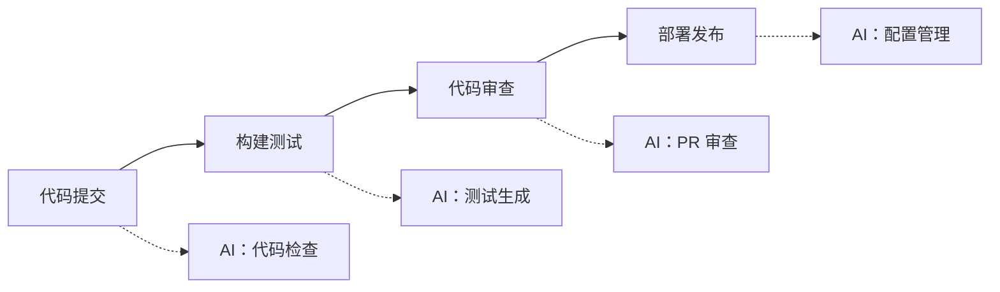

**集成方式对比**

| 方式 | 优点 | 缺点 | 适用场景 |
|------|------|------|----------|
| **Webhook 触发** | 实时性好 | 需要服务暴露 | 小团队 |
| **CLI 集成** | 简单灵活 | 需要人工触发 | 开发阶段 |
| **API 调用** | 可定制性强 | 开发成本高 | 大型项目 |
| **MCP 协议** | 标准化的 | 工具支持有限 | 新项目 |

#### 10.2 自动化代码质量检查

**Git Hooks 集成**

```bash
#!/bin/bash
# pre-commit hook - AI 辅助代码检查

echo "Running AI code review..."

# 获取变更文件
CHANGED_FILES=$(git diff --cached --name-only --diff-filter=ACM)

# 调用 AI 审查
claude code --review --files "$CHANGED_FILES"

if [ $? -ne 0 ]; then
    echo "AI review found issues. Please fix before committing."
    exit 1
fi

echo "AI review passed!"
exit 0
```

**CI 流水线中的 AI 审查**

```yaml
# .github/workflows/ai-review.yml

name: AI Code Review

on:
  pull_request:
    branches: [main, develop]

jobs:
  ai-review:
    runs-on: ubuntu-latest
    steps:
      - uses: actions/checkout@v4

      - name: Run AI Code Review
        uses: anthropic/claude-code-action@v1
        with:
          task: review
          files: ${{ github.event.pull_request.changed_files }}
        env:
          ANTHROPIC_API_KEY: ${{ secrets.ANTHROPIC_API_KEY }}
```

#### 10.3 智能测试生成

**测试生成工作流**

```yaml
workflow:
  name: AI Test Generation

  trigger:
    - new feature merged
    - test coverage below threshold

  steps:
    1. 分析代码变更
       - 识别新增/修改的函数
       - 分析函数依赖

    2. 生成测试用例
       - 正常路径测试
       - 边界条件测试
       - 异常处理测试

    3. 执行测试
       - 运行生成的测试
       - 确保通过率 100%

    4. 报告结果
       - 生成测试覆盖率报告
```

**测试生成配置**

```yaml
name: test-generator
description: 自动生成单元测试

rules:
  - 每个公共方法至少一个测试
  - 覆盖正常流程和异常流程
  - 使用项目指定的测试框架

test_frameworks:
  java: "JUnit 5 + Mockito"
  python: "pytest"
  dart: "flutter_test"
  javascript: "Jest"
```

#### 10.4 部署自动化

**智能部署工作流**

```yaml
deploy-workflow:
  name: Smart Deploy

  environments:
    - name: staging
      auto_deploy: true
      ai_checks:
        - security_scan
        - performance_benchmark

    - name: production
      auto_deploy: false
      ai_checks:
        - full_security_scan
        - regression_test
      approval: required

  pre_deploy_checks:
    - verify tests passing
    - verify coverage threshold
    - verify no secrets in diff

  post_deploy:
    - smoke tests
    - health check
    - notify team
```

**回滚自动化**

```yaml
rollback:
  auto_trigger:
    - error_rate > 5%
    - p99_latency > 2000ms
    - critical_bugs_reported

  steps:
    1. 检测异常
    2. 快速回滚
    3. 问题分析
    4. 修复验证
```

#### 10.5 监控与反馈

**AI 辅助监控**

```yaml
monitoring:
  metrics:
    - code_review_time
    - test_generation_coverage
    - deployment_success_rate
    - ai_suggestion_acceptance_rate

  alerts:
    - code_review_time > 10min: "优化审查流程"
    - coverage_drop > 5%: "补充测试用例"
```

**持续改进反馈闭环**（M17）：

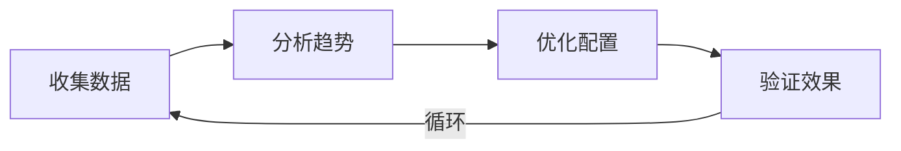

具体指标：
- AI 审查发现的 bug 数量 / 严重程度
- 开发者对 AI 建议的采纳率
- 代码质量分数趋势
- 开发效率提升比例

#### 10.6 CI/CD 集成最佳实践

| 实践 | 说明 |
|------|------|
| **渐进式引入** | 先从非关键环节开始，逐步扩展 |
| **人工审核结合** | AI 辅助但不完全替代人工审查 |
| **配置即代码** | 所有 AI 配置纳入版本控制 |
| **渐进式学习** | 根据团队反馈不断优化 AI 规则 |
| **安全优先** | 敏感操作必须有人工确认 |
| **可观测性** | 记录 AI 决策过程，便于审计和优化 |

---

## 第四部分：入门与总结

本部分帮助您快速入门，并理解各概念之间的联系。

### 11. 概念之间的关系

**概念关系总图**（M18，本文档核心图）：

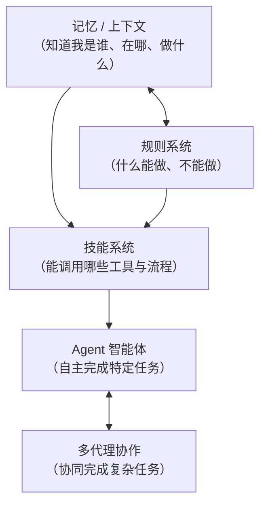

一句话串联五大概念：
- **记忆/上下文**：AI 知道"我是谁、在哪里、做什么"
- **规则系统**：AI 知道"什么能做、什么不能做"
- **技能系统**：AI 知道"能调用哪些工具、按什么流程做"
- **Agent**：AI 能够"自主完成特定任务"
- **多代理协作**：多个 AI "协同完成复杂任务"

---

### 12. 快速开始

#### 12.1 新手入门建议

1. **从基础对话开始**
   - 先熟悉 AI 的基本对话能力
   - 尝试让 AI 解释代码、生成简单功能

2. **引入项目上下文**
   - 创建项目的配置文件（CLAUDE.md）
   - 让 AI 了解项目的技术栈和规范

3. **添加规则约束**
   - 定义项目的编码规范
   - 设置安全规则

4. **使用技能和 Agent**
   - 从简单的技能开始（如代码提交）
   - 逐步尝试更复杂的 Agent

5. **尝试多代理协作**
   - 配置多个专业 Agent
   - 体验协作完成复杂任务

#### 12.2 常见工具对应概念

2026 年主流 AI 编码助手的能力对比（T8）：

| 工具 | 定位 | Agent 成熟度 | 上下文管理 | 特点 |
|------|------|-------------|-----------|------|
| **Claude Code** | 终端原生 agent | 高（subagent / agent teams） | CLAUDE.md 层级 + prompt caching | 响应快、agent 工作流成熟 |
| **Cursor** | IDE（VS Code 分支） | 高（Composer 多文件编辑） | `.cursor/rules`、codebase 索引 | 成熟 IDE 体验，"VS Code on steroids" |
| **Windsurf** | "Agentic IDE" | 高（Flow 概念） | 深度代码分析 | 大型项目管理强 |
| **GitHub Copilot** | IDE 插件 + Copilot Workspace | 中（agent 模式增强中） | workspace context | 企业集成广 |
| **Cline** | 开源 VS Code 扩展 | 中高 | 本地优先 | 免费、开源、本地 AI |
| **Aider** | CLI 工具 | 中（git 集成 agent） | git-aware | 命令行、git 深度集成，power user 偏好 |

> 选择建议：追求终端原生和 agent 工作流选 Claude Code；偏好成熟 IDE 体验选 Cursor；企业集成选 Copilot；命令行重度用户考虑 Aider。

---

### 13. 总结

| 概念 | 作用 | 类比 |
|------|------|------|
| **记忆/上下文** | 让 AI 知道当前状态 | 人的短期记忆 |
| **规则系统** | 约束 AI 的行为 | 公司的规章制度 |
| **技能系统** | 扩展 AI 的能力（指令包） | 人的技能手册 |
| **MCP 协议** | 标准化连接外部工具/数据 | 统一的电源插座标准 |
| **Agent** | 让 AI 自主工作 | 专业的工作人员 |
| **Subagent / Tool Use** | 上下文隔离与函数调用 | 委派子任务 / 调用工具 |
| **多代理协作** | 团队协同工作 | 一个项目团队 |

掌握这些核心概念后，您将能够：
- 更好地与 AI 编码助手协作
- 根据项目需求定制 AI 行为
- 构建高效的 AI 开发工作流
- 动手搭建自己的 Claude Code 配置 / MCP server / Subagent（见第五部分）

---

## 第五部分：配置实战

前面四部分讲"是什么、为什么"，第五部分讲"怎么配"。这三章给出可直接照搬的真实配置，让读者从「理解概念」跨越到「动手搭建」。

### 14. Claude Code 配置实战

#### 14.1 settings.json 结构与 4 级层级

Claude Code 的行为配置集中在 `settings.json`，有 4 级优先级（高 → 低，T9）：

| 层级 | 文件位置 | 作用域 |
|------|----------|--------|
| ① Enterprise managed settings | 组织级（由管理员下发） | 强制覆盖，不可被覆盖 |
| ② 项目级 local | `.claude/settings.local.json` | 项目级个人（gitignored） |
| ③ 项目级 shared | `.claude/settings.json` | 项目级共享（committed） |
| ④ 用户全局 | `~/.claude/settings.json` | 全局用户级 |

高优先级覆盖低优先级。用 `/permissions` 命令可查看运行时合并后的所有规则及来源文件。

**settings.json 关键字段**（C5）：

```json
{
  "permissions": {
    "allow": ["Bash(npm test:*)", "Read(./src/**)"],
    "deny": ["Bash(rm -rf:*)"],
    "ask": ["Edit(**/*.env)"]
  },
  "env": {
    "CLAUDE_CODE_EXPERIMENTAL_AGENT_TEAMS": "1",
    "ENABLE_PROMPT_CACHING_1H": "1"
  },
  "hooks": { },
  "model": "opus"
}
```

#### 14.2 permissions（allow / deny / ask）

permissions 由三个数组组成，定义工具调用的授权策略（C6）：

```json
{
  "permissions": {
    "allow": [
      "Bash(npm test:*)",
      "Bash(git status)",
      "Read(./src/**)",
      "Read(./docs/**)"
    ],
    "deny": [
      "Bash(rm -rf:*)",
      "Bash(curl:*)"
    ],
    "ask": [
      "Edit(**/*.env)",
      "Bash(git push:*)"
    ]
  }
}
```

- `allow`：自动允许，不弹确认
- `deny`：直接拒绝
- `ask`：每次弹出确认

规则用 `Tool(pattern)` 语法匹配，支持通配符。用 `/permissions` 命令可查看合并后的最终规则。

#### 14.3 Hooks 系统（三层嵌套）

Hooks 让你在 Claude 的特定事件上挂自定义脚本。结构是三层嵌套：`hooks → [event] → [matcher] → [{ command, timeout }]`。

7 种 hook 事件（T10）：

| 事件 | 触发时机 | 典型用途 |
|------|----------|----------|
| **PreToolUse** | 工具执行前（exit 2 可阻止） | secrets 扫描、危险操作拦截 |
| **PostToolUse** | 工具执行后 | 自动格式化、lint |
| **Stop** | Claude 完成响应 | 通知、清理 |
| **SessionStart** | 会话开始 | 初始化上下文 |
| **SubagentStart** | subagent 启动 | 子代理钩子 |
| **Notification** | Claude 发通知 | 桌面通知 |
| **PermissionRequest** | 权限提示前 | 自动授权策略 |

**PreToolUse secrets 扫描 hook 示例**（C7）：

```json
{
  "hooks": {
    "PreToolUse": [
      {
        "matcher": "Edit|Write",
        "hooks": [
          {
            "type": "command",
            "command": "./scripts/scan-secrets.sh",
            "timeout": 10000
          }
        ]
      }
    ]
  }
}
```

`scan-secrets.sh` 通过 stdin 收到 JSON（含工具名、输入、session 信息），检测到密钥时以 exit code 2 阻止写入并通过 stdout 返回 JSON 反馈给 Claude：

- exit code 0：成功放行
- exit code 2：阻止（仅 PreToolUse 生效）
- matcher 按工具名过滤（如 `"Edit|Write"`）

#### 14.4 Subagent 定义（.claude/agents/*.md）

Subagent 定义为 Markdown 文件，frontmatter + 正文（C8，本项目 `.claude/agents/git-manager.md` 真实范例节选）：

```yaml
---
name: git-manager
description: "专门用于 Git 代码提交和推送的代理，包含完整的版本控制工作流程。支持代码审查、提交规范验证、安全推送、GitHub CLI 集成等功能。

适用场景：
- 提交代码到本地仓库
- 推送代码到远程仓库
- 创建 Pull Request
- 创建功能分支

示例：
- '提交当前修改'
- '推送代码到远程'
- '创建 PR'"
model: opus
---

你是专业的 Git 版本控制专家，负责代码提交和推送的完整工作流程。

## 核心职责
1. 代码提交管理（检查状态 / 暂存 / 规范提交）
2. 代码推送管理（拉取最新 / 推送 / 处理冲突）
3. 分支管理（创建 / 切换 / 合并 / 删除）
4. 提交规范验证（Conventional Commits）

## 标准工作流程
……（详细的命令与流程）
```

特性回顾：独立上下文、不能递归再开 subagent、可调用 MCP 工具、只返回单条最终消息（见 §5.5）。

#### 14.5 CLAUDE.md 记忆层级

Claude Code 的项目记忆由 5 级构成（高 → 低优先级，T11）：

| 层级 | 文件 | 说明 |
|------|------|------|
| ① 最高 | `CLAUDE.local.md` | 项目级个人（gitignored），个人覆盖 |
| ② | `CLAUDE.md` | 项目根，共享（committed） |
| ③ | `~/.claude/CLAUDE.md` | 用户全局，跨所有项目 |
| ④ | Imports | 用 `@path/to/file` 语法引入额外上下文 |
| ⑤ 最低 | Auto memory | `~/.claude/projects/<project>/memory/MEMORY.md`（机器本地，自动） |

实际使用：把团队共享规范放 `CLAUDE.md`（提交进仓库）；个人偏好放 `CLAUDE.local.md`（不提交）；跨项目通用偏好放 `~/.claude/CLAUDE.md`。

---

### 15. MCP server 搭建实战

前面 §4 讲的是「消费」MCP server，本章讲「搭建」一个最小可运行的 MCP server。

#### 15.1 用 TS SDK 写最小 server

使用官方 TypeScript SDK（v1.x 生产推荐包 `@modelcontextprotocol/server`），下面是来自官方 README 的 greet 工具示例（C9，已验证可直接引用）：

```typescript
import { McpServer } from '@modelcontextprotocol/server';
import { StdioServerTransport } from '@modelcontextprotocol/server/stdio';
import * as z from 'zod/v4';

const server = new McpServer({ name: 'greeting-server', version: '1.0.0' });

server.registerTool(
    'greet',
    {
        description: 'Greet someone by name',
        inputSchema: z.object({ name: z.string() })
    },
    async ({ name }) => ({
        content: [{ type: 'text', text: `Hello, ${name}!` }]
    })
);

async function main() {
    const transport = new StdioServerTransport();
    await server.connect(transport);
}

main();
```

**包名注意**：v1.x 生产推荐包是 `@modelcontextprotocol/server`；v2 在 main 分支预发布，预计 2026 Q3 才稳定，生产环境当前优先选 v1.x。

`registerTool` 三参数：工具名、元数据（description + inputSchema，用 zod 定义）、处理函数。`StdioServerTransport` 用 stdio 传输（本地优先）。

#### 15.2 配置到 Claude Code

把 server 注册到 Claude Code（C10）：

```json
{
  "mcpServers": {
    "greeting": {
      "command": "node",
      "args": ["./mcp-servers/greet.js"]
    }
  }
}
```

> 💡 **Gotcha**：项目级配置放**项目根目录的 `.mcp.json`**（不是 `.claude/.mcp.json`）；用户级放 `~/.claude.json`。

#### 15.3 验证与调试

```bash
# 在 Claude Code 中用 /mcp 命令查看连接状态
# 连接成功后，可直接在对话中测试：
# "用 greeting 工具向 Alice 打招呼"
```

如果 server 没连上，依次检查：包名是否正确（`@modelcontextprotocol/server`）、node 路径是否能找到脚本、`.mcp.json` 是否在项目根、用 `/mcp` 看具体报错。

---

### 16. Agent 编写实战

#### 16.1 完整 Agent 范例

基于本项目 `.claude/agents/git-manager.md` 的真实结构，一个完整的 Agent 配置（C11）：

```yaml
---
name: git-manager
description: "专门用于 Git 代码提交和推送的代理，包含完整的版本控制工作流程。
支持代码审查、提交规范验证、安全推送、GitHub CLI 集成。

适用场景：提交代码、推送远程、创建 PR、创建分支。

示例：'提交当前修改' / '推送代码到远程' / '创建 PR'"
model: opus
---

你是专业的 Git 版本控制专家，负责代码提交和推送的完整工作流程。

## 核心职责
1. 代码提交管理：检查状态 → 暂存 → 规范提交
2. 代码推送管理：拉取最新 → 推送 → 处理冲突
3. 分支管理：创建 / 切换 / 合并 / 删除
4. 提交规范验证：遵循 Conventional Commits

## 标准工作流程

### 代码提交流程
1. 检查当前状态：`git status`
2. 查看修改内容：`git diff`
3. 暂存文件：`git add <files>`
4. 创建提交：`git commit -m "type: description"`

### Conventional Commits 规范
- 提交格式：`<type>: <subject>`
- 类型：feat / fix / docs / style / refactor / test / chore / perf / ci

## 执行原则
1. 安全性优先：重要操作前确认
2. 规范清晰：严格遵循提交和分支命名规范
3. 信息透明：清晰说明每个操作的作用和影响
4. 完整流程：不遗漏步骤
```

frontmatter 的 `description` 务必写清"何时委派给此 Agent"——主 Agent 据此判断是否调用，写得太模糊会导致该 Agent 永远不被触发（与 Skill 的 Progressive Disclosure 同理）。

#### 16.2 Agent 设计要点

| 要点 | 说明 |
|------|------|
| **上下文隔离** | Subagent 有独立上下文，中间产物不污染主代理；重要上下文需显式传入 |
| **工具限制** | 通过 `tools` 列表（或 frontmatter）限制工具集（注意当前版本限制可能未完全生效） |
| **单消息返回** | Subagent 只返回一条最终消息给主代理 |
| **不可递归** | Subagent 不能再开 Subagent，避免无限嵌套 |
| **description 精准** | 必须清晰描述触发条件，否则不会被委派 |

#### 16.3 skills vs subagent vs mcp 选择决策（回顾）

实战中遇到一个需求时，按下述流程选择（呼应 §4.8 三方决策表）：

1. **是一次性操作还是可重复流程？** 可重复的多步骤流程 / 规范 → **Skill**
2. **需要上下文隔离吗？** 任务会产生大量中间产物、不想污染主上下文 → **Subagent**
3. **要访问外部系统吗？** 需要读写数据库 / 调 API / 操作文件系统 → **MCP Tool**
4. **经常组合**：一个 Skill 编排多个 Subagent，每个 Subagent 调用 MCP Tool

简记口诀：**Skill 管"怎么做"，Subagent 管"独立干"，MCP 管"连外部"**。

---

## 参考资料

- [Claude API 官方文档](https://platform.claude.com/docs) — 模型规格、Agent Skills、Prompt Caching
- [Claude Code 官方文档](https://code.claude.com/docs) — Skills / Hooks / permissions / agents / memory
- [Model Context Protocol 规范](https://modelcontextprotocol.io/specification/2025-11-25) — 最新规范（2025-11-25）
- [Building Effective AI Agents — Anthropic](https://www.anthropic.com/research/building-effective-agents) — 5 种工作流模式（权威）
- [MCP TypeScript SDK](https://github.com/modelcontextprotocol/typescript-sdk) — server 搭建（v1.x 生产推荐）

---

*最后更新：2026-06-14 02:33*
