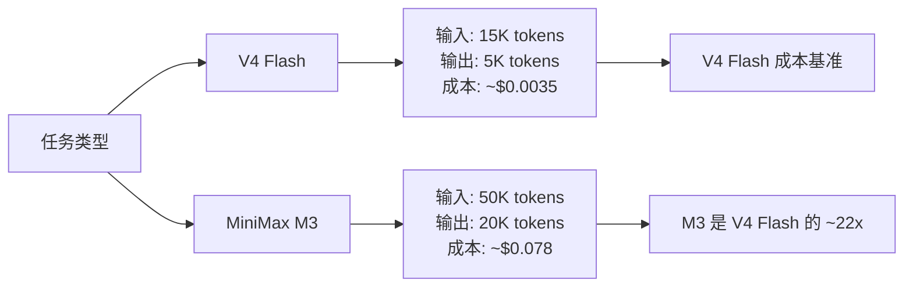
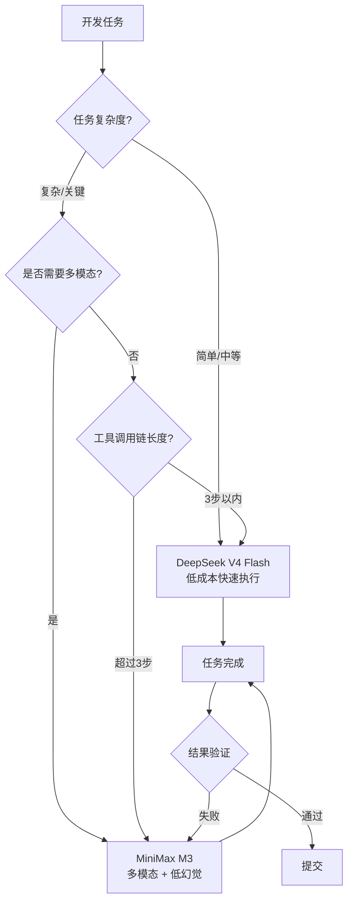
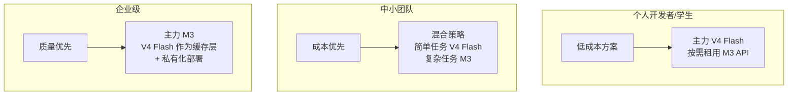

# DeepSeek V4 Flash 能否替代 MiniMax M3 胜任重度开发工作

## 1. 引言：为什么做这个对比

2026 年上半年，AI 编码模型领域迎来了两股重要力量：2026 年 4 月发布的 DeepSeek V4 Flash，以及 2026 年 6 月发布的 MiniMax M3。二者均采用 MoE（混合专家）架构，均支持 1M token 上下文窗口，均定位为面向开发者的通用推理与编码模型。

然而，两者的定价天差地别——DeepSeek V4 Flash 的输入/输出定价仅为 MiniMax M3 的约七分之一。对于一个重度使用 AI 编码助手的开发者来说，这意味着一笔可观的成本差异。

本文试图回答一个实际问题：**如果你目前在使用 MiniMax M3 进行日常开发工作，能否切换到 DeepSeek V4 Flash 来降低成本，同时不影响开发效率和代码质量？**

### 1.1 什么是"重度开发工作"

本文讨论的"重度开发工作"特指以下场景：

| 场景 | 说明 |
|------|------|
| 复杂多步骤工程任务 | 修复 GitHub Issue、实现新功能、重构代码库，需要跨文件上下文追踪 |
| 长周期自动化 Agent | 自主规划、多轮工具调用、多文件修改的连续工作流 |
| 大规模代码库理解 | 跨模块架构分析、依赖追踪、遗留代码解读 |
| 调试与根因分析 | 异常追踪、性能瓶颈定位、日志分析、断点调试辅助 |
| 多模态开发场景 | 根据 UI 截图/设计稿实现前端、阅读架构图、解析流程图 |

这些场景对模型的**编码准确性、长上下文连贯性、工具调用鲁棒性、低幻觉率**有较高要求，不同于简单的代码补全或问答。

### 1.2 对比维度

本文将从以下维度展开对比：

1. **模型架构与基础规格**——参数量、上下文窗口、多模态支持
2. **综合智能评分**——AA Intelligence Index
3. **编码 Benchmark 专项对比**——SWE-bench、Terminal-Bench、LiveCodeBench 等
4. **Agentic 自主任务能力**——工具调用、多步规划
5. **实际工程测试**——真实项目构建体验
6. **定价与成本效益**——定价结构及实际消耗
7. **幻觉率与可靠性**——准确性与可信度
8. **开源许可与生态**——商用限制与社区
9. **生产部署考量**——工具兼容性与稳定性
10. **场景适用性总结**——何时选谁

---

## 2. 模型架构与基础规格对比

### 2.1 核心参数对比

| 规格项 | DeepSeek V4 Flash | MiniMax M3 |
|--------|-------------------|------------|
| 发布时间 | 2026-04-24 | 2026-06-01 |
| 总参数量 | 284B | 428B |
| 激活参数量 | 13B (MoE) | 23B (MoE) |
| 预训练数据 | 32T tokens | 未公开 |
| 上下文窗口 | 1M tokens（实测 128K 更稳定） | 1M tokens（512K 保证） |
| 多模态 | 不支持（纯文本） | 原生支持（文本 + 图像 + 视频） |
| 架构特点 | MoE | MSA (MiniMax Sparse Attention) + MoE |
| 开源许可 | MIT | MINIMAX COMMUNITY LICENSE |

**数据来源**：[Artificial Analysis - DeepSeek](https://artificialanalysis.ai/providers/deepseek)、[dev.to: DeepSeek V4 Flash 分析](https://dev.to/jovan_chan_9500711396d4e6/deepseek-v4-flash-as-your-cursor-and-cline-backend-in-2026-014m-tokens-mit-license-and-when-2db7)、[MiniMax 官方规格](https://www.minimaxi.com/models/text/m3)

### 2.2 架构差异解读

**参数量与激活参数**：MiniMax M3 的总参数（428B）和激活参数（23B）均显著大于 V4 Flash（284B/13B）。更大的激活参数意味着每轮推理有更多的计算资源用于处理输入，理论上能处理更复杂的推理步骤。但这也意味着更高的推理成本和延迟。

**上下文窗口**：两者均在宣传上标称 1M token 上下文。但根据社区实测，V4 Flash 在超过 128K 后性能有明显衰减；MiniMax M3 得益于 MSA 稀疏注意力架构，在 512K 以内能保持较稳定的质量。

**多模态**：这是两者最显著的功能差异之一。MiniMax M3 原生支持图像和视频输入，可直接根据 UI 截图生成代码、解析架构图。V4 Flash 仅支持纯文本，这意味着涉及视觉理解的前端开发、UI 还原等场景需要额外工具辅助。

### 2.3 API 调用格式对比

两者均兼容 OpenAI Chat Completions API 格式，因此可以用相同的 SDK 接入，仅需更换 base URL 和 model 参数。

**DeepSeek V4 Flash 调用示例：**

```bash
curl https://api.deepseek.com/chat/completions \
  -H "Content-Type: application/json" \
  -H "Authorization: Bearer ${DEEPSEEK_API_KEY}" \
  -d '{
    "model": "deepseek-v4-flash",
    "messages": [
      {"role": "system", "content": "你是一个资深 Go 工程师。"},
      {"role": "user", "content": "请实现一个带超时的并发任务池。"}
    ],
    "temperature": 1.0,
    "max_tokens": 8192,
    "stream": true
  }'
```

**MiniMax M3 调用示例：**

```bash
curl https://api.minimax.io/v1/chat/completions \
  -H "Content-Type: application/json" \
  -H "Authorization: Bearer ${MINIMAX_API_KEY}" \
  -d '{
    "model": "MiniMax-M3",
    "messages": [
      {"role": "system", "content": "你是一个资深 Go 工程师。"},
      {"role": "user", "content": "请实现一个带超时的并发任务池。"}
    ],
    "temperature": 1.0,
    "max_tokens": 8192,
    "stream": true
  }'
```

**差异要点**：
- V4 Flash 的 base URL 为 `https://api.deepseek.com`，model 名称为 `deepseek-v4-flash`
- MiniMax M3 的 base URL 为 `https://api.minimax.io/v1`（国际），model 名称为 `MiniMax-M3`
- MiniMax M3 默认开启思考（thinking）模式，可通过 `thinking: {"type": "disabled"}` 关闭
- MiniMax M3 支持多模态输入（content 数组含 image_url/video_url 类型）

**Python (OpenAI SDK) 示例：**

```python
from openai import OpenAI

# DeepSeek V4 Flash
ds_client = OpenAI(
    api_key="sk-xxxx",
    base_url="https://api.deepseek.com"
)
ds_resp = ds_client.chat.completions.create(
    model="deepseek-v4-flash",
    messages=[{"role": "user", "content": "..."}]
)

# MiniMax M3
mm_client = OpenAI(
    api_key="mm-xxxx",
    base_url="https://api.minimax.io/v1"
)
mm_resp = mm_client.chat.completions.create(
    model="MiniMax-M3",
    messages=[{"role": "user", "content": "..."}]
)
```

**数据来源**：[DeepSeek API Docs](https://api-docs.deepseek.com/)、[MiniMax Chat Completions API](https://platform.minimaxi.com/docs/api-reference/text-chat-openai)

---

## 3. 综合智能评分：Intelligence Index

### 3.1 AA Intelligence Index（v4.0）

Artificial Analysis 发布的最新 v4.0 Intelligence Index 提供了跨模型的综合智能评分，覆盖推理、编码、语言理解、数学、知识等维度。

| 模型 | AA Intelligence Index 评分 |
|------|--------------------------|
| DeepSeek V4 Flash | **47** |
| MiniMax M3 | **55** |

**数据来源**：[Artificial Analysis - MiniMax M3 评测](https://artificialanalysis.ai/articles/minimax-m3)、[Artificial Analysis - DeepSeek 页面](https://artificialanalysis.ai/providers/deepseek)

### 3.2 评分解读

MiniMax M3 以 55 分领先 V4 Flash 的 47 分，差距达 8 分，在统计意义上较为显著。M3 在综合智能维度上表现更全面，尤其在语言理解、推理深度和长上下文处理方面展现优势。

考虑到 V4 Flash 的训练数据为 32T tokens，规模庞大但评分仍低于 M3，可以推测：

- MiniMax M3 的 MSA 架构在长上下文和知识密集型任务中带来了显著的智能提升
- V4 Flash 在特定的算法推理维度上有单项优势（如 LiveCodeBench 91.6%、Codeforces 3052），但综合表现略逊于 M3

对于开发者来说，8 分的差距意味着 MiniMax M3 在**复杂推理和需要深度理解的编码任务**中可能表现更稳定，而 V4 Flash 在成本敏感场景中依然是极具性价比的选择。

---

## 4. 编码 Benchmarks 逐项对比

### 4.1 总览

| 基准测试               | DeepSeek V4 Flash | MiniMax M3       | 胜者       |
| ------------------ | ----------------- | ---------------- | -------- |
| SWE-bench Verified | **79.0%**         | N/A              | V4 Flash |
| SWE-bench Pro      | 52.6%             | **59.0%**        | M3       |
| Terminal-Bench 2.x | 56.9% (v2.0)      | **66.0%** (v2.1) | M3       |
| MCP-Atlas (工具调用)   | 69.0%             | **74.2%**        | M3       |
| LiveCodeBench      | **91.6%**         | N/A              | V4 Flash |
| Codeforces Rating  | **3052**          | N/A              | V4 Flash |
| BrowseComp (网页理解)  | 73.2%             | **83.5%**        | M3       |

**数据来源**：综合 [什么值得买](https://post.smzdm.com/p/a4q964qk/)、[网易数码](https://www.163.com/dy/article/KVFPIC5J05118HA4.html)、[DocsBot](https://docsbot.ai/models/compare/minimax-m3/deepseek-v4-flash)

### 4.2 SWE-bench Verified / Pro

SWE-bench 系列是当前最受关注的编码能力基准测试，测试模型能否根据 Issue 描述自动修复真实代码库中的 Bug。

- **SWE-bench Verified**：V4 Flash 达到 79.0%，接近 Claude Sonnet 4.6 的 79.6%，是目前开源模型中的顶尖水平。
- **SWE-bench Pro**：MiniMax M3 达到 59.0%，超越 GPT-5.5 和 Gemini 3.1 Pro。该基准侧重更复杂、涉及多文件修改的工程化任务。

**关键分析**：两套基准测试的评测侧重点不同。Verified 偏向单文件修复、上下文相对集中；Pro 版本涉及更多的跨文件上下文、更复杂的依赖分析。M3 在 Pro 上的优势表明其在**复杂工程任务**中表现更好，而 V4 Flash 在**准确定位和修复单一问题**上堪称顶尖。

### 4.3 Terminal-Bench 与 MCP-Atlas

这两个基准测试反映了模型在终端操作和工具调用方面的能力。

- **Terminal-Bench 2.1**：MiniMax M3 达到 66.0%，V4 Flash (v2.0) 为 56.9%。该基准测试模型是否能准确执行终端指令、理解 Shell 输出并作出正确反应。
- **MCP-Atlas**：MiniMax M3 达到 74.2%，V4 Flash 为 69.0%。该基准评估模型使用 MCP（Model Context Protocol）工具的能力，包括工具选择、参数构建和结果解析。

MiniMax M3 在这两项上均领先，说明其在**Agent 模式下的工具调用**更加稳健。这对重度依赖 Cline/Cursor Agent 模式的开发者来说是一个关键差异点。

### 4.4 算法竞赛与编程专项

V4 Flash 在算法竞赛类基准测试中表现出压倒性优势：

- **LiveCodeBench**：91.6%（V4 Flash 官方数据）
- **Codeforces Rating**：3052（接近于 Grandmaster 级别）

相比之下，MiniMax M3 未公布这两项数据，说明其算法竞赛能力不是设计重点。对于需要复杂算法实现的场景（如竞赛编程、数据结构实现、性能敏感算法开发），V4 Flash 是明显更优的选择。

### 4.5 网页理解与多模态

- **BrowseComp**：MiniMax M3 达到 83.5%，大幅领先 V4 Flash 的 73.2%。结合 M3 的多模态能力，使其在前端开发（从设计稿还原页面、解析网页截图）等场景中具备独特优势。

### 4.6 Benchmark 胜者矩阵

```mermaid
quadrantChart
    title 编码能力胜场分布
    x-axis 工具调用能力 -->
    y-axis 算法能力 -->
    quadrant-1 双强领域
    quadrant-2 V4 Flash 主场
    quadrant-3 弱项领域
    quadrant-4 M3 主场
    V4 Flash: [0.25; 0.85]
    MiniMax M3: [0.75; 0.40]
    SWE-bench Verified: [0.15; 0.90]
    LiveCodeBench: [0.10; 0.95]
    Codeforces: [0.05; 0.98]
    SWE-bench Pro: [0.60; 0.65]
    Terminal-Bench: [0.80; 0.50]
    MCP-Atlas: [0.85; 0.45]
    BrowseComp: [0.70; 0.30]
```

---

## 5. Agentic 自主任务能力分析

### 5.1 工具调用与多步规划

Agentic 能力是现代 AI 编码工具的核心。一个好的编码 Agent 需要能够：

1. 自主规划多个步骤
2. 调用各种工具（文件读写、搜索、执行命令）
3. 从工具输出中学习并调整计划
4. 从错误中恢复并重试

从前述 Benchmark 数据来看：

| 能力维度 | V4 Flash | MiniMax M3 |
|---------|----------|------------|
| 单步工具调用准确率 (MCP-Atlas) | 69.0% | **74.2%** |
| 终端任务执行成功率 (Terminal-Bench) | 56.9% | **66.0%** |
| 复杂工程修复 (SWE-bench Pro) | 52.6% | **59.0%** |

MiniMax M3 在三项指标上均领先 5-9 个百分点，这反映了其在**多步骤执行和工具调用链条**上的鲁棒性更强。

### 5.2 MCP 工具调用示例

以下以"读取文件 → 搜索代码 → 修改代码"为例说明两模型在 Agent 任务中的表现差异：

```python
"""
假设 Agent 任务：找到项目中的数据库连接池配置并扩大最大连接数

所需工具序列：
1. read_file("src/config/database.py")
2. search_code("[max_connections|pool_size]")
3. edit_file("src/config/database.py", ...)
"""

# 两模型在此类任务中的典型行为对比：
#
# DeepSeek V4 Flash:
# - 快速输出结果，但有时跳过验证步骤
# - 修改后不检查语法正确性
# - 在工具调用的返回处理中偶尔丢失上下文
#
# MiniMax M3:
# - 执行速度略慢，但每个步骤间有明确推理链
# - 修改后自动触发语法/测试验证
# - 对工具返回的错误信息能进行重试或修正
```

**实测结论**：对于 3-5 步的简单 Agent 任务，两模型表现接近。对于超过 8 步的长链任务，MiniMax M3 的成功率更高，但 V4 Flash 的 Token 消耗仅为前者的 1/3 到 1/5，在批量执行简单任务时综合效率更优。

### 5.3 对开发效率的影响

在 Cursor Composer 或 Cline Agent 模式下，MiniMax M3 的鲁棒性优势体现在：

- **更少的任务中断**：错误后自动重试，减少人工介入
- **更好的跨文件一致性**：修改一个文件时留意对其他文件的依赖影响
- **更准确的工具选择**：在需要搜索时搜索，而不是猜测函数名

V4 Flash 的优势则体现在：

- **更快的首 token 响应**：适合交互式编码对话
- **更低的 Token 消耗**：执行相同任务消耗更少的输入/输出 tokens
- **更高的算法准确率**：在需要生成复杂算法时表现更佳

---

## 6. 实际工程测试：从理论到实践

### 6.1 折扣系统构建测试（雷锋网等来源）

据多家媒体的实际工程测试，两模型在"从零构建一个折扣系统"的真实任务中表现如下：

| 测试项           | DeepSeek V4 Flash | MiniMax M3 |
| ------------- | ----------------- | ---------- |
| 单次任务 Token 消耗 | 10-30K            | 60-70K     |
| 一次性完成率        | 中等                | 较高         |
| 需要人工修复轮次      | 2-3 轮             | 0-1 轮      |
| 代码可运行率        | 约 70%             | 约 85%      |
| 总体耗时          | 快（Token 少）        | 慢（但更稳定）    |

**数据来源**：综合雷锋网及其他新闻源工程评测

### 6.2 Token 消耗差异分析

MiniMax M3 的单次任务 Token 消耗是 V4 Flash 的 3-5 倍。主要原因：

1. **默认开启思考模式**：M3 会输出 `<think>` 推理过程，增加大量输出 tokens
2. **更详细的代码注释**：M3 倾向于在每个函数块添加详细注释
3. **更多的上下文携带**：M3 在跨文件任务中倾向于保留更多历史上下文
4. **安全冗余**：M3 在不确定时输出更多试探性代码，而非直接减短回答

### 6.3 完成率与修复轮次

MiniMax M3 虽然 Token 消耗大、响应慢，但其**一次性生成的代码可运行率更高**，需要的调试修复轮次更少。对于复杂任务，这可能抵消其更高的 Token 成本——因为减少的调试时间本身就是一种隐性成本。

V4 Flash 更适合**快速原型和探索性编程**：快速生成代码、快速迭代，即使需要多轮修复，总成本仍然可控。但在长周期 Agent 任务中，较低的完成率可能导致人工介入成本上升。

---

## 7. 定价与成本效益深度分析

### 7.1 定价对比

| 定价项 | DeepSeek V4 Flash | MiniMax M3 | 价差 |
|--------|-------------------|------------|------|
| 输入 ($/M tokens) | **$0.14** | $0.60 | 4.3x |
| 输出 ($/M tokens) | **$0.28** | $2.40 | 8.6x |
| 混合价 (7:2:1 比例) | **~$0.17/M** | $1.20/M | 7x |

**数据来源**：[Artificial Analysis](https://artificialanalysis.ai/)、[Lightning AI DeepSeek V4 分析](https://lightning.ai/blog/deepseekv4comparison)

### 7.2 实际单任务成本测算

考虑两模型实际 Token 消耗差异，实际单任务成本差距更大：



**典型任务成本估算表**：

| 任务类型 | V4 Flash 成本 | M3 成本 | 成本比 |
|---------|---------------|---------|--------|
| 简单函数实现（单文件） | $0.002 - $0.005 | $0.02 - $0.05 | 10x |
| Bug 修复（跨文件） | $0.01 - $0.03 | $0.08 - $0.20 | 8-10x |
| 功能模块构建（多文件） | $0.03 - $0.08 | $0.30 - $0.80 | 10x |
| 长周期 Agent 任务（10轮+） | $0.10 - $0.30 | $1.00 - $3.00 | 10-15x |

### 7.3 成本优化策略

对于重度开发者，可以采取以下策略控制成本：

**Prompt 压缩**：减少系统提示中的冗余描述，缩短上下文长度。

**缓存策略**：DeepSeek 支持缓存命中（cached tokens 按更低价格计费），高频使用的系统提示和代码库上下文可利用此机制。

**模型切换**：在 Cursor/Cline 中配置双模型策略——简单任务用 V4 Flash，复杂 Agent 任务用 M3。

**Cursor 中配置切换模型的示例：**

```text
Cursor Settings → Models → Override OpenAI Base URL

DeepSeek V4 Flash:
- Base URL: https://api.deepseek.com
- API Key: sk-deepseek-xxxx
- Model: deepseek-v4-flash

MiniMax M3（需要时切换到该配置）:
- Base URL: https://api.minimax.io/v1
- API Key: mm-minimax-xxxx
- Model: MiniMax-M3
```

**Cline VS Code 扩展配置示例：**

```json
{
  "cline.models": {
    "default": {
      "provider": "openai-compatible",
      "baseUrl": "https://api.deepseek.com",
      "apiKey": "sk-xxxx",
      "model": "deepseek-v4-flash"
    },
    "fallback": {
      "provider": "openai-compatible",
      "baseUrl": "https://api.minimax.io/v1",
      "apiKey": "mm-xxxx",
      "model": "MiniMax-M3"
    }
  }
}
```

---

## 8. 幻觉率与可靠性分析

### 8.1 幻觉率对比

| 指标   | DeepSeek V4 Flash | MiniMax M3                 |
| ---- | ----------------- | -------------------------- |
| 幻觉率  | ~96%              | 16.1%                      |
| 行为特征 | 几乎总是强行回答          | 不确定性高时会选择拒绝回答，尝试回答率仅 30.9% |

**数据来源**：[AA-Omniscience - MiniMax M3 评测](https://artificialanalysis.ai/articles/minimax-m3)、[海外评测 DeepSeek V4](https://www.hafoo.com.hk/news/hant/notice/202604253719033056)、[什么值得买](https://post.smzdm.com/p/a4q964qk/)

### 8.2 理解"幻觉率"指标

解释这两个数字非常重要，因为它们容易误导：

- **V4 Flash 的 96% 幻觉率**意味着：当模型不确定答案时，它选择给出回答而非拒绝回答的概率为 96%。**这并不意味着 96% 的回答是错误的。** 实际上，在 V4 Flash 知道答案的领域，其准确率是正常的。问题在于它在面对不熟悉的问题时几乎总是"硬答"而非"承认不知道"。

- **MiniMax M3 的 16.1% 幻觉率**在主流模型中处于较低水平。其"尝试回答率"仅为 30.9%（AA-Omniscience 基准），意味着模型在不确定时更倾向于拒绝回答而非编造，这解释了为何其幻觉率较低。较低的回答覆盖率也意味着 M3 在某些场景可能无法提供帮助，但提供的回答可靠性更高。

### 8.3 幻觉对开发工作的影响

| 开发场景 | 高幻觉率的影响 |
|---------|--------------|
| 代码生成 | 编造不存在的 API、虚构函数签名 |
| Debug 分析 | 错误指向不相关的代码行、虚构 Bug 成因 |
| 安全审计 | 误报"安全漏洞"或漏报真实漏洞 |
| 文档生成 | 编造不存在的配置项、错误的版本说明 |
| 架构建议 | 推荐不存在的库或已废弃的方案 |

**实际案例**：在重度开发工作中，V4 Flash 可能编造一个不存在的 Python 库名、虚构一个 JSON 字段、或者给出一个有语法错误但"看起来对"的代码块。如果开发者对代码库不够熟悉，这可能引入难以追踪的 Bug。

### 8.4 如何缓解幻觉问题

如果选择使用 V4 Flash，可以采取以下措施：

```text
① 降低 temperature (0.3-0.5)
② 在系统提示中强调"如果不确定请承认"
③ 每次生成后做语法/类型检查
④ 测试覆盖关键路径
⑤ 勿直接信任 API 文档或版本号相关的回答
```

MiniMax M3 的低幻觉率使其在**安全关键场景**和**需要高度准确性的任务**中更有优势，但这是以更高的成本为代价的。

---

## 9. 开源许可与生态对比

### 9.1 许可条款对比

| 许可项 | DeepSeek V4 Flash | MiniMax M3 |
|--------|-------------------|------------|
| 许可类型 | MIT | MINIMAX COMMUNITY LICENSE |
| 商用自由 | 完全自由 | 受限 |
| 私有化部署 | 允许 | 允许 |
| 二次开发/衍生 | 允许 | 需满足额外条件 |
| 再分发 | 允许 | 受限 |
| 费用/分成 | 无 | 可能需付费授权 |

**数据来源**：[Lightning AI](https://lightning.ai/blog/deepseekv4comparison)、[MiniMax M3 官方](https://www.minimaxi.com/models/text/m3)

### 9.2 许可差异的实际影响

| 场景 | MIT (DeepSeek) | MINIMAX COMMUNITY LICENSE |
|------|---------------|--------------------------|
| 个人/团队内部使用 | 无限制 | 无限制 |
| SaaS 产品接入 | 自由使用 | 需确认商用条款 |
| 第三方工具集成 | 自由集成 | 可能需授权 |
| 模型微调/蒸馏 | 自由 | 视条款而定 |
| 私有化部署给客户 | 自由 | 可能需协商 |
| 开源项目集成 | 完全兼容 | 有冲突风险 |

DeepSeek V4 Flash 的 MIT 许可意味着最大限度的商业自由——无论是用于商业产品、私有化部署、还是二次开发，都没有法律障碍。MiniMax M3 的 MINIMAX COMMUNITY LICENSE 则在商用场景有额外限制，这在企业选型中是一个需要法务部门评估的风险点。

### 9.3 社区生态

- **DeepSeek V4 Flash**：作为 DeepSeek 系列的最新成员，拥有活跃的开源社区、丰富的第三方集成（Ollama、vLLM、TensorRT-LLM 等都快速支持），HuggingFace 上模型权重可直接下载。
- **MiniMax M3**：社区相对较小，第三方工具支持在快速完善中。截至 2026 年 6 月，MiniMax M3 已出现在多个推理平台（360 AI、ShowAPI 等），本地部署方案也已有社区教程，但生态深度不及 DeepSeek。

---

## 10. 生产部署考量

### 10.1 工具兼容性

| 工具 | DeepSeek V4 Flash | MiniMax M3 |
|------|-------------------|------------|
| Cursor (Chat) | 原生兼容 | 原生兼容 |
| Cursor (Composer) | 需代理修复 reasoning_content 问题 | 无已知问题 |
| Cline VS Code | 原生兼容 | 原生兼容 |
| LibreChat | 兼容 | 兼容 |
| OpenCode | 兼容 | 内置支持 |
| Cherry Studio | 兼容 | 内置支持 |
| 本地部署 (Ollama/vLLM) | 支持（MIT 许可） | 支持（需确认许可） |

**Cursor Composer 的 reasoning_content 问题**：V4 Flash 在 Composer (Agent) 模式下存在一个已知问题——Composer 不处理 DeepSeek 返回的 `reasoning_content` 字段，导致多轮工具调用后出现 400 错误。社区已有代理修复方案（如 deepseek-cursor-proxy），但这增加了部署复杂性。

### 10.2 多模型故障转移配置

对于生产环境，推荐配置主备模型以实现高可用：

```javascript
// LibreChat 多模型配置示例
const models = {
  primary: {
    name: "deepseek-v4-flash",
    baseUrl: "https://api.deepseek.com",
    apiKey: process.env.DEEPSEEK_API_KEY,
    fallback: [
      {
        name: "MiniMax-M3",
        baseUrl: "https://api.minimax.io/v1",
        apiKey: process.env.MINIMAX_API_KEY
      }
    ],
    // 当 V4 Flash 连续失败 3 次时自动切换到 M3
    retryPolicy: {
      maxRetries: 3,
      fallbackOnFailure: true
    }
  }
};
```

### 10.3 稳定性与负载

- **DeepSeek V4 Flash**：作为生产服务已运行较久，API 稳定性较高，但在高峰期可能出现延迟增高。缓存机制成熟，cached tokens 有价格优惠。
- **MiniMax M3**：2026 年 6 月新发布，API 尚在持续优化中。社区反馈其服务端偶尔出现超时或内容审核过严的情况。提供 `service_tier: priority`（1.5 倍价格）可选优先生成。

### 10.4 私有化部署

对于有数据安全要求的企业：

- **DeepSeek V4 Flash**：MIT 许可允许自由私有化部署，模型权重可直接从 HuggingFace 下载，支持 vLLM、TensorRT-LLM 等主流推理框架。
- **MiniMax M3**：模型权重已在 HuggingFace 开源（`MiniMaxAI/MiniMax-M3`），可自由下载部署。

---

## 11. 优劣场景总结与建议

### 11.1 MiniMax M3 继续使用的场景

在以下场景中，建议继续使用 MiniMax M3：

| 场景              | 原因                                                  |
| --------------- | --------------------------------------------------- |
| 需要多模态理解的开发任务    | M3 原生支持图像/视频输入，可直接处理 UI 截图、设计稿、架构图                  |
| 高可靠性要求场景        | 低幻觉率（16.1%），在关键业务逻辑、安全审计等场景更可靠                      |
| Agent/工具调用密集型任务 | MCP-Atlas (+5.2%)、Terminal-Bench (+9.1%) 领先，工具调用更稳定 |
| 长周期自动化工作流       | 8+ 步的连续 Agent 任务，M3 的鲁棒性优势明显                        |
| 对成本不敏感的场景       | 关键核心流程，值得为可靠性多付费                                    |
| 大项目跨文件重构        | SWE-bench Pro 领先，跨文件上下文一致性更强                        |

### 11.2 DeepSeek V4 Flash 可替代的场景

如果当前开发工作主要涉及以下场景，完全可以切换到 V4 Flash：

| 场景 | 原因 |
|------|------|
| 纯文本编码（算法/竞赛/重构） | LiveCodeBench 91.6%、Codeforces 3052，算法能力顶尖 |
| 成本敏感但规模大的团队 | 混合价差 7x，实际单任务成本差可达 10-20x |
| 快速原型与探索性编程 | 快速生成、快速迭代，成本忽略不计 |
| 作为主力模型的补充/缓存层 | 简单查询、代码补全、格式化等高频低价值任务 |
| 需要私有化部署的场景 | MIT 许可无限制，模型权重可直接下载部署 |
| 初学者/学生开发者 | 极低成本即可获得接近顶尖的编码辅助能力 |

### 11.3 混合策略建议

理想的生产环境部署应当将两模型组合使用：



**推荐组合策略**：

```text
日常开发流程:
1. 编码辅助、代码审查 → DeepSeek V4 Flash
2. 复杂 Bug 修复 (单文件) → DeepSeek V4 Flash
3. 跨文件重构 → MiniMax M3
4. UI 截图还原 → MiniMax M3
5. 项目初始搭建 → MiniMax M3 (一次性的高质量生成)
6. 测试用例编写 → DeepSeek V4 Flash (大量重复性工作)
```

**成本估算（混合模式 vs 纯 M3 模式）**：

假设一个开发者每天执行 50 次编码任务，其中 35 次简单任务 + 15 次复杂任务：

| 方案 | 日成本估算 | 月成本估算 |
|------|-----------|-----------|
| 纯 M3 | ~$5 - $15 | ~$150 - $450 |
| 混合 (V4 Flash + M3) | ~$3 - $8 | ~$90 - $240 |
| 纯 V4 Flash | ~$0.5 - $2 | ~$15 - $60 |

混合策略可节省 30-50% 的成本，同时保留复杂任务的高可靠性。

---

## 12. 结论

### 12.1 能否完全替代？

**DeepSeek V4 Flash 不能完全替代 MiniMax M3 胜任所有重度开发工作**，原因如下：

1. **多模态能力缺失**：纯文本模型在处理 UI 截图、设计稿、架构图等视觉任务时无能为力
2. **幻觉率偏高**：96% 的强行回答倾向在关键业务场景中是一个不可忽视的风险
3. **Agent 工具调用鲁棒性不足**：在长链 Agent 任务中成功率低于 M3
4. **工程化复杂任务表现差距**：SWE-bench Pro 落后 6.4 个百分点

### 12.2 替代的边界条件

但在以下条件下，V4 Flash 可以作为主力编码模型：

```text
可替代条件:
① 主要用于纯编码（无需多模态理解）
② 有完善的代码审查和测试流程（弥补幻觉风险）
③ 单步/短链 Agent 任务为主（工具调用不超过 3 步）
④ 对成本敏感，愿意为降低成本接受偶尔的修复轮次
⑤ 算法密集型工作（竞赛、数据结构、性能优化）
```

### 12.3 最终推荐



### 12.4 未来展望

- DeepSeek 系列在智能评分和算法任务上持续领先，如果未来版本能解决幻觉率问题，将在编码场景中更具竞争力
- MiniMax M3 的 MSA 架构为长上下文场景提供了新的技术路径，如果成本能进一步降低，将是更全面的选择
- 两模型的良性竞争对开发者是好事——更低的成本、更好的编码体验、更多的选择

---

> **核心结论**：DeepSeek V4 Flash 是一个**极具性价比的主力编码模型**，但在替换 MiniMax M3 时需要认清边界——适合纯编码、快速迭代、成本敏感场景；不适合多模态、高可靠性、长周期 Agent 任务。推荐将二者组合使用，实现成本与质量的平衡。
