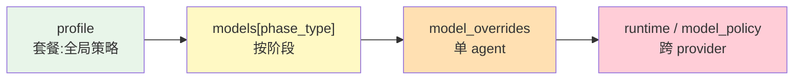
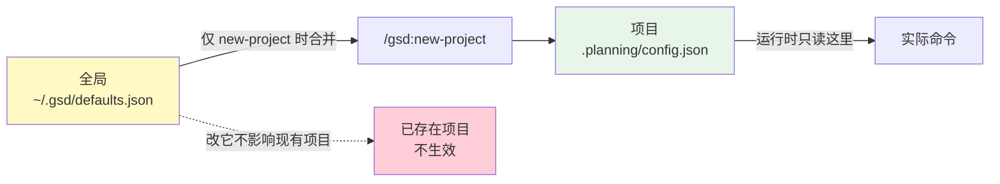
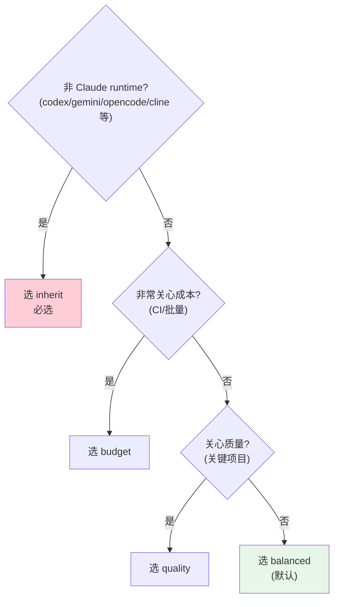
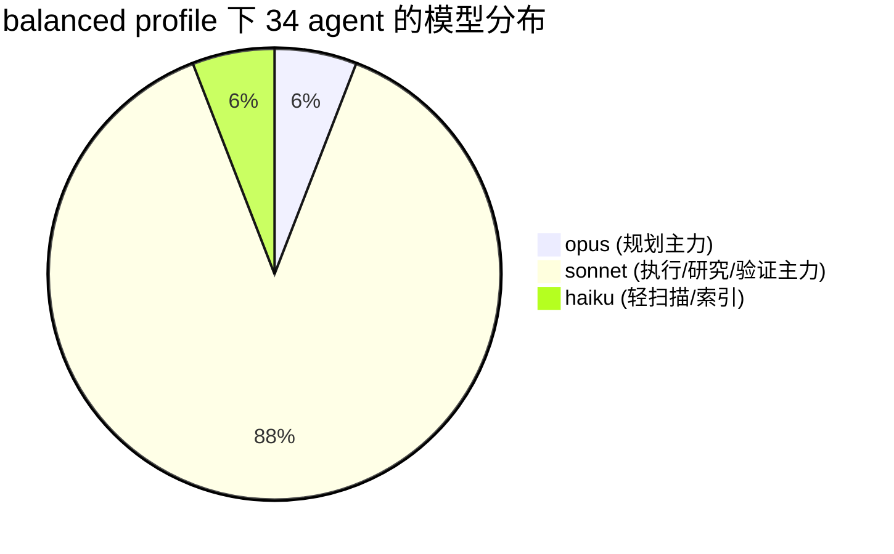
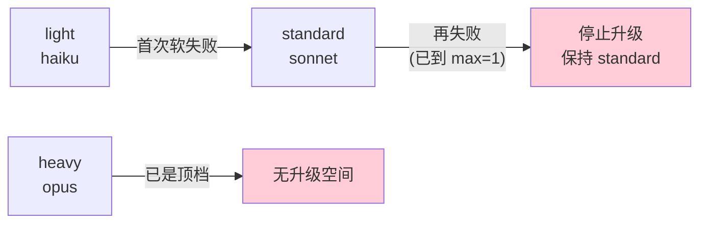
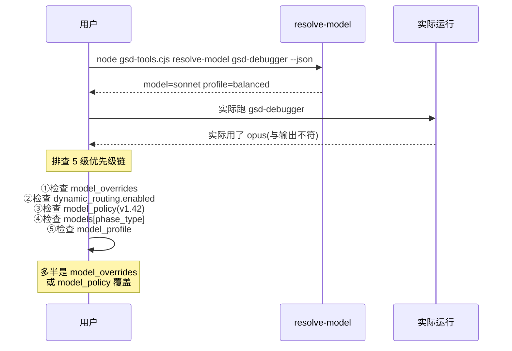
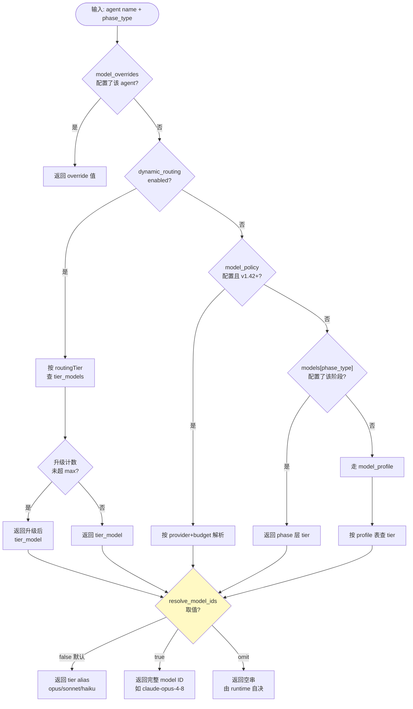

# GSD-gsd-core Agent↔Model 配置实战教程

> 本文基于 `open-gsd/gsd-core` 仓库源码(commit `308c7be`,2026-06 仓库快照)撰写,核实基准为 npm 包 `@opengsd/gsd-core@1.4.4` + GitHub raw。所有结论以仓库源码为最终准绳,与部分二手文档(deepwiki、旧版本教程)有出入的地方均已在文中标注。
>
> **本文定位是「实战教程」,不是原理书**。前 7 章就能让你完成 90% 的配置任务;原理和深度表放在 §11 与附录里,想深入理解时再翻。

---

## 1. 30 秒上手

**目标**:不读完整篇,也能改对配置。

一句话:**GSD 把不同 agent(planner / researcher / debugger 等 34 个)自动分到 opus(重)/ sonnet(中)/ haiku(轻)三档模型,默认就帮你配好了;你要做的只是「想换档」时改个文件**。

### 你最需要知道的 3 件事

| # | 问题 | 答案 | 详见 |
|---|------|------|------|
| ① | 配置文件在哪 | `<项目根>/.planning/config.json`(运行时唯一真理源) | §2 |
| ② | 怎么改 | 用 `/gsd:settings`、`/gsd:config` 命令,或直接编辑 JSON | §3 |
| ③ | 怎么验证 | 跑 `node gsd-tools.cjs resolve-model gsd-planner --json` | §9 |

### 配置粒度阶梯

从粗到细有四级,**新用户从 profile 开始,不要直接跳到单 agent**:



> 💡 **80% 用户**:读完本章 + §2(文件在哪)+ §4(选 profile)就够了。默认 `balanced` 已经是最优组合,什么都不配也能跑。

---

## 2. 配置文件在哪、叫什么

**目标**:回答最常被问的「文件位置 + 命名」,顺带把「全局 defaults 影响现有项目」这个常见误解彻底澄清。

GSD 的配置只有两层 —— 项目级 + 全局级,**没有 workspace / user 等中间层**。

### 2.1 项目级(运行时唯一真理源)

| 项 | 值 |
|----|----|
| 路径 | `<项目根>/.planning/config.json` |
| 文件名 | **固定** `config.json`(不是 `gsd-config.json`、不是 `settings.json`) |
| 角色 | 运行时 GSD **唯一**会读的文件 |

**证据**:`src/config-loader.cts` 的 `loadConfig()` 读取 `path.join(planningDir(cwd, options?.workstream), 'config.json')`;所有 `cmdConfig*` 函数(`src/config.cts`)都走这条路径。官方 `docs/CONFIGURATION.md:5-7` 也明确:"GSD stores project settings in `.planning/config.json`"。

### 2.2 全局级(仅作为新项目模板)

| 项   | 值                                                    |
| --- | ---------------------------------------------------- |
| 路径  | `~/.gsd/defaults.json`(即 `$HOME/.gsd/defaults.json`) |
| 文件名 | **固定** `defaults.json`(注意:不是 `config.json`)          |
| 角色  | **仅作模板**,创建新项目时合并一次                                  |

### 2.3 关键澄清:全局 defaults 运行时**根本不读**

这是最容易踩的坑,务必记住:



> ⚠️ **改了 `~/.gsd/defaults.json` 对已有项目不生效**。它只在 `/gsd:new-project` 创建新项目时被合并一次(`buildNewProjectConfig()`)。**已有项目运行时 `loadConfig()` 只读项目级 `.planning/config.json`,不读全局**(证据:`src/config-loader.cts` 的 loadConfig);仅当连 `.planning/` 目录都不存在(pre-project 极端场景)才会 fallback 读全局。**已有项目要改配置,只能改它自己的 `.planning/config.json`**(或用 `/gsd:settings` / `config-set`)。

### 2.4 项目级 vs 全局级对照

| 维度 | 项目级 | 全局级 |
|------|--------|--------|
| 路径 | `<项目根>/.planning/config.json` | `~/.gsd/defaults.json` |
| 文件名 | `config.json` | `defaults.json` |
| 运行时读取 | ✅ 唯一来源 | ❌ 不读 |
| 影响范围 | 当前项目 | **未来新建**的项目 |
| 何时合并 | — | `/gsd:new-project` 创建时一次 |

### 2.5 配置文件何时创建

- **主入口**:`/gsd:new-project` 斜杠命令,自动创建 `.planning/` 目录 + 写 `config.json`
- **兜底入口**:`/gsd:settings`、`/gsd:config` 等命令开头都跑 `config-ensure-section`,**幂等创建**(`src/config.cts` 的 ensure-section 实现)

> 💡 用户第一次跑 `/gsd:new-project` 就会自动有配置文件,**无需手动建**。

### 2.6 workstream 变体(并行开发高级场景)

基础用户可跳过本节,只记住「就是 `.planning/config.json`」。

当 `.planning/active-workstream` 文件存在(即处于 workstream 并行开发场景)时,实际读取的配置路径变为:

```
<项目根>/.planning/workstreams/<workstream>/config.json
```

**不是顶层那个 `.planning/config.json`**。这是「改了顶层不生效」的常见原因之一。用 `node gsd-tools.cjs config-path` 确认当前真实路径(见 §9)。

---

## 3. 怎么创建和编辑配置

**目标**:讲清 4 种编辑方式(斜杠命令 / CLI / 手动 JSON / new-project 向导),并给出「什么场景用哪个」的速查表。

### 3.1 方式 1:斜杠命令(交互式,推荐新手)

GSD 有两组配置命令,**不是用户以为的单个 `/gsd-config`**:

| 斜杠命令 | 用途 |
|---------|------|
| `/gsd:settings` | **基础配置**:profile 选择、workflow 开关、branching、worktree |
| `/gsd:config --profile <p>` | **快速切 model profile**(quality / balanced / budget / inherit) |
| `/gsd:config --advanced` | **高级调优**:plan_bounce、subagent_timeout、model_policy、runtime tier overrides |
| `/gsd:config --integrations` | **第三方集成**:Brave / Firecrawl API keys、review.models、agent_skills |

> ⚠️ **命令名纠正**:是 `/gsd:config`(**有冒号**),不是 `/gsd-config`。GSD 斜杠命令统一用冒号前缀(`/gsd:new-project`、`/gsd:plan-phase` 都是)。`/gsd-config` 是上游 `CONFIGURATION.md` 的笔误,新文档统一用 `/gsd:config`。证据:`workflows/help/modes/full.md:488-510`。

三个 `/gsd:config` 子命令开头都跑 `config-ensure-section`(幂等创建 config.json),然后逐项交互,最后写回。所有写操作走 workstream-aware 路径 `$GSD_CONFIG_PATH`(不硬编码 `.planning/config.json`)。

> 💡 `/gsd:settings` 末尾会问「Save these as default settings for all new projects?」,选 Yes 则写入 `~/.gsd/defaults.json`(只影响未来项目,见 §2.3)。

### 3.2 方式 2:CLI `gsd-tools.cjs config-*`(脚本化、单值修改)

调用形式 `node gsd-tools.cjs <cmd>` 或经 runtime shim 的 `gsd_run query <cmd>`。共 7 个 config-* 命令:

| CLI 命令 | 作用 |
|---------|------|
| `config-new-project '<json>'` | 创建项目 config.json(幂等,已存在则不覆盖) |
| `config-ensure-section` | 幂等确保 config.json 存在(不存在则用 defaults + 全局 创建) |
| `config-set <key.path> <value>` | 设单个值(支持点号嵌套,值是 JSON 解析) |
| `config-set-model-profile <profile>` | 专设 profile(带校验,非法值报错) |
| `config-get <key.path> [--default <v>]` | 读单个值(支持点号嵌套;key 不存在回退 schema default) |
| `config-path` | 打印当前生效的 config.json 路径(workstream-aware) |
| `migrate-config` | 运行磁盘迁移(归一化 legacy key) |

**`config-set` 行为细节**(`src/config.cts` 的 set 实现):

- 值是 JSON 解析的(`true`/`false`/数字/对象都支持,不是纯字符串)
- 点号嵌套自动建中间对象(`workflow.research` → `{workflow:{research:...}}`)
- **原型污染防护**:拒绝 `__proto__` / `prototype` / `constructor` 段
- 敏感 key(`brave_search` 等)输出自动打码

**`config-get` 行为细节**(`src/config.cts` 的 get 实现):

- **只读项目级 `.planning/config.json`,不读全局** `~/.gsd/defaults.json`
- 无 config.json 且无 `--default` → 报 `CONFIG_NO_FILE` 错误
- key 不存在但有 schema default → 返回 schema default

常见工作流 5 例:

```bash
# 看当前 model profile
node gsd-tools.cjs config-get model_profile

# 切到 budget
node gsd-tools.cjs config-set-model-profile budget

# 关闭研究阶段
node gsd-tools.cjs config-set workflow.research false

# 强制 debugger 用 max effort(注意:max 不要加引号)
node gsd-tools.cjs config-set effort.agent_overrides.gsd-debugger max

# 看配置文件在哪(workstream 场景特别有用)
node gsd-tools.cjs config-path
```

### 3.3 方式 3:手动编辑 JSON(直接改文件)

直接 `vim .planning/config.json` 或编辑器打开改,**完全支持**。

> 💡 **改完无需重启**:下次任何 GSD 命令读取配置时即生效。原因:`loadConfig()` 每次调用都重新读文件(`src/config-loader.cts`),无内存缓存。

> ⚠️ **风险**:JSON 语法错误会让 `loadConfig` 抛 `Failed to parse config at ...`,**所有**后续命令都失败。改完建议跑 `node gsd-tools.cjs config-get model_profile` 快速验证可解析。

> ⚠️ **不要手动改 `~/.gsd/defaults.json` 期望影响现有项目**(见 §2.3)。敏感字段(API keys)手动写时注意文件权限。

### 3.4 方式 4:`/gsd:new-project` 向导

首次创建项目时使用,见 §2.5。

### 3.5 怎么选 —— 速查表

| 场景 | 推荐方式 |
|------|---------|
| 新手、想交互式改几个常用项 | `/gsd:settings` |
| 一步切 profile(quality/balanced/budget) | `/gsd:config --profile <p>` 或 `config-set-model-profile` |
| 脚本化 / CI / 重复操作 | `node gsd-tools.cjs config-*` |
| 复杂场景(多字段、嵌套对象) | 手写 `.planning/config.json` + `resolve-model` 验证 |
| 配置 API key 等集成项 | `/gsd:config --integrations` |
| 改 model_policy / runtime tier overrides | `/gsd:config --advanced` |

---

## 4. 最简单 —— 选个 profile 就够

**目标**:80% 用户读本章就够了。讲清 profile 怎么选,给完整 config.json 直接抄。

### 4.1 profile 是什么:像选「套餐」

大白话:**profile 就像选套餐**。你选一个,GSD 就自动把 34 个 agent 分到 opus(重)/ sonnet(中)/ haiku(轻)三档,无需自己列 34 行配置。

模型分档的含义:

| 档位 | 别名 | 一句话 |
|------|------|--------|
| **opus** | 重 | 推理最强、最贵,留给规划/调试主力 |
| **sonnet** | 中 | 性价比,默认大多数 agent 走这 |
| **haiku** | 轻 | 最快最便宜,大批量扫描/索引走这 |

### 4.2 5 个 profile 对照

| profile | 一句话定位 | opus 数 | sonnet 数 | haiku 数 | 适用 |
|---------|-----------|---------|-----------|----------|------|
| `balanced`(默认) | 规划走 opus、扫描走 haiku、其余 sonnet | 2 | 30 | 2 | **80% 用户用这个** |
| `quality` | 几乎全 opus | 22 | 12 | 0 | 企业关键项目 |
| `budget` | 核心 agent 留 sonnet、其余降到 haiku | 0 | 12 | 22 | 成本敏感、批量任务 |
| `adaptive` | 按 routingTier 隐式动态 | — | — | — | 想用 tier 分级但不开 dynamic_routing |
| `inherit` | 所有 agent 跟随 session 模型 | — | — | — | **非 Claude runtime 必选** |

> 注:计数来自 catalog 快照,前三个 profile 合计均为 34。`adaptive`/`inherit` 不列计数 —— adaptive 按 routingTier 隐式映射(分布随配置变),inherit 跟随 session 模型(无档位概念)。逐 agent 映射见附录 A。

### 4.3 场景 1 & 2:选个 profile(完整 config.json)

**场景 1:什么都不配(balanced 默认)**:

```json
{}
```

或等价写法:

```json
{
  "model_profile": "balanced"
}
```

**场景 2:高质量(quality)**:

```json
{
  "model_profile": "quality"
}
```

**budget(成本敏感)**:最简形式如下,完整省钱配置(配合 dynamic_routing 自动升级)见 §6 场景 5。

```json
{
  "model_profile": "budget"
}
```

放哪:`.planning/config.json`。怎么生效:立即(下次命令读取时)。怎么验证:`node gsd-tools.cjs config-get model_profile`。

### 4.4 一步切换命令

不想手写 JSON?用命令:

```bash
# CLI 方式(脚本友好)
node gsd-tools.cjs config-set-model-profile quality

# 斜杠命令方式(交互友好)
/gsd:config --profile quality
```

### 4.5 profile 选择决策树



### 4.6 inherit 为什么非 Claude runtime 必选

非 Claude runtime(codex / gemini / qwen / opencode / kilo / cline 等)**没有 opus/sonnet/haiku 的概念**。强制用 `balanced` 会导致解析时取不到对应档位的模型。`inherit` 让所有 agent 跟随 session 模型,是这类 runtime 的**必选项**(详见 §6 场景 6)。

### 4.7 balanced 下 34 agent 的分布



> 💡 `opus` 仅给 gsd-planner、gsd-eval-planner 两个规划主力;`haiku` 只给 gsd-codebase-mapper、gsd-doc-classifier 两个纯索引类 agent;其余 30 个 agent 全部走 `sonnet`。完整逐 agent 映射见附录 A。

---

## 5. 进阶场景:按阶段 / 按 agent 精确控制

**目标**:不想用单套餐,想「按阶段」或「按单个 agent」调。本章合并两个最常用的精细控制配置:`models[phase_type]` 和 `model_overrides`。

### 5.1 场景 3:按阶段调(`models[phase_type]`)

**我想做什么**:规划阶段用 opus(推理强)、研究阶段用 haiku(扫描便宜),其余用 sonnet。

**完整 config.json**:

```json
{
  "model_profile": "balanced",
  "models": {
    "planning": "opus",
    "research": "haiku",
    "verification": "sonnet",
    "execution": "sonnet"
  }
}
```

- **放哪**:`.planning/config.json`
- **怎么生效**:立即(下次命令读取时)
- **怎么验证**:
  - `node gsd-tools.cjs resolve-model gsd-planner --json` → `{"model":"opus",...}`(planner 属 planning)
  - `node gsd-tools.cjs resolve-model gsd-codebase-mapper --json` → `{"model":"haiku",...}`(codebase-mapper 属 research)

#### 6 个 phaseType(阶段类型)

GSD 把所有 agent 归到 6 个 phaseType 下:

| phaseType | agent 数量 | 典型 agent | 状态 |
|-----------|-----------|-----------|------|
| `planning` | 5 | gsd-planner、gsd-roadmapper | 活跃 |
| `research` | 13 | gsd-phase-researcher、gsd-codebase-mapper | 活跃 |
| `execution` | 5 | gsd-executor、gsd-debugger | 活跃 |
| `verification` | 10 | gsd-verifier、gsd-security-auditor | 活跃 |
| `discuss` | 1 | gsd-assumptions-analyzer | 活跃(仅 1 个) |
| `completion` | 0 | — | 预留(目前无 agent 归属) |

合法值:tier alias(`opus`/`sonnet`/`haiku`)。优势:**不用记 agent 名,只按阶段调**。

> 💡 `completion` 是预留 phaseType,目前无 agent 归属,配 `models.completion` 没有任何效果。

### 5.2 场景 4:单 agent 例外(`model_overrides`)

**我想做什么**:大部分用 balanced,但 gsd-debugger 强制走 opus(它默认是 sonnet),其余不变。

**完整 config.json**:

```json
{
  "model_profile": "balanced",
  "model_overrides": {
    "gsd-debugger": "opus",
    "gsd-codebase-mapper": "haiku"
  }
}
```

- **放哪**:`.planning/config.json`
- **怎么生效**:立即
- **怎么验证**:`node gsd-tools.cjs resolve-model gsd-debugger --json` → `{"model":"opus",...}`(即使 balanced 默认给 debugger 是 sonnet)

合法值两类:

- **tier alias**:`opus`/`sonnet`/`haiku`
- **完整 model ID**:如 `claude-opus-4-8`、`gpt-5.5`、`gemini-3.1-pro-preview`

> ⚠️ **易错点**:agent 名**必须带 `gsd-` 前缀**。写 `codebase-mapper` 不生效,必须写 `gsd-codebase-mapper`。也**不能用命令名**(如 `gsd-execute-phase` 是命令不是 agent,完整 agent 名清单见附录 A)。

### 5.3 phase 层 vs override 层:哪个适合我

| 维度 | `models[phase_type]`(场景 3) | `model_overrides`(场景 4) |
|------|------------------------------|---------------------------|
| 粒度 | 阶段级(一组 agent) | 单 agent |
| 适用 | 「规划阶段要重模型」 | 「我对某一个 agent 不满意」 |
| 心智负担 | 低(6 个 phaseType) | 高(34 个 agent 名) |
| 优先级 | 低 | **最高**(覆盖一切其他层) |

新用户优先用 `models[phase_type]`,需要精确控制再叠加 `model_overrides`。

---

## 6. 进阶场景:省钱批量 + 动态升级 / 非 Claude runtime

**目标**:合并两个场景 —— 「想省钱跑大批量」和「用 OpenCode/Codex 不是 Claude」。

### 6.1 场景 5:省钱跑大批量(budget + dynamic_routing)

**我想做什么**:CI 跑大批量任务,默认 haiku 控成本,失败时自动升级到 sonnet/opus 保质量。

**完整 config.json**:

```json
{
  "model_profile": "budget",
  "dynamic_routing": {
    "enabled": true,
    "tier_models": {
      "light": "haiku",
      "standard": "sonnet",
      "heavy": "opus"
    },
    "escalate_on_failure": true,
    "max_escalations": 1
  }
}
```

- **放哪**:`.planning/config.json`
- **怎么生效**:立即
- **怎么验证**:`node gsd-tools.cjs resolve-model gsd-codebase-mapper --json`

#### dynamic_routing 的 4 个合法字段

| 字段 | 类型 | 默认 | 含义 |
|------|------|------|------|
| `enabled` | bool | `false` | 总开关 |
| `tier_models` | object | — | 键是 `light`/`standard`/`heavy`,值是 `opus`/`sonnet`/`haiku` |
| `escalate_on_failure` | bool | `true` | 升级开关 |
| `max_escalations` | int | **1** | 最大升级次数(**不是 2**) |

> ⚠️ **谣言澄清**:网络上部分教程列出 `soft_failure_signals` 字段(数组形式)。**该字段在 gsd-core 代码库中根本不存在**(全仓库 grep 0 命中)。GSD 不暴露「软失败信号列表」给用户配置 —— 软失败判定由 orchestrator 在 agent 返回后内部完成(verification inconclusive、plan-check FLAG 等)。**用户能控制的只有两个开关**:`enabled` 和 `escalate_on_failure`。

#### tier 名澄清:light / standard / heavy

这是本章最容易出错的概念。tier 名是 `light / standard / heavy`,**不是** `low / medium / high`。

| 概念 | 取值 | 所属层 | 含义 |
|------|------|--------|------|
| **routingTier**(tier) | `light` / `standard` / `heavy` | dynamic_routing / catalog | agent 角色权重 |
| **budget** | `high` / `medium` / `low` | model_policy(v1.42) | provider preset 的成本偏好 |

catalog 内部归一化映射 `adaptiveTierMap`:**heavy→opus、standard→sonnet、light→haiku**。34 个 agent 按 routingTier 分布:**9 heavy + 13 standard + 12 light**(完整清单见附录 A)。

#### 升级轨迹



> `max_escalations: 1` 表示**最多升 1 次**。light 失败升到 standard,再到顶;若 standard 直接失败,升到 heavy 也只算一次。

#### 何时启用

**绝大多数用户不需要开 dynamic_routing**。原因:

- 默认 `balanced` profile 已经按 routingTier 隐式做到了分级(catalog 的 balanced 列)
- dynamic_routing 是给「想用 haiku 跑批量任务、失败时才升级到 sonnet/opus」的高级成本优化场景

启用场景示例:CI 跑大批量 doc-classifier 任务,默认用 haiku 控成本,失败自动升 sonnet 保质量。

### 6.2 场景 6:非 Claude runtime(inherit 模式)

**我想做什么**:我用 OpenCode / Codex / Cline 而不是 Claude Code,要怎么配。

**完整 config.json**:

```json
{
  "runtime": "opencode",
  "model_profile": "inherit",
  "resolve_model_ids": "omit"
}
```

- **放哪**:`.planning/config.json`
- **怎么生效**:立即
- **怎么验证**:`node gsd-tools.cjs resolve-model gsd-planner --json` → `model` 字段为空串

**为什么非 Claude runtime 必选 inherit**:这些 runtime **没有 opus/sonnet/haiku 的概念**。强制用 `balanced` 会导致解析失败。`inherit` 让所有 agent 跟随 session 模型。

**`resolve_model_ids: "omit"` 是字符串字面量**(不是布尔),让 `resolve-model` 返回空串,由 runtime 自己决定具体模型。**不要写 `"omit": true`**。

> ⚠️ **ollama 澄清**:catalog **没有 ollama**(部分旧版教程误导)。本地 LLM 场景应使用 `inherit` 模式 + 在 session 层选模型,GSD 本身不做本地模型分发。

---

## 7. 进阶场景:跨 provider / effort 微调(v1.42)

**目标**:合并两个 v1.42 新特性场景 —— 「跨 provider 统一」和「effort 微调」。

### 7.1 场景 7:Codex runtime + openai preset(`model_policy`)

**我想做什么**:我用 Codex(OpenAI 官方 CLI)跑 GSD,想让 OpenAI 模型自动分档,不用手写每档 ID。

**完整 config.json**:

```json
{
  "runtime": "codex",
  "model_policy": {
    "provider": "openai",
    "budget": "medium"
  }
}
```

- **放哪**:`.planning/config.json`
- **怎么生效**:立即
- **怎么验证**:`node gsd-tools.cjs resolve-model gsd-planner --json` → `model` 应为 OpenAI medium 档对应的 ID

#### 三个核心字段

| 字段 | 取值 | 含义 |
|------|------|------|
| `provider` | 6 个 preset 之一(见下表) | provider-neutral 预设 |
| `budget` | `high` / `medium` / `low` | 成本/质量偏好三档 |
| `runtime_tiers` | object | per-runtime 显式覆盖(优先级最高) |

#### budget 三档定位

| budget | 定位 | 典型场景 |
|--------|------|---------|
| `high` | 质量优先 | 企业关键项目、规划阶段 |
| `medium` | 平衡(默认) | 日常开发 |
| `low` | 成本优先 | 批量任务、CI |

#### 6 个 provider preset

| provider | 一句话定位 |
|----------|-----------|
| `openai` | OpenAI 系(gpt-5.5 等) |
| `anthropic` | Anthropic 官方模型(claude-* 系列) |
| `anthropic-fable` | Claude Fable(Anthropic 5 代商用) |
| `google` | Google 系(gemini-* 系列) |
| `qwen` | 通义千问系(qwen3-*) |
| `generic` | 通用兜底 |

> 💡 **不写完整 preset catalog 表**:6 provider × 3 budget × 3 tier 共 54 条目,信息密度高且会随上游模型升级频繁变动。本文只解释原理,完整 catalog 请查阅上游 [`CONFIGURATION.md` §Model Policy Presets](https://github.com/open-gsd/gsd-core/blob/main/docs/CONFIGURATION.md)。

**工作原理**:`provider: openai` + `budget: medium` 自动从 catalog 的 `providerPresets.openai.*.medium` 取模型(如 `gpt-5.5`),无需手写每档 ID。

### 7.2 effort 微调(v1.42,取代 reasoning_effort)

**我想做什么**:全局保持 high,但 gsd-debugger 强制用最高 effort(它做最难的分析)。

**完整 config.json**:

```json
{
  "effort": {
    "default": "high",
    "agent_overrides": {
      "gsd-debugger": "max"
    }
  }
}
```

- **放哪**:`.planning/config.json`
- **怎么生效**:立即
- **怎么验证**:`node gsd-tools.cjs resolve-model gsd-debugger --json` → `effort` 字段应为 `max`

#### effort 共 6 档(**不是 4 档**)

| effort | 定位 | routingTier 默认 |
|--------|------|----------------|
| `minimal` | 极简,最快 | — |
| `low` | 低 | light |
| `medium` | 中 | — |
| `high` | 高(**全局默认**) | standard |
| `xhigh` | 超高 | heavy |
| `max` | 满档 | — |

- **全局默认**:`high`
- **routing_tier_defaults**(按 routingTier 自动):`light→low`、`standard→high`、`heavy→xhigh`

> ⚠️ **谣言澄清**:部分教程说 effort 只有 4 档,实际是 **6 档**(`minimal/low/medium/high/xhigh/max`)。证据:`src/model-resolver.cts:335` 的 `VALID_EFFORTS` 完整定义。

#### fast_mode(v1.42)

`fast_mode` 按 routingTier 默认:`light→true`、`standard/heavy→false`。

> ⚠️ **限制**:`fast_mode` **仅 API 类 runtime 支持**。Claude Code 无 per-subagent fast-mode,设置后在 Claude Code 下不生效。

#### effort vs reasoning_effort:谁被取代了

| 字段 | 角色 | 出现位置 |
|------|------|---------|
| `effort`(v1.42) | **用户层统一入口** | config 顶层 |
| `reasoning_effort` | runtime-specific 原始字段 | `TierEntry` 类型、provider preset |

> 💡 **不要说「reasoning_effort 已删除」**。它仍存在于 `TierEntry` 类型(`config-types.cts:27`)和 catalog 的 OpenAI provider preset 中,作为 runtime-specific 原始字段传递。但**用户层的统一入口是 `effort`**,旧字段退居幕后。

---

## 8. 完整 config.json 长什么样

**目标**:给一份「显式写出所有主要模型字段」的完整参考文件,既可作模板也可作全貌速览。

### 8.1 参考文件(可直接抄)

下面是「默认 balanced + 显式写出主要模型字段」的完整 config.json:

```json
{
  "mode": "interactive",
  "granularity": "standard",
  "model_profile": "balanced",
  "runtime": "claude",
  "resolve_model_ids": false,
  "model_overrides": {},
  "models": {},
  "dynamic_routing": null,
  "effort": {
    "default": "high",
    "routing_tier_defaults": { "light": "low", "standard": "high", "heavy": "xhigh" },
    "agent_overrides": {}
  },
  "fast_mode": {
    "enabled": false,
    "routing_tier_defaults": { "light": true, "standard": false, "heavy": false },
    "agent_overrides": {}
  },
  "workflow": {
    "research": true,
    "plan_check": true,
    "verifier": true,
    "auto_advance": false,
    "code_review": true,
    "code_review_depth": "standard",
    "use_worktrees": true
  },
  "git": {
    "branching_strategy": "none",
    "create_tag": true
  },
  "commit_docs": true,
  "parallelization": true
}
```

> 💡 **只需写非默认部分**:`loadConfig` 会用 `config-defaults.manifest.json` 补齐缺失字段。所以实际项目里通常只写 3-5 个 key,不必像上面这样全部显式。

### 8.2 顶层字段速览(约 35 个)

按用途分组(本文聚焦前两组,其余链到上游 [`CONFIGURATION.md`](https://github.com/open-gsd/gsd-core/blob/main/docs/CONFIGURATION.md)):

#### 模型与解析(11 个,本文主题)

| 字段 | 默认值 | 一句话说明 |
|------|--------|-----------|
| `model_profile` | `"balanced"` | 全局策略表,5 选 1 |
| `model_overrides` | `{}` | per-agent 精确覆盖(优先级最高) |
| `models` | `{}` | 按 phase_type 粗控 |
| `dynamic_routing` | `null` | 动态路由 + 升级(默认关) |
| `model_policy` | (无) | v1.42 provider-neutral preset |
| `model_profile_overrides` | (无) | per-runtime tier 覆盖(v1.39) |
| `runtime` | (无) | 当前 runtime,触发 runtime-aware 解析 |
| `resolve_model_ids` | `false` | 输出形态:`false` / `true` / `"omit"` |
| `effort` | `{default:"high",...}` | v1.42 统一 effort 入口(6 档) |
| `fast_mode` | `{enabled:false,...}` | v1.42 fast_mode(仅 API runtime) |
| `granularities` | `{}` | per-phase_type 粒度覆盖(v1.43) |

#### 项目基础(8 个)

| 字段 | 默认值 | 说明 |
|------|--------|------|
| `mode` | `"interactive"` | `interactive` / `yolo` |
| `granularity` | `"standard"` | `coarse` / `standard` / `fine`,控 phase 数 |
| `parallelization` | `true` | 并行执行开关 |
| `commit_docs` | `true` | `.planning/` 是否提交 git |
| `project_code` | `null` | phase 目录前缀(如 "ABC") |
| `phase_naming` | `null` | phase 目录命名前缀 |
| `phase_id_convention` | `null` | phase ID 约定 |
| `claude_md_path` | `"./.claude/CLAUDE.md"` | CLAUDE.md 输出路径 |

#### workflow.*(约 30 个子键)

`research`、`plan_check`、`verifier`、`auto_advance`、`nyquist_validation`、`ui_phase`、`node_repair`、`code_review`、`plan_bounce`、`cross_ai_execution`、`subagent_timeout`、`security_enforcement` 等。默认遵循「absent = enabled」。

#### 上下文与运行时(4 个)

| 字段 | 默认值 | 说明 |
|------|--------|------|
| `context` | `null` | 注入每个 agent prompt 的项目专属上下文 |
| `context_window` | `200000` | 上下文窗口 tokens(1M 模型设 1000000) |
| `context_profile` | (无) | v1.34 执行上下文预设(dev/research/review) |
| `response_language` | `null` | agent 响应语言(如 "zh"、"ja") |

#### 其他模块

`git.*`、`planning.*`、`code_quality.fallow`、`ship.pr_body_sections`、`hooks.*`、`review.*`、`agent_skills`、`brave_search` / `firecrawl` / `exa_search` 等。详见上游 CONFIGURATION.md。

### 8.3 字段默认值速查

| 场景 | 默认 |
|------|------|
| `model_profile` | `balanced` |
| `dynamic_routing` | `null`(关闭) |
| `effort.default` | `high` |
| `effort.routing_tier_defaults` | `{light: low, standard: high, heavy: xhigh}` |
| `fast_mode.enabled` | `false` |
| `fast_mode.routing_tier_defaults` | `{light: true, standard: false, heavy: false}` |
| `resolve_model_ids` | `false` |
| `dynamic_routing.max_escalations`(启用时) | `1` |
| `dynamic_routing.escalate_on_failure`(启用时) | `true` |

---

## 9. 改完怎么验证

**目标**:讲清三件套(`config-path` / `config-get` / `resolve-model`)+ 一个典型调试流程。

### 9.1 三件套速查

| 命令 | 作用 | 何时用 |
|------|------|--------|
| `config-path` | 打印当前生效的 config.json 真实路径 | workstream 场景必用 |
| `config-get <key.path>` | 看磁盘上某个 key 的值(key 不存在回退 schema default) | 检查配置项是否写入 |
| `resolve-model <agent> --json` | 看某 agent **解析后**实际用哪个 model(**最权威**) | 验证最终行为 |
| `resolve-execution --json` | 批量解析执行阶段所有 agent | `/gsd-execute-phase` 前预检 |

### 9.2 `config-path`:看真实路径

```bash
node gsd-tools.cjs config-path
# 输出:/Users/you/myproject/.planning/config.json
# 或 workstream 场景:/Users/you/myproject/.planning/workstreams/feature-x/config.json
```

### 9.3 `config-get`:看磁盘上的值

```bash
node gsd-tools.cjs config-get model_profile
# 输出:"balanced"

node gsd-tools.cjs config-get effort.default
# 输出:"high"
```

> 💡 `config-get` 返回「磁盘值 或 schema default」,不是「合并了全局 defaults 的值」(因为运行时不读全局,见 §2.3)。

### 9.4 `resolve-model`:看解析后的实际模型(最权威)

```bash
node gsd-tools.cjs resolve-model gsd-planner --json
```

JSON 输出:

```json
{
  "model": "opus",
  "profile": "balanced",
  "effort": "xhigh"
}
```

未知 agent 时**软失败**(不报错):

```json
{
  "model": "",
  "profile": "balanced",
  "effort": "high",
  "unknown_agent": true
}
```

> ⚠️ **谣言澄清**:deepwiki 旧版回答错误地声称 `resolve-model` 不是独立 CLI 命令、只是内部函数。**这是真 CLI 命令**。证据链:`gsd-core/bin/gsd-tools.cjs:695-697` 的 `case 'resolve-model'` 分发、`src/commands.cts:329-344` 的 `cmdResolveModel` 实现、`docs/CLI-TOOLS.md:251-261` 的官方文档。

常用 agent 名(12 个,完整清单见附录 A):

- `gsd-planner`、`gsd-roadmapper`、`gsd-eval-planner`
- `gsd-executor`、`gsd-debugger`、`gsd-code-fixer`
- `gsd-verifier`、`gsd-plan-checker`、`gsd-security-auditor`
- `gsd-phase-researcher`、`gsd-codebase-mapper`、`gsd-doc-writer`

### 9.5 典型调试流程



最常见的「输出不符」原因:① 忘了设过 `model_overrides`(优先级最高);② 开了 `dynamic_routing` 且发生过升级;③ v1.42 设了 `model_policy`(覆盖 `models` 和 `model_profile`)。按 §11.1 的 5 级链从上到下逐层检查即可定位。

### 9.6 怎么查看当前生效的完整配置

**没有单条命令导出合并后的完整配置**,需组合:

- **看磁盘原始内容**:`cat $(node gsd-tools.cjs config-path)`
- **看 workstream 真实路径**:`node gsd-tools.cjs config-path`
- **看单个 key**:`node gsd-tools.cjs config-get <key.path>`
- **看解析后某 agent 的模型**:`node gsd-tools.cjs resolve-model <agent> --json`
- **看执行阶段全部解析**:`node gsd-tools.cjs resolve-execution --json`

---

## 10. 常见问题 / 排错 FAQ

**目标**:集中回答高频踩坑场景,每个问题给「现象 → 原因 → 解决」三段式。

### Q1:改了配置不生效?

按优先级排查 4 个常见原因:

**原因 1:改错文件**

- 现象:改了 `~/.gsd/defaults.json`,现有项目行为不变
- 原因:全局 defaults 运行时**根本不读**,只作新项目模板(见 §2.3)
- 解决:改该项目的 `.planning/config.json`

**原因 2:workstream 场景改错路径**

- 现象:处于 workstream 中,改了顶层 `.planning/config.json` 不生效
- 原因:实际生效的是 `.planning/workstreams/<ws>/config.json`(见 §2.6)
- 解决:`node gsd-tools.cjs config-path` 确认真实路径,改那个

**原因 3:JSON 语法错误**

- 现象:`Failed to parse config at ...`,**所有**命令都失败
- 原因:`loadConfig` 抛错,后续无法继续
- 解决:跑 `node gsd-tools.cjs config-get model_profile` 验证可解析;修复语法(常见:漏逗号、单引号、尾逗号)

**原因 4:被更高优先级层覆盖**

- 现象:改了 `model_profile`,某 agent 仍用旧模型
- 原因:设过更高优先级的层(优先级链见 §11.1)
- 解决:用 `node gsd-tools.cjs resolve-model <agent> --json` 看实际解析结果。逐层检查 `model_overrides`(1) → `dynamic_routing.enabled`(2) → `model_policy`(3) → `models[phase_type]`(4)

### Q2:配置写错了会怎样?

| 错误类型 | 现象 | 解决 |
|---------|------|------|
| JSON 语法错误 | `Failed to parse config at <path>: <msg>`,命令退出 | 修复语法,用 `config-get model_profile` 验证 |
| 顶层非 object | `Config at <path> must be a JSON object` | 包成 `{...}` |
| `config-set` 用了 `__proto__` | `Invalid config key (prototype pollution guard)` | 改用合法 key 名 |
| `config-set-model-profile` 传非法值 | `Invalid profile '<v>'. Valid profiles: quality, balanced, ...` | 用 5 个合法值之一 |
| `config-get` key 不存在(无 default) | `Key not found: <key>`(`CONFIG_KEY_NOT_FOUND`) | 加 `--default <v>` 或核对 key 名 |
| `config-get` 无 config.json(无 default) | `No config.json found at <path>`(`CONFIG_NO_FILE`) | 先跑 `/gsd:new-project` 或 `config-ensure-section` |
| 用了不存在的 agent 名 | `resolve-model` 返回 `{"model":"","unknown_agent":true}`(软失败,不报错) | 核对 agent 名,带 `gsd-` 前缀 |
| 字段名拼错(如 `model_profile` 写成 `model_profiles`) | 不报错,但**字段被忽略**(`loadConfig` 不校验未知 key) | 对照 §8.2 字段表 |

### Q3:怎么查看当前生效的完整配置?

见 §9.6 三件套组合。没有单条命令导出合并后配置。

### Q4:`~/.gsd/defaults.json` 怎么管理?

- **创建/更新**:跑 `/gsd:settings`,末尾问「Save these as default settings for all new projects?」选 Yes(会自动剔除 `brave_search` 等项目专属字段)。或手动编辑。
- **影响范围**:**仅未来新建的项目**(通过 `/gsd:new-project`)。
- **建议**:只放「通用偏好」(`mode`、`granularity`、`model_profile`、`workflow` 开关),**不放项目专属**(`project_code`、`context`)。

### Q5:`/gsd-config` 还是 `/gsd:config`?

是 **`/gsd:config`**(有冒号)。`/gsd-config` 是上游 `CONFIGURATION.md` 的笔误,GSD 斜杠命令统一用冒号前缀(如 `/gsd:new-project`、`/gsd:plan-phase`)。

### Q6:命令名还是 agent 名?

`gsd-execute-phase`、`gsd-plan-phase` 是**斜杠命令**,不是 agent 名。完整 agent 名清单见附录 A(共 34 个,全部以 `gsd-` 开头但**不是**命令,如 `gsd-planner` 是 agent,`gsd-plan-phase` 是命令)。

---

## 11. 进阶 —— 模型是怎么被决定的(原理)

**目标**:把原理部分整体降级为支撑章节。想深入理解「为什么我改的配置会(或不会)生效」时来这里。

### 11.1 5 级解析优先级链总览

GSD 解析每个 agent 的 model 时,依次检查 5 层(从高到低):

| 优先级 | 层 | 输入 | 默认行为 | 覆盖范围 |
|--------|-----|------|---------|---------|
| 1 | `model_overrides[agent]` | agent 名 | 未配置则跳过 | 单个 agent |
| 2 | `dynamic_routing.tier_models[tier]`(启用时) | routingTier | dynamic_routing 默认关闭 | 按 tier 分组 |
| 3 | `model_policy`(v1.42 新增) | provider + budget | 未配置则跳过 | provider 级组 |
| 4 | `models[phase_type]` | phaseType | 未配置则跳过 | 按 phaseType 分组 |
| 5 | `model_profile` | 全局 | 默认 `balanced` | 全局策略表 |
| fallback | runtime default | runtime 名 | tier alias 或完整 ID | runtime 默认值 |

链路末端的 `resolve_model_ids` 字段决定输出形态(三态):

| 取值 | 输出形态 | 适用场景 |
|------|---------|---------|
| `false`(默认) | tier alias(`opus`/`sonnet`/`haiku`) | Claude Code 等 Anthropic runtime |
| `true` | 完整 model ID(如 `claude-opus-4-8`) | 需要显式 model ID 的 runtime |
| `"omit"`(字符串字面量) | 空串 | 非 Anthropic runtime,由 session 自决 |

> ⚠️ `"omit"` 是**字符串字面量**,不是布尔值。写 `"omit": true` 不生效。

#### 完整流程图



### 11.2 各层详解速查

| 层 | 一句话定位 | 关键字段 | 默认行为 |
|----|-----------|---------|---------|
| `model_overrides` | 单 agent 精确覆盖 | tier alias 或完整 ID | 未配置则跳过 |
| `dynamic_routing` | 按 routingTier 动态 + 失败升级 | 4 个字段(见 §6.1) | 关闭 |
| `model_policy` | provider-neutral preset | `provider` + `budget` | 未配置则跳过 |
| `models[phase_type]` | 按阶段粗控 | 6 个 phaseType | 未配置则跳过 |
| `model_profile` | 5 个全局套餐 | `quality/balanced/budget/adaptive/inherit` | `balanced` |
| runtime default | tier → 具体模型 ID | catalog 的 `runtimeTierDefaults` | tier alias |

归一化映射(`adaptiveTierMap`):**heavy→opus、standard→sonnet、light→haiku**。

### 11.3 runtime-aware 解析

catalog 当前快照有 **16 个 runtime**,分为两类:

| 类别 | 数量 | runtime | 多模型映射 |
|------|------|---------|-----------|
| 有 tier model ID | 7 | claude / codex / gemini / qwen / opencode / copilot / hermes | 内置 opus/sonnet/haiku 三档 |
| tier 全为 null | 9 | kilo / cline / kimi / cursor / windsurf / augment / trae / codebuddy / antigravity | 不内置多模型概念,只能用 inherit |

#### 有 tier model ID 的 7 个 runtime(catalog 当前快照)

> ⚠️ 此表为 catalog 在 commit `308c7be` 的快照,会随上游模型升级而漂移,**最终以 catalog 源码为准**。旧版教程中的 `gpt-5` / `gpt-4o-mini` / `gemini-2.5-pro` 等已过时,切勿照抄。

| Runtime | opus | sonnet | haiku |
|---------|------|--------|-------|
| `claude` | `claude-opus-4-8` | `claude-sonnet-4-6` | `claude-haiku-4-5` |
| `codex` | `gpt-5.5` | `gpt-5.4` | `gpt-5.4-mini` |
| `gemini` | `gemini-3.1-pro-preview` | `gemini-3-flash` | `gemini-2.5-flash-lite` |
| `qwen` | `qwen3-max-2026-01-23` | `qwen3-coder-plus` | `qwen3-coder-next` |
| `opencode` | `anthropic/claude-opus-4-8` | `anthropic/claude-sonnet-4-6` | `anthropic/claude-haiku-4-5` |
| `copilot` | `claude-opus-4-8` | `claude-sonnet-4-6` | `claude-haiku-4-5` |
| `hermes` | `anthropic/claude-opus-4-8` | `anthropic/claude-sonnet-4-6` | `anthropic/claude-haiku-4-5` |

codex 三档还附带 `reasoning_effort` hint(opus=`xhigh`、sonnet/haiku=`medium`),作为 runtime-specific 原始字段传递。

#### tier 全为 null 的 9 个 runtime

这些 runtime 没有官方的多档模型概念,使用 `inherit` 模式跟随 session 模型。常见组合:

```json
{
  "runtime": "cline",
  "model_profile": "inherit"
}
```

### 11.4 effort 解析优先级

effort 的 5 步解析(从高到低):

1. `effort.agent_overrides[agent]`(per-agent 显式)
2. `escalate`(失败升级时临时上调)
3. `effort.routing_tier_defaults[routingTier]`(按 tier 自动)
4. `effort.default`(全局默认 `high`)
5. manifest 兜底

`fast_mode` 类似 5 步,但**仅 API runtime 支持**(Claude Code 无 per-subagent fast-mode)。

---

## 附录 A:34 个 shipped agent 完整清单

> 34 个 agent 按 6 个 phaseType 分组。分布汇总:**34 = 5 + 13 + 5 + 10 + 1 + 0**(planning + research + execution + verification + discuss + completion)。按 routingTier 分布:**9 heavy + 13 standard + 12 light**。

### A.1 PLANNING(5 个)

| Agent | quality | balanced | budget | routingTier |
|-------|---------|----------|--------|-------------|
| gsd-planner | opus | opus | sonnet | heavy |
| gsd-roadmapper | opus | sonnet | sonnet | heavy |
| gsd-eval-planner | opus | opus | sonnet | heavy |
| gsd-framework-selector | opus | sonnet | sonnet | heavy |
| gsd-pattern-mapper | sonnet | sonnet | haiku | light |

### A.2 RESEARCH(13 个)

| Agent | quality | balanced | budget | routingTier |
|-------|---------|----------|--------|-------------|
| gsd-phase-researcher | opus | sonnet | haiku | standard |
| gsd-project-researcher | opus | sonnet | haiku | standard |
| gsd-research-synthesizer | sonnet | sonnet | haiku | light |
| gsd-codebase-mapper | sonnet | haiku | haiku | light |
| gsd-ui-researcher | opus | sonnet | haiku | standard |
| gsd-advisor-researcher | opus | sonnet | haiku | standard |
| gsd-ai-researcher | opus | sonnet | haiku | standard |
| gsd-doc-classifier | sonnet | haiku | haiku | light |
| gsd-doc-synthesizer | opus | sonnet | haiku | standard |
| gsd-domain-researcher | opus | sonnet | haiku | standard |
| gsd-intel-updater | opus | sonnet | haiku | light |
| gsd-mempalace-curator | sonnet | sonnet | haiku | light |
| gsd-user-profiler | opus | sonnet | sonnet | heavy |

### A.3 EXECUTION(5 个)

| Agent | quality | balanced | budget | routingTier |
|-------|---------|----------|--------|-------------|
| gsd-executor | opus | sonnet | sonnet | standard |
| gsd-debugger | opus | sonnet | sonnet | heavy |
| gsd-code-fixer | opus | sonnet | sonnet | standard |
| gsd-debug-session-manager | opus | sonnet | sonnet | heavy |
| gsd-doc-writer | opus | sonnet | haiku | standard |

### A.4 VERIFICATION(10 个)

| Agent | quality | balanced | budget | routingTier |
|-------|---------|----------|--------|-------------|
| gsd-verifier | sonnet | sonnet | haiku | standard |
| gsd-plan-checker | sonnet | sonnet | haiku | light |
| gsd-integration-checker | sonnet | sonnet | haiku | light |
| gsd-nyquist-auditor | sonnet | sonnet | haiku | light |
| gsd-ui-checker | sonnet | sonnet | haiku | light |
| gsd-ui-auditor | sonnet | sonnet | haiku | light |
| gsd-doc-verifier | sonnet | sonnet | haiku | light |
| gsd-code-reviewer | opus | sonnet | sonnet | standard |
| gsd-eval-auditor | opus | sonnet | haiku | standard |
| gsd-security-auditor | opus | sonnet | sonnet | heavy |

### A.5 DISCUSS(1 个)

| Agent | quality | balanced | budget | routingTier |
|-------|---------|----------|--------|-------------|
| gsd-assumptions-analyzer | opus | sonnet | sonnet | heavy |

### A.6 COMPLETION(0 个)

预留 phaseType,目前无 agent 归属。配置 `models.completion` 不会有任何效果。

### A.7 汇总统计

| phaseType | agent 数量 | heavy | standard | light |
|-----------|-----------|-------|----------|-------|
| planning | 5 | 4 | 0 | 1 |
| research | 13 | 1 | 7 | 5 |
| execution | 5 | 2 | 3 | 0 |
| verification | 10 | 1 | 3 | 6 |
| discuss | 1 | 1 | 0 | 0 |
| completion | 0 | 0 | 0 | 0 |
| **合计** | **34** | **9** | **13** | **12** |

---

## 附录 B:速查表

> 一页纸速查 —— 「我想做 X,写什么、跑什么命令」。

| 想做的事 | 配置 / 命令 |
|---------|------------|
| 个人开发者默认(什么都不配) | `.planning/config.json` 留空或 `{"model_profile":"balanced"}` |
| 高质量(预算充足) | `/gsd:config --profile quality` 或 `{"model_profile":"quality"}` |
| 省钱(成本敏感) | `/gsd:config --profile budget` 或 `{"model_profile":"budget"}` |
| 按阶段调(规划 opus、研究 haiku) | `{"models":{"planning":"opus","research":"haiku"}}` |
| 单 agent 例外(强制 debugger 用 opus) | `{"model_overrides":{"gsd-debugger":"opus"}}` |
| 非 Claude runtime(OpenCode/Codex/Cline) | `{"runtime":"opencode","model_profile":"inherit","resolve_model_ids":"omit"}` |
| 跨 provider 统一(Codex + OpenAI 自动分档) | `{"runtime":"codex","model_policy":{"provider":"openai","budget":"medium"}}` |
| 动态升级(CI 批量 + 失败升级) | `{"model_profile":"budget","dynamic_routing":{"enabled":true,"tier_models":{...},"max_escalations":1}}` |
| effort 微调(debugger 强制 max) | `{"effort":{"default":"high","agent_overrides":{"gsd-debugger":"max"}}}` |
| 看 config 文件真实路径 | `node gsd-tools.cjs config-path` |
| 看某 agent 解析后实际模型 | `node gsd-tools.cjs resolve-model gsd-planner --json` |
| 看磁盘上某 key 的值 | `node gsd-tools.cjs config-get model_profile` |
| 一步切 profile | `node gsd-tools.cjs config-set-model-profile quality` |
| 关闭研究阶段 | `node gsd-tools.cjs config-set workflow.research false` |
| 基础配置向导 | `/gsd:settings` |
| 高级调优(model_policy 等) | `/gsd:config --advanced` |
| 第三方集成(API keys) | `/gsd:config --integrations` |
| 手动改文件 | 直接编辑 `.planning/config.json`,**改完无需重启** |
