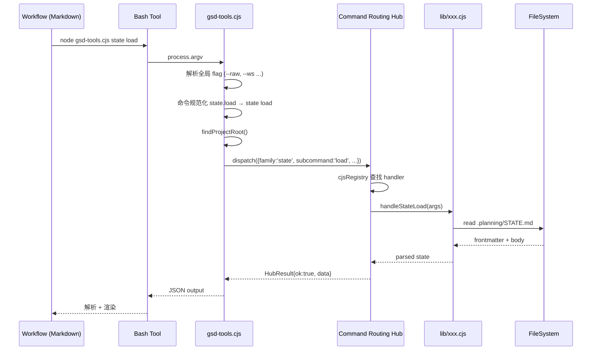
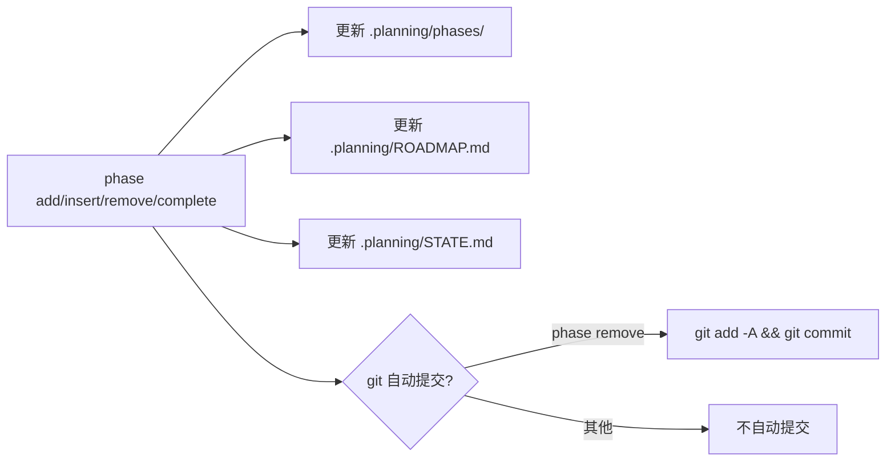
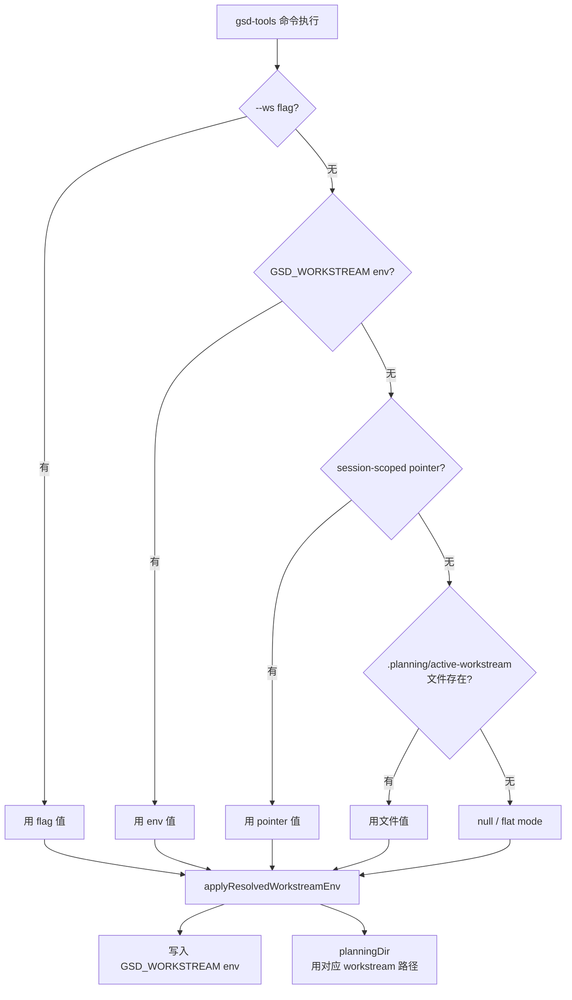
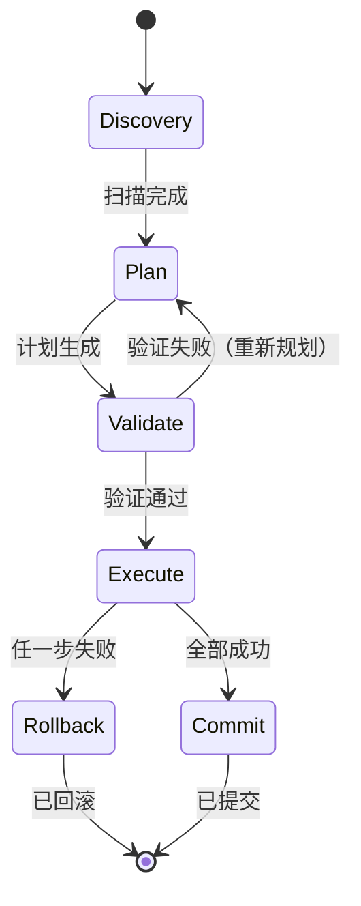
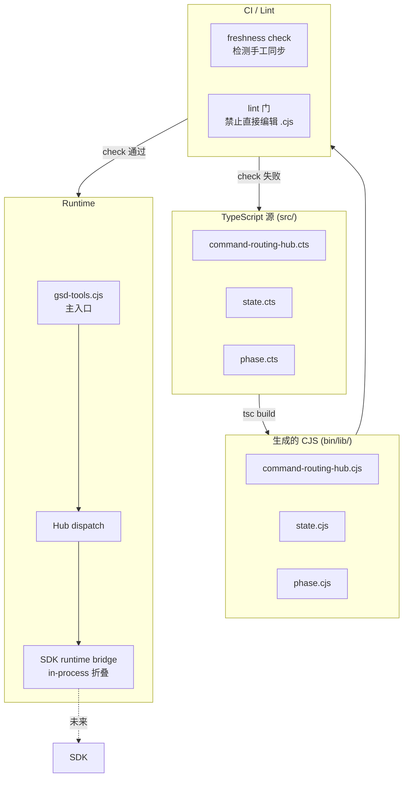
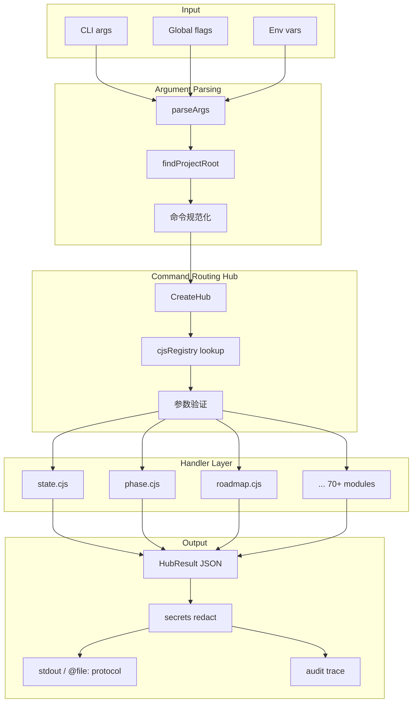

# GSD gsd-tools 使用教程

## 1. 引言与定位

### 1.1 gsd-tools 是什么

`gsd-tools`（全名 `gsd-tools.cjs`）是 open-gsd/gsd-core 仓库中的核心 CLI 引擎，承担 GSD 五大阶段循环（**Specify → Plan → Execute → Verify → Ship**）的"后端 CLI"角色。在 GSD 的整体架构中，上层的所有 `/gsd-*` 斜杠命令、workflow Markdown 文档、agent Prompt 模板，最终都通过 `Bash` 工具调用 `node gsd-tools.cjs ...` 来完成实际的 STATE.md 读写、phase 目录操作、配置管理、artifact 验证、commit 提交等动作。

换句话说，**`gsd-tools` 是 GSD 体系的"操作系统内核"**：

- 上层 `/gsd-*` 命令 = 用户接口（shell-like UI）
- 中层 `workflows/*.md` = 编排逻辑（DSL）
- 底层 `gsd-tools.cjs` + `lib/*.cjs` = 真正干活的工具集

理解 gsd-tools，就理解了 GSD 的"动力系统"。

### 1.2 与项目内已有 GSD 教程的差异化

本仓库已经积累了一批 GSD 教程，本教程在其中的定位如下：

| 文档 | 定位 |
|------|------|
| `GSD使用教程-快速入门.md` | GSD 概览、安装与基础使用 |
| `GSD使用教程-命令速查.md` | v1.35+ 全部 `/gsd-*` slash command 速查（**斜杠命令视角**） |
| `GSD使用教程-并行开发.md` | Wave / Workstream / Thread / Autonomous 场景实战 |
| `GSD使用教程-进阶指南.md` | 深度使用技巧 |
| `GSD使用教程-最佳实践.md` | 经验沉淀 |
| `GSD工作流使用指南.md` | 工作流编排 |
| `GSD使用教程-实战故事.md` | 案例分析 |

**本教程（`GSD-gsd-tools使用教程.md`）的差异化定位**：专注于 `gsd-tools.cjs` 这一**底层 CLI 工具**本身。命令速查讲 slash command，本教程讲 slash command 背后所调用的 CLI 后端。本教程适合那些想：

- 深入理解 GSD 内部机制的开发者
- 编写自定义 workflow 或 agent 的进阶用户
- 调试 GSD 异常、阅读源码贡献者
- 寻找"我能直接调用哪个 CLI 命令完成 X"的工程师

的人阅读。读完本教程，再看命令速查，会对 `/gsd-*` 背后发生的事情有完全不同的理解。

### 1.3 目标读者与前置知识

**目标读者画像**：

- **技术水平**：中级到高级开发者
- **前置知识**：
  - 熟悉 CLI 使用（命令行参数、shell 脚本、JSON 处理）
  - Node.js 基础（CommonJS 模块、环境变量、process.argv）
  - Markdown + YAML frontmatter 读写
  - 已在 Claude Code / OpenCode / Cursor 等 AI 编程 runtime 中使用过 GSD
  - 了解 GSD 基础概念（phase、STATE.md、ROADMAP、requirements）

**阅读目标**：

1. 理解 gsd-tools 的整体架构（Command Routing Hub、CJS↔SDK Seam、planning-workspace）
2. 能直接调用任何 gsd-tools 子命令完成具体任务
3. 能编写自定义 workflow / agent 调用 gsd-tools
4. 能诊断 gsd-tools 抛出的错误（HubResult 错误码、@file: 协议、exit 42 等）

### 1.4 文档结构与阅读路径

本教程共 21 章，**4 层递进结构**：

| 层级 | 章节 | 主题 |
|------|------|------|
| L1 入门 | §1–§3 | 定位、安装、命令调用基础 |
| L2 命令族详解 | §4–§10 | State / Phase / Roadmap / Config / Model / Verify / Template |
| L3 进阶主题 | §11–§19 | Init / Milestone / Workstream / Worktree / Graphify / Utility / Commit / Runtime / Observability |
| L4 实战 & 附录 | §20–§21 | 实战技巧、完整命令速查、错误码、推荐阅读 |

**推荐阅读路径**：

- **快速上手者**：§1 → §2 → §3 → §4（State）→ §21（命令速查）
- **写自定义 workflow 的进阶用户**：§1 → §3.5（Command Routing Hub）→ §11（Init）→ §20（实战）
- **想理解架构的开发者**：§3.5 → §13（Workstream）→ §18（Runtime）→ §19.3（ADR-0174）
- **日常查询者**：直接翻 §21 附录的命令速查表

```bash
# 直接调用 gsd-tools（CLI 视角，底层）
$ node gsd-tools.cjs state load
{
  "config": { "mode": "interactive", "model_profile": "balanced", ... },
  "state": { "active_phase": "03", "progress": 0.42, ... }
}

# /gsd:status slash command（高层）实际做的事：
# 1. 调 gsd-tools state load 取 JSON
# 2. 调 gsd-tools progress json 渲染进度条
# 3. 调 gsd-tools stats table 取统计
# 4. 用 Markdown 模板组装输出
```

这两个视角完全等价，只是粒度不同。理解这一点，就抓住了 GSD 的本质。

---

## 2. 仓库、安装与运行

### 2.1 仓库与 npm 包

| 项目 | 值 |
|------|---|
| GitHub | https://github.com/open-gsd/gsd-core |
| npm 包 | `@opengsd/gsd-core`（https://www.npmjs.com/package/@opengsd/gsd-core） |
| 安装命令 | `npx @opengsd/gsd-core@latest` |
| 旧仓库（已归档） | `gsd-build/get-shit-done` |
| 旧 npm 包 | `get-shit-done-cc`（已 deprecated） |
| 许可证 | MIT |
| 当前版本 | v1.40+（2026-06 持续演进中） |

**项目历史**：项目最早名为 "get-shit-done-cc"（`gsd-build` 组织下），后由社区迁移到 `open-gsd` 组织并改名为 `gsd-core`，旧仓库已归档，旧 npm 包标记 deprecated。当前所有新安装都应使用 `@opengsd/gsd-core`。

### 2.2 安装与运行

`gsd-tools` 不需要单独安装 —— 它作为 `@opengsd/gsd-core` npm 包的一部分随 slash commands / workflows 一起分发。常见使用方式有两种：

**方式一：通过 npx 临时运行（最常用）**

```bash
# 列出所有顶层命令
$ npx @opengsd/gsd-core@latest gsd-tools --help

# 调用具体子命令
$ npx @opengsd/gsd-core@latest gsd-tools state load
```

**方式二：本地克隆仓库运行（开发 / 调试 / 贡献）**

```bash
# 克隆
$ git clone https://github.com/open-gsd/gsd-core.git
$ cd gsd-core

# 直接执行
$ node bin/gsd-tools.cjs state load

# 或者把 bin/ 加到 PATH
$ export PATH="$PWD/bin:$PATH"
$ gsd-tools.cjs state load
```

**首次运行时的副作用**：

- 检测当前工作目录是否在 git 仓库中
- 自动初始化 `.planning/` 目录结构（首次执行 `/gsd:new-project` 触发）
- 检测 runtime 类型（Claude Code / OpenCode / Cursor 等）并应用对应配置
- 在 `workflow.use_worktrees` 启用时（默认）执行 `worktree base-check`

### 2.3 15 个 AI 编程 runtime 支持矩阵

`@opengsd/gsd-core` 是 **runtime 无关** 的 —— 同一份核心组件被适配到 15 个不同的 AI 编程环境：

| # | Runtime | 工具名 | hook 机制 | 本地配置 | 全局目录 | skills_subdir |
|---|---------|--------|----------|---------|---------|---------------|
| 1 | **Claude Code** | `Bash` / `Read` / `Write` / `Task` | `PostToolUse` / `PreToolUse` | `.claude/settings.json` | `~/.claude/` | `skills` |
| 2 | **OpenCode** | `bash` / `read` / `write` / `task` | `tool.execute.after` | `.opencode/config.json` | `~/.opencode/` | `skills` |
| 3 | **Gemini CLI** | `run_shell_command` / `read_file` | `afterTool` | `.gemini/settings.json` | `~/.gemini/settings.json` | `skills` |
| 4 | **Kilo** | `bash` / `edit` | `postToolUse` | `.kilo/config.json` | `~/.kilo/` | `skills` |
| 5 | **Codex** | `exec_command` / `apply_patch` | `after_command` | `.codex/config.toml` | `~/.codex/config.toml` | `skills` |
| 6 | **GitHub Copilot** | `execute` / `create_file` | `AfterTool` | `./.github/` | `~/.copilot/` | `skills` |
| 7 | **Cursor** | `Bash` / `Edit` | `postToolUse` | `.cursor/settings.json` | `~/.cursor/` | `skills` |
| 8 | **Windsurf** | `run_command` / `write_to_file` | `tool_completed` | `.windsurf/config.json` | `~/.windsurf/` | `skills` |
| 9 | **Augment Code** | `shell` / `view` | `tool_finished` | `.augment/settings.json` | `~/.augment/` | `skills` |
| 10 | **Trae** | `terminal` / `file_write` | `after_tool` | `.trae/config.json` | `~/.trae/` | `skills` |
| 11 | **Qwen Code** | `run_shell` / `write_file` | `tool_post` | `.qwen/config.json` | `~/.qwen/` | `skills` |
| 12 | **Hermes Agent** | `bash` / `edit_file` | `tool.finished` | `.hermes/config.json` | `~/.hermes/` | `skills/agents` |
| 13 | **CodeBuddy** | `shell` / `fs_write` | `tool_finished` | `.codebuddy/config.json` | `~/.codebuddy/` | `skills` |
| 14 | **Cline** | `execute_command` / `write_to_file` | rule 排除处理 | `.clinerules` | `~/.cline/` | `rules` |
| 15 | **Antigravity** | `bash` / `edit` | `after_tool_use` | `./.agent/` | `~/.antigravity/` | `skills` |
| 16\* | **Kimi CLI**¹ | `bash` / `edit` | `post_tool_use` | `.kimi/config.json` | `~/.kimi/` | `skills` |

¹ README 提到 Kimi CLI 但未进入 15 runtime 抽象层（runtime-homes.cts 仅 15 个），这里仅作并列参考。

每个 runtime 的具体工具名、hook 事件名、配置路径、模型引用方式都不尽相同。`runtime-name-policy.cjs` 负责把 alias（如 `codex-app` / `codex-cli`）归一化为规范 ID（`codex`），`runtime-artifact-layout.cjs` 决定每个 runtime 的 artifact 落点（destination subpath、prefix、staging 逻辑）。第 18 章会详细展开。

### 2.4 入口文件与目录结构

`gsd-core/` 仓库的核心目录结构如下：

```text
gsd-core/
├── bin/
│   ├── gsd-tools.cjs               # 主入口（CJS 脚本，Node 直接执行）
│   └── lib/                        # 70+ CJS 库模块
│       ├── core.cjs                # error() / output() / parseArgs()
│       ├── command-routing-hub.cjs # Command Routing Hub
│       ├── state.cjs + state-command-router.cjs + state-document.cjs
│       ├── phase.cjs + phase-command-router.cjs + phases-command-router.cjs
│       ├── roadmap.cjs + roadmap-command-router.cjs + roadmap-upgrade.cjs
│       ├── planning-workspace.cjs
│       ├── config.cjs + config-schema.cjs + config-types.cjs + configuration.cjs
│       ├── verify.cjs + verify-command-router.cjs + verification.cjs
│       ├── validate.cjs + validate-command-router.cjs
│       ├── template.cjs + frontmatter.cjs
│       ├── init.cjs + init-command-router.cjs
│       ├── worktree-base-ref.cjs
│       ├── runtime-artifact-layout.cjs + runtime-homes.cjs + runtime-name-policy.cjs
│       ├── runtime-config-adapter-registry.cjs
│       ├── install-profiles.cjs
│       ├── installer-migrations.cjs + installer-migrations/*.cjs
│       ├── observability/ (event.cjs, logger.cts, redaction.cts)
│       ├── security.cts
│       ├── secrets.cjs
│       └── ... 70+ 个模块
├── src/                            # TypeScript 源（.cts，部分生成 .cjs 的元源）
├── workflows/                      # Markdown 编排逻辑
├── agents/                         # Agent Prompt 模板
├── commands/                       # Slash command 定义
├── docs/
│   ├── CLI-TOOLS.md                # 最权威的 gsd-tools 命令参考
│   └── ... 其他文档
├── hooks/                          # runtime hook 定义
├── templates/                      # 模板文件
├── package.json
└── README.md
```

**关键约定**：

- `bin/gsd-tools.cjs` 是 CJS artifact；`src/` 下的 `.cts` 是元源；遵循 **CJS↔SDK Architecture Seam** 决策（ADR-0174），单一 TS 源 + 生成的 CJS artifact + CI freshness check + 禁止手工同步 lint 门
- `.planning/` 是**项目级**状态目录（在用户项目里，而非 gsd-core 仓库里）
- `bin/lib/` 下 70+ 模块按职责切分，每个命令族都有 `xxx.cjs` + `xxx-command-router.cjs` 配对（router 负责 Hub 注册）

```bash
# 最快验证安装
$ npx @opengsd/gsd-core@latest gsd-tools --help
Usage: gsd-tools.cjs <command> [args]

Top-level commands:
  state                Read/write STATE.md (project living state)
  phase                Phase directory CRUD
  roadmap              ROADMAP.md analysis & upgrades
  config               config.json get/set
  ...
  init                 Compound context loading
  workstream           Workstream (isolated planning context) management
  worktree             Worktree base-ref repair
  ...
```

```bash
# 查看本地克隆的目录结构
$ tree -L 2 gsd-core/
gsd-core/
├── README.md
├── README.zh-CN.md
├── README.ja-JP.md
├── README.ko-KR.md
├── README.pt-BR.md
├── LICENSE
├── package.json
├── bin/
│   ├── gsd-tools.cjs
│   └── lib/
└── docs/
    ├── CLI-TOOLS.md       # <-- 本教程主要参考
    └── ...
```

---

## 3. 命令调用基础

### 3.1 调用语法

`gsd-tools` 采用**两段式命令名**：

```bash
node gsd-tools.cjs <family> <subcommand> [args] [flags]
```

**Family（命令族）**：state、phase、roadmap、config、resolve-model、verify、validate、template、frontmatter、scaffold、init、milestone、requirements、agent-skills、skill-manifest、workstream、worktree、graphify、learnings、intel、audit、utilities、commit、agent、capability、check、effort、git、loop、generate、task、user-story、research、prompt-budget、drift-guard 等。

**Subcommand（子命令）**：每个 family 下的具体操作。

**点号 ↔ 空格规范化**：`gsd-tools` 同时接受点号和空格两种分隔符：

```bash
# 这两个完全等价
node gsd-tools.cjs state.update status
node gsd-tools.cjs state update status

# 在 shell 中点号不需要引号；空格 + 复杂参数时建议加引号
node gsd-tools.cjs "state update status"
```

**为什么支持点号形式**：因为上层 `/gsd:*` 斜杠命令经常用 `state.update` 这样的命名空间来描述意图，点号形式便于从工作流文档中直接复制粘贴到 shell。

### 3.2 全局 Flag 速查

`gsd-tools` 在分派命令前会先解析一组**全局 flag**，它们对所有命令生效：

| Flag | 作用 | 典型场景 |
|------|------|---------|
| `--raw` | 机器可读输出（纯字符串/JSON，无格式化） | 管道到 `jq` / `grep` 二次处理 |
| `--cwd <path>` | 覆盖工作目录 | 沙箱 subagent 中指定其他项目 |
| `--ws <name>` | workstream 上下文（`.planning/workstreams/<name>`） | 多 workstream 并行 |
| `--pick <field>` | 从 JSON 提取特定字段 | 嵌套字段提取（支持点号 + 括号路径） |
| `--default <value>` | `config-get` 缺省值 | 配置项不存在时不报错 |
| `--json-errors` | JSON 结构化错误输出到 stderr | 错误日志聚合 |
| `--help` / `-h` | 顶层 usage | 查帮助 |
| `--json` | 部分命令的 IR 模式 | `agent-skills --json`、`validate context --json`、`progress --json`、`audit-open --json` |

**示例**：

```bash
# 提取 state.progress 字段
$ node gsd-tools.cjs state load --pick state.progress
0.42

# 嵌套路径提取
$ node gsd-tools.cjs state load --pick state.active_phase
"03"

# 管道到 jq
$ node gsd-tools.cjs state load --raw | jq '.state.decisions | length'
5

# 指定 workstream
$ node gsd-tools.cjs init execute-phase 1 --ws backend-api
```

### 3.3 环境变量

| 环境变量 | 等价 flag | 作用 |
|----------|----------|------|
| `GSD_JSON_ERRORS=1` | `--json-errors` | 错误结构化输出到 stderr |
| `GSD_WORKSTREAM=<name>` | `--ws <name>` | workstream 上下文（优先级低于 `--ws`） |
| `GSD_AUDIT=1` | — | 启用 trace 审计，写入 `.planning/.gsd-trace.jsonl` |
| `GSD_AUDIT_ARGS=1` | — | trace 中包含 args 字段（默认 redact） |

**优先级**：CLI flag > 环境变量 > 配置文件 > 默认值。

**典型使用**：

```bash
# 启用 trace 审计（CI 场景）
$ GSD_AUDIT=1 node gsd-tools.cjs state load
# → 写入 .planning/.gsd-trace.jsonl

# CI 子进程统一设置
$ export GSD_JSON_ERRORS=1
$ node gsd-tools.cjs state load 2>/tmp/gsd-errors.log
```

### 3.4 参数解析流程

从 `process.argv` 到命令分发的完整流程：

```mermaid
flowchart TB
    A[process.argv.slice&#40;2&#41;] --> B[检查 --json-errors / GSD_JSON_ERRORS]
    B --> C[解析 --ws / GSD_WORKSTREAM]
    C --> D[解析全局 flag<br/>--raw, --pick, --default]
    D --> E[命令规范化<br/>state.update → state update]
    E --> F{拒绝 --version/-v<br/>仅显示 --help/-h}
    F --> G[findProjectRoot<br/>解析项目根]
    G --> H[顶层 switch 分发<br/>family + subcommand]
    H --> I[各 router / lib 函数]
    I --> J[输出结果]
```



**关键节点**：

1. **环境变量预检**：`GSD_JSON_ERRORS=1` 影响所有后续错误的输出格式
2. **workstream 解析**：先于命令分发，因为后续 `planningDir` 决定走哪个 `.planning/`
3. **全局 flag 解析**：从 argv 中**剥离**这些 flag，剩下的传给子命令
4. **命令规范化**：`state.update` 这种点号形式被规范化为 `state update` 数组
5. **`--version` 拒绝**：因为 gsd-tools 是 `@opengsd/gsd-core` 的一部分，版本号应通过 `npx @opengsd/gsd-core@<ver>` 表达
6. **项目根解析**：`findProjectRoot()` 从当前 cwd 向上找到最近的 `.planning/` 父目录
7. **顶层 switch**：根据 `family` 分发到对应 router 或直接 lib 函数

### 3.5 Command Routing Hub

**位置**：`bin/lib/command-routing-hub.cjs`

`gsd-tools` 引入了一个**统一的命令分发抽象层** —— Command Routing Hub。所有 family + subcommand 的解析、参数验证、handler 调用、错误处理都走 Hub 收口。

**设计原则**：

1. **No-Throw Pure-Result 模式**：dispatch **永不抛异常**，所有错误都转为结构化 `HubResult`
2. **Typed Error Variants**（`ERROR_KINDS` 冻结对象，4 种）：
   - `UnknownCommand`：family 或 subcommand 未注册
   - `InvalidArgs`：参数验证失败（payload 含 `arg` 和 `reason`）
   - `HandlerRefusal`：CJS handler 显式拒绝
   - `HandlerFailure`：handler 抛错（payload 含 `cause`）
3. **判别联合**：`HubResult = { ok: true, data } | { ok: false, kind, ...payload }`
4. **CJS-only 约束**：Hub 永远走 CJS 路径，**不存在 SDK 直连**（issue #175 简化的结果）。未来 SDK 路径通过 SDK runtime bridge 折叠到 in-process CJS 路径。

**核心数据结构**：

```javascript
// DispatchRequest
{
  family: 'state',
  subcommand: 'update',
  args: { ... },
  cwd: '/path/to/project',
  raw: false,
  parentTraceId: '...'  // 可选，用于链路追踪
}

// HubResult（成功）
{ ok: true, data: { state_path: '...', ... } }

// HubResult（失败）
{
  ok: false,
  kind: 'InvalidArgs',
  arg: 'phase',
  reason: 'phase must be a number or zero-padded string',
  provided: 'foo'
}
```

**CreateHub 工厂**：

```javascript
const hub = createHub({
  state: {
    load: handleStateLoad,         // CJS handler
    update: handleStateUpdate,
    'signal-waiting': handleSignalWaiting
  },
  phase: {
    add: handlePhaseAdd,
    complete: handlePhaseComplete
  }
  // ... 其他 family
});

const result = hub.dispatch({
  family: 'state',
  subcommand: 'update',
  args: { field: 'status', value: 'in_progress' }
});

if (result.ok) {
  console.log(result.data);
} else {
  switch (result.kind) {
    case 'UnknownCommand':   // ...
    case 'InvalidArgs':      // ...
    case 'HandlerRefusal':   // ...
    case 'HandlerFailure':   // ...
  }
}
```

**为什么 No-Throw 重要**：

- 上层 workflow 用 `bash` 调 gsd-tools，抛异常意味着 non-zero exit code
- 非零退出在某些 runtime（如 Claude Code）会触发额外的 user confirmation
- 把错误转成 JSON 返回，workflow 可以**用同一个 JSON 解析路径**处理成功和失败

```bash
# 成功结果
$ node gsd-tools.cjs state load
{
  "ok": true,
  "data": {
    "state_path": "/Users/ziogn/proj/.planning/STATE.md",
    "config": { ... },
    "state": { "active_phase": "03", ... }
  }
}

# 失败结果（--json-errors 模式）
$ node gsd-tools.cjs state update badfield 123 --json-errors 2>&1
{
  "ok": false,
  "kind": "InvalidArgs",
  "arg": "field",
  "reason": "Unknown state field",
  "provided": "badfield",
  "hint": "Valid fields: status, active_phase, next_action, progress, current_phase, current_plan"
}
```



---

## 4. State 命令族

`state` 命令族负责 `.planning/STATE.md` 文件的读写。STATE.md 是 GSD 项目的 **living position tracker** —— 它记录项目当前在哪个 phase / plan、做了哪些决策、阻塞在哪里、进度如何、上次会话停在何处。

### 4.1 STATE.md 文件结构

STATE.md 顶部是 YAML frontmatter，下方是 Markdown body：

```markdown
---
gsd_state_version: 1
milestone: v1.0
status: in_progress
active_phase: 03
next_action: "继续 phase 3 plan 02"
progress: 0.42
current_phase: 03
current_plan: 02
last_updated: 2026-06-12 14:30
stopped_at: "phase 3 plan 02 task 3"
paused_at: null
---

# State

## Current Position
...

## Decisions Made
- [phase 3] Chose JWT over session cookies for cross-domain auth
- [phase 2] Adopted repository pattern for data access

## Accumulated Context
...
```

**关键 frontmatter 字段**：

| 字段 | 类型 | 说明 |
|------|------|------|
| `gsd_state_version` | int | STATE.md schema 版本 |
| `milestone` | string | 当前 milestone（如 `v1.0`） |
| `status` | enum | `not_started` / `in_progress` / `paused` / `blocked` / `complete` |
| `active_phase` | string | 当前活跃 phase（零填充字符串） |
| `next_action` | string | 下一步动作描述 |
| `progress` | float (0-1) | 全局进度 |
| `current_phase` / `current_plan` | string | 当前 phase/plan 编号 |
| `last_updated` | timestamp | 最后更新时间 |
| `stopped_at` | string | 上次会话停止点（resume 用） |
| `paused_at` | timestamp/null | 暂停时间 |

**Markdown body 段落**：

- **Current Position**：人类可读的当前位置描述
- **Decisions Made**：按 phase 组织的决策记录（`add-decision` 命令写入）
- **Accumulated Context**：累积上下文（测试结果、依赖、约束等）

### 4.2 加载与查询

| 命令 | 用途 |
|------|------|
| `state load` | 加载完整项目 config + state 为 JSON |
| `state json` | 仅输出 STATE.md frontmatter 为 JSON |
| `state get [section]` | 读取 STATE.md 内容（Markdown body）或指定段（`current_position` / `decisions` / `context`） |
| `state-snapshot` | 完整 STATE.md 结构化解析（current position、phase、plan、status、decisions、blockers、metrics、last activity） |

```bash
# 加载完整 state
$ node gsd-tools.cjs state load
{
  "config": { "mode": "interactive", "model_profile": "balanced", ... },
  "state": { "active_phase": "03", "progress": 0.42, ... }
}

# 仅 frontmatter
$ node gsd-tools.cjs state json
{ "gsd_state_version": 1, "milestone": "v1.0", "status": "in_progress", ... }

# 读 Markdown body 全文
$ node gsd-tools.cjs state get
## Current Position
...

# 读特定段
$ node gsd-tools.cjs state get current_position
Phase 3 plan 02, implementing JWT auth middleware.

# 结构化快照
$ node gsd-tools.cjs state-snapshot
{
  "current_position": "...",
  "phase": "03",
  "plan": "02",
  "status": "in_progress",
  "decisions": [...],
  "blockers": [...],
  "metrics": [...],
  "last_activity": "2026-06-12T14:30:00+08:00"
}
```

### 4.3 单字段与批量更新

```bash
# 单字段更新
$ node gsd-tools.cjs state update status in_progress
$ node gsd-tools.cjs state update active_phase 03
$ node gsd-tools.cjs state update next_action "Continue phase 3 plan 02"

# 批量更新（一次写多个字段，避免多次 I/O）
$ node gsd-tools.cjs state patch \
    --status in_progress \
    --active_phase 03 \
    --current_plan 02 \
    --progress 0.45
```

**单字段 vs 批量**：

- `state update <field> <value>` 适合 atomic 单字段（每次都做 full re-read + write）
- `state patch` 在**一次事务**内更新多个字段，避免 race condition
- 复杂 value（如含空格）用 `--field value` 形式更易处理转义

### 4.4 执行指标

```bash
# plan 计数 +1
$ node gsd-tools.cjs state advance-plan

# 记录执行指标
$ node gsd-tools.cjs state record-metric \
    --phase 03 \
    --plan 02 \
    --duration 47min \
    --tasks 5 \
    --files 8

# 重算 progress（基于已完成 plan / 总 plan）
$ node gsd-tools.cjs state update-progress
```

**`state record-metric` 内部逻辑**：

- 写入 `.planning/metrics/<phase>-<plan>.json`
- 同时更新 STATE.md 的 `metrics` 列表（如果存在）
- `duration` 支持 `47min` / `2h` / `90s` 三种单位
- `tasks` 和 `files` 为可选整数

### 4.5 决策与阻塞项

```bash
# 追加决策
$ node gsd-tools.cjs state add-decision \
    --summary "Use JWT for cross-domain auth" \
    --phase 03 \
    --rationale "Cookie-based session has CORS issues with multiple subdomains"

# 长文本用文件（避免 shell 转义）
$ node gsd-tools.cjs state add-decision \
    --summary-file ./decision-summary.txt \
    --rationale-file ./decision-rationale.txt

# 追加阻塞项
$ node gsd-tools.cjs state add-blocker \
    --text "Waiting on design team for login page mockups"

# 解决阻塞项
$ node gsd-tools.cjs state resolve-blocker \
    --text "Login page mockups received 2026-06-12"
```

**决策与阻塞项的存储**：决策写入 STATE.md body 的 `## Decisions Made` 段（按 phase 分组），阻塞项维护一个独立的 `.planning/blockers.json` 索引。

### 4.6 会话连续性

```bash
# 记录会话断点
$ node gsd-tools.cjs state record-session \
    --stopped-at "phase 3 plan 02 task 3" \
    --resume-file ./handoff-notes.md

# 开始新 phase（更新 Status 和 Last activity）
$ node gsd-tools.cjs state begin-phase \
    --phase 03 \
    --name api-design \
    --plans 4
```

`state record-session` 把会话断点写入 STATE.md 的 `stopped_at` 字段，**还会在 `.planning/HANDOFF.json` 写一份结构化 resume hint**，下次 `/gsd:resume-project` 时读取。`--resume-file` 是可选的额外上下文文件（如手写的 handoff 笔记）。

`state begin-phase` 会级联更新：

- `status: in_progress`
- `active_phase: <N>`
- `current_phase: <N>`
- `current_plan: 01`
- `progress: <按已完成 phase 占比重算>`
- `last_activity: <now>`

### 4.7 阻塞信号（agent ↔ UI）

`state signal-waiting` / `state signal-resume` 是一对**阻塞信号命令**，用于 agent 在需要用户输入时通知上层 UI（Claude Code 桌面、OpenCode UI、custom dashboard）：

```bash
# 阻塞并提问
$ node gsd-tools.cjs state signal-waiting \
    --type decision \
    --question "Should we use PostgreSQL or MySQL?" \
    --options "PostgreSQL|MySQL|Skip for now" \
    --phase 03

# 清除阻塞信号（继续执行）
$ node gsd-tools.cjs state signal-resume
```

**`--type` 支持**：

- `decision`：需要决策
- `input`：需要自由文本输入
- `choice`：需要从固定选项中选
- `confirmation`：需要 yes/no 确认

**存储位置**：信号写入 `.planning/waiting.json`，UI 层通过监听该文件变化或在每次 workflow start 时轮询展示。

```bash
#!/bin/bash
# 一次完整的 state 写入工作流

# 1. 加载当前 state
STATE=$(node gsd-tools.cjs state load)

# 2. 解析需要更新的字段
CURRENT_PROGRESS=$(echo "$STATE" | jq -r '.state.progress')

# 3. 批量更新
node gsd-tools.cjs state patch \
    --status in_progress \
    --active_phase 03 \
    --current_plan 02 \
    --progress $(echo "$CURRENT_PROGRESS + 0.05" | bc -l)

# 4. 追加决策
node gsd-tools.cjs state add-decision \
    --summary "Implemented JWT middleware" \
    --phase 03

# 5. 记录执行指标
node gsd-tools.cjs state record-metric \
    --phase 03 \
    --plan 02 \
    --duration 35min \
    --tasks 4

# 6. 推进 plan
node gsd-tools.cjs state advance-plan

# 7. 重算 progress
node gsd-tools.cjs state update-progress
```

```bash
$ node gsd-tools.cjs state record-metric \
    --phase 03 --plan 02 --duration 47min --tasks 5 --files 8
{
  "ok": true,
  "data": {
    "metric_path": ".planning/metrics/03-02.json",
    "phase": "03",
    "plan": "02",
    "duration_minutes": 47,
    "tasks": 5,
    "files_changed": 8,
    "recorded_at": "2026-06-13T10:15:00+08:00"
  }
}
```

---

## 5. Phase 命令族

`phase` 命令族管理 `.planning/phases/<NN>-<slug>/` 目录的完整生命周期 —— 增删改查、插入十进制 phase、与 ROADMAP.md / STATE.md 同步。

### 5.1 phase 目录命名规范

所有 phase 目录都遵循 `<NN>-<slug>/` 格式：

- **NN**：零填充数字（`01` / `02` / ... / `99`），保证字典序与数字序一致
- **slug**：由 `generate-slug` 命令从 phase 描述生成（URL-safe，仅含 `[a-z0-9-]`）
- **示例**：`01-foundation/`、`02-api-design/`、`03.5-extra-auth/`（插入的十进制 phase 用 `.` 分隔）

### 5.2 定位与编号

```bash
# 按编号定位 phase 目录
$ node gsd-tools.cjs find-phase 03
.planning/phases/03-api-design

# 找下一个十进制 phase 号（用于插入）
$ node gsd-tools.cjs phase next-decimal 03
3.5   # 03 和 04 之间可插入 03.5
```

`find-phase` 支持多种输入形式：

- `find-phase 03` → 找 `03-*` 目录
- `find-phase 3` → 找 `03-*` 目录（自动补零）
- `find-phase 03.5` → 找 `03.5-*` 目录
- `find-phase api-design` → 按 slug 找（不推荐，编号优先）

### 5.3 增删改

```bash
# 追加 phase（找下一个编号 + 生成 slug + 建目录 + 写 ROADMAP + 写 STATE）
$ node gsd-tools.cjs phase add "Add OAuth2 authentication"

# 插入十进制 phase（在指定 phase 之后）
$ node gsd-tools.cjs phase insert 03 "Hotfix: critical bug in login flow"
# 实际生成 03.5-hotfix-critical-bug-in-login-flow/
# 在 ROADMAP.md 中标记 (INSERTED)

# 删除 phase（自动重编号后续 phase + 提交 git）
$ node gsd-tools.cjs phase remove 03.5 --force

# 标记完成
$ node gsd-tools.cjs phase complete 03
```

**`phase add` 的内部步骤**：

1. 扫描 `.planning/phases/` 找当前最大编号
2. 用 `generate-slug` 从描述生成 slug
3. 创建 `NN-slug/` 目录
4. 生成 `NN-slug-PLAN.md` 模板（空骨架）
5. 追加到 `ROADMAP.md` 的 phase 列表
6. 更新 `STATE.md` 的 `Roadmap Evolution` 段

**`phase insert` vs `phase add`**：

| 维度 | `add` | `insert` |
|------|-------|----------|
| 编号 | 下一个整数（04, 05, ...） | 下一个十进制（3.5, 3.6, ...） |
| ROADMAP 标记 | 无 | `(INSERTED)` |
| next-phase 指针 | 不变 | 更新指向插入的 phase |
| 适用场景 | 新增里程碑任务 | 紧急插队任务（hotfix） |

**`phase remove` 的级联**：

- 删除 phase 目录
- 后续 phase **重编号**（03.5 → 03, 04 → 03.5, ...）
- 更新 ROADMAP.md
- 自动 `git add -A && git commit -m "Remove phase 03.5"`

**`phase complete` 的级联**：

- 标记 phase 目录中所有 plan 的 SUMMARY.md 存在性
- 更新 ROADMAP.md 的 phase 状态（`[ ]` → `[x]`）
- 更新 STATE.md 的 `completed_phases` 列表
- 触发 verifier（`verify phase-completeness`）

### 5.4 索引与列表

```bash
# 索引 phase 内所有 plan（含 wave + status）
$ node gsd-tools.cjs phase-plan-index 03
[
  { "plan": "01", "wave": 1, "status": "complete", "summary": "..." },
  { "plan": "02", "wave": 1, "status": "complete", "summary": "..." },
  { "plan": "03", "wave": 2, "status": "in_progress", "summary": null },
  { "plan": "04", "wave": 2, "status": "planned", "summary": null }
]

# 列出 phase
$ node gsd-tools.cjs phases list
$ node gsd-tools.cjs phases list --type executed
$ node gsd-tools.cjs phases list --type planned
$ node gsd-tools.cjs phases list --type all
$ node gsd-tools.cjs phases list --phase 03
$ node gsd-tools.cjs phases list --include-archived
```

**`phases list --type`** 过滤：

- `executed`：已执行的 phase（目录存在）
- `planned`：仅在 ROADMAP.md 中规划但目录未创建
- `all`：两者都列出（默认）

### 5.5 与 ROADMAP/STATE 的同步机制

phase 命令族的所有 CRUD 操作都会触发**级联同步**：



**为什么 ROADMAP 和 STATE 需要同步**：

- **ROADMAP.md**：项目构建内容 + 顺序的 single source of truth
- **STATE.md**：项目 living position tracker
- 两者必须保持一致，否则 `/gsd:status` 会显示错误状态

**手工校验同步**：

```bash
# 检查 ROADMAP 与磁盘是否一致
$ node gsd-tools.cjs validate consistency

# 检查 .planning/ 健康度
$ node gsd-tools.cjs validate health
```

```bash
# 场景：phase 03 后插入一个紧急任务

# 方式一：phase add（在末尾追加，会变成 04）
$ node gsd-tools.cjs phase add "Hotfix: critical login bug"
# → .planning/phases/04-hotfix-critical-login-bug/
# → ROADMAP.md 末尾追加
# → next-phase 仍是 05

# 方式二：phase insert（在 03 后插入，变成 03.5）
$ node gsd-tools.cjs phase insert 03 "Hotfix: critical login bug"
# → .planning/phases/03.5-hotfix-critical-login-bug/
# → ROADMAP.md 在 03 后追加 (INSERTED) 标记
# → next-phase 变成 04
```

```bash
$ node gsd-tools.cjs phase-plan-index 03 --json
{
  "phase": "03",
  "phase_dir": ".planning/phases/03-api-design",
  "plans": [
    {
      "plan": "01",
      "file": ".planning/phases/03-api-design/03-01-PLAN.md",
      "wave": 1,
      "status": "complete",
      "summary_path": ".planning/phases/03-api-design/03-01-SUMMARY.md",
      "duration_minutes": 42,
      "completed_at": "2026-06-10T11:20:00+08:00"
    },
    {
      "plan": "02",
      "file": ".planning/phases/03-api-design/03-02-PLAN.md",
      "wave": 1,
      "status": "complete",
      "summary_path": ".planning/phases/03-api-design/03-02-SUMMARY.md",
      "duration_minutes": 35,
      "completed_at": "2026-06-11T09:45:00+08:00"
    },
    {
      "plan": "03",
      "file": ".planning/phases/03-api-design/03-03-PLAN.md",
      "wave": 2,
      "status": "in_progress",
      "summary_path": null,
      "duration_minutes": null,
      "completed_at": null
    }
  ],
  "wave_count": 2,
  "complete_count": 2,
  "total_count": 3
}
```

---

## 6. Roadmap 命令族

`roadmap` 命令族负责 `ROADMAP.md` 的解析、查询、进度同步与升级。

### 6.1 ROADMAP.md 结构

ROADMAP.md 是 GSD 项目的"构建内容 + 顺序"的 single source of truth。其 Markdown 模板大致如下：

```markdown
# Roadmap: My Project

## Milestone: v1.0 — Foundation

### Phase 01: Foundation
**Goal**: Bootstrap project structure, set up CI/CD
**Plans**: 3 plans across 2 waves

- [ ] **01-01-PLAN.md** — Initialize repo and base configs
- [ ] **01-02-PLAN.md** — Set up CI pipeline
- [ ] **01-03-PLAN.md** — Add deployment scripts

### Phase 02: API Design
**Goal**: Design REST API contracts
**Plans**: 4 plans across 2 waves

- [x] **02-01-PLAN.md** — Define OpenAPI schema
- [x] **02-02-PLAN.md** — Generate TypeScript types
- [ ] **02-03-PLAN.md** — Implement core endpoints
- [ ] **02-04-PLAN.md** — Add request validation

### Phase 03: Authentication
**Goal**: Implement user auth
**Plans**: 4 plans across 2 waves

- [ ] **03-01-PLAN.md** — Database schema
- [ ] **03-02-PLAN.md** — JWT middleware
- [ ] **03-03-PLAN.md** — Login/logout endpoints
- [ ] **03-04-PLAN.md** — Refresh token flow
```

**关键语法元素**：

- `## Milestone:` 分段
- `### Phase NN:` 子段
- `- [ ]` 待办，`- [x]` 已完成
- `**NN-SS-PLAN.md**` 是 plan 路径
- `**Goal**` / `**Plans**` 是元数据

### 6.2 解析与查询

```bash
# 提取指定 phase 段
$ node gsd-tools.cjs roadmap get-phase 03
{
  "phase": "03",
  "title": "Authentication",
  "goal": "Implement user auth",
  "plans_count": 4,
  "waves_count": 2,
  "plans": [
    { "file": "03-01-PLAN.md", "status": "pending", "wave": 1 },
    { "file": "03-02-PLAN.md", "status": "pending", "wave": 1 },
    { "file": "03-03-PLAN.md", "status": "pending", "wave": 2 },
    { "file": "03-04-PLAN.md", "status": "pending", "wave": 2 }
  ]
}

# 完整 ROADMAP 解析 + 磁盘状态对照
$ node gsd-tools.cjs roadmap analyze
{
  "milestones": [...],
  "phases": [
    {
      "phase": "01",
      "title": "Foundation",
      "disk_state": "complete",
      "roadmap_state": "complete",
      "drift": false
    },
    {
      "phase": "02",
      "title": "API Design",
      "disk_state": "in_progress",
      "roadmap_state": "in_progress",
      "drift": false
    },
    {
      "phase": "03",
      "title": "Authentication",
      "disk_state": "planned",
      "roadmap_state": "planned",
      "drift": false
    }
  ],
  "drift_count": 0
}
```

**`roadmap analyze` 的 drift 检测**：

- 对每个 phase，对比"磁盘 SUMMARY 状态"与"ROADMAP 标记状态"
- 如果不一致，标记 `drift: true`
- 触发 `/gsd:audit` 时单独列出 drift 项

### 6.3 进度与校验

```bash
# 按磁盘状态更新 ROADMAP 进度表
$ node gsd-tools.cjs roadmap update-plan-progress 03
# → 把 03-03-PLAN.md 标记 [x]（如果 SUMMARY.md 存在）

# 结构完整性校验
$ node gsd-tools.cjs roadmap validate
{
  "ok": true,
  "errors": [],
  "warnings": [
    "Phase 03 has no execution directory (planned only)"
  ]
}
```

**`roadmap validate` 检查项**：

- milestone prefix 一致性（如 `Milestone: v1.0` 与 phase 编号前缀匹配）
- phase 编号无跳跃（01 → 02 → 04 会报错）
- 必填段（`### Phase NN:`, `**Goal**`, `**Plans**`）完整
- plan 引用路径合法

### 6.4 旧格式升级

```bash
# 升级旧 phase ID（不带 milestone prefix）
$ node gsd-tools.cjs roadmap upgrade --convention milestone-prefixed
# 1-foundation → v1-1-foundation
# 2-api → v1-2-api
```

**适用场景**：从 GSD-2 / `get-shit-done-cc` 老版本迁移过来，phase 目录命名是 `1-foundation` 而不是 `01-foundation`，且没有 milestone prefix。`--convention` 当前支持：

- `milestone-prefixed`：加 milestone 前缀（`v1-1-foundation`）
- `zero-padded`：补零（`1-foundation` → `01-foundation`）

```bash
$ node gsd-tools.cjs roadmap analyze --json | jq '.phases[] | select(.drift == true)'
# → 列出所有 drift 的 phase
```

---

## 7. Config 命令族

`config` 命令族管理 `.planning/config.json` —— GSD 的配置中枢。它定义 model profile、workflow 行为、API key、review CLI 路由等所有可配置项。

### 7.1 .planning/config.json 顶层结构

```json
{
  "mode": "interactive",
  "granularity": "standard",
  "model_profile": "balanced",
  "workflow": {
    "research": true,
    "plan_check": true,
    "verifier": true,
    "auto_advance": false,
    "use_worktrees": true,
    "code_review": false
  },
  "planning": {
    "commit_docs": true,
    "search_gitignored": false
  },
  "model_overrides": {
    "gsd-planner": "opus",
    "gsd-executor": "sonnet"
  },
  "models": {
    "execute": "sonnet",
    "research": "haiku"
  },
  "git": {
    "branching_strategy": "phase"
  },
  "graphify": {
    "enabled": true
  },
  "intel": {
    "enabled": false
  },
  "features": {
    "global_learnings": true
  },
  "review": {
    "models": {
      "codex": "codex exec --model gpt-5",
      "gemini": "gemini -m gemini-2.5-pro",
      "opencode": "opencode run --model claude-sonnet-4",
      "claude": ""
    }
  },
  "audit": {
    "enabled": false
  },
  "brave_search_api_key": "sk-...",
  "firecrawl_api_key": "fc-...",
  "exa_search_api_key": "exa-..."
}
```

**关键字段分类**：

| 分类 | 字段 |
|------|------|
| 核心 | `mode`、`granularity`、`model_profile` |
| 工作流 | `workflow.*`（research / plan_check / verifier / auto_advance / use_worktrees / code_review） |
| 规划 | `planning.*`（commit_docs / search_gitignored） |
| 模型 | `model_overrides[<agent>]`、`models[<phase_type>]` |
| Git | `git.branching_strategy`（`phase` / `feature` / `none`） |
| 特性开关 | `graphify.enabled`、`intel.enabled`、`features.global_learnings` |
| Code Review | `review.models.<cli>` |
| 审计 | `audit.enabled` |
| API key | `brave_search_api_key` / `firecrawl_api_key` / `exa_search_api_key`（plaintext 存储，输出时掩码） |

### 7.2 基本读写

```bash
# 用默认初始化（如果 config.json 不存在）
$ node gsd-tools.cjs config-ensure-section

# 点号路径写入
$ node gsd-tools.cjs config-set model_profile quality
$ node gsd-tools.cjs config-set workflow.auto_advance true
$ node gsd-tools.cjs config-set review.models.codex "codex exec --model gpt-5"

# 读取
$ node gsd-tools.cjs config-get model_profile
"balanced"

# 缺省值
$ node gsd-tools.cjs config-get workflow.code_review --default false
false

# 切换 model profile
$ node gsd-tools.cjs config-set-model-profile quality
```

**`config-set` 的值类型推断**：

| 值 | 推断类型 |
|----|----------|
| `true` / `false` | boolean |
| `123` / `3.14` | number |
| `[1,2,3]` / `{"a":1}` | JSON（需 shell 转义） |
| 其他 | string |

### 7.3 点号路径语法

点号路径支持嵌套和数组索引：

```bash
# 嵌套 key
workflow.use_worktrees      # → workflow["use_worktrees"]
model_overrides.gsd-planner # → model_overrides["gsd-planner"]
review.models.codex         # → review.models["codex"]

# 数组索引（--pick 用，--set 暂不支持）
$ node gsd-tools.cjs state load --pick state.phases[0]
{ "phase": "01", "title": "Foundation" }

# 组合
$ node gsd-tools.cjs state load --pick state.phases[0].title
"Foundation"
```

**`--pick` vs `config-get`**：

- `--pick` 用于**已经返回的 JSON** 进一步提取（只读、纯客户端）
- `config-get` 直接读 config.json 中的某个 key

### 7.4 API key 与 Secret 掩码

`/gsd-settings` 配置的 API key（`brave_search_api_key` / `firecrawl_api_key` / `exa_search_api_key`）plaintext 写入 `config.json`，但**输出时掩码**：

```bash
$ node gsd-tools.cjs config-get brave_search_api_key
"****abcd"  # 保留后 4 位

# 短于 8 字符 → 全 **** 掩码
$ node gsd-tools.cjs config-get some_short_key
"****"
```

**掩码规则**（`lib/secrets.cjs`）：

- 长度 ≥ 8：显示 `****<last-4>`（前 4 个 `*` + 后 4 位明文）
- 长度 < 8：全 `****` 掩码

**安全边界**：`config.json` 文件本身需要：

1. **文件系统权限保护**（`chmod 600`，仅 owner 可读写）
2. **gitignore**（`.planning/` 目录默认在 `.gitignore` 中，避免 API key 入仓）

**绝不**：

- 提交 `config.json` 到 git
- 在公开场合粘贴 `config-get` 输出（即便已掩码，也不暴露长度信息）
- 通过 `config-set` 设置 API key 后**不要**用 `state load` 等命令读取整文件（即使掩码也增加风险面）

### 7.5 Code Review CLI 路由

`review.models.<cli>` 字段把 reviewer flavor 映射到 shell 命令，由 `/gsd-config --integrations` 设置：

```bash
# Codex review
$ node gsd-tools.cjs config-set review.models.codex "codex exec --model gpt-5"

# Gemini review
$ node gsd-tools.cjs config-set review.models.gemini "gemini -m gemini-2.5-pro"

# OpenCode review
$ node gsd-tools.cjs config-set review.models.opencode "opencode run --model claude-sonnet-4"

# Claude review（fallback 到 session model）
$ node gsd-tools.cjs config-set review.models.claude ""

# 读取
$ node gsd-tools.cjs config-get review.models.codex
"codex exec --model gpt-5"
```

**slug 验证**：`<cli>` 字段必须匹配 `[a-zA-Z0-9_-]+`，空或含路径的 slug 被拒绝：

```bash
# 合法
$ node gsd-tools.cjs config-set review.models.codex-rev "..."
$ node gsd-tools.cjs config-set review.models.gpt_5 "..."

# 非法（被拒绝）
$ node gsd-tools.cjs config-set review.models../path "..."  # 路径分隔符
$ node gsd-tools.cjs config-set review.models ""            # 空字符串
```

```json
{
  "mode": "interactive",
  "granularity": "standard",
  "model_profile": "balanced",
  "workflow": {
    "research": true,
    "plan_check": true,
    "verifier": true,
    "auto_advance": false,
    "use_worktrees": true,
    "code_review": false
  },
  "planning": {
    "commit_docs": true,
    "search_gitignored": false
  },
  "model_overrides": {
    "gsd-planner": "opus",
    "gsd-executor": "sonnet",
    "gsd-verifier": "haiku"
  },
  "models": {
    "execute": "sonnet",
    "research": "haiku",
    "plan": "opus"
  },
  "git": {
    "branching_strategy": "phase"
  },
  "graphify": {
    "enabled": true
  },
  "features": {
    "global_learnings": true
  },
  "review": {
    "models": {
      "codex": "codex exec --model gpt-5",
      "gemini": "gemini -m gemini-2.5-pro",
      "opencode": "opencode run --model claude-sonnet-4"
    }
  },
  "brave_search_api_key": "sk-brave-1234567890abcdef"
}
```

```bash
# 团队统一设置（CI 脚本）
#!/bin/bash
node gsd-tools.cjs config-set review.models.codex "codex exec --model gpt-5"
node gsd-tools.cjs config-set review.models.gemini "gemini -m gemini-2.5-pro"
node gsd-tools.cjs config-set review.models.opencode "opencode run --model claude-sonnet-4"

# 个人偏好：清空某个 review 路由（fallback 到 session model）
node gsd-tools.cjs config-set review.models.claude ""
```

---

## 8. Model Resolution

`resolve-model` 命令用于查询某个 agent 应该使用哪个 model。它是 GSD **多模型协作架构**的核心 —— 不同任务（规划 / 执行 / 研究 / 验证）用不同 model，平衡成本与质量。

### 8.1 `resolve-model <agent-name>` 调用

```bash
# 基本查询
$ node gsd-tools.cjs resolve-model gsd-planner
opus

# JSON 输出（推荐用于 workflow）
$ node gsd-tools.cjs resolve-model gsd-planner --json
{
  "model": "opus",
  "profile": "balanced",
  "effort": "high"
}
```

**`--json` 输出字段**：

| 字段 | 说明 |
|------|------|
| `model` | 实际选定的 model ID（如 `opus` / `sonnet` / `haiku`） |
| `profile` | 当前生效的 model profile（`quality` / `balanced` / `budget` / `adaptive` / `inherit`） |
| `effort` | 推理强度（`low` / `medium` / `high` / `max`）—— **v1.42 起替代旧的 `reasoning_effort`** |

**为什么用 `effort` 而不是 `reasoning_effort`**：

- `reasoning_effort` 是 OpenAI 风格的命名
- `effort` 是 Anthropic 风格的命名
- GSD 跟随 runtime 主流约定，**v1.42 起**统一用 `effort`（旧字段 `reasoning_effort` 在 v1.42 已弃用）
- 提示：`docs/CLI-TOOLS.md` 主分支可能仍保留 `reasoning_effort` 旧描述，以 v1.42+ 实际行为与 `effort` 字段为准

### 8.2 5 级解析优先级

`resolve-model` 解析 model 时按以下优先级（高到低）：

| 优先级 | 来源 | 适用场景 |
|--------|------|---------|
| 1 | `model_overrides[<agent>]` | 个人/团队显式覆盖某个 agent |
| 2 | `dynamic_routing.tier_models[<tier>]` | 动态路由（按任务 tier 软失败升级） |
| 3 | `models[<phase_type>]` | 粗粒度按阶段类型（execute / research / plan） |
| 4 | `model_profile` 全局 profile 表 | 按 agent 列的默认值 |
| 5 | Runtime default | 未配置时的 fallback |

**示例配置**：

```json
{
  "model_overrides": {
    "gsd-planner": "opus"        // 优先级 1：个人覆盖
  },
  "dynamic_routing": {
    "tier_models": {
      "low": "haiku",
      "medium": "sonnet",
      "high": "opus"
    }
  },
  "models": {
    "execute": "sonnet",          // 优先级 3：阶段类型
    "research": "haiku"
  },
  "model_profile": "balanced"     // 优先级 4：全局 profile
}
```

**软失败升级（dynamic_routing）**：

- 任务初始用 `low` tier（haiku）
- 如果模型返回"能力不足"信号，自动升级到 `medium`（sonnet）
- 仍不足则升级到 `high`（opus）
- 升级轨迹写入 audit log

### 8.3 5 个内置 profile

| Profile | 策略 | 适用场景 |
|---------|------|---------|
| **`quality`** | Opus 决策 + Sonnet 只读验证 | 关键项目 / 复杂决策 / 高质量交付 |
| **`balanced`**（默认） | Opus 规划 + Sonnet 执行/研究/验证 | 日常开发 / 性能与质量平衡 |
| **`budget`** | Sonnet 编码 + Haiku 研究/验证 | 大规模 / 成本敏感 / 简单任务 |
| **`adaptive`** | 按角色动态：Opus 关键推理 + Sonnet 执行/研究/验证 + Haiku 映射/检查/审计 | 复杂项目 / 多角色协调 |
| **`inherit`** | 全部 agent 用当前 session 模型 | 非 Anthropic provider（OpenAI / Gemini / Ollama）必选 |

**profile 选择建议**：

- **个人开发者**：默认 `balanced`，关键 milestone 切换 `quality`
- **企业团队**：`quality` 为主，CI/CD 用 `budget`
- **本地非 Anthropic 模型**：`inherit`（用 session 当前模型）
- **多模型协作实验**：`adaptive`

### 8.4 34 个官方 agent 名清单

`resolve-model` 支持以下 34 个官方 agent 名（来源 `INVENTORY-MANIFEST.json`，实际可能更多）：

| Agent 名 | 角色 | 默认 profile |
|----------|------|--------------|
| `gsd-planner` | 生成 PLAN.md | Opus |
| `gsd-executor` | 执行 plan 任务 | Sonnet |
| `gsd-phase-researcher` | 单 phase 研究 | Sonnet |
| `gsd-project-researcher` | 全项目研究 | Sonnet |
| `gsd-research-synthesizer` | 综合多源研究 | Sonnet |
| `gsd-verifier` | 验证 phase 完成度 | Sonnet |
| `gsd-plan-checker` | 检查 PLAN 质量 | Sonnet |
| `gsd-integration-checker` | 集成检查 | Sonnet |
| `gsd-roadmapper` | 生成/更新 ROADMAP | Opus |
| `gsd-debugger` | 调试失败任务 | Sonnet |
| `gsd-codebase-mapper` | 映射代码库 | Haiku |
| `gsd-nyquist-auditor` | Nyquist 验证 | Sonnet |
| `gsd-intel-updater` | 重建 intel 索引 | Haiku |
| `gsd-graphify` | 构建知识图谱 | Haiku |
| `gsd-discuss-phase` | 讨论 phase 决策 | Opus |
| `gsd-list-phase-assumptions` | 列出 phase 假设 | Sonnet |
| `gsd-uat` | UAT checkpoint | Sonnet |
| `gsd-audit` | 审计 queue | Haiku |
| `gsd-progress-renderer` | 渲染进度 | Haiku |
| `gsd-stats-renderer` | 渲染统计 | Haiku |
| `gsd-new-project` | new-project workflow | Opus |
| `gsd-new-milestone` | new-milestone workflow | Opus |
| `gsd-quick` | quick 任务 | Sonnet |
| `gsd-resume-project` | 恢复项目 | Sonnet |
| `gsd-verify-work` | UAT 验证 | Sonnet |
| `gsd-map-codebase` | 并行 codebase 映射 | Haiku |
| `gsd-orchestrator` | 多 agent 编排协调 | Opus |
| `gsd-spec-writer` | 撰写 SPEC.md | Sonnet |
| `gsd-spec-reviewer` | 评审 SPEC 质量 | Sonnet |
| `gsd-plan-writer` | 撰写 PLAN.md 草案 | Sonnet |
| `gsd-commit-message` | 生成 commit message | Haiku |
| `gsd-statusline-generator` | 生成状态栏 | Haiku |
| `gsd-progress-checkpoint` | 进度 checkpoint 写入 | Haiku |
| `gsd-test-writer` | 生成测试用例 | Sonnet |

### 8.5 runtime-specific tier 映射

不同 runtime 的 model ID 命名规范不同：

| Runtime | Opus ID | Sonnet ID | Haiku ID |
|---------|---------|-----------|----------|
| Claude Code / Anthropic API | `opus` | `sonnet` | `haiku` |
| OpenAI | `gpt-5` / `o1` | `gpt-4o` | `gpt-4o-mini` |
| Google Gemini | `gemini-2.5-pro` | `gemini-2.5-flash` | `gemini-2.0-flash-lite` |
| OpenCode | `claude-opus-4-8` | `claude-sonnet-4` | `claude-haiku-4-5` |
| Ollama（本地） | `llama-3.1-405b`¹ | `llama-3.1-70b`¹ | `llama-3.1-8b`¹ |

¹ 示例 ID，实际取决于本地 `ollama pull` 安装的模型（如 `qwen2.5-coder:32b` / `llama3.1:8b` / `deepseek-coder-v2`）。Ollama 本身不固定模型 ID 命名，profile=`inherit` 模式下由 session 当前模型决定。

`dynamic_routing.tier_models` 用的是 **runtime-agnostic tier 名**（`low` / `medium` / `high`），实际映射到 runtime-specific model ID 由 runtime 负责。`runtime-name-policy.cjs` 负责把 alias 归一化。

```bash
$ node gsd-tools.cjs resolve-model gsd-planner --json
{
  "model": "opus",
  "profile": "balanced",
  "effort": "high",
  "source": "model_profile",     # 哪一级匹配
  "agent": "gsd-planner",
  "tier": "high"                 # 来自 dynamic_routing
}

$ node gsd-tools.cjs resolve-model gsd-executor --json
{
  "model": "sonnet",
  "profile": "balanced",
  "effort": "medium",
  "source": "model_profile",
  "agent": "gsd-executor",
  "tier": "medium"
}
```

```json
{
  "dynamic_routing": {
    "enabled": true,
    "tier_models": {
      "low": "haiku",
      "medium": "sonnet",
      "high": "opus",
      "max": "opus"
    },
    "soft_failure_signals": [
      "model_refusal",
      "low_confidence_score",
      "verification_failure"
    ],
    "max_escalations": 2
  }
}
```

---

## 9. Verify 与 Validate 命令族

`verify` 与 `validate` 是 GSD 的"质量门" —— 前者验证 **artifact 完整性**，后者验证 **项目一致性**。

### 9.1 Verify 七子命令

| 命令 | 用途 |
|------|------|
| `verify-summary <path> [--check-count N]` | 验证 SUMMARY.md（可对真实文件/commits） |
| `verify plan-structure <file>` | 检查 PLAN.md 结构 + tasks |
| `verify phase-completeness <phase>` | 检查 phase 内每个 plan 都有 SUMMARY |
| `verify references <file>` | 检查 @-ref 和路径解析 |
| `verify commits <hash1> [hash2] ...` | 批量验证 commit hash |
| `verify artifacts <plan-file>` | 检查 `must_haves.artifacts`（存在性 + 实质内容 + 正确接入） |
| `verify key-links <plan-file>` | 检查 `must_haves.key_links`（端到端连通） |

```bash
# 验证单个 SUMMARY.md
$ node gsd-tools.cjs verify-summary .planning/phases/03-api-design/03-02-SUMMARY.md
{
  "ok": true,
  "checks": [
    { "name": "frontmatter", "status": "pass" },
    { "name": "duration", "status": "pass", "value": 35 },
    { "name": "tasks", "status": "pass", "value": 4 },
    { "name": "files", "status": "pass", "value": 6 },
    { "name": "decisions", "status": "pass", "value": 2 }
  ]
}

# PLAN.md 结构
$ node gsd-tools.cjs verify plan-structure .planning/phases/03-api-design/03-03-PLAN.md
{
  "ok": false,
  "errors": [
    "Missing required field: objective",
    "Task 3 has no verification step"
  ]
}

# Phase 完成度
$ node gsd-tools.cjs verify phase-completeness 02
{
  "ok": true,
  "phase": "02",
  "complete_plans": 4,
  "total_plans": 4,
  "missing_summaries": []
}

# @-ref 解析
$ node gsd-tools.cjs verify references .planning/phases/03-api-design/03-03-PLAN.md
{
  "ok": true,
  "refs": [
    { "ref": "@file:./CONTEXT.md", "resolved": true, "path": "./CONTEXT.md" },
    { "ref": "@requirement:AUTH-01", "resolved": true, "id": "AUTH-01" }
  ]
}

# 批量验证 commit
$ node gsd-tools.cjs verify commits a1b2c3d e4f5g6h
{
  "ok": true,
  "commits": [
    { "hash": "a1b2c3d", "exists": true, "message": "feat: add JWT middleware" },
    { "hash": "e4f5g6h", "exists": true, "message": "test: add auth integration tests" }
  ]
}
```

### 9.2 `must_haves` 验证机制

`must_haves` 是 PLAN.md frontmatter 中的"目标反向验证标准"，分为 `artifacts` 和 `key_links` 两部分：

```yaml
---
phase: 03
plan: 02
must_haves:
  artifacts:
    - path: src/middleware/auth.ts
      provides: ["JWT verification middleware"]
      min_lines: 50
    - path: src/routes/auth/login.ts
      provides: ["POST /auth/login endpoint"]
      min_lines: 30
  key_links:
    - from: src/middleware/auth.ts
      to: src/services/token.ts
      via: "import { verifyToken } from"
    - from: src/routes/auth/login.ts
      to: src/middleware/auth.ts
      via: "router.post('/', authMiddleware, ...)"
---
```

**`verify artifacts` 三层检查**：

1. **存在性**：文件是否在磁盘上
2. **实质内容**：`min_lines` 阈值（避免空文件 / 占位文件）
3. **正确接入**：通过 AST / regex 检查 `provides` 列表中的关键 export / function 是否真实存在

**`verify key-links` 端到端连通**：

- 从 `from` 文件解析 import / require 语句
- 验证 `to` 文件确实被引用
- `via` 是匹配模式（regex 或简单字符串）

```bash
$ node gsd-tools.cjs verify artifacts .planning/phases/03-api-design/03-02-PLAN.md
{
  "ok": false,
  "artifacts": [
    {
      "path": "src/middleware/auth.ts",
      "exists": true,
      "lines": 87,
      "min_lines_satisfied": true,
      "provides_satisfied": true,
      "exports_found": ["verifyToken", "authMiddleware"]
    },
    {
      "path": "src/routes/auth/login.ts",
      "exists": false,           # 文件不存在！
      "min_lines_satisfied": false,
      "provides_satisfied": false,
      "exports_found": []
    }
  ],
  "failed_count": 1
}
```

### 9.3 Validate 三子命令

| 命令 | 用途 |
|------|------|
| `validate consistency` | phase 编号、disk/roadmap 同步 |
| `validate health [--repair]` | `.planning/` 完整性（可自动修复） |
| `validate context [--json]` | 上下文窗口利用率探针（v1.40.0） |

> **状态别名**：`validate` 子命令的内部状态枚举为 `ok` / `warn` / `critical`，但 CLI 也同时接受 `healthy` / `warning` 作为 `ok` / `warn` 的别名（向下兼容旧文档与脚本）。

```bash
# 一致性
$ node gsd-tools.cjs validate consistency
{
  "ok": true,
  "checks": [
    { "name": "phase_numbering", "status": "pass" },
    { "name": "disk_roadmap_sync", "status": "pass" },
    { "name": "active_phase_exists", "status": "pass" }
  ]
}

# 健康度（带自动修复）
$ node gsd-tools.cjs validate health --repair
{
  "ok": true,
  "repairs": [
    "Created missing .planning/graphs/ directory",
    "Initialized .planning/intel/ for intel.enabled"
  ]
}

# 上下文利用率
$ node gsd-tools.cjs validate context --json
{
  "utilization": 0.65,
  "status": "warn",
  "suggestion": "考虑运行 /gsd-thread 在新窗口继续"
}
```

### 9.4 `validate context` 阈值规则（v1.40.0）

这是 GSD v1.40.0 引入的**上下文窗口利用率探针** —— 用来预警"Context Rot"（上下文填充导致 AI 推理质量下降）：

| 利用率 | 状态 | 别名 | 建议动作 |
|--------|------|------|---------|
| < 60% | `ok` | `healthy` | 继续，无需操作 |
| 60% – 70% | `warn` | `warning` | 建议运行 `/gsd-thread` 在新窗口继续（迁移状态） |
| ≥ 70% | `critical` | — | 推理质量可能下降，强烈建议立即开新线程 |

> **状态别名说明**：CLI 内部使用 `ok` / `warn` / `critical` 三态枚举，同时接受 `healthy` / `warning` / `critical` 作为语义等价的别名（来自 `CLI-TOOLS.md` main 分支的兼容字段）。输出 `--json` 的 `status` 字段以枚举值为主，别名仅做输入兼容。

**`--json` 输出信封**：

```json
{
  "utilization": 0.65,
  "status": "warn",
  "suggestion": "考虑运行 /gsd-thread 在新窗口继续",
  "thresholds": {
    "warning": 0.60,
    "critical": 0.70
  },
  "session_id": "...",
  "timestamp": "2026-06-13T10:30:00+08:00"
}
```

**底层原理**：

- 跟踪当前 session 的所有 `Bash` 调用输出大小
- 加上已加载的 STATE.md、ROADMAP.md、phase artifacts 总和
- 与 runtime 的上下文窗口上限（200K tokens for Claude）对比
- 阈值可在 `config.json` 中调整：

```json
{
  "context_thresholds": {
    "warning": 0.60,
    "critical": 0.70
  }
}
```

```bash
$ node gsd-tools.cjs validate context --json
{
  "utilization": 0.72,
  "status": "critical",
  "suggestion": "推理质量可能下降，立即运行 /gsd-thread",
  "session_metrics": {
    "bash_output_bytes": 145000,
    "loaded_files": ["STATE.md", "ROADMAP.md", "03-02-PLAN.md", "03-02-SUMMARY.md"],
    "total_tokens_estimate": 145000
  },
  "context_window": 200000,
  "thresholds": { "warning": 0.60, "critical": 0.70 }
}
```

```bash
# 全部通过
$ node gsd-tools.cjs verify artifacts .planning/phases/03-api-design/03-02-PLAN.md
{ "ok": true, "failed_count": 0 }

# 有 artifact 缺失
$ node gsd-tools.cjs verify artifacts .planning/phases/03-api-design/03-02-PLAN.md
{
  "ok": false,
  "artifacts": [
    { "path": "src/middleware/auth.ts", "exists": true, "lines": 87, "ok": true },
    { "path": "src/routes/auth/login.ts", "exists": false, "ok": false }
  ],
  "failed_count": 1
}

# 退出码非 0（CI 友好）
$ echo $?
1
```

---

## 10. Template / Frontmatter / Scaffold

`template` / `frontmatter` / `scaffold` 是 GSD 文档生成与维护的三大工具族。

### 10.1 Template 命令族

`template select` 和 `template fill` 用于**按复杂度选择模板并填充**：

```bash
# 按 PLAN 复杂度选 SUMMARY 模板
$ node gsd-tools.cjs template select
{
  "selected": "summary-standard",
  "reason": "PLAN has 5-10 tasks, mid-range complexity"
}

# 手动指定
$ node gsd-tools.cjs template select summary-complex

# 填充模板
$ node gsd-tools.cjs template fill summary \
    --phase 03 \
    --plan 02 \
    --name "JWT auth middleware" \
    --duration 35 \
    --tasks 4 \
    --files 6
```

**`template select` 三档 SUMMARY 复杂度**：

| 复杂度 | 触发条件 | 字段数 |
|--------|---------|--------|
| `summary-minimal` | PLAN < 5 tasks | ~8 |
| `summary-standard` | PLAN 5-10 tasks（默认） | ~14 |
| `summary-complex` | PLAN > 10 tasks / 含多 subsystem | ~20 |

### 10.2 三种 fill type

| Type | 生成文件 | Frontmatter 字段 | Body 段 |
|------|---------|----------------|---------|
| `summary` | `SUMMARY.md` | phase / plan / subsystem / tags / provides / affects / tech-stack / key-files / key-decisions / patterns-established / duration / completed | what-built / how-validated / impact |
| `plan` | `PLAN.md` | phase / plan / type / wave / status / created / must_haves / optional_extras | objective / context / tasks / verification / success criteria |
| `verification` | `VERIFICATION.md` | phase / verified / status / score | observable truths / required artifacts / key link verification / requirements coverage / result |

```bash
$ node gsd-tools.cjs template fill plan \
    --phase 03 --plan 03 --name "Login endpoint" \
    --type execute --wave 2 \
    --fields '{
      "objective": "实现 POST /auth/login",
      "tasks": [
        {"id": 1, "title": "写 service 层 login 逻辑", "files": ["src/services/auth.ts"]},
        {"id": 2, "title": "写 controller 层", "files": ["src/routes/auth/login.ts"]}
      ],
      "must_haves": {
        "artifacts": [{"path": "src/services/auth.ts", "min_lines": 30}],
        "key_links": [{"from": "src/routes/auth/login.ts", "to": "src/services/auth.ts"}]
      }
    }'
```

输出文件 `.planning/phases/03-api-design/03-03-PLAN.md`：

```markdown
---
phase: 03
plan: 03
type: execute
wave: 2
status: planned
created: 2026-06-13T10:45:00+08:00
must_haves:
  artifacts:
    - path: src/services/auth.ts
      min_lines: 30
  key_links:
    - from: src/routes/auth/login.ts
      to: src/services/auth.ts
---

# Plan 03-03: Login endpoint

## Objective
实现 POST /auth/login

## Context
[引用 CONTEXT.md、上一 plan 的 SUMMARY]

## Tasks

### Task 1: 写 service 层 login 逻辑
**Files**: `src/services/auth.ts`
**Steps**:
1. ...

### Task 2: 写 controller 层
**Files**: `src/routes/auth/login.ts`
**Steps**:
1. ...

## Verification
[verify plan-structure 校验点]

## Success Criteria
- POST /auth/login 返回 200 + JWT
- 错误密码返回 401
- 单元测试覆盖率 > 80%
```

### 10.3 Frontmatter 命令族

```bash
# 提取为 JSON
$ node gsd-tools.cjs frontmatter get .planning/STATE.md
{ "gsd_state_version": 1, "milestone": "v1.0", ... }

# 单字段
$ node gsd-tools.cjs frontmatter get .planning/STATE.md --field status
"in_progress"

# 设置单字段
$ node gsd-tools.cjs frontmatter set .planning/STATE.md \
    --field status --value '"complete"'

# 合并 JSON
$ node gsd-tools.cjs frontmatter merge .planning/STATE.md \
    --data '{"progress": 0.5, "last_updated": "2026-06-13T11:00:00+08:00"}'

# 验证
$ node gsd-tools.cjs frontmatter validate .planning/phases/03/03-01-PLAN.md --schema plan
```

**`--schema` 三种 schema**：

| Schema | 必填字段 |
|--------|---------|
| `plan` | phase / plan / type / wave / status / must_haves |
| `summary` | phase / plan / subsystem / tags / duration / completed |
| `verification` | phase / verified / status / score |

```bash
$ node gsd-tools.cjs frontmatter validate ./bad-plan.md --schema plan
{
  "ok": false,
  "schema": "plan",
  "errors": [
    { "field": "phase", "reason": "required" },
    { "field": "must_haves", "reason": "required" },
    { "field": "type", "reason": "must be one of: execute, tdd, research, spike" }
  ]
}
```

### 10.4 Scaffold 命令族

```bash
# 创建 CONTEXT.md 模板
$ node gsd-tools.cjs scaffold context --phase 03
# → .planning/phases/03-api-design/03-CONTEXT.md

# 创建 UAT.md
$ node gsd-tools.cjs scaffold uat --phase 03
# → .planning/phases/03-api-design/03-UAT.md

# 创建 VERIFICATION.md
$ node gsd-tools.cjs scaffold verification --phase 03
# → .planning/phases/03-api-design/03-VERIFICATION.md

# 创建 phase 目录
$ node gsd-tools.cjs scaffold phase-dir --phase 04 --name "Rate limiting"
# → .planning/phases/04-rate-limiting/
```

**不变式**：文件已存在则不覆盖（**no-clobber**）。

```bash
# 第二次运行不会覆盖
$ node gsd-tools.cjs scaffold context --phase 03
{
  "ok": false,
  "kind": "HandlerRefusal",
  "reason": "CONTEXT.md already exists at .planning/phases/03-api-design/03-CONTEXT.md"
}
```

---

## 11. Init 命令族（Compound Context Loading）

`init` 是 GSD 的"复合 context 加载"机制。它一次性返回**工作流所需的全部 context**（project info、config、state、workflow-specific data），workflow 端用单次 JSON 解析替换多次 Bash 调用 —— 极大减少 token 消耗和 wall-clock 时间。

### 11.1 复合 context 加载思想

**问题背景**：一个 workflow 启动时往往需要：

- 当前 project info（`PROJECT.md`）
- 当前 config（`.planning/config.json`）
- 当前 state（`.planning/STATE.md`）
- 当前 phase 的 plan / summary
- workstream 上下文（如果有）
- executor model（`resolve-model gsd-executor --json`）

如果用单独命令一项项调，会产生 N 次 I/O、N 次 JSON 解析。`init` 把它们**打包成一个 JSON 返回**。

**示例对比**：

```bash
# 方式一：单独调用（5+ 次 Bash 调用）
STATE=$(node gsd-tools.cjs state load)
CONFIG=$(node gsd-tools.cjs config-get .)  
PHASE_DIR=$(node gsd-tools.cjs find-phase 03)
MODEL=$(node gsd-tools.cjs resolve-model gsd-executor --json)
SUMMARIES=$(node gsd-tools.cjs phase-plan-index 03)

# 方式二：init 一次调用（1 次 Bash 调用 + @file: 协议）
INIT=$(node gsd-tools.cjs init execute-phase 03)
# INIT 包含 state_path, config_path, executor_model, plans, summaries, ...
```

### 11.2 12 个 init 子命令清单

| 子命令 | 核心返回字段 | 用途 |
|--------|-------------|------|
| `init execute-phase <phase>` | state_path, roadmap_path, config_path, executor_model, commit_docs, sub_repos, phase_dir, phase_number, plans, summaries, incomplete_plans | execute-phase workflow 启动 |
| `init plan-phase <phase>` | state_path, roadmap_path, requirements_path, context_path, research_path, verification_path, uat_path, text_mode | plan-phase workflow 启动 |
| `init new-project` | new-project workflow 所需的全部 context | new-project 启动 |
| `init new-milestone` | new-milestone workflow context | new-milestone 启动 |
| `init quick <description>` | quick 任务执行 context（含原子 commit 和 state 追踪保证） | /gsd:quick 启动 |
| `init resume` | resume-project 恢复 context（从 STATE.md、HANDOFF.json） | /gsd:resume-project 启动 |
| `init verify-work <phase>` | UAT 验证 context | /gsd:verify-work 启动 |
| `init phase-op <phase>` | 通用 phase 操作 context | 通用 phase CRUD 编排 |
| `init todos [area]` | todo 列表 + count | /gsd:check-todos 启动 |
| `init milestone-op` | phase_count, completed_phases, all_phases_complete | milestone 操作 |
| `init map-codebase` | 并行 codebase mapper 编排 context | /gsd:map-codebase 启动 |
| `init progress` | 进度渲染 context（phase_count, phases） | /gsd:progress 启动 |

```bash
# 示例：init execute-phase
$ node gsd-tools.cjs init execute-phase 03
{
  "state_path": "/Users/ziogn/proj/.planning/STATE.md",
  "roadmap_path": "/Users/ziogn/proj/.planning/ROADMAP.md",
  "config_path": "/Users/ziogn/proj/.planning/config.json",
  "requirements_path": "/Users/ziogn/proj/.planning/REQUIREMENTS.md",
  "phase_dir": "/Users/ziogn/proj/.planning/phases/03-api-design",
  "phase_number": "03",
  "phase_title": "API Design",
  "executor_model": {
    "model": "sonnet",
    "profile": "balanced",
    "effort": "medium"
  },
  "commit_docs": true,
  "sub_repos": [],
  "plans": [
    {
      "plan": "01",
      "file": "/Users/ziogn/proj/.planning/phases/03-api-design/03-01-PLAN.md",
      "status": "complete",
      "wave": 1
    },
    {
      "plan": "02",
      "file": "/Users/ziogn/proj/.planning/phases/03-api-design/03-02-PLAN.md",
      "status": "in_progress",
      "wave": 1
    }
  ],
  "summaries": [...],
  "incomplete_plans": ["02", "03", "04"]
}
```

### 11.3 `@file:` 协议（大 payload 处理）

**问题**：`init execute-phase` 的返回 JSON 可能很大（**≥ 50,000 字符**，约 50KB+），全部输出到 stdout 会：

- 撑爆 terminal scrollback
- 让 Claude Code 的 `Bash` 工具输出捕获成本变高
- 在某些 runtime 触发截断

**解决方案**：`@file:` 协议。硬阈值是 **≥ 50,000 字符**（以字符数判断，不是字节数；约 50KB）。当返回 JSON 超过该阈值时，CLI **不直接输出**，而是写入 temp file（`path.join(os.tmpdir(), 'gsd')`），返回 `@file:/tmp/gsd-init-XXXXX.json`：

```bash
# 小 payload：直接输出 JSON
$ node gsd-tools.cjs init todos
{ "todos": [...], "count": 5 }

# 大 payload：返回 @file: 引用
$ node gsd-tools.cjs init execute-phase 03
@file:/tmp/gsd-init-abc123.json
```

**workflow 端的标准加载模式**：

```bash
INIT=$(node gsd-tools.cjs init execute-phase 03)
if [[ "$INIT" == @file:* ]]; then
  INIT=$(cat "${INIT#@file:}")
fi

# 现在 $INIT 是正常 JSON，可以用 jq 解析
EXECUTOR_MODEL=$(echo "$INIT" | jq -r '.executor_model.model')
PHASE_DIR=$(echo "$INIT" | jq -r '.phase_dir')
```

**为什么用 `@file:` 前缀而不是直接 cat**：

- 保持 CLI 输出格式一致性（始终是字符串）
- 避免 stdout buffer 截断
- 让 workflow 一眼能看出"这次是大 payload"

### 11.4 workstream-scoped init

`--ws <name>` 让 init 加载**指定 workstream** 的 context（而非默认的根 `.planning/`）：

```bash
# 加载 backend-api workstream 的 init
$ node gsd-tools.cjs init execute-phase 1 --ws backend-api
{
  "state_path": "/Users/ziogn/proj/.planning/workstreams/backend-api/STATE.md",
  "phase_dir": "/Users/ziogn/proj/.planning/workstreams/backend-api/phases/01-...",
  "executor_model": { ... },
  ...
}
```

**注意**：

- `--ws` 是 init 的 flag，而非 init 子命令的参数
- 适用所有 init 子命令（不只 `execute-phase`）
- 与 §13.3 的 workstream 解析优先级一致

```bash
#!/bin/bash
set -euo pipefail

# 1. 调用 init
INIT=$(node gsd-tools.cjs init execute-phase 03 --ws backend-api)

# 2. @file: 协议处理
if [[ "$INIT" == @file:* ]]; then
  INIT_FILE="${INIT#@file:}"
  echo "Loading init from $INIT_FILE" >&2
  INIT=$(cat "$INIT_FILE")
  rm -f "$INIT_FILE"  # 清理 temp file
fi

# 3. 解析字段
PHASE_DIR=$(echo "$INIT" | jq -r '.phase_dir')
PHASE_NUMBER=$(echo "$INIT" | jq -r '.phase_number')
EXECUTOR_MODEL=$(echo "$INIT" | jq -r '.executor_model.model')
EXECUTOR_EFFORT=$(echo "$INIT" | jq -r '.executor_model.effort')
COMMIT_DOCS=$(echo "$INIT" | jq -r '.commit_docs')
INCOMPLETE_PLANS=$(echo "$INIT" | jq -r '.incomplete_plans | join(",")')

echo "Phase: $PHASE_NUMBER ($PHASE_DIR)"
echo "Executor: $EXECUTOR_MODEL ($EXECUTOR_EFFORT effort)"
echo "Incomplete plans: $INCOMPLETE_PLANS"

# 4. 清理：@file: 临时文件已自动创建在 /tmp/gsd-init-XXXXX.json
#    流程结束前可选择性 rm（CLI 不自动清理，因为可能还要 debug）
```

```bash
# 完整字段树（典型）
$ node gsd-tools.cjs init execute-phase 03 --json
{
  "ok": true,
  "data": {
    "state_path": "...",
    "roadmap_path": "...",
    "config_path": "...",
    "requirements_path": "...",
    "phase_dir": "...",
    "phase_number": "03",
    "phase_title": "API Design",
    "phase_goal": "Design REST API contracts",
    "executor_model": { "model": "sonnet", "profile": "balanced", "effort": "medium" },
    "commit_docs": true,
    "sub_repos": [],
    "plans": [ ... ],
    "summaries": [ ... ],
    "incomplete_plans": ["02", "03", "04"],
    "context_path": "...",
    "verification_path": "...",
    "uat_path": "..."
  }
}
```

---

## 12. Milestone / Requirements / Agent Skills

### 12.1 Milestone 命令族

```bash
# 归档 milestone
$ node gsd-tools.cjs milestone complete v1.0 --name "Foundation Release" --archive-phases
```

**`--archive-phases`**：把所有已完成 phase 移动到 `.planning/phases/.archived/v1.0/` 子目录，避免根目录 phase 列表过长。

**内部动作**：

1. 写 `.planning/MILESTONES.md`（追加新 milestone 条目）
2. 标记 REQUIREMENTS.md 中所有 requirement 为 complete
3. 更新 STATE.md 的 `milestone` 字段
4. （可选）归档 phase 目录
5. 创建 git tag（如 `v1.0`）

### 12.2 Requirements 命令族

```bash
# 标记 requirement 完成（支持多种 ID 格式）
$ node gsd-tools.cjs requirements mark-complete REQ-01
$ node gsd-tools.cjs requirements mark-complete REQ-01,REQ-02,REQ-03
$ node gsd-tools.cjs requirements mark-complete REQ-01 REQ-02 REQ-03
$ node gsd-tools.cjs requirements mark-complete "[REQ-01, REQ-02]"
```

**REQ ID 解析**：自动识别逗号 / 空格 / 数组三种分隔符：

```bash
# 全部等价
$ node gsd-tools.cjs requirements mark-complete REQ-01,REQ-02
$ node gsd-tools.cjs requirements mark-complete "REQ-01 REQ-02"
$ node gsd-tools.cjs requirements mark-complete "[REQ-01, REQ-02]"
```

**内部动作**：

1. 解析所有 REQ ID（去重 + 验证格式 `REQ-NN`）
2. 在 REQUIREMENTS.md 中找到对应行，把 `[ ]` 改为 `[x]`
3. 更新 STATE.md 的 `completed_requirements` 列表
4. 触发 `validate consistency`（确保 ROADMAP 也同步）

### 12.3 Agent Skills

```bash
# 默认：raw XML skill block（shell 展开安全）
$ node gsd-tools.cjs agent-skills gsd-executor
<agent_skills>
  <skill>
    <name>commit-format</name>
    <description>Format commit messages following conventional commits</description>
  </skill>
  <skill>
    <name>summary-template</name>
    <description>Fill SUMMARY.md template fields</description>
  </skill>
</agent_skills>

# --json：typed JSON IR（issue #455）
$ node gsd-tools.cjs agent-skills gsd-executor --json
{
  "agent_type": "gsd-executor",
  "block": "<agent_skills>...</agent_skills>",
  "skills_count": 2
}
```

**使用方式**：XML block 注入到 `Task()` prompt 的 `<agent_skills>` 段，让 subagent 知道有哪些 skills 可用。配置通过 `node gsd-tools.cjs config-set agent_skills.<agent-type> '["skills/my-skill"]'` 设置。

**为什么有两种输出**：

- **raw XML**：直接嵌入 prompt，shell 展开安全（不含 `$variable` 之类的危险字符）
- **JSON IR**：用于编排层（workflow 内部处理 + 转换 + 日志）

### 12.4 Skill Manifest

```bash
# 输出到 stdout
$ node gsd-tools.cjs skill-manifest
{
  "skills": [
    {
      "name": "graphify",
      "description": "Use for any question about a codebase...",
      "triggers": [],
      "path": "graphify",
      "file_path": "graphify/SKILL.md",
      "root": "~/.claude/skills",
      "scope": "global",
      "installed": true,
      "deprecated": false
    }
  ]
}

# 写入文件
$ node gsd-tools.cjs skill-manifest --output .planning/skill-manifest.json
```

**用途**：

1. **installer**：在 `gsd-tools init` 时检查 manifest，避免重复扫盘
2. **session-start hooks**：启动时快速知道哪些 skills 可用
3. **审计**：`deprecation_status` 标记过期 skill，提醒升级

```bash
$ node gsd-tools.cjs agent-skills gsd-planner
<agent_skills>
  <skill>
    <name>plan-decomposition</name>
    <description>Break down a phase into executable plans (5-10 tasks each)</description>
  </skill>
  <skill>
    <name>must-haves-articulation</name>
    <description>Articulate must_haves.artifacts and must_haves.key_links from objectives</description>
  </skill>
  <skill>
    <name>wave-grouping</name>
    <description>Group plans into waves based on dependencies</description>
  </skill>
</agent_skills>
```

```bash
$ node gsd-tools.cjs skill-manifest --output .planning/skill-manifest.json
$ cat .planning/skill-manifest.json
{
  "generated_at": "2026-07-02T03:00:00+08:00",
  "skills": [
    {
      "name": "graphify",
      "description": "Use for any question about a codebase...",
      "triggers": [],
      "path": "graphify",
      "file_path": "graphify/SKILL.md",
      "root": "~/.claude/skills",
      "scope": "global",
      "installed": true,
      "deprecated": false
    }
  ],
  "counts": {
    "total": 12,
    "installed": 10,
    "global": 8,
    "project": 2
  },
  "roots": ["~/.claude/skills", "./skills"]
}
```

> **注意**：`skill-manifest` 命令不在 `gsd-tools --help` 的可见命令列表中（被 `TOP_LEVEL_USAGE` 过滤），但已注册且工作正常，可直接调用。`agent-skills` 是独立的按 agent 类型过滤条目的命令，与 `skill-manifest` 用途不同。

---

## 13. Workstream 与 Workspace

Workstream 和 Workspace 是 GSD 的两种**隔离机制**，覆盖"在同一个代码库内做多个并行工作"的场景。本节聚焦 Workstream（更常用），Workspace 在 13.1 对比表中提及。

### 13.1 概念对比

| 概念 | 隔离范围 | 适用场景 |
|------|----------|---------|
| **Workstream** | 仅 planning 上下文（独立 STATE/ROADMAP/REQUIREMENTS/phases），代码与 git 共享 | 同一代码库并发不同 milestone 区域 |
| **Workspace** | git worktree 级别（独立 git branch）甚至多仓库 | 跨仓库/高风险实验性 |

**Workstream 核心思想**：

- 共享代码（同一个 git branch）
- 共享磁盘（同一个文件系统）
- **独立 planning 状态**（各自的 STATE.md、ROADMAP.md、phases/）

这意味着两个 workstream 可以同时编辑代码（最终由用户 merge），但各自的 phase 进度、决策记录、metrics 完全独立。

**Workspace 适用场景**（更重）：

- 高风险实验性改动（不想污染主分支）
- 跨多个 git 仓库的协调
- 需要 git worktree 的硬隔离

### 13.2 7 个 workstream 子命令

```bash
# 1. 列出所有 workstream + 当前 active
$ node gsd-tools.cjs workstream list
{
  "workstreams": [
    { "name": "backend-api", "active": true, "phase_count": 5, "completed": 2 },
    { "name": "frontend-dash", "active": false, "phase_count": 4, "completed": 1 }
  ],
  "active": "backend-api"
}

# 2. 创建
$ node gsd-tools.cjs workstream create backend-api
# → .planning/workstreams/backend-api/
# → 复制 PROJECT.md, REQUIREMENTS.md（如果不存）

# 3. 详细状态
$ node gsd-tools.cjs workstream status backend-api
{
  "name": "backend-api",
  "active": true,
  "created_at": "2026-06-10T10:00:00+08:00",
  "state_path": ".../workstreams/backend-api/STATE.md",
  "phase_count": 5,
  "completed_phases": 2,
  "in_progress_phases": 1,
  "planned_phases": 2,
  "milestone": "v1.0"
}

# 4. 切换（设为当前 session 的 active）
$ node gsd-tools.cjs workstream switch frontend-dash

# 5. 所有 workstream 进度概览
$ node gsd-tools.cjs workstream progress
{
  "workstreams": [
    { "name": "backend-api", "progress": 0.45, "phase_count": 5, "completed": 2 },
    { "name": "frontend-dash", "progress": 0.30, "phase_count": 4, "completed": 1 }
  ]
}

# 6. 归档
$ node gsd-tools.cjs workstream complete backend-api
# → 移动到 .planning/workstreams/.archived/backend-api/

# 7. 激活并恢复上次位置
$ node gsd-tools.cjs workstream resume backend-api
```

### 13.3 5 级 workstream 解析优先级

`resolveActiveWorkstream` 在每次命令执行时确定"当前 workstream 是什么"。优先级从高到低：

| 优先级 | 来源 | 范围 |
|--------|------|------|
| 1 | `--ws <name>` flag | 单次命令 scope，**不修改** session 上下文 |
| 2 | `GSD_WORKSTREAM` 环境变量 | 进程 scope |
| 3 | Session-scoped active workstream pointer | session 临时存储（每个 runtime session 独立） |
| 4 | `.planning/active-workstream` 文件 | legacy shared fallback（跨 session 共享） |
| 5 | `null`（flat mode） | 未配置任何 workstream |

**`applyResolvedWorkstreamEnv`**：把解析结果写到 `GSD_WORKSTREAM` env，供下游 process 继承。



### 13.4 .planning/workstreams/ 目录结构

```text
.planning/
├── PROJECT.md
├── config.json
├── STATE.md                          # 根 workstream（default）
├── ROADMAP.md
├── REQUIREMENTS.md
├── phases/
│   ├── 01-foundation/                # 根 workstream 的 phase
│   ├── 02-api/
│   └── 03-auth/
└── workstreams/
    ├── backend-api/
    │   ├── STATE.md                  # 独立 state
    │   ├── ROADMAP.md                # 独立 roadmap
    │   ├── REQUIREMENTS.md           # 独立 requirements
    │   └── phases/
    │       ├── 01-user-service/
    │       └── 02-order-service/
    ├── frontend-dash/
    │   ├── STATE.md
    │   ├── ROADMAP.md
    │   ├── REQUIREMENTS.md
    │   └── phases/
    │       ├── 01-dashboard-shell/
    │       └── 02-data-table/
    └── .archived/
        └── old-feature/
```

**关键约束**：

- 每个 workstream 拥有完整 4 件套（STATE/ROADMAP/REQUIREMENTS/phases）
- **不**与根 workstream 共享 phase（命名空间隔离）
- `.planning/config.json` **共享**（workstream 不复制配置）
- 代码库**共享**（workstream 不复制代码）

### 13.5 planning-workspace.cjs 职责

`lib/planning-workspace.cjs` 是 workstream 隔离的核心模块：

| 函数 | 职责 |
|------|------|
| `planningDir(cwd, project, activeWorkstream)` | 返回当前生效的 `.planning/` 绝对路径（考虑 workstream） |
| `planningRoot(...)` | 返回根 `.planning/`（忽略 workstream） |
| `planningPaths(...)` | 返回所有标准子路径的映射（`STATE.md` / `ROADMAP.md` / `phases/` / ...） |
| `withPlanningLock(fn)` | 在 `.planning/.lock` 文件锁保护下执行 fn，进程退出时尝试释放，定义 transient error code 用于重试 |

**`.planning/.lock` 锁机制**：

- 防止并发修改 planning 状态（多个 gsd-tools 进程同时跑）
- 实现：文件锁（`fs.openSync` + `flock`）
- 释放：进程退出时 SIGTERM/SIGINT 钩子
- 失败时返回 transient error code，workflow 可重试

**`active-workstream-store.cjs`**：

- 负责 session-scoped active workstream pointer 的存储
- 每个 runtime session 独立（通过 `process.pid` + runtime session id 区分）
- 与 `.planning/active-workstream` 文件（legacy shared）共存

```bash
# 创建 workstream
$ node gsd-tools.cjs workstream create backend-api
{
  "ok": true,
  "workstream_dir": "/Users/ziogn/proj/.planning/workstreams/backend-api",
  "files_created": [
    "STATE.md",
    "ROADMAP.md",
    "REQUIREMENTS.md",
    "phases/.gitkeep"
  ]
}

# 切换 + 验证
$ node gsd-tools.cjs workstream switch backend-api
$ node gsd-tools.cjs state load
{
  "state_path": "/Users/ziogn/proj/.planning/workstreams/backend-api/STATE.md",
  "state": { "active_phase": "01", ... }
}

# 目录树
$ tree .planning/workstreams/
workstreams/
└── backend-api/
    ├── STATE.md
    ├── ROADMAP.md
    ├── REQUIREMENTS.md
    └── phases/
        └── .gitkeep
```

---

## 14. Worktree 修复

`worktree` 命令族用于诊断和修复 Claude Code `isolation="worktree"` executor dispatch 的 **branch-divergence** 条件。这是一组**比较底层**的工具，直接用户通常不调用，而是由安装器 / 升级器自动触发。

### 14.1 背景与问题

**问题场景**：

- 启用 `workflow.use_worktrees: true`（默认）
- Claude Code 在 `isolation="worktree"` 模式下 dispatch executor subagent
- executor subagent 创建 worktree，fork point 默认是 `origin/<default-branch>`
- 但项目当前的本地分支已经领先 origin 几次 commit
- **结果**：worktree base 与本地 HEAD 不一致，subagent 看到的是过时的代码

**症状**：

- executor 报告"找不到 X 文件"（其实 X 已经在本地 commit 了）
- plan 执行结果与项目实际状态不符
- 多次 retry 仍失败

### 14.2 `worktree base-check`

```bash
$ node gsd-tools.cjs worktree base-check
{
  "shouldDegrade": true,
  "reason": "head-diverged-from-fork",
  "message": "HEAD has diverged from origin/HEAD. Worktree fork would create stale base.",
  "headSha": "a1b2c3d4...",
  "forkRef": "refs/remotes/origin/HEAD",
  "forkSha": "e5f6g7h8..."
}
```

**5 个 reason 与 shouldDegrade 决策矩阵**：

| reason | shouldDegrade | 含义 |
|---|---|---|
| `baseref-head` | `false` | 已设 `worktree.baseRef:"head"`，无 mismatch |
| `head-matches-fork` | `false` | HEAD 与 origin/HEAD 一致 |
| `head-diverged-from-fork` | `true` | 分支领先或偏离 origin/HEAD |
| `fork-ref-unknown` | `true` | origin/HEAD 无法解析 |
| `no-head` | `false` | 不在 git 仓库 |

### 14.3 `worktree set-baseref`

```bash
# 修复：把 worktree fork base 改为本地 HEAD
$ node gsd-tools.cjs worktree set-baseref
{
  "changed": true,
  "skipped": false,
  "previous": null,
  "baseRef": "head",
  "file": "/Users/ziogn/proj/.claude/settings.local.json"
}
```

**行为**：

- **no-clobber 写入**：只在 `worktree.baseRef` 未设置或不是 `"head"` 时写入
- 若已有非 `"head"` 显式值，保留并返回 `skipped: "explicit-other"`
- Malformed JSON **报错**而不是静默覆盖（fail-loud）

**写入文件**：`.claude/settings.local.json`：

```json
{
  "worktree": {
    "baseRef": "head"
  }
}
```

### 14.4 `exit 42` 与 fail-closed

**`worktree-branch-check` 碎片**：嵌入每个 worktree sub-agent prompt 的小段检查脚本。检查：

1. HEAD 是否处于 detached 状态？
2. HEAD 是否在保护分支（`main` / `master` / `develop`）？
3. 当前分支名是否在 `worktree-agent-*` 命名空间？
4. 当前 SHA 是否匹配 `EXPECTED_BASE`（环境变量）？

**触发 `exit 42` 的条件**：

- detached HEAD
- 保护分支
- 分支名不在 `worktree-agent-*` 命名空间
- SHA 不匹配 `EXPECTED_BASE`

**fail-closed**：脚本 exit 42 后 subagent 立即停止，不尝试自愈。Orchestrator 负责恢复：

```bash
# orchestrator 检测到 exit 42
if [[ $EXIT_CODE -eq 42 ]]; then
  echo "Worktree base mismatch, degrading to sequential execution"
  # 自动降级为顺序执行
fi
```

### 14.5 自动执行时机

`worktree base-check` + `worktree set-baseref` 会在以下时机**自动运行**：

1. **Fresh install**：首次安装 `@opengsd/gsd-core` 时
2. **Upgrade**：从旧版本升级时
3. **`workflow.use_worktrees` 启用**：如果当前关闭 worktree 后重新开启，需要补设 baseref
4. **Settings 变更**：修改 `.claude/settings.local.json` 后

**手动触发场景**：

- 上面任一自动时机未覆盖的情况
- 用户主动想检查 baseref 状态

```bash
# 状态 1：未设置 baseref，且 HEAD 与 origin 同步
$ node gsd-tools.cjs worktree base-check
{
  "shouldDegrade": false,
  "reason": "head-matches-fork",
  "message": "HEAD matches origin/HEAD, no fork mismatch.",
  "headSha": "a1b2c3d4...",
  "forkRef": "refs/remotes/origin/HEAD",
  "forkSha": "a1b2c3d4..."
}

# 状态 2：HEAD 领先 origin
$ node gsd-tools.cjs worktree base-check
{
  "shouldDegrade": true,
  "reason": "head-diverged-from-fork",
  "message": "HEAD is 3 commits ahead of origin/HEAD. Worktree fork would create stale base.",
  "headSha": "x1y2z3w4...",
  "forkRef": "refs/remotes/origin/HEAD",
  "forkSha": "a1b2c3d4...",
  "ahead_count": 3
}

# 状态 3：baseref 已设为 "head"
$ node gsd-tools.cjs worktree base-check
{
  "shouldDegrade": false,
  "reason": "baseref-head",
  "message": "worktree.baseRef is set to 'head', no mismatch.",
  "configFile": "/Users/ziogn/proj/.claude/settings.local.json"
}
```

```bash
# 写入前
$ cat .claude/settings.local.json
{
  "permissions": {
    "allow": ["Bash(node:*)"]
  }
}

# 执行
$ node gsd-tools.cjs worktree set-baseref
{
  "changed": true,
  "previous": null,
  "baseRef": "head",
  "file": "/Users/ziogn/proj/.claude/settings.local.json"
}

# 写入后
$ cat .claude/settings.local.json
{
  "permissions": {
    "allow": ["Bash(node:*)"]
  },
  "worktree": {
    "baseRef": "head"
  }
}

# 二次执行：已存在 baseRef，不覆盖
$ node gsd-tools.cjs worktree set-baseref
{
  "changed": false,
  "skipped": "already-set",
  "previous": "head",
  "baseRef": "head"
}
```

---

## 15. Graphify / Learnings / Intel / Audit

这是一组**项目级智能索引与审计**工具，分别覆盖：知识图谱、决策教训、代码库智能、审计队列。

### 15.1 Graphify

**启用条件**：`graphify.enabled: true`

```bash
# 构建/重建图谱
$ node gsd-tools.cjs graphify build
{
  "ok": true,
  "build_time_seconds": 12,
  "node_count": 487,
  "edge_count": 1024,
  "hyperedge_count": 89,
  "output_dir": ".planning/graphs/"
}

# 搜索
$ node gsd-tools.cjs graphify query "JWT auth"
{
  "results": [
    {
      "node_id": "src/middleware/auth.ts::verifyToken",
      "score": 0.92,
      "context": "JWT verification middleware"
    },
    {
      "node_id": "src/routes/auth/login.ts::loginHandler",
      "score": 0.78,
      "context": "POST /auth/login endpoint"
    }
  ]
}

# 状态
$ node gsd-tools.cjs graphify status
{
  "last_build": "2026-06-13T09:00:00+08:00",
  "stale": false,
  "node_count": 487,
  "edge_count": 1024,
  "hyperedge_count": 89,
  "output_files": [
    ".planning/graphs/graph.json",
    ".planning/graphs/graph.html",
    ".planning/graphs/GRAPH_REPORT.md"
  ]
}

# 与上次构建的差异
$ node gsd-tools.cjs graphify diff
{
  "added_nodes": 12,
  "removed_nodes": 0,
  "added_edges": 18,
  "removed_edges": 3
}

# 命名快照
$ node gsd-tools.cjs graphify snapshot "before-refactor"
```

**构建流程**：

1. 运行 `graphify update .`（graphify CLI 调用）
2. 复制 `graph.json` / `graph.html` / `GRAPH_REPORT.md` 到 `.planning/graphs/`
3. **自动创建 snapshot**（不需要显式调用）

### 15.2 Learnings

**启用条件**：`features.global_learnings: true`

```bash
# 列出所有 learnings
$ node gsd-tools.cjs learnings list
{
  "learnings": [
    {
      "id": "l-001",
      "phase": "02",
      "category": "decision",
      "summary": "Use JWT for cross-domain auth",
      "captured_at": "2026-06-11T15:00:00+08:00"
    },
    ...
  ]
}

# 搜索
$ node gsd-tools.cjs learnings query "JWT"
# → 同 list 格式，按相关度排序

# 复制到目标项目
$ node gsd-tools.cjs learnings copy l-001 --target ../other-project/.planning/learnings/

# 修剪（删除过期 / 误录入）
$ node gsd-tools.cjs learnings prune --older-than 90d
$ node gsd-tools.cjs learnings prune --category obsolete

# 删除
$ node gsd-tools.cjs learnings delete l-001
```

**数据来源**：从 phase + SUMMARY artifact 抽取决策、教训、模式、意外，写入 `.planning/learnings/global.json`。

### 15.3 Intel

**启用条件**：`intel.enabled: true`

```bash
# 跨 .planning/intel/ 搜索
$ node gsd-tools.cjs intel query "user repository"
{
  "results": [
    {
      "file": "src/repositories/user.ts",
      "score": 0.88,
      "excerpt": "User repository pattern with Prisma..."
    }
  ]
}

# 状态
$ node gsd-tools.cjs intel status
{
  "last_update": "2026-06-12T22:00:00+08:00",
  "stale": false,
  "indexed_files": 234,
  "index_size_mb": 2.3
}

# 触发 gsd-intel-updater agent 重建
$ node gsd-tools.cjs intel update
{
  "ok": true,
  "duration_seconds": 45,
  "files_processed": 234
}

# 与上次 snapshot 对比
$ node gsd-tools.cjs intel diff

# 保存为 diff baseline
$ node gsd-tools.cjs intel snapshot

# 渲染 api-map.json → API-SURFACE.md
$ node gsd-tools.cjs intel api-surface
# → .planning/intel/API-SURFACE.md
```

### 15.4 Audit

```bash
# 扫描 .planning/ 中所有 artifact 类型的未解决 audit 项
$ node gsd-tools.cjs audit-open
{
  "ok": true,
  "audit_items": [
    {
      "type": "phase_drift",
      "path": ".planning/phases/03-api-design/",
      "reason": "ROADMAP says planned, disk says in_progress",
      "detected_at": "2026-06-13T08:00:00+08:00"
    }
  ],
  "total": 1
}

# --json 模式（机器可读）
$ node gsd-tools.cjs audit-open --json

# 扫描所有 phase 的未解决 UAT / verification 项
$ node gsd-tools.cjs audit-uat
{
  "ok": true,
  "uat_items": [
    {
      "phase": "03",
      "item": "Test login flow with invalid credentials",
      "status": "pending"
    }
  ]
}

# 渲染 UAT checkpoint
$ node gsd-tools.cjs uat --phase 03
# → Markdown 表格形式的人类可读报告
```

```bash
$ node gsd-tools.cjs graphify status --json
{
  "ok": true,
  "data": {
    "last_build": "2026-06-13T09:00:00+08:00",
    "stale": false,
    "stale_threshold_hours": 24,
    "hours_since_build": 2.5,
    "node_count": 487,
    "edge_count": 1024,
    "hyperedge_count": 89,
    "output_files": {
      "graph_json": ".planning/graphs/graph.json",
      "graph_html": ".planning/graphs/graph.html",
      "report": ".planning/graphs/GRAPH_REPORT.md"
    },
    "snapshots": [
      { "name": "before-refactor", "created_at": "2026-06-12T16:00:00+08:00" },
      { "name": "v1.0-milestone", "created_at": "2026-06-10T12:00:00+08:00" }
    ]
  }
}
```

```bash
$ node gsd-tools.cjs intel api-surface
{
  "ok": true,
  "input": ".planning/intel/api-map.json",
  "output": ".planning/intel/API-SURFACE.md",
  "endpoints_rendered": 23,
  "modules_rendered": 8
}

# 渲染结果片段
$ head -30 .planning/intel/API-SURFACE.md
# API Surface

## Module: src/middleware

### `verifyToken(token: string): Promise<JWTPayload>`
Verifies JWT signature and expiration. Throws on invalid token.

### `authMiddleware(req, res, next)`
Express middleware that extracts and verifies JWT from Authorization header.

## Module: src/routes/auth

### `POST /auth/login`
Body: { email, password }
Returns: { token, refreshToken, expiresIn }
...
```

---

## 16. Utility 命令族

`utilities`（在 gsd-tools 中没有显式 family 头，命令以裸名暴露）提供各种**基础工具函数**。它们被上层 workflow 大量使用，但用户偶尔也会直接调用。

### 16.1 基础工具

```bash
# 生成 URL-safe slug
$ node gsd-tools.cjs generate-slug "Some Text With Spaces"
"some-text-with-spaces"

# 当前时间戳
$ node gsd-tools.cjs current-timestamp
"2026-06-13 11:30:00"
$ node gsd-tools.cjs current-timestamp date
"2026-06-13"
$ node gsd-tools.cjs current-timestamp filename
"20260613-113000"
$ node gsd-tools.cjs current-timestamp full
"2026-06-13T11:30:00+08:00"

# 列出待办
$ node gsd-tools.cjs list-todos
$ node gsd-tools.cjs list-todos auth
# → 只列出 area=auth 的待办

# 标记待办完成
$ node gsd-tools.cjs todo complete auth-login-bug.md
# → 从 .planning/todos/pending/ 移动到 .planning/todos/completed/

# 验证文件/目录存在
$ node gsd-tools.cjs verify-path-exists .planning/STATE.md
{ "exists": true, "type": "file" }
$ node gsd-tools.cjs verify-path-exists .planning/phases/
{ "exists": true, "type": "directory" }
```

### 16.2 项目统计

```bash
# 聚合所有 SUMMARY.md 数据
$ node gsd-tools.cjs history-digest
{
  "phases_completed": 5,
  "total_duration_minutes": 1245,
  "decisions": [...],
  "tech_stack": ["TypeScript", "Node.js", "PostgreSQL", "React", "Redis"],
  "patterns_established": [...]
}

# 从 SUMMARY.md 提取结构化数据
$ node gsd-tools.cjs summary-extract .planning/phases/03-api-design/03-02-SUMMARY.md
$ node gsd-tools.cjs summary-extract .planning/phases/03-api-design/03-02-SUMMARY.md \
    --fields duration,tasks,files,decisions

# 项目统计
$ node gsd-tools.cjs stats table
# v1.0 milestone — Statistics

**Progress:** [░░░░░░░░░░] 0/0 phases (0%)
**Phases:** 0/0 complete

| Phase | Name | Plans | Completed | Status |
|-------|------|-------|-----------|--------|

$ node gsd-tools.cjs stats json
{
  "milestone_version": "v1.0",
  "milestone_name": "milestone",
  "phases": [],
  "phases_completed": 0,
  "phases_total": 0,
  "total_plans": 0,
  "total_summaries": 0,
  "percent": 0,
  "plan_percent": 0,
  "requirements_total": 0,
  "requirements_complete": 0,
  "git_commits": 0,
  "git_first_commit_date": null,
  "last_activity": null
}

# 进度渲染
$ node gsd-tools.cjs progress bar
[████████████░░░░░░░░] 42% — Phase 3 in progress

$ node gsd-tools.cjs progress table
$ node gsd-tools.cjs progress --json
```

> **注意**：`summary-extract` 和 `stats` 命令不在 `gsd-tools --help` 的命令列表中但可正常使用。`history-digest` 用于全局聚合，`summary-extract` 用于单文件提取，两者互补。`stats` 与 `progress` 也是互补关系（csv/json 统计 vs 视觉进度条）。

### 16.3 后规划分析

```bash
$ node gsd-tools.cjs gap-analysis --phase-dir .planning/phases/03-api-design \
    --phase-req-ids REQ-01,REQ-02,REQ-03
```

**`gap-analysis` 用途**：比较 `REQUIREMENTS.md` + `CONTEXT.md` 中的决策 与 `PLAN.md` 文件中的实现覆盖，生成 gap 报告：

```bash
{
  "phase": "03",
  "requirements": ["REQ-01", "REQ-02", "REQ-03"],
  "context_decisions": ["Use JWT", "Refresh token rotation"],
  "plan_files": ["03-01-PLAN.md", "03-02-PLAN.md", "03-03-PLAN.md"],
  "gaps": [
    {
      "type": "requirement_uncovered",
      "id": "REQ-03",
      "reason": "No plan addresses REQ-03 (rate limiting)"
    },
    {
      "type": "decision_unaddressed",
      "decision": "Refresh token rotation",
      "reason": "Mentioned in CONTEXT but not in any PLAN"
    }
  ]
}
```

### 16.4 联网与迁移

```bash
# 联网搜索（需 Brave API key）
$ node gsd-tools.cjs websearch "JWT vs session cookies 2026" --limit 5 --freshness week
$ node gsd-tools.cjs websearch "TypeScript 5.5 features" --freshness month
```

> **注意**：`websearch` 命令不在 `gsd-tools --help` 的命令列表中但可正常使用。使用前需设置 `BRAVE_API_KEY` 环境变量。

```bash
# docs 初始化
$ node gsd-tools.cjs docs-init
# → 创建 docs/ 目录，生成 README 骨架

# GSD-2 项目反向迁移
$ node gsd-tools.cjs from-gsd2 --path /path/to/old-gsd2-project --dry-run
$ node gsd-tools.cjs from-gsd2 --path /path/to/old-gsd2-project --force
```

**`from-gsd2`**：把旧版 `get-shit-done-cc`（GSD-2）的项目结构和配置迁移到 GSD-3 格式（`@opengsd/gsd-core`）：

| GSD-2 路径 | GSD-3 路径 |
|------------|------------|
| `.gsd/` | `.planning/` |
| `.gsd/STATE.md` | `.planning/STATE.md` |
| `.gsd/phases/` | `.planning/phases/` |
| `.gsd-config.json` | `.planning/config.json`（schema 升级） |

`--dry-run` 只报告不修改，`--force` 强制迁移（即使有冲突）。

```bash
$ node gsd-tools.cjs from-gsd2 --path /tmp/old-project --dry-run
{
  "ok": true,
  "dry_run": true,
  "source_path": "/tmp/old-project",
  "actions_planned": [
    {
      "action": "rename_directory",
      "from": "/tmp/old-project/.gsd",
      "to": "/tmp/old-project/.planning"
    },
    {
      "action": "transform_file",
      "from": "/tmp/old-project/.gsd-config.json",
      "to": "/tmp/old-project/.planning/config.json",
      "transform": "gsd2_to_gsd3_schema_upgrade"
    },
    {
      "action": "rewrite_frontmatter",
      "files": [
        "/tmp/old-project/.planning/phases/01-*/01-01-PLAN.md",
        "/tmp/old-project/.planning/phases/01-*/01-01-SUMMARY.md"
      ],
      "transform": "add_must_haves_block"
    }
  ],
  "warnings": [
    "Phase numbering in old project used non-padded format, will be normalized"
  ]
}
```

---

## 17. Commit 命令族

`commit` 命令封装了 GSD 的 commit 最佳实践 —— 它**不是简单的 `git commit` 包装**，而是一组**带安全护栏**的 commit 工具。

### 17.1 基本语法

```bash
node gsd-tools.cjs commit <message> [--files f1 f2] [--amend] [--no-verify] [--respect-staged]
```

### 17.2 flag 详解

| Flag | 作用 |
|------|------|
| `--files <paths>` | 默认对每个文件执行 `git add -- <path>`，再 commit |
| `--respect-staged` | 跳过 `git add`，仅 commit 已在 index 中的 pathspec 文件 |
| `--no-verify` | 跳过 pre-commit hook |
| `--amend` | 修订上一次 commit |

**`--files` 与 `--respect-staged` 关系**：

| 组合 | 行为 |
|------|------|
| 仅 `--files f1 f2` | `git add -- f1 f2` + `git commit -m "..."` |
| 仅 `--respect-staged` | 跳过 `git add`，**只** commit 已在 index 中的 pathspec 文件 |
| 两者都没有 | 报错（必须明确指定范围） |

**`--respect-staged` 的特殊场景**：

```bash
# 场景：用户已经手动 git add 了部分文件
$ git add -p src/auth/login.ts  # 交互式 add
$ node gsd-tools.cjs commit "Add login UI" --respect-staged
# → 不调 git add，只 commit 已经在 index 的部分
```

### 17.3 `#3061 invariant` pathspec 行为

**问题**：早期 GSD 版本的 `commit` 命令偶尔会"误伤" scope 外的文件 —— 用户只传 `--files src/auth/`，但 `git add -A` 把 `src/order/` 也加进去了。

**修复（issue #3061）**：commit 始终带 `-- <pathspec>` 尾部。

```bash
# 内部命令（修复后）
git add -- src/auth/login.ts src/auth/register.ts  # 明确 scope
git commit -m "Add login UI"                       # 不带 pathspec
# 上面两步合起来等价于：
git add -- src/auth/login.ts src/auth/register.ts && git commit -m "Add login UI"
# 不会触碰 src/order/*

# 修复前（错误行为）
git add -A                                          # 把工作区所有变更都 add
git commit -m "Add login UI"                        # 全部提交
# 误伤了 src/order/* 的未完成变更
```

**`--respect-staged` 在 scope 内无暂存时**：

```bash
# 场景：传了 --respect-staged，但 pathspec 内没有任何已暂存
$ node gsd-tools.cjs commit "..." --respect-staged --files src/auth/login.ts
{
  "ok": true,
  "committed": false,
  "reason": "nothing staged",
  "hint": "Either remove --respect-staged (will git add pathspec) or manually git add the files first"
}
```

**返回 exit code 0**（不报错）—— 上层 workflow 收到 `committed: false` 后可选择重试或提示用户。

### 17.4 Wave 并行执行场景

**场景**：Wave 并行执行时，多个 executor subagent 同时 commit，可能出现：

- `cargo.lock` 竞争（Rust 项目）
- `package-lock.json` 冲突
- pre-commit hook 失败

**解决方案**：

```bash
# Wave 内每个 subagent 用 --no-verify 跳过 hook
$ node gsd-tools.cjs commit "Wave 1: implement user model" --files src/models/user.ts --no-verify

# Wave 完成后，orchestrator 统一跑 hook
$ node gsd-tools.cjs commit "Wave 1 done, re-run hooks" --amend --no-verify
# 或
$ /usr/bin/git commit --amend --no-edit -n  # 真正的 git
$ pre-commit run --all-files                   # 手动跑 hook 验证
```

**禁止在顺序执行时使用 `--no-verify`**：

- 顺序执行时没有竞争，跳 hook 失去所有质量门
- 项目 CI 会拒绝（最终保护）
- 仅在 `isolation="worktree"` Wave 模式下临时使用

```bash
# 错误：顺序执行用 --no-verify
$ node gsd-tools.cjs commit "Bug fix" --no-verify
# → 跳过 lint / test，质量下降

# 正确：Wave 并发用 --no-verify
$ node gsd-tools.cjs commit "Wave 1 task 3" \
    --files src/services/order.ts \
    --no-verify \
    --no-amend
# → 跳过 hook 避免 cargo lock 竞争

# Wave 完成后统一验证
$ node gsd-tools.cjs commit "Wave 1: run hooks and amend" --amend --no-verify
# 或直接 amend
$ git commit --amend --no-edit -n
$ pnpm lint && pnpm test
```

```bash
$ node gsd-tools.cjs commit "Try to commit" --respect-staged --files src/foo.ts
{
  "ok": true,
  "committed": false,
  "reason": "nothing staged",
  "details": {
    "pathspec": ["src/foo.ts"],
    "staged_files_matching_pathspec": [],
    "hint": "Use --files (without --respect-staged) to git add pathspec, or manually git add first"
  }
}
# exit code 0（不报错）
```

---

## 18. Runtime Adaptation & Installation

`runtime-adaptation` 是 GSD 跨 15 个 AI 编程 runtime 的"适配层"。本节展开其内部模块、安装 profile、迁移生命周期等。

### 18.1 目标

把 GSD 核心组件（commands/skills/agents/hooks/workflows）**变换**到 15 个不同 AI 编程 runtime 的具体要求：

| 抽象点 | 差异示例 |
|--------|---------|
| 工具名映射 | Claude `Bash` ↔ Copilot `execute` ↔ Gemini `run_shell_command` |
| hook 事件名 | Claude `PostToolUse` ↔ Copilot `AfterTool` ↔ Gemini `afterTool` |
| agent frontmatter 格式 | Claude `description: ...` ↔ Codex 不同的字段 |
| 配置路径 | `.claude/settings.json` ↔ `~/.codex/config.toml` ↔ `.kilo/config.json` |
| 模型引用 | Claude `claude-sonnet-4` ↔ OpenAI `gpt-5` ↔ Gemini `gemini-2.5-pro` |

### 18.2 关键模块

| 模块 | 职责 |
|------|------|
| `runtime-artifact-layout.cjs` | 中心 registry：每 runtime 的 artifact 落点（destination subpath、prefix、staging 逻辑） |
| `runtime-homes.cjs` | runtime 名 → 全局配置 + skills 目录映射（15 个 runtime，Hermes 嵌套、Cline 规则排除） |
| `runtime-name-policy.cjs` | runtime 身份规范化（alias → 规范 ID，如 `codex-app` / `codex-cli` → `codex`） |
| `install-profiles.cjs` | 命名安装 profile（`core` / `standard` / `full`）—— 计算 skills + agents 传递闭包（按 `requires:` frontmatter），核心实现函数为 `computeClosure`（计算传递依赖）与 `parseRequires`（解析 `requires:` frontmatter 字段） |
| `runtime-config-adapter-registry.cjs` | runtime 配置变更显式分发表（installSurface 如 `settings-json` / `codex-toml`、writesSharedSettings、finishPermissionWriter） |
| `installer-migrations.cjs` + `installer-migrations/*.cjs` | 安装迁移（000/002/003 等，discovery → plan → validate → execute 生命周期） |
| `installer-migration-authoring.cjs` | 迁移记录验证（metadata、install scope、ownership evidence、runtime contract citation） |
| `shell-command-projection.cjs` | 跨平台 shell 命令投影（含 Windows PowerShell call operator） |

### 18.3 Runtime Install Contract Matrix

15 个 runtime 各自有 4 维度的安装契约：

1. **invocation surface**：slash command 调用的工具（`Task` / `skill` / `command`）
2. **agent surface**：subagent 派发机制（Claude `Task()` / Codex `agent()` / Gemini `delegate`）
3. **configuration mechanism**：配置文件路径和格式
4. **hook mechanism**：事件名和回调路径

| Runtime | invocation | agent | config | hook event |
|---------|------------|-------|--------|-----------|
| Claude Code | `Task()` | `Task()` | `.claude/settings.json` | `PostToolUse` |
| OpenCode | `task()` | `task()` | `.opencode/config.json` | `tool.execute.after` |
| Gemini CLI | `delegate` | `delegate` | `~/.gemini/settings.json` | `afterTool` |
| Kilo | `task` | `task` | `.kilo/config.json` | `postToolUse` |
| Codex | `agent()` | `agent()` | `~/.codex/config.toml` | `after_command` |
| GitHub Copilot | `task` | `task` | `./.github/` | `AfterTool` |
| Cursor | `Bash` | `Bash` | `.cursor/settings.json` | `postToolUse` |
| Windsurf | `task` | `task` | `.windsurf/config.json` | `tool_completed` |
| Augment Code | `delegate` | `delegate` | `.augment/settings.json` | `tool_finished` |
| Trae | `task` | `task` | `.trae/config.json` | `after_tool` |
| Qwen Code | `run` | `run` | `.qwen/config.json` | `tool_post` |
| Hermes Agent | `task` | `task` | `.hermes/config.json` | `tool.finished` |
| CodeBuddy | `task` | `task` | `.codebuddy/config.json` | `tool_finished` |
| Cline | `task` | `task` | `.clinerules`（全局 `~/.cline/`） | rule 排除处理 |
| Antigravity | `task` | `task` | `./.agent/` | `after_tool_use` |
| Kimi CLI¹ | `task` | `task` | `.kimi/config.json` | `post_tool_use` |

¹ README 提到但未进入 15 runtime 抽象层（runtime-homes.cts 仅 15 个），仅作并列参考。

### 18.4 安装 profile

`install-profiles.cjs` 定义 3 个**命名安装 profile**：

| Profile | 包含内容 |
|---------|---------|
| `core` | 基础命令 + 最小 agent 集（gsd-planner, gsd-executor, gsd-verifier） |
| `standard`（默认） | 核心 + 大部分 agent + 常用 skills（commit-format, summary-template 等） |
| `full` | 全部 agent + 全部 skills（含实验性 / niche 用途） |

**传递闭包计算**：profile 按 `requires:` frontmatter 字段展开依赖：

```yaml
# agent frontmatter 示例
---
name: gsd-executor
requires:
  skills: [commit-format, summary-template, wave-tracker]
  agents: []  # 依赖其他 agent（罕见）
---
```

profile `standard` 包含 `gsd-executor` 时，会**自动**包含 `commit-format` / `summary-template` / `wave-tracker` 三个 skill。

### 18.5 installer-migration 生命周期

`installer-migrations.cjs` + `installer-migrations/*.cjs` 管理 GSD 的**跨版本迁移**。每个迁移文件命名 `<NNN>-<description>.cjs`：

```text
installer-migrations/
├── 000-initial-install.cjs
├── 002-rename-state-fields.cjs
├── 003-add-must-haves-block.cjs
├── 004-migrate-runtime-config.cjs
└── ...
```

**4 阶段生命周期**：


**每个阶段的关键检查**：

| 阶段 | 检查 |
|------|------|
| Discovery | 当前 GSD 版本、已应用迁移、目标版本 |
| Plan | 迁移列表、依赖顺序、回滚路径 |
| Validate | metadata 完整性、install scope 正确、ownership evidence 存在、runtime contract citation 引用真实 |
| Execute | 幂等性（重跑不破坏）、原子性（任一失败回滚）、dry-run 支持 |

**`installer-migration-authoring.cjs`**：验证新迁移记录的质量：

- `metadata` 字段（`id`, `description`, `version_added`, `reversible`）
- `install scope`（global / project / user）
- `ownership evidence`（该 artifact 是否归 installer 管）
- `runtime contract citation`（引用的 runtime 契约 ID 必须真实存在）

### 18.6 Artifact 所有权分类

迁移工具对每个 artifact 做**所有权分类**，决定迁移策略：

| 分类 | 处理 |
|------|------|
| **Pristine**（原始） | 用户从未改过，迁移可自由覆盖 |
| **Modified**（已修改） | 用户改过但差异可合并，迁移生成 3-way merge |
| **User-Owned**（用户所有） | 用户改过且合并有风险，迁移只追加 / 跳过 |

**判定方法**：

- 与 `git log` 上次 installer 标记 commit 对比
- 如果完全相同 → Pristine
- 如果只有 installer 写过的字段变了 → Modified
- 如果有用户字段变化 → User-Owned

```javascript
// lib/runtime-homes.cjs（节选）
const RUNTIME_HOMES = {
  'claude-code': {
    name: 'Claude Code',
    config_dir: '.claude',
    config_file: 'settings.json',
    skills_subdir: 'skills',
    agent_subdir: 'agents',
    command_subdir: 'commands',
    hook_event: 'PostToolUse'
  },
  'opencode': {
    name: 'OpenCode',
    config_dir: '.opencode',
    config_file: 'config.json',
    skills_subdir: 'skills',
    agent_subdir: 'agents',
    command_subdir: 'commands',
    hook_event: 'tool.execute.after'
  },
  'codex': {
    name: 'Codex',
    config_dir: '.codex',
    config_file: 'config.toml',
    skills_subdir: 'skills',
    agent_subdir: 'agents',
    command_subdir: 'commands',
    hook_event: 'after_command',
    // codex-app 和 codex-cli 都是 alias
    aliases: ['codex-app', 'codex-cli']
  },
  'hermes-agent': {
    name: 'Hermes Agent',
    config_dir: '.hermes',
    global_config_dir: '~/.hermes/',      // 全局配置目录
    config_file: 'config.json',
    skills_subdir: 'skills/agents',       // 显式 skills 路径，嵌套结构
    agent_subdir: 'agents',
    command_subdir: 'commands',
    hook_event: 'tool.finished'
  },
  'cline': {
    name: 'Cline',
    config_dir: '.clinerules',           // 本地：项目级
    global_config_dir: '~/.cline/',      // 全局：用户级（CLINE_CONFIG_DIR 可覆盖）
    config_file: null,                    // Cline 不需要 settings 文件
    skills_subdir: 'rules',
    agent_subdir: null,
    command_subdir: null,
    hook_event: null,
    // Cline 用 rule 文件而非传统 settings
    exclude_from_installer: true
  },
  // ... 10 个其他 runtime
};
```



---

## 19. Observability、Security 与架构

### 19.1 Observability

`observability/` 目录提供 GSD 的**可观测性**能力 —— 让用户和 CI 能跟踪 gsd-tools 的每次 dispatch。

| 模块 | 职责 |
|------|------|
| `observability/event.cjs` | 创建 DispatchEvent（每次 dispatch 后发出） |
| `observability/logger.cts` | DispatchLogger 接口 + 默认实现：成功静默，错误 → stderr JSON；opt-in 审计到 `.planning/.gsd-trace.jsonl`（`GSD_AUDIT=1` 或 `config.audit.enabled`） |
| `observability/redaction.cts` | redactEvent：默认 args 字段省略；`GSD_AUDIT_ARGS=1` 包含 args |

**DispatchEvent 结构**：

```typescript
{
  timestamp: '2026-06-13T11:30:00.123+08:00',
  traceId: 'tr-abc123',
  parentTraceId: 'tr-parent-xyz',  // 可选
  family: 'state',
  subcommand: 'load',
  args: { ... },                    // 默认 redact
  cwd: '/Users/ziogn/proj',
  workstream: 'backend-api',        // 可选
  duration_ms: 42,
  ok: true,
  data: { ... }                     // HubResult.data
  // 失败时
  // ok: false, kind: 'InvalidArgs', ...
}
```

**日志策略**：

| 模式 | 触发 | 行为 |
|------|------|------|
| 默认 | 无 | 成功静默，错误 → stderr 人类可读 |
| `--json-errors` | flag 或 `GSD_JSON_ERRORS=1` | 错误 → stderr JSON |
| `GSD_AUDIT=1` | env | 全部事件 → `.planning/.gsd-trace.jsonl` |
| `GSD_AUDIT_ARGS=1` | env | 审计时**包含** args 字段 |

**审计 trace 文件** (`.planning/.gsd-trace.jsonl`)：

```json
{"timestamp":"2026-06-13T11:30:00.123+08:00","traceId":"tr-abc123","family":"state","subcommand":"load","duration_ms":42,"ok":true}
{"timestamp":"2026-06-13T11:30:01.456+08:00","traceId":"tr-abc124","family":"phase","subcommand":"add","args":{"description":"Add rate limiting"},"duration_ms":125,"ok":true}
{"timestamp":"2026-06-13T11:30:05.789+08:00","traceId":"tr-abc125","family":"state","subcommand":"update","args":{"field":"status","value":"in_progress"},"duration_ms":38,"ok":false,"kind":"InvalidArgs","reason":"unknown field"}
```

每行一个 JSON，**可被 `jq` / `grep` 直接分析**：

```bash
# 找出所有失败的 dispatch
$ cat .planning/.gsd-trace.jsonl | jq -c 'select(.ok == false)'

# 统计每个 family 的调用次数
$ cat .planning/.gsd-trace.jsonl | jq -r '.family' | sort | uniq -c

# 找出耗时最长的 10 个 dispatch
$ cat .planning/.gsd-trace.jsonl | jq -s 'sort_by(-.duration_ms) | .[0:10]'
```

### 19.2 Security

| 模块 | 职责 |
|------|------|
| `security.cts` | 输入验证、路径遍历防御、prompt injection 防御（`validatePath` 等） |
| `secrets.cjs` | API key 掩码（`****<last-4>`） |

**`security.cts` 防御**：

1. **路径遍历**：所有接受 `<path>` 参数的命令都通过 `validatePath` 校验：
   - 拒绝 `..` 跳出项目根
   - 拒绝绝对路径（除非显式允许）
   - 拒绝 symlink 链指向 `.planning/` 外

2. **Prompt injection**：所有读取的 Markdown 内容（STATE.md / CONTEXT.md / SUMMARY.md）做：
   - 长度限制（防 DoS）
   - 危险模式扫描（`tool_use` 字段、`<<` 包裹内容）
   - 关键字段（objective / tasks）做白名单关键字过滤

**`secrets.cjs` 掩码**：

```bash
$ node gsd-tools.cjs config-get brave_search_api_key
"****abcd"  # 长度 ≥ 8：前 4 个 * + 后 4 位

$ node gsd-tools.cjs config-get some_short
"****"       # 长度 < 8：全 *
```

**config.json 作为安全边界**：

- 文件权限：`chmod 600`（仅 owner 读写）
- gitignore：`.planning/` 默认 `.gitignore`，避免 API key 入仓
- 掩码：所有 `gsd-tools` 输出都过 `secrets.cjs` 的 redact 函数

### 19.3 CJS↔SDK 架构（ADR-0174）

**ADR-0174** 取代了旧的 **ADR-3524**，定义了 GSD 内部 CJS 与未来 SDK 之间的架构边界（Architecture Seam）。

**核心思想**：

- 单一 TypeScript 源（`src/**/*.cts`） + 生成的 CJS artifact + CI freshness check + lint 门
- `command-routing-hub` 作为统一 dispatch seam
- 当前 CJS dispatch 折叠到 SDK runtime bridge（in-process）
- CJS-only 约束（issue #175 ）



**为什么需要 ADR-0174**：

- 早期版本 CJS 与 SDK（计划中）可能产生**双轨逻辑**
- 单一 TS 源 + 自动化生成 + CI 门禁保证 CJS 永远不会"漂移"
- 当前 SDK 未实现，但架构已就位（Hub 作为 seam）

**`command-routing-hub` 作为 seam**：

- 所有 dispatch 都走 Hub，不存在"绕过 Hub 直连 CJS 函数"的路径
- 未来如果 SDK 实现，Hub 内部可以把 dispatch **代理**到 SDK 实现
- CJS 路径和 SDK 路径**行为一致**（同样的 `DispatchRequest` / `HubResult`）

### 19.4 贡献与扩展

**如何为 gsd-tools 添加新命令**：

1. **创建 lib/ 模块**：在 `gsd-core/bin/lib/` 下创建 `my-command.cjs`（或 `.cts` 然后生成）
2. **创建 router**：创建 `my-command-command-router.cjs`，导出 `cjsRegistry`
3. **注册到 Hub**：在 `gsd-tools.cjs` 入口的 `CreateHub` 调用中加上新 family
4. **添加测试**：在 `test/` 目录下加单测
5. **更新 CLI-TOOLS.md**：文档同步

**如何编写自定义 workflow 调用 gsd-tools**：

```text
# workflows/my-workflow.md

## Step 1: 加载 init context
    INIT=$(node gsd-tools.cjs init execute-phase 03)
    if [[ "$INIT" == @file:* ]]; then INIT=$(cat "${INIT#@file:}"); fi

## Step 2: 检查 verify 通过
    node gsd-tools.cjs verify artifacts .planning/phases/03/03-02-PLAN.md

## Step 3: 提交
    node gsd-tools.cjs commit "Implement phase 3 plan 2" \
        --files src/middleware/auth.ts src/routes/auth/login.ts
```

**与上层 `/gsd-*` 斜杠命令的衔接**：

`/gsd:execute-phase` slash command 的 Markdown 定义（`commands/gsd/execute-phase.md`）会：

1. 调 `init execute-phase` 取 context
2. 按 context 决定 spawn 哪些 subagent（用 `Task()` 工具）
3. 每个 subagent 内部又调 gsd-tools（`state load` / `phase add` / `commit`）
4. 把 subagent 结果聚合，更新 STATE

```json
{"timestamp":"2026-06-13T11:30:00.123+08:00","traceId":"tr-7f8a9b","parentTraceId":"tr-main-001","family":"state","subcommand":"load","cwd":"/Users/ziogn/proj","workstream":"backend-api","duration_ms":42,"ok":true}
{"timestamp":"2026-06-13T11:30:01.456+08:00","traceId":"tr-7f8a9c","parentTraceId":"tr-main-001","family":"resolve-model","subcommand":"gsd-executor","cwd":"/Users/ziogn/proj","workstream":"backend-api","duration_ms":125,"ok":true,"data":{"model":"sonnet","profile":"balanced","effort":"medium"}}
{"timestamp":"2026-06-13T11:30:02.789+08:00","traceId":"tr-7f8a9d","parentTraceId":"tr-main-001","family":"init","subcommand":"execute-phase","cwd":"/Users/ziogn/proj","workstream":"backend-api","args":{"phase":"03"},"duration_ms":340,"ok":true,"data":{"phase_dir":"/Users/ziogn/proj/.planning/phases/03-api-design","phase_number":"03","executor_model":{"model":"sonnet","profile":"balanced","effort":"medium"}}}
{"timestamp":"2026-06-13T11:30:15.012+08:00","traceId":"tr-7f8a9e","parentTraceId":"tr-main-001","family":"commit","subcommand":"<root>","cwd":"/Users/ziogn/proj","workstream":"backend-api","args":{"message":"feat: implement JWT middleware","files":["src/middleware/auth.ts"]},"duration_ms":68,"ok":true}
```



---

## 20. 实战与最佳实践

本章汇总 gsd-tools 日常使用和定制开发中的**实战模式**与**避坑指南**。

### 20.1 写自定义 workflow / agent

**调用 gsd-tools 的标准模式**：

```bash
# 1. 调用命令
RESULT=$(node gsd-tools.cjs <family> <subcommand> [args] [flags])

# 2. 处理 @file: 协议
if [[ "$RESULT" == @file:* ]]; then
  RESULT_FILE="${RESULT#@file:}"
  RESULT=$(cat "$RESULT_FILE")
  rm -f "$RESULT_FILE"  # 可选清理
fi

# 3. 处理错误
if ! echo "$RESULT" | jq -e '.ok' > /dev/null 2>&1; then
  echo "Error: $RESULT" >&2
  exit 1
fi

# 4. 提取数据
DATA=$(echo "$RESULT" | jq -r '.data')
```

**workstream 隔离**：

```bash
# 自定义 workflow 中透传 --ws
node gsd-tools.cjs init execute-phase 03 --ws "$GSD_WORKSTREAM"
node gsd-tools.cjs state load --ws "$GSD_WORKSTREAM"
```

**复杂值转义**：

```bash
# 包含空格 / 特殊字符：用 --field value 而非 positional
node gsd-tools.cjs state add-decision \
    --summary "Use JWT for cross-domain auth" \
    --rationale "Cookie-based session has CORS issues with multiple subdomains" \
    --phase 03

# 超长文本：写到文件然后 --summary-file
node gsd-tools.cjs state add-decision \
    --summary-file ./decision-summary.txt \
    --rationale-file ./decision-rationale.txt
```

### 20.2 调试 gsd-tools 命令

**四把利器**：

| 工具 | 用途 |
|------|------|
| `--raw` | 关闭格式化输出，纯 JSON / 字符串 |
| `--pick <field>` | 提取嵌套字段（点号 + 括号路径） |
| `--json-errors` | 结构化错误输出到 stderr |
| `GSD_AUDIT=1` | 跟踪 trace 到 `.planning/.gsd-trace.jsonl` |

**实战场景**：

```bash
# 场景 1：state update 失败，不知道错在哪
$ node gsd-tools.cjs state update badfield 123 --json-errors 2>&1
{
  "ok": false,
  "kind": "InvalidArgs",
  "arg": "field",
  "reason": "Unknown state field",
  "provided": "badfield",
  "hint": "Valid fields: status, active_phase, next_action, progress, current_phase, current_plan"
}
# → 看 `hint` 字段知道合法值

# 场景 2：find-phase 找不到 03
$ node gsd-tools.cjs find-phase 03 --raw
# → 检查 .planning/phases/ 目录，确认 03 目录存在

# 场景 3：CI 中批量调用，定位失败的那一次
$ GSD_AUDIT=1 ./run-ci.sh
$ cat .planning/.gsd-trace.jsonl | jq -c 'select(.ok == false)'
# → 找出所有失败的 dispatch

# 场景 4：从 trace 分析耗时瓶颈
$ cat .planning/.gsd-trace.jsonl | \
    jq -s 'group_by(.family) | map({family: .[0].family, count: length, avg_ms: (map(.duration_ms) | add / length)}) | sort_by(-.avg_ms)'

# 场景 5：init 返回太大，怀疑某个字段是元凶
$ node gsd-tools.cjs init execute-phase 03 --raw > /tmp/init-output.json
$ jq '.data | keys' /tmp/init-output.json
# → 列出所有字段
$ jq '.data.plans | length' /tmp/init-output.json
# → plans 数组长度
```

### 20.3 与已有 GSD 教程的协同

| 任务 | 看哪篇 |
|------|--------|
| GSD 概览 / 安装 / 基础使用 | `GSD使用教程-快速入门.md` |
| 查 `/gsd-*` 斜杠命令 | `GSD使用教程-命令速查.md` |
| Wave / Workstream / Thread 场景 | `GSD使用教程-并行开发.md` |
| 进阶技巧 | `GSD使用教程-进阶指南.md` |
| 经验沉淀 | `GSD使用教程-最佳实践.md` |
| 工作流编排 | `GSD工作流使用指南.md` |
| 案例分析 | `GSD使用教程-实战故事.md` |
| **查 gsd-tools CLI 后端** | **本教程** |

**典型组合**：

- 想知道 `/gsd:execute-phase` 做了什么 → 看命令速查找 `/gsd:execute-phase` → 翻本教程找 `init execute-phase` / `state update` / `commit` 等具体命令
- 想写自定义 workflow → 命令速查找灵感 → 本教程查 gsd-tools 调法 → 进阶指南查技巧
- 调试 GSD 异常 → 本教程 §3.5（HubResult 错误码）+ §20.2（调试技巧）

### 20.4 配置文件管理

**API key 保护**：

```bash
# 1. 首次设置（写入 config.json）
$ node gsd-tools.cjs config-set brave_search_api_key "sk-brave-..."

# 2. 立即加权限
$ chmod 600 .planning/config.json

# 3. 确保 gitignore
$ grep -q "^\.planning/$" .gitignore || echo ".planning/" >> .gitignore

# 4. 验证不暴露（mask 后的值）
$ node gsd-tools.cjs config-get brave_search_api_key
"****abcd"

# 5. 永远不要 git add .planning/
$ git status --ignored  # 应能看到 .planning/ 是 ignored
```

**profile 选择准则**：

| 场景 | 推荐 profile |
|------|--------------|
| 个人开发 | `balanced`（默认） |
| 关键 milestone 关键 phase | `quality`（Opus 决策） |
| 大规模迭代 / 成本敏感 | `budget` |
| 复杂项目多角色协调 | `adaptive` |
| 非 Anthropic provider（OpenAI/Gemini/Ollama） | `inherit` |

**override 使用准则**：

- `model_overrides[<agent>]` 优先于 profile
- 仅在**明确需要**时使用（如某个 agent 用 Opus 显著更好）
- 团队场景：放 `config.json` 共享；个人偏好：放 `.planning/config.local.json`（gitignore）

### 20.5 性能优化

**init 大 payload**：

- 用 `@file:` 协议（自动触发阈值：**≥ 50,000 字符**，约 50KB）
- 后续用 `jq` 提取**单个字段**而不是解析整个 JSON

```bash
# 错误：每次都解析整个 init
$ EXEC_MODEL=$(node gsd-tools.cjs init execute-phase 03 --pick data.executor_model.model)

# 正确：一次 init，多次 pick
$ INIT=$(node gsd-tools.cjs init execute-phase 03)
if [[ "$INIT" == @file:* ]]; then INIT=$(cat "${INIT#@file:}"); fi
$ EXEC_MODEL=$(echo "$INIT" | jq -r '.data.executor_model.model')
$ PHASE_DIR=$(echo "$INIT" | jq -r '.data.phase_dir')
$ PLANS=$(echo "$INIT" | jq -r '.data.plans | length')
```

**重复 init 的缓存**：

`skill-manifest` 预计算：installer + session-start hooks 缓存结果，避免每次都扫盘 skills 目录。

**workstream 切换**：

- 切换 workstream **不会自动 reload** 已加载的 context
- workflow 应在每个 step 重新调 `init`（或显式 `planningDir`）

**`--raw` + `jq` 模式**：

```bash
# 比 --pick 更快（避免 gsd-tools 内部 JSON 序列化）
$ node gsd-tools.cjs state load --raw | jq -r '.state.active_phase'
$ node gsd-tools.cjs state load --raw | jq '.state.decisions | length'
```

```bash
#!/bin/bash
# 场景：CI 中 gsd-tools 失败，定位根因

set -e

# 1. 启用审计 + JSON 错误
export GSD_AUDIT=1
export GSD_JSON_ERRORS=1
TRACE_FILE=".planning/.gsd-trace.jsonl"
ERROR_LOG="/tmp/gsd-errors.log"

# 2. 运行 workflow
node gsd-tools.cjs init execute-phase 03 2>>"$ERROR_LOG" || true
node gsd-tools.cjs phase-plan-index 03 2>>"$ERROR_LOG" || true
node gsd-tools.cjs verify artifacts .planning/phases/03/03-02-PLAN.md 2>>"$ERROR_LOG" || true

# 3. 分析 trace
echo "=== Failed dispatches ==="
cat "$TRACE_FILE" | jq -c 'select(.ok == false)'

echo "=== Slowest dispatches (top 5) ==="
cat "$TRACE_FILE" | jq -s 'sort_by(-.duration_ms) | .[0:5] | .[] | {family, subcommand, duration_ms}'

echo "=== Errors ==="
cat "$ERROR_LOG"
```

---

## 21. 附录

### 21.1 完整命令清单表

按 30 个命令族分类列出所有子命令：

| Family | Subcommand | 用途 |
|--------|-----------|------|
| **state** | `load` | 加载完整 project config + state 为 JSON |
| state | `json` | 仅 STATE.md frontmatter JSON |
| state | `get [section]` | 读取 STATE.md 内容或指定段 |
| state | `update <field> <value>` | 更新单字段 |
| state | `patch --field1 val1 ...` | 批量更新 |
| state | `advance-plan` | plan 计数 +1 |
| state | `record-metric` | 记录执行指标 |
| state | `update-progress` | 重算进度条 |
| state | `add-decision` | 追加决策 |
| state | `add-blocker` | 追加阻塞项 |
| state | `resolve-blocker` | 解决阻塞项 |
| state | `record-session` | 记录会话断点 |
| state | `begin-phase` | 阶段开始 |
| state | `signal-waiting` | 阻塞信号 |
| state | `signal-resume` | 清除阻塞信号 |
| state | `state-snapshot` | 完整结构化快照 |
| **phase** | `find-phase <phase>` | 定位 phase 目录 |
| phase | `next-decimal <phase>` | 下一个十进制 phase 号 |
| phase | `add <description>` | 追加 phase |
| phase | `insert <after> <description>` | 插入十进制 phase |
| phase | `remove <phase> [--force]` | 删除 phase |
| phase | `complete <phase>` | 标记完成 |
| phase | `phase-plan-index <phase>` | 索引 plans |
| phase | `phases list` | 列出 phases（含过滤） |
| **roadmap** | `get-phase <phase>` | 提取指定 phase 段 |
| roadmap | `analyze` | 完整解析 + 磁盘状态对照 |
| roadmap | `update-plan-progress <N>` | 更新进度表行 |
| roadmap | `validate` | 结构完整性校验 |
| roadmap | `upgrade --convention ...` | 旧格式升级 |
| **config** | `config-ensure-section` | 默认初始化 |
| config | `config-set <key> <value>` | 点号路径写入 |
| config | `config-get <key>` | 读取 |
| config | `config-set-model-profile <profile>` | 切换 model profile |
| config | `config-new-project` | 新项目配置初始化 |
| config | `config-path` | 显示配置路径 |
| config | `migrate-config` | 迁移配置格式 |
| config | `detect-custom-files` | 检测自定义文件 |
| **resolve-model** | `<agent-name>` | 查询 model |
| resolve-model | `<agent-name> --json` | JSON 输出（含 effort） |
| **verify** | `verify-summary <path>` | 验证 SUMMARY.md |
| verify | `verify plan-structure <file>` | 检查 PLAN.md 结构 |
| verify | `verify phase-completeness <phase>` | phase 完成度 |
| verify | `verify references <file>` | @-ref 解析 |
| verify | `verify commits <hash1> ...` | 验证 commit hash |
| verify | `verify artifacts <plan-file>` | 检查 must_haves.artifacts |
| verify | `verify key-links <plan-file>` | 检查 must_haves.key_links |
| **validate** | `consistency` | phase 编号 / disk-roadmap 同步 |
| validate | `health [--repair]` | .planning/ 完整性 |
| validate | `context [--json]` | 上下文利用率探针 |
| **template** | `select <type>` | 按复杂度选模板 |
| template | `fill <type> --phase N ...` | 填充模板 |
| **frontmatter** | `get <file> [--field key]` | 提取为 JSON |
| frontmatter | `set <file> --field ... --value ...` | 更新单字段 |
| frontmatter | `merge <file> --data '{json}'` | 合并 JSON |
| frontmatter | `validate <file> --schema ...` | 验证必填字段 |
| **scaffold** | `context --phase N` | 创建 CONTEXT.md |
| scaffold | `uat --phase N` | 创建 UAT.md |
| scaffold | `verification --phase N` | 创建 VERIFICATION.md |
| scaffold | `phase-dir --phase N --name ...` | 创建 phase 目录 |
| **init** | `execute-phase <phase>` | execute-phase context |
| init | `plan-phase <phase>` | plan-phase context |
| init | `new-project` | new-project context |
| init | `new-milestone` | new-milestone context |
| init | `quick <description>` | quick 任务 context |
| init | `resume` | resume-project context |
| init | `verify-work <phase>` | UAT 验证 context |
| init | `phase-op <phase>` | 通用 phase 操作 context |
| init | `todos [area]` | todo 列表 |
| init | `milestone-op` | milestone 操作 context |
| init | `map-codebase` | map-codebase context |
| init | `progress` | 进度渲染 context |
| **milestone** | `complete <version> [--name] [--archive-phases]` | 归档 milestone |
| **requirements** | `mark-complete <ids>` | 标记 requirement 完成 |
| **agent-skills** | `<agent-type>` | raw XML skill block |
| agent-skills | `<agent-type> --json` | typed JSON IR |
| **skill-manifest** | `--output <path>` | 输出全部 skills JSON manifest |
| **workstream** | `list` | 列出所有 workstream |
| workstream | `create <name>` | 创建 workstream |
| workstream | `status <name>` | 详细状态 |
| workstream | `switch <name>` | 设为 active |
| workstream | `progress` | 所有 workstream 进度 |
| workstream | `complete <name>` | 归档 |
| workstream | `resume <name>` | 恢复 |
| **worktree** | `base-check` | 检查 fork base |
| worktree | `set-baseref` | 写入 baseRef:"head" |
| **graphify** | `build` | 构建图谱 |
| graphify | `query <term>` | 搜索 |
| graphify | `status` | 鲜度 + 统计 |
| graphify | `diff` | 与上次差异 |
| graphify | `snapshot [name]` | 命名快照 |
| **learnings** | `list / query / copy / prune / delete` | 全局 learnings |
| **intel** | `query / status / update / diff / snapshot / api-surface` | 代码库智能 |
| **audit** | `audit-open [--json]` | 扫描 audit 项 |
| audit | `audit-uat` | 扫描 UAT 项 |
| **utilities** | `generate-slug` | URL-safe slug |
| **utilities** | `current-timestamp` | 时间戳 |
| utilities | `list-todos` / `todo complete` | todo 列表 / 完成 |
| utilities | `verify-path-exists` | 路径检查 |
| utilities | `history-digest` | 聚合 SUMMARY |
| utilities | `summary-extract` | 单文件 SUMMARY.md 提取结构化数据 |
| utilities | `stats` | 项目详细统计 |
| utilities | `progress` | 进度渲染 |
| utilities | `gap-analysis` | 后规划 gap 报告 |
| utilities | `docs-init` | docs 初始化 |
| utilities | `websearch` | 联网搜索，需 Brave API key |
| utilities | `from-gsd2` | GSD-2 反向迁移 |
| utilities | `extract-messages` | 提取结构化消息 |
| **agent** | `agent` | agent 模式入口 |
| agent | `capability` | 管理能力声明 |
| agent | `classify-confidence` | 置信度分类 |
| agent | `effort` | 预估工作量 |
| **task** | `task` | 任务管理 |
| **user-story** | `user-story` | 用户故事管理 |
| **git** | `git` | Git 操作集成 |
| **loop** | `loop` | 循环执行 |
| **generate** | `generate-claude-md` | 生成 CLAUDE.md |
| generate | `generate-claude-profile` | 生成 Claude profile |
| generate | `generate-dev-preferences` | 生成开发偏好 |
| generate | `profile-questionnaire` | profile 问卷 |
| generate | `profile-sample` | profile 示例 |
| **check** | `check` | 通用检查 |
| check | `check-commit` | 提交前检查 |
| check | `commit-to-subrepo` | 提交到子仓库 |
| check | `drift-guard` | 漂移防护 |
| check | `package-legitimacy` | 包合法性校验 |
| check | `prompt-budget` | prompt 预算检查 |
| **research** | `research-plan` | 研究计划 |
| research | `research-store` | 研究结果存储 |
| research | `resolve-granularity` | 粒度解析 |

### 21.2 全局 Flag 速查

| Flag | 作用 | 适用命令 |
|------|------|---------|
| `--raw` | 机器可读输出 | 全部 |
| `--cwd <path>` | 覆盖工作目录 | 全部 |
| `--ws <name>` | workstream 上下文 | 全部 |
| `--pick <field>` | JSON 字段提取（点/括号路径） | 返回 JSON 的命令 |
| `--default <value>` | config-get 缺省值 | config-get |
| `--json-errors` | 结构化错误到 stderr | 全部 |
| `--help` / `-h` | 顶层 usage | 全部 |
| `--json` | IR 模式 | agent-skills / validate context / progress / audit-open / init |

### 21.3 环境变量速查

| 变量 | 等价 flag | 默认 |
|------|----------|------|
| `GSD_JSON_ERRORS=1` | `--json-errors` | 关闭 |
| `GSD_WORKSTREAM=<name>` | `--ws <name>` | 未设置（flat mode） |
| `GSD_AUDIT=1` | — | 关闭 |
| `GSD_AUDIT_ARGS=1` | — | 关闭（args 默认 redact） |

**优先级**：CLI flag > 环境变量 > 配置文件 > 默认值。

### 21.4 错误代码与 HubResult 速查

`HubResult` 的 4 种 Typed Error Variants：

| Kind | 触发条件 | 典型 payload | 应对 |
|------|---------|-------------|------|
| `UnknownCommand` | family / subcommand 未注册 | `{ family, subcommand }` | 检查命令拼写、版本 |
| `InvalidArgs` | 参数验证失败 | `{ arg, reason, provided, hint? }` | 按 `hint` 修正 |
| `HandlerRefusal` | CJS handler 显式拒绝 | `{ reason, context }` | 检查前置条件（如文件已存在） |
| `HandlerFailure` | handler 抛错 | `{ cause, stack? }` | 看 `cause`（通常是 I/O / parse 错误） |

**统一判别**：

```javascript
const result = JSON.parse(stdout);
if (result.ok) {
  // success
} else {
  switch (result.kind) {
    case 'UnknownCommand':  // ...
    case 'InvalidArgs':     // ...
    case 'HandlerRefusal':  // ...
    case 'HandlerFailure':  // ...
  }
}
```

**退出码约定**：

- `ok: true` → exit 0
- `ok: false` → exit 非 0（具体值因 `kind` 而异，但 CI 友好地总是非 0）
- 特殊情况（如 `commit --respect-staged` 无暂存）→ `ok: true, committed: false` 但 exit 0

### 21.5 配置文件 schema 参考

完整 `.planning/config.json` 字段树：

```yaml
mode: string              # "interactive" | "yolo" | "minimal"
granularity: string       # "fine" | "standard" | "coarse"
model_profile: enum       # quality | balanced | budget | adaptive | inherit

workflow:
  research: bool
  plan_check: bool
  verifier: bool
  auto_advance: bool
  use_worktrees: bool
  code_review: bool

planning:
  commit_docs: bool
  search_gitignored: bool

model_overrides:
  <agent-name>: string    # 每 agent 显式覆盖

models:
  execute: string         # 粗粒度按阶段类型
  research: string
  plan: string

dynamic_routing:
  enabled: bool
  tier_models:
    low: string
    medium: string
    high: string
    max: string
  soft_failure_signals: [string]
  max_escalations: int

git:
  branching_strategy: string  # "phase" | "feature" | "none"

graphify:
  enabled: bool

intel:
  enabled: bool

features:
  global_learnings: bool

context_thresholds:
  warning: float          # 默认 0.60
  critical: float         # 默认 0.70

review:
  models:
    codex: string
    gemini: string
    opencode: string
    claude: string        # 空 = fallback to session model

agent_skills:
  <agent-type>: [string]  # 技能名列表

audit:
  enabled: bool

brave_search_api_key: string  # plaintext，输出时掩码
firecrawl_api_key: string
exa_search_api_key: string
```

### 21.6 推荐阅读

**项目内 GSD 教程**：

| 文档 | 链接（相对路径） |
|------|----------------|
| 快速入门 | `GSD使用教程-快速入门.md` |
| 命令速查 | `GSD使用教程-命令速查.md` |
| 并行开发 | `GSD使用教程-并行开发.md` |
| 进阶指南 | `GSD使用教程-进阶指南.md` |
| 最佳实践 | `GSD使用教程-最佳实践.md` |
| 工作流使用指南 | `GSD工作流使用指南.md` |
| 实战故事 | `GSD使用教程-实战故事.md` |

**项目外权威源**：

| 来源 | URL | 用途 |
|------|-----|------|
| GitHub 仓库 | https://github.com/open-gsd/gsd-core | 源码、Issues、PR |
| README | https://raw.githubusercontent.com/open-gsd/gsd-core/main/README.md | 项目概览 |
| CLI-TOOLS.md | https://raw.githubusercontent.com/open-gsd/gsd-core/main/docs/CLI-TOOLS.md | **最权威的 gsd-tools 命令参考** |
| DeepWiki 仓库文档 | https://deepwiki.com/open-gsd/gsd-core | 架构分析、概念解释 |
| DeepWiki 4.x (gsd-tools) | https://deepwiki.com/open-gsd/gsd-core#4 | CLI 后端详解 |
| DeepWiki 9.x (Architecture) | https://deepwiki.com/open-gsd/gsd-core#9 | CJS↔SDK Seam、贡献流程 |
| npm 包 | https://www.npmjs.com/package/@opengsd/gsd-core | 版本、依赖 |

---

## 文档结束

本教程共 21 章、约 3 万字、覆盖 gsd-tools.cjs CLI 工具的**所有命令族**、**关键模块架构**、**实战模式**与**附录速查**。建议收藏作为日常查询手册。

如需反馈、纠错或贡献，请：

- GitHub Issue: https://github.com/open-gsd/gsd-core/issues
- 文档仓库: https://github.com/ziogn/ziogn_doc
