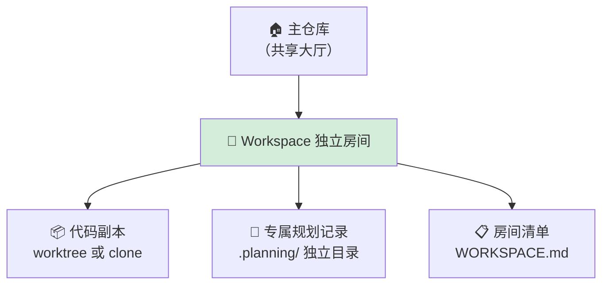
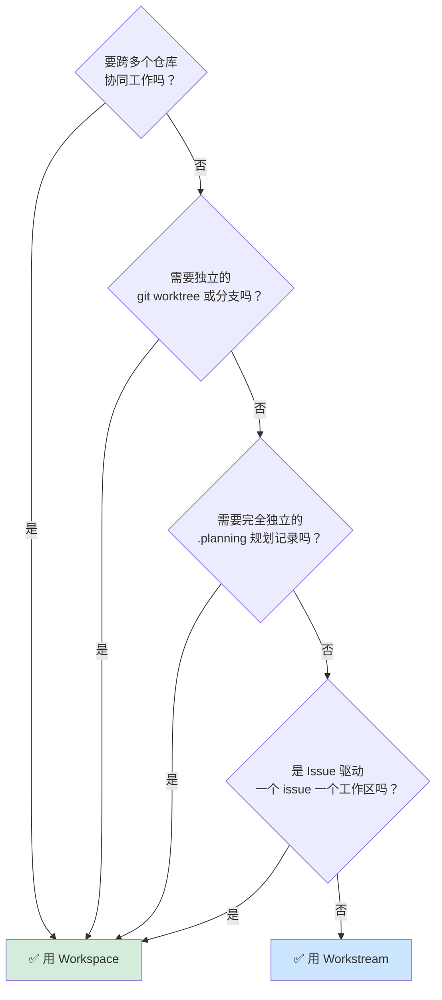
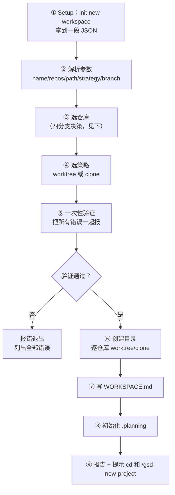
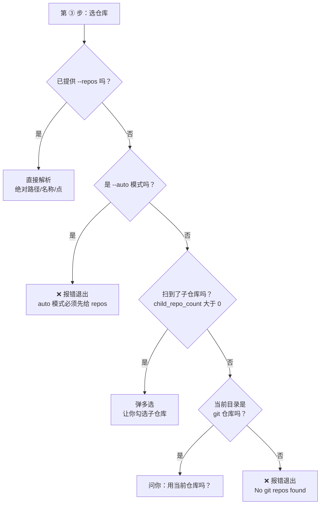
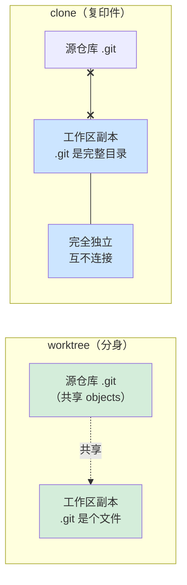
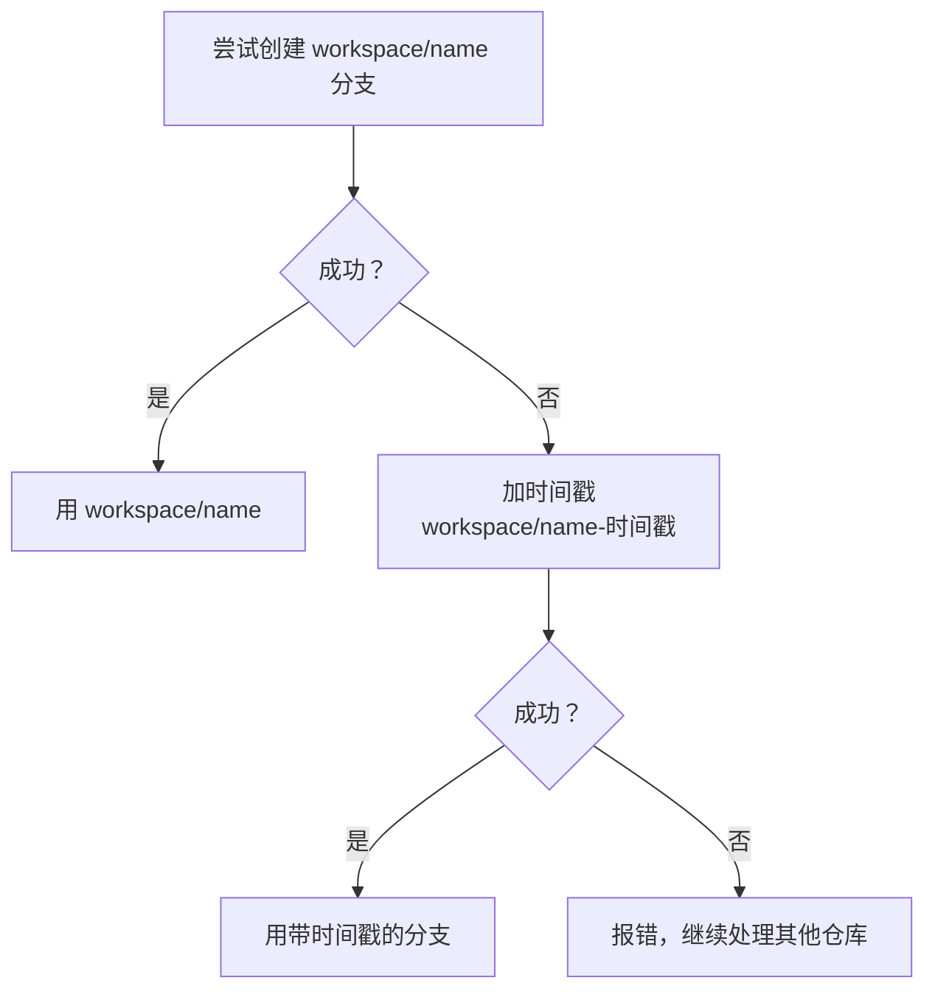
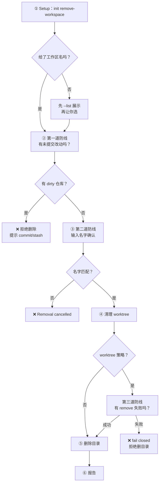

# GSD Workspace 隔离工作区使用教程

> 本文用「先讲你遇到的麻烦，再讲怎么解决」的方式，把 GSD（Get Shit Done）的 **Workspace（工作区）技能**讲明白。基于 [open-gsd/gsd-core](https://github.com/open-gsd/gsd-core) 仓库 main 分支的一手源码编写，所有命令、参数、输出格式都与源码一致。
>
> 配套阅读：《[GSD使用教程-并行开发](GSD使用教程-并行开发.md)》第 4 章是本文的速览版（约 120 行），本文是它的完整展开。官方 how-to：[isolate-work-with-workspaces](https://github.com/open-gsd/gsd-core/blob/main/docs/zh-CN/how-to/isolate-work-with-workspaces.md)。

---

## 目录

- [第 0 章 写在前面：这份教程怎么帮你](#第-0-章-写在前面这份教程怎么帮你)
- [第 1 章 3 分钟上手：跑通你的第一个 Workspace](#第-1-章-3-分钟上手跑通你的第一个-workspace)
- [第 2 章 Workspace 到底是什么：用生活类比讲清楚](#第-2-章-workspace-到底是什么用生活类比讲清楚)
- [第 3 章 该用 Workspace 还是 Workstream？先做对选择](#第-3-章-该用-workspace-还是-workstream先做对选择)
- [第 4 章 创建工作区：手把手掌握每个参数](#第-4-章-创建工作区手把手掌握每个参数)
- [第 5 章 worktree 还是 clone：一张图做对选择](#第-5-章-worktree-还是-clone一张图做对选择)
- [第 6 章 WORKSPACE.md：这个文件意味着什么](#第-6-章-workspacemd这个文件意味着什么)
- [第 7 章 列出工作区：看看你有哪些工作区](#第-7-章-列出工作区看看你有哪些工作区)
- [第 8 章 删除工作区：GSD 为什么这么谨慎](#第-8-章-删除工作区gsd-为什么这么谨慎)
- [第 9 章 实战演练：5 个真实场景，手把手带你做](#第-9-章-实战演练5-个真实场景手把手带你做)
- [第 10 章 生命周期管理：从创建到删除的纪律](#第-10-章-生命周期管理从创建到删除的纪律)
- [第 11 章 运行时兼容性与配置](#第-11-章-运行时兼容性与配置)
- [第 12 章 故障排查](#第-12-章-故障排查)
- [第 13 章 最佳实践](#第-13-章-最佳实践)
- [附录](#附录)

---

## 第 0 章 写在前面：这份教程怎么帮你

> **这一章解决什么问题**：让你在 1 分钟内判断「这份教程跟我有没有关系」，以及该从哪里开始读。

### 0.1 你可能正遇到这些麻烦

先看看下面这些场景，有没有你熟悉的味道：

| 你的麻烦 | 具体表现 | Workspace 怎么帮 |
|---------|---------|-----------------|
| **一个仓库同时干两件事** | 正在开发新功能，突然要修生产 bug，`git stash` 来回切，心态崩了 | 开个工作区，bug 修复和新功能各占一个分支，互不打扰 |
| **前后端要联调** | 后端接口和前端页面要一起改、一起测，但各有各的 GSD 规划，上下文割裂 | 一个工作区装下两个仓库，共享一份规划，协调推进 |
| **想做大重构但不敢动主线** | Spring Boot 2→3 升级、MyBatis 换 JPA 这种大工程，怕搞乱主分支 | 开个工作区放手重构，主分支继续日常迭代 |
| **想试个方案又怕回不去** | 想试两种实现思路对比，又怕把现有状态搞脏 | 各开一个工作区，完全独立的构建产物和规划记录 |
| **多人/多线并行** | 几个人同时在不同功能上推进，规划状态互相覆盖 | 每条线一个工作区，规划状态彻底隔离 |

如果你点了头，那这份教程就是为你写的。

### 0.2 Workspace 一句话能帮你解决什么

> **Workspace 给你一个「独立的开发房间」**：房间里的代码、git 分支、GSD 规划记录、构建产物，全是这个房间专属的。你关起门来干活，外面的人（主仓库、其他工作区）完全不受影响，你也碰不到他们的东西。

需要同时推进多条线、或者要做「不敢在主仓库直接动手」的事时，开一个工作区就对了。

### 0.3 这份教程怎么读（阅读路径）

不同的人有不同的读法，挑一条适合自己的：

- **急着用** → 直接跳 [第 1 章 3 分钟上手](#第-1-章-3-分钟上手跑通你的第一个-workspace)，跑通一个最小示例，够用 90% 的场景。
- **想真正搞懂** → 从第 0 章顺序读到第 5 章，建立完整的心智模型。
- **已经在用了** → 跳到 [第 9 章实战演练](#第-9-章-实战演练5-个真实场景手把手带你做) 或 [第 12 章故障排查](#第-12-章-故障排查)。

---

## 第 1 章 3 分钟上手：跑通你的第一个 Workspace

> **这一章解决什么问题**：让你在 3 分钟内亲手跑通一个 workspace，获得「我能用」的成就感。后面所有深入内容都建立在这个最小体验上。

### 1.1 准备：你只需要这两样

| 前提 | 怎么验证 |
|------|---------|
| 装了 GSD Core | 在 Claude Code 里输入 `/gsd-`，能看到命令补全 |
| 当前在一个 git 仓库里 | 终端里 `ls -la .git` 能看到 `.git` 目录 |

```bash
# 确认 git 可用
$ git --version
git version 2.45.0

# 确认当前目录是 git 仓库（能看到 .git 目录或文件）
$ ls -la ~/Projects/be-star/.git
drwxr-xr-x  .git/    # 看到这个就对了
```

> **做完看到什么**：两条命令都正常输出，说明环境就绪。如果 `ls .git` 报错，说明当前目录不是 git 仓库——`cd` 到你的项目目录再试。

### 1.2 三步跑通

我们用最简单的「单仓库」方式，3 步走完一个完整生命周期：**创建 → 初始化 → 删除**。

**第 1 步：创建工作区**

```bash
$ cd ~/Projects/be-star
$ /gsd-workspace --new --name try-first --repos . --auto
```

- `--name try-first`：工作区叫 `try-first`
- `--repos .`：用 `.` 表示「当前这个仓库」
- `--auto`：跳过所有交互提问，全用默认值（新手最省心的写法）

**做完看到什么**：

```text
Workspace created: ~/gsd-workspaces/try-first

  Repos: 1
  Strategy: worktree
  Branch: workspace/try-first

Next steps:
  cd "~/gsd-workspaces/try-first"
  /gsd-new-project    # Initialize GSD in the workspace
```

**第 2 步：进去并初始化 GSD**

这一步很关键——**创建只是搭了个空壳**，必须进去执行 `/gsd-new-project` 才算真正可用。

```bash
$ cd ~/gsd-workspaces/try-first
$ /gsd-new-project
```

**做完看到什么**：工作区里多出一个 `.planning/` 目录，里面有 `PROJECT.md`、`ROADMAP.md` 等 GSD 规划文件。这时候你才能用 `/gsd-discuss-phase`、`/gsd-plan-phase` 这些命令。

**第 3 步：用完删除**

```bash
$ /gsd-workspace --remove try-first
```

GSD 会让你**输入工作区名字确认**（防止手滑误删），输入 `try-first` 回车。

**做完看到什么**：

```text
Workspace "try-first" removed.

  Path: ~/gsd-workspaces/try-first (deleted)
  Repos: 1 worktrees cleaned up
```

> **出错了怎么办**：如果提示 `Cannot remove workspace ... uncommitted changes`，说明工作区里有没提交的改动。先 `git add . && git commit` 或 `git stash`，再重新 `--remove`。这是 GSD 的保护机制，详见 [第 8 章](#第-8-章-删除工作区gsd-为什么这么谨慎)。

### 1.3 跑通后你已经掌握了什么

别小看这 3 步——它覆盖了 Workspace **90% 的日常用法**：

- `--new` 创建、`--remove` 删除（两个最常用的命令）
- `--repos .` 表示「当前仓库」
- `--auto` 非交互模式
- **创建后必须 cd + /gsd-new-project**（最容易漏的一步）

后面的章节只是把每个参数讲透、把使用场景铺开。你已经入门了。

---

## 第 2 章 Workspace 到底是什么：用生活类比讲清楚

> **这一章解决什么问题**：建立对 Workspace 的直觉。不讲术语，先用生活经验让你「秒懂」，再给准确定义。

### 2.1 一个生活类比：独立的开发房间

想象你在一个共享办公室里工作。平时大家都围着同一张桌子（主仓库）干活，谁改了什么别人都看得到，东西也容易混在一起。

现在你要做一个需要专注、不想被打扰的项目——**你申请隔出一个独立的小房间**。这个房间有这些特点：

- 房间里有**这个项目专属的代码副本**（门一关，你改你的，不影响大厅）
- 房间里有**专属的笔记本**（规划记录，跟大厅的笔记本完全分开）
- 房间里**桌上的东西**（构建产物，比如 `node_modules`、`target/`）也是这个房间专属的

这个「独立小房间」，就是 **Workspace**。



### 2.2 Workspace 的三大组成

把「房间」类比翻译成技术语言，一个 Workspace 包含三个东西：

| 组成 | 生活类比 | 技术含义 |
|------|---------|---------|
| **git worktree 或 clone** | 房间里的代码副本 | 一个或多个 git 工作树，在专用分支上检出（默认分支名 `workspace/<名字>`） |
| **独立的 `.planning/` 根目录** | 专属笔记本 | GSD 的规划状态（PROJECT.md、ROADMAP.md 等）完全独立，不是主仓库 `.planning/` 的子目录 |
| **WORKSPACE.md 清单** | 房间登记表 | 一个 Markdown 文件，记录这个工作区里有哪些成员仓库 |

记住这三样，Workspace 的本质就清楚了。

### 2.3 四维隔离：为什么不会互相影响

Workspace 在四个维度上跟主仓库「断开」，这就是「关起门干活」的底气：

| 隔离维度 | Workspace 与主仓库的关系 | 生活类比 |
|---------|------------------------|---------|
| **代码** | 独立工作树（你有自己的代码副本） | 房间里有自己的书 |
| **分支** | 独立分支（默认 `workspace/<名字>`） | 你在书的某一页夹了自己的书签 |
| **规划状态** | 独立 `.planning/`（PROJECT.md 等全独立） | 你有自己的笔记本 |
| **构建产物** | 独立（`node_modules`、`target/` 互不影响） | 你桌上有自己的文具 |

工作区在磁盘上的样子：

```text
~/gsd-workspaces/
└── feature-payment/              # ← 这就是那个「房间」（工作区根目录）
    ├── WORKSPACE.md              # 房间登记表
    ├── .planning/                # 专属笔记本（完全独立的 GSD 状态）
    │   ├── PROJECT.md
    │   ├── ROADMAP.md
    │   └── ...
    └── be-star/                  # 代码副本（worktree 或 clone）
        └── ...
```

> **关键点**：默认所有工作区都放在 `~/gsd-workspaces/<工作区名>/` 下，每个工作区是一个独立目录，互不嵌套。`.planning/` 在工作区**根目录**，跟成员仓库平级——这正是它「完全独立」的原因。

### 2.4 命令叫什么：`/gsd-workspace` 而非 `gsd:workspace`

在继续之前，先把命令名字澄清一下，免得你被不同写法搞晕：

| 写法 | 在哪能看到 | 你该用哪个 |
|------|-----------|-----------|
| `/gsd-workspace` | 所有官方文档、命令补全 | ✅ **日常就用这个**（连字符） |
| `gsd:workspace` | 命令文件内部、报错信息里 | ❌ 这是内部注册名，不用管 |

> **历史小八卦**：GSD 早期，工作区是三个独立命令（`/gsd-new-workspace`、`/gsd-list-workspaces`、`/gsd-remove-workspace`）。后来（变更 #2790 ）合并成了一个命令 `/gsd-workspace`，用 `--new` / `--list` / `--remove` 三个 flag 区分。你在旧文档里看到三命令形式，都是过时的。

---

## 第 3 章 该用 Workspace 还是 Workstream？先做对选择

> **这一章解决什么问题**：GSD 有两种「隔离」工具——Workspace（重）和 Workstream（轻）。选错了要么大材小用，要么隔离不够。这章帮你一次选对。

### 3.1 一张决策树帮你选

不用记概念，跟着决策树走：



一句话总结：**只要涉及「独立的代码 / 分支 / 多仓库」，就用 Workspace；只是在同一个仓库里并发跑几个不同的规划，用 Workstream 就够了。**

### 3.2 七维度详细对比

如果你想知道得更细，这张表把两者掰开揉碎：

| 维度 | Workspace（工作区） | Workstream（工作流） |
|------|---------------------|----------------------|
| 隔离级别 | git worktree/分支级 + 独立 `.planning/` | 仅规划产物级（STATE.md 隔离） |
| 代码隔离 | ✅ 完全独立工作树 | ❌ 共享同一份代码和 git 历史 |
| `.planning/` | ✅ 完全独立根目录 | 主 `.planning/` 的子目录 `workstreams/<名字>/` |
| 分支 | ✅ 独立分支 | ❌ 共享分支 |
| 构建产物 | ✅ 独立（`target/`、`node_modules/` 互不影响） | ❌ 共享 |
| 重量 | 重（要创建 worktree、独立状态） | 轻（只切规划上下文） |
| 典型场景 | 多仓库协调、功能分支硬隔离、实验性工作 | 单仓库内并发规划不同关注点 |

### 3.3 一句话口诀

记两句口诀就够了：

- **「Workspace 隔代码，Workstream 隔规划」**——Workspace 连代码带状态全隔离；Workstream 只隔规划状态。
- **「重活用 Workspace，并发规划用 Workstream」**——破坏性工作、多仓库协调这种「重活」用 Workspace；同一个仓库里并发跑几个 plan，用 Workstream。

---

## 第 4 章 创建工作区：手把手掌握每个参数

> **这一章解决什么问题**：把 `/gsd-workspace --new` 用透。先讲日常最常用的交互式创建，再给完整参数表，最后把 GSD 内部的 9 步逻辑作为「可选深入」讲给爱钻研的你。

### 4.1 最常用的创建方式：交互式

如果你不确定该传哪些参数，**只给一个 `--name` 就行**，GSD 会一步步引导你：

```bash
$ /gsd-workspace --new --name feature-payment
```

GSD 会依次问你（如果在多仓库目录下运行）：

```text
① 选哪些仓库加入工作区？（多选）
   ☐ be-star
   ☐ star-app
   ☐ docs

② 怎么复制这些仓库？
   ○ Worktree (recommended) — 轻量，共享 .git
   ○ Clone — 完全独立

③ 要不要现在初始化 GSD 项目？
   ○ Yes   ○ Cancel
```

按提示选完，工作区就建好了。**交互式适合第一次用、或参数拿不准的时候。**

### 4.2 `--new` 全部参数速查

想精确控制每个细节，就显式传参数。完整参数表：

| 参数 | 作用 | 默认值 | 必填 | 白话 |
|------|------|--------|------|------|
| `--name` | 工作区名字 | — | 是（除非 `--auto`） | 给房间起个名 |
| `--repos` | 哪些仓库放进来，逗号分隔；`.` 表示当前仓库 | — | `--auto` 时必填 | 房间里放哪些项目 |
| `--path` | 工作区建在哪 | `~/gsd-workspaces/<name>` | 否 | 房间建在哪个地址 |
| `--strategy` | 复制策略：`worktree` 或 `clone` | `worktree` | 否 | 怎么复制代码 |
| `--branch` | 检出的分支名 | `workspace/<name>` | 否 | 用哪个分支干活 |
| `--auto` | 跳过所有交互提问，全用默认值 | false | 否 | 别问我，全自动 |
| `--text` | 文本模式（编号列表替代交互弹窗） | false | 否 | 给非 Claude 运行时用 |

**常见组合**：

```bash
# 最省心：全自动
/gsd-workspace --new --name feature-payment --repos be-star,star-app --auto

# 自定义分支名（遵守团队规范）
/gsd-workspace --new --name payment --repos be-star --branch feature/payment-v2

# 自定义位置（团队统一存放）
/gsd-workspace --new --name feature-payment --repos be-star,star-app \
  --path /projects/workspaces/payment

# 用 clone 策略（子模块项目或需完全独立）
/gsd-workspace --new --name legacy-refactor --repos . --strategy clone
```

### 4.3 `--repos` 怎么填：四种写法

`--repos` 是创建时最容易困惑的参数，它接受逗号分隔的值，有四种写法：

| 写法 | 含义 | 例子 |
|------|------|------|
| **绝对路径** | 直接用这个路径 | `--repos /Users/ziogn/Projects/be-star` |
| **相对路径 / 名称** | 相对项目根目录解析 | `--repos be-star`（在 `~/Projects` 下运行） |
| **特殊值 `.`** | 表示「当前仓库」 | `--repos .` |
| **多值** | 逗号分隔多个 | `--repos be-star,star-app,docs` |

> **怎么理解**：GSD 创建前会扫描当前目录（项目根）下的子 git 仓库。你用「名称」时，就是从扫到的子仓库里匹配；用绝对路径则绕过扫描直接定位。

> **一个坑**：如果你的仓库藏在 `.repos/` 这种**隐藏目录**（`.` 开头）下，GSD 会自动跳过它（默认不扫隐藏目录）。这时候必须用绝对路径显式指定：`--repos .repos/be-star`。

### 4.4 创建时 GSD 偷偷做了什么（9 步源码级·可选深入）

> 这一节是给「想知道底层发生了什么」的你准备的。**日常使用完全不必懂**，遇到奇怪行为再回来看。

`new-workspace` 工作流内部有 9 步：



**第 ① 步拿到的 JSON 字段**（驱动后续决策）：

| JSON 字段 | 含义 |
|-----------|------|
| `default_workspace_base` | 默认工作区根目录（通常是 `~/gsd-workspaces/`） |
| `child_repos` | 扫描到的子仓库数组 |
| `child_repo_count` | 子仓库数量（决定走哪个选择分支） |
| `worktree_available` | git 是否可用（支持 worktree） |
| `is_git_repo` | 当前目录是不是 git 仓库 |
| `cwd_repo_name` | 当前仓库名（`--repos .` 时用） |
| `project_root` | 项目根目录（解析相对路径的基准） |

**第 ③ 步仓库选择的四分支决策**（最复杂的一步）：



**第 ⑤ 步一次性验证**（GSD 的贴心设计）：创建前会检查三件事，**关键是一次性把所有错误都报出来**，而不是遇到第一个就停——避免「修一个、再跑、又报一个」的循环：

| 验证项 | 失败条件 | 错误提示 |
|--------|---------|---------|
| 目标路径 | `--path` 指向的目录已存在且非空 | `Target path already exists and is not empty` |
| 源仓库 | `--repos` 里某个路径没有 `.git` | `Not a git repo: <路径>` |
| worktree 可用 | 用了 worktree 策略但 git 不可用 | `git is not available. Install git or use --strategy clone.` |

### 4.5 创建后必做的一步：cd + /gsd-new-project

这一点怎么强调都不过分——**创建工作区只是搭了个空壳**，里面只有一个空的 `.planning/` 目录。必须：

```bash
$ cd ~/gsd-workspaces/feature-payment   # 先 cd 进去！
$ /gsd-new-project                       # 再初始化 GSD 项目
```

不做这一步会怎样？后续的 `/gsd-discuss-phase`、`/gsd-plan-phase`、`/gsd-execute-phase` 全都无从谈起——因为工作区里没有 GSD 项目，没有 PROJECT.md、ROADMAP.md。

> **GSD 会提醒你**：如果不是 `--auto` 模式，创建完成后 GSD 会主动问「要不要现在初始化 GSD 项目？」。但 `--auto` 模式不会问，你得自己记得做。

---

## 第 5 章 worktree 还是 clone：一张图做对选择

> **这一章解决什么问题**：创建工作区时要选「怎么复制代码」——worktree 还是 clone。这俩决定了磁盘占用、独立性、兼容性。一张图帮你选对。

### 5.1 生活类比：分身 vs 复印件

- **worktree（工作树）** ≈「**分身术**」：还是同一个仓库，只是多分出一个「分身」来干活。分身和本体共享同一份历史记录（`.git` objects），所以很省空间、很快。
- **clone（克隆）** ≈「**复印件**」：把整个仓库复印一份，完全独立。复印件和原件没有任何连接，所以更独立，但也更占地方。

### 5.2 worktree vs clone 对比图



| 特征 | worktree | clone |
|------|---------|-------|
| `.git` 形态 | **文件**（指向源仓库的链接） | **完整目录**（独立的 objects） |
| 与源仓库关系 | 共享 `.git` objects | 完全独立，无连接 |
| 磁盘占用 | 极省（不复制历史） | 较大（复制完整历史） |
| 创建速度 | 快 | 较慢 |
| 合并方式 | 回源仓库 `git merge` | 需 push 远程或 `git remote add` 桥接 |

**怎么验证你用的是哪种**：

```bash
# worktree：.git 是文件，内容是指向源仓库的引用
$ cat ~/gsd-workspaces/feature-payment/be-star/.git
gitdir: /Users/ziogn/Projects/be-star/.git/worktrees/be-star

# clone：.git 是完整目录
$ ls -la ~/gsd-workspaces/legacy-refactor/legacy-app/.git
drwxr-xr-x  .git/    # 这是目录，内含完整 objects
```

### 5.3 策略选择决策表

| 你的场景 | 推荐 | 为什么 |
|---------|------|--------|
| 同一仓库的不同功能分支 | **worktree** | 轻量、共享 objects、快 |
| 常规多仓库协调 | **worktree** | 默认就够，省空间 |
| 不同版本的代码库（对比 v1/v2） | **clone** | 需要完全独立 |
| 项目用了 git **子模块** | **clone** | worktree 下子模块路径不安全 |
| 某些运行时不支持 worktree（如部分 Codex） | **clone** | 兼容性 |
| 需要破坏性实验（删 `.git`、改历史） | **clone** | 不影响源仓库 |

### 5.4 子模块为什么不能用 worktree

如果你的仓库用了 `git submodule`，**必须用 clone**。原因：

worktree 隔离下，涉及子模块路径的计划「不安全」——子模块的 `.git` 链接会指向错误位置。GSD 检测到这种情况会**自动回退到主工作树顺序执行**（隔离就失效了）。所以子模块项目直接用 `--strategy clone` 最稳妥。

### 5.5 深入：底层命令与时间戳回退（可选）

**worktree 底层命令**：

```bash
cd "$SOURCE_REPO_PATH"
git worktree add "$TARGET_PATH/$REPO_NAME" -b "$BRANCH_NAME"
```

**clone 底层命令**：

```bash
git clone "$SOURCE_REPO_PATH" "$TARGET_PATH/$REPO_NAME"
cd "$TARGET_PATH/$REPO_NAME"
git checkout -b "$BRANCH_NAME"
```

**分支已存在的时间戳回退**（worktree 策略的容错）：

当默认分支名 `workspace/<name>` **已经存在**时（比如上次没删干净），`git worktree add -b` 会失败。GSD 的容错是自动追加时间戳后缀：

```bash
# 第一次尝试失败（分支已存在）
git worktree add ... -b workspace/feature-payment
# 回退：加时间戳
git worktree add ... -b workspace/feature-payment-20260614005512
```



> **实战提醒**：如果你重复创建同名工作区，第二次的分支会变成 `workspace/<name>-时间戳`。合并时**别想当然**，先用 `git branch` 确认实际分支名。

---

## 第 6 章 WORKSPACE.md：这个文件意味着什么

> **这一章解决什么问题**：每个工作区根目录都有个 `WORKSPACE.md`，讲清它是什么格式、你能改它什么。

### 6.1 先纠正一个常见误解：它不是 YAML

⚠️ **重要纠正**：有些早期文档（包括《GSD使用教程-并行开发》第 4.1 节）把 WORKSPACE.md 描述成 YAML frontmatter（`name`/`created`/`strategy`/`repos` 字段），**这是错的**。

实际格式是 **Markdown**，里面有一张「Member Repos」表格。证据来自源码 `new-workspace.md` 第 170–186 行 + 测试 fixture 双重确认。

| 项目 | 错误认知（YAML） | 真实格式（Markdown） |
|------|-----------------|---------------------|
| 格式 | YAML frontmatter | Markdown |
| 内容 | `name`/`created`/`strategy`/`repos` 字段 | 标题 + `Created`/`Strategy` 行 + Member Repos 表格 |

这个纠正有实际意义：因为它是 Markdown，你用任何编辑器直接打开就能读、能改 `## Notes` 区，不用学 YAML 语法。

### 6.2 真实格式详解

完整正确的 WORKSPACE.md 长这样：

```markdown
# Workspace: feature-payment

Created: 2026-06-14
Strategy: worktree

## Member Repos

| Repo | Source | Branch | Strategy |
|------|--------|--------|----------|
| be-star | /Users/ziogn/Projects/be-star | workspace/feature-payment | worktree |
| star-app | /Users/ziogn/Projects/star-app | workspace/feature-payment | worktree |

## Notes

[Add context about what this workspace is for]
```

各部分含义：

| 部分 | 内容 | 谁维护 |
|------|------|--------|
| `# Workspace: <名字>` | 一级标题 | GSD 生成 |
| `Created` | 创建日期 | GSD 生成 |
| `Strategy` | worktree 或 clone | GSD 生成 |
| `## Member Repos` 表格 | 每个成员仓库一行（名称/源路径/分支/策略） | GSD 生成 |
| `## Notes` | 工作区用途说明 | ✅ **你可以自由编辑** |

### 6.3 你能编辑什么：Notes 区是你的

`## Notes` 区是**专门留给你**的，建议写清楚：

```markdown
## Notes

为 v2.3 支付重构创建。包含 be-star（后端接口）和 star-app（前端页面）。
关联 issue: #456。计划 6/20 前合并回 main。
```

写清楚「这个工作区在干什么、关联哪个 issue、什么时候该删」，过两周回来看也不至于一脸懵。

> **`## Member Repos` 表格别手改**：它由 GSD 维护，手动改不影响实际的 worktree（真实状态在 git 层）。要调整成员仓库，建议删除工作区重建。

---

## 第 7 章 列出工作区：看看你有哪些工作区

> **这一章解决什么问题**：用 `/gsd-workspace --list` 查看你建了哪些工作区，特别是发现「半成品」工作区。

### 7.1 --list 输出长什么样

```bash
$ /gsd-workspace --list
```

```text
GSD Workspaces (~/gsd-workspaces/)

| Name | Repos | Strategy | GSD Project |
|------|-------|----------|-------------|
| feature-payment | 2 | worktree | Yes |
| hotfix-auth | 1 | clone | No |
| legacy-refactor | 1 | clone | Yes |
```

逐列解释：

| 列 | 含义 |
|----|------|
| Name | 工作区目录名 |
| Repos | 成员仓库数量 |
| Strategy | 复制策略（worktree/clone） |
| GSD Project | 是否已初始化 GSD（检测 `.planning/PROJECT.md` 是否存在） |

### 7.2 GSD Project 列：发现半成品工作区

**GSD Project 列特别有用**：`No` 表示这个工作区创建了但还没 `/gsd-new-project`——也就是个「半成品」，后续命令都用不了。

定期 `--list` 一下，看到 `No` 的，要么补 `/gsd-new-project`，要么直接 `--remove` 清理掉。

无工作区时：

```text
No workspaces found in ~/gsd-workspaces/

Create one with:
  /gsd-workspace --new --name my-workspace --repos repo1,repo2
```

### 7.3 两个要注意的边界

- **自定义路径的工作区不在列表里**：`--list` 只扫描默认的 `~/gsd-workspaces/`。如果你用 `--path` 建到别处了，`--list` 看不到，得自己记路径。
- **只认有 WORKSPACE.md 的目录**：手动建了个目录却没 WORKSPACE.md，`--list` 也不会显示。

---

## 第 8 章 删除工作区：GSD 为什么这么谨慎

> **这一章解决什么问题**：删除是不可逆操作，GSD 设了三道安全防线防止数据丢失。理解「为什么这么谨慎」，你就知道每道防线在保护你什么。

### 8.1 删除流程一览



### 8.2 第一道防线：有未提交改动不让删（dirty 检查）

删除前，GSD 会检查每个成员仓库有没有**未提交的改动**（dirty）。如果有，**直接拒绝删除**：

```text
Cannot remove workspace "feature-payment" — the following repos have uncommitted changes:

  - be-star
  - star-app

Commit or stash changes in these repos before removing the workspace:
  cd "~/gsd-workspaces/feature-payment/be-star"
  git stash   # or git commit
```

**为什么需要这道防线**：未提交的改动一旦随工作区删除（`rm -rf`）就**永久丢失**，git 也救不回来。这是防止数据丢失的最重要防线。

**怎么过这道关**：

```bash
# 看到拒绝提示后，逐个处理
$ cd ~/gsd-workspaces/feature-payment/be-star
$ git stash            # 暂存（之后可 git stash pop 找回）
# 或
$ git add . && git commit -m "wip: 保存工作区进度"

# 处理完所有 dirty 仓库，重新删除
$ /gsd-workspace --remove feature-payment
```

### 8.3 第二道防线：输入名字才能删

过了 dirty 检查后，GSD 要求你**手动输入工作区名字**确认：

```text
Remove workspace 'feature-payment' at ~/gsd-workspaces/feature-payment?
This will delete all files in the workspace directory. Type the workspace name to confirm:
```

输入必须**精确匹配**工作区名，不匹配就 `Removal cancelled.`。这道防线防止「手滑选错」或「以为在删别的东西」。

### 8.4 第三道防线：worktree 删不掉就全停（fail closed）

这道防线**只有 worktree 策略**生效。GSD 会对每个成员仓库执行 `git worktree remove`，**只要有任何一个失败，就拒绝删工作区目录**：

```text
Refusing to delete "~/gsd-workspaces/feature-payment" because one or more git worktrees could not be removed.
Resolve the failed worktree removal manually, then rerun remove-workspace.
```

这是 **fail closed（失败即关闭）** 设计——宁可保留目录让你手动处理，也不冒险删掉一半。失败原因通常是：源仓库被移动/删除、worktree 被锁定、残留 dirty 状态。

### 8.5 安全检查的边界：检查什么、不检查什么

清楚「检查什么」和「不检查什么」很重要，避免误以为「删了就万事大吉」：

| 检查项 | 是否检查 | 说明 |
|--------|---------|------|
| 未提交改动（dirty） | ✅ 检查 | 有则拒绝删除 |
| worktree remove 失败 | ✅ 检查 | fail closed，不删目录 |
| 未推送的提交 | ❌ 不检查 | 删之前自己确认是否 push |
| 未合并的分支 | ❌ 不检查 | 删之前自己确认是否 merge |
| **远程分支** | ❌ **不删除** | 只删本地，远程分支需手动清理 |

> **最重要的边界**：`--remove` **不会删除远程分支**。它只删本地 worktree/clone 和工作区目录。如果你的工作区分支已推到远程，删除工作区后远程分支还在——得手动 `git push origin --delete <branch>` 清理。

删除成功的报告：

```text
Workspace "feature-payment" removed.

  Path: ~/gsd-workspaces/feature-payment (deleted)
  Repos: 2 worktrees cleaned up
```

---

## 第 9 章 实战演练：5 个真实场景，手把手带你做

> **这一章解决什么问题**：把前面学的命令用到真实场景里。5 个场景，每个都用「为什么做 → 怎么做 → 做完看到什么 / 出错了怎么办」三段式。建议挑跟你最相关的那个跟着做一遍。

### 9.1 场景一：前后端联调（API + UI 一起发布）

**为什么做**：be-star（Java 后端）和 star-app（Flutter 前端）要协同实现支付功能，需要一起测试、一起发布。如果各自独立的 GSD 规划，上下文割裂；放进一个工作区，共享一份规划，协调顺畅。

**怎么做**：

```bash
# ① 创建工作区（含两个仓库）
$ /gsd-workspace --new \
    --name feature-payment \
    --repos be-star,star-app \
    --strategy worktree \
    --branch feature/payment \
    --auto

# 做完看到：
# Workspace created: ~/gsd-workspaces/feature-payment
#   Repos: 2
#   Strategy: worktree
#   Branch: feature/payment

# ② 初始化 GSD（先 cd！）
$ cd ~/gsd-workspaces/feature-payment
$ /gsd-new-project
# 工作区独立 .planning/ 下生成 PROJECT.md、ROADMAP.md

# ③ 开发：讨论 → 规划 → 执行
$ /gsd-discuss-phase 1      # 讨论支付接口契约
$ /gsd-plan-phase 1          # 生成原子化计划
$ /gsd-execute-phase 1       # 执行（会同时改 be-star 和 star-app 两个副本）

# ④ 分别提交两个仓库的改动
$ cd ~/gsd-workspaces/feature-payment/be-star
$ git add . && git commit -m "feat: 实现支付接口"

$ cd ~/gsd-workspaces/feature-payment/star-app
$ git add . && git commit -m "feat: 对接支付页面"

# ⑤ 分别合并回各自的主仓库
$ cd ~/Projects/be-star
$ git merge feature/payment

$ cd ~/Projects/star-app
$ git merge feature/payment

# ⑥ 删除工作区（改动已提交，dirty 检查会通过）
$ /gsd-workspace --remove feature-payment
```

**做完看到什么**：两个仓库的支付功能都合并到各自主仓库，工作区被清理。ROADMAP.md 里可以同时记录「后端接口」和「前端对接」两条线，`/gsd-execute-phase` 的计划能跨仓库编排。

**出错了怎么办**：
- 创建时提示 `Not a git repo` → 检查 `--repos` 路径是否正确，是不是真的 git 仓库
- 删除时提示 dirty → 回到第 ④ 步检查两个仓库是否都 commit 了

### 9.2 场景二：单仓库功能分支隔离

**为什么做**：在 be-star 单仓库上做一个实验性大重构，不想影响主工作树的日常迭代。主工作树保持干净，同事的 PR 不受影响。

**怎么做**：

```bash
# ① 创建单仓库工作区（--repos . 表示当前仓库）
$ cd ~/Projects/be-star
$ /gsd-workspace --new --name refactor-db-migration --repos . --auto
# 在 ~/gsd-workspaces/refactor-db-migration/be-star 建一个 worktree
# 检出 workspace/refactor-db-migration 分支

# ② 进入工作区做重构（主工作树完全不受影响）
$ cd ~/gsd-workspaces/refactor-db-migration/be-star
$ /gsd-new-project
$ /gsd-discuss-phase 1
$ /gsd-plan-phase 1
$ /gsd-execute-phase 1

# 此时你可以：跑独立的 mvn clean（独立 target/）、切换 MyBatis 到 JPA 实验
# 而主工作树 ~/Projects/be-star 保持干净

# ③ 重构完成后合并
$ git add . && git commit -m "refactor: 数据库迁移层重构"
$ cd ~/Projects/be-star
$ git merge workspace/refactor-db-migration

# ④ 删除工作区
$ /gsd-workspace --remove refactor-db-migration
```

**做完看到什么**：重构分支有独立的构建产物（`target/`）和独立的工作树状态，与主工作树的 `main` 分支并行推进。这是「热修复 + 功能开发并行」「大型重构 + 日常迭代并行」的标准模式。

### 9.3 场景三：大型重构 / 大版本升级并行（新增）

**为什么做**：Spring Boot 2→3 升级这种大工程，要改的文件多、风险高、周期长。在主分支上做会阻塞日常迭代；开个工作区放手升级，主分支继续跑日常 PR。

**怎么做**：

```bash
# ① 创建升级工作区
$ cd ~/Projects/be-star
$ /gsd-workspace --new --name upgrade-springboot3 --repos . --auto

# ② 进入独立环境升级（主分支的日常 PR 完全不受影响）
$ cd ~/gsd-workspaces/upgrade-springboot3/be-star
$ /gsd-new-project
$ /gsd-discuss-phase 1    # 讨论升级方案：哪些 API 废弃、兼容性
$ /gsd-plan-phase 1        # 规划：分阶段升级（依赖→配置→代码）
$ /gsd-execute-phase 1     # 执行升级

# ③ 在升级期间，主分支可以照常合并日常 PR
# （在 ~/Projects/be-star 主工作树上，跟平时一样）

# ④ 升级完成，充分测试后合并
$ git add . && git commit -m "feat: 升级 Spring Boot 3"
$ cd ~/Projects/be-star
$ git merge workspace/upgrade-springboot3

# ⑤ 删除工作区
$ /gsd-workspace --remove upgrade-springboot3
```

**做完看到什么**：升级工程有自己的 `target/`（Spring Boot 3 的依赖），跟主分支的 `target/`（Spring Boot 2）互不影响。升级期间团队照常迭代，升级完成一次性合并。

**出错了怎么办**：升级中发现某个方案走不通？直接 `--remove` 工作区，从 `--new` 重新开始，主分支一行代码没动过——这就是隔离的价值。

### 9.4 场景四：紧急热修复并行（新增）

**为什么做**：你正在 `feature-payment` 工作区专心开发新功能（改了一堆代码还没提交），突然生产环境出 bug 要紧急修复。这时候不想 `git stash` 打断新功能，开个新的热修复工作区，修完合并，原功能工作区纹丝不动。

**怎么做**：

```bash
# 当前你在 feature-payment 工作区开发新功能（有未提交改动，先别动它）

# ① 开一个热修复工作区（从主仓库创建，跟 feature-payment 完全独立）
$ cd ~/Projects/be-star
$ /gsd-workspace --new --name hotfix-prod-bug --repos . --branch hotfix/bug-789 --auto

# ② 进入热修复工作区，快速修复
$ cd ~/gsd-workspaces/hotfix-prod-bug/be-star
$ /gsd-new-project
$ /gsd-execute-phase 1     # 修复 bug

# ③ 修复完，合并到主仓库并发布
$ git add . && git commit -m "fix: 修复生产 bug #789"
$ cd ~/Projects/be-star
$ git merge hotfix/bug-789
$ git push                  # 紧急发布

# ④ 删除热修复工作区
$ /gsd-workspace --remove hotfix-prod-bug

# ⑤ 回到新功能工作区，继续之前的工作（啥也没丢）
$ cd ~/gsd-workspaces/feature-payment/be-star
```

**做完看到什么**：热修复快速上线，新功能工作区的未提交改动完好无损。这就是「同时推进多条线」的能力——每条线一个工作区，互不干扰。

### 9.5 场景五：A/B 方案对比实验（新增）

**为什么做**：be-star 的数据访问层要重构，团队在「继续用 MyBatis」还是「换 JPA」之间犹豫。各开一个工作区，两种方案都实现一遍，对比性能和可维护性再决定。

**怎么做**：

```bash
# ① 开方案 A 工作区（MyBatis 优化）
$ cd ~/Projects/be-star
$ /gsd-workspace --new --name plan-a-mybatis --repos . --auto
$ cd ~/gsd-workspaces/plan-a-mybatis/be-star
$ /gsd-new-project
# ... 实现 MyBatis 优化方案，跑基准测试

# ② 开方案 B 工作区（换 JPA）
$ cd ~/Projects/be-star
$ /gsd-workspace --new --name plan-b-jpa --repos . --auto
$ cd ~/gsd-workspaces/plan-b-jpa/be-star
$ /gsd-new-project
# ... 实现 JPA 方案，跑同样的基准测试

# ③ 两个方案各有独立的 target/ 和规划记录，对比干净
# 决定采用方案 B 后：
$ /gsd-workspace --remove plan-a-mybatis     # 删掉不采用的方案 A
# 方案 B 走正常的合并流程
```

**做完看到什么**：两个方案在完全隔离的环境里实现，构建产物和规划记录互不污染，对比结果可信。决定后删掉不采用的方案，干净利落。

> **为什么这个场景适合 clone 而非 worktree**：如果你想在每个方案里做更激进的实验（比如重写 git 历史），用 `--strategy clone` 更安全——完全独立，不影响源仓库。

### 9.6 Issue 驱动工作流

**模式**：每个 tracker issue（GitHub/Linear/Jira）映射到一个专属 workspace，未完成的工作、中止的计划、探索性提交都保留在 `main` 之外。


**关键命令**：

```bash
# 一个 issue 一个 workspace
$ /gsd-workspace --new --name fix-login-redirect --repos . --strategy worktree
$ cd ~/gsd-workspaces/fix-login-redirect
$ /gsd-discuss-phase 1     # 把 issue URL 粘到讨论里，记入 CONTEXT.md
$ /gsd-plan-phase 1
$ /gsd-execute-phase 1
$ /gsd-verify-work 1       # 逐条核对 issue 验收标准
$ /gsd-code-review 1 --fix
$ /gsd-ship 1              # PR 正文加 Closes #NNN，合并时自动关 issue
```

> 完整的 Issue 驱动八步流程（含里程碑、条件场景处理）见官方 how-to [drive-gsd-from-a-tracker-issue](https://github.com/open-gsd/gsd-core/blob/main/docs/zh-CN/how-to/drive-gsd-from-a-tracker-issue.md)。

---

## 第 10 章 生命周期管理：从创建到删除的纪律

> **这一章解决什么问题**：把 Workspace 的完整生命周期串起来，并讲清合并回主仓库的差异和「用完即删」的纪律。

### 10.1 生命周期时间线


记住这条线：**创建 → 初始化 → 开发 → 提交 → 合并 → 删除**。每一步都对应前面章节讲过的命令。

### 10.2 合并回主仓库：worktree 和 clone 不同

这是最容易踩坑的地方，两种策略的合并方式不一样：

| 注意点 | worktree 策略 | clone 策略 |
|--------|--------------|-----------|
| 合并方式 | 回**源仓库**执行 `git merge <分支>` | 需先 `git push` 到远程，再从源仓库 `git pull/merge`；或用 `git remote add` 桥接 |
| 为什么不同 | worktree 共享源仓库的 refs，直接能 merge | clone 完全独立，refs 不通，必须经远程或手动桥接 |

**跨仓库分支独立性**：在第 9.1 的多仓库场景里，be-star 和 star-app 是**两个不同的 git 仓库**，各自维护独立的 refs。所以两边都检出 `feature/payment` 分支不会冲突——它们是各自仓库里的同名分支，互不可见。合并时也是各自仓库独立合并。

**确认实际分支名**（特别是重复创建过同名工作区的）：

```bash
$ cd ~/Projects/be-star && git branch | grep workspace
  workspace/refactor-db-migration
  workspace/feature-payment-20260614005512   # ← 带时间戳的（时间戳回退产生）
```

### 10.3 用完即删：避免 workspace/* 分支堆积

工作区用完不删，`workspace/*` 分支会越堆越多，最后自己都搞不清哪个还有用。三条纪律：

| 纪律 | 说明 |
|------|------|
| **删除前确保提交/合并** | 避免触发 dirty 检查；避免丢失未推送的工作 |
| **合并后立即 `--remove`** | 合并回主仓库就立刻删，别留到「以后」 |
| **定期 `--list` 清理** | 发现 `GSD Project: No` 的半成品，决定补全或删除 |

---

## 第 11 章 运行时兼容性与配置

> **这一章解决什么问题**：不同 AI 运行时（Claude / Codex / Gemini）下用 Workspace 的注意事项，以及相关配置项。

### 11.1 text_mode：非 Claude 运行时必备

GSD 默认用 **AskUserQuestion**（Claude Code 的结构化询问 UI）做交互。但 OpenAI Codex、Gemini CLI 等非 Claude 运行时**不支持 AskUserQuestion**，这时要启用文本模式。

| 方式 | 命令 | 适用 |
|------|------|------|
| 临时 flag | `/gsd-workspace --new --name x --text` | 单次 |
| 配置项 | `workflow.text_mode: true` | 项目级 |

启用前后交互差异：

```text
# AskUserQuestion 模式（Claude，默认）
┌─ Strategy ────────────────────────────┐
│ How should repos be copied?            │
│ ○ Worktree (recommended)               │
│ ○ Clone                                │
└────────────────────────────────────────┘

# text_mode 模式（Codex/Gemini）
How should repos be copied into the workspace?
  1. Worktree (recommended)
  2. Clone
Type your choice number: _
```

### 11.2 worktree 的运行时与子模块限制

| 限制 | 说明 | 应对 |
|------|------|------|
| 子模块路径不安全 | worktree 下子模块路径不安全，GSD 自动回退主工作树顺序执行 | 用 `--strategy clone` |
| 某些运行时不支持 worktree | 如部分 Codex 配置 | 用 `--strategy clone` |
| 全局禁用 worktree | 配置 `workflow.use_worktrees: false` | 改用 clone 或重新启用 |

### 11.3 配置项一览

| 配置项 | 默认值 | 作用 |
|--------|--------|------|
| `workflow.use_worktrees` | `true` | 控制 GSD **执行阶段**是否用 worktree 隔离（影响 execute-phase 的 per-plan worktree，**不是** workspace 创建策略） |
| `workflow.text_mode` | `false` | 影响所有 AskUserQuestion 调用（含 workspace 交互） |

```json
{
  "workflow": {
    "use_worktrees": true,
    "text_mode": false
  }
}
```

> **容易混淆的点**：`workflow.use_worktrees` 控制的是 **execute-phase 执行阶段**的 worktree 隔离（per-plan worktree gate），**不是** workspace 创建时的策略。workspace 创建策略由 `--strategy` flag 控制。两者是不同的机制。

### 11.4 深入：.planning 路径解析（可选）

源码 `src/planning-workspace.cts` 的路径解析规则：

```text
planningDir(cwd, ws, project) = cwd/.planning/[project]/[workstreams/<ws>]
```

| 要素 | 说明 |
|------|------|
| `cwd` | 当前工作目录（workspace 内即为工作区根，所以 `.planning/` 落在工作区下） |
| `project` | 项目标识，可由环境变量 `GSD_PROJECT` 指定 |
| `ws` | workstream 名，可由环境变量 `GSD_WORKSTREAM` 指定 |
| 路径遍历防护 | 拒绝 project/workstream 名含 `/`、`\`、`..`（防环境变量注入越界） |
| planning lock | `withPlanningLock`，O_EXCL 创建锁文件，并发时重试（处理 Docker overlay-fs / NFS 的瞬态 errno） |

> **实战影响**：你可以用 `GSD_PROJECT` / `GSD_WORKSTREAM` 环境变量在脚本里切换规划上下文；路径遍历防护确保注入的路径不会越界。

---

## 第 12 章 故障排查

> **这一章解决什么问题**：遇到报错时快速定位。一张错误总表 + 高频 FAQ。

### 12.1 错误条件总表

按创建 / 删除 / 列出三个阶段汇总：

| 阶段 | 错误 | 触发条件 | 提示（节选） | 解决建议 |
|------|------|---------|-------------|---------|
| 创建 | 无 git 仓库 | 当前目录非 git 且无子仓库 | `No git repos found` | 从含 git 仓库的目录运行，或显式 `--repos` |
| 创建 | `--auto` 无 `--repos` | `--auto` 但未指定仓库 | `--auto requires --repos` | 补 `--repos repo1,repo2` |
| 创建 | 目标路径非空 | `--path` 指向已存在非空目录 | `Target path already exists and is not empty` | 换 `--name` 或 `--path` |
| 创建 | 源非 git 仓库 | `--repos` 中某路径无 `.git` | `Not a git repo: <路径>` | 检查路径，或先 `git init` |
| 创建 | git 不可用 | worktree 策略但无 git | `git is not available. Install git or use --strategy clone` | 装 git 或用 clone |
| 删除 | workspace 不存在 | `--remove` 不存在的名称 | `Workspace not found` | 先 `--list` 看实际名称 |
| 删除 | workspace 无名称 | `--remove` 未给名称 | `workspace name required`（会列出可选） | 补名称或从列表选 |
| 删除 | dirty 仓库 | 删除时有未提交更改 | `Cannot remove workspace ... uncommitted changes` | 先 commit/stash |
| 删除 | worktree remove 失败 | 删除时 worktree remove 失败 | `Refusing to delete ... worktrees could not be removed` | 手动 `git worktree remove` 后重试 |

### 12.2 常见问题 FAQ（含边界）

**Q1：worktree 和 clone 哪个更快？**
worktree 更快且省空间（共享 `.git` objects）。除非有子模块、运行时不兼容或需要完全独立，否则用默认的 worktree。

**Q2：删除工作区后数据还能恢复吗？**
worktree 策略下，源仓库的 `.git` objects 仍在（worktree 只是个链接），已提交的代码可通过分支找回；但**未提交的改动**会随 `rm -rf` 永久丢失——这正是为什么 GSD 有 dirty 检查（§8.2）。clone 策略下，整个目录被删，已提交内容若未 push 也丢失。

**Q3：子模块项目为什么不能用 worktree？**
worktree 隔离下，涉及子模块路径的计划不安全（子模块的 `.git` 链接指向错误位置），GSD 会自动回退到主工作树顺序执行。用 `--strategy clone` 可避免。

**Q4：重复创建同名工作区会怎样？**
默认分支 `workspace/<name>` 已存在时，GSD 自动追加时间戳后缀（如 `workspace/<name>-20260614005512`），见 §5.5。合并时注意实际分支名。

**Q5：`--auto` 何时会报错？**
`--auto` 模式跳过交互，但若**未提供 `--repos`** 会报错退出（无法通过交互补全）。`--auto` 适合 CI/脚本，但必须把所有必要参数传全。

**Q6：WORKSPACE.md 能手动编辑吗？**
可以编辑 `## Notes` 区（写工作区用途）。`## Member Repos` 表格由 GSD 维护，手动改不影响实际 worktree（实际状态在 git 层）。详见 §6.3。

**Q7：自定义 `--path` 的工作区为什么不在 `--list` 里？**
`--list` 只扫描默认的 `~/gsd-workspaces/`。自定义路径的工作区需自己记录。见 §7.3。

**Q8：删除会删远程分支吗？**
**不会**。`--remove` 只删本地 worktree/clone 和工作区目录。远程分支需手动 `git push origin --delete <branch>`。见 §8.5。

**Q9：worktree 的 `git gc` 会有什么影响？（边界）**
多个 worktree 共享源仓库的 `.git` objects。在源仓库执行 `git gc`（垃圾回收）会影响所有共享该仓库的 worktree——一般无害，但要知道这层共享关系。

**Q10：clone 工作区怎么合并回主仓库？（边界）**
clone 完全独立，refs 不通。两种方式：① `git push` 到远程，再从源仓库 `git pull/merge`；② 在源仓库 `git remote add <临时名> <clone路径>` 桥接，merge 后删除 remote。

**Q11：并发创建工作区会冲突吗？（边界）**
GSD 用 `withPlanningLock`（O_EXCL 创建锁文件）保护 `.planning/` 写入，并发时会重试。在 Docker overlay-fs / NFS 上偶尔有瞬态错误，重试机制能处理。

---

## 第 13 章 最佳实践

> **这一章解决什么问题**：把前面的经验总结成可操作的建议，外加边界陷阱速记。

### 13.1 策略选择最佳实践

| 场景 | 推荐策略 | 理由 |
|------|----------|------|
| 同仓库多分支开发 | worktree | 轻量、省空间、快速 |
| 跨仓库 / 多仓库协调 | worktree | 默认即可 |
| 实验性 / 破坏性工作 | clone | 不影响源仓库 |
| 子模块项目 | clone | worktree 路径不安全 |
| 不支持 worktree 的运行时 | clone | 兼容性 |

### 13.2 删除纪律与生命周期管理

| 实践 | 说明 |
|------|------|
| **删除前确保提交/合并** | 避免触发 dirty 检查；避免丢失未推送的工作 |
| **用完即删** | 合并回主仓库后立即 `--remove`，避免 `workspace/*` 分支堆积 |
| **创建后立即 `/gsd-new-project`** | 工作区只有空 `.planning/`，必须初始化才能跑 GSD 流程 |
| **定期 `--list` 清理** | 发现 `GSD Project: No` 的半成品工作区，决定补全或删除 |
| **Issue 驱动一 issue 一工作区** | 隔离清晰，PR 合并即删，生命周期与 issue 同步 |

### 13.3 命名与组织建议

| 建议 | 示例 |
|------|------|
| 用 kebab-case | `feature-payment`（✅）而非 `Feature Payment`（❌） |
| 名称关联功能/issue | `fix-login-redirect`、`issue-456` |
| 分支名遵守团队规范 | `--branch feature/payment-v2` 而非默认 `workspace/...` |
| 自定义路径团队统一 | `--path /projects/workspaces/<name>`（注意不在 `--list` 中） |

### 13.4 边界与陷阱速记

把分散在各章的边界细节浓缩成速记清单，遇到怪问题先查这里：

| 陷阱 | 要点 | 详见 |
|------|------|------|
| `git gc` 影响所有 worktree | worktree 共享源仓库 objects，gc 在源仓库执行会影响全部分身 | §11.4、Q9 |
| clone 合并要桥接 | clone 独立，需 push 远程或 `git remote add` 桥接 | §10.2、Q10 |
| 并发创建有锁 | `withPlanningLock` 保护 `.planning/`，NFS 偶有瞬态错误会重试 | §11.4、Q11 |
| 路径遍历被防 | project/workstream 名含 `/`、`\`、`..` 会被拒 | §11.4 |
| 时间戳分支回退 | 重复创建同名工作区，分支名变 `workspace/<name>-时间戳` | §5.5 |
| 不删远程分支 | `--remove` 只删本地，远程分支要手动 `git push origin --delete` | §8.5 |
| 自定义路径不显示 | `--list` 只扫 `~/gsd-workspaces/`，自定义路径要自己记 | §7.3 |
| 隐藏目录不扫描 | `.` 开头的子目录 GSD 自动跳过，需绝对路径显式指定 | §4.3 |

---

## 附录

### 附录 A：命令速查表

```bash
# ━━━ 创建 ━━━
/gsd-workspace --new --name <name>                              # 交互式
/gsd-workspace --new --name <name> --repos repo1,repo2          # 指定仓库
/gsd-workspace --new --name <name> --repos .                    # 当前仓库
/gsd-workspace --new --name <name> --repos . --strategy clone   # clone 策略
/gsd-workspace --new --name <name> --repos . --branch feat/x    # 自定义分支
/gsd-workspace --new --name <name> --repos . --path /custom     # 自定义路径
/gsd-workspace --new --name <name> --repos . --auto             # 全自动
/gsd-workspace --new --name <name> --repos . --text             # 文本模式

# ━━━ 列出 ━━━
/gsd-workspace --list

# ━━━ 删除 ━━━
/gsd-workspace --remove <name>
```

**参数速查**：

| 参数 | 默认 | 必填 |
|------|------|------|
| `--name` | — | 是（除非 --auto） |
| `--repos` | — | --auto 时必填 |
| `--path` | `~/gsd-workspaces/<name>` | 否 |
| `--strategy` | `worktree` | 否 |
| `--branch` | `workspace/<name>` | 否 |
| `--auto` | false | 否 |
| `--text` | false | 否 |

### 附录 B：WORKSPACE.md 完整模板

```markdown
# Workspace: <your-workspace-name>

Created: 2026-06-14
Strategy: worktree

## Member Repos

| Repo | Source | Branch | Strategy |
|------|--------|--------|----------|
| <repo-name> | <source-path> | <branch> | <worktree|clone> |

## Notes

<在此填写工作区用途、关联 issue、计划完成时间等>
```

> 这是**正确格式**（Markdown，非 YAML）。GSD 创建时会自动生成，你主要编辑 `## Notes` 区。

### 附录 C：相关文档

| 文档 | 链接 / 路径 | 说明 |
|------|------------|------|
| 并行开发教程（基础速览） | 《GSD使用教程-并行开发》第 4 章 | workspace + workstream + autonomous 并行开发全景 |
| gsd-tools CLI 教程 | 《GSD-gsd-tools使用教程》 | CLI 底层（Command Routing Hub、worktree base-check 等） |
| 官方 how-to（中） | [isolate-work-with-workspaces](https://github.com/open-gsd/gsd-core/blob/main/docs/zh-CN/how-to/isolate-work-with-workspaces.md) | 官方工作区隔离指南 |
| 官方 how-to（Issue 驱动） | [drive-gsd-from-a-tracker-issue](https://github.com/open-gsd/gsd-core/blob/main/docs/zh-CN/how-to/drive-gsd-from-a-tracker-issue.md) | Issue → workspace 端到端八步 |
| gsd-core 仓库 | [open-gsd/gsd-core](https://github.com/open-gsd/gsd-core) | 源码仓库 |

---

> **本文依据**：基于 open-gsd/gsd-core 仓库 main 分支一手源码编写（2026-06-14 clone），核心引用包括 `commands/gsd/workspace.md`、`gsd-core/workflows/{new,list,remove}-workspace.md`、`tests/workspace.test.cjs`、`src/planning-workspace.cts`、官方 how-to 文档。v1.0.0 在保留全部技术事实的基础上，重写为「先场景后原理」的通俗化实战指南，新增 3 个实战场景（大型重构并行、热修复并行、A/B 对比）、Workspace 全景图与 worktree/clone 对比图，并补充边界细节 FAQ。
