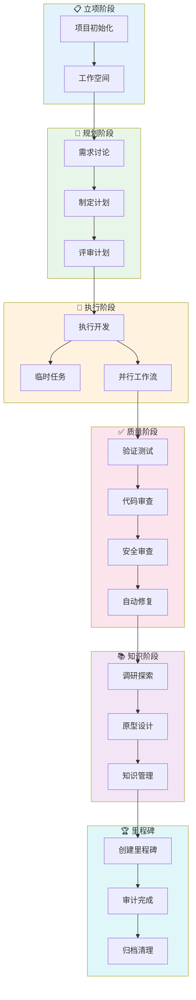

# GSD 使用教程-实战故事

> 用"小明开发电商项目"的故事，串联所有 16 大类别的实际应用场景。

## 目录

1. [故事背景](#1-故事背景)
   - [1.1 版本说明](#11-版本说明先读这一节)
2. [11.1 项目立项](#2-111-项目立项第1天)
3. [11.2 需求讨论](#3-112-需求讨论第1-2天)
4. [11.3 制定计划](#4-113-制定计划第2天)
5. [11.4 评审计划](#5-114-评审计划第2天)
6. [11.5 执行开发](#6-115-执行开发第3-7天)
7. [11.6 设计前端](#7-116-设计前端第7-10天)
8. [11.7 验证质量](#8-117-验证质量第10天)
9. [11.8 自动修复问题](#9-118-自动修复问题第10天)
10. [11.9 调试疑难杂症](#10-119-调试疑难杂症第11天)
11. [11.10 紧急插入任务](#11-1110-紧急插入任务第12天)
12. [11.11 多线并行开发](#12-1111-多线并行开发第13-20天)
13. [11.12 临时中断去修 Bug](#13-1112-临时中断去修-bug第15天)
14. [11.13 上下文线程](#14-1113-上下文线程第16天)
15. [11.14 快速临时任务](#15-1114-快速临时任务第17天)
16. [11.15 AI 集成选型](#16-1115-ai-集成选型第18天)
17. [11.16 知识图谱与情报](#17-1116-知识图谱与情报第19天)
18. [11.17 里程碑冲刺](#18-1117-里程碑冲刺第20-30天)
19. [11.18 完成里程碑](#19-1118-完成里程碑第35天)
20. [11.19 代码审查](#20-1119-代码审查第36天)
21. [11.20 UI 视觉审计](#21-1120-ui-视觉审计第37天)
22. [11.21 自主执行](#22-1121-自主执行第38-40天)
23. [11.22 导入外部计划](#23-1122-导入外部计划第41天)
24. [11.23 扫描代码库](#24-1123-扫描代码库第42天)
25. [11.24 代码库地图](#25-1124-代码库地图第43天)
26. [11.25 更新文档](#26-1125-更新文档第44天)
27. [11.26 提取经验教训](#27-1126-提取经验教训第45天)
28. [11.27 创建 PR](#28-1127-创建-pr第46天)
29. [11.28 查看进度](#29-1128-查看进度第47天)
30. [11.29 团队评审积压](#30-1129-团队评审积压第48天)
31. [11.30 回滚错误](#31-1130-回滚错误第49天)
32. [11.31 健康检查](#32-1131-健康检查第50天)
33. [11.32 清理归档](#33-1132-清理归档第51天)
34. [11.33 配置个性化](#34-1133-配置个性化第52天)
35. [11.34 行为分析生成配置](#35-1134-行为分析生成配置第53天)
36. [11.35 团队集成配置](#36-1135-团队集成配置第54天)
37. [11.36 摄入现有文档](#37-1136-摄入现有文档第55天)
38. [11.37 验证阶段](#38-1137-验证阶段第56天)
39. [11.38 评审计划](#39-1138-评审计划第57天)
40. [11.39 AI 评估覆盖审计](#40-1139-ai-评估覆盖审计第58天)
41. [11.40 调研新技术](#41-1140-调研新技术第59天)
42. [11.41 草图探索](#42-1141-草图探索第60天)
43. [11.42 Spike 打包](#43-1142-spike-打包第61天)
44. [11.43 跨阶段审计](#44-1143-跨阶段审计第62天)
45. [11.44 持续集成更新](#45-1144-持续集成更新第63天)
46. [11.45 管理面板](#46-1145-管理面板第64天)
47. [11.46 加入社区](#47-1146-加入社区第65天)
48. [11.47 帮助与支持](#48-1147-帮助与支持第66天)
49. [11.48 大功告成](#49-1148-大功告成第67天)
50. [11.49 命令串联总结](#50-1149-命令串联总结)
51. [附录：运行时与元技能速查](#51-附录运行时与元技能速查)

---

## 1. 故事背景

小明是一个全栈工程师，老板让他用两个月开发一个**电商平台**。项目复杂，他决定用 GSD 管理这个大工程。

---

### 1.1 版本说明（先读这一节）

> 本文档基于 **GSD v1.9.x**（2026-07 发布）编写，文中所有命令均为当前可用的最新写法。

**如果你发现命令与文档不一致，先看这里：**

- GSD 迭代很快，部分命令经历过**改名或整合**，例如：
  - 旧版 `/gsd-new-workspace` → 新版 `/gsd-workspace --new`
  - 旧版 `/gsd-scan` → 新版 `/gsd-map-codebase --fast`
  - 旧版 `/gsd-note` → 新版 `/gsd-capture --note`
- 运行 **`/gsd-help`**（或 `/gsd-help <命令名>`）可以查看你当前安装版本的权威命令说明，**一切以你本地版本为准**。
- v1.9.x 提供 6 条**元技能路由**（`/gsd-workflow`、`/gsd-project`、`/gsd-quality`、`/gsd-context`、`/gsd-manage`、`/gsd-ideate`）作为命令入口，原有具体命令（如 `/gsd-execute-phase`）仍可直接调用，二者互不冲突。
- 命令形式说明：Claude Code 等运行时使用连字符形式（`/gsd-execute-phase`），Codex 等运行时使用 `$gsd-xxx` 形式，二者是同一命令的拼写变体。
- 本文档随 GSD 版本更新，当前文档版本见 frontmatter 的 `version` 字段。

---

## 2. 11.1 项目立项（第1天）

小明坐在工位上，准备开始这个大项目。

```text
小明：我要开发一个电商平台了！

# 第一步：初始化项目
/gsd-new-project
  项目名称: ecommerce-platform
  描述: 包含商品、订单、支付、用户的完整电商平台
  技术栈: Next.js, Node.js, PostgreSQL, Redis, Stripe
```

突然想到还有另一个老项目要维护，小明决定同时管理两个项目。

```text
# 创建隔离的工作空间
/gsd-workspace --new --name ecommerce --repos ecommerce-platform
/gsd-workspace --new --name old-backend --repos legacy-api

# 查看所有工作空间
/gsd-workspace --list
输出:
  ecommerce        ✅ active
  old-backend     ⏸️  paused
```

> **类别1：项目与工作空间** —— 搞定项目初始化和多项目隔离

---

## 3. 11.2 需求讨论（第1-2天）

小明拉上产品和 UI，开始需求讨论。GSD 的标准流程是 spec（需求澄清）→ discuss → plan，需求已经明确，直接从 discuss 开始。

```text
# 讨论第一阶段：商品模块
/gsd-discuss-phase 1

讨论内容:
1. 商品需要哪些字段？（名称、价格、库存、图片、分类）
2. 搜索方案？（Elasticsearch 还是数据库 LIKE）
3. 图片存储？（S3 CDN）
4. 分类层级？（两级够用还是要无限递归）
```

讨论中冒出很多模糊地带，小明让 AI 帮忙探索。

```text
# 苏格拉底式探索：搜索方案选型
/gsd-explore search strategy

AI 追问: "你希望搜索的响应时间是多久？"
小明: "最好 100ms 以内"
AI 追问: "商品数量预计多少？"
小明: "10万以内"
AI 结论: "那建议用数据库索引 + Redis 缓存，Elasticsearch 杀鸡焉用牛刀"
```

> **类别2：核心阶段工作流** —— discuss 需求澄清
> **类别8：研究与知识** —— explore 苏格拉底探索

---

## 4. 11.3 制定计划（第2天）

需求讨论清楚了，小明开始制定详细计划。

```text
# 制定 Phase 1 的详细计划
/gsd-plan-phase 1

Phase 1 计划:
- [ ] 商品数据模型
- [ ] 分类管理接口
- [ ] 商品 CRUD API
- [ ] 图片上传服务
- [ ] 单元测试
执行顺序: tracer-first（先做一条端到端验证链路，再水平展开）
估算: ~120K tokens / 置信度 85%

小明发现有个不确定的技术点：
# 分布式 ID 生成方案还没定
/gsd-discuss-phase --assumptions
输出:
  ⚠️ 假设1: 使用自增 ID
  ⚠️ 假设2: 雪花算法生成 ID（高并发场景）
```

小明想看看阶段之间的依赖关系。

```text
/gsd-manager --analyze-deps

分析结果:
Phase 1 (商品模块)
  └── Phase 2 (订单模块) [依赖: Phase 1 商品模型]
        └── Phase 3 (支付模块) [依赖: Phase 2 订单模型]

合理！没有循环依赖。
```

> **类别3：阶段结构管理** —— phase/discuss-phase --assumptions/manager --analyze-deps

---

## 5. 11.4 评审计划（第2天）

计划制定好了，小明想找另一个 AI 来评审一下。

```text
# 启动跨 AI 评审循环
/gsd-plan-review-convergence 1

评审结果:
第1轮评审:
  ❌ 问题1: 计划中没有考虑分页方案
  ❌ 问题2: 缺少错误处理策略

重新规划...
第2轮评审:
  ⚠️ 问题1: 分页方案过于复杂，建议简化
  ✅ 无 HIGH 问题

计划收敛完成！
```

> **类别2：核心阶段工作流** —— plan-review-convergence 计划收敛评审

---

## 6. 11.5 执行开发（第3-7天）

计划评审通过，小明开始执行。

```text
# 开始执行 Phase 1
/gsd-execute-phase 1

执行内容:
1. 创建 Product 模型
2. 编写 TypeScript 类型
3. 实现 API 路由
4. 编写单元测试

执行过程中...
```

小明突然有个临时想法需要记录。

```text
# 突然想到：要不要加商品收藏功能？
/gsd-capture --note "考虑加商品收藏功能，以后做推荐用"

# 暂时放下，先完成当前任务
/gsd-capture --backlog "用户行为分析模块"
```

执行到一半，小明想去调研一下新技术。

```text
# 突然想尝试 Prisma ORM 替代 TypeORM
/gsd-spike "Prisma vs TypeORM 选型"

# 做了3个实验后结论：
# Prisma 完胜！迁移到 Prisma
```

> **类别2：核心阶段工作流** —— execute-phase 执行
> **类别10：想法、待办与积压** —— capture --note/--backlog 记录想法
> **类别11：探索与原型** —— spike 可行性实验

---

## 7. 11.6 设计前端（第7-10天）

后端 API 差不多了，小明开始做前端页面。

```text
# 启动前端阶段
/gsd-execute-phase 2

# 突然想看看 UI 长什么样，先画个草图
/gsd-sketch "商品列表页布局"

# 输出了一个可交互的 HTML 原型
# 产品经理看完：可以，就这个风格！
```

> **类别11：探索与原型** —— sketch 设计草图

---

## 8. 11.7 验证质量（第10天）

功能开发完了，需要验证质量。

```text
# 用户验收测试
/gsd-verify-work 1

验证结果:
✅ 商品列表 API 正常
✅ 商品详情 API 正常
✅ 图片上传成功
（自动化证据自动通过）
⚠️ 库存更新有并发问题
```

发现问题了！GSD 优先用自动化证据分类验证结果，无法确认的标出待人工验证。小明需要进行安全审查。

```text
# 安全审查
/gsd-secure-phase 1

安全报告:
🔴 库存更新存在超卖风险（严重）
🟡 图片上传未限制文件类型（中等）
✅ 鉴权机制正常
```

还需要代码审查。

```text
# 代码质量审查
/gsd-code-review 1

审查结果:
❌ [高] 库存更新未使用事务
❌ [高] 缺少参数校验
⚠️ [中] 魔法数字未定义为常量
```

> **类别6：审查、审计与验证** —— verify-work 验证、secure-phase 安全审查、code-review 代码审查

---

## 9. 11.8 自动修复问题（第10天）

发现问题后，小明不想手动一个个改。

```text
# 自动修复审查发现的问题
/gsd-audit-fix --severity high

修复过程:
1. 审计问题分类...完成
2. 修复库存事务问题...完成
3. 添加参数校验...完成
4. 提交原子提交...完成

修复完成，3个 HIGH 问题已解决
```

修复后还可以自动生成测试。

```text
# 为阶段生成测试
/gsd-add-tests 1

生成结果:
- product.test.ts: 23 个测试用例
- inventory.test.ts: 8 个测试用例
```

> **类别6：审查、审计与验证** —— audit-fix 自动修复、add-tests 生成测试

---

## 10. 11.9 调试疑难杂症（第11天）

库存超卖问题修完后，测试发现登录偶尔超时。

```text
# 启动系统化调试
/gsd-debug "用户登录偶尔超时"

调试过程:
1. 收集上下文...
2. 检查 JWT 配置 ✅
3. 检查 Redis 连接 ✅
4. 检查数据库连接池...发现问题！
   根因: 连接池 max=10，但高并发时不够用
5. 修复方案: 调大到 50
6. 验证修复...✅ 通过
```

调试完了，小明想复盘一下这次调试过程。

```text
# 事后调查分析
/gsd-forensics "登录超时问题"

诊断报告:
根本原因: 连接池配置不当
影响范围: 高并发场景
解决时间: 30分钟
经验教训: 生产环境需要监控连接池指标
```

> **类别7：调试与诊断** —— debug 调试、forensics 事后分析

---

## 11. 11.10 紧急插入任务（第12天）

老板突然说：支付模块要提前，因为下周一要给投资人演示！

```text
# 紧急插入 Phase 2.1
/gsd-phase --insert 2 "支付模块 - MVP"

创建: Phase 2.1 (支付模块 - MVP)

老板: "下周一演示只需要能调起微信支付就行"
小明: "收到！"
```

> **类别3：阶段结构管理** —— phase --insert 紧急插入

---

## 12. 11.11 多线并行开发（第13-20天）

现在电商平台和支付模块同时进行，小明开启并行工作流。

```text
# 创建并行工作流
/gsd-workstreams create payment    # 支付模块工作流
/gsd-workstreams create frontend   # 前端工作流

# 切换到支付工作流
/gsd-workstreams switch payment

# 在支付工作流中执行
/gsd-execute-phase 2.1

# 同时小明可以开另一个窗口做前端
# 切换到前端工作流
/gsd-workstreams switch frontend
/gsd-execute-phase 3
```

> **类别5：会话管理与交接** —— workstreams 并行工作流

---

## 13. 11.12 临时中断去修 Bug（第15天）

开发到一半，测试说线上有个 Bug，小明需要暂停当前工作。

```text
# 当前工作先暂停
/gsd-pause-work

保存上下文:
- Phase 2.1 执行到 60%
- 完成了微信支付联调
- 下一步: 支付宝支付

保存成功！
```

然后去修 Bug，修完后恢复。

```text
# 修完 Bug 回来
/gsd-resume-work

上下文恢复:
- Phase 2.1: 60%
- 当前任务: 支付宝支付

继续开发！
```

> **类别5：会话管理与交接** —— pause-work 暂停、resume-work 恢复

---

## 14. 11.13 上下文线程（第16天）

修 Bug 期间，测试又发现新问题，小明用线程追踪。

```text
# 创建问题追踪线程
/gsd-thread

选项:
1. list    - 列出所有线程
2. status <slug> - 查看线程状态
3. close <slug>  - 关闭线程
4. <描述>   - 创建新线程

/gsd-thread "会话超时问题追踪"

创建成功:
线程 ID: thread-bug-001
状态: open
描述: 会话超时问题追踪
```

> **类别5：会话管理与交接** —— thread 上下文线程

---

## 15. 11.14 快速临时任务（第17天）

同事问小明能不能帮忙加个小功能。

```text
# 快速处理临时任务
/gsd-quick

输入: "给用户中心加个修改头像功能"

GSD 自动路由到:
/gsd-workspace --new 用户头像功能（临时工作空间）
/gsd-execute-phase 1
/gsd-verify-work
/gsd-cleanup

完成！自动清理临时空间
```

> **类别15：管理与自动化** —— quick 快速临时任务

---

## 16. 11.15 AI 集成选型（第18天）

现在要做推荐系统，小明不知道用哪个 AI 服务。

```text
# AI 集成选型向导
/gsd-ai-integration-phase 5

向导问题:
1. 需要什么 AI 能力？→ 商品推荐
2. 数据规模？→ 10万商品，100万用户行为
3. 实时性要求？→ 准实时（分钟级）
4. 预算？→ 每月 $500 以内

推荐方案:
✅ OpenAI fine-tuned model（推荐）
⚠️ Anthropic Claude（太贵）
❌ 本地部署（算力不够）

选择: OpenAI fine-tuned model
```

> **类别8：研究与知识** —— ai-integration-phase AI 集成选型

---

## 17. 11.16 知识图谱与情报（第19天）

项目做了一半，小明想整理一下已有的知识。

```text
# 构建项目知识图谱
/gsd-graphify build

构建完成:
- 节点: 234 个
- 关系: 892 条
- 模块: 12 个

# 查询图谱
/gsd-graphify query "支付模块"

结果:
- 支付模块 → Stripe 集成
- 支付模块 → 微信支付 API
- 支付模块 → 支付宝 API
- 支付模块 → 订单服务（依赖）
```

还可以查情报（代码智能），不过 intel 能力默认是关闭的。

```text
# 尝试查看项目情报（会提示未启用）
gsd-tools intel status

提示: intel 能力未启用，请在设置中开启

# 通过配置开启 intel 能力
/gsd-settings
  Features 组 → Enable Intel? → Yes

# 再次查看情报状态
gsd-tools intel status

情报文件:
✅ architecture.md (3天前更新)
✅ api-design.md (1天前更新)
⚠️ tech-debt.md (7天前更新，建议更新)
```

> **类别8：研究与知识** —— graphify 知识图谱、intel 项目情报

---

## 18. 11.17 里程碑冲刺（第20-30天）

支付模块 MVP 完成了，老板说要给投资人演示。

```text
# 创建里程碑
/gsd-new-milestone "v0.1 投资人演示版"

里程碑目标:
- [x] Phase 1: 商品模块
- [x] Phase 2.1: 支付 MVP
- [ ] Phase 3: 用户模块
- [ ] Phase 4: 订单模块
```

演示很成功！投资人很满意。现在做里程碑审计。

```text
# 审计里程碑完成情况
/gsd-audit-milestone

审计报告:
✅ Phase 1 完成且验证通过
✅ Phase 2.1 完成但缺少集成测试
❌ Phase 3 用户模块未完成

完成率: 60%

发现缺口:
1. 缺少支付集成测试
2. 缺少性能测试
```

发现缺点了，补上！

```text
# 根据审计缺口手工创建新阶段
/gsd-phase "Phase 2.6: 支付集成测试"
/gsd-phase "Phase 2.7: 性能测试"

创建:
- Phase 2.6: 支付集成测试
- Phase 2.7: 性能测试

继续完成！
```

> **类别4：里程碑管理** —— new-milestone 创建、audit-milestone 审计、phase 补缺口

---

## 19. 11.18 完成里程碑（第35天）

终于，所有功能都完成了！

```text
# 完成里程碑
/gsd-complete-milestone "v0.1 投资人演示版"

归档内容:
- 5 个 Phase 完成
- 234 个文件变更
- 892 行代码新增
- 测试覆盖率 78%

发布标签: v0.1.0 ✅
```

小明还想生成一份项目摘要。

```text
# 生成里程碑摘要
/gsd-milestone-summary v0.1

输出文档:
- 项目概述
- 完成的功能
- 技术架构
- 团队贡献
- 经验教训

用于: 新人入职、团队评审
```

> **类别4：里程碑管理** —— complete-milestone 完成、milestone-summary 摘要生成

---

## 20. 11.19 代码审查（第36天）

准备上线前，做一次全面代码审查。

```text
# 深度代码审查
/gsd-code-review 5 --depth=deep

审查范围:
- src/payment/* (56 文件)
- src/order/* (43 文件)

发现问题:
🔴 [严重] 支付回调未验证签名
🔴 [严重] 订单状态机不严谨
🟡 [中等] 缺少重试机制
🟡 [中等] 日志级别不规范
```

发现问题，自动修复！

```text
# 自动修复并重新审查
/gsd-code-review 5 --fix --auto

修复循环:
第1轮: 修复签名验证
  重新审查: ✅ 通过

第2轮: 修复状态机
  重新审查: ✅ 通过

所有 HIGH 问题已解决！
```

> **类别6：审查、审计与验证** —— code-review 深度审查、--fix 自动修复

---

## 21. 11.20 UI 视觉审计（第37天）

前端页面做完了，要检查 UI 质量。

```text
# 前端视觉审计
/gsd-ui-review 4

6 维度审计:
1. ✅ 一致性: 符合设计系统
2. ✅ 可用性: 交互流畅
3. ⚠️ 美观性: 移动端适配待优化
4. ✅ 可访问性: 键盘导航支持
5. ✅ 性能: LCP < 2.5s
6. ✅ 响应式: 桌面端正常

审计评分: 85/100
建议: 优化移动端商品卡片布局
```

> **类别6：审查、审计与验证** —— ui-review UI 视觉审计

---

## 22. 11.21 自主执行（第38-40天）

基础功能都完成了，小明想让它自动跑剩下的任务。

```text
# 开启自主执行模式
/gsd-autonomous --from 5 --to 8

执行计划:
Phase 5: 搜索优化 [自动执行中...]
Phase 6: 推荐系统 [排队中...]
Phase 7: 消息通知 [排队中...]
Phase 8: 后台管理 [排队中...]

小明: "我去吃个午饭，让它自己跑！"

回来后发现...
✅ Phase 5 完成
✅ Phase 6 完成
⚠️ Phase 7 遇到问题需要人工介入
```

> **类别12：项目生命周期** —— autonomous 自主执行

---

## 23. 11.22 导入外部计划（第41天）

团队其他成员用其他工具做了份计划，小明想导入进来。

```text
# 导入外部计划文件
/gsd-import --from /tmp/team-plan.md

导入内容:
- 客服模块需求
- 数据分析需求
- 运维监控需求

自动创建:
- Phase 9: 客服模块
- Phase 10: 数据分析
- Phase 11: 运维监控

导入成功！
```

> **类别14：导入、导出与更新** —— import 导入外部计划

---

## 24. 11.23 扫描代码库（第42天）

项目越来越大了，小明想快速摸一遍风险底细。

```text
# 快速扫描代码库，聚焦风险点
/gsd-map-codebase --fast --focus concerns

快速扫描结果:
🔴 高风险:
  - src/payment/ 缺少集成测试
  - src/order/ 存在循环依赖

🟡 中风险:
  - 数据库连接未使用连接池
  - 缺少 API 限流

🟢 低风险:
  - 部分组件缺少注释
  - 工具函数可抽离复用

技术债: 约 32 人天

小明: "先快速扫一遍风险，详细的代码库地图等新人入职再生成"
```

> **类别7：调试与诊断** —— map-codebase --fast 快速风险扫描

---

## 25. 11.24 代码库地图（第43天）

新来了两个同事，小明要给他们介绍代码库。

```text
# 生成完整代码库地图
/gsd-map-codebase

分析完成，生成:
📁 src/
  📁 auth/         (认证模块)
  📁 product/      (商品模块)
  📁 order/        (订单模块)
  📁 payment/      (支付模块)
  📁 user/         (用户模块)

依赖关系图:
auth → user → product → order → payment

新同事: "一下子就看懂了！"
```

> **类别8：研究与知识** —— map-codebase 代码库地图

---

## 26. 11.25 更新文档（第44天）

代码改了那么多，文档要更新了。

```text
# 更新项目文档
/gsd-docs-update

文档更新:
✅ README.md (API 文档已同步)
✅ API.md (新增 12 个端点)
✅ ARCHITECTURE.md (架构图已更新)
✅ DEPLOY.md (新增 Docker 部署说明)

文档验证:
✅ 所有文档与代码一致
✅ 无过期文档
```

> **类别9：输出与文档** —— docs-update 文档更新

---

## 27. 11.26 提取经验教训（第45天）

Phase 5-8 完成了，小明想总结一下经验。

```text
# 提取可复用模式
/gsd-extract-learnings 5 --all

提取结果:

📚 可复用模式:
1. 支付回调处理模板
2. 订单状态机实现
3. 第三方 API 封装规范

⚠️ 反模式（需避免）:
1. 避免在支付回调中执行复杂逻辑
2. 避免使用数据库触发器更新库存

🏗️ 架构决策:
1. 选用 Stripe 而非自建支付（已验证合理）
2. 使用 Redis 缓存热门商品（性能提升 300%）
```

> **类别9：输出与文档** —— extract-learnings 提取经验

---

## 28. 11.27 创建 PR（第46天）

功能开发完了，要提交代码审查。

```text
# 创建 PR
/gsd-ship 8

ship:pre 检查:
✅ security 门: 无未解决威胁
✅ broken-windows 门: 无未修复缺陷

自动生成 PR:
标题: feat: 完成搜索优化和推荐系统

正文包含:
- 实现了什么
- 如何测试
- 截图/演示
- 性能提升数据

PR 创建成功！
```

小明还想清理一下分支，只提交业务代码。

```text
# 创建干净的 PR 分支
/gsd-pr-branch

过滤内容:
❌ .planning/ 目录
❌ node_modules/
❌ .env 文件

生成干净分支: feature/search-recommendation
```

> **类别9：输出与文档** —— ship 创建 PR、pr-branch 清理分支

---

## 29. 11.28 查看进度（第47天）

老板问项目进度怎么样了。

```text
# 查看项目进度
/gsd-progress

电商平台 v0.2 进度:
━━━━━━━━━━━━━━━━━━━━━━━
Phase 1  商品模块     ✅ 完成
Phase 2  支付模块     ✅ 完成
Phase 3  用户模块     ✅ 完成
Phase 4  订单模块     ✅ 完成
Phase 5  搜索优化     ✅ 完成
Phase 6  推荐系统     ✅ 完成
Phase 7  消息通知     ✅ 完成
Phase 8  后台管理     ✅ 完成
━━━━━━━━━━━━━━━━━━━━━━━
总体进度: 80%
建议下一步: Phase 9 客服模块

小明: "进度不错，继续推进下一阶段"
# 继续推进
/gsd-progress --next
→ 已推进: Phase 9 客服模块
```

小明还可以看看详细统计。

```text
# 查看项目统计
/gsd-stats

代码统计:
- 总文件数: 892
- 总代码行: 45,230
- 测试覆盖率: 82%
- API 端点数: 156

团队贡献:
- 小明: 67%
- 小红: 28%
- 小刚: 5%
```

> **类别12：项目生命周期** —— progress 进度查看、stats 统计

---

## 30. 11.29 团队评审积压（第48天）

产品经理说要评审一下之前积压的需求。

```text
# 评审积压需求
/gsd-review-backlog

积压清单:
999.1 用户等级系统
999.2 积分商城
999.3 优惠券系统
999.4 会员专享价
999.5 数据分析看板

评审结果:
→ 提升: 用户等级系统 → Phase 12
→ 提升: 积分商城 → Phase 13
⏭️ 跳过: 优惠券系统（暂时不做）
⏭️ 跳过: 会员专享价（等用户量上来再做）
→ 提升: 数据分析看板 → Phase 14
```

> **类别10：想法、待办与积压** —— review-backlog 评审积压

---

## 31. 11.30 回滚错误（第49天）

小明不小心提交错了代码，想回滚。

```text
# 安全回滚
/gsd-undo --last 5

最近5个提交:
1. feat: 搜索优化 - OK
2. fix: 修复支付签名验证 - OK
3. refactor: 重构订单服务 - OK
4. oops: 误提交测试文件 - ⚠️ 需要回滚
5. feat: 推荐系统 - OK

输入: 4

回滚提交 "oops: 误提交测试文件" ✅
```

> **类别12：项目生命周期** —— undo 安全回滚

---

## 32. 11.31 健康检查（第50天）

项目跑了一段时间了，做个全面体检。

```text
# 项目健康检查
/gsd-health

检查结果:
✅ .planning/ 目录完整
✅ state.json 可读
✅ Phase 文件无损坏
✅ 无孤儿临时文件

健康评分: 92/100

建议: 清理已完成阶段的临时文件
```

有个小问题，自动修复一下。

```text
# 自动修复
/gsd-health --repair

修复内容:
- 清理过期缓存 ✅
- 重建索引 ✅
- 归档旧阶段 ✅

修复完成！
```

> **类别7：调试与诊断** —— health 健康检查

---

## 33. 11.32 清理归档（第51天）

项目进入维护阶段，清理一下归档。

```text
# 归档已完成里程碑的阶段目录
/gsd-cleanup

归档内容:
- milestone-v0.1/ (5 个阶段) → 归档到 .planning/milestones/v0.1-phases/
- milestone-v0.2/ (8 个阶段) → 归档到 .planning/milestones/v0.2-phases/

释放空间: 45 MB
```

> **类别12：项目生命周期** —— cleanup 清理归档

---

## 34. 11.33 配置个性化（第52天）

小明想根据自己的习惯配置 GSD。

```text
# 打开配置界面
/gsd-settings

配置分组:
1. Planning      - 研究、计划检查、模式映射、Nyquist、UI Phase、UI Gate、AI Phase
2. Execution     - 验证器、TDD 模式、代码审查、UI 审查
3. Docs & Output - 提交文档、跳过讨论、Worktrees
4. Features      - Intel、Graphify
5. Model & Pipeline - 模型配置、自动推进、分支
6. Misc          - 上下文警告、研究问题数

小明: "把模型换成 Sonnet，省点钱"
/gsd-config --profile budget

切换到 budget 配置 ✅
```

还可以做高级配置。

```text
# 高级配置
/gsd-config --advanced

高级选项:
- 计划反弹次数: 3 (当前)
- 子代理超时: 5分钟 (当前)
- 分支模板: standard (当前)
- 调试模式: 关闭 (当前)
```

> **类别13：配置与设置** —— settings/config --advanced/--profile

---

## 35. 11.34 行为分析生成配置（第53天）

小明想看看自己平时怎么用 GSD 的。

```text
# 分析使用行为
/gsd-profile-user

分析报告:
1. 执行模式: 偏好快速迭代 (证据: 35次 execute, 3次 autonomous)
2. 质量关注: 高 (证据: 每次都做 code-review)
3. 文档习惯: 中 (证据: 偶尔运行 docs-update)
4. 协作风格: 独立型 (证据: 少用 review)
...

生成建议:
- 建议开启 autonomous 模式
- 建议加强文档更新频率
- 建议多使用 workstreams
```

> **类别13：配置与设置** —— profile-user 行为分析

---

## 36. 11.35 团队集成配置（第54天）

小明想配置项目的第三方集成（API 密钥、评审工具路由）。

```text
# 配置第三方集成
/gsd-config --integrations

集成选项:
1. API Keys     - Brave / Firecrawl / Exa
2. 代码评审 CLI   - 路由到外部评审命令
3. Agent Skills - 注入子代理技能

选择: 1 (API Keys)

Brave API Key: ************
Firecrawl API Key: ************

配置完成！
```

> **类别13：配置与设置** —— config --integrations 集成配置

---

## 37. 11.36 摄入现有文档（第55天）

团队之前有一些文档，小明想导入到 GSD。

```text
# 摄入文档到规划系统
/gsd-ingest-docs docs/

扫描文档:
📄 docs/PRD-v1.md → PRD
📄 docs/ARCHITECTURE.md → DOC
📄 docs/api-design.md → DOC
📄 docs/decisions/auth.md → ADR
📄 docs/decisions/db.md → ADR

摄入完成！
创建 .planning/intel/ 索引
创建 .planning/roadmap.md
```

> **类别14：导入、导出与更新** —— ingest-docs 摄入文档

---

## 38. 11.37 验证阶段（第56天）

Phase 12 完成了，做一个完整验证。

```text
# 验证阶段
/gsd-validate-phase 12

Nyquist 验证:
✅ 功能完整性
✅ 测试覆盖
✅ 性能基准
✅ 安全扫描
✅ 文档同步
✅ 代码规范

验证评分: 91/100
通过 ✅
```

> **类别2：核心阶段工作流** —— validate-phase 阶段验证

---

## 39. 11.38 评审计划（第57天）

Phase 13 计划做好了，让外部 AI 评审一下。Gemini CLI 已停服，现在用它的继任者 Antigravity。

```text
# 跨 AI 评审
/gsd-review --phase 13 --all

评审 AI:
- Antigravity: 技术可行性 ✅
- Codex: 代码质量 ✅
- OpenCode: 性能优化 ✅

综合评分: 88/100
建议: 优化缓存策略
```

> **类别6：审查、审计与验证** —— review 跨 AI 评审

---

## 40. 11.39 AI 评估覆盖审计（第58天）

检查一下 AI 功能的测试覆盖。

```text
# 评估覆盖审计
/gsd-eval-review 6

AI 功能:
1. 智能搜索 - 测试覆盖 85% ✅
2. 推荐系统 - 测试覆盖 62% ⚠️
3. 图像识别 - 测试覆盖 45% ❌

缺口分析:
- 推荐系统: 缺少离线评测
- 图像识别: 缺少边界测试

建议补充测试用例: 23 个
```

> **类别6：审查、审计与验证** —— eval-review 评估覆盖审计

---

## 41. 11.40 调研新技术（第59天）

老板问能不能加个 AI 客服功能，小明先调研一下。

```text
# 深度研究
/gsd-plan-phase --research-phase 15

研究内容:
- LangChain
- LlamaIndex
- RAG 技术
- 各大 LLM 对比

研究结论:
推荐方案: Claude API + RAG
- 成本: $0.002/消息
- 延迟: < 1s
- 准确率: 85%
```

> **类别2：核心阶段工作流** —— plan-phase --research-phase 深度研究

---

## 42. 11.41 草图探索（第60天）

AI 客服的界面应该长什么样？

```text
# 设计草图
/gsd-sketch "AI 客服对话界面"

输出:
- 桌面端对话界面 HTML
- 移动端对话界面 HTML
- 暗色模式版本

小明和产品经理看完：
"不错！就按这个风格做"
```

草图确定后，打包为可复用技能。

```text
# 打包草图决策
/gsd-sketch --wrap-up

打包内容:
- 样式规范
- 组件库
- 交互动效

创建项目技能: chat-ui-pattern ✅
```

> **类别11：探索与原型** —— sketch 草图、--wrap-up 打包技能

---

## 43. 11.42 Spike 打包（第61天）

之前做的 Stripe 集成方案很好，打包成可复用技能。

```text
# 打包 spike 发现
/gsd-spike --wrap-up

打包内容:
- Stripe 集成模板
- 回调处理模板
- 测试用例

创建项目技能: payment-stripe-pattern ✅
```

> **类别11：探索与原型** —— spike --wrap-up 打包

---

## 44. 11.43 跨阶段审计（第62天）

项目快完成了，做一次全面审计。

```text
# 跨阶段 UAT 审计
/gsd-audit-uat

审计结果:
Phase 1-5: ✅ 全部 UAT 通过
Phase 6-10: ✅ 全部 UAT 通过
Phase 11-15: ⚠️ 3 个 UAT 待验证

待验证项:
1. Phase 12: 用户等级计算逻辑
2. Phase 14: 数据分析看板数据准确性
3. Phase 15: AI 客服回复质量
```

> **类别6：审查、审计与验证** —— audit-uat 跨阶段审计

---

## 45. 11.44 持续集成更新（第63天）

GSD 有新版本了。

```text
# 更新 GSD
/gsd-update

更新内容:
新版本更新包:
- 新增: 更多 AI 运行时支持
- 优化: execute-phase 并行度提升 30%
- 修复: health 命令误报问题

是否更新? [Y/n] Y

更新完成！已升级到最新版本
```

之前小明做过本地修改，看看能不能恢复。

```text
# 恢复本地修改
/gsd-update --reapply

本地修改:
- 自定义 prompt 模板
- 配色方案

恢复状态: ✅ 全部恢复
```

> **类别14：导入、导出与更新** —— update 更新、--reapply 恢复补丁

---

## 46. 11.45 管理面板（第64天）

项目太多了，用管理面板统一管理。

```text
# 打开管理面板
/gsd-manager

仪表盘显示:
📊 电商平台:
  - 活跃 Phase: 3
  - 本周进度: +12%
  - 问题数: 5

📊 旧系统维护:
  - 活跃 Phase: 1
  - 本周进度: +3%
  - 问题数: 2

📊 技术预研:
  - 活跃 Phase: 0
  - 本周进度: +8%
  - 问题数: 0
```

> **类别15：管理与自动化** —— manager 管理面板

---

## 47. 11.46 加入社区（第65天）

小明想加入 GSD 社区交流，看看怎么加入。

```text
# 查询社区入口
/gsd-help

GSD 帮助（默认导览）:
- 查看命令: /gsd-help <命令名>
- 社区入口:
  - Discord: https://discord.gg/gsd-community
  - GitHub Discussions: https://github.com/open-gsd/gsd-core/discussions

打开: https://discord.gg/gsd-community

社区:
- 3000+ 成员
- 每日活跃讨论
- 官方支持频道
- 技能分享频道
```

> **类别16：工具与社区** —— help 帮助导览（含社区入口）

---

## 48. 11.47 帮助与支持（第66天）

新来的同事问小明 GSD 怎么用。

```text
# 查看帮助
/gsd-help

GSD 帮助信息:
- 70+ 个命令
- 16 个类别
- 文档链接
- 社区链接

小明: "这是文档链接，有问题随时问我"
```

> **类别16：工具与社区** —— help 帮助

---

## 49. 11.48 大功告成（第67天）

电商平台终于完成了！小明收工前，暂停会话并生成一份完整报告留档。

```text
# 收工！暂停会话并生成报告
/gsd-pause-work --report

会话报告:
项目: 电商平台 v1.0
时间: 67 天
代码量: 89,000 行
测试: 1,234 个
覆盖率: 85%

完成阶段: 15 个
质量评分: 92/100

会话已安全保存，随时可以恢复继续。

感谢 GSD！
```

小明长舒一口气：两个月，70+ 个命令，全程用 GSD 管理，顺利完成！

> **类别5：会话管理与交接** —— pause-work --report 收工报告

---

## 50. 11.49 命令串联总结



---

### 类别与故事对照表

| 故事章节 | 使用的类别 | 代表命令 |
|----------|-----------|---------|
| 11.1 立项 | **项目与工作空间** | new-project, workspace |
| 11.2 讨论 | **核心阶段工作流** + **研究与知识** | discuss-phase, explore |
| 11.3 计划 | **阶段结构管理** | plan-phase, manager |
| 11.4 评审 | **核心阶段工作流** | plan-review-convergence |
| 11.5 执行 | **核心工作流** + **想法积压** | execute-phase, capture, spike |
| 11.6 设计 | **探索与原型** | sketch |
| 11.7 验证 | **审查与审计** | verify-work, secure-phase, code-review |
| 11.8 修复 | **审查与审计** | audit-fix, add-tests |
| 11.9 调试 | **调试与诊断** | debug, forensics |
| 11.10 插入 | **阶段结构管理** | phase |
| 11.11 并行 | **会话管理** | workstreams |
| 11.12 中断 | **会话管理** | pause-work, resume-work |
| 11.13 线程 | **会话管理** | thread |
| 11.14 临时 | **管理与自动化** | quick |
| 11.15 AI选型 | **研究与知识** | ai-integration-phase |
| 11.16 知识 | **研究与知识** | graphify, intel |
| 11.17 冲刺 | **里程碑管理** | new-milestone, audit-milestone |
| 11.18 完成 | **里程碑管理** | complete-milestone, milestone-summary |
| 11.19 审查 | **审查与审计** | code-review, --fix |
| 11.20 UI审计 | **审查与审计** | ui-review |
| 11.21 自主 | **生命周期** | autonomous |
| 11.22 导入 | **导入与更新** | import |
| 11.23 扫描 | **调试与诊断** | map-codebase --fast |
| 11.24 地图 | **研究与知识** | map-codebase |
| 11.25 文档 | **输出与文档** | docs-update |
| 11.26 经验 | **输出与文档** | extract-learnings |
| 11.27 PR | **输出与文档** | ship, pr-branch |
| 11.28 进度 | **生命周期** | progress, stats |
| 11.29 积压 | **想法与积压** | review-backlog |
| 11.30 回滚 | **生命周期** | undo |
| 11.31 健康 | **调试与诊断** | health |
| 11.32 清理 | **生命周期** | cleanup |
| 11.33 配置 | **配置与设置** | settings, config |
| 11.34 分析 | **配置与设置** | profile-user |
| 11.35 集成 | **配置与设置** | config --integrations |
| 11.36 摄入 | **导入与更新** | ingest-docs |
| 11.37 验证 | **核心工作流** | validate-phase |
| 11.38 评审 | **审查与审计** | review |
| 11.39 评估 | **审查与审计** | eval-review |
| 11.40 调研 | **核心工作流** | plan-phase --research-phase |
| 11.41 草图 | **探索与原型** | sketch, --wrap-up |
| 11.42 打包 | **探索与原型** | spike --wrap-up |
| 11.43 审计 | **审查与审计** | audit-uat |
| 11.44 更新 | **导入与更新** | update, --reapply |
| 11.45 面板 | **管理与自动化** | manager |
| 11.46 社区 | **工具与社区** | help |
| 11.47 帮助 | **工具与社区** | help |
| 11.48 报告 | **会话管理** | pause-work --report |

---

## 51. 附录：运行时与元技能速查

### 运行时支持矩阵

| 运行时 | 支持方式 | 备注 |
|--------|---------|------|
| Claude Code | 一等公民 | 连字符命令 `/gsd-xxx` |
| Codex | EoS 声明式适配 | `$gsd-xxx` 命令形式 |
| OpenCode | EoS + 原生插件 | 自动注册 mcp.gsd |
| Kimi CLI / Kimi Code | EoS 接入 | v1.9.0 起 Kimi Code 独立运行时 |
| GitHub Copilot / Cursor / Cline / Qwen / Trae / Kilo / Hermes | EoS 接入 | v1.7.0 起 |
| Antigravity | EoS 接入 | Gemini CLI 停服后继任 |
| Augment / CodeBuddy / Windsurf | 声明式适配 + MCP | v1.7.0 起 |
| ZCode / pi / VS Code | 可安装运行时 | v1.7.0 新增 |
| 本地模型服务器 | ollama / lm-studio / llama-cpp | 评审 lane 与运行时 |

### 六个元技能路由一览

| 路由 | 用途 | 覆盖的具体命令 |
|------|------|--------------|
| `/gsd-workflow` | 核心工作流 | discuss / plan / execute / verify / phase / progress / next |
| `/gsd-project` | 项目与里程碑 | milestones / audits / summary |
| `/gsd-quality` | 质量与审查 | code review / debug / audit / security / eval / ui |
| `/gsd-context` | 上下文与知识 | map / graphify / docs / learnings |
| `/gsd-manage` | 管理与运维 | config / workspace / workstreams / thread / update / ship / inbox |
| `/gsd-ideate` | 想法与探索 | explore / sketch / spike / spec / capture |

> 元技能是入口路由，最终执行的具体命令仍以本文档各章为准。路由为 additive 设计，原有具体命令（如 `/gsd-execute-phase`）仍可直接调用。

---

- **GitHub**: [open-gsd/gsd-core](https://github.com/open-gsd/gsd-core)
- **文档**: [gsd-core#readme](https://github.com/open-gsd/gsd-core#readme)
