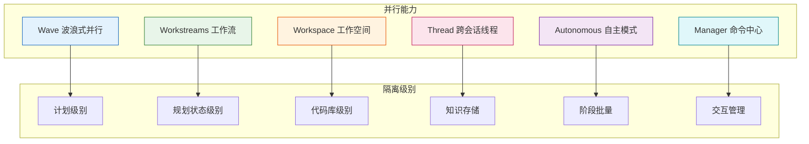
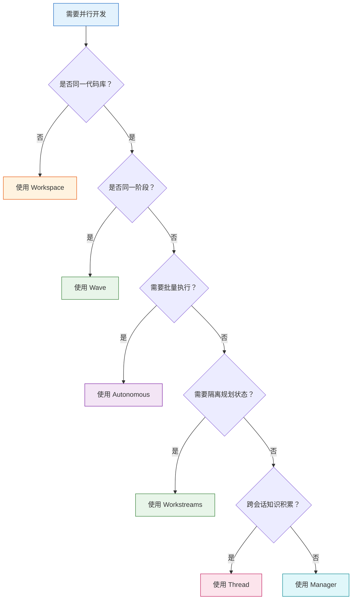
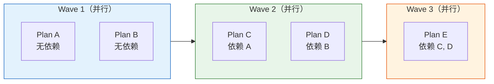
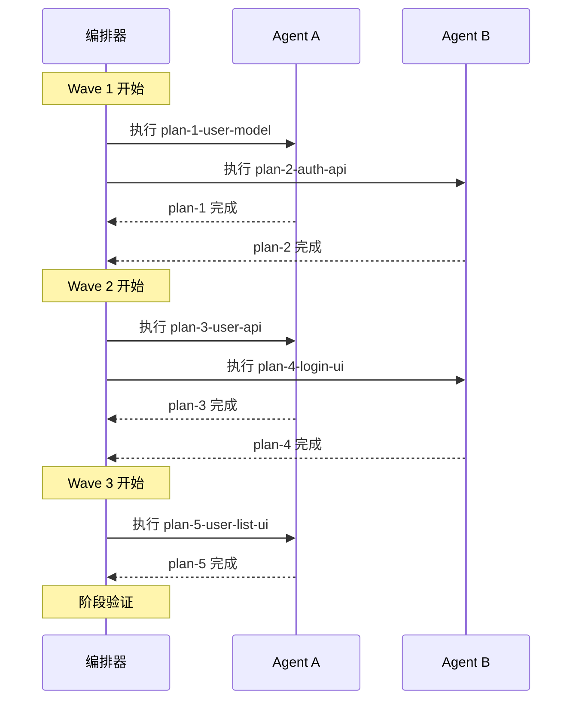
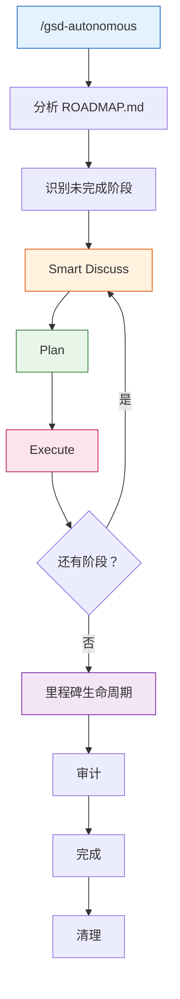
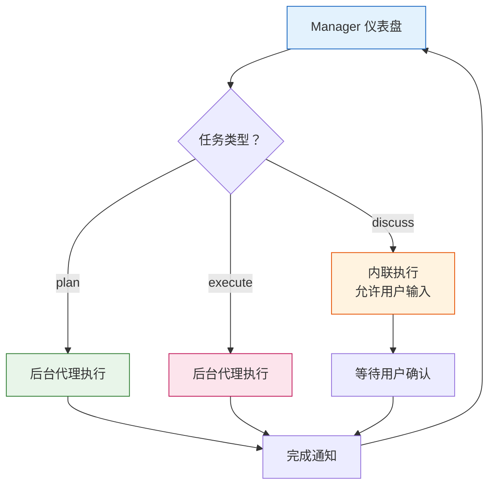
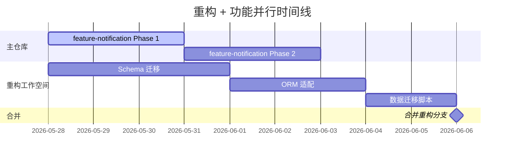
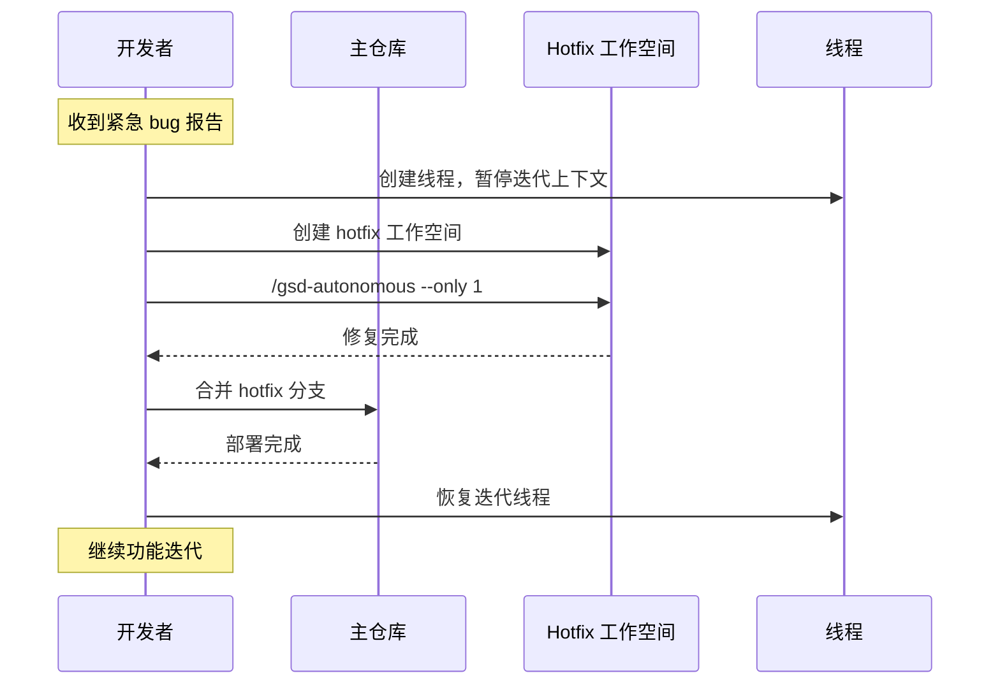
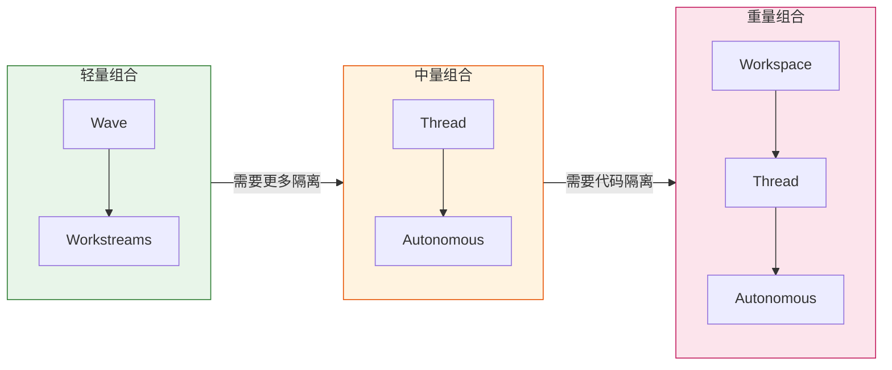
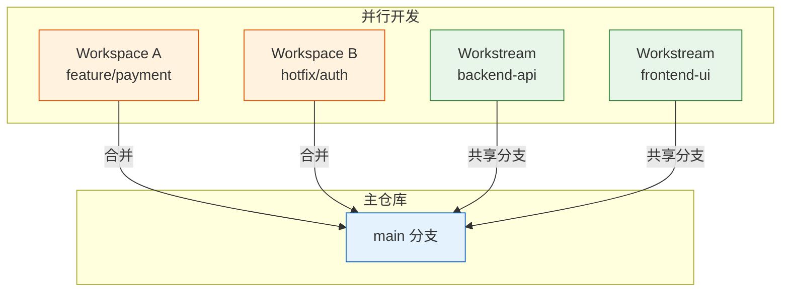

# GSD 使用教程-并行开发

> GSD（Get Shit Done）提供了丰富的并行开发能力，帮助开发者同时推进多条开发线，最大化 AI 编程效率。本教程详细介绍 GSD 的六大并行能力：Wave、Workstreams、Workspace、Thread、Autonomous 和 Manager。

## 目录

1. [并行开发概述](#1-并行开发概述)
2. [Wave 波浪式并行执行](#2-wave-波浪式并行执行)
3. [Workstreams 并行工作流](#3-workstreams-并行工作流)
4. [Workspace 隔离工作空间](#4-workspace-隔离工作空间)
5. [Thread 跨会话线程](#5-thread-跨会话线程)
6. [Autonomous 自主模式](#6-autonomous-自主模式)
7. [Manager 命令中心](#7-manager-命令中心)
8. [并行开发最佳实践](#8-并行开发最佳实践)
9. [常见问题 FAQ](#9-常见问题-faq)

---

## 1. 并行开发概述

### 1.1 为什么需要并行开发

单线程开发模式存在明显的效率瓶颈：

- **等待浪费**：AI 执行一个计划时，开发者只能等待，无法同时推进其他工作
- **多任务需求**：真实项目往往需要前后端同步开发、多个模块并行推进
- **配额限制**：单线程执行无法充分利用 API 配额，并行可以显著提升吞吐量

并行开发的核心思想是：**让多个 AI 代理同时工作，每个代理独立执行不同的任务**。

### 1.2 GSD 并行能力全景图

GSD 提供了六大并行能力，从轻量到重量，覆盖不同的并行场景：



**能力层级说明**：

| 能力 | 隔离级别 | 适用场景 | 重量级 |
|------|----------|----------|--------|
| **Wave** | 计划级别 | 同一阶段内多个独立计划并行执行 | 最轻量 |
| **Workstreams** | 规划状态级别 | 同一项目的不同功能域并行开发 | 轻量 |
| **Workspace** | 代码库级别 | 需要完全隔离的开发环境 | 重量 |
| **Thread** | 知识存储 | 跨会话的知识积累和上下文保持 | 最轻量 |
| **Autonomous** | 阶段批量 | 批量自动执行多个阶段 | 中等 |
| **Manager** | 交互管理 | 集中管理多个阶段的并行工作 | 中等 |

### 1.3 并行策略选择决策树



### 1.4 并行开发适用场景

| 适合并行 | 不适合并行 |
|----------|------------|
| 独立的 CRUD 模块 | 有强依赖的顺序任务 |
| 无耦合的前端页面 | 需要人工逐步确认的流程 |
| 独立的测试编写 | 共享状态的并发修改 |
| 前后端同步开发 | 需要实时协调的紧密协作 |
| 多个独立功能域 | 单一功能的深度开发 |

---

## 2. Wave 波浪式并行执行

Wave 是 GSD 最基础的并行能力，也是其他并行能力的基础。它在执行阶段时，将计划按依赖关系分组为"波浪"，同波浪内的计划并行执行，波浪间顺序执行。

### 2.1 核心机制



**依赖分组逻辑**：

1. **无依赖的计划** → Wave 1（最先执行）
2. **有依赖的计划** → wave = max(依赖计划的 wave) + 1
3. **文件重叠的计划** → 同 wave 内检测到重叠时覆盖为顺序执行（安全网机制）
4. wave 编号预计算并存储在 plan frontmatter 中

**执行规则**：
- 同一 wave 内的所有计划**并行执行**（每个计划由独立的 AI 代理完成）
- 不同 wave 之间**顺序执行**（前一个 wave 完成后才开始下一个）
- 阶段验证和完成仅在所有 wave 都执行完后触发

### 2.2 --wave 参数详解

使用 `--wave N` 参数可以控制执行节奏，仅执行第 N 个波浪：

| 命令 | 功能 | 适用场景 |
|------|------|----------|
| `/gsd-execute-phase 1` | 执行全部波浪 | 默认模式，自动按 Wave 1→2→3 顺序执行 |
| `/gsd-execute-phase 1 --wave 1` | 仅执行 Wave 1 | 分阶段上线、控制配额 |
| `/gsd-execute-phase 1 --wave 2` | 仅执行 Wave 2 | 需 Wave 1 已完成 |
| `/gsd-execute-phase 1 --wave 3` | 仅执行 Wave 3 | 需 Wave 1、2 已完成 |

**使用场景**：
- **分阶段上线**：先执行 Wave 1 部署，验证后再执行 Wave 2
- **配额管理**：API 配额有限时，分批执行避免超限
- **风险控制**：先执行低风险的 Wave 1，观察效果后再继续

**安全检查**：执行 `--wave N` 前，GSD 会自动检查所有 wave < N 的计划是否已完成，确保依赖关系不被破坏。

### 2.3 安全机制

GSD 为 Wave 并行提供了四项安全机制：

**1. `--no-verify` 提交**

并行代理使用 `--no-verify` 跳过 pre-commit hooks，避免多个代理同时触发构建导致锁竞争。每个 wave 完成后，编排器会统一运行 `git hook run pre-commit` 进行验证。

**2. `STATE.md` 文件锁**

`writeStateMd()` 使用基于 lockfile 的互斥锁（`STATE.md.lock`），防止多个代理并发写入 STATE.md 时产生竞争条件。

**3. 波浪内文件重叠检查**

同一 wave 内如果检测到两个计划修改相同的文件，GSD 会将该 wave 的并行执行覆盖为顺序执行（parallelization overridden to false），作为规划缺陷的安全网。

**4. 低波浪安全检查**

使用 `--wave N` 执行前，GSD 会检查所有 wave < N 的计划是否已完成，确保依赖关系不被破坏。

### 2.4 并行度建议

**垂直切片优先于水平分层**：

| 策略 | 示例 | 推荐度 |
|------|------|--------|
| **垂直切片** | Plan A: 用户注册（Model + API + UI） | 推荐 |
| **水平分层** | Plan A: 所有 Model；Plan B: 所有 API | 不推荐 |

垂直切片的优势：
- 每个计划是端到端的完整功能，独立可测试
- 减少计划间的依赖关系，提高并行度
- 更容易验证和回滚

**并行度参考**：
- 每个 executor agent 拥有独立的 200K token 上下文窗口（大模型可达 1M）
- 建议同一 wave 内并行 2-4 个计划
- 适合并行的任务：独立的 CRUD 模块、无耦合的前端页面、独立的测试编写

### 2.5 上下文压力保护

> 适用于 GSD v1.6.0+

在执行 wave 之前，GSD 编排器会主动评估上下文窗口压力，防止因上下文耗尽导致执行质量下降。该功能通过 `workflow.context_guard_mode` 配置控制：

| 模式 | 行为 | 适用场景 |
|------|------|----------|
| `warn`（默认） | 检测到 POOR 等级时发出告警，推荐执行 `/gsd:pause-work` | 大部分场景 |
| `auto` | 自动执行 `/gsd:pause-work` 暂停下一 wave，保存上下文 | 全自主/无人值守运行 |
| `off` | 禁用压力检查 | 大上下文模型（1M+ tokens） |

```bash
# 设置为自动模式
gsd config-set workflow.context_guard_mode auto
```

**自适应上下文增强**：对于支持 500K+ tokens 上下文窗口的模型，executor 代理在执行 wave 时会自动接收前一个 wave 的 `SUMMARY.md` 和 `CONTEXT.md` 文件，实现跨计划的知识传递。这确保了有依赖关系的计划之间不会丢失上下文，即使它们在不同的 wave 中执行。

### 2.6 实战示例

以"用户管理模块"阶段为例，展示 Wave 并行执行的完整流程：

**阶段计划结构**：

```text
.planning/phases/phase-2/
├── plan-1-user-model.md        # 用户数据模型（无依赖）
├── plan-2-auth-api.md          # 认证 API（无依赖）
├── plan-3-user-api.md          # 用户 API（依赖 plan-1）
├── plan-4-login-ui.md          # 登录页面（依赖 plan-2）
└── plan-5-user-list-ui.md      # 用户列表（依赖 plan-1, plan-3）
```

**Wave 分组结果**：

| Wave | 计划 | 说明 |
|------|------|------|
| Wave 1 | plan-1, plan-2 | 无依赖，并行执行 |
| Wave 2 | plan-3, plan-4 | 分别依赖 Wave 1 的计划 |
| Wave 3 | plan-5 | 依赖 Wave 1 和 Wave 2 |

**执行命令**：

```bash
# 方式 1：自动执行全部波浪
/gsd-execute-phase 2

# 方式 2：分波浪执行
/gsd-execute-phase 2 --wave 1   # 执行 Wave 1
# 验证 Wave 1 结果...
/gsd-execute-phase 2 --wave 2   # 执行 Wave 2
# 验证 Wave 2 结果...
/gsd-execute-phase 2 --wave 3   # 执行 Wave 3
```

**执行过程**：



---

## 3. Workstreams 并行工作流

Workstreams 允许在同一代码库中隔离不同功能域的规划状态，实现轻量级并行开发。

### 3.1 核心概念

Workstreams 的本质是**隔离规划状态，共享代码库**。每个 workstream 有独立的 ROADMAP.md、STATE.md 和 phases/ 目录，但共享同一个 Git 仓库。

**目录结构**：

```text
.planning/
├── PROJECT.md              # 共享
├── config.json             # 共享
├── milestones/             # 共享
├── codebase/               # 共享
└── workstreams/
    ├── feature-a/          # 工作流 A 的隔离状态
    │   ├── STATE.md
    │   ├── ROADMAP.md
    │   ├── REQUIREMENTS.md
    │   └── phases/
    └── feature-b/          # 工作流 B 的隔离状态
        ├── STATE.md
        ├── ROADMAP.md
        ├── REQUIREMENTS.md
        └── phases/
```

**隔离 vs 共享**：

| 类型 | 内容 | 说明 |
|------|------|------|
| **隔离** | STATE.md, ROADMAP.md, phases/ | 每个工作流独立 |
| **共享** | PROJECT.md, config.json, milestones/, codebase/ | 所有工作流共享 |

### 3.2 命令详解

| 命令 | 功能 | 关键说明 |
|------|------|----------|
| `/gsd-workstreams create <name>` | 创建新工作流 | 初始化隔离目录 |
| `/gsd-workstreams switch <name>` | 切换活动工作流 | 后续 GSD 命令操作该工作流 |
| `/gsd-workstreams list` | 列出所有工作流 | 显示状态和进度 |
| `/gsd-workstreams status <name>` | 查看详细状态 | 特定工作流的阶段详情 |
| `/gsd-workstreams progress` | 跨工作流进度汇总 | 全局视图 |
| `/gsd-workstreams complete <name>` | 归档完成的工作流 | 移入 milestones/ |
| `/gsd-workstreams resume <name>` | 恢复暂停的工作流 | 继续开发 |

### 3.3 Workstreams vs Workspace 对比

| 维度 | Workstreams | Workspace |
|------|-------------|------------|
| **隔离级别** | 仅规划状态 | 代码库 + 规划状态 |
| **Git 历史** | 共享 | 独立（worktree/clone） |
| **适用场景** | 同一项目的不同功能域 | 完全独立的开发环境 |
| **重量级** | 轻量 | 重量 |
| **创建速度** | 快（仅创建目录） | 慢（需要 worktree/clone） |
| **冲突风险** | 低（状态隔离） | 无（代码隔离） |

**选择建议**：
- 同一项目的不同功能域 → **Workstreams**
- 需要独立代码库或不同分支 → **Workspace**

### 3.4 实战示例

以后端 API + 前端 Dashboard 并行开发为例：

**步骤 1：创建两个 workstreams**

```bash
# 创建后端 API 工作流
/gsd-workstreams create backend-api

# 创建前端 Dashboard 工作流
/gsd-workstreams create frontend-dashboard
```

**步骤 2：并行推进**

```bash
# 切换到后端 API 工作流
/gsd-workstreams switch backend-api
/gsd-discuss-phase 1
/gsd-plan-phase 1

# 切换到前端 Dashboard 工作流
/gsd-workstreams switch frontend-dashboard
/gsd-discuss-phase 1
/gsd-plan-phase 1

# 交替执行（或使用不同会话并行）
/gsd-workstreams switch backend-api
/gsd-execute-phase 1

/gsd-workstreams switch frontend-dashboard
/gsd-execute-phase 1
```

**步骤 3：查看进度**

```bash
# 查看所有工作流进度
/gsd-workstreams progress

# 查看特定工作流状态
/gsd-workstreams status backend-api
```

**步骤 4：完成归档**

```bash
# 完成后端 API 工作流
/gsd-workstreams complete backend-api

# 完成前端 Dashboard 工作流
/gsd-workstreams complete frontend-dashboard
```

---

## 4. Workspace 隔离工作空间

Workspace 通过 git worktree 或 clone 创建完全隔离的开发环境，适合需要独立代码库的场景。

### 4.1 核心概念

Workspace 的本质是**隔离代码库 + 规划状态**。每个 workspace 有独立的工作树和 `.planning/` 目录，完全互不干扰。

**目录结构**：

```text
~/gsd-workspaces/<workspace-name>/
├── .planning/          # 独立的 GSD 状态
├── WORKSPACE.md        # 清单文件（名称、创建日期、策略、成员仓库）
└── <repo-name>/        # Git worktree 或 clone
```

**WORKSPACE.md 示例**：

```yaml
---
name: feature-payment
created: 2026-05-28
strategy: worktree
repos:
  - be-star
  - star-app
---
```

### 4.2 worktree vs clone 策略选择

| 策略 | 优点 | 缺点 | 适用场景 |
|------|------|------|----------|
| **worktree**（默认） | 轻量、共享 .git、快速创建、节省空间 | 子模块路径不安全、某些运行时不支持 | 同一仓库的不同分支开发 |
| **clone** | 完全独立、无干扰、兼容性好 | 占用更多空间、创建慢 | 不同版本/不同仓库 |

**选择建议**：
- 同一仓库的不同功能分支 → **worktree**
- 需要不同版本的代码库 → **clone**
- 项目使用子模块 → **clone**（worktree 下子模块路径不安全）

### 4.3 命令详解

| 命令 | 功能 | 关键参数 |
|------|------|----------|
| `/gsd-workspace --new` | 创建隔离工作空间 | `--name`, `--repos`, `--path`, `--strategy worktree\|clone`, `--branch`, `--auto` |
| `/gsd-workspace --list` | 列出所有工作空间 | 扫描 `~/gsd-workspaces/` 下的 `WORKSPACE.md` |
| `/gsd-workspace --remove <name>` | 移除工作空间 | 安全检查：有未提交更改时拒绝删除 |

**参数说明**：

| 参数 | 说明 | 示例 |
|------|------|------|
| `--name` | 工作空间名称 | `--name feature-payment` |
| `--repos` | 包含的仓库 | `--repos be-star,star-app` |
| `--path` | 自定义路径 | `--path ~/my-workspaces/payment` |
| `--strategy` | 创建策略 | `--strategy worktree` 或 `--strategy clone` |
| `--branch` | 分支名称 | `--branch feature/payment` |
| `--auto` | 跳过交互式问答，使用默认值 | `--auto` |

### 4.4 Git Worktree 注意事项

使用 worktree 策略时需要注意：

1. **子模块限制**：涉及子模块路径的计划在 worktree 中不安全，GSD 会自动回退到主工作树顺序执行
2. **运行时兼容性**：某些运行时（如 Codex）不支持 worktree 隔离
3. **配置禁用**：可通过 `workflow.use_worktrees` 配置项禁用 worktree

```json
{
  "workflow": {
    "use_worktrees": false
  }
}
```

### 4.5 实战示例

以多仓库并行开发为例，展示完整的 workspace 工作流：

**步骤 1：创建隔离工作空间**

```bash
# 创建支付功能的工作空间
/gsd-workspace --new --name feature-payment --repos be-star,star-app --strategy worktree --branch feature/payment
```

**步骤 2：在隔离环境中开发**

```bash
# 切换到工作空间目录
cd ~/gsd-workspaces/feature-payment

# 初始化 GSD 项目
/gsd-new-project

# 正常执行 GSD 流程
/gsd-discuss-phase 1
/gsd-plan-phase 1
/gsd-execute-phase 1
```

**步骤 3：查看所有工作空间**

```bash
/gsd-workspace --list

# 输出示例：
# NAME              STRATEGY  BRANCH              STATUS
# feature-payment   worktree  feature/payment     active
# hotfix-auth       clone     hotfix/auth         active
```

**步骤 4：合并回主仓库**

```bash
# 在工作空间中完成开发后，提交代码
git add .
git commit -m "feat: 实现支付功能"

# 回到主仓库合并
cd ~/Projects/be-star
git merge feature/payment

# 移除工作空间
/gsd-workspace --remove feature-payment
```

---

## 5. Thread 跨会话线程

Thread 是轻量级的跨会话知识存储，用于不属于特定阶段但需要跨会话保持的工作。

### 5.1 核心概念

Thread 仅存储**知识**，不涉及阶段状态。每个线程包含四个核心部分：

| 部分 | 说明 |
|------|------|
| **Goal** | 线程的目标是什么 |
| **Context** | 当前已知的信息 |
| **References** | 相关的文件、链接、代码位置 |
| **Next Steps** | 下一步要做什么 |

**文件格式**（`.planning/threads/{slug}.md`）：

```markdown
---
status: open | in_progress | resolved
---

# Thread: {title}

## Goal
调查用户登录失败的问题

## Context
- 用户报告在 Safari 浏览器登录时偶尔失败
- 后端日志显示 token 验证超时
- 已排除网络问题

## References
- 后端日志: /var/log/auth-service.log
- 相关代码: src/auth/token-validator.ts
- Issue: #123

## Next Steps
- [ ] 复现 Safari 登录问题
- [ ] 检查 token 过期时间配置
- [ ] 测试 Safari 特定的 cookie 行为
```

### 5.2 命令详解

| 命令 | 功能 | 说明 |
|------|------|------|
| `/gsd-thread "描述"` | 创建新线程 | 自动生成 slug 和文件 |
| `/gsd-thread list` | 列出所有线程 | 显示状态和摘要 |
| `/gsd-thread list --open` | 仅列出未解决的 | 过滤已关闭的线程 |
| `/gsd-thread list --resolved` | 仅列出已解决的 | 查看历史线程 |
| `/gsd-thread <slug>` | 恢复线程 | 加载上下文到当前会话 |
| `/gsd-thread status <slug>` | 查看线程状态 | 详细信息 |
| `/gsd-thread close <slug>` | 标记为已解决 | 关闭线程 |

### 5.3 Thread vs pause-work 对比

| 维度 | Thread | pause-work / resume-work |
|------|--------|--------------------------|
| **存储内容** | 知识（Goal、Context、References、Next Steps） | 完整的阶段状态和计划上下文 |
| **使用场景** | 跨会话的知识积累 | 暂停/恢复阶段内的工作 |
| **重量级** | 最轻量 | 中等 |
| **文件位置** | `.planning/threads/` | `.planning/phases/` |
| **生命周期** | 可长期保持 | 阶段完成后自动清理 |

**选择建议**：
- 需要跨会话保持的调查/研究 → **Thread**
- 阶段执行中途需要暂停 → **pause-work**

### 5.4 线程晋升路径

线程成熟后可以晋升为正式的开发任务：

**晋升为阶段**：

```bash
# 线程积累了足够的信息，晋升为新阶段
/gsd-phase

# GSD 会基于线程内容创建新的阶段文件
```

**晋升为积压项**：

```bash
# 线程记录的需求暂不开发，放入积压
/gsd-capture --backlog
```

### 5.5 实战示例

以跨会话调查 bug 为例：

**会话 1：创建线程**

```bash
# 发现一个需要深入调查的问题
/gsd-thread "调查 Safari 登录失败问题"

# 线程创建后，记录初步信息
# Goal: 找到 Safari 登录失败的根本原因
# Context: 用户报告 Safari 浏览器偶尔登录失败
# References: 后端日志路径、相关代码文件
# Next Steps: 复现问题、检查日志
```

**会话 2：恢复线程继续调查**

```bash
# 下次会话恢复线程
/gsd-thread safari-login-failure

# 继续调查，更新 Context
# 新发现：Safari 的 ITP 策略导致 cookie 被清除
```

**会话 3：线程晋升**

```bash
# 调查完成，确认需要修复
/gsd-thread close safari-login-failure

# 晋升为新阶段
/gsd-phase
# 基于线程内容创建 "修复 Safari 登录问题" 阶段
```

---

## 6. Autonomous 自主模式

Autonomous 模式自动运行里程碑中的所有剩余阶段，每个阶段执行 discuss → plan → execute 流程。

### 6.1 工作原理



**Smart Discuss**：自主优化的讨论，批量提出灰色地带答案供用户确认，减少交互次数。

### 6.2 参数详解

| 命令 | 功能 | 适用场景 |
|------|------|----------|
| `/gsd-autonomous` | 从头运行到尾 | 批量执行所有剩余阶段 |
| `/gsd-autonomous --from 3` | 从第 3 阶段开始 | 跳过已完成的阶段 |
| `/gsd-autonomous --to 5` | 运行到第 5 阶段停止 | 分段执行 |
| `/gsd-autonomous --from 3 --to 6` | 从第 3 阶段执行到第 6 阶段 | 指定范围 |
| `/gsd-autonomous --only 4` | 仅执行第 4 阶段 | 单阶段自动执行 |
| `/gsd-autonomous --interactive` | 内联顺序执行，带用户确认点 | 小阶段或 bug 修复，低 token 消耗 |
| `/gsd-autonomous --converge` | 将规划路由到 plan-review 收敛循环 | 需要交叉验证的高风险阶段 |

> **注意**：`--converge` 标志在 v1.5.0+ 真正生效（此前被忽略），v1.6.1 修复了 `--only` 跳过已延迟阶段的问题。

**参数组合示例**：

```bash
# 从第 3 阶段执行到第 6 阶段
/gsd-autonomous --from 3 --to 6

# 内联顺序执行（低 token 消耗，适合小阶段或 bug 修复）
/gsd-autonomous --interactive

# 带交叉验证的收敛模式
/gsd-autonomous --from 3 --converge --max-cycles 3
```

### 6.3 检查点机制

Autonomous 模式下有三类检查点，处理方式各不相同：

| 检查点类型 | 自动模式行为 | 说明 |
|------------|--------------|------|
| `checkpoint:human-verify` | 自动批准 | 包合法性验证除外 |
| `checkpoint:decision` | 自动选择第一个选项 | 快速推进 |
| `checkpoint:human-action` | 仍需手动干预 | 如 2FA 验证码等 |

**注意**：`checkpoint:human-action` 无法自动处理，需要开发者手动完成后再继续。

### 6.4 失败处理

执行过程中遇到失败时，GSD 提供三种处理策略：

| 策略 | 说明 | 适用场景 |
|------|------|----------|
| **Fix and retry** | 重新运行当前阶段的失败步骤 | 临时性错误 |
| **Skip this phase** | 跳过当前阶段，继续下一个 | 非关键阶段失败 |
| **Stop autonomous mode** | 显示进度摘要并退出 | 严重错误需要人工介入 |

### 6.5 实战示例

以批量执行剩余阶段为例：

```bash
# 查看当前进度
/gsd-progress

# 输出：
# Phase 1: ✅ 完成
# Phase 2: ✅ 完成
# Phase 3: ⏳ 待执行
# Phase 4: ⏳ 待执行
# Phase 5: ⏳ 待执行
# Phase 6: ⏳ 待执行

# 从第 3 阶段开始自动执行到第 6 阶段
/gsd-autonomous --from 3 --to 6

# 执行过程：
# [Phase 3] Smart Discuss... Plan... Execute... ✅
# [Phase 4] Smart Discuss... Plan... Execute... ✅
# [Phase 5] Smart Discuss... Plan... Execute... ❌ (失败)
# → 选择 "Fix and retry"
# [Phase 5] Smart Discuss... Plan... Execute... ✅
# [Phase 6] Smart Discuss... Plan... Execute... ✅
# 里程碑完成！
```

---

## 7. Manager 命令中心

`/gsd-manager` 提供仪表盘式的交互界面，集中管理多个阶段的并行工作。

### 7.1 仪表盘功能

Manager 仪表盘显示以下信息：

| 信息        | 说明                                   |
| --------- | ------------------------------------ |
| **里程碑版本** | 当前里程碑的版本和名称                          |
| **阶段状态**  | 每个阶段的 D/P/E 状态（Discuss/Plan/Execute） |
| **进度条**   | 整体完成百分比                              |
| **后台活动**  | 正在执行的后台代理                            |
| **排队预览**  | 等待执行的阶段                              |

**状态指示器**：

| 符号 | 含义 |
|------|------|
| `D` | Discuss 阶段 |
| `P` | Plan 阶段 |
| `E` | Execute 阶段 |
| `✅` | 已完成 |
| `⏳` | 待执行 |
| `🔄` | 执行中 |

### 7.2 后台代理调度

Manager 的核心特性是智能调度后台代理：

- **discuss 任务**：内联执行（允许用户输入）
- **plan/execute 任务**：作为后台代理执行
- **自动刷新**：默认 60 秒刷新一次，可配置
- **通知机制**：后台代理完成或出错时通知用户

#### 新增功能（v1.5.0+）

| 功能 | 说明 | 版本 |
|------|------|------|
| `--analyze-deps` | 扫描 `ROADMAP` 中阶段间的依赖关系，在并行执行前识别冲突 | v1.5.0 |
| **Checkpoint Heartbeat** | 后台 `execute-phase` 在 wave 和 plan 边界输出 `[checkpoint]` 标记，防止流空闲超时，并在出错时报告部分进度 | v1.5.0 |
| **Passthrough Flags** | 在 `config.json` 中设置 `manager.flags`，为每个动态分发的命令添加自定义标志 | v1.5.0 |
| **内联执行修复** | Manager 在 Claude Code 上不再静默跳过 worktree 隔离和独立验证——plan/execute 在 Claude Code 上改为内联执行，仅在支持嵌套子代理的运行时使用后台分发 | v1.5.0 |

**配置 passthrough flags 示例**：

```json
{
  "manager": {
    "flags": "--wave 1 --no-verify"
  }
}
```

**调度逻辑**：



### 7.3 实战示例

以管理多阶段并行为例：

```bash
# 启动 Manager
/gsd-manager

# 仪表盘显示（text 格式）：
# ═══════════════════════════════════════════
#  Milestone v1.0 - 用户管理系统
# ═══════════════════════════════════════════
#  Phase 1: 认证模块      [D] [P] [E] ✅
#  Phase 2: 用户管理      [D] [P] [E] 🔄
#  Phase 3: 权限系统      [D] [P] [E] ⏳
#  Phase 4: 审计日志      [D] [P] [E] ⏳
# ───────────────────────────────────────────
#  进度: ████████░░░░░░░░ 50%
# ───────────────────────────────────────────
#  后台: Phase 2 Execute 运行中...
#  推荐: 等待 Phase 2 完成，或开始 Phase 3 Discuss
# ═══════════════════════════════════════════

# 交互操作：
# - 输入 "3" → 开始 Phase 3 Discuss
# - 输入 "status 2" → 查看 Phase 2 详情
# - 输入 "refresh" → 手动刷新
```

---

## 8. 并行开发最佳实践

### 8.1 策略选择指南

| 场景 | 推荐策略 | 原因 |
|------|----------|------|
| 同一阶段内多个独立 plan | **Wave** | 自动依赖分组，并行执行 |
| 同一项目的不同功能域 | **Workstreams** | 轻量级状态隔离 |
| 需要独立代码库 | **Workspace** | 完全隔离，互不干扰 |
| 跨会话知识积累 | **Thread** | 轻量持久化，随时恢复 |
| 批量执行剩余阶段 | **Autonomous** | 全自动，减少交互 |
| 集中管理多个阶段 | **Manager** | 仪表盘式交互，智能调度 |

### 8.2 场景详细示例

以下每个场景包含：背景描述（什么时候用）、具体步骤（带完整命令）、预期结果、注意事项。

#### 场景 1：前后端并行开发

**背景**：项目需要同时开发后端 API 和前端页面，两者有接口约定但开发工作相互独立。适合团队中有人负责后端、有人负责前端，或者开发者交替推进两条线。

**适用策略**：Workstreams（轻量级状态隔离，共享代码库）

**具体步骤**：

```bash
# 步骤 1：创建两个 workstreams
/gsd-workstreams create backend-api
/gsd-workstreams create frontend-dashboard

# 步骤 2：后端——讨论并规划第 1 阶段
/gsd-workstreams switch backend-api
/gsd-discuss-phase 1
# 讨论用户管理模块的 API 设计...
/gsd-plan-phase 1
# 生成 plan-1-user-model、plan-2-auth-api、plan-3-user-api

# 步骤 3：前端——讨论并规划第 1 阶段
/gsd-workstreams switch frontend-dashboard
/gsd-discuss-phase 1
# 讨论 Dashboard 页面布局和组件设计...
/gsd-plan-phase 1
# 生成 plan-1-layout、plan-2-user-list、plan-3-login-page

# 步骤 4：后端——执行第 1 阶段（Wave 自动并行）
/gsd-workstreams switch backend-api
/gsd-execute-phase 1
# Wave 1: plan-1-user-model + plan-2-auth-api 并行执行
# Wave 2: plan-3-user-api 执行

# 步骤 5：前端——执行第 1 阶段
/gsd-workstreams switch frontend-dashboard
/gsd-execute-phase 1
# Wave 1: plan-1-layout 执行
# Wave 2: plan-2-user-list + plan-3-login-page 并行执行

# 步骤 6：查看全局进度
/gsd-workstreams progress
```

**预期结果**：

```text
Workstreams Progress:
┌─────────────────────┬─────────┬───────────┬──────────┐
│ Workstream          │ Status  │ Phase     │ Progress │
├─────────────────────┼─────────┼───────────┼──────────┤
│ backend-api         │ active  │ Phase 1   │ 100%     │
│ frontend-dashboard  │ active  │ Phase 1   │ 100%     │
└─────────────────────┴─────────┴───────────┴──────────┘
```

**注意事项**：
- 两个 workstream 共享代码库，如果同时修改同一个文件（如接口类型定义文件），合并时可能产生 Git 冲突
- 建议前后端通过接口文档（如 OpenAPI spec）对齐，减少代码层面的耦合
- 如果前后端需要完全隔离代码库（如使用不同分支），应改用 Workspace

#### 场景 2：多模块并行开发

**背景**：一个阶段包含多个独立的 CRUD 模块（如用户管理、订单管理、商品管理），每个模块之间无依赖关系，可以同时推进。

**适用策略**：Wave（自动依赖分组，无需手动管理）

**具体步骤**：

```bash
# 步骤 1：正常讨论和规划阶段
/gsd-discuss-phase 1
# 讨论结果：需要实现用户、订单、商品三个独立模块
/gsd-plan-phase 1
# GSD 自动生成 6 个 plan，按依赖关系自动分组

# 步骤 2：查看 Wave 分组情况
cat .planning/phases/phase-1/plan-1-user-model.md
# frontmatter: wave: 1, depends_on: []
cat .planning/phases/phase-1/plan-3-order-model.md
# frontmatter: wave: 1, depends_on: []
cat .planning/phases/phase-1/plan-5-order-api.md
# frontmatter: wave: 2, depends_on: [plan-3-order-model]

# 步骤 3：执行阶段（Wave 自动并行）
/gsd-execute-phase 1
```

**预期结果**：

```text
Executing Phase 1...
├── Wave 1 (parallel):
│   ├── Agent A: plan-1-user-model     ✅ (12s)
│   ├── Agent B: plan-2-user-api       ✅ (15s)
│   ├── Agent C: plan-3-order-model    ✅ (10s)
│   └── Agent D: plan-4-product-model  ✅ (11s)
├── Wave 2 (parallel):
│   ├── Agent A: plan-5-order-api      ✅ (14s)
│   └── Agent B: plan-6-product-api    ✅ (13s)
└── Phase 1 verification: ✅ PASSED
```

**注意事项**：
- 规划时尽量采用"垂直切片"策略——每个 plan 包含一个模块的 Model + API + UI，而非按层拆分
- 同一 Wave 内如果检测到文件重叠，GSD 会自动将并行降级为顺序执行
- 建议同一 Wave 内并行 2-4 个计划，过多并行可能导致上下文窗口不足

#### 场景 3：热修复 + 功能开发并行

**背景**：线上出现紧急 bug 需要立即修复，同时团队正在开发新功能。两者需要在不同分支上独立进行，互不干扰。

**适用策略**：Workspace（完全隔离的代码库 + 独立分支）

**具体步骤**：

```bash
# 步骤 1：创建工作空间——热修复
/gsd-workspace --new \
  --name hotfix-auth \
  --repos be-star \
  --strategy worktree \
  --branch hotfix/auth-bypass

# 步骤 2：创建工作空间——功能开发
/gsd-workspace --new \
  --name feature-payment \
  --repos be-star,star-app \
  --strategy worktree \
  --branch feature/payment

# 步骤 3：在热修复工作空间中开发
cd ~/gsd-workspaces/hotfix-auth
/gsd-new-project
/gsd-discuss-phase 1
# 讨论认证绕过漏洞的修复方案
/gsd-plan-phase 1
/gsd-execute-phase 1
# 快速完成修复，验证通过

# 步骤 4：在功能开发工作空间中继续
cd ~/gsd-workspaces/feature-payment
/gsd-new-project
/gsd-discuss-phase 1
# 讨论支付模块的架构设计
/gsd-plan-phase 1
/gsd-execute-phase 1

# 步骤 5：热修复完成后合并并清理
cd ~/Projects/be-star
git checkout main
git merge hotfix/auth-bypass
git push origin main
/gsd-workspace --remove hotfix-auth

# 步骤 6：功能开发完成后合并
git merge feature/payment
/gsd-workspace --remove feature-payment
```

**预期结果**：

```text
$ /gsd-workspace --list
NAME              STRATEGY  BRANCH                STATUS
hotfix-auth       worktree  hotfix/auth-bypass    active
feature-payment   worktree  feature/payment       active

# 两个工作空间完全隔离，各自有独立的 .planning/ 和代码分支
```

**注意事项**：
- 热修复完成后应立即合并到 main 并部署，不要等待功能开发完成
- 如果热修复的改动影响到功能开发的代码（如修改了共享的认证模块），合并后需要在功能工作空间中 rebase
- worktree 策略下子模块路径不安全，如果项目使用子模块请改用 `--strategy clone`

#### 场景 4：批量执行剩余阶段

**背景**：项目已经完成了前几个阶段的讨论和规划，剩余阶段（如测试、文档、部署）流程明确，希望自动批量执行以节省时间。

**适用策略**：Autonomous（全自动执行，减少交互）

**具体步骤**：

```bash
# 步骤 1：查看当前进度
/gsd-progress

# 输出：
# Phase 1: 用户模块      ✅ 完成
# Phase 2: 订单模块      ✅ 完成
# Phase 3: 商品模块      ✅ 完成
# Phase 4: 集成测试      ⏳ 待执行
# Phase 5: 性能优化      ⏳ 待执行
# Phase 6: 部署配置      ⏳ 待执行

# 步骤 2：启动自主模式
/gsd-autonomous --from 4

# 执行过程：
# [Phase 4] Smart Discuss... → 批量确认测试策略 → Plan... → Execute... ✅
# [Phase 5] Smart Discuss... → 批量确认优化指标 → Plan... → Execute... ✅
# [Phase 6] Smart Discuss... → 批量确认部署配置 → Plan... → Execute... ✅
# 里程碑完成！审计 → 完成 → 清理

# 步骤 3（可选）：如果只想执行到某个阶段
/gsd-autonomous --from 4 --to 5
# 仅执行 Phase 4 和 Phase 5，Phase 6 需要手动执行
```

**预期结果**：

```text
Autonomous Mode: Phase 4 → Phase 6
━━━━━━━━━━━━━━━━━━━━━━━━━━━━━━━━━━
[Phase 4] 集成测试
  Discuss: 3 个灰色地带自动确认 ✅
  Plan: 4 plans generated ✅
  Execute: Wave 1 (2p) → Wave 2 (2p) ✅

[Phase 5] 性能优化
  Discuss: 2 个灰色地带自动确认 ✅
  Plan: 3 plans generated ✅
  Execute: Wave 1 (3p) ✅

[Phase 6] 部署配置
  Discuss: 5 个灰色地带自动确认 ✅
  Plan: 2 plans generated ✅
  Execute: Wave 1 (2p) ✅

Milestone lifecycle: Audit → Complete → Cleanup ✅
```

**注意事项**：
- 使用 `--interactive` 参数可以在 discuss 步骤暂停让你确认，适合灰色地带较多的阶段
- 如果某个阶段执行失败，可以选择 "Fix and retry"（重试）、"Skip this phase"（跳过）或 "Stop"（停止）
- `checkpoint:human-action` 类型的检查点无法自动处理，会暂停等待人工操作
- 建议先用 `--only N` 测试单个阶段，确认无误后再用 `--from N` 批量执行

#### 场景 5：大型重构 + 功能开发并行

**背景**：项目需要进行大型代码重构（如数据库迁移、框架升级、架构调整），同时不能阻塞正在进行的功能开发。重构涉及大量文件改动，需要在独立分支上进行。

**适用策略**：Workspace（代码隔离） + Autonomous（批量执行重构阶段）

**具体步骤**：

```bash
# 步骤 1：创建重构工作空间
/gsd-workspace --new \
  --name refactor-db-migration \
  --repos be-star \
  --strategy worktree \
  --branch refactor/migrate-to-postgres

# 步骤 2：在主仓库继续功能开发（使用 Workstreams）
/gsd-workstreams create feature-notification
/gsd-workstreams switch feature-notification
/gsd-discuss-phase 1
/gsd-plan-phase 1
/gsd-execute-phase 1

# 步骤 3：在重构工作空间中规划重构
cd ~/gsd-workspaces/refactor-db-migration
/gsd-new-project
/gsd-discuss-phase 1
# 讨论数据库迁移方案：MySQL → PostgreSQL
/gsd-plan-phase 1
# 生成多个 plan：schema 迁移、ORM 配置、数据迁移脚本、测试适配

# 步骤 4：使用 Autonomous 批量执行重构阶段
/gsd-autonomous --from 1 --to 3
# Phase 1: Schema 迁移（表结构、索引、约束）
# Phase 2: ORM 配置和数据访问层适配
# Phase 3: 数据迁移脚本和验证

# 步骤 5：主仓库中用 Thread 追踪重构进度
/gsd-thread "追踪 DB 重构进度——等待重构完成后合并"

# 步骤 6：重构完成，合并回主仓库
cd ~/Projects/be-star
git checkout main
git merge refactor/migrate-to-postgres
# 解决可能的冲突...
git push origin main
/gsd-workspace --remove refactor-db-migration

# 步骤 7：关闭追踪线程
/gsd-thread close refactor-db-progress
```

**流程示意图**：



**注意事项**：
- 重构分支生命周期较长，需要定期从 main 合并最新代码，避免最终合并时冲突过多
- 使用 Thread 记录重构的关键决策和进展，方便跨会话追踪
- 如果重构涉及数据库 schema 变更，建议在重构工作空间中也运行完整的测试套件
- 合并前务必在重构分支上执行完整的验证流程

#### 场景 6：多团队/多功能域并行

**背景**：项目有多个独立的功能域（如用户系统、内容系统、推荐系统），由不同团队或开发者负责，各自有独立的迭代节奏。需要在同一代码库中并行推进，但规划状态互不干扰。

**适用策略**：Workstreams（轻量级状态隔离） + Manager（集中管理进度）

**具体步骤**：

```bash
# 步骤 1：为每个功能域创建 workstream
/gsd-workstreams create user-system
/gsd-workstreams create content-system
/gsd-workstreams create recommend-system

# 步骤 2：用户系统团队——独立推进
/gsd-workstreams switch user-system
/gsd-discuss-phase 1
# 讨论用户权限系统的重构方案
/gsd-plan-phase 1
/gsd-execute-phase 1

# 步骤 3：内容系统团队——独立推进
/gsd-workstreams switch content-system
/gsd-discuss-phase 1
# 讨论内容审核模块的新需求
/gsd-plan-phase 1
/gsd-execute-phase 1

# 步骤 4：推荐系统团队——独立推进
/gsd-workstreams switch recommend-system
/gsd-discuss-phase 1
# 讨论推荐算法的优化方案
/gsd-plan-phase 1
/gsd-execute-phase 1

# 步骤 5：使用 Manager 集中查看全局进度
/gsd-manager

# 步骤 6：查看跨工作流进度
/gsd-workstreams progress
```

**预期结果**：

```text
$ /gsd-workstreams progress
┌───────────────────┬─────────┬───────────┬──────────┬──────────────────────┐
│ Workstream        │ Status  │ Phase     │ Progress │ Last Activity        │
├───────────────────┼─────────┼───────────┼──────────┼──────────────────────┤
│ user-system       │ active  │ Phase 2   │ 60%      │ 2 hours ago          │
│ content-system    │ active  │ Phase 1   │ 100%     │ 30 min ago           │
│ recommend-system  │ active  │ Phase 1   │ 45%      │ 1 hour ago           │
└───────────────────┴─────────┴───────────┴──────────┴──────────────────────┘
```

**注意事项**：
- 多个 workstream 共享代码库，需要约定好文件和模块的归属，避免两个团队同时修改同一个文件
- 建议在项目初期就划分好功能域边界，每个功能域有独立的目录结构
- 使用 `/gsd-workstreams progress` 定期检查全局进度，及时发现依赖和冲突
- 完成的功能域使用 `/gsd-workstreams complete <name>` 归档，保持活跃 workstream 数量合理

#### 场景 7：紧急 bug 修复 + 常规迭代并行

**背景**：团队正在进行常规功能迭代，突然收到线上紧急 bug 报告。需要快速响应修复 bug，同时不中断正在进行的迭代工作。修复完成后需要同时部署 hotfix 和继续迭代。

**适用策略**：Workspace（隔离 hotfix） + Thread（记录上下文） + Autonomous（快速执行 hotfix）

**具体步骤**：

```bash
# 步骤 1：暂停当前迭代工作，记录上下文
/gsd-thread "暂停功能迭代——待 hotfix 完成后恢复"

# 步骤 2：创建 hotfix 工作空间
/gsd-workspace --new \
  --name hotfix-payment-crash \
  --repos be-star \
  --strategy worktree \
  --branch hotfix/payment-crash

# 步骤 3：在 hotfix 工作空间中快速修复
cd ~/gsd-workspaces/hotfix-payment-crash
/gsd-new-project
/gsd-discuss-phase 1
# 讨论支付崩溃 bug 的根因和修复方案
/gsd-plan-phase 1
# 生成修复计划

# 步骤 4：使用 Autonomous 快速执行修复
/gsd-autonomous --only 1
# 自动完成 discuss → plan → execute，最少交互

# 步骤 5：验证修复
# 运行测试、检查日志...
git add .
git commit -m "fix: 修复支付模块空指针崩溃"

# 步骤 6：合并 hotfix 并部署
cd ~/Projects/be-star
git checkout main
git merge hotfix/payment-crash
git push origin main
# 触发 CI/CD 部署 hotfix...
/gsd-workspace --remove hotfix-payment-crash

# 步骤 7：恢复迭代工作
/gsd-thread list --open
/gsd-thread resume-feature-iteration
# 上下文恢复，继续之前的迭代工作
```

**流程示意图**：



**注意事项**：
- hotfix 工作空间应尽量小——只修复 bug，不引入额外改动
- 使用 `--only 1` 参数让 Autonomous 仅执行一个阶段，快速完成
- 修复完成后务必在 hotfix 分支上运行完整的测试套件
- 合并 hotfix 后，如果正在进行的功能分支受影响，需要 rebase 到最新的 main

### 8.3 场景选择速查表

当面对具体的并行开发需求时，使用下表快速匹配推荐策略：

| 场景 | 推荐策略 | 关键命令 | 重量级 | 说明 |
|------|----------|----------|--------|------|
| 同一阶段内多个独立模块 | **Wave** | `/gsd-execute-phase N` | 最轻 | 自动依赖分组，无需手动管理 |
| 前后端/多端并行开发 | **Workstreams** | `/gsd-workstreams create/switch` | 轻 | 状态隔离，代码共享 |
| 热修复 + 功能开发并行 | **Workspace** | `/gsd-workspace --new` | 重 | 完全隔离，独立分支 |
| 大型重构 + 日常迭代并行 | **Workspace + Autonomous** | `/gsd-workspace --new` + `/gsd-autonomous` | 重 | 隔离重构，批量执行 |
| 多团队/多功能域并行 | **Workstreams + Manager** | `/gsd-workstreams` + `/gsd-manager` | 轻 | 独立规划，集中管理 |
| 紧急 bug + 常规迭代 | **Workspace + Thread + Autonomous** | 组合使用 | 重 | 隔离修复 + 上下文保持 + 快速执行 |
| 批量执行剩余阶段 | **Autonomous** | `/gsd-autonomous --from N` | 中 | 全自动，最少交互 |
| 跨会话 bug 调查 | **Thread** | `/gsd-thread "描述"` | 最轻 | 知识积累，随时恢复 |
| 集中管理多阶段进度 | **Manager** | `/gsd-manager` | 中 | 仪表盘式交互 |

**策略组合建议**：



### 8.4 冲突处理

**文件冲突**：
- Wave 并行：GSD 自动检测文件重叠，将并行覆盖为顺序执行
- Workstreams：状态隔离，代码共享，需要注意 Git 冲突
- Workspace：完全隔离，无文件冲突

**状态冲突**：
- Wave：使用 STATE.md 文件锁防止并发写入
- Workstreams：每个 workstream 有独立的 STATE.md
- Workspace：完全独立的状态

**Git 冲突**：
- Wave：同一分支，使用 `--no-verify` 避免 hook 冲突
- Workstreams：同一分支，需要注意合并时机
- Workspace：独立分支，合并时需要解决冲突

### 8.5 Git 工作流建议



**建议**：
- Workspace 使用独立分支，开发完成后合并到 main
- Workstreams 共享分支，注意提交顺序和冲突解决
- Wave 在同一分支内并行，使用 `--no-verify` 避免 hook 冲突

---

## 9. 常见问题 FAQ

### 9.1 Wave 相关

**Q: Wave 执行失败后如何恢复？**

使用 `--wave N` 参数重新执行失败的 wave：

```bash
# 重新执行 Wave 2
/gsd-execute-phase 1 --wave 2
```

GSD 会自动检查低波浪是否已完成，只重新执行失败的 wave。

**Q: 如何查看当前的 Wave 分组情况？**

Wave 分组信息存储在 plan 的 frontmatter 中：

```bash
# 查看阶段的计划文件
cat .planning/phases/phase-1/plan-1-*.md

# frontmatter 中包含：
# wave: 1
# depends_on: []
# files_modified: ["src/models/user.ts"]
```

**Q: 文件重叠的 plan 会被强制顺序执行吗？**

是的。同一 wave 内如果检测到两个 plan 修改相同的文件，GSD 会将该 wave 的并行执行覆盖为顺序执行，作为规划缺陷的安全网。

### 9.2 Workstreams 相关

**Q: Workstreams 之间会互相影响吗？**

规划状态完全隔离，不会互相影响。但代码库是共享的，所以如果两个 workstream 修改了相同的文件，可能会产生 Git 冲突。

**Q: 如何在 workstreams 之间共享代码？**

由于 workstreams 共享同一个代码库，一个 workstream 的代码变更会自动对其他 workstream 可见。无需额外操作。

**Q: 完成的 workstream 去哪了？**

使用 `/gsd-workstreams complete <name>` 归档后，workstream 会移动到 `.planning/milestones/` 目录，作为项目里程碑记录保留。

### 9.3 Workspace 相关

**Q: worktree 和 clone 哪个更快？**

worktree 更快。它只创建一个新的工作树，共享 `.git` 目录，通常几秒钟就能完成。clone 需要完整复制仓库，时间取决于仓库大小。

**Q: workspace 删除后数据还能恢复吗？**

使用 `/gsd-workspace --remove <name>` 删除时，GSD 会检查未提交的更改。如果确认删除，数据将无法恢复。建议删除前确保所有更改已提交或合并。

**Q: 子模块项目为什么不能用 worktree？**

Git worktree 对子模块的支持不完善，子模块的路径在 worktree 中可能指向错误的位置。GSD 会自动检测这种情况并回退到主工作树执行，或建议使用 clone 策略。

### 9.4 Thread 相关

**Q: Thread 和 pause-work 到底有什么区别？**

Thread 是轻量级的知识存储，只保存 Goal/Context/References/Next Steps。pause-work 是完整的阶段状态暂停/恢复，包含所有计划和执行状态。

**Q: 线程可以自动晋升为阶段吗？**

不能自动晋升，需要手动执行 `/gsd-phase` 或 `/gsd-capture --backlog`。这是设计如此，因为线程到阶段的转换需要人工判断。

**Q: 线程有数量限制吗？**

没有硬性限制。但建议保持线程数量合理，定期关闭已解决的线程，保持 `.planning/threads/` 目录整洁。

### 9.5 Autonomous 相关

**Q: Autonomous 模式下如何处理需要人工确认的步骤？**

检查点类型决定了处理方式：
- `checkpoint:human-verify`：自动批准
- `checkpoint:decision`：自动选择第一个选项
- `checkpoint:human-action`：暂停等待人工处理

**Q: 执行失败会自动重试吗？**

不会自动重试。失败时 GSD 会暂停并提供三个选项：Fix and retry、Skip this phase、Stop autonomous mode。选择 "Fix and retry" 才会重试。

**Q: 可以中途暂停 autonomous 模式吗？**

可以。按 `Ctrl+C` 或在交互提示时选择 "Stop autonomous mode"。GSD 会显示当前进度摘要，已完成的阶段不会丢失。
