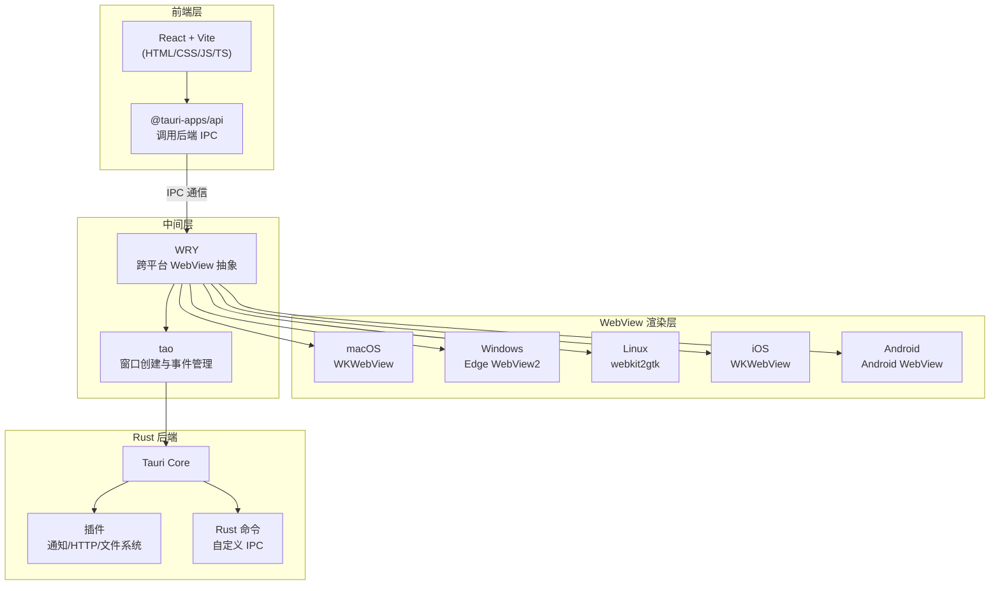

# Tauri2打包react移动端应用调研

## 1. 引言

### 1.1 文档目的

本文档面向**React 前端开发者**（零 Rust 经验，移动端开发新手），提供以下内容的可行性调研和实操指南：使用 Tauri 2 框架将现有 React + Vite 前端项目打包为 Android / iOS 移动端应用。

Tauri 2 稳定版于 **2024 年 10 月 2 日**正式发布（GA），新增了对 iOS 和 Android 移动端的编译支持。相较于 Electron 和 Capacitor 等方案，Tauri 2 以更小的包体积、更好的安全模型和极高的 Web 代码复用率，成为将现有 React Web 项目快速转换为移动 App 的可行选择。

### 1.2 阅读完本文后你将能独立完成

| # | 事项 | 章节 |
|---|------|------|
| 1 | 在 macOS / Windows / Linux 上搭建 Tauri 2 完整的开发环境（含 Rust、Android SDK、Xcode） | 第 3 章 |
| 2 | 在现有 React + Vite 项目中集成 Tauri 2（脚手架创建或手动集成） | 第 4 章 |
| 3 | 在 Android 模拟器 / iOS 模拟器 / 真机上运行应用进行开发调试 | 第 5 章 |
| 4 | 打包并签名 Android 应用（APK / AAB），可上传至 Google Play | 第 6 章 |
| 5 | 打包并签名 iOS 应用，可上传至 App Store Connect | 第 7 章 |
| 6 | 配置 GitHub Actions CI/CD 流水线实现自动化构建和发布 | 第 8 章 |
| 7 | 独立解决环境搭建和构建过程中最常见的踩坑问题 | 第 9 章 |

### 1.3 读者前置知识

| 知识点 | 必需程度 | 说明 |
|--------|----------|------|
| React 开发经验 | 必需 | 理解 React 组件、路由、构建配置 |
| Vite 构建工具 | 推荐 | 了解 `vite.config.ts` 配置和构建流程 |
| 命令行基础 | 必需 | 能执行 npm/pnpm 命令、基本 shell 操作 |
| Rust 经验 | **不要求** | 无需编写 Rust 代码，只需了解 Rust 工程目录结构 |
| Android/iOS 开发经验 | **不要求** | 教程涵盖环境搭建和打包流程，仅需基本 Android Studio / Xcode 操作 |
| Git 基础 | 推荐 | 用于版本管理和 CI/CD 配置 |

### 1.4 文档结构概览

本文档按操作主线组织：**概念理解 → 环境搭建 → 项目集成 → 开发调试 → 打包分发 → CI/CD → 问题排查**。你可以根据当前需求跳过已熟悉的章节直接阅读目标内容。

---

## 2. Tauri 2 核心概念与架构

### 2.1 技术架构概览

Tauri 2 采用 **Rust 后端 + 系统 WebView 渲染前端** 的技术架构。与 Electron（内置 Chromium + Node.js）不同，Tauri 不捆绑浏览器引擎，而是直接调用操作系统原生的 WebView 来渲染前端界面。这使得 Tauri 应用的基础包体积可以小至 2MB 以下，移动端通常也在 5-15MB 范围。



**关键依赖库说明**：

- **WRY**（`webkit2gtk-rs` / `wry`）：跨平台 WebView 渲染抽象层。它封装了 macOS 的 WKWebView、Windows 的 Edge WebView2、Linux 的 webkit2gtk、iOS 的 WKWebView 和 Android 的 Android WebView，为上层提供统一的 WebView 接口。
- **tao**：跨平台窗口创建库，负责窗口的创建、事件循环、拖拽等底层窗口管理功能。

### 2.2 Tauri 1.x 到 2.x 的关键变化

对于从 Tauri 1.x 迁移或新上手 Tauri 2 的开发者，以下是最需要了解的变化：

| 变化项 | Tauri 1.x | Tauri 2.x |
|--------|-----------|-----------|
| 配置根键 | `tauri` | `app` |
| 权限体系 | `allowlist`（白名单 JSON 配置） | `capability`（声明式权限 JSON 文件） |
| 功能组织 | 内置在 core | 拆分为独立插件（通知、对话框、Shell 等） |
| 移动端支持 | 不支持 | 支持 iOS / Android |
| 多 WebView | 单个窗口一个 WebView | 窗口可嵌入多个 WebView |
| 菜单/托盘 | 仅桌面端内置 | 菜单和托盘图标 API 增强 |

对于移动端打包场景，最需要关注的变化是：
1. **权限声明方式**：不再使用 `tauri.conf.json` 中的 `allowlist`，而是在 `capabilities/` 目录下通过 JSON 文件声明
2. **插件化架构**：通知、HTTP 请求、文件系统等功能需单独安装对应插件
3. **移动端编译目标**：新增 `aarch64-linux-android` 等 Android 目标和 `aarch64-apple-ios` 等 iOS 目标

### 2.3 方案定位对比

以下是与主流跨平台方案的简要对比，帮助理解 Tauri 2 的定位：

| 维度 | Tauri 2 | Electron | Capacitor | React Native |
|------|---------|----------|-----------|-------------|
| **UI 渲染** | 系统 WebView | 内置 Chromium | 系统 WebView | 原生组件（JS 桥接） |
| **后端语言** | Rust | Node.js | JS/Java/Swift | JavaScript |
| **包体积（基础）** | 2-15 MB | 100+ MB | 15-30 MB | 10-30 MB |
| **代码复用率** | 90%+（Web 代码直接复用） | 90%+ | 80%+ | ~60%（需适配） |
| **移动端支持** | iOS + Android（v2 起） | 不支持 | iOS + Android | iOS + Android |
| **安全性** | 高（权限声明 + Rust） | 低（Node.js 暴露面大） | 中 | 中 |
| **学习成本（前端团队）** | 低（仅 Rust 目录结构） | 低 | 低 | 中（需学习 RN 组件） |
| **生态成熟度** | 发展中（2024 GA） | 非常成熟 | 成熟 | 非常成熟 |

**核心定位**：Tauri 2 最适合**将现有 React Web 应用快速转换为移动 App**，代码复用率极高（90%+），包体积小，安全性好。但 WebView 渲染存在性能天花板，不适合图形密集型或对原生交互要求极高的场景。

### 2.4 移动端支持现状与限制

#### 编译目标

| 平台 | CPU 架构 | rustup target |
|------|---------|---------------|
| iOS | arm64（真机） | `aarch64-apple-ios` |
| iOS | x86_64（模拟器） | `x86_64-apple-ios` |
| iOS | arm64（模拟器，Apple Silicon） | `aarch64-apple-ios-sim` |
| Android | arm64-v8a（主流） | `aarch64-linux-android` |
| Android | armeabi-v7a（旧设备） | `armv7-linux-androideabi` |
| Android | x86（模拟器） | `i686-linux-android` |
| Android | x86_64（模拟器/Chromebook） | `x86_64-linux-android` |

#### 已知限制

- **iOS 编译仅限 macOS**：iOS 的构建必须在 macOS 上进行，Windows/Linux 无法编译 iOS 应用。Android 可在 macOS/Windows/Linux 上编译。
- **不支持 SSR 框架**：Tauri 使用静态前端构建产物，Next.js 等服务端渲染框架需使用 SSG（静态生成）模式。
- **无代码热更新**：Tauri 不支持像 React Native 或 Flutter 那样推送 JS bundle 更新。应用更新必须走应用商店分发流程。HMR（热模块替换）仅在开发阶段可用。
- **WebView 兼容性**：CSS/JS 兼容性取决于系统 WebView 版本。iOS 使用 WKWebView（iOS 9+），Android 使用 Android WebView（Android 5+）。低版本系统可能不支持某些 CSS 特性。
- **移动端插件生态尚在发展**：部分原生功能可能需要自研 Rust 插件，社区插件丰富度不及 Flutter 和 React Native。

---

## 3. 开发环境搭建

### 3.1 Rust 环境

Tauri 使用 Rust 编写后端逻辑。安装 Rust 的唯一官方方式是使用 `rustup`。

**安装命令**（macOS / Linux）：

```bash
curl --proto '=https' --tlsv1.2 -sSf https://sh.rustup.rs | sh
```

**Windows**：从 https://www.rust-lang.org/tools/install 下载 `rustup-init.exe` 并运行。

安装完成后，重启终端使环境变量生效。

**版本验证**：

```bash
rustc --version
# 输出示例: rustc 1.85.0 (abcdef123 2026-01-15)
```

Tauri 2 要求 **rustc >= 1.77.2**。如果版本不足，运行更新命令：

```bash
rustup update
```

> **提示**：首次安装 Rust 后，Cargo 的 bin 目录（`$HOME/.cargo/bin`）会自动加入 `PATH`。如果 `rustc` 命令找不到，检查 `~/.bashrc`、`~/.zshrc` 或 `~/.profile` 中是否包含 `source "$HOME/.cargo/env"`。

### 3.2 各平台系统依赖

#### macOS

如果仅开发桌面端，安装 Xcode Command Line Tools 即可：

```bash
xcode-select --install
```

如果计划开发 iOS 应用，则需要从 Mac App Store 安装完整版 **Xcode**（同时包含 iOS SDK 和 Command Line Tools）。

#### Windows

1. 下载并安装 [Microsoft C++ Build Tools](https://visualstudio.microsoft.com/visual-cpp-build-tools/)
2. 安装时勾选 **「Desktop development with C++」**

Windows 10 1803 及以上版本已内置 WebView2 运行时。如果使用旧版 Windows，需单独安装 [WebView2 Evergreen Bootstrapper](https://developer.microsoft.com/en-us/microsoft-edge/webview2/#download-section)。

#### Linux（Debian/Ubuntu）

```bash
sudo apt update
sudo apt install libwebkit2gtk-4.1-dev \
  build-essential \
  curl \
  wget \
  file \
  libxdo-dev \
  libssl-dev \
  libayatana-appindicator3-dev \
  librsvg2-dev
```

其他 Linux 发行版的依赖安装命令请参考 [Tauri 官方文档](https://v2.tauri.app/start/prerequisites/#linux)。

### 3.3 Android 移动端开发环境

Android 移动端开发是本文档的核心场景。以下是完整的环境配置步骤。

**步骤 1：安装 Android Studio**

从 https://developer.android.com/studio 下载并安装 Android Studio。

**步骤 2：通过 SDK Manager 安装必要组件**

打开 Android Studio → More Actions → SDK Manager，安装以下组件：

| 组件 | 说明 | 推荐版本 |
|------|------|---------|
| Android SDK Platform | 编译目标 SDK | API 34 或 35 |
| Android SDK Platform-Tools | adb 等工具 | 最新 |
| Android SDK Build-Tools | 构建工具 | 最新 |
| NDK（Side-by-side） | 原生开发工具包 | **25.x 或 27.x** |
| Android Command-line Tools | sdkmanager CLI | 最新 |

> **NDK 版本提示**：Tauri 2 在 Android 端依赖 NDK 来编译 Rust 代码。推荐使用 NDK 25+，与 Rust 的 Android 编译目标兼容性最好。过老的 NDK 版本可能导致 Rust 编译失败。

**步骤 3：配置环境变量**

在 shell 配置文件中（`~/.zshrc`、`~/.bashrc` 等）添加：

```bash
# macOS (Android Studio 默认安装路径)
export JAVA_HOME="/Applications/Android Studio.app/Contents/jbr/Contents/Home"
export ANDROID_HOME="$HOME/Library/Android/sdk"
export NDK_HOME="$ANDROID_HOME/ndk/$(ls -1 $ANDROID_HOME/ndk | sort -V | tail -1)"
export PATH="$PATH:$ANDROID_HOME/platform-tools:$ANDROID_HOME/cmdline-tools/latest/bin"
```

```bash
# Linux (Android Studio 默认安装路径)
export JAVA_HOME=/opt/android-studio/jbr
export ANDROID_HOME="$HOME/Android/Sdk"
export NDK_HOME="$ANDROID_HOME/ndk/$(ls -1 $ANDROID_HOME/ndk | sort -V | tail -1)"
export PATH="$PATH:$ANDROID_HOME/platform-tools:$ANDROID_HOME/cmdline-tools/latest/bin"
```

> **JAVA_HOME 说明**：Android Studio 自带 JetBrains Runtime（JBR），`JAVA_HOME` 直接指向 Android Studio 安装目录下的 JBR 即可，无需单独安装 JDK。JDK 版本要求 11+，推荐使用 JDK 17。

**步骤 4：添加 Rust 编译目标**

Android 有 4 个编译目标。开发调试建议全部添加，发布时只需 arm64：

```bash
rustup target add aarch64-linux-android      # arm64-v8a（主流设备）
rustup target add armv7-linux-androideabi     # armeabi-v7a（旧设备）
rustup target add i686-linux-android          # x86（模拟器）
rustup target add x86_64-linux-android        # x86_64（模拟器/Chromebook）
```

**验证环境配置**：

```bash
echo "JAVA_HOME=$JAVA_HOME"
echo "ANDROID_HOME=$ANDROID_HOME"
echo "NDK_HOME=$NDK_HOME"

# 验证 adb
adb --version

# 验证 rustup 目标
rustup target list --installed | grep android
```

### 3.4 iOS 移动端开发环境

> **注意**：iOS 开发必须在 **macOS** 上进行。Windows 和 Linux 无法编译 iOS 应用。

**步骤 1：安装 Xcode**

从 Mac App Store 搜索 **Xcode** 并安装。安装完成后首次启动 Xcode，同意许可协议并等待组件初始化完成。

**步骤 2：添加 Rust 编译目标**

```bash
rustup target add aarch64-apple-ios          # 真机 (arm64)
rustup target add x86_64-apple-ios           # Intel Mac 模拟器
rustup target add aarch64-apple-ios-sim      # Apple Silicon Mac 模拟器
```

**步骤 3：安装 CocoaPods**

Tauri iOS 项目使用 CocoaPods 管理原生依赖，建议通过 Homebrew 安装：

```bash
# 如果尚未安装 Homebrew
/bin/bash -c "$(curl -fsSL https://raw.githubusercontent.com/Homebrew/install/HEAD/install.sh)"

# 安装 CocoaPods
brew install cocoapods
```

**验证环境配置**：

```bash
# 验证 Xcode 命令行工具
xcode-select -p
# 输出示例: /Applications/Xcode.app/Contents/Developer

# 验证 CocoaPods
pod --version

# 验证 rustup 目标
rustup target list --installed | grep ios
```

### 3.5 国内开发环境网络优化策略

由于国内网络环境的特殊性，Rust crates 和 Gradle 的下载可能需要配置镜像加速。

#### Rust crates 镜像（中科大源）

创建或编辑 `$HOME/.cargo/config.toml`：

```toml
# $HOME/.cargo/config.toml
[source.crates-io]
replace-with = "ustc"

[source.ustc]
registry = "sparse+https://mirrors.ustc.edu.cn/crates.io-index/"
```

如果中科大源不稳定，可换用清华源：

```toml
[source.crates-io]
replace-with = "tuna"

[source.tuna]
registry = "sparse+https://mirrors.tuna.tsinghua.edu.cn/crates.io-index/"
```

#### Node 包管理器换淘宝源（pnpm）

```bash
pnpm config set registry https://registry.npmmirror.com
```

```bash
# npm
npm config set registry https://registry.npmmirror.com

# yarn
yarn config set registry https://registry.npmmirror.com
```

> **提示**：Gradle 国内镜像配置将在第 6 章（Android 打包）中详细说明，因为该配置位于 Android 项目构建文件中。

---

## 4. 在现有 React + Vite 项目中集成 Tauri 2

本章提供两种集成方式：使用脚手架创建全新项目和手动在已有项目中集成。推荐方式取决于你的场景：

- **新项目** → 使用脚手架（最快捷）
- **已有 React + Vite 项目** → 手动集成（无需重建项目结构）

### 4.1 方式一：使用 create-tauri-app 脚手架创建新项目

`create-tauri-app` 是官方脚手架工具，可交互式选择前端模板，一步生成完整的 Tauri + 前端项目。

```bash
pnpm create tauri-app@latest
```

交互选项如下：

| 提示 | 推荐选择 | 说明 |
|------|---------|------|
| Project name | `my-app` | 项目名称 |
| Identifier | `com.mycompany.myapp` | 反向域名包名（后续可改） |
| Which language | `TypeScript` | 推荐 TypeScript |
| Choose package manager | `pnpm` | 与你的项目一致 |
| Choose UI template | `React` | 本文档场景 |
| Choose UI flavor | `TypeScript` | 同上 |

创建完成后，项目结构如下：

```text
my-app/
├── src/                  # React 前端代码
├── src-tauri/            # Tauri Rust 后端
├── index.html
├── package.json
├── tsconfig.json
├── vite.config.ts
└── ...
```

执行 `pnpm tauri dev` 即可启动桌面端开发服务器。如需移动端开发，先参考第 5 章进行移动端初始化。

### 4.2 方式二：在已有 React + Vite 项目中手动集成

如果你已有 React + Vite 项目并希望在其基础上添加 Tauri 2 支持，可使用此方式。

**步骤 1：安装 Tauri CLI 和 API**

```bash
# 在项目根目录执行
pnpm add -D @tauri-apps/cli@latest
pnpm add @tauri-apps/api@latest
```

**步骤 2：初始化 Tauri**

```bash
pnpm tauri init
```

初始化过程中的交互选项：

| 提示 | 建议值 | 说明 |
|------|--------|------|
| App name | 与 package.json 的 name 一致 | 应用名 |
| Window title | 自定义 | 桌面端窗口标题 |
| Where are your web assets | `../dist` | Vite 构建输出目录（对应 `build.outDir`） |
| Dev server URL | `http://localhost:5173` | Vite 开发服务器地址 |
| What is the frontend dev command | `pnpm dev` | 启动 Vite 开发服务器的命令 |
| What is the frontend build command | `pnpm build` | 构建前端的命令 |

**步骤 3：在 package.json 中添加 scripts 快捷命令**

```json
{
  "scripts": {
    "dev": "vite",
    "build": "tsc && vite build",
    "tauri": "tauri"
  }
}
```

之后即可使用 `pnpm tauri dev` 启动开发。

> **注意**：`tauri init` 会创建 `src-tauri/` 目录及相关文件。如果项目已存在 `src-tauri/` 目录，`init` 命令可能会提示冲突或报错。如需重新初始化，先删除该目录。

### 4.3 项目目录结构解析

集成 Tauri 后，项目根目录下会出现 `src-tauri/` 目录，包含 Rust 后端代码和 Tauri 配置。

```text
my-app/
├── src/                          # 前端 React 代码
│   ├── App.tsx
│   ├── main.tsx
│   └── ...
├── src-tauri/                    # Tauri 后端
│   ├── Cargo.toml                # Rust 依赖和包配置
│   ├── tauri.conf.json           # Tauri 核心配置文件
│   ├── capabilities/             # 权限声明目录（Tauri 2 新特性）
│   │   └── default.json          # 默认权限声明
│   ├── icons/                    # 应用图标（各平台所需尺寸）
│   │   ├── icon.png
│   │   ├── icon.ico
│   │   ├── icon.icns
│   │   └── ...
│   ├── src/
│   │   ├── lib.rs                # Tauri 应用入口和插件注册
│   │   └── main.rs               # 桌面端入口（带 main 函数）
│   ├── gen/                      # 移动端生成文件（init 后出现）
│   │   ├── apple/                # iOS Xcode 项目文件
│   │   └── android/              # Android Gradle 项目文件
│   └── build.rs                  # Rust 构建脚本（可选）
├── index.html
├── package.json
├── vite.config.ts
└── ...
```

**各文件职责速查**：

| 文件/目录 | 职责 |
|-----------|------|
| `Cargo.toml` | Rust 依赖声明（类似前端的 package.json），Tauri 框架和插件都在此声明 |
| `src/lib.rs` | Tauri 应用入口，包含 `run()` 函数，注册 Rust 命令和插件 |
| `src/main.rs` | 桌面端 main 入口，调用 `lib.rs` 中的 run 函数 |
| `tauri.conf.json` | 核心配置（窗口、构建、包标识符、插件配置等） |
| `capabilities/` | 权限声明文件，替代 v1 的 allowlist |
| `icons/` | 各平台应用图标，使用 `tauri icon` 命令自动生成 |
| `gen/` | 移动端原生项目文件（gitignore 但不可删除） |

### 4.4 tauri.conf.json 核心配置详解

`tauri.conf.json` 是 Tauri 的核心配置文件，控制应用的窗口、构建、安全、插件行为。

以下是一个针对移动端打包的完整配置示例：

```json
{
  "productName": "MyApp",
  "version": "1.0.0",
  "identifier": "com.mycompany.myapp",
  "build": {
    "beforeDevCommand": "pnpm dev",
    "devUrl": "http://localhost:5173",
    "beforeBuildCommand": "pnpm build",
    "frontendDist": "../dist"
  },
  "app": {
    "windows": [
      {
        "title": "我的应用",
        "width": 800,
        "height": 600,
        "resizable": true,
        "fullscreen": false
      }
    ],
    "security": {
      "csp": null
    }
  },
  "bundle": {
    "active": true,
    "icon": [
      "icons/32x32.png",
      "icons/128x128.png",
      "icons/128x128@2x.png",
      "icons/icon.icns",
      "icons/icon.ico"
    ]
  },
  "plugins": {}
}
```

**关键配置项说明**：

| 配置路径 | 类型 | 说明 | 移动端注意事项 |
|----------|------|------|--------------|
| `identifier` | string | 反向域名包名，如 `com.mycompany.myapp` | Android 包名 / iOS Bundle Identifier 的基础 |
| `productName` | string | 应用名称 | Android/iOS 应用名的基础（不支持中文，中文名需另配置） |
| `version` | string | 应用版本号 | 被 Android versionName 和 iOS CFBundleShortVersionString 使用 |
| `build.devUrl` | string | 开发模式下 Vite 开发服务器 URL | 移动端需确保可被设备访问，见 4.5 节 |
| `build.frontendDist` | string | 构建产物目录（相对于 `src-tauri/`） | 默认 `../dist`，需与 Vite 的 `build.outDir` 一致 |
| `build.beforeDevCommand` | string | 启动开发服务器前执行的命令 | 通常设为 `pnpm dev` |
| `build.beforeBuildCommand` | string | 构建前执行的命令 | 通常设为 `pnpm build` |
| `app.windows` | array | 桌面端窗口配置 | 移动端忽略这些配置，但数组不能为空 |

> **版本号同步提示**：建议将 `tauri.conf.json` 中的 `version` 与 `package.json` 中的 `version` 保持同步。可以在 CI 中使用脚本读取 `package.json` 的版本写入 `tauri.conf.json`，避免版本号不一致。

### 4.5 Vite 开发服务器移动端适配

Vite 开发服务器默认监听 `localhost`，这意味着只能从本机访问。当在 Android 模拟器、iOS 模拟器或真机上运行应用时，设备需要能通过网络连接到开发服务器。

**解决方案**：配置 Vite 使用 `TAURI_DEV_HOST` 环境变量。Tauri CLI 在运行移动端 dev 命令时会自动设置该环境变量。

修改 `vite.config.ts`：

```typescript
import { defineConfig } from "vite";
import react from "@vitejs/plugin-react";

// https://vitejs.dev/config/
export default defineConfig({
  plugins: [react()],

  // Vite 默认的 localhost 只有本机能访问
  // 移动端调试时需要在网络接口上监听
  server: {
    host: process.env.TAURI_DEV_HOST || "localhost",
    port: 5173,
    // 防止 Vite 在 HMR 时清除 Rust 错误信息
    strictPort: true,
  },

  // 避免 Tauri 的 window.__TAURI__ 被 tree-shaking 移除
  envPrefix: ["VITE_", "TAURI_"],
});
```

**关键配置**：

- `server.host`：设为 `TAURI_DEV_HOST` 环境变量的值（移动端模式下由 Tauri CLI 设置为设备的可访问 IP），桌面端回退到 `localhost`
- `server.strictPort: true`：端口被占用时直接报错而不是自动递增（避免 Tauri 配置的 `devUrl` 与实际端口不一致）
- `envPrefix`：添加 `TAURI_` 前缀，确保 `__TAURI__` 全局变量在构建时不被 tree-shaking 移除

> **注意**：如果在物理真机上调试，开发机器和手机需要处于同一局域网。Android 模拟器通过 10.0.2.2 可以访问宿主机，所以 `TAURI_DEV_HOST` 不是必需的；但 iOS 模拟器和真机都需要网络可达的 IP 地址。

---

## 5. 移动端开发调试

### 5.1 移动端项目初始化

在配置好环境后，需要为移动端生成原生项目文件。桌面端 `tauri dev` 不需要此步骤，但移动端必须执行。

```bash
# 初始化 iOS 项目（生成 Xcode 项目文件）
pnpm tauri ios init

# 初始化 Android 项目（生成 Gradle 项目文件）
pnpm tauri android init
```

执行后，`src-tauri/gen/` 目录下会生成：

```text
src-tauri/gen/
├── apple/                  # iOS 项目
│   ├── Tauri.xcodeproj/    # Xcode 项目文件
│   └── ...
└── android/                # Android 项目
    ├── app/
    ├── build.gradle.kts
    ├── settings.gradle.kts
    ├── gradle/
    └── gradlew
```

> **重要**：`src-tauri/gen/` 目录通常会被 `.gitignore` 排除，但在开发机上每次 `init` 后会生成完整的原生项目配置。提交代码时需确保 `src-tauri/gen/` 目录中的文件被 `.gitignore` 正确处理，避免团队协作时冲突。

### 5.2 开发运行命令

初始化移动端项目后，即可使用以下命令在模拟器或真机上运行：

```bash
# Android（检测已连接的设备或模拟器）
pnpm tauri android dev

# 指定特定设备（通过 adb devices 查看设备名称）
pnpm tauri android dev Pixel_6_API_34

# 在 Android Studio 中打开项目（不直接运行）
pnpm tauri android dev --open

# iOS（默认在模拟器中运行）
pnpm tauri ios dev

# 在 Xcode 中打开 iOS 项目
pnpm tauri ios dev --open
```

**命令行为说明**：

1. CLI 会先执行 `build.beforeDevCommand`（启动 Vite 开发服务器）
2. 编译 Rust 后端代码
3. 将应用部署到已连接的设备或启动模拟器
4. 保持终端进程运行，支持 Rust 代码的热重载

> **首次运行时间**：首次执行移动端 dev 命令时，Cargo 需要下载和编译大量 Rust 依赖，可能需要 **10-30 分钟**。后续构建会利用缓存大幅加速。Android 首次构建还需下载 Gradle wrapper 和 Android SDK 组件。

### 5.3 模拟器与真机调试

#### Android

| 调试方式 | 操作步骤 |
|---------|---------|
| **模拟器** | Android Studio → Device Manager → Create device → 选择一个系统镜像 → 启动 → `pnpm tauri android dev` 自动部署 |
| **真机（USB）** | 开启开发者选项 → 开启 USB 调试 → USB 连接电脑 → 弹窗确认授权 → `adb devices` 确认设备已列出 |
| **真机（Wi-Fi）** | USB 连接一次后执行 `adb tcpip 5555` → 断开 USB → `adb connect <设备IP>:5555` |

**Android AVD 建议**：开发调试时选择 **x86_64** 系统镜像（模拟器性能最好），配合添加 `x86_64-linux-android` Rust 目标。发布时使用 arm64 构建。

#### iOS

| 调试方式 | 操作步骤 |
|---------|---------|
| **模拟器** | Xcode 自带模拟器，`pnpm tauri ios dev` 默认启动模拟器运行 |
| **真机** | 需连接 USB → Xcode 中注册设备 → 需 **Apple Developer 账号**（$99/年） |

**iOS 真机调试前提**：

1. 加入 Apple Developer Program（年费 $99）
2. 在 Xcode → Settings → Accounts 中登录 Apple ID
3. 在 Xcode 项目 Signing & Capabilities 中选择 Team
4. 物理设备通过 USB 连接 Mac

> **注意**：即使不购买 Apple Developer 账号，也可以使用 Xcode 模拟器进行开发和调试。真机运行和发布才需要付费账号。

### 5.4 Capability/Permission 权限声明

Tauri 2 使用全新的 **Capability**（能力）权限声明体系替代了 v1 的 `allowlist` 机制。所有权限声明集中在 `src-tauri/capabilities/` 目录下的 JSON 文件中。

**默认权限文件** `src-tauri/capabilities/default.json`：

```json
{
  "$schema": "../gen/schemas/desktop-schema.json",
  "identifier": "default",
  "description": "Capability for the main window",
  "windows": ["main"],
  "permissions": [
    "core:default",
    "shell:allow-open"
  ]
}
```

当引入了需要特定权限的插件后，需在 `permissions` 数组中添加对应权限项。

**移动端专用权限声明示例**：

```json
{
  "$schema": "../gen/schemas/mobile-schema.json",
  "identifier": "mobile-capability",
  "windows": ["main"],
  "platforms": ["iOS", "android"],
  "permissions": [
    "nfc:allow-scan",
    "biometric:allow-authenticate",
    "barcode-scanner:allow-scan",
    "notification:default"
  ]
}
```

**capability JSON 字段说明**：

| 字段 | 类型 | 说明 |
|------|------|------|
| `identifier` | string | 能力标识符，唯一标识这个 capability |
| `description` | string | 可读描述 |
| `windows` | string[] | 该权限应用到哪些窗口（通常为 `["main"]`） |
| `platforms` | string[] | 可选，限制平台（如 `["iOS", "android"]`） |
| `permissions` | string[] | 权限列表，格式为 `插件:权限名` |

### 5.5 Tauri 插件生态与原生 API 调用

Tauri 2 将大量原生功能抽取为独立插件，按需安装。以下是在移动端开发中常用的官方插件：

| 插件 | 用途 | npm 包名 |
|------|------|---------|
| 通知 | 本地推送通知 | `@tauri-apps/plugin-notification` |
| 对话框 | 系统原生弹窗 | `@tauri-apps/plugin-dialog` |
| 文件系统 | 文件读写 | `@tauri-apps/plugin-fs` |
| HTTP | 网络请求 | `@tauri-apps/plugin-http` |
| 剪贴板 | 系统剪贴板读写 | `@tauri-apps/plugin-clipboard-manager` |
| 生物识别 | 指纹/面容认证 | `@tauri-apps/plugin-biometric` |
| NFC | NFC 标签读写 | `@tauri-apps/plugin-nfc` |
| 条形码 | 扫码识别 | `@tauri-apps/plugin-barcode-scanner` |
| Store | 本地键值存储 | `@tauri-apps/plugin-store` |
| Shell | 调用系统命令 | `@tauri-apps/plugin-shell` |

**安装插件示例**（以通知插件为例）：

```bash
# 方式一：使用 tauri add 自动安装（推荐，会自动配置 Rust 依赖和权限）
pnpm tauri add notification

# 方式二：手动安装
pnpm add @tauri-apps/plugin-notification
```

`pnpm tauri add` 命令会自动完成三件事：
1. 在前端安装 npm 包（`@tauri-apps/plugin-notification`）
2. 在 Rust 后端注册插件（修改 `src-tauri/Cargo.toml` 和 `src-tauri/src/lib.rs`）
3. 在 `capabilities/default.json` 中添加默认权限

**前端调用通知插件的代码示例**：

```typescript
import {
  isPermissionGranted,
  requestPermission,
  sendNotification,
} from "@tauri-apps/plugin-notification";

async function notify() {
  // 检查是否已有通知权限
  let permissionGranted = await isPermissionGranted();

  // Android 6+ 需要运行时请求权限
  if (!permissionGranted) {
    const permission = await requestPermission();
    permissionGranted = permission === "granted";
  }

  if (permissionGranted) {
    // 简单通知
    sendNotification("Tauri is awesome!");

    // 带标题和正文的通知
    sendNotification({
      title: "TAURI",
      body: "Tauri is awesome!",
    });
  }
}
```

> **权限申请提示**：Android 6（API 23）及以上版本需要在运行时动态申请权限，仅在 `AndroidManifest.xml` 中声明是不够的。Tauri 插件通常已经在 JavaScript API 层面封装了请求逻辑（如上述 `requestPermission`），但也可能需要在 Android 原生层面单独处理。对于 iOS，需确保 `Info.plist` 中包含对应的权限描述（详见第 7 章）。

---

## 6. Android 打包与分发

### 6.1 使用 tauri android build 构建

完成开发调试后，运行以下命令构建 Android 发布包：

```bash
# 默认构建（生成 APK 和 AAB）
pnpm tauri android build

# 指定 ABI 构建（加速，仅构建 arm64）
pnpm tauri android build --target aarch64

# 仅构建 APK（不生成 AAB）
pnpm tauri android build --apk
```

**构建产物路径**：

```text
src-tauri/gen/android/app/build/outputs/
├── apk/release/
│   └── app-release.apk              # 可直接安装的 APK
└── bundle/release/
    └── app-release.aab              # Google Play 上传的 AAB
```

**APK vs AAB 区别**：

| 格式 | 用途 | 说明 |
|------|------|------|
| APK | 直接安装 | 可手动安装到设备，侧载分发 |
| AAB | Google Play 上传 | Google 会根据设备配置（屏幕密度、CPU 架构）生成优化后的 APK，必须签名 |

**ABI 编译目标**：

| ABI | Rust 编译目标 | 适用设备 | 发布推荐 |
|-----|---------------|---------|---------|
| arm64-v8a | `aarch64-linux-android` | 2025 年主流设备 | **必须** |
| armeabi-v7a | `armv7-linux-androideabi` | 旧设备（~2016 年前） | 可选 |
| x86_64 | `x86_64-linux-android` | 模拟器 / Chromebook | 可选 |
| x86 | `i686-linux-android` | 旧模拟器 | 可选 |

**发布建议**：仅构建 arm64-v8a（覆盖 95%+ 设备），可显著减小包体积和构建时间。

```bash
pnpm tauri android build --target aarch64 --apk
```

> **注意**：首次构建时会下载 Gradle wrapper、编译平台相关 Rust 依赖等，耗时可能较长（10-30 分钟，视网络和机器性能）。后续构建使用缓存，会快很多。如果首次构建因网络超时失败，请先参考 6.5 节配置 Gradle 国内镜像。

### 6.2 Android Keystore 签名配置

Google Play 要求所有 APK 和 AAB 必须使用数字证书签名。以下是完整的签名配置步骤。

**步骤 1：使用 keytool 生成密钥库**

```bash
keytool -genkey -v -keystore ~/upload-keystore.jks \
  -keyalg RSA -keysize 2048 -validity 10000 -alias upload
```

交互过程中需要填写的信息：

| 提示项 | 填写内容 |
|--------|---------|
| 密钥库密码 | 设置一个安全密码，记下来 |
| 密钥密码 | 可与密钥库密码相同（直接回车） |
| 名字与姓氏 (CN) | 通常填公司或个人名称 |
| 组织单位 (OU) | 部门名称，可选 |
| 组织 (O) | 公司名称 |
| 城市/地区 (L) | 所在城市 |
| 州/省 (ST) | 所在省份 |
| 国家代码 (C) | 如 `86` 或 `CN` |

参数说明：

- `-validity 10000`：有效期约 27 年，避免频繁续期
- `-alias upload`：密钥别名，后面对应 `keyAlias=upload`

**步骤 2：创建 keystore.properties 签名配置文件**

在 `src-tauri/gen/android/` 目录下创建 `keystore.properties`：

```properties
# src-tauri/gen/android/keystore.properties
password=你的密钥库密码
keyAlias=upload
storeFile=/Users/yourname/upload-keystore.jks
```

> **安全提示**：`keystore.properties` 包含密码，**不要提交到版本控制**。在 `src-tauri/gen/android/.gitignore` 中确认已忽略该文件。CI/CD 场景下通过 Secrets 注入（详见第 8 章）。

**步骤 3：修改 build.gradle.kts 配置签名**

编辑 `src-tauri/gen/android/app/build.gradle.kts`：

```kotlin
// 文件顶部添加 import
import java.io.FileInputStream
import java.util.Properties

// ... 其他代码 ...

android {
    // ... 已有配置 ...

    signingConfigs {
        create("release") {
            val keystorePropertiesFile = rootProject.file("keystore.properties")
            val keystoreProperties = Properties()
            if (keystorePropertiesFile.exists()) {
                keystoreProperties.load(FileInputStream(keystorePropertiesFile))
            }
            keyAlias = keystoreProperties["keyAlias"] as String
            keyPassword = keystoreProperties["password"] as String
            storeFile = file(keystoreProperties["storeFile"] as String)
            storePassword = keystoreProperties["password"] as String
        }
    }

    buildTypes {
        getByName("release") {
            // 使用刚配置的 release 签名
            signingConfig = signingConfigs.getByName("release")
        }
    }
}
```

**步骤 4：验证签名是否生效**

构建后使用以下命令验证 APK 签名：

```bash
# 验证 APK 签名
jarsigner -verify -verbose -certs src-tauri/gen/android/app/build/outputs/apk/release/app-release.apk

# 查看证书指纹（MD5 / SHA1 / SHA256）
keytool -list -v -keystore ~/upload-keystore.jks -alias upload
```

> **Play App Signing 提示**：Google Play 支持 Play App Signing 功能——你将 upload keystore 上传给 Google，Google 用自有密钥重新签名分发。这种方式下即使丢失 upload keystore，也可以请求 Google 重置。建议在 Google Play Console 中启用此功能。

### 6.3 应用图标生成

Tauri 提供了 `tauri icon` 命令自动生成各平台所需的所有尺寸图标。

```bash
# 使用一张源图生成所有平台的图标
pnpm tauri icon /path/to/app-icon.png
```

**源图要求**：

| 要求 | 说明 |
|------|------|
| 格式 | PNG（推荐，支持透明通道） |
| 尺寸 | 建议 **1024x1024** 正方形 |
| 内容 | 应用主图标，最好包含透明背景 |
| 位置 | 放在项目根目录或任意位置，通过路径引用 |

**生成流程**：

1. 准备一张 1024x1024 PNG 图标文件（如 `app-icon.png`）
2. 执行 `pnpm tauri icon app-icon.png`
3. 命令自动替换 `src-tauri/icons/` 目录下的所有图标文件

**输出文件列表**：

```text
src-tauri/icons/
├── 32x32.png
├── 128x128.png
├── 128x128@2x.png
├── icon.icns          # macOS
├── icon.ico           # Windows
├── icon.png           # Linux / 通用
├── Square30x30Logo.png
├── Square44x44Logo.png
├── Square71x71Logo.png
├── Square89x89Logo.png
├── Square107x107Logo.png
├── Square142x142Logo.png
├── Square150x150Logo.png
├── Square284x284Logo.png
├── Square310x310Logo.png
└── StoreLogo.png
```

**图标替换后未生效**？

Android 图标替换后如果发现旧图标仍然显示，需要检查以下情况：

- `src-tauri/gen/android/app/src/main/res/` 目录下的 mipmap 文件是否已更新。`tauri icon` 会更新 `src-tauri/icons/` 中的文件，但 Android 的图标需要再执行一次 `tauri android init` 或在 `tauri android build` 时才自动应用。
- **手动替换**：将 `src-tauri/icons/` 中 `android/` 目录下的图标文件复制到 `src-tauri/gen/android/app/src/main/res/` 的对应 `mipmap-*` 目录中。

```bash
# 方法一：重新 init 后 build（推荐）
pnpm tauri android init
pnpm tauri android build

# 方法二：手动复制图标（跳过重新 init）
cp src-tauri/icons/android/mipmap-*/ic_launcher.png src-tauri/gen/android/app/src/main/res/mipmap-*/
```

> **iOS 图标补充**：iOS 图标可使用 `--ios-color` 参数指定背景色。执行 `pnpm tauri icon app-icon.png -- --ios-color '#fff'` 可为 iOS 图标添加白色背景（适合透明图标）。

### 6.4 应用中文名与基础元信息

`tauri.conf.json` 中的 `productName` 字段不支持中文，需直接在 Android 资源文件中设置中文应用名。

**Android 应用中文名**：

编辑 `src-tauri/gen/android/app/src/main/res/values/strings.xml`：

```xml
<?xml version="1.0" encoding="utf-8"?>
<resources>
    <!-- 将 app_name 修改为中文名称 -->
    <string name="app_name">我的应用</string>
</resources>
```

**应用版本号**：

Android 的版本号取自 `tauri.conf.json`：

```json
{
  "version": "1.2.3"
}
```

该值映射为：

- `versionName`：显示版本号，如 `1.2.3`
- `versionCode`：内部整数版本号，由 Tauri 自动从 `version` 推导

如果需要自定义 `versionCode`（如递增序号），可以在 `src-tauri/gen/android/app/build.gradle.kts` 中覆盖：

```kotlin
android {
    defaultConfig {
        versionCode = 10
        versionName = "1.2.3"
    }
}
```

**Bundle Identifier（包名）**：

由 `tauri.conf.json` 中的 `identifier` 控制：

```json
{
  "identifier": "com.mycompany.myapp"
}
```

这个值最终会写入 Android 的 `applicationId`。**发布后不可更改**，否则 Google Play 会视为新应用。请在项目初期仔细确定。

### 6.5 Gradle 国内镜像与构建加速

由于 Gradle wrapper 默认从 `services.gradle.org` 下载，国内网络环境下经常超时。通过配置腾讯云镜像可显著加速。

**步骤 1：修改 gradle-wrapper.properties**

编辑 `src-tauri/gen/android/gradle/wrapper/gradle-wrapper.properties`：

```properties
distributionBase=GRADLE_USER_HOME
distributionPath=wrapper/dists
# 将原地址替换为腾讯云镜像
distributionUrl=https\://mirrors.cloud.tencent.com/gradle/gradle-8.9-bin.zip
zipStoreBase=GRADLE_USER_HOME
zipStorePath=wrapper/dists
```

**镜像地址参考**：

| 来源 | 镜像地址 |
|------|---------|
| 腾讯云 | `https://mirrors.cloud.tencent.com/gradle/gradle-{version}-bin.zip` |
| 阿里云 | `https://mirrors.aliyun.com/gradle/gradle-{version}-bin.zip` |

> 版本号需与 Tauri 生成的 Gradle 版本匹配。查看 `gradle-wrapper.properties` 中的原地址，只替换 `services.gradle.org` 部分。

**步骤 2：配置 Maven 仓库镜像（可选，加速依赖下载）**

编辑 `src-tauri/gen/android/build.gradle.kts` 或 `settings.gradle.kts`（Tauri 2 生成的项目结构可能有所不同），添加阿里云 Maven 镜像：

```kotlin
// 在 repositories 块中添加
repositories {
    // 原有仓库
    google()
    mavenCentral()

    // 国内镜像（放在最后作为备选）
    maven { url = uri("https://maven.aliyun.com/repository/central") }
    maven { url = uri("https://maven.aliyun.com/repository/google") }
    maven { url = uri("https://maven.aliyun.com/repository/public") }
}
```

**其他构建加速建议**：

| 优化项 | 操作 | 预期效果 |
|--------|------|---------|
| Gradle 守护进程 | `gradle --daemon`（默认开启） | 避免每次启动 JVM 开销 |
| 并行构建 | `gradle.properties` 中设置 `org.gradle.parallel=true` | 并行执行模块任务 |
| 增量构建 | `org.gradle.caching=true` | 缓存构建产出 |
| 仅编译 arm64 | `pnpm tauri android build --target aarch64` | 节省 50%+ 编译时间 |

---

## 7. iOS 打包与分发

> **前置条件**：iOS 构建和打包**必须在 macOS 上进行**。你需要一台运行 macOS 的电脑（Apple Silicon 或 Intel）以及 Xcode。

### 7.1 使用 tauri ios build 构建

```bash
# 默认构建（生成 .app 产物）
pnpm tauri ios build

# 构建后自动在 Xcode 中打开项目
pnpm tauri ios build --open

# 构建 App Store 分发包
pnpm tauri ios build -- --export-method app-store-connect
```

**构建产物路径**：

```text
src-tauri/gen/apple/build/
└── arm64/
    └── MyApp.app                    # macOS 上可直接运行
```

如果使用 `--export-method app-store-connect` 参数，Tauri 会生成一个 `.ipa` 文件：

```
src-tauri/gen/apple/build/arm64/MyApp.ipa
```

**命令参数说明**：

| 参数 | 说明 |
|------|------|
| `--open` | 构建完成后在 Xcode 中打开项目 |
| `-- --export-method app-store-connect` | 导出为 App Store 分发包（生成 `.ipa`） |
| `-- --export-method development` | 导出为开发包（用于真机调试） |
| `--target universal` | 构建通用二进制（arm64 + x86_64） |

> **注意**：`pnpm tauri ios build` 会自动执行前端构建、Rust 编译和 Xcode 构建。如果想在 Xcode 中执行更精细的操作（如 Archive），使用 `--open` 参数打开 Xcode 项目后手动操作。

### 7.2 Xcode 手动 Archive 打包

对于需要精确控制打包过程的场景，可使用 Xcode 的 Archive 功能。

**操作步骤**：

1. **在 Xcode 中打开项目**：

   ```bash
   pnpm tauri ios build --open
   ```

2. **选择编译目标**：在 Xcode 顶部工具栏的设备选择器中，选择 **Any iOS Device (arm64)**

3. **发起 Archive**：菜单栏 → **Product → Archive**

4. **验证与分发**：
   - Archive 完成后，Xcode 自动打开 **Organizer** 窗口
   - 选择刚生成的 Archive
   - 点击 **Validate App**（验证配置是否正确）
   - 验证通过后，点击 **Distribute App**
   - 选择分发方式：
     - **App Store Connect**：上传到 App Store
     - **Development**：导出开发包用于内部测试
     - **Enterprise**：企业分发（需企业账号）

5. **上传到 App Store Connect**：按照 Xcode 向导填写信息，等待上传完成。

### 7.3 iOS 签名配置与 Apple Developer 账号

iOS 应用分发必须经过代码签名。以下是完整的签名配置流程。

**Apple Developer 账号要求**：

| 项目 | 说明 |
|------|------|
| 账号类型 | Apple Developer Program（个人/组织） |
| 年费 | $99 美元/年 |
| 注册地址 | https://developer.apple.com/programs/ |
| 需要设备 | macOS 电脑（用于签名和构建） |

**Xcode 自动签名（推荐）**：

1. 在 Xcode 中登录 Apple ID：**Xcode → Settings → Accounts → 点击 `+` 登录**
2. 打开 iOS 项目：`pnpm tauri ios build --open`
3. 在项目导航中选择 Tauri 目标（target）
4. 进入 **Signing & Capabilities** 标签页
5. 勾选 **Automatically manage signing**
6. 在 **Team** 下拉菜单中选中你的开发团队
7. **Bundle Identifier** 自动使用 `tauri.conf.json` 中的 `identifier` 值

**关键配置项对照表**：

| 位置 | 配置项 | 说明 |
|------|--------|------|
| `tauri.conf.json` | `identifier` | Bundle Identifier 的基础，如 `com.mycompany.myapp` |
| `tauri.conf.json` | `version` | 对应 `CFBundleShortVersionString`（展示版本号） |
| `tauri.conf.json` | `bundle.iOS.bundleVersion` | 可选，自定义 `CFBundleVersion`（内部版本号） |
| Xcode 项目 | Bundle Identifier | 必须与 App Store Connect 中注册的 identifier 一致 |
| Xcode 项目 | Team | 选择 Apple Developer 账号下的 Team |
| Xcode 项目 | Signing Certificate | 自动管理：Xcode 会创建和更新 |

**Bundle Identifier 一致性要求**：

```
tauri.conf.json 中的 identifier
      ↓  必须完全一致
App Store Connect 中注册的 App ID
      ↓  必须包含在描述文件中
Provisioning Profile
```

> **重要提示**：如果 Xcode 中显示 "No signing certificate found"，说明尚未为该设备创建证书。在 Apple Developer 后台（developer.apple.com）→ Certificates 页面创建对应类型的证书，或让 Xcode 自动创建（会弹出提示）。

### 7.4 Info.plist 权限描述配置

iOS 应用在访问隐私敏感功能（相机、麦克风、照片库等）时，必须在 `Info.plist` 中提供使用说明描述。缺失这些描述会导致应用在使用对应功能时闪退。

**创建 `src-tauri/Info.plist`**：

```xml
<?xml version="1.0" encoding="UTF-8"?>
<!DOCTYPE plist PUBLIC "-//Apple//DTD PLIST 1.0//EN"
  "http://www.apple.com/DTDs/PropertyList-1.0.dtd">
<plist version="1.0">
<dict>
    <!-- 基本加密声明（提交 App Store 必需） -->
    <key>ITSAppUsesNonExemptEncryption</key>
    <false/>

    <!-- 相机权限 -->
    <key>NSCameraUsageDescription</key>
    <string>此应用需要使用相机扫描二维码</string>

    <!-- 麦克风权限 -->
    <key>NSMicrophoneUsageDescription</key>
    <string>此应用需要麦克风权限进行语音输入</string>

    <!-- 照片库读取 -->
    <key>NSPhotoLibraryUsageDescription</key>
    <string>此应用需要访问照片库以选择图片</string>

    <!-- 照片库写入 -->
    <key>NSPhotoLibraryAddUsageDescription</key>
    <string>此应用需要保存图片到相册</string>

    <!-- 位置权限（使用期间） -->
    <key>NSLocationWhenInUseUsageDescription</key>
    <string>此应用需要获取位置信息</string>

    <!-- 通知权限 -->
    <key>NSUserNotificationsUsageDescription</key>
    <string>此应用需要发送通知</string>

    <!-- 日历 -->
    <key>NSCalendarsUsageDescription</key>
    <string>此应用需要访问日历</string>

    <!-- 通讯录 -->
    <key>NSContactsUsageDescription</key>
    <string>此应用需要访问通讯录</string>

    <!-- 蓝牙 -->
    <key>NSBluetoothAlwaysUsageDescription</key>
    <string>此应用需要蓝牙连接设备</string>
</dict>
</plist>
```

**权限键值速查表**：

| 功能 | Info.plist Key | 是否常见 |
|------|---------------|---------|
| 相机 | `NSCameraUsageDescription` | 常见 |
| 麦克风 | `NSMicrophoneUsageDescription` | 常见 |
| 照片库读取 | `NSPhotoLibraryUsageDescription` | 常见 |
| 照片库写入 | `NSPhotoLibraryAddUsageDescription` | 常见 |
| 位置（使用中） | `NSLocationWhenInUseUsageDescription` | 常见 |
| 位置（始终） | `NSLocationAlwaysAndWhenInUseUsageDescription` | 较少 |
| 通知 | `NSUserNotificationsUsageDescription` | 常见（iOS 17+） |
| 日历 | `NSCalendarsUsageDescription` | 较少 |
| 通讯录 | `NSContactsUsageDescription` | 较少 |
| 蓝牙 | `NSBluetoothAlwaysUsageDescription` | 特定场景 |
| 面容 ID | `NSFaceIDUsageDescription` | 较少 |

> **设置说明**：Tauri 2 在构建 iOS 应用时会将 `src-tauri/Info.plist` 合并到 Xcode 项目中。请根据实际使用的插件添加对应的权限键。例如，使用了 `@tauri-apps/plugin-barcode-scanner` 就必须添加 `NSCameraUsageDescription`。

### 7.5 App Store Connect 上传与 TestFlight 分发

**App Store Connect 上传前的准备工作**：

1. 在 [App Store Connect](https://appstoreconnect.apple.com) 注册应用
2. 确保 Bundle Identifier 与 `tauri.conf.json` 中的 `identifier` 一致
3. 设置 App Store Connect API Key

**通过 Xcode Organizer 上传（推荐）**：

1. Product → Archive（参见 7.2 节）
2. 在 Organizer 中点击 **Distribute App**
3. 选择 **App Store Connect**
4. 选择上传选项（上传符号文件、自动管理版本等）
5. 审阅配置后点击 **Upload**

**通过命令行上传（`notarytool`）**：

```bash
# 使用 notarytool 上传（推荐，新项目首选）
xcrun notarytool submit "src-tauri/gen/apple/build/arm64/MyApp.ipa" \
  --apple-id "your@apple.com" \
  --team-id "YOUR_TEAM_ID" \
  --password "your-app-specific-password" \
  --wait

# 使用 altool（旧工具，Apple 已不再推荐，但当前 Xcode 仍向后兼容）
xcrun altool --upload-app \
  --type ios \
  --file "src-tauri/gen/apple/build/arm64/MyApp.ipa" \
  --apiKey YOUR_API_KEY_ID \
  --apiIssuer YOUR_API_ISSUER_ID
```

> App Store Connect API Key 在 [App Store Connect → Users and Access → Keys](https://appstoreconnect.apple.com/access/users) 页面创建。

**TestFlight 内测分发**：

上传成功后，在 App Store Connect 中：

1. 进入 **My Apps** → 选择应用
2. 点击 **TestFlight** 标签页
3. 在 **Builds** 中可以看到刚上传的构建版本
4. 等待 Apple 处理完成（通常 30 分钟-数小时）
5. 将构建版本提交给内测审核（Internal Testing）
6. 添加测试员邮箱地址

**TestFlight 测试员角色**：

| 测试类型 | 人数上限 | 是否需要审核 |
|---------|---------|------------|
| Internal Testing（内部） | 100 人（需团队成员权限） | 不需要 Apple 审核 |
| External Testing（外部） | 10000 人 | 需要 Apple Beta 审核 |

**App Store 审核提交流程**：

1. 在 App Store Connect 中完成应用元数据填写（名称、描述、关键词、截图等）
2. 选择 TestFlight 中已通过的构建版本
3. 提交审核（**Submit for Review**）
4. 审核周期通常 1-3 个工作日
5. 审核通过后状态变为 **Ready for Sale**，可手动选择发布

> **注意点**：首版提交需要提供应用截图（6.7/6.5/5.5 英寸 iPhone 各至少一套）和隐私政策 URL。这些是必须项，缺失会导致无法提交。另外如果需要测试推送通知，还需要在 Capabilities 中开启 Push Notifications 并配置推送证书。

---

## 8. CI/CD 集成（GitHub Actions）

使用 GitHub Actions 实现自动化构建和发布，避免在本地为每个平台分别打包。

### 8.1 GitHub Actions 工作流配置

以下是一个完整的 `.github/workflows/build.yml` 配置，支持 tag 触发时多平台构建：

```yaml
# .github/workflows/build.yml
name: Build and Release

on:
  push:
    tags:
      - "v*"          # 推送 v1.2.3 格式的 tag 时触发
  workflow_dispatch:  # 手动触发

jobs:
  build:
    permissions:
      contents: write
    strategy:
      fail-fast: false
      matrix:
        include:
          - platform: macos-latest
            args: "--target universal-apple-darwin"
          - platform: ubuntu-latest
          - platform: windows-latest

    runs-on: ${{ matrix.platform }}

    steps:
      - name: Checkout repository
        uses: actions/checkout@v4

      - name: Install dependencies (ubuntu only)
        if: matrix.platform == 'ubuntu-latest'
        run: |
          sudo apt-get update
          sudo apt-get install -y \
            libgtk-3-dev \
            libwebkit2gtk-4.1-dev \
            libayatana-appindicator3-dev \
            librsvg2-dev \
            libssl-dev

      - name: Rust setup
        uses: dtolnay/rust-toolchain@stable

      - name: Rust cache
        uses: swatinem/rust-cache@v2
        with:
          workspaces: "src-tauri -> target"

      - name: Setup Node.js
        uses: actions/setup-node@v4
        with:
          node-version: "lts/*"

      - name: Install pnpm
        uses: pnpm/action-setup@v4
        with:
          version: latest

      - name: Install frontend dependencies
        run: pnpm install

      - name: Build Tauri app
        uses: tauri-apps/tauri-action@v0
        env:
          GITHUB_TOKEN: ${{ secrets.GITHUB_TOKEN }}
        with:
          tagName: ${{ github.ref_name }}
          releaseName: "v__VERSION__"
          releaseBody: "See the assets to download this version."
          releaseDraft: true
          prerelease: false
          args: ${{ matrix.args }}
```

**工作流说明**：

| 步骤 | 说明 |
|------|------|
| Checkout | 检出代码 |
| Install dependencies | 仅 Ubuntu 需要安装 GTK/WebKit 系统库 |
| Rust setup | 安装稳定版 Rust 工具链 |
| Rust cache | 缓存 `target` 目录加速后续构建 |
| Setup Node + pnpm | 安装前端构建环境 |
| Install deps | 安装 npm 依赖 |
| Tauri build | 使用 `tauri-action` 执行构建和打包 |

**触发器说明**：

- `push: tags: "v*"`：推送 `v1.0.0` 格式的 git tag 时触发
- `workflow_dispatch`：支持从 GitHub Web 界面手动触发

> **tauri-action 说明**：社区维护的 `tauri-apps/tauri-action` 可以自动识别平台并执行 `tauri build`。对于移动端（Android/iOS）构建，需要额外配置，详见 8.2 和 8.3 节。如果不需要自动创建 GitHub Release，也可以直接使用 `pnpm tauri build` 命令替代。

### 8.2 Android 签名 Secrets 管理

在 CI 中无法使用本地 `keystore.properties`，需要将签名信息通过 GitHub Secrets 注入。

**步骤 1：将 keystore 转换为 base64**

```bash
# macOS / Linux
base64 -i ~/upload-keystore.jks | pbcopy
```

**步骤 2：在 GitHub 仓库中设置 Secrets**

进入 GitHub 仓库 → **Settings → Secrets and variables → Actions**，添加以下 Repository secrets：

| Secret 名称 | 值 |
|------------|-----|
| `ANDROID_KEY_BASE64` | 上一步 base64 编码的 keystore 内容 |
| `ANDROID_KEY_PASSWORD` | 密钥库密码 |
| `ANDROID_KEY_ALIAS` | 密钥别名（如 `upload`） |

**步骤 3：在工作流中添加签名步骤**

在 `pnpm tauri android build` 命令之前，增加解密和配置文件生成步骤：

```yaml
- name: Setup Android signing
  if: matrix.platform == 'ubuntu-latest'  # Android 可在免费 Ubuntu runner 上构建
  run: |
    cd src-tauri/gen/android
    # 生成 keystore.properties
    echo "keyAlias=${{ secrets.ANDROID_KEY_ALIAS }}" > keystore.properties
    echo "password=${{ secrets.ANDROID_KEY_PASSWORD }}" >> keystore.properties
    # 解码 keystore 文件
    base64 -d <<< "${{ secrets.ANDROID_KEY_BASE64 }}" > $RUNNER_TEMP/keystore.jks
    echo "storeFile=$RUNNER_TEMP/keystore.jks" >> keystore.properties

- name: Build Android app
  if: matrix.platform == 'ubuntu-latest'
  run: pnpm tauri android build --target aarch64
```

**完整工作流片段**（Android 构建 Job）：

```yaml
build-android:
  runs-on: ubuntu-latest
  steps:
    - uses: actions/checkout@v4
    - uses: dtolnay/rust-toolchain@stable
    - uses: swatinem/rust-cache@v2
      with:
        workspaces: "src-tauri -> target"
    - uses: actions/setup-node@v4
      with:
        node-version: "lts/*"
    - uses: pnpm/action-setup@v4
      with:
        version: latest
    - run: pnpm install

    # Android 构建
    - uses: actions/setup-java@v4
      with:
        distribution: "zulu"
        java-version: "17"

    - name: Setup Android signing
      run: |
        cd src-tauri/gen/android
        echo "keyAlias=${{ secrets.ANDROID_KEY_ALIAS }}" > keystore.properties
        echo "password=${{ secrets.ANDROID_KEY_PASSWORD }}" >> keystore.properties
        base64 -d <<< "${{ secrets.ANDROID_KEY_BASE64 }}" > $RUNNER_TEMP/keystore.jks
        echo "storeFile=$RUNNER_TEMP/keystore.jks" >> keystore.properties

    - name: Build Android APK
      run: pnpm tauri android build --target aarch64 --apk

    - name: Upload Android APK
      uses: actions/upload-artifact@v4
      with:
        name: android-app
        path: src-tauri/gen/android/app/build/outputs/apk/release/*.apk
```

### 8.3 iOS 证书在 CI 中的管理

iOS 构建在 CI 中需要签名凭证。推荐使用 **自动签名**（App Store Connect API Key），Tauri 会自动处理证书和描述文件。

**步骤 1：创建 App Store Connect API Key**

在 [App Store Connect → Users and Access → Keys](https://appstoreconnect.apple.com/access/users) 页面创建 API Key：

- 点击 **+** 按钮生成新 Key
- 选择 **Admin** 权限
- 下载 `.p8` 密钥文件（仅下载一次！）
- 记录 **Key ID** 和 **Issuer ID**

**步骤 2：在 GitHub 仓库中设置 Secrets**

进入 GitHub 仓库 → **Settings → Secrets and variables → Actions**，添加以下 Repository secrets：

| Secret 名称 | 值 |
|------------|-----|
| `APPLE_API_KEY_ID` | App Store Connect API Key ID（如 `XXXXXXXXXX`） |
| `APPLE_API_ISSUER` | Issuer ID（如 `XXXXXXXX-XXXX-XXXX-XXXX-XXXXXXXXXXXX`） |
| `APPLE_API_KEY_PATH` | 相对路径或内容，实际使用时可编码为 base64 |

> 由于 `.p8` 文件是敏感文件，实际 CI 中可将文件内容 base64 编码后存入 Secret，在工作流中解码写入临时文件，然后将 `APPLE_API_KEY_PATH` 指向该临时文件路径。

**步骤 3：配置 CI Job 中的 iOS 签名**

```yaml
build-ios:
  runs-on: macos-latest
  steps:
    - uses: actions/checkout@v4
    - uses: dtolnay/rust-toolchain@stable
      with:
        targets: aarch64-apple-ios
    - uses: swatinem/rust-cache@v2
      with:
        workspaces: "src-tauri -> target"
    - uses: actions/setup-node@v4
      with:
        node-version: "lts/*"
    - uses: pnpm/action-setup@v4
      with:
        version: latest
    - run: pnpm install

    - name: Build iOS app
      run: pnpm tauri ios build -- --export-method app-store-connect
      env:
        APPLE_API_ISSUER: ${{ secrets.APPLE_API_ISSUER }}
        APPLE_API_KEY: ${{ secrets.APPLE_API_KEY_ID }}
        APPLE_API_KEY_PATH: ${{ secrets.APPLE_API_KEY_PATH }}

    - name: Upload iOS IPA
      uses: actions/upload-artifact@v4
      with:
        name: ios-app
        path: src-tauri/gen/apple/build/arm64/*.ipa
```

**自动签名 vs 手动签名**：

| 方式 | 配置方式 | 适合场景 |
|------|---------|---------|
| 自动签名 | 设置 `APPLE_API_ISSUER`、`APPLE_API_KEY`、`APPLE_API_KEY_PATH` 环境变量 | CI 中简单方便，Tauri 自动处理 |
| 手动签名 | 设置 `IOS_CERTIFICATE`、`IOS_CERTIFICATE_PASSWORD`、`IOS_MOBILE_PROVISION` | 需要精准控制证书和描述文件 |

> **重要提示**：iOS 构建只能在 macOS runner 上进行。在 GitHub Actions 中，`macos-latest` runner 是付费的（标准计划额外计费）。同时，iOS 签名证书有有效期（通常 1 年），需要维护更新。

---

## 9. 常见问题与排错（FAQ）

### 9.1 Rust 相关

| 问题 | 现象 | 原因 | 解决方案 |
|------|------|------|---------|
| Rust 版本过低 | `cargo build` 报语法错误或依赖编译失败 | Tauri 2 要求 **rustc >= 1.77.2** | `rustup update` 升级到最新版 |
| rustup 安装失败 | `curl` 命令下载 rustup-init 超时 | 国内网络无法访问 GitHub Releases | 使用国内镜像：`curl --proto '=https' --tlsv1.2 -sSf https://rsproxy.cn/rustup-init.sh | sh` |
| cargo 依赖下载慢 | 首次 `cargo build` 等待 10-30 分钟 | crates.io 海外访问慢 | 配置 `$HOME/.cargo/config.toml` 使用中科大/清华镜像（见 3.5 节） |
| `cargo build` 报错关于 `openssl` | 编译 openssl-sys crate 失败 | 缺少系统 OpenSSL 开发库 | Ubuntu: `sudo apt install libssl-dev`；macOS: `brew install openssl` |

### 9.2 Gradle 与 Android 构建

| 问题 | 现象 | 原因 | 解决方案 |
|------|------|------|---------|
| Gradle 下载超时 | 首次构建卡在 `Downloading Gradle...` | Gradle wrapper 的 `distributionUrl` 指向 `services.gradle.org` | 修改 `gradle-wrapper.properties`，使用腾讯云镜像（见 6.5 节） |
| Android SDK 找不到 | `FAILURE: Build failed with exception` — SDK location not found | `ANDROID_HOME` 环境变量未设置 | 检查 `echo $ANDROID_HOME`，在 shell 配置文件中设置（见 3.3 节） |
| NDK 版本不兼容 | Rust 编译 Android target 报错 | NDK 版本与 Rust 编译目标不兼容 | 推荐 NDK 25+，通过 SDK Manager 安装后设置 `NDK_HOME` |
| 构建输出中文名乱码 | 应用名为乱码或英文 | `tauri.conf.json` 的 `productName` 不支持中文 | 修改 `strings.xml` 中的 `app_name`（见 6.4 节） |
| Java 版本不匹配 | `Unsupported class file major version` | JDK 版本与 Gradle 版本不兼容 | 使用 Android Studio 自带的 JBR（JDK 17）作为 `JAVA_HOME` |
| `-target` 参数未生效 | 构建时仍编译了多个 ABI | 某些 Tauri 版本中 `--target` 参数传递方式不同 | 尝试 `pnpm tauri android build -- --target aarch64-linux-android` |

### 9.3 图标相关

| 问题 | 现象 | 原因 | 解决方案 |
|------|------|------|---------|
| `tauri icon` 命令失败 | 报错 "image must be at least NxN" | 源图尺寸不够大 | 准备 **1024x1024** 的 PNG 源图 |
| 图标生成后未生效 | 构建的 APK 图标还是默认图标 | Android 的 mipmap 图标在 `src-tauri/gen/android/` 中未被更新 | 执行 `pnpm tauri android init` 后重新构建，或手动复制图标（见 6.3 节） |
| 透明背景显示异常 | 图标在深色模式下不可见 | 输入图包含透明通道，且未设置背景色 | 准备带白色或不透背景的图标；iOS 可使用 `--ios-color '#fff'` 参数 |
| Windows 图标未更新 | 构建的 exe 仍显示旧图标 | Windows 图标缓存导致 | 在 Windows 中清除图标缓存：`ie4uinit.exe -ClearIconCache` |

### 9.4 权限与 WebView

| 问题 | 现象 | 原因 | 解决方案 |
|------|------|------|---------|
| Android 相机等权限不弹出 | 调用相机时直接报错或白屏 | Android 6+ 需要在运行时动态请求权限，仅 `AndroidManifest.xml` 声明不够 | 在前端代码中调用对应 Tauri 插件的 `requestPermission()` 方法（见 5.5 节） |
| iOS 使用相机时闪退 | 调用相机功能时应用立即闪退 | iOS 的 `Info.plist` 中缺少相机权限描述 | 在 `src-tauri/Info.plist` 中添加 `NSCameraUsageDescription`（见 7.4 节） |
| WebView 白屏（Android 低版本） | 应用打开后白屏，无错误 | 低版本 Android WebView 不支持某些 CSS/JS 特性 | 在 `strings.xml` 中设置 `android:targetSdkVersion` 为较低值，或升级用户设备的 WebView |
| WebView 链接无法跳转 | 点击链接后无反应 | 默认 WebView 不处理外部链接跳转 | 使用 Tauri Shell 插件 `shell:allow-open` 权限处理外部链接 |

**诊断命令汇总**：

```bash
# 检查 Rust 版本
rustc --version

# 检查已安装的 Rust 编译目标
rustup target list --installed

# 检查 Android 环境变量
echo "JAVA_HOME=$JAVA_HOME"
echo "ANDROID_HOME=$ANDROID_HOME"
echo "NDK_HOME=$NDK_HOME"

# 检查 adb 设备连接
adb devices

# 调试 Android WebView（Chrome DevTools）
# 在 Chrome 地址栏输入: chrome://inspect#devices
# 连接设备后可在 DevTools 中调试应用 WebView

# 查看 Rust 构建缓存占用
du -sh src-tauri/target/

# 清理 Rust 构建缓存（空间不足时）
cargo clean
```

---

## 10. 总结与延伸阅读

### 10.1 核心结论

通过本文档的完整流程，你将能够将现有的 React + Vite Web 项目通过 Tauri 2 打包为 Android 和 iOS 移动端应用。以下是关键要点回顾：

| 阶段 | 核心行动 | 关键产出 |
|------|---------|---------|
| **环境搭建** | 安装 Rust、Android SDK、Xcode | 配置好开发环境的机器 |
| **项目集成** | `pnpm tauri init` 或脚手架创建 | 包含 `src-tauri/` 的完整项目 |
| **开发调试** | `tauri android dev` / `tauri ios dev` | 在模拟器/真机上运行的应用 |
| **Android 打包** | `tauri android build` + 签名 + 换图标 | 签名的 APK / AAB |
| **iOS 打包** | `tauri ios build` + Info.plist + 签名 | 可上传 App Store 的 IPA |
| **CI/CD** | GitHub Actions 多平台工作流 | 自动化构建和发布流水线 |

**核心数字**：

- **代码复用率**：90%+，React Web 代码无需改动即可在 App 中运行
- **应用体积**：基础移动应用 5-15MB（远小于 Electron 的 100MB+）
- **学习成本**：前端开发者仅需了解 Rust 目录结构，无需编写 Rust 代码
- **构建时间**：首次构建 10-30 分钟（取决网络和机器），后续增量构建大幅缩短

### 10.2 适用场景判断

**推荐使用 Tauri 2 的场景**：

- 你已有一个生产级的 **React + Vite Web 项目**，希望**快速封装为移动 App**
- 应用对**包体积敏感**（希望控制在 20MB 以下）
- **原生能力需求中等**（只需要通知、文件访问、相机扫描、本地存储等常见功能）
- 团队以 **Web 前端开发者**为主，不希望引入 Flutter/Dart 或 React Native 的新语言栈
- 同时需要 **桌面端和移动端**的跨平台支持

**不推荐使用 Tauri 2 的场景**：

- **高性能图形渲染**（游戏、3D 可视化、视频编辑）—— WebView 性能上限不如 Flutter 或原生
- **大量原生设备 API**（复杂传感器融合、AR/VR、后台下载管理）—— Tauri 插件生态尚需扩展
- **团队无 Rust 基础且不愿引入**—— 虽然开发阶段无需写 Rust，但环境配置和 CI 维护需要 Rust 基础
- **需要频繁代码热更新**（无需商店审核）—— Tauri 不支持 JS bundle 热更新。如果这是刚需，考虑 PWA 或 Capacitor

### 10.3 参考资料与延伸阅读

**官方文档**（优先级最高）：

| 资料 | 链接 | 用途 |
|------|------|------|
| Tauri 2 前置依赖 | https://v2.tauri.app/start/prerequisites/ | 开发环境安装指南 |
| 创建项目 | https://v2.tauri.app/start/create-project/ | 脚手架使用说明 |
| 开发指南 | https://v2.tauri.app/develop/ | 开发命令和配置 |
| 分发指南 | https://v2.tauri.app/distribute/ | Android / iOS 打包分发 |
| Android 签名 | https://v2.tauri.app/distribute/sign/android/ | keystore 生成和 Gradle 配置 |
| App Store 分发 | https://v2.tauri.app/distribute/app-store/ | iOS/macOS App Store 上传 |
| iOS 签名 | https://v2.tauri.app/distribute/sign/ios/ | 证书和描述文件管理 |

**代码仓库**：

| 仓库 | 链接 | 用途 |
|------|------|------|
| Tauri 主仓库 | https://github.com/tauri-apps/tauri | 源码、Issue、讨论 |
| 插件仓库 | https://github.com/tauri-apps/plugins-workspace | 官方插件和配置示例 |
| tauri-action | https://github.com/tauri-apps/tauri-action | GitHub Actions 集成 |

**社区资源**：

- [Tauri 中文文档](https://www.tauri.net.cn/) — 社区维护的中文翻译站点
- [Awesome Tauri](https://github.com/tauri-apps/awesome-tauri) — 社区资源、模板和示例项目合集
- [Tauri Discussions](https://github.com/tauri-apps/tauri/discussions) — 官方讨论区，适合提问和查阅已知问题

### 10.4 下一步学习建议

**如果你希望进一步深入 Tauri 开发**：

1. **学习 Rust 插件开发**：当现有插件无法满足原生功能需求时，可学习编写自定义 Rust 插件。从 [Tauri 插件开发文档](https://v2.tauri.app/develop/plugins/) 开始，了解 Tauri 的 Command 系统、IPC 通信和插件注册机制。

2. **理解 Tauri 安全模型**：Tauri 的安全模型是其核心优势之一。深入学习 Capability/Permission 系统、CSP 配置、隔离模式等内容，确保应用安全性。

3. **桌面端功能扩展**：本文档聚焦移动端，Tauri 的桌面端功能同样强大——托盘图标、系统菜单、多窗口管理、全局快捷键、自定义标题栏等。如果你的应用同时需要桌面端，可以进一步研究这些特性。

4. **关注 Tauri 社区动态**：Tauri 移动端支持自 2024 年 10 月 GA 以来持续迭代。关注 [Tauri Blog](https://v2.tauri.app/blog/) 和 GitHub Releases 了解新特性、插件更新和重要的 Breaking Changes。

5. **实践自动化发布**：将 CI/CD + 自动签名 + 自动发布到 Google Play / App Store Connect 的完整流水线跑通，真正实现"一次提交代码，多平台自动发布"。
