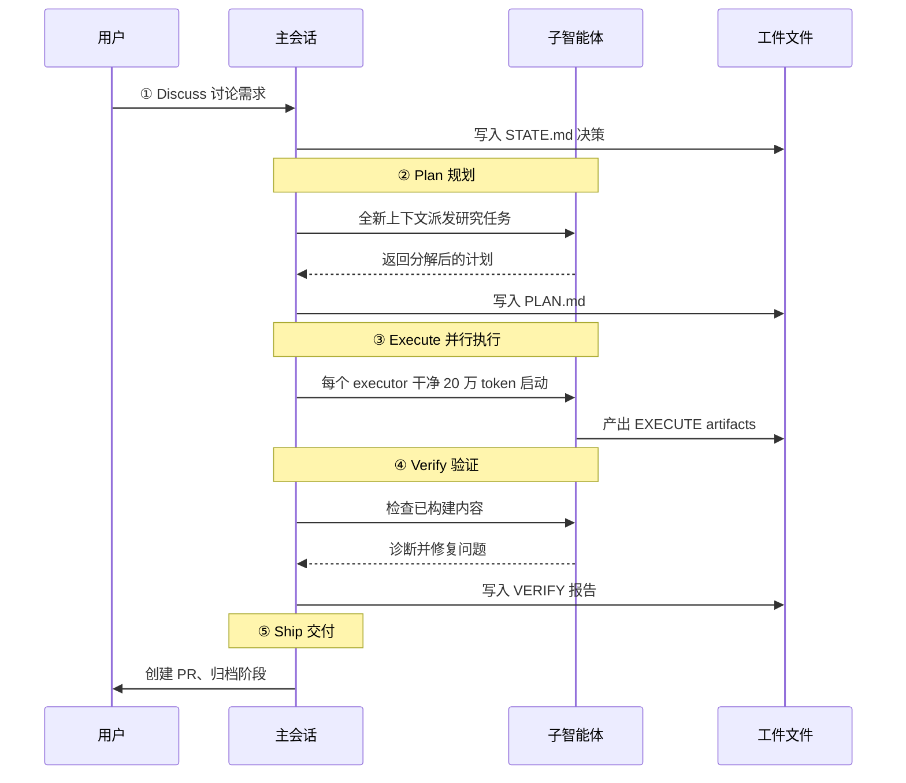
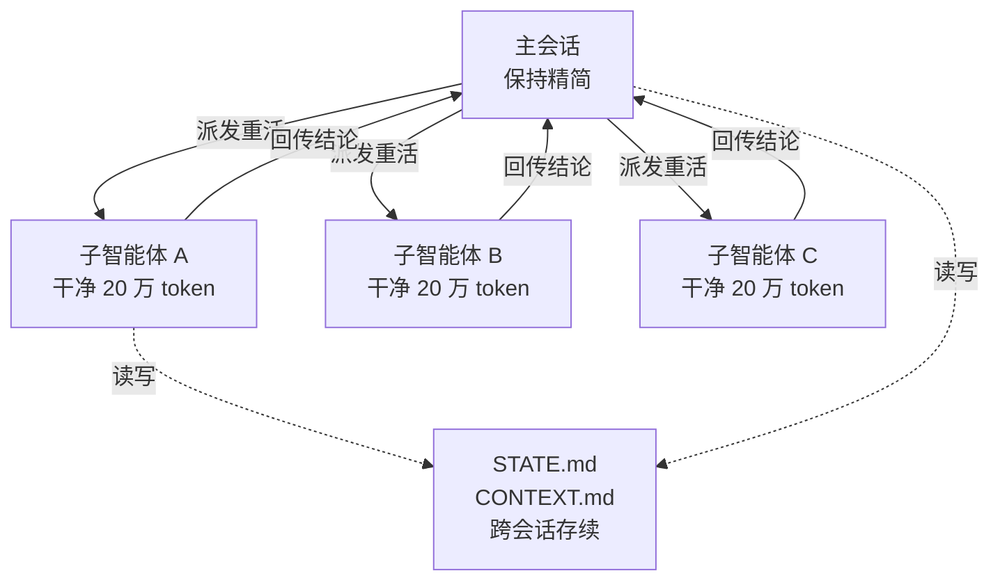
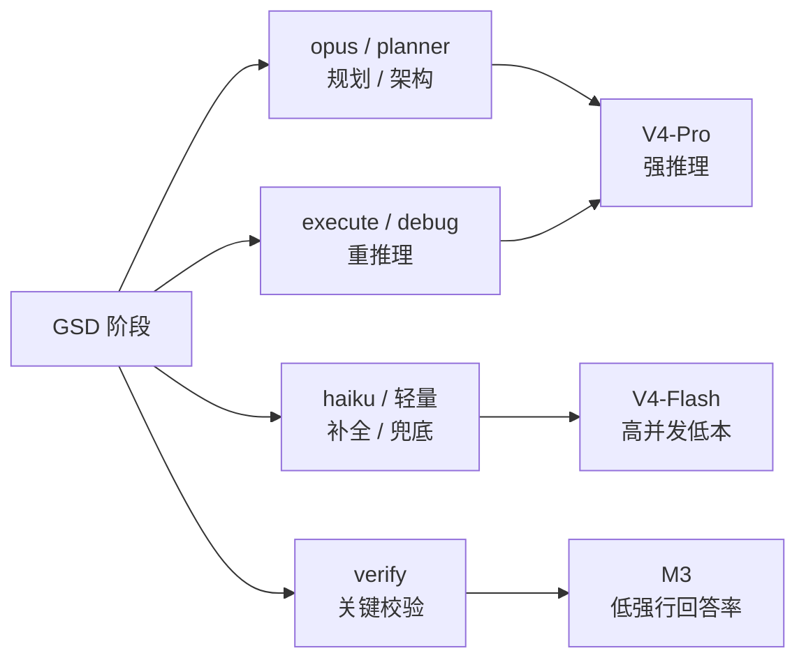
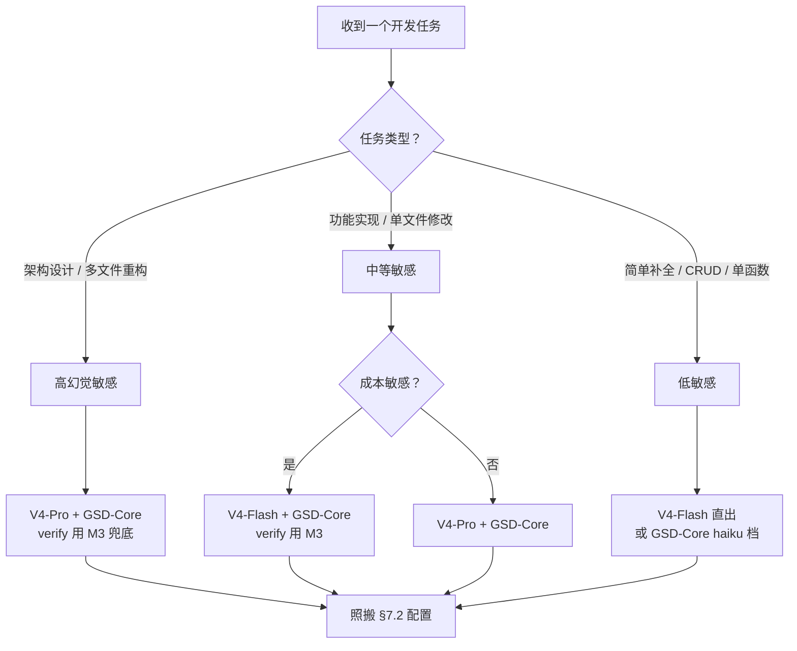

# DeepSeek V4 Flash 结合 GSD-Core 工作流：幻觉率与 Claude Code 开发胜任力调研报告（第 2 版）

> 本文是一份面向"要不要用 DeepSeek V4 Flash 接 Claude Code、靠 GSD-Core 工作流压幻觉"这一决策的实战调研报告。写作顺序遵循 **先结论 → 可抄配置 → 原理 → 决策树 → 排错 FAQ** 的教程风格，不是原理参考书。读者可以直接跳到 §7 抄配置、跳到 §9 做选型。
>
> **第 2 版更新（2026-06-24）**：通过 DeepWiki 深入 GSD-Core 源码，大幅扩充了 §3 GSD-Core 工作机制（新增 3.4 专业 Agent 系统、3.5 Model Profiles 分层模型配置、3.6 Wave-Based 并行执行与 Workspace 隔离、3.7 Hook 系统与 CLI 工具），同时对 §5 和 §7 做了相应增强。

---

## 1. 一句话定论

先给你 4 句话的结论，剩下的章节都是在论证它。

| 你的疑问 | 一句话结论 |
|---------|-----------|
| **V4 Flash 是什么？** | 284B 总参 / 激活 13B / **1M 上下文**的效率型 MoE 模型，提供 **Anthropic 兼容接口**，可零适配接入 Claude Code；定位"即时模式"，主打轻量、经济、高频。 |
| **GSD-Core 工作流是什么？** | 一个**不绑定单一工具**的元提示 + 上下文工程框架，靠五步循环（Discuss→Plan→Execute→Verify→Ship）和 **fresh-context 子智能体**机制专治"上下文腐化（Context Rot）"；**内置 33 个专业 agent**，支持 5 种模型配置策略和动态路由升级。 |
| **"96% 幻觉率"真相？** | 这个数字是 **AA-Omniscience 的强行回答率（attempt rate）**——模型不确定时"硬答"而非"承认不会"的概率，**不是"回答错误率"**。懂的问题上准确率正常，短板在于它不懂时几乎从不拒绝。 |
| **能否胜任 Claude Code 开发？** | **单独靠 Flash 扛重活有风险；正解是混合配置**——V4-Pro 主攻规划/debug、V4-Flash 兜底轻量任务、低强行回答率模型（如 M3）守 Verify 关键节点，再用 GSD-Core 的强制校验闭环兜底。 |

一句话总纲：**最优解不是"V4 Flash 单独使用"，而是"V4 Flash + GSD-Core + 混合配置"。**

---

## 2. DeepSeek V4 Flash 技术画像

先看"档案卡"，5 分钟建立技术认知。

### 2.1 参数与架构

DeepSeek V4 Flash 是 2026 年 4 月随 V4 系列预览版发布的开源模型，MIT 协议全量开源。核心硬指标：

- **架构**：MoE（混合专家）+ 混合注意力（CSA 稀疏注意力 + HCA 层次注意力），mxFP4 训练精度
- **总参数**：284B
- **激活参数**：**13B/token**（单次推理只激活一小部分专家，这是"大而省"的关键）
- **预训练数据**：32T token
- **上下文窗口**：**1M token（百万）**，V4 全系标配
- **最大输出**：384K token
- **效率**：推理 FLOPs 仅为 V4-Pro 的 **27%**，KV Cache 占用仅 **10%**——同等算力能跑更多任务
- **记忆架构**：Engram Memory，把长上下文压缩成可学习的长期记忆，缓解传统长上下文的性能衰减

> 一句话理解：Flash 是"用 13B 的推理成本，调动 284B 的知识储备"。它省的是**算力**，不是**知识**。

### 2.2 V4-Flash vs V4-Pro 对照表

| 维度 | V4-Pro | V4-Flash |
|------|--------|----------|
| 总参数 | 1.6T | 284B |
| 激活参数 | 49B/token | **13B/token** |
| 预训练数据 | 33T token | 32T token |
| 上下文窗口 | 1M | 1M |
| 最大输出 | 384K | 384K |
| 推理 FLOPs | 基准 | **仅 27%** |
| KV Cache 占用 | 基准 | **仅 10%** |
| 并发上限 | 500 | **2500** |
| 定位 | 极致性能 | 高效 / 即时模式 |
| 开源协议 | MIT | MIT |
| 接口 | OpenAI + Anthropic | OpenAI + Anthropic |

读法：Pro 是"性能优先"（参数堆满、激活也大），Flash 是"效率优先"（参数够用、激活压到最低、并发开到 5 倍）。两者**预训练数据量几乎相同（32T vs 33T）**，所以"知道的东西"差距不大，差距在"推理深度"上。

### 2.3 接口与定位

V4 Flash 同时提供两套接口，这是它能低成本接入 Claude Code 的关键：

- **OpenAI 格式**：`https://api.deepseek.com`（标准 ChatCompletions）
- **Anthropic 兼容格式**：`https://api.deepseek.com/anthropic`（Claude Code 原生对接，无需适配层）

> 据 DeepSeek 官方定价页（[api-docs.deepseek.com](https://api-docs.deepseek.com/quick_start/pricing)）确认，`deepseek-chat` 与 `deepseek-reasoner` 旧模型名将于 **2026/07/24** 弃用，分别对应 V4-Flash 的非思考模式与思考模式。

**定位**：官方 Chat 界面称其为"即时模式（Instant Mode）"——轻量、经济、高频调用。官方说法是"在简单 Agent 任务上与 Pro 表现接近"。

**cURL 调用示例（双接口）**：

```bash
# 方式一：Anthropic 兼容接口（Claude Code 走这条）
curl https://api.deepseek.com/anthropic/v1/messages \
  -H "x-api-key: $DEEPSEEK_API_KEY" \
  -H "anthropic-version: 2023-06-01" \
  -H "content-type: application/json" \
  -d '{
    "model": "deepseek-v4-flash",
    "max_tokens": 1024,
    "messages": [{"role": "user", "content": "用 Java 17 写一个通用的分页 Result 封装"}]
  }'

# 方式二：OpenAI 格式（其他工具走这条）
curl https://api.deepseek.com/v1/chat/completions \
  -H "Authorization: Bearer $DEEPSEEK_API_KEY" \
  -H "content-type: application/json" \
  -d '{
    "model": "deepseek-v4-flash",
    "messages": [{"role": "user", "content": "解释 MoE 架构为什么省算力"}]
  }'
```

---

## 3. GSD-Core 工作流机制

用"问题 → 方案 → 机制"三段式讲清 GSD-Core 到底在干什么。第 2 版大幅扩充了 §3.4~§3.7，新增 GSD-Core 的专业 Agent 系统、模型配置体系、并行执行和工作空间隔离等深度内容。

### 3.1 痛点：Context Rot（上下文腐化）

GSD-Core 要解决的核心痛点叫 **Context Rot（上下文腐化）**：随着 AI 在一个会话里不断填满上下文窗口，输出质量会**悄无声息地下降**。你感觉不到，但模型已经在"半对半错"地飘。

这不是个别现象。长会话里常见的三种腐烂：

- **上下文膨胀**：越聊越长，关键信息被稀释，模型抓不住重点
- **无共享记忆**：开新会话等于失忆，上次讨论的架构决策全丢
- **无验证机制**：模型"自以为做完了"，没人检查，错误一路带到最后

GSD-Core 作者 TÂCHES 把它定位成"元提示 + 上下文工程"框架，本质上是在**用工程手段对抗这三个腐烂**。

### 3.2 五步阶段循环（Phase Loop）

GSD-Core 把每个 milestone（里程碑）切成五步循环：



五步各自的作用：

| 步骤 | 做什么 | 对抗哪个腐烂 |
|------|--------|-------------|
| ① Discuss | 捕获实现决策 | 无共享记忆 |
| ② Plan | 研究、分解、在**全新上下文窗口**里验证计划 | 上下文膨胀 |
| ③ Execute | 并行波次跑计划，**每个 executor 以干净 20 万 token 启动** | 上下文膨胀 |
| ④ Verify | 检查已构建内容，**宣告完成前诊断并修复** | 无验证机制 |
| ⑤ Ship | 创建 PR、归档阶段 | 无共享记忆 |

**完整的 .planning/ 目录结构**——所有跨会话状态持久化的地方：

```
.planning/
├── PROJECT.md         # 项目身份、核心价值、需求
├── ROADMAP.md         # 里程碑和阶段序列
├── REQUIREMENTS.md    # 编号验收标准
├── STATE.md           # 项目状态活页：当前位置、活跃决策、阻塞项
├── config.json        # 工作流和模型配置
├── phases/            # 阶段目录
│   └── <NN>-<slug>/
│       ├── <NN>-CONTEXT.md
│       ├── <NN>-RESEARCH.md
│       ├── <NN>-<PP>-PLAN.md
│       ├── <NN>-<PP>-SUMMARY.md
│       └── <NN>-VERIFICATION.md
├── intel/             # 查询式的代码库知识库
└── research/          # 初始调研产出
```

### 3.3 核心机制：Fresh-Context 与结构化工件

GSD-Core 最关键的设计是 **fresh-context subagent（全新上下文子智能体）**：



核心思想：**重活（研究、规划、执行）全部在全新的子智能体里跑，主会话只做协调，保持精简。** 这样即使某个子智能体被它的任务撑爆，污染也不会扩散回主会话。

而跨会话的记忆，不靠"上下文窗口续命"，而是靠**结构化工件**：

- `STATE.md`：当前项目状态、已完成/进行中的阶段——**任何 workflow 或 agent 先读它定向，完成后回写更新**
- `CONTEXT.md`：关键架构决策、约定、背景——plan/executor/verifier 都能读，确保一致性

这两个文件**持久化在磁盘上**，开新会话时模型重新读它们，等于把"记忆"从易腐烂的上下文窗口，挪到了稳定的文件系统。这是 GSD-Core 与"普通 agent"最本质的区别。

> 据 GSD-Core 官方 README（[github.com/open-gsd/gsd-core](https://github.com/open-gsd/gsd-core)，MIT 协议、数万 Star），它支持 Claude Code、OpenCode、Gemini CLI、Codex、Copilot、Cursor、Windsurf 等 **15+ 运行时**，不绑定单一工具——这也是它能和 V4 Flash 组合的前提。

### 3.4 专业 Agent 系统

GSD-Core 内置 **34 个专业 agent**（21 个主代理 + 13 个高级代理），按职能分类。这是它与普通 meta-prompting 框架最本质的区别——不是"一个 agent 干所有事"，而是"一个精密的代理分工体系"。

#### 3.4.1 Agent 分类总览

| 类别 | 代理数量 | 核心职责 |
|------|---------|---------|
| **调研（Research）** | 6 | 项目/阶段/决策的域调研与综合 |
| **规划（Planning）** | 4 | 创建可执行计划 + 路线图 + 质量检查 |
| **执行（Execution）** | 2 | 代码执行与修复 |
| **验证（Verification）** | 5 | 阶段/集成/文档/测试缺口的验证 |
| **调试（Debugging）** | 2 | 科学方法调试与全周期管理 |
| **代码审查（Code Review）** | 2 | 代码库探索与源码审查 |
| **UI/UX** | 3 | UI 方案调研、设计合同验证、视觉审核 |
| **文档（Documentation）** | 3 | 文档创建/更新、分类、合成 |
| **智能与知识（Intelligence）** | 2 | 情报文件写入、记忆宫殿 |
| **安全与质量（Security/Quality）** | 2 | 威胁缓解验证、模式映射 |
| **用户画像（Profiling）** | 1 | 开发者行为评分 |
| **框架选择（Framework）** | 1 | AI/LLM 框架交互式评分 |

#### 3.4.2 核心代理详解

以下是你与 GSD-Core 交互时最常遇到的代理（按工作流顺序）：

| 代理 | 触发时机 | 详细职责 |
|------|---------|---------|
| **gsd-project-researcher** | `/gsd-new-project` | 调研项目域生态（技术栈/功能/架构/陷阱），产出 STACK.md/FEATURES.md/ARCHITECTURE.md/PITFALLS.md |
| **gsd-phase-researcher** | `/gsd-plan-phase` | 调研具体阶段的实现方案，产出 {phase}-RESEARCH.md |
| **gsd-advisor-researcher** | discuss-phase | 针对"灰色地带"的单一决策深入调研，输出结构化对比表 |
| **gsd-research-synthesizer** | 多路调研后 | 合并并行调研结果为 SUMMARY.md |
| **gsd-planner** | `/gsd-plan-phase` | 创建可执行阶段计划：任务分解、依赖分析、目标反向验证；产出 {phase}-{N}-PLAN.md |
| **gsd-plan-checker** | plan 后 | 8 维度验证计划质量，阻截执行阶段阻塞 |
| **gsd-executor** | `/gsd-execute-phase` | 执行 GSD 计划，原子提交，处理偏差；**每个 executor 在独立 git worktree 中以 fresh-context 运行** |
| **gsd-verifier** | 执行后 | 目标反向验证阶段达成，产出 VERIFICATION.md |
| **gsd-integration-checker** | 跨阶段 | 验证跨阶段集成和端到端流程 |
| **gsd-debugger** | `/gsd-debug` | 科学方法调试，带持久化状态（跨上下文重置依然保持） |
| **gsd-code-reviewer** | 代码审查 | 审查源码中的 bug/安全/代码质量问题，产出 REVIEW.md |
| **gsd-code-fixer** | review 后 | 根据 REVIEW.md 自动修复问题，每项修复独立原子提交 |
| **gsd-codebase-mapper** | 探索阶段 | 探索代码库，写结构化分析文档（技术/架构/质量/关注点） |
| **gsd-ui-researcher** | UI 设计 | 调研 UI 实现方案 |
| **gsd-doc-writer** | 文档 | 创建/更新/补充/修复各类项目文档 |
| **gsd-doc-verifier** | 文档后 | 验证文档中的事实声明，可向 doc-writer 返回失败项 |
| **gsd-security-auditor** | 安全 | 验证 PLAN.md 威胁模型中的缓解措施 |
| **gsd-pattern-mapper** | 新文件 | 将新文件映射到最相似的已有文件，写 PATTERNS.md 供 planner 参考 |
| **gsd-user-profiler** | 行为分析 | 8 维度（沟通风格/决策模式/学习习惯等）分析并输出开发者画像 |

#### 3.4.3 "薄协调器"设计模式

GSD-Core 不直接在 workflow 文件里写死推理逻辑，而是用**薄协调器**模式：

```
workflow: /gsd-plan-phase
  ├── spawn gsd-phase-researcher   → RESEARCH.md
  ├── spawn gsd-planner            → PLAN.md
  └── spawn gsd-plan-checker       → 质量门控
```

每个 workflow 文件只做三件事：**加载上下文 → 派发 agent → 收集结果更新状态**。agent 本身不依赖上游会话的上下文"记忆"，而是靠文件 artifacts 交接——上一阶段写的 PLAN.md 就是下一阶段的输入。这让每个 agent 的上下文始终保持干净。

### 3.5 Model Profiles 与分层模型配置

GSD-Core 提供了一套精密的模型选择体系，这也是它与 V4 Flash 混合配置天然对榫的关键。

#### 3.5.1 5 种预定义 Profile

| Profile | 风格 | opus（重推理） | sonnet（中等） | haiku（轻量） | 适用场景 |
|---------|------|---------------|---------------|-------------|---------|
| quality | 最大化推理 | 决策代理 | 只读验证 | — | 关键项目，不关心成本 |
| **balanced** | 智能分配（默认） | 规划 | 执行/调研/验证 | — | 日常开发最佳平衡 |
| budget | 最小化 Opus | 最小 | 编码 | 调研/验证 | 个人/小团队降本 |
| **adaptive** | 按角色优化 | 规划/debug | 执行/调研/验证 | 映射/检查/审计 | 按代理角色精准分层 |
| inherit | 跟随会话模型 | — | — | — | 非 Anthropic provider 必须 |

#### 3.5.2 Model Tiers 跨运行时映射

GSD 的 opus/sonnet/haiku 三个档位映射到具体模型：

| 运行时 | opus | sonnet | haiku |
|--------|------|--------|-------|
| claude | claude-opus-4-8 | claude-sonnet-4-6 | claude-haiku-4-5 |
| codex | gpt-5.5 | gpt-5.4 | gpt-5.4-mini |
| gemini | gemini-3.1-pro-preview | gemini-3-flash | gemini-2.5-flash-lite |
| **V4 接入（实践）** | **V4-Pro** | **V4-Flash** | **V4-Flash** |

#### 3.5.3 配置优先级层级

模型配置有清晰的优先级，从高到低：

```
1. model_overrides[<agent>]      ← 最精确：指定某个 agent 用特定模型
2. dynamic_routing.tier_models   ← 动态路由：失败时自动升级模型
3. models[<phase_type>]          ← 阶段级：按 planning/research/execution 等分组
4. model_profile                 ← 全局策略：quality/balanced/budget/adaptive
5. Runtime default               ← 回退
```

**层级示例**——如果你想整体用 `adaptive`，但强制 `gsd-codebase-mapper` 用最便宜的 haiku，同时 research 阶段全部走 sonnet：

```json
{
  "model_profile": "adaptive",
  "models": {
    "research": "sonnet",
    "planning": "opus",
    "verification": "sonnet"
  },
  "model_overrides": {
    "gsd-codebase-mapper": "haiku"
  }
}
```

#### 3.5.4 Dynamic Routing（动态路由）

启用后，agent 从低成本模型开始，软失败时自动升级：

```json
{
  "dynamic_routing": {
    "enabled": true,
    "tier_models": {
      "light": "haiku",
      "standard": "sonnet",
      "heavy": "opus"
    },
    "escalate_on_failure": true,
    "max_escalations": 1
  }
}
```

**工作流程**：orchestrator 派发 agent → 解析器返回 tier_models[default_tier] → 检测到软失败（验证不确定）→ 重新派发到 next_tier_up → `max_escalations` 封顶 → 硬失败直接抛出。

这个机制对 V4 Flash 特别有价值：**轻量任务用 Flash（haiku 级）起步，真的不够再升级到 V4-Pro（opus 级）**，而不是一开始就上最贵的模型。

### 3.6 Wave-Based 并行执行与 Workspace 隔离

#### 3.6.1 Wave 依赖分组

Execute 阶段不是顺序执行 plan，而是将 plan 按依赖关系分组为 **wave**：

```
Wave 1: Plan01（无依赖） + Plan02（无依赖）     → 并行执行
                ↓ 等待 Wave 1 全部完成并合并
Wave 2: Plan03（依赖 Plan01） + Plan04（依赖 Plan02） → 并行执行
                ↓ 等待 Wave 2 全部完成
Wave 3: Plan05（依赖 Plan03 + Plan04） → 单独执行
```

**同 wave 内的每个 executor** 都以 fresh-context（最大 200K token）启动，只携带以下信息：项目摘要、阶段上下文、调研结果、自己的 PLAN.md。

#### 3.6.2 Git Worktree 隔离

同一 wave 内并行执行的多个 executor，GSD 用 **git worktrees** 隔离它们的工作目录——每个 executor 在自己的隔离副本中修改文件，提交后由 orchestrator 合并。这种隔离机制防止了并行冲突：

- 并行 agent 提交时使用 `--no-verify`（orchestrator 在 wave 结束后统一跑 `git hook run pre-commit`）
- `STATE.md.lock` 文件锁防止多个 agent 同时读写状态导致竞态条件
- 每个 executor 原子提交，wave 合并时 orchestrator 只取已完成的提交

#### 3.6.3 Workspace 管理

Workspace 用于隔离实验性或有风险的变更：

- **创建**：`/gsd-workspace --new`
- **列出**：`/gsd-workspace --list`
- **删除**：`/gsd-workspace --remove`

每个 workspace 有独立的 `.planning/` 目录，使用 git worktree 或 clone 隔离。适合多仓库项目、同一仓库内不同特性线的并行开发，或者你想先试 V4-Flash，不行再切回 V4-Pro 的场景。

### 3.7 Hook 系统与 CLI 工具

#### 3.7.1 Runtime Hooks

不同 AI 运行时暴露的生命周期事件不同，但 GSD 统一适配：

| 运行时 | 事件 | 触发时机 |
|--------|------|---------|
| Claude Code | PreCompact / Stop / SubagentStop | 上下文压缩前 / 停止 / 子 agent 停止 |
| Gemini | BeforeAgent / AfterAgent / BeforeModel | agent 前后 / 模型调用前 |
| 通用 | FileChanged | 检测到 config.json 变化时热重载 |

**FileChanged 事件特别有用**：你可以在 Claude Code 运行过程中修改 `.planning/config.json` 中的模型配置，GSD 会自动加载新配置，无需重启会话。

#### 3.7.2 gsd-tools CLI 后端

`gsd-tools.cjs` 是 GSD-Core 的命令行核心，约 20 个领域模块：

| 功能域 | 命令 | 说明 |
|--------|------|------|
| **State** | `gsd-tools state load` | 加载完整项目配置和状态 |
| | `gsd-tools state json` | 输出 STATE.md frontmatter 为 JSON |
| | `gsd-tools state update` | 更新单个字段 |
| | `gsd-tools state get` | 获取内容或章节 |
| | `gsd-tools state patch` | 批量更新多个字段 |
| **Phase** | `gsd-tools phase add` | 添加新阶段 |
| | `gsd-tools phase insert` | 插入小数阶段（紧急任务） |
| | `gsd-tools phase remove` | 移除阶段 |
| | `gsd-tools phase complete` | 完成阶段（同步更新 state 和 roadmap） |
| **Roadmap** | `gsd-tools roadmap get-phase` | 获取 ROADMAP.md 中的阶段章节 |
| | `gsd-tools roadmap analyze` | 分析完整路线图 |
| | `gsd-tools roadmap validate` | 验证阶段 ID 命名合规 |

---

## 4. 幻觉率真相（核心章节）

> 这一章是全文最重要的。社区流传"DeepSeek V4 幻觉率 94%/96% 是暗雷"，**这个说法对了一半，也错了一半**。错的那一半，恰恰是做选型决策时最致命的误读。

### 4.1 历史背景：R1/V3 幻觉数据

先看一组历史数据打底（注意：这是上一代 R1/V3，**不是 V4**，仅作背景参照）。

据 Vectara 的 HHEM（Hallucination Evaluation Model）评测：

| 模型 | 幻觉率（HHEM） | 说明 |
|------|---------------|------|
| DeepSeek-R1 | **14.3%** | 推理增强模型 |
| DeepSeek-V3 | **3.9%** | 通用模型 |

这里有个反直觉的发现：**推理能力更强的 R1，幻觉率反而比 V3 高近 4 倍**。业界戏称这是"文采飞扬的代价"——推理增强让模型更敢"展开"和"补全"，代价是更容易编造细节。李彦宏也曾公开批评 DeepSeek"幻觉率较高"，主要指的就是这个现象。

这条历史经验直接投射到 V4：**思考模式（thinking mode）默认开启，这意味着 V4 继承了"敢展开"的倾向**。

### 4.2 V4 Flash "96%" 的真实含义

现在说关键的。

社区（如 ZPedia 的《一文读懂 V4》标题点明"94% 幻觉率是暗雷"）流传的"V4 Flash 幻觉率 96%"，**需要严格澄清其含义**：

**这个数字来自 Artificial Analysis 的 AA-Omniscience 基准，衡量的是"强行回答率（attempt rate / hallucination rate）"——即模型面对不确定的问题时，选择"硬编一个答案"而非"承认不知道"的概率。**

它**不是**"回答错误率"。

| 指标 | 含义 | 是否 = "96%" |
|------|------|-------------|
| **强行回答率（Attempt Rate）** | 不确定时硬答的概率 | ✅ 就是这个 |
| 回答错误率（Error Rate） | 答出来的内容里错的比例 | ❌ 不是 |
| 事实准确率（Accuracy） | 在它声称知道的领域答对的比例 | ❌ 不是 |

**直白解读**：V4 Flash 在它**真正懂**的问题上，准确率是正常的；问题出在它**不懂**的问题上——它几乎从不承认"我不知道"，而是自信地编一个。

> 据 Artificial Analysis 平台口径（artificialanalysis.ai），AA-Omniscience 的 Non-Hallucination Rate 是个会让所有模型都"难看"的指标——例如同一口径下 GPT-5.5 的幻觉率约 86%、Claude Opus 4.7 约 36%。这个指标刻意用高难度的"全知性"问题施压，**它的绝对值没有跨厂商横向可比的统一标准**，更适合看相对排序，而非把"96%"当成"96% 的回答是错的"。
>
> 提示：AA-Omniscience 的精确基准定义（attempt rate 的计算口径、问题集构成）以官方白皮书为准；本文对"96% = 强行回答率"的解读基于社区横评文档的交叉印证，verify 阶段建议复核原始基准。

**所以"96% 是暗雷"这个说法**：

- ✅ 对的那半：V4 Flash 确实有"不懂也敢硬答"的显著倾向，在需要可靠性的场景是真问题
- ❌ 错的那半：不能解读成"V4 Flash 96% 的输出都是错的"——这是误读，会让人错误地全盘否定它

**一个类比帮你记住**：把强行回答率想象成"答题态度"，把错误率想象成"答错比例"。V4 Flash 是那种"老师问什么都举手、不懂也瞎编一个"的学生——它的**态度分**很低（96% 都在硬答），但这**不等于**它答出来的 96% 都是错的。它真正会的题，照样能答对；它不会的题，M3 会说"我不知道"，它会硬编。

**怎么自测你的任务会不会触发硬答？** 给 Flash 一个它大概率不知道的问题（比如你私有项目里某个内部类的某个方法签名），看它是：

- 诚实回答"我没有这个信息" → 低风险任务，Flash 放心用
- 自信编一个看似合理的方法名 → 高强行回答率已触发，**这类任务的 verify 不能交给 Flash**

### 4.3 对照 M3 16.1%：强行回答率差异

把几个模型放一起看强行回答率，差异触目惊心：

| 模型 | 强行回答率 | 数据源 | 行为倾向 |
|------|-----------|--------|---------|
| DeepSeek V4-Flash | ~96% | AA-Omniscience | **不懂也硬答**（编造） |
| DeepSeek V4-Pro | 待核实（定性优于 Flash） | — | 略好 |
| MiniMax M3 | **16.1%** | AA-Omniscience | **倾向拒绝而非编造** |
| DeepSeek-R1（历史） | 14.3%（HHEM） | Vectara | 仅背景参照 |
| DeepSeek-V3（历史） | 3.9%（HHEM） | Vectara | 仅背景参照 |

> 注意：V4 Flash 的"96%"（AA-Omniscience 口径）与 R1/V3 的"14.3%/3.9%"（Vectara HHEM 口径）**不是同一套基准**，不能直接横比绝对值。能比的是：**在同一 AA-Omniscience 口径下，M3（16.1%）远低于 V4 Flash（~96%）**——这是可靠结论。

读法：**M3 更"诚实"**——它不确定时会拒绝回答，AA-Omniscience 因此给它高分。V4 Flash 更"自信"——什么都敢接，代价是接不住的时候会编。

### 4.4 对开发场景的真实危害

高强行回答率，在开发场景里具体表现为模型会**自信地编造**：

- **不存在的 API 签名**：编一个看起来合理但根本不存在的方法
- **虚构的库函数**：把别处见过的命名套到当前库上
- **臆造的配置项**：编一个属性名，配上看似合理的默认值
- **版本张冠李戴**：把旧版 API 当新版用，或反之

在 **GSD 长链任务中危害会被放大**：一次编造的 API 签名，会让后续 N 步全部建立在错误前提上——第 3 步的实现基于第 2 步编的接口，第 2 步又依赖第 1 步编的库……错误像雪球一样滚。

这也是为什么 V4 综合评分里，"幻觉控制 8.0（仍需改进）"被普遍认为是它最公认的短板——据海外评测（OpenRouter 数据），V4 智能体任务虽开源第一，但伴随"幻觉率上升、Token 消耗大"的两个副作用。

---

## 5. GSD-Core 如何对症缓解幻觉

把"V4 Flash + GSD-Core"放在显微镜下看：这个工作流正好对症高强行回答率。三大机制逐一分析。

### 5.1 Verify 阶段：强制校验闭环

GSD-Core 的 **Verify 步骤**要求"在宣告完成前，诊断并修复问题"——这正是高强行回答率模型最需要的东西。

为什么？因为"强行回答"的本质是**模型缺乏自我怀疑机制**。它编了一个 API，自己看着挺合理，就交付了。要治这个病，单靠它自己不行，需要**外部校验**：

- 让它"自我怀疑"（prompt 里要求交叉检查）
- 用**外部工具验证**（跑测试、跑编译、grep 实际 API 签名）
- 用**更低强行回答率的模型复核**（如 M3）

这三者结合，就是抑制幻觉的最佳搭配。GSD-Core 的 Verify 把"外部校验"从"可选"变成"必选"——这是它对 V4 Flash 最大的价值。

**一个可直接抄的 Verify prompt 模板**（用于在 GSD Verify 阶段压制 Flash 的硬答倾向）：

```text
你是 Verify 角色。对上面的实现做对抗性审查，遵守：
1. 逐一列出所有被调用的外部 API / 库函数，并标注"已验证存在"或"未验证"。
2. 对每个"未验证"项，不要猜测，直接标红。
3. 跑一遍编译/测试，把失败项与代码关联起来。
4. 如果某处你不确定，回答"我不确定，需人工确认"——禁止编造。
输出格式：✅ 通过项 / ⚠️ 待确认项 / ❌ 失败项 三栏。
```

这个模板的核心是第 4 条——**显式授权模型"可以承认不知道"**，正好对冲 V4 Flash 默认的硬答倾向。配合 M3 作为 Verify 模型，效果叠加。

### 5.2 Fresh-Context：减少长链累积漂移

前面说过，长链任务里错误会"滚雪球"。GSD-Core 的 fresh-context 机制从两个层面缓解：

- **拆解到干净上下文**：复杂任务被切成小块，每块在一个干净的 20 万 token 子智能体里跑。一个子智能体编了东西，污染被限制在它自己的上下文里，回传主会话的是"结论"而非"全部推理过程"
- **强制重新加载工件**：每个 executor 启动时读 `STATE.md`/`CONTEXT.md`，等于"重新对齐事实"，而不是接着上一个可能已经飘掉的上下文继续飘

效果：长链漂移从"指数级累积"被压成"局部可控"。

### 5.3 混合配置：分摊风险到不同模型档位

这是最核心的策略——**不同阶段用不同幻觉率的模型**，让每个模型只干它擅长的活：

| 任务性质 | 选什么模型 | 为什么 |
|---------|-----------|--------|
| 重推理 / 规划 / debug | 幻觉率更低的 V4-Pro 或 M3 | 这些环节编一个就全盘崩，必须可靠 |
| 简单任务 / 兜底补全 | V4-Flash | 接受它的高强行回答率，因为后果不严重 |
| 关键 Verify 节点 | M3 等低强行回答率模型 | 守门员，必须"诚实" |

逻辑很朴素：**让"诚实"的模型守关键节点，让"高效"的模型跑量大面广的轻活。** 这比"全场用同一个模型"或"全场用最贵的模型"都更合理。

GSD-Core 的 **adaptive profile** 天然支持这个策略——它在 GSD 的 agent 级别做了类似的模型分层（opus 用于规划/debug、sonnet 用于执行/验证、haiku 用于映射/审计）。你可以把 GSD 的 model profile 和 V4 的混合配置叠加使用，在 agent 级别精确控制每个环节的幻觉容忍度，而不仅仅是在 Claude Code 全局层面切模型。

---

## 6. Claude Code 开发胜任力评估

从 4 个角度评估 V4 + Claude Code 的实际生产力，而不只是看纸面参数。

### 6.1 编码 Benchmark 实测

汇总几个公开评测的数据点：

| 评测 | V4 成绩 | 备注 |
|------|---------|------|
| Artificial Analysis Intelligence Index（AII） | Pro 52 / Flash 47 分 | Pro 开源第二（仅次于 Kimi K2.6）；Flash 对标 Claude Sonnet 4.6 |
| Arena.ai 代码竞技场 | 开源第 3、综合第 14 | 思考模式 |
| Vals AI Vibe Code Benchmark | 开源权重第一 | 超越 Kimi K2.6、Gemini 3.1 Pro；综合指数第 2 |
| SWE-bench（Pro） | ≈ 83.7% | 官方称超越 GPT-5.2、Claude Opus 4.5；**单一聚合源，待核实** |

> 提示：SWE-bench 83.7% 来自单一聚合源，verify 阶段建议交叉核对官方技术报告，暂以"官方宣称"口径引用，不当作独立复现结论。

读法：**V4 在开源阵营里是第一梯队**，代码能力是它的强项。短板不在"会不会写代码"，而在"写得对不对、编不编"（幻觉）和"会不会规划复杂任务"（深度推理）。

### 6.2 Anthropic 接口零成本接入

V4 提供 `https://api.deepseek.com/anthropic` 端点，Claude Code 改 `settings.json` 即可切换，**不需要任何适配层**。这是工程上最关键的"解锁"——没有这个，接入成本会高一个数量级。

**基础 settings.json 配置（单模型，V4-Pro 主力）**：

```json
{
  "env": {
    "ANTHROPIC_BASE_URL": "https://api.deepseek.com/anthropic",
    "ANTHROPIC_API_KEY": "sk-你的-deepseek-key",
    "ANTHROPIC_MODEL": "deepseek-v4-pro",
    "ANTHROPIC_DEFAULT_HAIKU_MODEL": "deepseek-v4-flash"
  }
}
```

关键字段说明：

| 字段 | 作用 | 推荐值 |
|------|------|--------|
| `ANTHROPIC_BASE_URL` | 接口地址，**必须带 `/anthropic`** | `https://api.deepseek.com/anthropic` |
| `ANTHROPIC_API_KEY` | DeepSeek 的 API Key | `sk-...`（DeepSeek 平台获取） |
| `ANTHROPIC_MODEL` | 主力模型 | `deepseek-v4-pro` 或 `deepseek-v4-flash` |
| `ANTHROPIC_DEFAULT_HAIKU_MODEL` | 轻量任务/haiku 兜底模型 | `deepseek-v4-flash` |

### 6.3 实战案例

引用两个一手实测（中文技术社区）：

**案例一：JavaGuide 7000 字实测**

据 JavaGuide 的实测（[cnblogs.com/javaguide/p/19929436](https://www.cnblogs.com/javaguide/p/19929436)），接近 7000 字详细记录了 V4-Pro 实战 + V4-Flash API 对接 Claude Code 的完整过程，包含 settings.json 配置。结论是 V4 的 Anthropic 兼容接口可以直接用，无需适配层。

**案例二：JeecgBoot 5 大场景评测**

据 JeecgBoot 的评测（[cnblogs.com/jeecg158/p/19925771](https://www.cnblogs.com/jeecg158/p/19925771)），用"重任务走 V4-Pro、轻任务走 V4-Flash"的策略，跑完了 OA 审批、BI 大屏、报表、部署等 5 大场景，原结论是"除了贵没毛病"——而 2026-05 永久降价后，"贵"这个槽点也已基本消除。

两个案例的共同结论：**V4 接 Claude Code 可用、可落地，关键是分档使用。**

### 6.4 成本与封号规避

**定价（据 DeepSeek 官方定价页，美元/百万 token）**：

| 模型 | 输入（缓存命中） | 输入（未命中） | 输出 |
|------|----------------|--------------|------|
| V4-Flash | $0.0028 | $0.14 | **$0.28** |
| V4-Pro | $0.0036 | $0.435 | **$0.87** |
| 对照 Claude Opus 4.7 | — | — | ≈$15 |

> 据腾讯新闻报道，2026-05-31 优惠结束后 V4-Pro 永久锁定原价的 1/4，被称为全球主流大模型 API 价格最低之一。人民币口径约：V4-Flash 输出 2 元、V4-Pro 输出 6 元/百万 token。

**两个关键附加价值**：

1. **规避 Claude 封号焦虑**：V4 是第三方服务，与 Claude 账号体系独立，重度 Claude Code 用户不再担心"哪天号没了"
2. **缓存命中极便宜**：输入缓存命中价是未命中价的 **1/50**（Flash：$0.0028 vs $0.14），命中率高时成本极低

> 提示：DeepSeek 官方声明"价格可能调整，建议定期查看定价页"。本文定价基于 2026-06 抓取的官方页面，verify/使用时请以 [api-docs.deepseek.com](https://api-docs.deepseek.com/quick_start/pricing) 最新值为准。

---

## 7. 混合配置实战方案

这一章把调研结论落到**可直接抄**的配置。任务导向：三档映射 + 完整 settings.json + GSD 模型配置 + 切换流程，照搬即可用。

### 7.1 三档映射表

把 GSD-Core 的不同阶段，映射到不同幻觉率/性能的模型：



文字版映射表：

| GSD 阶段 / 任务 | 推荐模型 | 推荐理由 |
|----------------|---------|---------|
| opus 档（整体规划、架构设计） | **V4-Pro** | 深度推理强，1M 上下文理解大型代码库 |
| planner（计划分解、研究） | V4-Pro | 需要靠谱的分析，不能编 |
| execute 重推理（复杂逻辑、debug） | V4-Pro / M3 | 编一个就全盘崩，要可靠 |
| execute 轻量（CRUD、单函数、模板） | **V4-Flash** | 高并发低本，编了也容易发现 |
| haiku 兜底（命名、补全、摘要） | **V4-Flash** | 后果不严重，省成本 |
| **verify（关键校验）** | **M3** | 守门员必须"诚实"，强行回答率仅 16.1% |

### 7.2 Claude Code settings.json 完整配置

**完整混合配置（V4-Pro 主 + V4-Flash 兜底 + M3 可选 verify）**：

```json
{
  "env": {
    "ANTHROPIC_BASE_URL": "https://api.deepseek.com/anthropic",
    "ANTHROPIC_AUTH_TOKEN": "sk-你的-deepseek-key",

    "ANTHROPIC_MODEL": "deepseek-v4-pro",
    "ANTHROPIC_DEFAULT_HAIKU_MODEL": "deepseek-v4-flash",

    "CLAUDE_CODE_SUBAGENT_MODEL": "deepseek-v4-pro",
    "CLAUDE_CODE_EFFORT_LEVEL": "max"
  }
}
```

关键字段详解：

| 字段 | 作用 | 取值建议 |
|------|------|---------|
| `ANTHROPIC_BASE_URL` | 接口地址 | 固定 `https://api.deepseek.com/anthropic` |
| `ANTHROPIC_AUTH_TOKEN` | API Key | DeepSeek 平台获取 |
| `ANTHROPIC_MODEL` | 主力模型 | 重活用 `deepseek-v4-pro`，省钱用 `deepseek-v4-flash` |
| `ANTHROPIC_DEFAULT_HAIKU_MODEL` | haiku 兜底 | 用 `deepseek-v4-flash` 降本 |
| `CLAUDE_CODE_SUBAGENT_MODEL` | subagent 用的模型 | 可与主力不同，做分层 |
| `CLAUDE_CODE_EFFORT_LEVEL` | 推理强度 | `low` / `medium` / `max`，关键任务用 `max` |

**M3 作为 verify 模型的接入方式**：

M3 不在 DeepSeek 平台，需要单独的 provider。两种做法：

- **做法一（推荐，简单）**：保持 Claude Code 走 V4，在 GSD-Core 的 Verify 阶段手动切换到 M3 会话复核。适合个人开发
- **做法二（自动化）**：用支持多 provider 的运行时（如 OpenCode），在 GSD 配置里给 verify 角色指定 M3 的 endpoint

> 据 V4 接入 Coding 工具的环境变量法教程（[blog.csdn.net/mystic_codes/article/details/161235109](https://blog.csdn.net/mystic_codes/article/details/161235109)），`CLAUDE_CODE_SUBAGENT_MODEL` 与 `CLAUDE_CODE_EFFORT_LEVEL` 是分层控制的关键环境变量。关于认证字段：`ANTHROPIC_API_KEY` 与 `ANTHROPIC_AUTH_TOKEN` 是**并存的两套机制**（前者走 `X-Api-Key` 头，后者走 `Authorization: Bearer` 头），非替代关系；接入第三方兼容端点（如 DeepSeek）推荐用 `ANTHROPIC_AUTH_TOKEN`，verify 阶段建议实测确认当前版本行为。

### 7.3 GSD-Core 模型配置实战

如果你不仅在 Claude Code 级别切换模型，还想在 GSD-Core 的 agent 层面精确控制分层，可以配置 `.planning/config.json`：

**方案 A：用 adaptive profile（推荐）**——让 GSD 自动按角色分层：

```json
{
  "model_profile": "adaptive",
  "models": {
    "planning": "opus",
    "execution": "sonnet",
    "verification": "sonnet",
    "research": "sonnet"
  }
}
```

然后 Claude Code settings.json 把 opus → V4-Pro、sonnet → V4-Flash 映射。GSD 会自动让 planner/debug 用 opus（V4-Pro），执行/研究用 sonnet（V4-Flash）。

**方案 B：叠加 Dynamic Routing（省钱进阶）**——轻量任务用 Flash 起步，不够再升级：

```json
{
  "dynamic_routing": {
    "enabled": true,
    "tier_models": {
      "light": "haiku",
      "standard": "sonnet",
      "heavy": "opus"
    },
    "escalate_on_failure": true,
    "max_escalations": 1
  }
}
```

**方案 C：精确到 agent 的覆盖**——最精细的控制：

```json
{
  "model_profile": "balanced",
  "model_overrides": {
    "gsd-verifier": "haiku",
    "gsd-codebase-mapper": "haiku",
    "gsd-planner": "opus",
    "gsd-executor": "sonnet"
  }
}
```

三者的关系：**A 是最佳起点"智能分层"，B 是附加"省钱自动升级"，C 是"精确微调"**。通常 A + B 就足够了。

### 7.4 切换与验证流程

3 步完成切换：

```bash
# 第 1 步：编辑 settings.json（项目级 .claude/settings.json 或全局 ~/.claude/settings.json）
# 填入 §7.2 的配置

# 第 2 步：重启 Claude Code（环境变量需重启才生效）
# 退出当前会话，重新打开

# 第 3 步：/status 验证模型已切换
# 在 Claude Code 内输入 /status，确认显示的 model 是 deepseek-v4-pro / flash
```

**切换后必查的 3 个坑**：

| 坑 | 现象 | 排查 |
|----|------|------|
| BASE_URL 漏了 `/anthropic` | 报错 404 / 接口格式不符 | 确认 `ANTHROPIC_BASE_URL` 以 `/anthropic` 结尾 |
| 环境变量没生效 | `/status` 还显示旧模型 | 重启 Claude Code，别只 reload |
| 缓存未命中成本暴涨 | 账单远超预期 | 监控缓存命中率；prompt 前缀固定可提高命中 |

---

## 8. 局限性与风险

不回避短板，建立完整预期。

### 8.1 Flash 单独扛重度开发的短板

据 Flash 测评（源：CSDN 流苏，[blog.csdn.net/qq_51646682/article/details/161289758](https://blog.csdn.net/qq_51646682/article/details/161289758)）的明确警告：

- **大型项目重构**：多文件联动、依赖梳理，Flash 容易顾此失彼
- **复杂架构设计**：需要深度权衡的场景，Flash 推理深度不够
- **多文件联动修改**：改 A 忘改 B，一致性差

建议：要么用更强推理模型，要么 **Flash 出初稿 + 人工检查**。**绝对不要让 Flash 独扛 verify/debug 节点**——高强行回答率在这种关键位置最致命。

### 8.2 Token 消耗问题

海外评测指出 V4 长上下文 Agent 任务 token 消耗显著。1M 上下文虽强，但有两个隐形成本：

- **缓存命中率低时成本飙升**：未命中价是命中价的 50 倍，prompt 频繁变化会让命中率掉下来
- **思考模式默认开启**：thinking token 也计费，复杂任务 token 消耗远超表面输出

对策：**固定 prompt 前缀以提高缓存命中 + 监控实际 token 用量 + 非关键任务关思考模式**。

### 8.3 纯文本模型

V4 是纯文本模型，**不支持图片输入**。对需要视觉理解的任务有局限：

- UI 截图比对、前端设计稿解析
- 图表/架构图理解
- 报错截图识别

需要视觉的任务，要么换 Claude/GPT，要么扩展代理（先用视觉模型转成文字描述，再喂给 V4）。

### 8.4 稳定性与政策风险

- **海外服务政策变动**：通过 OpenRouter 等聚合使用 V4，需关注平台政策
- **Anthropic 兼容接口稳定性**：相对新，长期稳定性需观察
- **定价变动快**：2026-05 已永久降价，但官方声明保留调整权，需持续关注

---

## 9. 选型决策树

把所有判断分支画成一棵树。根据"任务类型 + 成本敏感度 + 幻觉敏感度"快速定位，看完不用再纠结。



**GSD model profile 选择参考**——根据你的痛点和偏好快速定位：

| 你的痛点 | 推荐 model_profile | 理由 |
|---------|-------------------|------|
| 想最大化 V4-Pro + V4-Flash 的分层收益 | adaptive | 按角色精准分层，最贴近本文混合配置策略 |
| 日常开发平衡体验 | balanced（默认） | 无特殊需求就选它 |
| 预算敏感，尽量用 Flash | budget | Opus 使用最小化，适合重度用 Flash |
| 项目质量优先，不计成本 | quality | 只要最好，不关心价格 |
| 必须用非 Claude Code 运行时 | inherit | 非 Anthropic provider 唯一选择 |

文字版决策速查：

| 你的场景 | 推荐配置 | 一句话理由 |
|---------|---------|-----------|
| 架构设计、多文件重构 | V4-Pro + GSD-Core，verify 用 M3 | 高幻觉敏感，重活必须可靠 |
| 功能实现、单文件修改（省钱优先） | V4-Flash + GSD-Core，verify 用 M3 | 中等任务，Flash 够用且便宜 |
| 功能实现、单文件修改（省心优先） | V4-Pro + GSD-Core | 不差钱就上 Pro，少操心 |
| 简单补全、CRUD、单函数 | V4-Flash 直出 | 低敏感，直接用最省 |
| 任何 verify / debug 关键节点 | 务必用 M3 或 V4-Pro | 守门员不能编 |

---

## 10. 结论与建议

### 10.1 核心结论

3 句话总结全文：

1. **V4 Flash 性价比高**——13B 激活、1M 上下文、Anthropic 兼容接口、输出 $0.28/百万 token，是当前同级最经济的选择之一
2. **幻觉需警惕但不能误读**——"96%"是强行回答率不是错误率，懂的问题上准确率正常，关键是别让 Flash 守关键节点
3. **GSD-Core 是对症解药**——Verify 强制校验、fresh-context 减漂移、混合配置分摊风险，正好压制高强行回答率的副作用；其 **33 专业 agent + 5 种 model profile** 体系让混合配置从"手工 DIY"升级为"系统级能力"

**最优解不是"V4 Flash 单独使用"，而是"V4 Flash + GSD-Core + 混合配置"。**

### 10.2 给 ziogn 的具体落地建议

结合你的既有环境——**本地 32G 笔记本（Zen4/AVX-512，无独显）+ 云端日常用 MiniMax-M3/M2.7**——给出可直接执行的建议：

| 任务类型 | 推荐配置 | 为什么适合你 |
|---------|---------|-------------|
| 重度开发（架构设计 / 多文件重构） | V4-Pro + GSD-Core | 1M 上下文理解 be-star / Star 项目；Pro 深度推理够用 |
| 中等任务（功能实现 / 单文件修改） | V4-Flash + GSD-Core | Flash 省钱，GSD 兜底幻觉 |
| 简单补全（CRUD / 单函数） | V4-Flash 直出 | 本地无独显跑不了大模型，云端 Flash 最经济 |
| **Verify 关键节点** | **M3 兜底** | 你已在用 M3，强行回答率仅 16.1%，最适合当守门员 |
| 日常云端编码 | 维持 M3 / M2.7 | 已知稳定，无需折腾 |
| 本地离线场景 | 维持现状（不跑 V4） | 32G 无独显跑 V4 Flash 不现实，本地继续用轻量方案 |

**一句话给你**：你目前的"云端 M3/M2.7 日常开发"已经是低幻觉的稳妥选择，**不必全面切换到 V4**。V4 Flash 的价值在于"低成本兜底轻量任务"和"规避 Claude 封号"——把它作为**补充**而非替代：重活仍可上 V4-Pro（性价比高于 Claude Opus），轻量补全交给 V4-Flash，关键 verify 继续靠你已经熟悉的 M3。

在 GSD-Core 层面，建议**从 adaptive profile 起步**——它天然将 GSD 各阶段按 opus/sonnet/haiku 分层，你只需要把 opus 映射到 V4-Pro、sonnet/haiku 映射到 V4-Flash，verify 节点手动切 M3，即可零成本落地本文的混合策略。

### 10.3 待办与持续关注

以下 5 项建议在 verify 阶段或后续持续跟进：

- [ ] **V4-Pro 精确幻觉率**：目前仅定性"优于 Flash"，待官方/第三方公开精确值
- [ ] **SWE-bench 83.7% 复核**：单一聚合源，需交叉核对官方技术报告
- [ ] **API 定价监控**：官方声明保留调整权，定期查 [api-docs.deepseek.com](https://api-docs.deepseek.com/quick_start/pricing)
- [ ] **Anthropic 兼容接口稳定性观察**：相对新，长期可用性需跟踪
- [ ] **M3 长上下文与 GSD 适配实测**：M3 作为 verify 模型在 GSD-Core 里的实际效果，建议小规模试点

---

## FAQ：排错与常见疑问

教程风格必备的排错速查。

| # | 问题 | 简答 |
|---|------|------|
| 1 | settings.json 改了不生效？ | 3 查：①`ANTHROPIC_BASE_URL` 末尾带 `/anthropic`；②重启 Claude Code（不是 reload）；③`/status` 确认模型名已切换 |
| 2 | Flash 编造了不存在的 API 怎么办？ | 双保险：GSD Verify 阶段用 M3 复核 + 跑测试用例/编译兜底。别指望 Flash 自己发现 |
| 3 | "96% 幻觉率"是否意味着 Flash 不能用？ | 不是。96% 是强行回答率（不懂也硬答的概率），不是错误率。懂的问题上准确率正常，关键是别让 Flash 守 verify 节点 |
| 4 | 1M 上下文是否值得用？ | 理解大型代码库（如 be-star 全量）有效；普通小项目用不满，反而因缓存未命中增加成本。按需开 |
| 5 | M3 16.1% 与 Flash 96% 差距这么大，还能用 Flash 吗？ | 能。用 GSD-Core 混合配置分摊风险——Flash 跑轻活，M3 守关键节点，各司其职 |
| 6 | V4-Pro 比 Flash 贵约 3 倍，值得升级吗？ | 关键节点（架构/debug/verify）值得；日常补全不必。判断标准：这个环节编一个会不会全盘崩 |
| 7 | Claude Code 接入 V4 会被封号吗？ | 不会。V4 走 DeepSeek 自己的 API，与 Claude 账号体系独立，无封号关联风险。这反而是规避封号焦虑的手段 |
| 8 | V4 支持图片输入吗？ | 不支持，纯文本模型。视觉任务（UI 截图、设计稿）需换 Claude/GPT 或扩展代理转文字 |
| 9 | 本地 32G 无独显能跑 V4 Flash 吗？ | 不现实。284B 总参即使激活 13B，本地无独显也难以流畅推理。本地继续用轻量方案，V4 走云端 API |
| 10 | `deepseek-chat` / `deepseek-reasoner` 还能用吗？ | 2026/07/24 前可用，之后弃用。分别对应 V4-Flash 的非思考/思考模式，建议直接迁到 `deepseek-v4-flash` |
| 11 | **GSD 的 adaptive / budget / balanced 有什么区别？** | adaptive 按角色分层（规划=opus/执行=sonnet/映射=haiku），budget 最小化 opus 使用，balanced 是"啥都够用"的默认值。不纠结就选 **adaptive** |
| 12 | **Dynamic Routing 开启后会不会增加延迟？** | 仅软失败时升级，成功率高的任务零额外延迟。成本优化明显（大量任务无需最贵模型） |

---

## 数据来源

| # | 来源 | 用途 |
|---|------|------|
| 1 | [DeepSeek 官方定价页](https://api-docs.deepseek.com/quick_start/pricing) | 定价、接口地址、上下文长度、弃用时间（核心权威源） |
| 2 | [GSD-Core 官方 README](https://github.com/open-gsd/gsd-core/blob/next/README.zh-CN.md) | 五步循环、fresh-context、Context Rot 定义 |
| 3 | [JavaGuide V4+Claude Code 实战](https://www.cnblogs.com/javaguide/p/19929436) | settings.json 配置、Anthropic 接口实战 |
| 4 | [JeecgBoot V4-Pro 评测](https://www.cnblogs.com/jeecg158/p/19925771) | 重任务 Pro / 轻任务 Flash 分档策略 |
| 5 | [Vectara HHEM：R1 14.3% / V3 3.9%](https://news.china.com/socialgd/10000169/20250301/48028056.html) | 历史幻觉数据背景 |
| 6 | [Artificial Analysis 平台](https://artificialanalysis.ai) | AA-Omniscience 基准、AII 评分 |
| 7 | 项目内横评：[DeepSeek V4 Flash vs MiniMax M3 模型对比分析](DeepSeek V4 Flash vs MiniMax M3 模型对比分析.md) | 96% 强行回答率解读、M3 16.1% 对照 |
| 8 | 项目内横评：[GSD重度开发模型横评调研报告](GSD重度开发模型横评调研报告.md) | 8 模型幻觉表、GSD 三档适配 |
| 9 | **DeepWiki（open-gsd/gsd-core）** | 第 2 版新增。Agent 系统（AGENTS.md/INVENTORY.md）、模型配置体系（config.json 优先级层级）、Wave 并行机制、Workspace 隔离、Hook 系统、CLI 工具 |

> 本文 V4 规格与定价已对照 DeepSeek 官方定价页核验（2026-06-23 抓取）。GSD-Core 的 Agent 系统和模型配置信息通过 DeepWiki MCP 从 GSD-Core 源码和官方文档获取（2026-06-24 查询）。标注"待核实"的数据（SWE-bench 83.7%、V4-Pro 精确幻觉率、AA-Omniscience 精确定义）建议在 verify 阶段交叉核对原始基准与官方技术报告。
