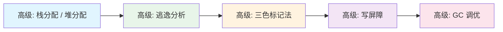
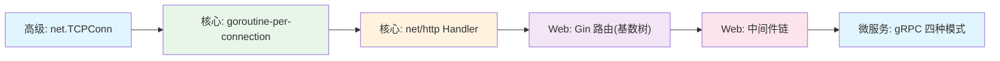
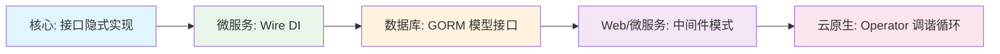
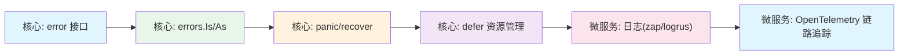
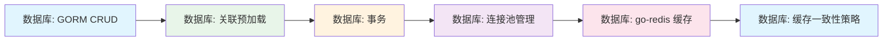

# go语言知识规划——总览

> 本文档是 Go 语言面试知识体系的总览导航图，按八大方向组织。每个方向将产出独立的规划文档，通过本文档可快速跳转。目标读者为 Java 转型开发者（40%）、体系化学习者（35%）和面试准备者（25%）。

---

## 知识体系总览

```text
┌──────────────────────────────────────────────────────────────────────────────────────────────────┐
│                               Go 语言面试知识体系                                                 │
├────────────┬─────────────┬──────────────┬──────────┬──────────┬───────────┬────────┬─────────────┤
│  核心基础   │  Web 框架    │   微服务      │  数据库   │  云原生   │ 测试调试   │ 工具链  │  高级话题    │
│  (25%)     │  (15%)      │  (10%)       │  (10%)   │  (15%)   │  (8%)     │  (7%)  │  (10%)      │
└────────────┴─────────────┴──────────────┴──────────┴──────────┴───────────┴────────┴─────────────┘
```

**学习起点**：具备编程基础（至少一门语言经验），推荐已掌握 Java/Python/JavaScript 等主流语言。

**推荐学习顺序**：

1. **核心基础（25%）** -- 语法概览、接口、并发模型、标准库，建立 Go 语言根基
2. **Web 框架（15%）** -- Gin RESTful API，衔接后端开发实战
3. **数据库（10%）** -- GORM + go-redis，解决数据持久化与缓存
4. **微服务（10%）** -- gRPC + Go-Zero/Kratos，进入分布式架构
5. **云原生（15%）** -- Docker/K8s Operator/Sidecar，Go 语言在云原生生态的核心舞台
6. **测试调试（8%）** -- 贯穿全程的质量保障
7. **工具链（7%）** -- 在项目实践中逐步积累
8. **高级话题（10%）** -- 在掌握核心后深入原理

> 工具链和高级话题建议穿插在项目实践中学习，不必单独安排整段时间。测试调试能力从第一行 Go 代码起就应该培养。

---

## Go vs Java 生态对照速览表

以下从 8 个核心维度对照 Go 与 Java 的生态差异，帮助 Java 转型开发者快速建立 Go 生态的认知锚点。

| 对照维度 | Go | Java | 关键差异 |
|---------|-----|------|---------|
| **语言范式** | 过程式 + 有限 OOP（组合优先、接口隐式实现） | 纯面向对象（继承、多态、显式实现） | Go 无继承，泛型 1.18 才引入 |
| **并发模型** | goroutine（初始栈 2KB）+ channel + GMP 调度 | 线程（默认 1MB）+ JUC（Lock/CAS/线程池） | Go 轻量级并发是核心特色和面试重点 |
| **依赖管理** | Go Modules + MVS（最小版本选择） | Maven/Gradle + 依赖仲裁 | Go 去中心化直接从源码仓库拉取 vs Maven 中央仓库 |
| **Web 框架** | Gin/Echo/Fiber（轻量中间件链，无全家桶） | Spring Boot（注解驱动、自动配置、全家桶） | Go 没有类似 Spring 的全家桶方案，选型更轻量 |
| **微服务** | gRPC + Go-Zero/Kratos（碎片化但选型明确） | Spring Cloud（Nacos/Sentinel/Gateway 生态成熟） | Go 生态碎片化但框架选型有明确头部 |
| **ORM** | GORM（约定优于配置，JPA + MyBatis 混合体） | MyBatis/JPA/Hibernate | GORM 兼具 JPA 的自动映射和 MyBatis 的 SQL 灵活度 |
| **测试** | 内置 testing + 表驱动测试 + pprof 性能分析 | JUnit + Mockito + JMH | Go 自建测试体系无需额外依赖，更轻便 |
| **云原生** | Operator + Sidecar + 多阶段构建（首选语言） | Spring Cloud K8s 适配 | Go 是云原生生态的首选语言，Java 处于适配方 |

**综合结论**：Go 在并发模型、云原生生态、部署体验（单二进制、小镜像尺寸、快速启动）上具有明显优势；Java 在框架成熟度与系统性、企业级基础设施（配置中心/注册中心/监控告警体系）、大厂运维工具链上仍领先。Java 转型者学习 Go 时应重点关注"为什么 Go 这样设计"而非"Go 有没有 Java 的 X"。

---

## 八大方向规划文档

| # | 规划文档 | 方向 | 权重 | 核心知识点数 | 前置知识 |
|---|---------|------|:----:|:----------:|---------|
| 1 | [go语言知识规划——核心](go语言知识规划——核心.md) | 核心基础 | 25% | 8 | 编程基础 |
| 2 | [go语言知识规划——web框架](go语言知识规划——web框架.md) | Web 框架 | 15% | 2 | Go 核心基础 |
| 3 | [go语言知识规划——微服务](go语言知识规划——微服务.md) | 微服务 | 10% | 3 | Go 核心 + 网络基础 |
| 4 | [go语言知识规划——数据库](go语言知识规划——数据库.md) | 数据库 | 10% | 2 | Go 核心 + SQL |
| 5 | [go语言知识规划——云原生](go语言知识规划——云原生.md) | 云原生 | 15% | 3 | Go 核心 + Linux |
| 6 | [go语言知识规划——测试调试](go语言知识规划——测试调试.md) | 测试调试 | 8% | 2 | Go 核心 |
| 7 | [go语言知识规划——工具链](go语言知识规划——工具链.md) | 工具链 | 7% | 1 | Go 项目经验 |
| 8 | [go语言知识规划——高级话题](go语言知识规划——高级话题.md) | 高级话题 | 10% | 2 | Go 核心 + OS |

**方向权重解读**：

- **核心基础（25%）** 占比最高，其中并发方向知识点约占据核心部分的 40%，是 Go 面试的核心竞争力
- **云原生（15%）** 权重较高，反映 Go 是云原生生态首选语言的行业地位
- **微服务（10%）** 权重低于云原生，体现 Go 微服务生态碎片化的现实，建议 Go-Zero 或 Kratos 二选一深耕
- **工具链（7%）** 和 **测试调试（8%）** 可在实践中逐步积累，不设单独的大块学习时间

**面试高频考点**（标注 10 个，在各方向文档中会深入展开）：

| # | 考点 | 所属方向 |
|---|------|---------|
| 1 | Go 接口隐式实现与面向接口编程 | 核心基础 |
| 2 | goroutine + channel 通信模型 | 核心基础 |
| 3 | sync 包并发原语（Mutex/WaitGroup/Once） | 核心基础 |
| 4 | Context 包超时取消与传值 | 核心基础 |
| 5 | Gin Web 框架路由与中间件 | Web 框架 |
| 6 | gRPC + Protobuf 四种通信模式 | 微服务 |
| 7 | GORM 模型定义与关联查询 | 数据库 |
| 8 | pprof 性能分析方法论 | 测试调试 |
| 9 | GMP 调度器原理 | 高级话题 |
| 10 | Go GC + 逃逸分析 | 高级话题 |

---

## 跨领域关联链路

以下六条核心链路展示了知识点之间的深层联系，建议复习时按链路串联知识，不要孤立学习。

### 链路 A：并发贯穿线（核心基础 -> 高级话题）


这是 Go 中最核心的贯穿线。从 goroutine 启动开始（2KB 栈的轻量级线程），到 channel 通信和 select 多路复用的同步模式，再到 sync 包和 Context 管理并发生命周期。掌握这些基础模式后，深入 GMP 调度器理解 goroutine 如何被调度到 OS 线程，Netpoller 如何使 goroutine 在网络 I/O 时不阻塞。这条链是从"会用"到"懂原理"的必经之路。

**链路轨迹**：goroutine -> channel -> select -> sync 包 -> Context -> 并发模式（Worker Pool / Fan-in-Fan-out） -> GMP 调度器 -> Netpoller -> 竞态检测（Data Race）

---

### 链路 B：内存管理链（核心基础 -> 高级话题）



Go 的内存管理从栈/堆分配决策开始：编译器通过逃逸分析（`-gcflags '-m'`）决定变量分配到栈还是堆。GC 采用非分代并发三色标记清除算法，写屏障（插入写屏障 -> 1.8+ 混合写屏障）确保并发标记的正确性。调优层面，GOGC 百分比控制 GC 触发频率，GOMEMLIMIT（1.19+）提供硬内存限制。这条链是从"观察内存"到"理解 GC"的完整路径。

**链路轨迹**：栈分配 / 堆分配 -> 逃逸分析（`-gcflags '-m'`） -> 三色标记法 -> 写屏障（插入写屏障 / 混合写屏障） -> GC 调优（GOGC / GOMEMLIMIT / runtime.GC）

---

### 链路 C：网络栈贯穿线（核心基础 -> Web 框架 -> 微服务）



从 net 包底层 TCP 连接出发，Go 采用 goroutine-per-connection 模型处理高并发连接。net/http 包的 Handler 模式是标准接口，Gin 框架在此基础上实现了高性能基数树路由和中间件链模式。网络栈的最终形态是微服务通信：gRPC 基于 HTTP/2，支持一元/服务端流/客户端流/双向流四种模式。这条链贯穿从底层网络到上层微服务的完整路径。

**链路轨迹**：net.TCPConn -> goroutine-per-connection -> net/http Handler -> Gin 路由（基数树） -> 中间件链 -> gRPC 四种通信模式

---

### 链路 D：抽象模式链（核心基础 -> Web 框架 -> 云原生）



Go 的接口隐式实现（Duck Typing）是整个生态抽象的基础。依赖注入框架（如 Wire）利用接口实现编译期 DI。GORM 的模型接口（Tabler、Hook 接口）展现了接口在数据层的灵活应用。中间件模式（`HandlerFunc -> HandlerFunc` 链式包装）在 Web 框架和微服务拦截器中广泛使用。最上层的 Operator 调谐循环（Reconcile）本质是一个由事件驱动、持续收敛至期望状态的接口抽象。这条链展示了 Go 接口设计哲学在不同技术层面的渗透。

**链路轨迹**：接口隐式实现 -> 依赖注入（Wire） -> GORM 模型接口 -> 中间件模式（Web/微服务） -> Operator 调谐循环

---

### 链路 E：错误处理链（核心基础 -> 微服务）



Go 的 error 接口（`type error interface { Error() string }`）是所有错误处理的起点。通过 `errors.Is/As` 支持错误包装链展开判断。`panic/recover` 处理不可恢复异常，`defer` 确保资源释放。在微服务规模下，错误需要结构化记录到日志（zap/logrus 结构化日志库），并通过 OpenTelemetry 将错误与 Trace/Span 关联，实现全链路的可观测性。这条链从"单纯判断错误"演进到"全链路错误追踪"。

**链路轨迹**：error 接口 -> errors.Is/As 错误包装 -> panic/recover -> defer 资源管理 -> 日志（zap/logrus） -> OpenTelemetry 链路追踪 -> 错误码规范

---

### 链路 F：数据库/缓存链（核心基础 -> 数据库）



从 GORM 基础 CRUD 和关联预加载（Preload/Joins）开始，事务管理（嵌套事务、SavePoint）确保数据操作原子性。连接池管理（MaxOpenConns/MaxIdleConns/ConnMaxLifetime）避免数据库连接耗尽。引入 go-redis 作为缓存层后，需要面对缓存一致性挑战：Cache-Aside 模式、双删策略、分布式锁等。这条链展示了从"数据存储"到"缓存性能优化"的完整演进路径。

**链路轨迹**：GORM CRUD -> 关联预加载 -> 事务 -> 连接池管理 -> go-redis 缓存操作 -> 缓存一致性（Cache-Aside / 双删策略）

---

## 四轮复习路线图

本文档体系共计 **8 大技术方向**。以下提供四轮复习策略，逐步递进。

### 第一轮：粗读

通读各方向规划文档的标题结构和知识点列表，建立 Go 知识体系的整体认知框架。目标是回答三个问题：

- Go 面试考什么？
- 哪些方向我熟悉，哪些方向薄弱？
- 从哪里开始学？

此轮不做深度记忆，目的在"建地图"。

### 第二轮：深读

按知识点优先级逐章精读。优先掌握以下 10 个面试高频考点：

| 优先级 | 考点 | 方向 | 一句话定位 |
|:------:|------|------|-----------|
| ★★★★★ | goroutine + channel | 核心基础 | Go 并发核心，问得最多也最需要动手写 |
| ★★★★★ | Go 接口隐式实现 | 核心基础 | 与 Java 的最大差异点，必问设计哲学 |
| ★★★★★ | GMP 调度器 | 高级话题 | goroutine 的底层调度原理，区分深浅 |
| ★★★★★ | Go GC + 逃逸分析 | 高级话题 | 内存管理和性能调优核心 |
| ★★★★ | sync 包并发原语 | 核心基础 | Mutex/WaitGroup/Once/Cond 使用场景 |
| ★★★★ | Context 包 | 核心基础 | 超时取消传递链的设计模式 |
| ★★★★ | Gin Web 框架 | Web 框架 | 路由 + 中间件链 + 参数绑定三件套 |
| ★★★★ | gRPC + Protobuf | 微服务 | 四种通信模式 + proto 语法 |
| ★★★★ | GORM | 数据库 | 模型 Tag + CRUD + 关联查询 |
| ★★★★ | pprof 性能分析 | 测试调试 | CPU/Heap/Mutex profile 分析方法 |

第二轮的学习方法是：每个知识点找到 1-2 个代码示例亲手跑通，不满足于"看懂"。

### 第三轮：串读

按第 4 章的六条跨域关联链路重新串联知识，将八大方向的知识点贯通理解：

- **并发贯穿线**：从 goroutine 用法到 GMP 调度器原理
- **内存管理链**：从逃逸分析到 GC 调优参数
- **网络栈贯穿线**：从 TCP 底层到 gRPC 微服务
- **抽象模式链**：从接口隐式实现到 Operator 调谐
- **错误处理链**：从 error 接口到链路追踪
- **数据库/缓存链**：从 GORM 到缓存一致性

每条链先秒速回忆每个节点的核心概念，再连起来理清关系。

### 第四轮：复讲

脱离材料，模拟面试场景。每个知识点按"一句话原理 + 三个要点 + 一个项目经验"的结构练习：

```text
模板：
- 一句话：XXX 是什么，解决什么问题
- 三个要点：核心机制（30%）+ 常见陷阱（30%）+ 对比差异（40%，尤其对 Java 转型岗位）
- 项目经验：在项目中怎么用的 / 遇到过什么问题 / 怎么解的
```

**Java 转型面试建议**：面试中主动对比 Go 与 Java 的实现差异（如 goroutine vs 线程池、接口隐式实现 vs 显式 implement、Go error vs Java Exception），展示你的跨语言理解深度。

---

## 复习建议

1. **先总览后深入**：先阅读总览了解整体知识结构，再逐个方向深入研究
2. **按链路串知识**：按六条关联链路串联理解，不要孤立学习；Go 的并发贯穿线是核心中的核心
3. **四轮复习法**：粗读 -> 深读 -> 串读 -> 复讲，逐步递进，前三轮不赶进度
4. **动手写代码**：Go 的学习必须以写代码为基础，每个知识点都要自己编写代码验证，特别是 goroutine 和 channel 的并发模式
5. **Java 转型视角**：Java 开发者学习 Go 时，对照 Java 生态理解 Go 的设计哲学和对应方案，关注"为什么 Go 这么设计"而非"Go 有没有 Java 的 X"
