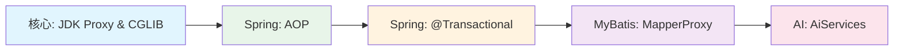
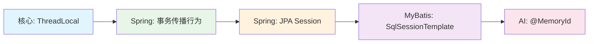
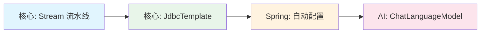
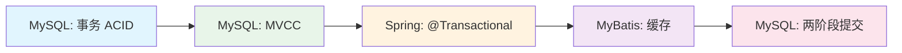
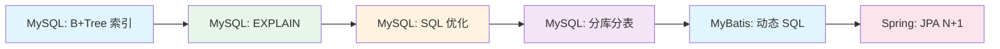

# java知识规划——总览

> 本文档是 Java 面试知识体系的总览导航图，按五大方向组织。每个方向有独立的规划文档，通过本文档可快速跳转。

---

## 知识体系总览

```text
┌─────────────────────────────────────────────────────────────┐
│                   Java 面试知识体系                           │
├─────────────┬──────────────┬─────────┬─────────┬────────────┤
│  Java 核心  │  Spring 体系  │ MyBatis │  MySQL  │  AI 开发    │
│  (30%)      │  (30%)       │ (15%)   │  (15%)  │  (10%)     │
└─────────────┴──────────────┴─────────┴─────────┴────────────┘
```

---

## 五大方向规划文档

| # | 文档 | 权重 | 知识点数 | 前置知识 |
|---|------|:----:|:-------:|---------|
| 1 | [java知识规划——核心](java知识规划——核心.md) | 30% | 27 | Java 基础语法 |
| 2 | [java知识规划——spring](java知识规划——spring.md) | 30% | 29 | Java 核心 + 设计模式 |
| 3 | [java知识规划——mybatis](java知识规划——mybatis.md) | 15% | 10 | JDBC + Spring IoC |
| 4 | [java知识规划——mysql](java知识规划——mysql.md) | 15% | 10 | 数据库基础 + SQL |
| 5 | [java知识规划——ai开发](java知识规划——ai开发.md) | 10% | 17 | Spring Boot + 代理模式 |

---

## 跨领域关联链路

以下五条核心链路展示了知识点之间的深层联系，建议复习时按链路串联知识。

### 链路 A：代理模式贯穿线（从 Java 到 Spring 到 AI）



这条线是贯穿 Java/Spring/MyBatis/AI 最核心的代理主线：从 JDK 动态代理到 Spring AOP 的自动代理创建，再到 @Transactional 的 AOP 拦截、MyBatis Mapper 接口代理、以及 AI 服务的接口代理。

---

### 链路 B：线程/隔离贯穿线



从 ThreadLocal 线程级隔离到 Spring 事务传播、JPA Session 生命周期、MyBatis SqlSession 线程安全、再到 AI 会话隔离，体现了逐层递增的隔离粒度。

---

### 链路 C：模板方法/统一抽象贯穿线



"定义不变骨架，注入可变实现"的设计思想在不同技术层面的应用：Stream 计算骨架、JdbcTemplate 模板方法、自动配置的固定加载流程 + 可变实现、ChatLanguageModel 统一接口 + 厂商实现。

---

### 链路 D：数据一致性链



从 MySQL 事务 ACID 定义到 MVCC 快照读隔离，Spring 声明式事务管理，MyBatis DML 后清空缓存，再到 Redo Log 两阶段提交崩溃恢复，展示数据从应用到底层的完整性保证路径。

---

### 链路 E：性能优化链



从数据库底层 B+Tree 索引结构到 EXPLAIN 执行计划定位瓶颈，再到 SQL 改写和分库分表架构扩展，最后到 ORM 层面的 N+1 查询优化，覆盖完整性能优化路径。

---

## 四轮复习路线图

本文档体系共计 5 大技术方向。以下提供四轮复习策略。

### 第一轮：粗读
通读各方向文档的标题结构和追问链，建立整体认知框架，标记薄弱环节。

### 第二轮：深读
按知识点优先级逐章精读：★★★★★ 必答 → ★★★★ 加分 → ★★★ 了解，重点关注面试中容易被深入追问的内容（如 JVM 调优、AQS 源码、MVCC 与锁机制、AiServices 代理过程）。

### 第三轮：串读
按跨域关联链路重新串联知识，将五大方向的知识点通过五条链路（代理线、隔离线、模板方法线、数据一致性链、性能优化链）贯通理解。

### 第四轮：复讲
脱离材料，模拟面试场景。每个知识点按"一句话原理 + 三个要点 + 一个项目经验"的结构练习。

---

## 复习建议

1. **先总览后深入**：先阅读总览了解整体知识结构，再逐个方向深入
2. **按链路串知识**：按五条关联链路串联理解，不要孤立学习
3. **四轮复习法**：粗读→深读→串读→复讲，逐步递进
4. **理论知识结合项目**：每个知识点思考"我在项目中用到过吗？"
