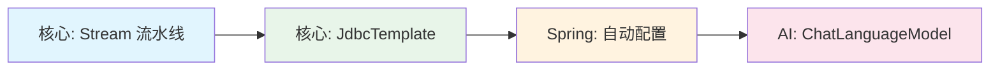
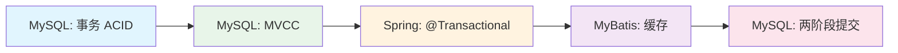
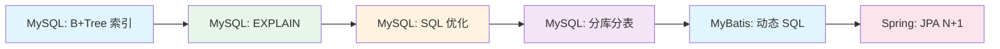

# java知识规划——总览

> 本文档是 Java 面试知识体系的总览导航图，按五大方向组织。每个方向有独立的规划文档，通过本文档可快速跳转。同时包含跨域知识关联链路、按问题类型编排的逆查索引和一份四轮复习路线图。

---

## 知识体系总览

```text
┌─────────────────────────────────────────────────────────────┐
│                   Java 面试知识体系                           │
├─────────────┬──────────────┬─────────┬─────────┬────────────┤
│  Java 核心  │  Spring 体系  │ MyBatis │  MySQL  │  AI 开发    │
│  (30%)      │  (30%)       │ (15%)   │  (15%)  │  (10%)     │
├─────────────┼──────────────┼─────────┼─────────┼────────────┤
│ 版本特性    │ IoC 容器     │ SQL绑定  │ B+Tree   │ AiServices │
│ JVM 内存    │ AOP          │ 代理原理 │ 索引优化  │ 模型集成   │
│ 并发编程    │ 自动配置     │ 缓存机制 │ EXPLAIN  │ RAG        │
│ 集合框架    │ MVC/REST     │ 动态 SQL │ ACID     │ Tool调用   │
│ NIO/Netty   │ 事务管理     │ 分页原理 │ MVCC    │ ChatMemory │
│ 设计模式    │ JPA         │ 延迟加载 │ 锁机制   │ 流式响应   │
│             │ Security     │ MyBatis-Plus│ SQL优化 │           │
│             │ 微服务       │         │ 分库分表 │           │
│             │              │         │ 主从复制 │           │
└─────────────┴──────────────┴─────────┴─────────┴────────────┘
```

---

## 五大方向规划文档

| # | 文档 | 权重 | 知识点数 | 前置知识 |
|---|------|:----:|:-------:|---------|
| 1 | [java知识规划——核心](java知识规划——核心.md) | 30% | 27 | Java 基础语法 |
| 2 | [java知识规划——spring](java知识规划——spring.md) | 30% | 29 | Java 核心 + 设计模式 |
| 3 | [java知识规划——mybatis](java知识规划——mybatis.md) | 15% | 10 | JDBC + Spring IoC |
| 4 | [java知识规划——mysql](java知识规划——mysql.md) | 15% | 10 | 数据库基础 + SQL |
| 5 | [java知识规划——ai开发](java知识规划——ai开发.md) | 10% | 17 | Spring Boot + 代理模式 |

---

## 跨领域关联链路

以下五条核心链路展示了知识点之间的深层联系，建议复习时按链路串联知识。

### 链路 A：代理模式贯穿线（从 Java 到 Spring 到 AI）


这条线是贯穿 Java/Spring/MyBatis/AI 最核心的代理主线：

- **JDK Proxy**（[核心 → 设计模式](java知识规划——核心.md#16-设计模式)）：InvocationHandler + 反射，通过 `Proxy.newProxyInstance()` 生成接口实现类
- **Spring AOP**（[Spring → AOP](java知识规划——spring.md#22-spring-aop)）：`AnnotationAwareAspectJAutoProxyCreator` 在 `postProcessAfterInitialization` 阶段创建代理
- **@Transactional**（[Spring → 事务管理](java知识规划——spring.md#25-spring-事务管理)）：`TransactionInterceptor`（AOP Around 增强）完成事务开启/提交/回滚
- **MyBatis MapperProxy**（[MyBatis → 代理原理](java知识规划——mybatis.md#32-mapper-接口代理原理jdk-动态代理)）：通过 JDK Proxy 为 Mapper 接口生成代理对象
- **AiServices**（[AI → 核心架构](java知识规划——ai开发.md#51-核心架构与-aiservices)）：JDK Proxy 生成 AI Service 接口实现

---

### 链路 B：线程/隔离贯穿线


| 层次 | 隔离单位 | 隔离技术 | 解决的问题 |
|------|---------|---------|-----------|
| 线程级（核心）| 每条线程 | ThreadLocalMap（弱引用 Entry）| 线程之间的数据隔离 |
| 事务级（Spring）| 每个事务 | Connection + TransactionSynchronization | 事务之间的数据隔离 |
| 持久化级（Spring）| 每个 Session | Hibernate Session 生命周期 | Session 之间的持久化上下文隔离 |
| ORM 级（MyBatis）| 每个线程 | SqlSessionTemplate + ThreadLocal | SqlSession 线程安全 |
| AI 会话级（AI）| 每个用户会话 | @MemoryId + Map<Object, ChatMemory> | 不同用户的对话历史隔离 |

---

### 链路 C：模板方法/统一抽象贯穿线



这条线展示了"定义不变骨架，注入可变实现"的设计思想在不同技术层面的应用：

- **Stream 流水线**：中间操作定义计算骨架（filter/map/reduce），终端操作执行
- **JdbcTemplate 模板方法**：连接管理、异常处理等固定骨架 + RowMapper 回调
- **自动配置**：固定加载流程（AutoConfiguration.imports → @Conditional 过滤）+ 可变的自动配置类
- **ChatLanguageModel**：统一的 chat() 方法接口 + 各厂商的具体实现（OpenAI/Ollama/Anthropic）

---

### 链路 D：数据一致性链



这条链展示数据从数据库到底层日志的一致性保证路径：

- **ACID**（[MySQL → 事务](java知识规划——mysql.md#44-事务-acid-与隔离级别)）：事务的原子性、一致性、隔离性、持久性定义
- **MVCC ReadView**（[MySQL → MVCC](java知识规划——mysql.md#45-mvcc-实现原理undo-log--readview)）：快照读的事务隔离实现
- **@Transactional**（[Spring → 事务管理](java知识规划——spring.md#25-spring-事务管理)）：Spring 事务声明式管理，底层连接隔离级别传递
- **MyBatis 缓存**（[MyBatis → 缓存机制](java知识规划——mybatis.md#34-一级缓存和二级缓存机制及问题)）：DML 后清空缓存保证数据一致性
- **两阶段提交**（[MySQL → InnoDB 内存结构](java知识规划——mysql.md#410-innodb-内存结构buffer-pool--redo-log--undo-log--binlog)）：Redo Log prepare → Binlog → Redo Log commit，崩溃恢复一致性

---

### 链路 E：性能优化链



这条链覆盖从数据库底层到 ORM 层面的完整性能优化路径：

- **B+Tree 索引**（[MySQL → 索引结构](java知识规划——mysql.md#41-btree-数据结构--聚簇-vs-二级索引--最左前缀)）：索引数据结构决定读写性能天花板
- **EXPLAIN**（[MySQL → 执行计划](java知识规划——mysql.md#43-explain-执行计划解读)）：通过执行计划定位性能瓶颈
- **SQL 优化**（[MySQL → SQL 优化策略](java知识规划——mysql.md#47-sql-优化策略)）：慢查询分析 + SQL 改写 + 深分页优化
- **分库分表**（[MySQL → 分库分表](java知识规划——mysql.md#48-分库分表shardingsphere-原理)）：架构层面的水平扩展
- **MyBatis 动态 SQL**（[MyBatis → 动态 SQL](java知识规划——mybatis.md#35-动态-sqlifchoosewhenforeachwheresettrim)）：动态拼接 SQL 的查询性能考量
- **JPA N+1**（[Spring → JPA](java知识规划——spring.md#26-spring-data-jpa)）：ORM 层面的关联查询优化

---

## 逆查索引

按问题类型分类，快速定位知识点章节。

### 原理类（为什么）

| 问题 | 文档 | 一句话答案 |
|------|:----:|-----------|
| 为什么 HashMap 负载因子是 0.75？ | [核心 → 集合框架](java知识规划——核心.md#14-集合框架) | 时间与空间的折中，泊松分布下桶节点数 > 8 概率极小 |
| 为什么需要三级缓存？ | [Spring → IoC](java知识规划——spring.md#21-spring-ioc-容器) | 解决 setter 循环依赖，L3 保证 AOP 代理在真正需要时创建 |
| 为什么 @Transactional 自调用失效？ | [Spring → 事务](java知识规划——spring.md#25-spring-事务管理) | 内部 this 调用不走代理，AOP 拦截器不执行 |
| 为什么虚拟线程不适合 CPU 密集？ | [核心 → 版本特性](java知识规划——核心.md#11-java-版本特性演进8111721) | carrier 线程（平台线程）数量有限，CPU 任务会阻塞其他虚拟线程 |
| 为什么 JDK 15+ 默认关闭偏向锁？ | [核心 → 并发编程](java知识规划——核心.md#13-并发编程) | 高并发应用中偏向锁的撤销维护成本 > 收益 |
| 为什么 #{} 能防 SQL 注入？ | [MyBatis → SQL 绑定](java知识规划——mybatis.md#31--vs--及-sql-注入防范) | PreparedStatement 预编译，参数视为值而非 SQL 片段 |
| 为什么 MyBatis 只需要接口不写实现类？ | [MyBatis → 代理原理](java知识规划——mybatis.md#32-mapper-接口代理原理jdk-动态代理) | MapperProxy 通过 JDK 动态代理生成接口实现 |
| 为什么 InnoDB 用 B+Tree 不用 Hash/B-Tree？ | [MySQL → 索引结构](java知识规划——mysql.md#41-btree-数据结构--聚簇-vs-二级索引--最左前缀) | B+Tree 支持范围查询 + I/O 次数固定 |
| MVCC 为什么能实现可重复读？ | [MySQL → MVCC](java知识规划——mysql.md#45-mvcc-实现原理undo-log--readview) | RR 级别第一次 SELECT 生成 ReadView，后续复用 |
| 间隙锁为什么能防止幻读？ | [MySQL → 锁机制](java知识规划——mysql.md#46-innodb-锁机制行锁--gap-lock--next-key-lock) | 锁定索引记录间间隙，阻止其他事务插入新记录 |

### 实现类（怎么实现）

| 问题 | 文档 | 一句话答案 |
|------|:----:|-----------|
| Bean 生命周期怎么走？ | [Spring → IoC](java知识规划——spring.md#21-spring-ioc-容器) | 实例化 → 属性赋值 → Aware → @PostConstruct → afterPropertiesSet → BPP after → 就绪 |
| 自动配置怎么加载？ | [Spring → Boot](java知识规划——spring.md#23-spring-boot-核心机制) | AutoConfigurationImportSelector 加载 AutoConfiguration.imports → @Conditional 过滤 |
| OAuth2 授权码流程怎么走？ | [Spring → Security](java知识规划——spring.md#27-spring-security) | 用户授权 → 授权码 → 服务端换 Token → 携带 Token 访问资源 |
| RAG 完整流程怎么调用？ | [AI → RAG](java知识规划——ai开发.md#53-rag-与知识检索) | Load → Split → Embed → Store → Query → Retrieve → LLM |
| AiServices 代理怎么创建？ | [AI → 核心架构](java知识规划——ai开发.md#51-核心架构与-aiservices) | JDK Proxy.newProxyInstance 生成接口实现，InvocationHandler 拦截并转为 ChatRequest |
| MyBatis 动态 SQL 怎么拼接？ | [MyBatis → 动态 SQL](java知识规划——mybatis.md#35-动态-sqlifchoosewhenforeachwheresettrim) | SqlNode 组合模式 + OGNL 条件评估，DynamicSqlSource 执行时遍历拼接 |
| PageHelper 分页怎么实现？ | [MyBatis → 分页原理](java知识规划——mybatis.md#38-分页实现原理rowbounds--pagehelper) | Interceptor 拦截 Executor.query + ThreadLocal 存分页参数 + SQL 改写追加 LIMIT |
| MySQL 主从复制怎么工作？ | [MySQL → 主从复制](java知识规划——mysql.md#49-主从复制binlog) | Binlog Dump Thread 发送 → I/O Thread 写 Relay Log → SQL Thread 重放 |
| 一条 UPDATE 在 InnoDB 中完整过程？ | [MySQL → InnoDB 结构](java知识规划——mysql.md#410-innodb-内存结构buffer-pool--redo-log--undo-log--binlog) | Buffer Pool → Undo Log → 修改数据页 → Redo Log Buffer → 两阶段提交 |

### 对比类（什么区别）

| 问题 | 文档 | 一句话答案 |
|------|:----:|-----------|
| JDK Proxy vs CGLIB | [核心 → 设计模式](java知识规划——核心.md#16-设计模式) | 前者基于接口（反射），后者基于继承（ASM），JDK 8+ JDK Proxy 性能更优 |
| HashMap JDK 7 vs 8 | [核心 → 集合框架](java知识规划——核心.md#14-集合框架) | 7=数组+链表/头插, 8=数组+链表+红黑树/尾插/优化 rehash |
| CMS vs G1 vs ZGC | [核心 → JVM](java知识规划——核心.md#12-jvm-内存模型与垃圾回收) | CMS=并发清除（碎片）, G1=Region 化（可预测停顿）, ZGC=染色指针（<1ms STW）|
| 拦截器 vs 过滤器 | [Spring → MVC](java知识规划——spring.md#24-spring-mvc--rest) | Filter=Servlet 级别, Interceptor=Spring 级别（preHandle 三阶段可获取 Bean）|
| JWT vs Session | [Spring → Security](java知识规划——spring.md#27-spring-security) | Token 无状态（天然扩展/不能主动失效）, Session 有状态（需共享/可随时销毁）|
| REQUIRED vs REQUIRES_NEW vs NESTED | [Spring → 事务](java知识规划——spring.md#25-spring-事务管理) | 共享事务/完全独立/嵌套子事务（savepoint 部分回滚）|
| `#{}` vs `${}` | [MyBatis → SQL 绑定](java知识规划——mybatis.md#31--vs--及-sql-注入防范) | 预编译占位符 vs 字符串替换，前者防注入 |
| 一级缓存 vs 二级缓存 | [MyBatis → 缓存机制](java知识规划——mybatis.md#34-一级缓存和二级缓存机制及问题) | SqlSession 级别（默认开启）vs namespace 级别（需手动开启，commit 写入）|
| RowBounds vs PageHelper | [MyBatis → 分页原理](java知识规划——mybatis.md#38-分页实现原理rowbounds--pagehelper) | 内存分页（假分页，全表查询）vs 物理分页（真分页，LIMIT 改写）|
| 聚簇索引 vs 二级索引 | [MySQL → 索引结构](java知识规划——mysql.md#41-btree-数据结构--聚簇-vs-二级索引--最左前缀) | 叶子存完整行（一张表一个）vs 存主键值（需回表）|
| MVCC RC vs RR ReadView | [MySQL → MVCC](java知识规划——mysql.md#45-mvcc-实现原理undo-log--readview) | RC 每次 SELECT 新建 ReadView vs RR 第一次 SELECT 生成复用 |
| Record Lock vs Gap Lock vs Next-Key Lock | [MySQL → 锁机制](java知识规划——mysql.md#46-innodb-锁机制行锁--gap-lock--next-key-lock) | 行锁 vs 间隙锁（RR 防幻读）vs 行锁+间隙锁组合 |
| Buffer Pool vs Redo Log vs Undo Log vs Binlog | [MySQL → InnoDB 结构](java知识规划——mysql.md#410-innodb-内存结构buffer-pool--redo-log--undo-log--binlog) | 缓存 vs WAL 持久性 vs 回滚+MVCC vs Server 层复制 |

### 陷阱类（什么坑）

| 问题 | 文档 | 一句话答案 |
|------|:----:|-----------|
| ThreadLocal 内存泄漏 | [核心 → 并发编程](java知识规划——核心.md#13-并发编程) | Entry 弱引用 Key，GC 后 Key=null 但 Value 强引用不释放，finally remove |
| 虚拟线程 pinned 问题 | [核心 → 版本特性](java知识规划——核心.md#11-java-版本特性演进8111721) | synchronized 块中无法 yield，钉住 carrier 线程，降低调度优势 |
| 自调用事务失效 | [Spring → 事务](java知识规划——spring.md#25-spring-事务管理) | 内部 this.method() 不走代理，@Transactional 不生效 |
| 并行流共享 ForkJoinPool | [核心 → 版本特性](java知识规划——核心.md#11-java-版本特性演进8111721) | parallelStream() 默认 commonPool，一个任务阻塞影响所有并行操作 |
| JPA N+1 问题 | [Spring → JPA](java知识规划——spring.md#26-spring-data-jpa) | 查询 N 条主记录后每条关联字段触发额外 SQL，共 1+N 条 |
| CAS 自旋风暴 | [核心 → 并发编程](java知识规划——核心.md#13-并发编程) | 高竞争下 CAS 大量自旋浪费 CPU |
| JWT 退出登录失效 | [Spring → Security](java知识规划——spring.md#27-spring-security) | Token 无法主动销毁，需 Redis 黑名单配合 |
| MyBatis 二级缓存脏读 | [MyBatis → 缓存机制](java知识规划——mybatis.md#34-一级缓存和二级缓存机制及问题) | 不同 namespace 关联表操作导致数据不一致 |
| 延迟加载 N+1 问题 | [MyBatis → 延迟加载](java知识规划——mybatis.md#39-延迟加载原理及问题) | 循环调用关联对象 getter 产生大量子查询 |
| Mapper 接口方法重载限制 | [MyBatis → 代理原理](java知识规划——mybatis.md#32-mapper-接口代理原理jdk-动态代理) | 方法名 + namespace 必须唯一，不能重载 |
| 索引失效（函数/隐式转换/LIKE）| [MySQL → 索引优化](java知识规划——mysql.md#42-索引优化覆盖索引--索引下推-icp--mrr) | WHERE 中使用函数、隐式类型转换、LIKE 前导 % 导致不走索引 |
| 深分页 LIMIT offset 性能 | [MySQL → EXPLAIN](java知识规划——mysql.md#43-explain-执行计划解读) | `LIMIT 100000, 20` 需扫描前 100000 行 |
| RR 下加锁读幻读 | [MySQL → 锁机制](java知识规划——mysql.md#46-innodb-锁机制行锁--gap-lock--next-key-lock) | Gap Lock 防止快照读幻读，但当前读仍需注意锁范围 |

---

## 四轮复习路线图

本文档体系共计 5 大技术方向 + 知识图谱。以下提供具体的复习策略和时间安排。

### 第一轮：粗读（第 1-3 天）

目标：建立整体认知框架，标记薄弱环节。

| 日次 | 内容 | 方法 |
|------|------|------|
| 第 1 天 | [核心](java知识规划——核心.md) + [MyBatis](java知识规划——mybatis.md) | 通读 H3 标题和追问链，标记不熟悉的知识点 |
| 第 2 天 | [Spring](java知识规划——spring.md) + [MySQL](java知识规划——mysql.md) | 同上，重点关注 AOP 代理、事务、索引和锁 |
| 第 3 天 | [AI 开发](java知识规划——ai开发.md) + 本总览文档 | 快速浏览概念，了解 LangChain4j 核心组件 |

### 第二轮：深读（第 4-7 天）

按知识点优先级逐章精读：★★★★★ 必答 → ★★★★ 加分 → ★★★ 了解。

| 优先级 | 知识点范围 | 文档覆盖 |
|--------|-----------|:-------:|
| ★★★★★ 必答 | HashMap、ConcurrentHashMap、synchronized/AQS、线程池、Bean 生命周期、自动配置、@Transactional、JWT、`#{}` vs `${}`、Mapper 代理、B+Tree 索引、MVCC、InnoDB 锁 | 核心·Spring·MyBatis·MySQL |
| ★★★★ 加分 | JVM GC 演进、Netty Reactor、CompletableFuture、动态 SQL、缓存机制、EXPLAIN、SQL 优化、AiServices RAG | 核心·MyBatis·MySQL·AI |
| ★★★ 了解 | 延迟加载、分库分表、主从复制、MyBatis-Plus、ChatMemory | MyBatis·MySQL·AI |

### 第三轮：串读（第 8-10 天）

按跨域关联链路重新串联知识：

| 时间 | 链路 | 串联方法 |
|------|------|---------|
| 第 8 天 | 链路 A（代理线）+ 链路 C（模板方法线）| 从核心设计模式 → Spring AOP → MyBatis MapperProxy → AI AiServices |
| 第 9 天 | 链路 B（隔离线）+ 链路 D（数据一致性链）| 从核心 ThreadLocal → Spring @Transactional → MyBatis SqlSessionTemplate → AI @MemoryId |
| 第 10 天 | 链路 E（性能优化链）+ 逆查索引 | 从 MySQL B+Tree → SQL 优化 → N+1，按四类问题快速检索 |

### 第四轮：复讲（第 11-14 天）

脱离材料，模拟面试场景。每个知识点按"一句话原理 + 三个要点 + 一个项目经验"结构练习。

### 时间分配建议

| 方向 | 文档 | 知识点数 | 面试权重 | 复习时间占比 | 优先级 |
|------|:----:|:-------:|:-------:|:-----------:|:-----:|
| Java 核心 | [核心](java知识规划——核心.md) | 27 | 30% | 25% | ★★★★★ |
| Spring 体系 | [Spring](java知识规划——spring.md) | 29 | 30% | 30% | ★★★★★ |
| MyBatis | [MyBatis](java知识规划——mybatis.md) | 10 | 15% | 15% | ★★★★ |
| MySQL | [MySQL](java知识规划——mysql.md) | 10 | 15% | 15% | ★★★★ |
| AI 开发 | [AI 开发](java知识规划——ai开发.md) | 17 | 10% | 10% | ★★★ |

### 薄弱环节针对性提示

根据知识点复杂度分析，以下内容面试中容易深入追问，建议深读阶段优先投入：

- **JVM 调优**（核心）：CMS 四阶段、G1 Region + RSet、ZGC 染色指针
- **AQS 源码**（核心）：CLH 队列、独占/共享模式、Condition
- **MyBatis 代理与缓存**（MyBatis）：MapperProxy 源码、一级/二级缓存机制及脏读问题
- **MySQL MVCC 与锁**（MySQL）：ReadView 可见性判定、Gap Lock 退化规则、死锁检测
- **LangChain4j AiServices**（AI）：代理创建过程、RAG 与 ChatMemory 协同

---

## 复习建议

1. **先总览后深入**：先阅读本文档总览，了解整体知识结构，再逐个方向深入
2. **按链路串知识**：不要孤立学知识点，按五条关联链路串联理解
3. **逆查索引查漏补缺**：遇到问题先从逆查索引定位知识点
4. **四轮复习法**：粗读→深读→串读→复讲，逐步递进
5. **理论知识结合项目**：每个知识点思考"我在项目中用到过吗？"
