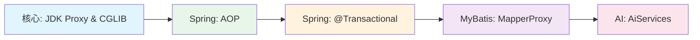
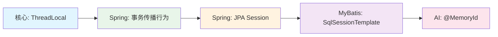
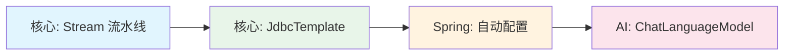
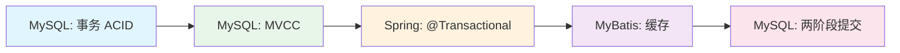
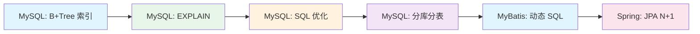
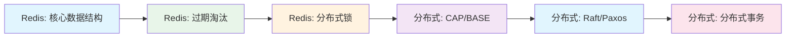

# java知识规划——总览

> 本文档是 Java 面试知识体系的总览导航图，按八大方向组织。每个方向有独立的规划文档，通过本文档可快速跳转。

---

## 知识体系总览

```text
┌──────────────────────────────────────────────────────────────────────────────────────────────┐
│                                    Java 面试知识体系                                          │
├──────────────┬─────────────┬──────────────┬──────────┬──────────┬────────────┬────────┬────────┤
│  Java 核心   │  Spring      │ Spring Cloud │ MyBatis  │  MySQL    │  AI 开发    │ Redis  │分布式  │
│  (25%)       │  (20%)       │  (5%)        │  (10%)   │  (10%)    │  (8%)      │ (12%)  │(10%)   │
└──────────────┴─────────────┴──────────────┴──────────┴──────────┴────────────┴────────┴────────┘
```

---

## 八大方向规划文档

| # | 文档 | 权重 | 知识点数 | 前置知识 |
|---|------|:----:|:-------:|---------|
| 1 | [java知识规划——核心](java知识规划——核心.md) | 25% | 27 | Java 基础语法 |
| 2 | [java知识规划——spring](java知识规划——spring.md) | 20% | 23 | Java 核心 + 设计模式 |
| 3 | [java知识规划——springCloud微服务](java知识规划——springCloud微服务.md) | 5% | 10 | Spring Boot + Nacos |
| 4 | [java知识规划——mybatis](java知识规划——mybatis.md) | 10% | 15 | JDBC + Spring IoC |
| 5 | [java知识规划——mysql](java知识规划——mysql.md) | 10% | 14 | 数据库基础 + SQL |
| 6 | [java知识规划——ai开发](java知识规划——ai开发.md) | 8% | 9 | Spring Boot + 代理模式 |
| 7 | [java知识规划——redis](java知识规划——redis.md) | 12% | 10 | 核心 数据结构基础 |
| 8 | [java知识规划——分布式系统](java知识规划——分布式系统.md) | 10% | 10 | Spring Cloud 微服务

---

## 跨领域关联链路

以下六条核心链路展示了知识点之间的深层联系，建议复习时按链路串联知识。

### 链路 A：代理模式贯穿线（从 Java 到 Spring 到 AI）


```mermaid
graph LR
    A["核心: JDK Proxy & CGLIB"] --> B["Spring: AOP"]
    B --> C["Spring: @Transactional"]
    C --> D["MyBatis: MapperProxy"]
    D --> E["AI: AiServices"]

    style A fill:#e1f5fe
    style B fill:#e8f5e9
    style C fill:#fff3e0
    style D fill:#f3e5f5
    style E fill:#fce4ec
```

这条线是贯穿 Java/Spring/MyBatis/AI 最核心的代理主线：从 JDK 动态代理到 Spring AOP 的自动代理创建，再到 @Transactional 的 AOP 拦截、MyBatis Mapper 接口代理、以及 AI 服务的接口代理。

---

### 链路 B：线程/隔离贯穿线


```mermaid
graph LR
    A["核心: ThreadLocal"] --> B["Spring: 事务传播行为"]
    B --> C["Spring: JPA Session"]
    C --> D["MyBatis: SqlSessionTemplate"]
    D --> E["AI: @MemoryId"]

    style A fill:#e1f5fe
    style B fill:#e8f5e9
    style C fill:#fff3e0
    style D fill:#f3e5f5
    style E fill:#fce4ec
```

从 ThreadLocal 线程级隔离到 Spring 事务传播、JPA Session 生命周期、MyBatis SqlSession 线程安全、再到 AI 会话隔离，体现了逐层递增的隔离粒度。

---

### 链路 C：模板方法/统一抽象贯穿线


```mermaid
graph LR
    A["核心: Stream 流水线"] --> B["核心: JdbcTemplate"]
    B --> C["Spring: 自动配置"]
    C --> D["AI: ChatLanguageModel"]

    style A fill:#e1f5fe
    style B fill:#e8f5e9
    style C fill:#fff3e0
    style D fill:#fce4ec
```

"定义不变骨架，注入可变实现"的设计思想在不同技术层面的应用：Stream 计算骨架、JdbcTemplate 模板方法、自动配置的固定加载流程 + 可变实现、ChatLanguageModel 统一接口 + 厂商实现。

---

### 链路 D：数据一致性链


```mermaid
graph LR
    A["MySQL: 事务 ACID"] --> B["MySQL: MVCC"]
    B --> C["Spring: @Transactional"]
    C --> D["MyBatis: 缓存"]
    D --> E["MySQL: 两阶段提交"]

    style A fill:#e1f5fe
    style B fill:#e8f5e9
    style C fill:#fff3e0
    style D fill:#f3e5f5
    style E fill:#fce4ec
```

从 MySQL 事务 ACID 定义到 MVCC 快照读隔离，Spring 声明式事务管理，MyBatis DML 后清空缓存，再到 Redo Log 两阶段提交崩溃恢复，展示数据从应用到底层的完整性保证路径。

---

### 链路 E：性能优化链


```mermaid
graph LR
    A["MySQL: B+Tree 索引"] --> B["MySQL: EXPLAIN"]
    B --> C["MySQL: SQL 优化"]
    C --> D["MySQL: 分库分表"]
    D --> E["MyBatis: 动态 SQL"]
    E --> F["Spring: JPA N+1"]

    style A fill:#e1f5fe
    style B fill:#e8f5e9
    style C fill:#fff3e0
    style D fill:#f3e5f5
    style E fill:#e1f5fe
    style F fill:#fce4ec
```

从数据库底层 B+Tree 索引结构到 EXPLAIN 执行计划定位瓶颈，再到 SQL 改写和分库分表架构扩展，最后到 ORM 层面的 N+1 查询优化，覆盖完整性能优化路径。

---

### 链路 F：缓存与分布式锁线（Redis + 分布式系统贯穿）


```mermaid
graph LR
    A["Redis: 核心数据结构"] --> B["Redis: 过期淘汰"]
    B --> C["Redis: 分布式锁"]
    C --> D["分布式: CAP/BASE"]
    D --> E["分布式: Raft/Paxos"]
    E --> F["分布式: 分布式事务"]

    style A fill:#e1f5fe
    style B fill:#e8f5e9
    style C fill:#fff3e0
    style D fill:#f3e5f5
    style E fill:#e1f5fe
    style F fill:#fce4ec
```

从 Redis 数据结构与持久化到缓存淘汰策略，再到分布式锁实现（Redis AP vs ZK CP），分布式系统 CAP/BASE 理论为其提供决策依据，而 Raft/Paxos 等一致性协议是底层理论支撑，最终落地到 Seata 分布式事务实践。

---

## 四轮复习路线图

本文档体系共计 **8 大技术方向**。以下提供四轮复习策略。

### 第一轮：粗读
通读各方向文档的标题结构和追问链，建立整体认知框架，标记薄弱环节。

### 第二轮：深读
按知识点优先级逐章精读：★★★★★ 必答 → ★★★★ 加分 → ★★★ 了解，重点关注面试中容易被深入追问的内容（如 JVM 调优、AQS 源码、MVCC 与锁机制、AiServices 代理过程、Redisson 看门狗源码）。

### 第三轮：串读
按跨域关联链路重新串联知识，将八大方向的知识点通过六条链路（代理线、隔离线、模板方法线、数据一致性链、性能优化链、缓存与分布式锁线）贯通理解。

### 第四轮：复讲
脱离材料，模拟面试场景。每个知识点按"一句话原理 + 三个要点 + 一个项目经验"的结构练习。

---

## 复习建议

1. **先总览后深入**：先阅读总览了解整体知识结构，再逐个方向深入
2. **按链路串知识**：按六条关联链路串联理解，不要孤立学习
3. **四轮复习法**：粗读→深读→串读→复讲，逐步递进
4. **理论知识结合项目**：每个知识点思考"我在项目中用到过吗？"
