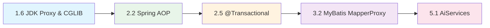
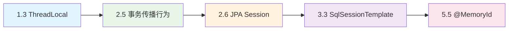
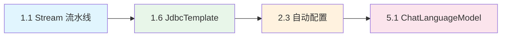
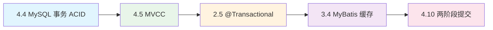
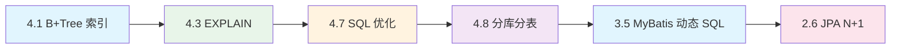

# java程序员面试

> 本文档是一份面试知识网络导航图，按"Java 核心技术 → Spring 生态体系 → MyBatis → MySQL → AI 开发"五层递进组织。每个知识点包含一句话原理、深度要点、常见陷阱和面试追问方向，帮助按图索骥查漏补缺。

## 方向一：Java 核心技术

> 覆盖面试权重 30% 的 Java 核心知识，按"语言特性 → 运行时原理 → 并发 → 数据结构 → IO → 设计"的逻辑递进。

### 1.1 Java 版本特性演进（8→11→17→21）

涵盖 Java 8/11/17/21 四个 LTS 版本的核心特性，重点理解 Lambda 编译原理、Stream 惰性求值、虚拟线程并发模型、Record 与模式匹配的语言级增强。

---

#### Lambda 与 invokedynamic

Java 8 Lambda 的编译方式与匿名内部类有本质区别：

- **匿名内部类**：javac 编译为独立的 `OuterClass$1.class` 文件，每次调用经历类加载、验证、准备完整流程
- **Lambda 表达式**：javac 生成一条 `invokedynamic` 指令，首次调用时通过 BootstrapMethods 属性中的 `LambdaMetafactory.metafactory()` 动态生成本地内部类（`Unsafe.defineAnonymousClass`），后续调用直接命中已链接的 CallSite

```java
字节码对比：
匿名内部类：
  new InnerClass                     // 创建类实例
  invokespecial InnerClass.<init>    // 调用构造器

Lambda 表达式：
  invokedynamic LambdaMetafactory    // 启动引导方法，首次链接后直接调用
```

关键优势：不产生额外 class 文件、首次调用后性能优于匿名内部类（直接 MethodHandle 调用）、延迟绑定（bootstrap 在运行时才触发）。

> **常见陷阱**：Lambda 捕获的外部变量必须是 effectively final（从 Java 8 起，匿名内部类要求 final，Lambda 要求 effectively final）。

> **关联知识点**：invokedynamic → JVM 字节码指令集 / Lambda → Stream 函数式编程 / 函数式接口 → 方法引用（`::`）

---

#### Stream 惰性求值与并行流

**惰性求值机制**：
- **中间操作**（`filter`/`map`/`sorted`/`distinct`）构建操作流水线（`AbstractPipeline`），不执行实际计算
- **终端操作**（`collect`/`forEach`/`reduce`/`count`）触发整个流水线一次性执行
- 特征：Stream 只能消费一次，终端操作后 Stream 已关闭

**并行流陷阱**：
- `parallelStream()` 默认使用 `ForkJoinPool.commonPool()`，线程数 = `Runtime.availableProcessors() - 1`
- 多个并行流共享同一线程池，一个操作阻塞（如慢 SQL）会影响所有并行任务
- 线程池中的线程不可见 `ThreadLocal` 值（`ForkJoinWorkerThread` 不继承）

```java
// 自定义 ForkJoinPool 隔离并行流
ForkJoinPool customPool = new ForkJoinPool(4);
try {
    customPool.submit(() -> list.parallelStream()
        .forEach(item -> process(item))
    ).get();
} finally {
    customPool.shutdown();
}
```

> **关联知识点**：并行流 → CompletableFuture（异步任务编排）/ 共享线程池陷阱 → 线程池隔离（1.3）/ 惰性求值 → 函数式编程思想

---

#### 虚拟线程（Java 21）

虚拟线程是 Java 21 正式 GA 的轻量级并发模型（Project Loom 的产出）：

| 维度 | 平台线程（Platform Thread） | 虚拟线程（Virtual Thread） |
|------|----------------------------|---------------------------|
| 调度者 | OS 内核 | JVM 用户态 |
| 栈大小 | 默认 1MB+ | 几 KB，动态伸缩 |
| 上下文切换 | 系统调用，微秒级 | Java 方法调用，纳秒级 |
| 最大数量 | 数千 | 数百万 |
| 适用场景 | CPU 密集 | I/O 密集（大量阻塞等待） |

**与线程池的关系**：虚拟线程非常轻量，不需要池化。每个任务直接创建新虚拟线程：

```java
// 方式一：直接创建
Thread.startVirtualThread(() -> handleRequest());

// 方式二：Executors 工厂
try (var executor = Executors.newVirtualThreadPerTaskExecutor()) {
    executor.submit(() -> handleRequest());
}
```

**不适用场景**：CPU 密集计算不适合虚拟线程。虚拟线程的 carrier 线程数量有限（通常等于 CPU 核数），长时间占用的 CPU 任务会阻塞其他虚拟线程运行。虚拟线程的优势在于大量任务处于等待（I/O）状态时的高效调度。

> **常见陷阱**：
> - 虚拟线程中使用 `synchronized` 会导致 pinning（钉住 carrier 线程），降低调度的优势
> - 使用 `ThreadLocal` 时创建成本极低，但若每个虚拟线程都使用带大对象的 ThreadLocal，内存压力反而更大
> - 虚拟线程 `pinned` 问题：`synchronized` 块或 `native` 方法中无法 yield

> **关联知识点**：虚拟线程 vs 平台线程 → 线程池（1.3）/ 虚拟线程的 carrier → 并发模型演进 / 结构化并发 → Java 21 结构化任务 API（`StructuredTaskScope`）

---

#### Record 与模式匹配

**Record（Java 14 Preview → 16 正式）** vs **Lombok @Data**：

| 特性 | Record | Lombok @Data |
|------|--------|-------------|
| 不可变性 | 是（所有字段 final） | 否（生成 setter） |
| 继承 | 隐式 final，不可继承 | 可继承 |
| equals/hashCode/toString | 自动生成（基于所有 component） | 自动生成 |
| 注解放置 | 可放在 component 上声明式传递 | 需要手动加 |
| 序列化 | 与普通类一致 | 与普通类一致 |

```java
// Record 声明
public record User(Long id, String name, String email) {}

// 等价于手动创建的包含 final 字段、全参构造器、equals/hashCode/toString 的不可变类
// 反序列化可通过规范构造器（canonical constructor）
```

**Sealed Class（Java 17 正式）**：严格控制类型层次：

```java
// 约束 Shape 只有两个子类
public sealed class Shape permits Circle, Rectangle {}
final class Circle extends Shape {}
final class Rectangle extends Shape {}
```

**Switch 模式匹配（Java 21 正式）**：

```java
// 旧写法：instanceof + 强转
if (obj instanceof String) {
    String s = (String) obj;
    System.out.println(s.length());
}

// 新写法：模式匹配 + Guard
switch (obj) {
    case String s when s.length() > 5 -> System.out.println("长字符串: " + s);
    case String s                  -> System.out.println("短字符串: " + s);
    case null                      -> System.out.println("null");
    case Integer i                 -> System.out.println("整数: " + i);
    default                        -> System.out.println("其他");
}
```

> **常见陷阱**：Record 不适合可变对象（如 JPA Entity），适合 DTO / 值对象 / 多返回值。Sealed Class 的 permit 子类必须在同一模块或同一包内。

> **关联知识点**：Record → 集合框架（1.4）中的不可变集合 / Sealed Class → 类型安全设计 / 模式匹配 → 函数式编程中的访客模式 / Switch 表达式 → 配合 Optional/Stream 简化代码

---

**追问链**：`Lambda invokedynamic 原理 → 和匿名内部类性能区别 → 为什么明确捕获的变量必须 effectively final → Stream 中间和终端操作区别 → 惰性求值原理 → 并行流 ForkJoinPool 陷阱 → 如何隔离 → 虚拟线程和平台线程区别 → 为什么不适用 CPU 密集 → pinned 问题 → 和线程池的关系 → Record 和 @Data 对比 → 什么场景用 Record → Sealed Class 解决了什么问题 → Switch 模式匹配有哪些新写法`

---

### 1.2 JVM 内存模型与垃圾回收

涵盖运行时数据区结构、GC 收集器演进（CMS→G1→ZGC）、OOM 排查实战、JMM 规范与类加载机制。

---

#### 运行时数据区

**堆分代结构**（比例非固定，默认可调）：

```text
                    堆（Heap）
┌──────────────────────────────────────────────┐
│  新生代（Young Generation）      │ 老年代      │
│  ┌─────┬────┬────┐               │ (Old/Tenured)│
│  │Eden │ S0 │ S1 │               │              │
│  │ 8   │ 1  │ 1  │               │              │
│  └─────┴────┴────┘               │              │
└──────────────────────────────────────────────┘
```

- **Eden**：新对象优先分配在 Eden，Minor GC 后将存活对象复制到 S0/S1
- **S0/S1**：From 和 To 区交替使用，保证始终有一个空区用于复制
- **老年代**：长期存活对象（默认每 Minor GC 一次年龄 +1，`-XX:MaxTenuringThreshold` 默认 15）
- **大对象**：直接进入老年代（`-XX:PretenureSizeThreshold`）

**元空间（Metaspace）vs 永久代（PermGen）**：
- **JDK 8** 移除了永久代，类元数据存储在元空间（本地内存 / Native Memory）
- 默认无上限，受本地内存限制，避免经典的 PermGen OOM
- 字符串常量池和静态变量从永久代移至堆

**栈帧结构**：每个方法调用创建一个栈帧：

| 栈帧组件 | 说明 |
|---------|------|
| 局部变量表 | this + 方法参数 + 局部变量，编译时确定大小 |
| 操作数栈 | 字节码指令的操作数，深度编译时确定 |
| 动态链接 | 指向运行时常量池的方法引用符号 |
| 方法出口 | 正常返回（PC 计数器恢复）或异常返回（异常表查找） |

> **常见陷阱**：栈溢出（`StackOverflowError`）通常来自递归无终止条件；元空间 OOM 通常来自 CGLIB/ASM 动态生成大量类（如 Spring AOP 代理无限生成）。

> **关联知识点**：栈帧 → 方法调用和递归 / 元空间 → 类加载机制 / 堆分代 → GC 收集器设计依据

---

#### GC 演进路线：CMS → G1 → ZGC

| 特性 | CMS | G1 | ZGC |
|------|-----|-----|-----|
| 引入 | JDK 5 | JDK 7 | JDK 11 实验 → JDK 15 正式 → JDK 21 分代 ZGC |
| 默认 | 可选（JDK 9 废弃，JDK 14 移除） | JDK 9+ 默认 | 需手动指定 |
| 堆结构 | 连续分代 | Region（1-32MB） | Region（动态，最多 4K 个） |
| 核心机制 | 并发标记 + 并发清除 | Region + SATB + 可预测停顿 | 染色指针 + 读屏障 + 并发 |
| 停顿目标 | 几十毫秒 | 10-200ms（可配置） | <1ms（与堆大小无关） |
| 主要问题 | 碎片 + 浮动垃圾 + 并发失败 | 大对象分配效率 | 内存开销（额外指针 64bit 系统 4%）|

**CMS 四阶段**：
1. 初始标记（STW）：标记 GC Roots 直接可达对象
2. 并发标记：从 GC Roots 出发遍历对象图
3. 重新标记（STW）：修正并发期间变动的引用
4. 并发清除：并发回收死亡对象

**G1 Region 化核心**：
- 堆划分为 1-32MB 的 Region
- `-XX:MaxGCPauseMillis=200` 设定目标停顿，G1 按回收收益排序 Region（优先回收最快释放最多空间的 Region）
- Mixed GC：同时回收年轻代 + 部分高收益老年代 Region
- SATB（Snapshot-At-The-Beginning）：并发标记时记录快照，保证标记正确性

**ZGC 染色指针**：
- 64 位指针中 42 位存地址，18 位存元数据（Finalizable / Remapped / Marked0 / Marked1）
- 无需对象头标记位，操作指针即操作标记状态
- 并发整理（压缩）不产生碎片

> **常见陷阱**：CMS 已被 JDK 14 正式移除，G1 在低延迟场景表现不如 ZGC，ZGC 在超大堆（TB 级）有明显优势但会占用更多 CPU 资源。

> **关联知识点**：GC 停顿 → JVM 调优实战 / CMS 并发标记 → 三色标记算法 / G1 SATB → RSet（Remembered Set） / ZGC 染色指针 → 指针压缩（`-XX:+UseCompressedOops`）

---

#### OOM 排查流程

**命令工具链**：

```bash
# 查看堆配置和使用量
jmap -heap <pid>

# 对象统计（按实例数降序，live 参数触发 Full GC 后统计）
jmap -histo:live <pid> | head -20

# 线程栈 + 死锁检测
jstack <pid>

# GC 状态每秒查看（S0/S1/Eden/Old 使用率 + GC 次数/时间）
jstat -gcutil <pid> 1000

# 导出 heap dump（live 参数只保留存活对象，文件更小）
jmap -dump:live,format=b,file=/tmp/heap.hprof <pid>
```

**MAT (Memory Analyzer) 分析步骤**：

```text
1. 打开 heap dump → 自动生成 Leak Suspects Report
2. Suspects 视图 → 查看疑似泄漏的 GC Root 到对象的引用链
3. Dominator Tree → 按"支配树"查看最大对象的引用路径
   └─ 找支配树中最大的对象，看谁引用了它（传入引用 / incoming references）
4. 检查常见泄漏模式：
   - ThreadLocalMap Entry 中 key=null 但 value 仍在
   - HashMap 中大量 Entry 堆积
   - ClassLoader 泄漏（热部署场景）
```

> **常见陷阱**：
> - `jmap -dump` 导 heap dump 时会触发 Full GC，生产环境谨慎使用
> - 推荐使用 `jcmd <pid> GC.heap_dump /tmp/heap.hprof`（JDK 8+）
> - Arthas 的 `heapdump` 命令支持只 dump 存活对象

> **关联知识点**：OOM 排查 → 引用类型（强/软/弱/虚）/ MAT 支配树 → 内存泄漏模式 / heap dump → 日志分析（GC log + `-XX:+PrintGCDetails`）

---

#### JMM 与 happens-before

JMM（Java Memory Model）定义线程间的通信规范，不涉及具体 JVM 实现，是跨平台的抽象规范。

**核心规则**（happens-before）：

| 规则 | 说明 |
|------|------|
| 程序次序规则 | 同一个线程中，写在前面的操作 happens-before 后面的操作 |
| volatile 规则 | 对 volatile 变量的写 happens-before 后续任何对该变量的读 |
| 锁规则 | unlock happens-before 后续的 lock |
| 线程启动规则 | `Thread.start()` happens-before 被启动线程中的任何操作 |
| 线程终止规则 | 线程中所有操作 happens-before `Thread.join()` 返回 |
| 传递性 | A happens-before B, B happens-before C → A happens-before C |

```java
// volatile 规则示例：保证 flag 的可见性
volatile boolean flag = false;
int data = 0;

// 线程 A
data = 42;      // 1
flag = true;    // 2 — volatile 写

// 线程 B
if (flag) {     // 3 — volatile 读（看到 flag=true → 也看到 data=42）
    System.out.println(data); // 输出 42 而不是 0
}
```

根据 happens-before 传递性：2 happens-before 3（volatile 规则），1 happens-before 2（程序次序规则），因此 1 happens-before 3，线程 B 一定看到 data=42。

> **常见陷阱**：volatile 保证可见性但不保证原子性（`count++` 仍需要 synchronized 或 AtomicInteger）。JMM 是规范，JVM 实现通过插入内存屏障达成。

> **关联知识点**：JMM → volatile（1.3）/ happens-before → 并发编程三大特性（原子性、可见性、有序性）/ 锁规则 → synchronized 锁升级（1.3）

---

#### 双亲委派模型与打破场景

**双亲委派模型**：

```text
Bootstrap ClassLoader（C++ 实现，加载 rt.jar / java.base）
        ↑ 委派
Extension / Platform ClassLoader（JDK 9 改名为 Platform）
        ↑ 委派
Application ClassLoader（加载 classpath）
        ↑ 委派
自定义 ClassLoader
```

工作机制：加载类时先委托给父加载器，父无法加载时才自己加载。保障基础类（`java.lang.Object`）的统一性。

**三种打破场景**：

1. **SPI 机制（JDBC）**：DriverManager 由 Bootstrap ClassLoader 加载，但需要加载厂商实现的 JDBC 驱动 → 使用 `Thread.currentThread().getContextClassLoader()` 打破
2. **Tomcat 容器**：每个 Web 应用独立 WebAppClassLoader，优先加载 Web 应用的类，实现应用隔离和热部署（重新创建 ClassLoader 替换）
3. **OSGi 模块化**：网状加载模型，类加载器之间相互委托，基于包的导入导出规则

```java
// JDBC SPI 打破双亲委派示例
// DriverManager（BootstrapClassLoader 加载）通过 SPI 加载 MySQL 驱动
// 实际使用的是 Thread Context ClassLoader
ServiceLoader<Driver> drivers = ServiceLoader.load(Driver.class);
```

> **关联知识点**：双亲委派 → 类加载隔离 / SPI 打破 → Spring Boot 自动配置（2.3）/ Tomcat 打破 → 热部署原理 / 类加载 → 元空间 OOM

---

**追问链**：`运行时数据区 → 堆分代结构 → 对象什么时候进入老年代 → 元空间比永久代好在哪 → 栈帧有哪些部分 → CMS 并发标记过程 → G1 Region 设计为什么能预测停顿 → ZGC 染色指针是什么 → 和指针压缩什么关系 → OOM 排查流程 → MAT 怎么用 → JMM 的 happens-before 规则 → volatile 规则保证了什么 → 和内存屏障什么关系 → 双亲委派模型 → 什么时候需要打破 → SPI/Tomcat/OSGi 三种打破场景 → 和 Spring Boot 自动配置的关系`

---

### 1.3 并发编程

从底层 CPU 原语到高层异步编排的完整并发知识链。同步 / 锁 / 线程池 / 异步编排构成面试中占比最高的 Java 核心模块。

---

#### synchronized 锁升级（JDK 6 优化）

synchronized 经历了从重量级到轻量级的持续优化。

**Mark Word 布局**（64-bit JVM）：

```text
锁状态       | 标志位 | Mark Word 内容
无锁/偏向    | 01    | 偏向线程 ID + epoch + 分代年龄 + 1（偏向位）
轻量级锁     | 00    | 指向栈中 Lock Record 的指针
重量级锁     | 10    | 指向 Monitor（ObjectMonitor）的指针
GC 标记      | 11    | （GC 时使用）
```

**锁升级全链**：

```text
无锁 → 偏向锁 → 轻量级锁（CAS 自旋） → 重量级锁（OS 互斥量）

偏向锁：
  Mark Word 记录线程 ID → 同线程重入只检查 ID，无需 CAS
  批量撤销/重偏向：当一个类的偏向锁被频繁撤销 → 禁用偏向锁
  （JDK 15 默认关闭偏向锁，因其在高并发应用中的维护成本 > 收益）

轻量级锁：
  线程在自己的栈帧中创建 Lock Record
  通过 CAS 将 Mark Word 替换为 Lock Record 指针
  多个线程竞争时 CAS 失败 → 自旋等待 → 自旋超过阈值 → 膨胀为重量级

重量级锁：
  CAS 失败次数超过阈值 → 膨胀为 ObjectMonitor
  _EntryList 阻塞队列 → _WaitSet 等待队列（wait/notify）
  进入内核态，线程阻塞
```

> **常见陷阱**：JDK 15+ 默认关闭偏向锁（`-XX:-UseBiasedLocking`）。锁升级是单向的，不能降级。wait/notify 只能在 synchronized 块中使用。

> **关联知识点**：synchronized → Mark Word 对象头 / Monitor 实现 → AQS 的相似思路 / 锁升级 → CAS 原理 / synchronized 与 ReentrantLock 对比

---

#### AQS（AbstractQueuedSynchronizer）

JUC 锁和同步器的基石，核心三要素：

**CLH 队列变体**：
- 双向链表（Node 节点），头节点持有锁
- 后继节点通过 `LockSupport.park()/unpark()` 阻塞/唤醒
- 公平锁：新线程入队尾；非公平锁：新线程先 CAS 抢锁，失败再入队

**state**：
- `volatile int state`，表示同步状态
- ReentrantLock：0=未锁定，>0=重入次数
- Semaphore：剩余许可数
- CountDownLatch：计数

**Condition**：
- 内部维护 `ConditionObject` 等待队列（单向链表）
- `await()`：释放锁，入队等待队列，挂起
- `signal()`：等待队列头节点移到同步队列

```java
// AQS 独占模式核心骨架（简化理解）
public final void acquire(int arg) {
    if (!tryAcquire(arg) &&              // 子类实现：CAS 尝试获取
        acquireQueued(addWaiter(Node.EXCLUSIVE), arg)) // 入队 + 自旋/阻塞
        selfInterrupt();
}
```

**基于 AQS 的实现**：
- `ReentrantLock`（独占模式 + Condition）
- `CountDownLatch`（共享模式，count=0 时释放所有等待线程）
- `Semaphore`（共享模式，state 表示剩余许可）
- `CyclicBarrier`（基于 ReentrantLock + Condition 实现）
- `ReentrantReadWriteLock`（独占 + 共享双模式）

> **关联知识点**：AQS → ReentrantLock / AQS CLH 队列 → Condition / AQS 共享模式 → CountDownLatch / AQS → synchronized Monitor 的异同

---

#### CAS 与 ABA 问题

**CAS 操作**：`Unsafe.compareAndSwapObject()` 底层调用 CPU `cmpxchg` 指令，比较当前值与预期值，相等则交换。

```java
// AtomicInteger.incrementAndGet 底层：CAS 循环
public final int incrementAndGet() {
    for (;;) {
        int current = get();
        int next = current + 1;
        if (compareAndSet(current, next))  // CAS 成功则返回
            return next;                   // 失败则重试
    }
}
```

**ABA 问题**：从 A 改为 B 再改回 A，CAS 无法感知中间变化。

```java
// 解决方案：AtomicStampedReference 带版本号
AtomicStampedReference<String> ref = new AtomicStampedReference<>("A", 0);
int[] stamp = new int[1];
String value = ref.get(stamp);   // value="A", stamp[0]=0
ref.compareAndSet("A", "B", stamp[0], stamp[0] + 1); // stamp → 1
ref.compareAndSet("B", "A", stamp[0], stamp[0] + 1); // stamp → 2
// 其他线程通过 stamp 可以感知到版本已变化
```

> **常见陷阱**：CAS 在竞争激烈时会导致大量自旋浪费 CPU（"自旋风暴"）。ABA 问题在部分场景不敏感（如计数器），但在链表操作中可能导致严重 bug。

> **关联知识点**：CAS → Atomic 系列类（AtomicInteger/AtomicLong/AtomicReference）/ CAS 自旋 → synchronized 轻量级锁自旋 / ABA → AtomicStampedReference → 数据库乐观锁版本号思路一致

---

#### volatile 与内存屏障

**volatile 语义**：
- **可见性**：volatile 写立即刷入主存，读从主存获取
- **有序性**：禁止 JIT 编译器和 CPU 对该变量的指令重排序
- **不保证原子性**：`volatile int count++;` 不是原子操作

**四种内存屏障类型**：

| 屏障类型 | 指令示例 | 语义 |
|---------|---------|------|
| LoadLoad | Load1 → LoadLoad → Load2 | Load1 数据加载先于 Load2 |
| LoadStore | Load1 → LoadStore → Store2 | Load1 先于 Store2 刷新 |
| StoreStore | Store1 → StoreStore → Store2 | Store1 数据对其他处理器可见先于 Store2 |
| StoreLoad | Store1 → StoreLoad → Load2 | 最重屏障，Store1 对所有人可见后才 Load2 |

**DCL 为什么需要 volatile**：

```java
public class Singleton {
    private static volatile Singleton instance;  // ← volatile 必不可少

    public static Singleton getInstance() {
        if (instance == null) {
            synchronized (Singleton.class) {
                if (instance == null) {
                    instance = new Singleton();
                    // ① 分配内存空间
                    // ② 初始化对象
                    // ③ 将 instance 指向分配的内存地址
                    // 不加 volatile：②③ 可能重排为 ①③②
                    // 线程 B 在 ③ 之后读到 instance != null → 访问未初始化的对象
                }
            }
        }
        return instance;
    }
}
```

**不使用 volatile 的风险**：`instance = new Singleton()` 三个步骤可能被 JIT 重排为 `① → ③ → ②`。线程 B 在第 ③ 步完成后读到 `instance != null`，但对象尚未初始化，调用方法导致空指针。

**替代方案**：静态内部类也可以做到懒加载和线程安全，不需要 volatile：

```java
public class Singleton {
    private Singleton() {}
    private static class Holder {
        static final Singleton INSTANCE = new Singleton();
    }
    public static Singleton getInstance() {
        return Holder.INSTANCE;  // 类加载机制保证线程安全
    }
}
```

> **常见陷阱**：volatile 不保证复合操作的原子性，64 位变量（long/double）的读写在非 volatile 情况下可能被拆分为两次 32 位操作。

> **关联知识点**：volatile → JMM happens-before 规则 / DCL → 单例模式（1.6）/ 内存屏障 → CPU 乱序执行 / 可见性 → CPU 缓存一致性协议（MESI）

---

#### ThreadLocal 内存泄漏

**引用链**：

```text
Thread
  └─ ThreadLocalMap
       └─ Entry（弱引用）─ key: ThreadLocal<?>
                  └─（强引用）─ value: Object
```

**泄漏根源**：
- Entry 的 key 是弱引用（`WeakReference<ThreadLocal>`），GC 时 key 被回收 → key = null
- Value 是强引用，只要 Thread 仍然存活，value 就一直可达
- Entry 只在 `get()`/`set()`/`remove()` 时被动清理 stale entries
- 线程池中线程被复用，一直存活 → value 永远无法回收

```java
// 正确用法：必须 finally remove
private static final ThreadLocal<Context> contextHolder = new ThreadLocal<>();

public void process() {
    try {
        contextHolder.set(new Context(...));
        // ... 业务逻辑
    } finally {
        contextHolder.remove();  // 必须清理，防止内存泄漏
    }
}
```

**伪内存泄漏**：即使 key 变为 null，value 仍被线程引用，无法回收。长期运行的线程池任务尤其需要注意。

**替代方案**：
- `InheritableThreadLocal`：子线程继承父线程的 ThreadLocal 值（线程池中不适用，线程池复用线程不会重新继承）

> **关联知识点**：ThreadLocal 隔离 → ChatMemory @MemoryId 会话隔离（5.5）/ 弱引用引用链 → 引用类型（软/弱/虚）/ remove 模式 → try-finally 最佳实践 / ThreadLocal 在线程池中 → 异步任务上下文传递

---

#### 线程池核心参数

**ThreadPoolExecutor 7 大参数**：

| 参数 | 说明 |
|------|------|
| `corePoolSize` | 核心线程数，即使空闲也不会被回收（除非 allowCoreThreadTimeOut） |
| `maximumPoolSize` | 最大线程数 |
| `keepAliveTime` + `unit` | 非核心线程空闲存活时间 |
| `workQueue` | 阻塞队列（`ArrayBlockingQueue` / `LinkedBlockingQueue` / `SynchronousQueue` / `PriorityBlockingQueue`）|
| `threadFactory` | 线程工厂（建议自定义命名） |
| `handler` | 拒绝策略 |

**任务流程**：

```text
提交任务
  ↓
核心线程是否满？
  否 → 创建核心线程执行
  是 ↓
工作队列是否满？
  否 → 入队等待
  是 ↓
当前线程数 < maximumPoolSize？
  是 → 创建非核心线程执行
  否 ↓
执行拒绝策略
```

**拒绝策略**：
- `AbortPolicy`（默认）：抛 `RejectedExecutionException`
- `CallerRunsPolicy`：调用者线程执行（背压）
- `DiscardPolicy`：静默丢弃
- `DiscardOldestPolicy`：丢弃队列头任务

```java
// 最佳实践：自定义命名 + 合理参数
ThreadPoolExecutor executor = new ThreadPoolExecutor(
    4,                                  // corePoolSize
    8,                                  // maximumPoolSize
    60L, TimeUnit.SECONDS,             // keepAliveTime
    new LinkedBlockingQueue<>(1000),    // 有界队列，避免 OOM
    new ThreadFactoryBuilder()
        .setNameFormat("biz-pool-%d")
        .build(),                       // 可识别线程名（Guava 或自定义）
    new ThreadPoolExecutor.CallerRunsPolicy() // 背压
);
```

**线程数估算**：

```text
CPU 密集：Ncpu + 1（如 4 核 → 5 个线程）
IO 密集：2 * Ncpu（或更大，取决于等待时间占比）
公式：线程数 = Ncpu * (1 + 等待时间 / 计算时间)
```

**为什么禁止 Executors**：
- `Executors.newCachedThreadPool()`：最大线程数为 Integer.MAX_VALUE，可能创建过多线程导致 OOM
- `Executors.newFixedThreadPool()`：队列为无界 `LinkedBlockingQueue`，请求堆积可能导致 OOM
- **统一使用 `new ThreadPoolExecutor(...)` 手动指定参数**，明确边界

> **常见陷阱**：动态调参使用 `setCorePoolSize()` / `setMaximumPoolSize()` 需结合队列监控。队列满了再扩线程的机制在某些低频突增场景不够灵敏，可结合 `Semaphore` 做前置限流。

> **关联知识点**：线程池 → 虚拟线程（1.1）对比（池化 vs 按需创建）/ 线程池拒绝策略 → Sentinel 熔断降级（2.8）/ 线程池隔离 → Hystrix 线程池隔离模式 / 有界队列 → 系统容量规划

---

#### CompletableFuture 异步编排

CompletableFuture 提供了声明式的异步任务编排能力：

```java
// 基础用法
CompletableFuture.supplyAsync(() -> fetchUser(userId), executor)
    .thenApply(user -> enrichUser(user))            // 同步转换
    .thenCompose(enriched -> fetchOrders(enriched))  // 异步 flatMap
    .orTimeout(3, TimeUnit.SECONDS)                  // 超时控制
    .exceptionally(ex -> {
        log.error("处理失败", ex);
        return defaultResult();
    });

// 多个任务并行
CompletableFuture<User> userFuture = CompletableFuture.supplyAsync(() -> findUser(id), executor);
CompletableFuture<Config> configFuture = CompletableFuture.supplyAsync(() -> loadConfig(), executor);

CompletableFuture.allOf(userFuture, configFuture)
    .thenApply(v -> combine(userFuture.join(), configFuture.join()))
    .orTimeout(5, TimeUnit.SECONDS);
```

**核心方法分类**：

| 类别 | 方法 | 说明 |
|------|------|------|
| 同步转换 | `thenApply(Function)` | 对结果同步转换 |
| 异步 flatMap | `thenCompose(Function)` | 返回新的 CompletableFuture，解嵌套 |
| 消费 | `thenAccept(Consumer)` | 消费结果不返回值 |
| 并行等待 | `allOf(CompletableFuture...)` | 所有完成 |
| 任一完成 | `anyOf(CompletableFuture...)` | 任一完成即返回 |
| 超时 | `orTimeout(long, TimeUnit)`（JDK 9+） | 超时异常 |
| 异常恢复 | `exceptionally(Function)` | 异常时提供默认值 |
| 双向组合 | `thenCombine(CompletableFuture, BiFunction)` | 两个结果一起处理 |

> **常见陷阱**：
> - `thenApply` vs `thenCompose`：thenApply 返回的是计算结果，thenCompose 返回的是一个新的 CompletableFuture，用于扁平化
> - `allOf` 返回 `CompletableFuture<Void>`，需要通过 `.join()` 获取各子任务结果
> - 默认使用 `ForkJoinPool.commonPool()`，务必传入自定义线程池

> **关联知识点**：CompletableFuture → 并行流对比 / 异步编排 → AI Streaming（5.6）onNext 回调 / thenCompose → 函数式编程 flatMap / allOf → 并发聚合 / orTimeout → 超时降级模式

---

**追问链**：`synchronized 锁升级全链 → Mark Word 结构 → 偏向锁为什么 JDK 15 默认关闭 → AQS 核心原理 → CLH 队列 → state 含义 → Condition 作用 → 基于 AQS 实现了哪些同步器 → CAS 原理 → ABA 问题 → AtomicStampedReference → volatile 可见性和有序性 → 四种内存屏障 → DCL 为什么要 volatile → 替代方案静态内部类 → ThreadLocal 引用链 → 为什么内存泄漏 → remove 最佳实践 → 线程池 7 参数 → 任务流程 → IO/CPU 密集估算 → 为什么禁止 Executors → CompletableFuture thenApply/thenCompose区别 → allOf 获取结果方式 → 和虚拟线程什么关系 → ChatMemory @MemoryId 和 ThreadLocal 隔离思路的类比`

---

### 1.4 集合框架

覆盖面试最高频的集合类源码分析，重点理解 HashMap 核心机制、线程安全集合的实现演进、以及 LRU 缓存的设计思路。

---

#### Collection 框架概览：List vs Set vs Map

Collection 框架是 Java 集合体系的核心，面试中经常从顶层设计问起，需要清晰掌握三大家族的定位差异。

**继承结构**：

```text
Iterable（可迭代）
  └─ Collection（集合）
       ├─ List（有序、可重复、索引访问）
       │    ├─ ArrayList  ← 动态数组，随机访问 O(1)
       │    └─ LinkedList ← 双向链表，两端操作 O(1)
       ├─ Set（不可重复、无索引）
       │    ├─ HashSet       ← 基于 HashMap，无序，O(1)
       │    ├─ LinkedHashSet ← 基于 LinkedHashMap，插入顺序
       │    └─ TreeSet       ← 基于 TreeMap（红黑树），排序，O(log n)
       └─ Queue（本指南不展开）

Map（key-value 映射，独立于 Collection）
  ├─ HashMap      ← 散列表，无序
  ├─ LinkedHashMap← 散列表+双向链表，可排序/维持顺序
  └─ TreeMap      ← 红黑树，自动排序
```

> **常见陷阱**：Collection（接口） 与 Collections（工具类） 不要混淆——Collections 提供 `sort()`/`unmodifiableList()`/`synchronizedList()` 等静态方法。

---

##### List 接口：有序、可重复、索引访问

**List 三要素**：

| 特性 | 说明 | 面试考点 |
|------|------|---------|
| 有序 | 元素按插入顺序排列 | 插入顺序不是排序 |
| 可重复 | 允许 null 和重复元素 | equals() 判断重复 |
| 索引访问 | 通过 `get(index)` 随机访问 | ArrayList → O(1)，LinkedList → O(n) |

**ArrayList vs LinkedList 选择决策**：

| 维度 | ArrayList | LinkedList |
|------|-----------|------------|
| 底层结构 | 动态数组（Object[]） | 双向链表（Node） |
| 随机访问 get(i) | O(1) — 数组下标直达 | O(n) — 从头/尾遍历 |
| 尾部添加 add(e) | O(1) 均摊（扩容时 O(n)） | O(1) — 链尾追加 |
| 中间插入/删除 | O(n) — 元素位移 | O(n) 查找 + O(1) 断链 |
| 内存占用 | 紧凑（仅存数据） | 更高（每个元素存 prev/next 指针 + 数据） |
| 扩容机制 | 默认 1.5 倍（`grow()` → `newCapacity = oldCapacity + (oldCapacity >> 1)`） | 无需扩容 |

> 面试追问：**ArrayList 扩容后原来的元素怎么处理？** → `Arrays.copyOf()` 调用 `System.arraycopy()` 原生方法复制到新数组，本质上是一个 O(n) 操作。所以如果预知数据量，使用 `new ArrayList<>(initialCapacity)` 指定初始容量可以避免多次扩容。

---

##### Set 接口：不可重复、无索引

**Set 三要素**：

| 特性 | 说明 |
|------|------|
| 不可重复 | 通过 `equals()` 和 `hashCode()` 判重，`add()` 返回 false 表示重复 |
| 无索引 | 没有 `get(index)`——无序结构无法索引 |
| null 值 | HashSet 允许一个 null；TreeSet 不允许 null（会出 NPE） |

**HashSet vs LinkedHashSet vs TreeSet**：

| 维度 | HashSet | LinkedHashSet | TreeSet |
|------|---------|---------------|---------|
| 底层 | HashMap | LinkedHashMap | TreeMap（红黑树） |
| 顺序 | 无序（哈希决定） | 插入顺序 | 自然排序 / Comparator |
| 性能 | O(1) | O(1)（略高，维护双向链表） | O(log n) |
| null | 允许 1 个 | 允许 1 个 | 不允许 |
| 适用 | 默认选择 | 需保持插入顺序 | 需自动排序 |

> **常见陷阱**：Set 判重的关键是 `hashCode()` 和 `equals()` 必须一致（相等的对象必须有相同的 hashCode）。如果只重写 equals 不重写 hashCode，HashSet 会误判为不同元素，允许重复添加。

---

##### HashSet vs HashMap

**最根本的关系**：HashSet 底层就是 HashMap，面试问到 HashSet 的源码时，其实就是在问 HashMap。

```java
// HashSet 核心源码 —— 一个包装
public class HashSet<E> {
    // 核心：HashSet 内部持有 HashMap 实例
    private transient HashMap<E, Object> map;

    // PRESENT 是一个静态占位对象，value 永远是它
    private static final Object PRESENT = new Object();

    public HashSet() {
        map = new HashMap<>();           // 初始化一个 HashMap
    }

    public boolean add(E e) {
        return map.put(e, PRESENT) == null;  // 元素作为 key，PRESENT 作为 value
    }

    public boolean remove(Object o) {
        return map.remove(o) == PRESENT;
    }

    public boolean contains(Object o) {
        return map.containsKey(o);       // 利用 HashMap 的 O(1) 查找
    }

    public int size() {
        return map.size();
    }
}
```

| 对比维度 | HashMap | HashSet |
|---------|---------|---------|
| 存储内容 | key-value 键值对 | 单个元素（内部作为 HashMap 的 key） |
| 底层实现 | 数组+链表+红黑树 | 直接使用 HashMap 实例 |
| 重复判断 | key 重复 → 覆盖 value | add 重复 → 返回 false |
| null 支持 | 一个 null key，多个 null value | 允许一个 null 元素 |
| 使用场景 | 键值映射 | 唯一元素集合 |
| 序列化 | 自定义序列化 | 独立序列化（遍历 map.keySet()） |

> **一句话记法**：HashSet 就是"假装自己没有 value 的 HashMap"——元素作为 key，value 统一用一个占位常量 PRESENT。

> **关联知识点**：HashSet → HashMap 继承体系 / Set 判重 → equals + hashCode 契约 / TreeSet → 红黑树 / LinkedHashSet → LinkedHashMap

---

#### HashMap：put/get 全流程与 JDK 7 vs 8

**数据结构演进**：

| 维度 | JDK 7 | JDK 8 |
|------|-------|-------|
| 底层结构 | 数组 + 链表 | 数组 + 链表 + 红黑树 |
| 插入方式 | 头插法 | 尾插法 |
| 哈希算法 | 9次扰动（4次位运算 + 5次异或） | 1次扰动（高位异或） |
| 树化 | 不支持 | 链表长度 >= 8 转红黑树 |
| 扩容 rehash | 重新计算 hash | 原位置 or 原位置 + oldCap |

**put 方法全流程**（JDK 8）：

```java
// HashMap.put 方法核心逻辑（简化）
public V put(K key, V value) {
    Node<K,V>[] tab; Node<K,V> p; int n, i; K k; V e;

    // 1. 计算 hash：key.hashCode() 高 16 位与低 16 位异或
    int h = (key == null) ? 0 : key.hashCode();
    int hash = (key == null) ? 0 : h ^ (h >>> 16);

    // 2. 数组为空 → 扩容（resize）
    if ((tab = table) == null || (n = tab.length) == 0)
        n = (tab = resize()).length;

    // 3. 计算桶下标：(n - 1) & hash
    // 4. 桶为空 → 直接插入
    if ((p = tab[i = (n - 1) & hash]) == null)
        tab[i] = newNode(hash, key, value, null);
    else {
        // 5. 桶不为空 → 遍历链表/红黑树
        if (p.hash == hash && ((k = p.key) == key || (key != null && key.equals(k))))
            e = p;  // 找到相同 key → 覆盖
        else if (p instanceof TreeNode)
            e = ((TreeNode<K,V>)p).putTreeVal(this, tab, hash, key, value);
        else {
            for (int binCount = 0; ; ++binCount) {
                // 尾插法追加到链表末尾
                if ((e = p.next) == null) {
                    p.next = newNode(hash, key, value, null);
                    // 链表长度 >= 8 时树化
                    if (binCount >= TREEIFY_THRESHOLD - 1)
                        treeifyBin(tab, hash);
                    break;
                }
                if (e.hash == hash && ((k = e.key) == key || (key != null && key.equals(k))))
                    break;
                p = e;
            }
        }
    }
    // 6. 键值对数量 > threshold（容量 * 负载因子）→ 扩容
    if (++size > threshold)
        resize();
}
```

**get 流程**：计算 hash → 定位桶 → 检查第一个节点 → 红黑树查找 → 链表遍历。

**为什么容量是 2 的幂**：

- 计算桶下标使用 `(n - 1) & hash` 替代 `hash % n`，位运算远快于取模
- 当 `n = 2^k` 时，`(n - 1) & hash` 等价于 `hash % n`
- 扩容后，元素要么在原位置（高位为 0），要么在原位置 + oldCap（高位为 1），rehash 时直接通过新增高位判断，无需重新计算 hash

**负载因子为什么是 0.75**：

- 时间与空间的折中。负载因子越大（如 0.9），空间利用率高但冲突概率增加、查询效率下降；负载因子越小（如 0.5），冲突少但扩容频繁、空间浪费
- 在负载因子 0.75 的条件下，每个桶的节点数近似服从泊松分布（λ ≈ 0.5），一个桶中出现 8 个以上节点的概率约为 0.00000006，因此红黑树化阈值设为 8 是合理的

**红黑树化 / 退化条件**：

| 条件 | 动作 | 原因 |
|------|------|------|
| 链表长度 >= 8（且数组长度 >= 64）| 树化 | 链表查询 O(n) 退化严重 |
| 链表长度 >= 8（数组长度 < 64）| 扩容而非树化 | 短数组下扩容比树化收益更高 |
| 树节点数 <= 6 | 退化为链表 | 避免树与链表频繁转换的开销 |

**JDK 7 头插法死循环**：

多线程场景下，JDK 7 的 `resize()` 使用头插法迁移元素，扩容后两个线程同时操作导致环形链表：

```text
线程 A 迁移：e → A → B → C（正常）
线程 B 并发扩容：头插法倒序迁移
结果：A.next = B, B.next = A（环形链表）
后续 get(key) 遍历链表 → 死循环
```

JDK 8 改为尾插法 + 扩容后元素相对位置不变（高位为 0 留在原位置，高位为 1 移到 oldCap+原位置），从根本上解决了死循环问题（但 HashMap 仍不支持并发，并发请用 ConcurrentHashMap）。

> **常见陷阱**：
> - HashMap 的 key 可变时（如放入后修改对象字段），hashCode 变化导致再也无法 get 到
> - null key 存储在 table[0]，null value 允许
> - 红黑树化条件中的 `MIN_TREEIFY_CAPACITY = 64` 经常被忽略
> - JDK 8 修复了死循环但不代表 HashMap 线程安全

> **关联知识点**：HashMap → ConcurrentHashMap（线程安全）/ 红黑树 → 数据结构 / 2 的幂扩容 → 位运算优化 / 负载因子 → 哈希表设计原理

---

#### ConcurrentHashMap：JDK 7 Segment → JDK 8 CAS+synchronized

| 维度 | JDK 7 | JDK 8 |
|------|-------|-------|
| 同步机制 | Segment（继承 ReentrantLock）分段锁 | CAS + synchronized 锁桶首节点 |
| 锁粒度 | 默认 16 个 Segment，并发度 16 | 单个桶（可扩容到数千桶），并发度更高 |
| 定位 | 两次哈希（Segment → 桶） | 一次哈希（直接定位桶） |
| 查询性能 | 读操作不加锁但使用 volatile | 读操作不加锁（Node.val 和 next 均为 volatile）|
| 扩容 | Segment 内部独立扩容 | 多线程协助扩容（TransferTask） |

**JDK 8 put 流程**：

```java
// ConcurrentHashMap.putVal（JDK 8，简化）
final V putVal(K key, V value, boolean onlyIfAbsent) {
    for (Node<K,V>[] tab = table;;) {
        // 1. 桶为空 → CAS 无锁插入
        if ((f = tabAt(tab, i = (n - 1) & hash)) == null) {
            if (casTabAt(tab, i, null, new Node<K,V>(hash, key, value)))
                break;  // CAS 成功即完成，无需加锁
        }
        // 2. 正在扩容 → 协助迁移（ForwardingNode）
        else if ((fh = f.hash) == MOVED)
            tab = helpTransfer(tab, f);
        // 3. 桶非空 → synchronized 锁桶首节点
        else {
            synchronized (f) {
                // 插入链表或红黑树
            }
        }
    }
}
```

**size() 统计 —— CounterCell**：

- 维护一个 `baseCount` 和 `CounterCell[]` 数组
- 低竞争时 CAS 更新 `baseCount`；CAS 失败时更新 `CounterCell` 中随机位置的计数
- `size()` 调用时求和 `baseCount + sum(CounterCell[])`，避免全局加锁

> **常见陷阱**：
> - JDK 8 的 size() 是一个近似值（弱一致性），不是精确值
> - ConcurrentHashMap 的迭代器是弱一致性（weakly consistent），迭代过程中修改不会抛 `ConcurrentModificationException`
> - 不支持 `null` key 和 `null` value

> **关联知识点**：ConcurrentHashMap → CAS（1.3）/ synchronized（1.3）/ 红黑树 → 数据结构 / ForwardingNode → 扩容迁移设计

---

#### CopyOnWriteArrayList：读写分离

**写时复制机制**：

```java
// CopyOnWriteArrayList.add 核心
public boolean add(E e) {
    final ReentrantLock lock = this.lock;
    lock.lock();  // 写操作加锁
    try {
        Object[] elements = getArray();
        int len = elements.length;
        Object[] newElements = Arrays.copyOf(elements, len + 1);  // 复制新数组
        newElements[len] = e;
        setArray(newElements);  // 替换引用
    } finally {
        lock.unlock();
    }
}

// 读操作不加锁
public E get(int index) {
    return getArray()[index];  // 直接读数组引用
}
```

**核心特点**：
- 读操作完全无锁，性能极高
- 写操作复制完整新数组（内存开销翻倍），适合读多写少场景
- 迭代器基于创建时的数组快照，遍历过程中修改不可见（弱一致性）

| 特性 | CopyOnWriteArrayList | Vector | Collections.synchronizedList |
|------|---------------------|--------|------------------------------|
| 读性能 | 高（无锁） | 低（synchronized） | 低（synchronized） |
| 写性能 | 低（数组复制） | 中 | 中 |
| 一致性 | 弱（快照读） | 强（互斥） | 强（互斥） |
| 适用场景 | 读多写少（配置/黑名单） | 已淘汰 | 简单同步 |

**为什么没有 ConcurrentArrayList**：因为 ArrayList 的随机访问是基于数组下标的精确位置，无法像 ConcurrentHashMap 那样分桶加锁而不破坏语义。ConcurrentHashMap 能分桶是因为键值对通过对 key 哈希分散到不同桶，换句话说是**哈希表的分桶特性天然支持分段并发**。

> **常见陷阱**：
> - 批量写入场景性能极差（每次 add 复制整个数组），考虑使用 `addAllAbsent()` 批量操作
> - 写操作不应放在热点路径上
> - 迭代器不反映最新数据，长时间持有迭代器可能导致读取到过时数据

> **关联知识点**：CopyOnWriteArrayList → ConcurrentHashMap 对比（为什么后者能做分段） / 读写分离思想 → 数据库读写分离设计 / 弱一致性 → 并发集合整体设计思路

---

#### LinkedHashMap 实现 LRU 缓存

LinkedHashMap 继承了 HashMap，在 Entry 中增加了 `before/after` 双向链表来维护元素顺序：

```java
// 实现 LRU 缓存 —— 模板方法模式
public class LRUCache<K, V> extends LinkedHashMap<K, V> {
    private final int maxCapacity;

    public LRUCache(int maxCapacity) {
        // accessOrder=true：访问顺序（不是插入顺序）
        super(maxCapacity, 0.75f, true);
        this.maxCapacity = maxCapacity;
    }

    // removeEldestEntry 在每次 put() 后回调
    // 返回 true 时移除最久未访问的条目（链表头部）
    @Override
    protected boolean removeEldestEntry(Map.Entry<K, V> eldest) {
        return size() > maxCapacity;
    }
}
```

**关键机制**：
- `accessOrder=true`：每次 `get()` 或 `put()` 已有 key 时，将该 Entry 移动到链表尾部（最近访问）
- `put()` 完成后回调 `removeEldestEntry()`，决定是否移除链表头部 Entry（最久未访问）
- 配合 `final` 方法 + `afterNodeAccess()` / `afterNodeInsertion()` 钩子（模板方法模式）

LinkedHashMap 本身不是线程安全的，LRU 缓存在多线程场景下需配合 `Collections.synchronizedMap()` 或使用 `ReentrantLock`。

> **常见陷阱**：
> - accessOrder 是构造器第三个参数，默认 false（插入顺序）
> - removeEldestEntry 只在 put/putAll 后回调，get 不会触发移除
> - 线程安全需要外层加锁

> **关联知识点**：LinkedHashMap → HashMap 继承体系 / 模板方法 → 设计模式（1.6）/ LRU → 缓存淘汰策略（Redis、Guava Cache 的相似思路）

---

**追问链**：`Collection 框架结构 → List vs Set vs Map 三大家族 → ArrayList vs LinkedList 选择（随机访问 O(1) vs O(n)，两端插入 O(1) vs O(n)）→ 扩容机制 1.5 倍 → HashSet vs LinkedHashSet vs TreeSet → Set 判重必须 equals+hashCode 一致 → HashSet 底层是 HashMap → add(e)→map.put(e,PRESENT) → HashMap put 流程 → 为什么 2 的幂扩容 → 为什么负载因子 0.75 → 红黑树化条件 8 退化 6 → JDK 7 头插死循环原因 → ConcurrentHashMap JDK 7 Segment 分段锁 → JDK 8 CAS+synchronized → size() CounterCell 统计 → CopyOnWriteArrayList 读写分离 → 写时复制内存开销 → 为什么没有 ConcurrentArrayList → LinkedHashMap accessOrder 实现 LRU → removeEldestEntry 模板方法 → 线程安全 LRU 怎么保证`

---

### 1.5 NIO 与 Netty

IO 模型演进是面试中的进阶话题，重点理解多路复用的本质（一个线程管理多个连接）、Netty 对 Reactor 模型的实现、以及零拷贝的性能优化思路。

---

#### BIO → NIO → AIO 演进

| 维度 | BIO | NIO | AIO |
|------|-----|-----|-----|
| 全称 | Blocking I/O | Non-blocking I/O | Asynchronous I/O |
| 模型 | 阻塞同步 | 非阻塞同步（多路复用） | 非阻塞异步 |
| 线程模型 | 一个连接一个线程 | Selector 线程管理多 Channel | 回调 / Future |
| 连接数 | 连接数受限（受线程数限制）| 可管理数千连接 | 可管理数万连接 |
| Linux 实现 | 无特殊 | select/poll/epoll | 基于 epoll 模拟 |
| 适用场景 | 连接数少、固定 | 连接数多、IO 密集 | 连接极大、长连接 |

**关键演进逻辑**：BIO 每连接一个线程 → 连接增多导致线程膨胀 → NIO 引入 Selector 一个线程轮询多连接 → 回调式 AIO 进一步解放线程（但 Linux 平台 AIO 实现不成熟，实际高性能网络编程主要用 NIO + Reactor）

---

#### Selector 与 epoll

**select / poll / epoll 对比**：

| 特性 | select | poll | epoll |
|------|--------|------|-------|
| 数据结构 | 位图（fd_set） | 链表（pollfd 数组） | 事件表（红黑树 + 就绪链表）|
| 最大连接数 | 1024（FD_SETSIZE） | 无上限 | 无上限 |
| 遍历方式 | 线性 O(n) 扫描 | 线性 O(n) 扫描 | 回调 O(1) 通知 |
| 内核-用户复制 | 每次调用复制整个 fd_set | 每次调用复制 pollfd 数组 | 通过 mmap 共享内存减少拷贝 |
| 触发方式 | 水平触发 | 水平触发 | 水平 + 边缘触发 |
| 就绪事件通知 | 需要遍历所有 fd | 需要遍历所有 fd | 只返回就绪的 fd（回调注册）|

**水平触发（Level-Triggered, LT）**：只要 fd 有数据未读取，每次 `epoll_wait` 都会返回该 fd。
**边缘触发（Edge-Triggered, ET）**：仅在 fd 状态变化时通知一次（如从不可读变为可读），应用程序必须一次性读完所有数据。

```text
水平触发：缓冲区有数据 → 每次 select 都通知
         只读一部分 → 下次 select 继续通知（可能重复通知）

边缘触发：缓冲区从空→有数据 → 通知一次
         只读一部分 → 不再次通知（必须一次读完，否则丢失数据）
```

> **常见陷阱**：Netty 默认使用水平触发（`Selector` 默认 LT），边缘触发需要手动配置且实现难度高（需要循环 read 直到 EAGAIN），实际生产环境很少使用 ET。

> **关联知识点**：epoll O(1) → Reactor 事件驱动 / mmap → 零拷贝思路异曲同工 / 水平触发 → Spring MVC 事件循环类似的"轮询就绪"

---

#### Netty Reactor 模型三阶段

Netty 是对 Reactor 模式的完整实现，通过 `EventLoopGroup` 的参数配置支持三种形态：

**阶段一：单线程 Reactor**

```java
EventLoopGroup bossGroup = new NioEventLoopGroup(1);
// 单个 EventLoop 同时负责 accept 和 IO 读写
// 适用：吞吐量不高的小型应用
// 问题：单线程处理所有事件，一个 handler 阻塞拖垮所有
```

**阶段二：多线程 Reactor**

```java
EventLoopGroup bossGroup = new NioEventLoopGroup(1);    // accept 线程
EventLoopGroup workerGroup = new NioEventLoopGroup();    // IO 线程池
// accept 线程接收连接 → workerGroup 处理读写
```

**阶段三：主从多线程 Reactor**

```java
EventLoopGroup bossGroup = new NioEventLoopGroup();     // 多个 accept 线程
EventLoopGroup workerGroup = new NioEventLoopGroup();    // IO 线程池
// 多个 accept 线程处理连接建立（避免单 accept 线程成为瓶颈）
// 大规模场景（如百万连接）使用
```

| 模型 | Boss Group | Worker Group | 适用场景 |
|------|-----------|-------------|---------|
| 单线程 | 1 线程 = accept + IO | 无（共用一个线程）| 原型开发、低负载 |
| 多线程 | 1 线程（accept 专用） | 多线程（IO 读写） | 生产环境标准配置 |
| 主从多线程 | 多线程（accept） | 多线程（IO 读写） | 高并发、百万连接 |

---

#### EventLoop 线程绑定与 ioRatio

**线程绑定机制**：
- 每个 `EventLoop` 创建时绑定一个 `Thread`（`SingleThreadEventExecutor`），绑定后永不改变
- 一个 `EventLoop` 可以处理多个 `Channel`（通过 Selector 多路复用）
- `EventLoopGroup` 管理多个 `EventLoop`，`Channel` 注册时通过轮询（`PowerOfTwoEventExecutorChooser`）分配一个 `EventLoop`

**ioRatio 控制**：

EventLoop 的工作循环：
```text
loop {
    select();           // 轮询 IO 事件
    processSelectedKeys();  // 处理 IO 事件
    runAllTasks();      // 处理 TaskQueue 中的异步任务
}
```

`ioRatio` 控制 IO 处理与任务执行的时间比例，**默认值 50**：
- `ioRatio = 50`（默认）：IO 处理时间和任务执行时间大致各占一半（非精确 1:1，而是 `ioRatio / (100 - ioRatio)` 的比例）
- `ioRatio = 100`：不限制，任务队列清空后再进入下一次 select
- **不要阻塞 EventLoop**：EventLoop 是单线程执行，如果在 EventLoop 中执行耗时操作（数据库查询、远程调用），会导致该 EventLoop 上的所有 Channel 无法处理 IO 事件

```java
// 正确的做法：将耗时操作提交到业务线程池
ChannelHandler handler = new ChannelInboundHandlerAdapter() {
    @Override
    public void channelRead(ChannelHandlerContext ctx, Object msg) {
        // 不要在执行 EventLoop 中阻塞
        // String result = jdbcTemplate.query(...);

        // 提交到业务线程池
        businessExecutor.submit(() -> {
            String result = jdbcTemplate.query(...);
            ctx.writeAndFlush(result);
        });
    }
};
```

**零拷贝实现**（Netty）：

Netty 零拷贝不同于 OS 级别的零拷贝（如 `sendfile`），是指用户态的数据拷贝优化：

| 机制 | 说明 | 避免的拷贝 |
|------|------|-----------|
| `FileRegion.transferTo()` | 底层调用 `FileChannel.transferTo()` → OS sendfile | 内核态 → 用户态拷贝 |
| `CompositeByteBuf` | 组合多个 ByteBuf 为逻辑视图，不合并物理内存 | 多缓冲区合并时的拷贝 |
| `Unpooled.wrappedBuffer()` | 包装 byte[] 为 ByteBuf，不复制数据 | byte[] → ByteBuf 拷贝 |
| `Direct Buffer`（堆外内存）| 避免 IO 读写时的堆内 → 堆外拷贝 | 堆内 ↔ 堆外拷贝 |

```java
// 零拷贝文件传输
RandomAccessFile file = new RandomAccessFile("large.zip", "r");
FileRegion region = new DefaultFileRegion(file.getChannel(), 0, file.length());
ctx.writeAndFlush(region);  // 直接通过 sendfile 发送，无需拷贝到用户空间
```

> **常见陷阱**：
> - EventLoop 中不要执行阻塞任务，会饿死该 EventLoop 上所有 Channel 的 IO
> - ioRatio 控制的是相对比例，非精确时间片，实际实现中 `runAllTasks` 有时间上限 = `ioTime * (100 - ioRatio) / ioRatio`
> - Netty 的零拷贝不等于 OS 零拷贝，两者概念层次不同

> **关联知识点**：Reactor → 事件驱动设计模式（1.6）/ Selector → Spring MVC DispatcherServlet（2.4）同是事件驱动 / ByteBuf 零拷贝 → CompositeByteBuf 组合模式（1.6）/ EventLoop → 线程模型设计

---

**追问链**：`BIO 与 NIO 区别 → Selector 多路复用原理 → select/poll/epoll 区别 → epoll 为什么 O(1) → mmap 共享内存优化 → 水平触发 vs 边缘触发 → Netty Reactor 模型三种形态 → 单线程瓶颈 → 多线程分离 IO → 主从分离连接建立 → EventLoop 线程绑定机制 → ioRatio 默认值 50 → 为什么不要阻塞 EventLoop → Netty 零拷贝四种实现 → FileRegion transferTo → 和 OS sendfile 的关系`

---

### 1.6 设计模式

设计模式在面试中的考察方式有两类：一是手写模式代码（单例、代理），二是识别 Spring 框架中应用的模式。重点掌握 JDK 动态代理和 CGLIB 的底层区别，这是后续 Spring AOP 和 AiServices 代理机制共同的理论基础。

---

#### JDK 动态代理 vs CGLIB

| 对比维度 | JDK 动态代理 | CGLIB 代理 |
|---------|-------------|-----------|
| 原理 | 反射 + InvocationHandler | ASM 字节码增强生成子类 |
| 前提 | 目标对象必须实现接口 | 目标类不能是 final |
| 代理对象 | 实现目标接口的代理类实例 | 目标类的子类实例 |
| 限制 | 只能代理接口中的方法 | final 类 / final 方法不可代理 |
| 性能（JDK 8+）| 优于 CGLIB（反射优化） | 略低于 JDK 代理 |
| Spring AOP 策略 | 目标有接口 → 默认 JDK 代理 | 无接口 / `proxyTargetClass=true` |

```java
// JDK 动态代理
public class JdkProxyHandler implements InvocationHandler {
    private final Object target;

    public JdkProxyHandler(Object target) {
        this.target = target;
    }

    @Override
    public Object invoke(Object proxy, Method method, Object[] args) throws Throwable {
        System.out.println("JDK Proxy before: " + method.getName());
        Object result = method.invoke(target, args);  // 反射调用
        System.out.println("JDK Proxy after");
        return result;
    }

    @SuppressWarnings("unchecked")
    public static <T> T createProxy(T target) {
        return (T) Proxy.newProxyInstance(
            target.getClass().getClassLoader(),
            target.getClass().getInterfaces(),
            new JdkProxyHandler(target)
        );
    }
}

// 使用前提：UserService 必须是接口
public interface UserService {
    void createUser(String name);
}
UserService proxy = JdkProxyHandler.createProxy(new UserServiceImpl());
proxy.createUser("Alice");
```

```java
// CGLIB 动态代理
public class CglibInterceptor implements MethodInterceptor {
    private final Object target;

    public CglibInterceptor(Object target) {
        this.target = target;
    }

    @Override
    public Object intercept(Object obj, Method method, Object[] args,
                            MethodProxy proxy) throws Throwable {
        System.out.println("CGLIB before: " + method.getName());
        Object result = proxy.invoke(target, args);  // 通过 MethodProxy 调用（非反射）
        System.out.println("CGLIB after");
        return result;
    }

    @SuppressWarnings("unchecked")
    public static <T> T createProxy(T target) {
        return (T) Enhancer.create(
            target.getClass(),
            new CglibInterceptor(target)
        );
    }
}

// 不要求接口（直接用类）
UserServiceImpl proxy = CglibInterceptor.createProxy(new UserServiceImpl());
proxy.createUser("Alice");
```

**Spring AOP 代理选择策略**：
```java
@EnableAspectJAutoProxy
  → AnnotationAwareAspectJAutoProxyCreator
  → 检查目标类是否实现接口？
      ├─ 是 → JDK 动态代理（默认）
      └─ 否 → CGLIB 代理
  → 若 proxyTargetClass=true → 强制 CGLIB
```

> **常见陷阱**：
> - JDK 8+ JDK 动态代理性能已超越 CGLIB，面试中不要背"CGLIB 性能更好"的旧结论
> - CGLIB 通过 `MethodProxy.invoke()` 调用（FastClass 机制），非反射调用，这是其性能优势点
> - 自调用带来的 AOP 失效：代理对象.方法A() → 方法A 内部调用 this.方法B() → 走的不是代理对象 → AOP 失效

> **关联知识点**：JDK Proxy → Spring AOP（2.2）→ MyBatis MapperProxy（3.2）→ AiServices（5.1）构成"四代代理"面试高频链

---

#### 单例模式：DCL vs 静态内部类 vs 枚举

| 实现方式 | 线程安全 | 懒加载 | 序列化安全 | 反射攻击 |
|---------|---------|--------|-----------|---------|
| DCL + volatile | 是（volatile 禁止重排）| 是 | 否（需重写 readResolve）| 可反射破坏 |
| 静态内部类 | 是（类加载机制）| 是 | 否 | 可反射破坏 |
| 枚举 | 是（JVM 保证）| 否（类加载即实例化） | 是（JVM 保证）| 否（反射无法创建枚举）|

**DCL + volatile**：

```java
public class Singleton {
    private static volatile Singleton instance;  // volatile 禁止指令重排

    private Singleton() {}

    public static Singleton getInstance() {
        if (instance == null) {                  // 第一次检查（无锁）
            synchronized (Singleton.class) {
                if (instance == null) {          // 第二次检查（有锁）
                    instance = new Singleton();  // ①分配内存 ②初始化对象 ③赋值引用
                }
            }
        }
        return instance;
    }
}
```

为什么需要 volatile：`instance = new Singleton()` 在 JIT 编译后可能被重排为 `① → ③ → ②`，线程 B 在第 ③ 步执行后读到非 null 的 instance 但对象尚未初始化。

**静态内部类**（推荐的方式）：

```java
public class Singleton {
    private Singleton() {}

    private static class Holder {
        static final Singleton INSTANCE = new Singleton();
        // JVM 类加载机制保证：类加载阶段静态变量初始化是线程安全的
        // 类加载是延迟的，只有调用 getInstance() 时 Holder 才被加载
    }

    public static Singleton getInstance() {
        return Holder.INSTANCE;
    }
}
```

**枚举**（最安全的单例）：

```java
public enum Singleton {
    INSTANCE;
    // JVM 保证枚举实例化只发生一次
    // 反射 Constructor.newInstance() 对枚举类型直接抛异常
    // 序列化机制自动处理枚举单例（反序列化不会创建新实例）
}
```

> **常见陷阱**：
> - DCL 中不加 volatile 可能导致拿到未初始化完成的半成品对象
> - 静态内部类虽然不用 volatile，但构造函数中不应依赖其他 Bean 的复杂初始化逻辑（类加载时执行）
> - 枚举单例无法懒加载，类加载时就初始化

> **关联知识点**：DCL volatile → volatile 内存屏障（1.3）/ 静态内部类 → 类加载机制（1.2）/ 枚举单例 → 反射安全 / Spring Bean 默认单例 → Spring IoC（2.1）

---

#### 设计模式在 Spring 中的具体应用

| 模式 | Spring 中的实现 | 核心场景 |
|------|---------------|---------|
| **工厂模式** | `BeanFactory.getBean()`、`FactoryBean<T>` | IoC 容器管理对象创建，屏蔽创建逻辑的复杂性 |
| **策略模式** | `ResourceLoader`（多种 Resource 解析策略）、`AuthenticationProvider`（多种认证方式）| 同一行为的不同实现算法可互相替换 |
| **模板方法** | `JdbcTemplate`、`RestTemplate`、`TransactionTemplate` | 固定步骤骨架 + 子类/回调实现可变部分 |
| **观察者模式** | `ApplicationListener` + `ApplicationEvent`、`@EventListener` | 容器事件发布与监听（解耦事件产生与消费）|
| **责任链模式** | `HandlerInterceptor`（preHandle/postHandle/afterCompletion）、`FilterChain`（Servlet Filter） | 多个处理器依次处理请求，每个处理器决定是否继续 |

**模板方法的典型应用 —— JdbcTemplate**：

```java
// JdbcTemplate.query() 的骨架逻辑
// ① 获取连接
// ② 创建 Statement
// ③ 执行 SQL
// ④ 遍历 ResultSet ← 回调（RowMapper 由调用者提供）
// ⑤ 关闭资源

jdbcTemplate.query("SELECT * FROM user WHERE age > ?",
    new Object[]{18},
    (rs, rowNum) -> new User(rs.getLong("id"), rs.getString("name"))
);
```

**观察者模式 —— Spring 事件**：

```java
// 事件
public class OrderCreatedEvent extends ApplicationEvent {
    public OrderCreatedEvent(Long orderId) { super(orderId); }
}

// 监听器（观察者）
@Component
public class EmailNotificationListener {
    @EventListener
    public void onOrderCreated(OrderCreatedEvent event) {
        // 发送邮件通知 —— 与下单逻辑解耦
    }
}

// 发布事件
applicationEventPublisher.publishEvent(new OrderCreatedEvent(orderId));
```

**责任链模式 —— 拦截器**：

```java
@Component
public class AuthInterceptor implements HandlerInterceptor {
    @Override
    public boolean preHandle(HttpServletRequest request, HttpServletResponse response,
                             Object handler) {
        // 鉴权逻辑，返回 false 终止链路
        String token = request.getHeader("Authorization");
        if (token == null) {
            response.setStatus(401);
            return false;
        }
        return true;  // 继续下一拦截器
    }
    // postHandle / afterCompletion
}
```

> **常见陷阱**：
> - 策略模式与状态模式的区别：策略模式客户端选择算法，状态模式状态自动切换行为
> - 模板方法 vs 回调：模板方法通过继承重写抽象方法，回调通过 Lambda/匿名类提供实现
> - 观察者模式中事件监听器的执行默认是同步的（publishEvent 调用线程阻塞），需要异步监听需加 `@Async`

> **关联知识点**：JDK Proxy → Spring AOP（2.2）/ 策略模式 → AiServices 多模型切换（5.2）/ 观察者模式 → TokenStream 流式回调（5.6）/ 工厂模式 → BeanFactory（2.1）

---

**追问链**：`JDK Proxy 和 CGLIB 区别 → JDK Proxy 的原理（InvocationHandler + 反射）→ CGLIB 的原理（ASM + MethodProxy）→ 为什么 Spring AOP 默认用 JDK Proxy → 什么时候回退到 CGLIB → 强制 CGLIB 怎么配置（proxyTargetClass=true）→ JDK 8+ 两者性能对比 → DCL 为什么需要 volatile → 静态内部类为什么线程安全 → 枚举单例为什么防反射 → Spring 中用了哪些设计模式 → 工厂（BeanFactory）→ 策略（ResourceLoader）→ 模板方法（JdbcTemplate）→ 观察者（ApplicationEvent）→ 责任链（Interceptor）→ MyBatis MapperProxy 代理原理（3.2）→ 和 AiServices 动态代理（5.1）的同源关系`

---

## 方向二：Spring 生态体系

> 覆盖面试权重 30% 的 Spring 知识体系，按"容器基础 → AOP → 自动配置 → MVC → 事务 → JPA → 安全 → 微服务"层层递进。每节末尾标注与 Java 核心及 AI 方向的知识关联。

### 2.1 Spring IoC 容器

覆盖 Bean 生命周期全流程、三级缓存循环依赖、BeanFactory 与 ApplicationContext 的区别。

---

#### Bean 生命周期全流程

Spring IoC 容器中一个 Bean 从创建到销毁经历以下步骤（最核心的 10 步）：

```text
① 实例化（Instantiation）
   通过反射（Constructor.newInstance）创建原始对象
   ↓
② 属性赋值（Population）
   @Autowired / @Resource / @Value 完成依赖注入
   ↓
③ Aware 接口回调
   BeanNameAware.setBeanName() → BeanFactoryAware.setBeanFactory()
   → ApplicationContextAware.setApplicationContext()（如存在）
   ↓
④ BeanPostProcessor#postProcessBeforeInitialization
   可在此阶段对 Bean 进行包装或替换
   ↓
⑤ @PostConstruct 注解方法（JSR-250）
   先执行
   ↓
⑥ InitializingBean#afterPropertiesSet()
   后执行
   ↓
⑦ 自定义 init-method（@Bean(initMethod="")）
   最后执行
   ↓
⑧ BeanPostProcessor#postProcessAfterInitialization
   ←———— AOP 代理在此阶段创建（AbstractAutoProxyCreator）
   ↓
⑨ Bean 就绪 -> 放入单例池（singletonObjects）
   可供容器中其他 Bean 使用
   ↓
⑩ 容器关闭时销毁
   @PreDestroy → DisposableBean.destroy() → 自定义 destroy-method
```

**AOP 代理创建时机**：在 `BeanPostProcessor#postProcessAfterInitialization` 阶段。Spring AOP 的 `AnnotationAwareAspectJAutoProxyCreator`（本质是一个 BeanPostProcessor）在 `postProcessAfterInitialization` 方法中检查当前 Bean 是否有匹配的切面，如果有则通过 `AbstractAutoProxyCreator.createProxy()` 创建代理对象替代原始 Bean 放入容器。

```java
// AbstractAutoProxyCreator.postProcessAfterInitialization（简化）
@Override
public Object postProcessAfterInitialization(Object bean, String beanName) {
    if (bean instanceof AopInfrastructureBean) return bean;

    // 检查是否有匹配的切面
    Class<?> targetClass = AopProxyUtils.ultimateTargetClass(bean);
    if (!this.advisedBeans.containsKey(targetClass)) {
        // 创建代理
        return wrapIfNecessary(bean, beanName, cacheKey);
    }
    return bean;
}
```

> **常见陷阱**：
> - BeanPostProcessor 本身不经过 BeanPostProcessor 处理（先实例化特殊处理）
> - 多个 BeanPostProcessor 通过 `Ordered` / `@Order` / `PriorityOrdered` 控制执行顺序
> - `@PostConstruct + @PreDestroy` 需要引入 `jakarta.annotation` 包（Spring Boot 3.x / JDK 17+）；旧版使用 `javax.annotation`

> **关联知识点**：BeanPostProcessor → AOP 代理创建（2.2）/ BeanFactory → 模板方法模式（1.6） / 生命周期 → @Transactional 事务代理（2.5） / 容器事件 → 观察者模式（1.6）

---

#### 三级缓存解决循环依赖

Spring 通过三级缓存（三级 Map）解决 **setter 注入** 场景下的循环依赖：

```java
// DefaultSingletonBeanRegistry 中的三级缓存
public class DefaultSingletonBeanRegistry {
    // L1: 一级缓存，存放完全初始化好的单例 Bean（成品）
    private final Map<String, Object> singletonObjects = new ConcurrentHashMap<>(256);

    // L2: 二级缓存，存放提前暴露的早期单例 Bean（半成品，未完成属性注入）
    private final Map<String, Object> earlySingletonObjects = new ConcurrentHashMap<>(16);

    // L3: 三级缓存，存放 ObjectFactory，用于提前创建 AOP 代理对象
    private final Map<String, ObjectFactory<?>> singletonFactories = new HashMap<>(16);
}
```

**三级缓存各自的职责**：

| 级别 | 名称 | 存放内容 | 用途 | 何时放入 | 何时清出 |
|------|------|---------|------|---------|---------|
| L1 | `singletonObjects` | 完全初始化好的 Bean | 正常就绪 bean 的存取 | Bean 完成所有初始化后 | 容器销毁 |
| L2 | `earlySingletonObjects` | 提前暴露的半成品 Bean | 检测到循环依赖后存放 | 从 L3 获取 ObjectFactory 创建后 | Bean 就绪时清空 |
| L3 | `singletonFactories` | ObjectFactory 工厂 | 存放创建半成品的工厂方法 | Bean 刚实例化后（属性赋值前） | 从 L3 取出后 |

**为什么需要 L3 而不直接放 L2？**

三级缓存的设计核心在于 **AOP 代理的延迟创建**：

1. 如果直接放 L2（earlySingletonObjects），需要在实例化后立即创建 AOP 代理
2. 使用 L3 的 `ObjectFactory`，只有**真正发生循环依赖**时，才通过工厂调用 `getEarlyBeanReference()` 提前创建 AOP 代理
3. 如果没发生循环依赖，AOP 代理在 `BeanPostProcessor#postProcessAfterInitialization` 阶段正常创建，不会触发 `getEarlyBeanReference()`

```java
// AbstractAutowireCapableBeanFactory 中的提前暴露逻辑
protected Object getEarlyBeanReference(String beanName, RootBeanDefinition mbd, Object bean) {
    // 通过 SmartInstantiationAwareBeanPostProcessor 创建提前代理
    // 如果没有 AOP 需求，直接返回原始 bean 引用
    return exposedObject;
}
```

**setter 注入可解、构造器注入不行**：

```text
A 构造器注入 B，B 构造器注入 A：
  ① 实例化 A → 需要 B（但 B 的实例还没创建）
     → A 在构造器阶段就需要 B，而 A 还没实例化完，无法提前暴露
     → 抛出 BeanCurrentlyInCreationException

A setter 注入 B，B setter 注入 A：
  ① 实例化 A（空构造器）→ 将 A 通过 addSingletonFactory 暴露到 L3
  ② 属性赋值 A → 需要 B → 创建 B
  ③ 实例化 B → 将 B 暴露到 L3
  ④ 属性赋值 B → 需要 A → 从 L3 获取 A（通过 ObjectFactory 得到半成品 A）
  ⑤ B 完成初始化 → 放入 L1
  ⑥ A 拿到 B 的引用 → 完成初始化 → 放入 L1
```

> **常见陷阱**：
> - 构造器注入 + 循环依赖直接报错，无法通过三级缓存解决
> - `prototype` 作用域的 Bean 不参与三级缓存，出现循环依赖直接报错
> - `@DependsOn` 指定依赖顺序也会导致循环依赖报错（depends-on 在实例化前确定）
> - 三级缓存只对**单例** Bean 有效
> - `@Lazy` 可临时绕过构造器循环依赖（创建代理而非真实 Bean，但不是真正的解决方案）

> **关联知识点**：Bean 生命周期（2.1.1） → 循环依赖 / 三级缓存 → AOP 代理创建时机（2.2） / 三级缓存 → 单例设计模式（1.6） / setter vs 构造器 → 依赖注入方式对比

---

**追问链**：`Bean 生命周期 10 步 → AOP 代理在哪个阶段创建 → BeanPostProcessor 机制 → 三级缓存各自存什么 → 为什么需要 L3 → setter 注入为什么可以解决循环依赖 → 构造器注入为什么不行 → prototype 为什么无法解决 → @DependsOn 为什么不行 → @Lazy 临时方案`

---

### 2.2 Spring AOP

覆盖 Spring AOP 代理选择策略、@EnableAspectJAutoProxy 底层原理、切面执行顺序、自调用 AOP 失效及 5 种解决方案。

---

#### 代理选择策略

Spring AOP 基于代理模式实现，选择策略如下：

```java
@EnableAspectJAutoProxy
  → AnnotationAwareAspectJAutoProxyCreator（BeanPostProcessor）
  → 目标类是否实现接口？
      ├─ 是 → JDK 动态代理（默认）
      └─ 否 → CGLIB 代理
  → proxyTargetClass=true 强制 CGLIB（无视接口）
```

**JDK Proxy vs CGLIB 在 Spring AOP 中的对比**：

| 维度 | JDK 动态代理 | CGLIB 代理 |
|------|-------------|-----------|
| 底层原理 | `Proxy.newProxyInstance()` + `InvocationHandler` | ASM 字节码增强，生成目标类的子类 |
| 前提条件 | 目标类必须实现接口 | 目标类不能是 final |
| 代理对象 | 实现目标接口的代理类实例 | 目标类的子类实例 |
| 限制 | 只能代理接口中声明的方法 | final 方法 / final 类不可代理 |
| 生效方式 | Spring Framework 默认策略 | `proxyTargetClass=true` 或无接口时 |
| Spring Boot 2.x+ | 默认不再使用（2.x+ 默认 CGLIB） | Spring Boot 2.x+ 默认行为 |

> Spring Boot 2.0+ 中，`spring.aop.proxy-target-class=true` 为默认值，意味着即使目标类实现了接口，默认也使用 CGLIB。这是 Spring Boot 与 Spring Framework 默认行为的一个重要差异。

```java
// Spring Boot 中配置 CGLIB（2.x 之后已是默认）
spring.aop.proxy-target-class=true  // application.yml

// 代码中配置 @EnableAspectJAutoProxy
@Configuration
@EnableAspectJAutoProxy(proxyTargetClass = true)  // 强制 CGLIB
public class AopConfig {
}
```

---

#### @EnableAspectJAutoProxy 底层

`@EnableAspectJAutoProxy` 通过 `@Import(AspectJAutoProxyRegistrar.class)` 向容器注册 `AnnotationAwareAspectJAutoProxyCreator`：

```java
@Target(ElementType.TYPE)
@Retention(RetentionPolicy.RUNTIME)
@Documented
@Import(AspectJAutoProxyRegistrar.class)  // 核心
public @interface EnableAspectJAutoProxy {
    boolean proxyTargetClass() default false;
    boolean exposeProxy() default false;  // 是否暴露代理到 ThreadLocal
}
```

`AnnotationAwareAspectJAutoProxyCreator` 继承链：

```java
AnnotationAwareAspectJAutoProxyCreator
  → AspectJAwareAdvisorAutoProxyCreator
    → AbstractAdvisorAutoProxyCreator
      → AbstractAutoProxyCreator
        implements SmartInstantiationAwareBeanPostProcessor
          // 本质就是 BeanPostProcessor
```

**切面执行顺序**：

- 通过 `@Order` 注解或实现 `Ordered` 接口控制
- 数字越小优先级越高（执行顺序越前）
- `@Aspect` 类上的 `@Order` 控制多个切面间的相对顺序

```java
@Aspect
@Order(1)  // 优先级最高，最先执行 @Before，最后执行 @After
public class LoggingAspect { ... }

@Aspect
@Order(2)
public class SecurityAspect { ... }

// 执行顺序（多个 @Before）：
// LoggingAspect @Before → SecurityAspect @Before → 目标方法
//   → SecurityAspect @After → LoggingAspect @After

// 执行顺序（多个 @Around）：
// LoggingAspect @Around proceed → SecurityAspect @Around proceed → 目标方法
```

---

#### 同一类方法调用导致 AOP 失效

**根本原因**：AOP 代理机制中，代理对象持有目标对象的引用。当通过代理对象调用方法时，AOP 拦截器生效。但如果目标方法内部调用同一类的另一个方法（`this.method()`），实际调用的是**原始对象的方法**，不经过代理，AOP 拦截器不会执行。

```java
@Service
public class UserServiceImpl implements UserService {

    @Override
    @Transactional
    public void createUser(User user) {
        // ① 事务生效：通过代理对象调用
        saveUser(user);
        sendNotification(user);  // ② AOP 失效！this.sendNotification() 不经过代理
    }

    @Async
    public void sendNotification(User user) {
        // @Async 在此处不会生效
        notificationService.send(user.getEmail(), "欢迎注册");
    }
}
```

**五种解决方案**（按推荐度排序）：

| # | 方案 | 实现方式 | 优点 | 缺点 |
|---|------|---------|------|------|
| 1 | **注入自身代理** | `@Autowired UserService self` 替代 `this` 调用 | 最简洁，语义清晰 | 循环依赖警告 |
| 2 | **ApplicationContext.getBean** | `applicationContext.getBean(UserService.class)` | 通用方案 | 侵入性强 |
| 3 | **AopContext.currentProxy()** | `((UserService) AopContext.currentProxy()).sendNotification()` | 原生 AOP 支持 | 需配置 `exposeProxy=true` |
| 4 | **注入另一个 Bean** | 将被调用方法提取到另一个 Service | 职责分离 | 增加类数量 |
| 5 | **重构避免自调用** | 将自调用链提取到 Controller 层 | 最干净 | 门槛高 |

```java
// 方案1：注入自身代理（推荐）
@Service
public class UserServiceImpl implements UserService {
    @Autowired
    private UserService self;  // 注入代理对象自身

    @Transactional
    public void createUser(User user) {
        saveUser(user);
        self.sendNotification(user);  // 通过代理调用 → AOP 生效
    }

    @Async
    public void sendNotification(User user) {
        // @Async 现在生效了
    }
}

// 方案3：AopContext.currentProxy()
@Configuration
@EnableAspectJAutoProxy(exposeProxy = true)  // 必须开启
public class AopConfig { }

@Service
public class UserServiceImpl implements UserService {
    @Transactional
    public void createUser(User user) {
        saveUser(user);
        ((UserService) AopContext.currentProxy()).sendNotification(user);
    }
}
```

> **常见陷阱**：
> - 自调用失效影响所有 AOP 注解：`@Transactional`、`@Async`、`@Cacheable`、自定义切面
> - `AopContext.currentProxy()` 必须在 `@EnableAspectJAutoProxy(exposeProxy=true)` 开启下使用，否则抛 `IllegalStateException`
> - 自调用失效在 JDK Proxy 和 CGLIB 中都会发生，不是选择哪种代理的问题

> **关联知识点**：JDK Proxy vs CGLIB（1.6）/ @Transactional 自调用失效（2.5）/ AiServices 动态代理（5.1）的代理原理同源

---

**追问链**：`AOP 代理选择策略 → @EnableAspectJAutoProxy 底层 AnnotationAwareAspectJAutoProxyCreator → 继承自 BeanPostProcessor → 切面执行顺序 @Order → 数字越小优先级越高 → 自调用 AOP 失效的根本原因 → 5 种解决方案对比 → Spring Boot 默认 CGLIB 设计决策 → 自调用对 @Transactional 的影响`

---

### 2.3 Spring Boot 核心机制

覆盖自动配置核心链路、@Conditional 条件注解体系、配置加载优先级、@ConfigurationProperties 类型安全绑定、自定义 Starter 规范。

---

#### 自动配置核心链路

`@SpringBootApplication` 是一个复合注解，包含三个核心注解：

```java
@SpringBootConfiguration  // 等同于 @Configuration
@EnableAutoConfiguration  // 自动配置入口
@ComponentScan            // 组件扫描
public @interface SpringBootApplication {}
```

**自动配置执行链路**：

```java
@SpringBootApplication
  ↓
@EnableAutoConfiguration
  ↓
@Import(AutoConfigurationImportSelector.class)
  ↓
AutoConfigurationImportSelector.selectImports()
  ↓
加载 META-INF/spring/org.springframework.boot.autoconfigure.AutoConfiguration.imports
  ↓
（Spring Boot 2.7 之前使用 spring.factories，3.0+ 统一为 AutoConfiguration.imports）
  ↓
遍历所有 AutoConfiguration 类
  ↓
逐类检查 @Conditional 系列注解条件
  ↓
条件满足 → 解析 @Configuration 类 → 注册 Bean 到容器
条件不满足 → 跳过
```

```java
// AutoConfiguration.imports 文件内容示例（位于 jar 包的 META-INF/spring/ 目录）
// META-INF/spring/org.springframework.boot.autoconfigure.AutoConfiguration.imports

com.mycorp.libx.autoconfigure.LibXAutoConfiguration
com.mycorp.libx.autoconfigure.LibXWebAutoConfiguration
```

> `AutoConfiguration.imports` 文件位于 `META-INF/spring/` 目录下，每行一个自动配置类的全限定名，支持 `#` 注释。该位置在 Spring Boot 3.0 起统一，不再使用旧的 `spring.factories`。

---

#### @Conditional 条件注解体系

Spring Boot 提供基于条件的 Bean 注册机制，所有条件注解的根注解为 `@Conditional`：

| 注解 | 判断条件 | 典型使用场景 |
|------|---------|------------|
| `@ConditionalOnClass` | 类路径存在指定类 | 某个依赖存在时才启用配置 |
| `@ConditionalOnMissingClass` | 类路径不存在指定类 | 回退配置 |
| `@ConditionalOnBean` | 容器中已存在指定 Bean | 用户已配置时不再自动配置 |
| `@ConditionalOnMissingBean` | 容器中不存在指定 Bean | 提供默认 Bean，用户可覆盖 |
| `@ConditionalOnProperty` | 配置文件中存在/匹配特定属性 | 功能开关（`enabled=true`） |
| `@ConditionalOnExpression` | SpEL 表达式结果为 true | 复杂条件逻辑 |
| `@ConditionalOnWebApplication` | 当前是 Web 环境 | Web 特定配置 |
| `@ConditionalOnResource` | 类路径存在指定资源文件 | 资源文件存在时启用 |

**防止重复注册的典型模式**：

```java
@Configuration
@ConditionalOnClass(DataSource.class)                   // 类路径有 DataSource
@ConditionalOnMissingBean(type = "javax.sql.DataSource") // 用户未自定义 DataSource
public class DataSourceAutoConfiguration {

    @Bean
    @ConditionalOnMissingBean  // 确保用户可覆盖
    public DataSource dataSource() {
        return new HikariDataSource();
    }
}
```

---

#### 配置加载优先级

Spring Boot 支持多种配置源，按优先级从高到低排序：

```text
┌─ 高优先级 ─────────────────────────────────────┐
│  1. 命令行参数：--server.port=8081               │
│  2. JVM 系统属性：-Dserver.port=8081              │
│  3. 操作系统环境变量：SERVER_PORT=8081            │
│  4. 外部配置文件：config/application.yml          │
│  5. application-{profile}.yml（profile 特定配置）   │
│  6. application.yml（默认配置文件）                │
│  7. @PropertySource（类上声明）                    │
│  8. SpringApplication.setDefaultProperties()      │
└─ 低优先级 ─────────────────────────────────────┘
```

高优先级会覆盖低优先级中相同的配置项，不同配置源通过 `PropertySource` 接口合并。

**@ConfigurationProperties 类型安全绑定**：

```java
@Component
@ConfigurationProperties(prefix = "app.datasource")
@Validated
public class DataSourceProperties {

    @NotEmpty
    private String url;

    @NotEmpty
    private String username;

    private String password;

    private PoolConfig pool = new PoolConfig();

    // getter / setter ...

    public static class PoolConfig {
        private int maxSize = 10;
        private int minIdle = 2;
        // getter / setter ...
    }
}
```

```yaml
# application.yml 中的配置将自动绑定到 DataSourceProperties
app:
  datasource:
    url: jdbc:mysql://localhost:3306/db
    username: root
    password: secret
    pool:
      max-size: 20
      min-idle: 5
```

---

#### 自定义 Starter 规范

一个标准 Spring Boot Starter 包含两个模块：

```text
my-logger-spring-boot-autoconfigure  ← 自动配置模块
  ├── @ConfigurationProperties（属性绑定类）
  ├── @AutoConfiguration（自动配置类）
  └── META-INF/spring/
      └── org.springframework.boot.autoconfigure.AutoConfiguration.imports（声明自动配置类）

my-logger-spring-boot-starter  ← 聚合模块（空 pom）
  └── 依赖 my-logger-spring-boot-autoconfigure + 核心库依赖
```

**自动配置类示例**：

```java
@AutoConfiguration                    // Spring Boot 3.0+ 替代 @Configuration
@EnableConfigurationProperties(LoggerProperties.class)
@ConditionalOnClass(MyLogger.class)
public class MyLoggerAutoConfiguration {

    @Bean
    @ConditionalOnMissingBean
    public MyLogger myLogger(LoggerProperties properties) {
        return new MyLogger(properties.getLevel(), properties.getFormat());
    }
}
```

**属性绑定类**：

```java
@ConfigurationProperties(prefix = "my.logger")
public class LoggerProperties {
    private String level = "INFO";     // 默认值
    private String format = "[%p] %m"; // 默认值
    // getter / setter ...
}
```

**AutoConfiguration.imports**：

```bash
# META-INF/spring/org.springframework.boot.autoconfigure.AutoConfiguration.imports
com.example.autoconfigure.MyLoggerAutoConfiguration
```

**命名规范**：

| 类型 | 命名格式 | 示例 |
|------|---------|------|
| 官方 Starter | `spring-boot-starter-{name}` | `spring-boot-starter-data-redis` |
| 第三方 Starter | `{name}-spring-boot-starter` | `mybatis-spring-boot-starter` |

> **常见陷阱**：
> - AutoConfiguration 类不能是组件扫描的目标，必须只通过 `AutoConfiguration.imports` 文件加载
> - 条件注解的求值顺序：`@AutoConfigureBefore` / `@AutoConfigureAfter` 控制自动配置类顺序
> - Spring Boot 3.0+ 废弃 `spring.factories` 的自动配置注册方式，统一使用 `AutoConfiguration.imports`
> - `spring-boot-starter` 是所有 Starter 的间接或直接依赖，必须确保已引入

> **关联知识点**：@Conditional → 设计模式策略模式（1.6）/ @EnableAutoConfiguration → 类加载 SPI 机制（1.2）/ 配置加载优先级 → 环境抽象 Environment / @ConfigurationProperties → @Value 对比

---

**追问链**：`自动配置链路 → AutoConfigurationImportSelector → AutoConfiguration.imports 文件位置 → @Conditional 体系 → @ConditionalOnMissingBean 设计意图 → 配置加载优先级排序 → @ConfigurationProperties 类型安全绑定 → 自定义 Starter 双模块结构 → 命名规范 → 与 spring.factories 兼容性变化`

---

### 2.4 Spring MVC / REST

覆盖 DispatcherServlet 请求处理全流程、HandlerMethodArgumentResolver 参数绑定、HttpMessageConverter 序列化、拦截器 vs 过滤器、@ControllerAdvice 统一异常处理。

---

#### DispatcherServlet 请求处理流程

Spring MVC 的核心是 `DispatcherServlet`，所有请求通过 `doDispatch()` 方法统一调度：

```text
HTTP Request
  ↓
DispatcherServlet.doDispatch()
  ↓
① MultipartContent 解析（如果是 multipart 请求）
  ↓
② HandlerMapping 查找处理器
   └─ RequestMappingHandlerMapping 解析 @RequestMapping 注解 → HandlerExecutionChain（处理器 + 拦截器链）
  ↓
③ HandlerAdapter 执行处理器
   └─ RequestMappingHandlerAdapter:
       ├── HandlerMethodArgumentResolver 链（逐一匹配参数类型）
       │   ├── @RequestParam → RequestParamMethodArgumentResolver
       │   ├── @PathVariable → PathVariableMethodArgumentResolver
       │   ├── @RequestBody → RequestResponseBodyMethodProcessor（依赖 HttpMessageConverter）
       │   └── @ModelAttribute → ModelAttributeMethodProcessor
       ├── 方法反射调用
       └── HandlerMethodReturnValueHandler 链：
           └── @ResponseBody → RequestResponseBodyMethodProcessor（通过 HttpMessageConverter 序列化）
  ↓
④ 视图解析或直接响应
   ├── @ResponseBody → HttpMessageConverter 直接写入 Response
   └── 返回 ModelAndView → ViewResolver 解析 → 渲染视图
  ↓
⑤ 拦截器 postHandle / afterCompletion
  ↓
HTTP Response
```

**关键组件职责**：

| 组件 | 职责 | 默认实现 |
|------|------|---------|
| `DispatcherServlet` | 前端控制器，统一请求调度 | `doDispatch()` |
| `HandlerMapping` | 将请求 URL 映射到处理器 | `RequestMappingHandlerMapping` |
| `HandlerAdapter` | 适配不同处理器类型 | `RequestMappingHandlerAdapter` |
| `HandlerMethodArgumentResolver` | 参数解析器链 | 30+ 个内置实现 |
| `HttpMessageConverter` | 请求体/响应体序列化 | `MappingJackson2HttpMessageConverter` |
| `HandlerExceptionResolver` | 异常处理 | `ExceptionHandlerExceptionResolver` |

---

#### HttpMessageConverter

`@RequestBody` 和 `@ResponseBody` 通过 `HttpMessageConverter` 实现序列化/反序列化：

```java
// 典型的 HttpMessageConverter 实现
// MappingJackson2HttpMessageConverter（JSON，默认）
// StringHttpMessageConverter（字符串）
// ByteArrayHttpMessageConverter（字节数组）
// FormHttpMessageConverter（表单数据）
// SourceHttpMessageConverter（XML Source）

// 自定义 HttpMessageConverter
@Configuration
public class WebConfig implements WebMvcConfigurer {
    @Override
    public void configureMessageConverters(List<HttpMessageConverter<?>> converters) {
        // 添加自定义 converter（Jackson 特性的定制）
        MappingJackson2HttpMessageConverter jsonConverter =
            new MappingJackson2HttpMessageConverter();
        jsonConverter.setObjectMapper(new ObjectMapper()
            .configure(DeserializationFeature.FAIL_ON_UNKNOWN_PROPERTIES, false)
            .setSerializationInclusion(JsonInclude.Include.NON_NULL));
        converters.add(jsonConverter);
    }
}
```

---

#### 拦截器 vs 过滤器

| 维度 | Filter | Interceptor |
|------|--------|-------------|
| 所属层次 | Servlet 容器层 | Spring MVC 层 |
| 可获取上下文 | Servlet 标准 API（`ServletRequest/Response`） | Spring 容器中的 Bean + Servlet 标准 API |
| 使用 Spring Bean | 通过 Spring 注册（@Component + FilterRegistrationBean）时可以注入 Bean | 可以（Interceptor 由 Spring 管理） |
| 执行阶段 | `doFilter()` 单回调 | `preHandle` / `postHandle` / `afterCompletion` 三阶段 |
| 拦截粒度 | URL 路径（`url-pattern` 匹配） | URL 路径 + 处理器类型 |
| 终止请求 | 不执行 `chain.doFilter()` | `preHandle` 返回 `false` |
| 配置方式 | `@WebFilter` + `@ServletComponentScan` | `WebMvcConfigurer.addInterceptors` |

**拦截器三阶段执行顺序**：

```text
请求到达
  ↓
Filter.doFilter()
  ↓
Interceptor.preHandle()       ← 返回 false 则终止，不执行处理器
  ↓
HandlerAdapter 执行处理器
  ↓
Interceptor.postHandle()      ← 处理器执行完、视图渲染前
  ↓
视图渲染（或 @ResponseBody 写入响应）
  ↓
Interceptor.afterCompletion() ← 任何情况都执行（类似 finally）
  ↓
Filter.doFilter() 返回
```

```java
// 拦截器实现示例
@Component
public class RateLimitInterceptor implements HandlerInterceptor {

    @Override
    public boolean preHandle(HttpServletRequest request, HttpServletResponse response,
                             Object handler) throws Exception {
        // 限流检查：返回 false 阻止继续执行
        String ip = request.getRemoteAddr();
        if (rateLimiter.isExceeded(ip)) {
            response.setStatus(429);  // Too Many Requests
            response.getWriter().write("{\"code\":429,\"msg\":\"请求过于频繁\"}");
            return false;
        }
        return true;
    }

    @Override
    public void postHandle(HttpServletRequest request, HttpServletResponse response,
                           Object handler, ModelAndView modelAndView) throws Exception {
        // 处理器执行完成后（视图渲染前）
        // REST 接口中 @ResponseBody 已写入响应，此处通常不处理
    }

    @Override
    public void afterCompletion(HttpServletRequest request, HttpServletResponse response,
                                Object handler, Exception ex) throws Exception {
        // 请求完成后（类似 finally），用于资源清理
        // 如果处理器抛异常，ex 不为 null
    }
}

// 注册拦截器
@Configuration
public class WebConfig implements WebMvcConfigurer {
    @Override
    public void addInterceptors(InterceptorRegistry registry) {
        registry.addInterceptor(new RateLimitInterceptor())
                .addPathPatterns("/api/**")
                .excludePathPatterns("/api/public/**");
    }
}
```

---

#### @ControllerAdvice 统一异常处理

```java
@RestControllerAdvice  // @ControllerAdvice + @ResponseBody
public class GlobalExceptionHandler {

    // 处理业务异常
    @ExceptionHandler(BusinessException.class)
    public ResponseEntity<ErrorResponse> handleBusiness(BusinessException e) {
        return ResponseEntity
            .status(e.getHttpStatus())
            .body(new ErrorResponse(e.getCode(), e.getMessage()));
    }

    // 处理参数校验异常
    @ExceptionHandler(MethodArgumentNotValidException.class)
    public ResponseEntity<ErrorResponse> handleValidation(MethodArgumentNotValidException e) {
        String msg = e.getBindingResult().getFieldErrors().stream()
            .map(f -> f.getField() + ": " + f.getDefaultMessage())
            .collect(Collectors.joining(", "));
        return ResponseEntity
            .badRequest()
            .body(new ErrorResponse(400, msg));
    }

    // 兜底异常处理
    @ExceptionHandler(Exception.class)
    public ResponseEntity<ErrorResponse> handleUnknown(Exception e) {
        log.error("未预期的异常", e);
        return ResponseEntity
            .status(500)
            .body(new ErrorResponse(500, "服务器内部错误"));
    }
}

// 统一响应体
@Data
@AllArgsConstructor
public class ErrorResponse {
    private int code;
    private String message;
}
```

**异常处理优先级**：本地 `@ExceptionHandler` > `@ControllerAdvice` `@ExceptionHandler` > `HandlerExceptionResolver` 全局兜底。Spring 按异常类型匹配的最精确原则选择处理器。

> **常见陷阱**：
> - Filter 的执行顺序由 `@Order` 或 `FilterRegistrationBean` 控制，与 Interceptor 的 `addPathPatterns` 无关
> - Filter 中使用 `@Autowired` 注入 Bean 时需确保 Filter 本身被 Spring 管理（通过 `FilterRegistrationBean` 注册）
> - `@ResponseBody` + `@ControllerAdvice` = `@RestControllerAdvice`，较少使用独立的 `@ControllerAdvice`
> - HandlerMethodArgumentResolver 的执行顺序由 `WebMvcConfigurer.addArgumentResolvers()` 添加顺序决定，默认内置 30+ 个解析器按类型匹配

> **关联知识点**：Filter → SecurityFilterChain（2.7）/ Interceptor → AOP 责任链模式（1.6）/ HttpMessageConverter → 序列化设计 / @ControllerAdvice → 全局处理与局部覆盖

---

**追问链**：`DispatcherServlet doDispatch 流程 → HandlerMapping 如何匹配请求 → RequestMappingHandlerMapping 内部结构 → HandlerAdapter 参数解析器链 → @RequestBody 走哪个 HttpMessageConverter → 拦截器三阶段 preHandle/postHandle/afterCompletion 执行时机 → 哪个阶段返回 false 终止请求 → 拦截器和过滤器本质区别 → @ControllerAdvice 异常处理优先级 → 如何自定义参数解析器`

---

### 2.5 Spring 事务管理

Spring 声明式事务是 AOP 最经典的应用场景之一，核心理解 `@Transactional` 原理、七大传播行为、隔离级别与并发问题的对应关系。面试中常将事务与 AOP 代理失效联合考察。

---

#### @Transactional 声明式事务原理

`@Transactional` 的本质是通过 AOP 代理实现的声明式事务管理，核心处理链路在 `TransactionInterceptor` 中完成：

```java
// 简化后的 TransactionInterceptor 工作流程
// TransactionInterceptor 实现 MethodInterceptor
// invokeWithinTransaction 是核心方法
protected Object invokeWithinTransaction(Method method, @Nullable Class<?> targetClass,
                                          final InvocationCallback invocation) {
    // 1. 获取事务属性（@Transactional 注解中的传播行为、隔离级别、超时、回滚规则）
    TransactionAttributeSource tas = getTransactionAttributeSource();
    TransactionAttribute ta = tas.getTransactionAttribute(method, targetClass);

    // 2. 获取 PlatformTransactionManager（默认 DataSourceTransactionManager / JpaTransactionManager）
    PlatformTransactionManager ptm = determineTransactionManager(ta);

    // 3. 开启事务（根据传播行为决定创建新事务还是加入现有事务）
    TransactionInfo txInfo = createTransactionIfNecessary(ptm, ta, joinpointIdentification);

    Object retVal;
    try {
        // 4. 执行目标方法
        retVal = invocation.proceedWithInvocation();
    } catch (Throwable ex) {
        // 5. 异常时回滚（默认只回滚 RuntimeException 和 Error）
        completeTransactionAfterThrowing(txInfo, ex);
        throw ex;
    } finally {
        // 6. 清理事务资源
        cleanupTransactionInfo(txInfo);
    }
    // 7. 正常时提交事务
    commitTransactionAfterReturning(txInfo);
    return retVal;
}
```

**执行流程**：

```text
@Transactional 方法调用
  → AOP 代理拦截（TransactionInterceptor）
  → 获取 @Transactional 属性（propagation/isolation/timeout/rollbackFor/readOnly）
  → PlatformTransactionManager.getTransaction() 开启事务
    → 从 DataSource 获取连接
    → 设置 autoCommit=false
    → 设置隔离级别
  → 目标方法执行（JDBC 操作在此连接上执行）
  → 正常 → commit()（提交事务）
  → 异常 → rollback()（回滚事务）
  → 归还连接到连接池
```

> **关键配置**：
> - `propagation`：传播行为（默认 REQUIRED）
> - `isolation`：隔离级别（默认数据库级别）
> - `timeout`：事务超时（秒，默认 -1 使用数据库超时）
> - `readOnly`：只读优化（底层设置 JDBC `connection.setReadOnly(true)`，部分数据库会优化查询）
> - `rollbackFor`：指定哪些异常触发回滚

---

#### 传播行为七种

Spring 定义了七种事务传播行为，核心理解 REQUIRED、REQUIRES_NEW、NESTED 三者的区别与适用场景：

| 传播行为 | 含义 | 适用场景 |
|---------|------|---------|
| `REQUIRED`（默认） | 有事务则加入，无则新建 | 绝大多数业务方法 |
| `SUPPORTS` | 有事务则加入，无则非事务执行 | 查询方法（能快速返回，事务可有可无） |
| `MANDATORY` | 必须有事务，否则抛异常 | 强制在事务内调用的方法 |
| `REQUIRES_NEW` | 挂起当前事务，新建独立事务 | 日志记录、操作审计（不能受主事务影响） |
| `NOT_SUPPORTED` | 挂起当前事务，以非事务方式执行 | 发送短信、邮件等不允许事务的操作 |
| `NEVER` | 不能在事务中执行，否则抛异常 | 禁止事务环境的测试方法 |
| `NESTED` | 嵌套事务（JDBC savepoint，可部分回滚） | 批量处理中单条失败不影响整体 |

**REQUIRED vs REQUIRES_NEW vs NESTED 对比**：

| 特性 | REQUIRED | REQUIRES_NEW | NESTED |
|------|----------|-------------|--------|
| 是否共享事务 | 是（加入同一事务） | 否（完全独立） | 否（嵌套子事务）|
| 内层回滚影响外层 | 内层标记 rollback-only，外层事务最终全部回滚 | 不影响外层（完全独立） | 不影响外层，只回滚到 savepoint |
| 外层回滚影响内层 | 内层同步回滚 | 不影响内层（已提交） | 内层同步回滚 |
| 实现机制 | 同一 Connection | 两个独立 Connection / XA 资源 | 同一 Connection，JDBC savepoint |
| 性能开销 | 低 | 高（需挂起/恢复事务上下文） | 中 |
| 需要底层支持 | 所有 | 所有（需支持事务挂起） | JDBC 3.0+ savepoint |

**组合使用场景示例**：批量处理中，`REQUIRED` 做主事务，NESTED 包裹每条记录的处理逻辑。

```java
@Service
public class BatchImportService {

    @Transactional(propagation = Propagation.REQUIRED)  // 主事务
    public void batchImport(List<Record> records) {
        for (int i = 0; i < records.size(); i++) {
            try {
                processSingleRecord(records.get(i));  // NESTED 子事务
            } catch (DataException e) {
                log.warn("第 {} 条记录处理失败，跳过不影响整体", i, e);
                // NESTED 只回滚本条记录的 savepoint，不影响主事务
            }
        }
    }

    @Transactional(propagation = Propagation.NESTED)
    public void processSingleRecord(Record record) {
        // 单条记录处理，失败时只回滚到 savepoint
    }
}
```

> **常见陷阱**：
> - `REQUIRES_NEW` 需要挂起事务，底层可能需要额外的数据库连接（连接池大小不够会导致死锁）
> - `NESTED` 依赖 JDBC savepoint 支持，部分数据库不支持或驱动不完整
> - Spring 的 `@Transactional` 传播行为只在**方法调用**时生效，不在同一个事务内控制具体的 SQL 边界

---

#### 隔离级别与并发问题

隔离级别解决三类并发问题的递进关系：

```text
脏 读  ← READ_UNCOMMITTED（读未提交）
不可重复读 ← READ_COMMITTED（读已提交，Oracle 默认）
幻 读  ← REPEATABLE_READ（可重复读，MySQL InnoDB 默认）
串行化 ← SERIALIZABLE（完全串行）
```

| 并发问题 | 定义 | 发生场景 | 哪个级别避免 |
|---------|------|---------|------------|
| 脏读 | 读到另一个事务未提交的数据 | 事务 A 修改数据未提交，事务 B 读取到修改后的值 | READ_COMMITTED 及以上 |
| 不可重复读 | 同一事务内两次读取同一行数据结果不同 | 事务 A 第一次读完后，事务 B 修改了该行数据并提交 | REPEATABLE_READ 及以上 |
| 幻读 | 同一事务内两次读取同一范围数据条数不同 | 事务 A 统计某范围内的记录数后，事务 B 插入/删除了该范围内的记录 | SERIALIZABLE |

**隔离级别设置方式**：

```java
@Transactional(isolation = Isolation.REPEATABLE_READ)
public void queryWithRepeatableRead() {
    // 业务逻辑
}
```

**默认隔离级别**：
- MySQL InnoDB：`REPEATABLE_READ`（通过 MVCC + Next-Key Lock 解决幻读）
- Oracle / PostgreSQL：`READ_COMMITTED`
- 未显式设置时，Spring 使用数据库默认隔离级别

> **常见陷阱**：
> - 隔离级别由数据库层面保证，Spring 只是将隔离级别设置传递给 JDBC Connection（执行 `connection.setTransactionIsolation()`）
> - 隔离级别设置越高，数据库锁竞争越激烈，性能越差（SERIALIZABLE 几乎完全串行化）
> - Spring 的 `@Transactional(isolation=...)` 必须在事务开始时设置，已运行的事务中修改无效

> **关联知识点**：隔离级别 → MySQL InnoDB MVCC（4.5）/ 传播行为 → AOP 代理（2.2）/ 数据库连接池管理 → 事务超时

---

#### 自调用事务失效

与 AOP 方法自调用失效原理完全一致（参考 2.2 AOP 失效解决方案）：

```java
@Service
public class OrderService {

    // @Transactional 在此处生效（通过代理调用）
    public void createOrder(Order order) {
        saveOrder(order);
        deductStock(order);  // this.deductStock() 不经过代理 → @Transactional 失效
    }

    @Transactional(propagation = Propagation.REQUIRES_NEW)
    public void deductStock(Order order) {
        // 本应独立事务的库存扣减，变成了 createOrder 所在事务的一部分
        stockMapper.decrease(order.getProductId(), order.getQuantity());
    }
}
```

**解决方案**（同 AOP 自调用）：

```java
// 注入自身代理
@Service
public class OrderService {
    @Autowired
    private OrderService self;  // 注入代理对象

    public void createOrder(Order order) {
        saveOrder(order);
        self.deductStock(order);  // 通过代理调用，事务生效
    }
}
```

---

#### 默认回滚规则

Spring 的默认回滚策略：**只回滚 `RuntimeException` 和 `Error`**，所有 checked exception（即 `Exception` 的非运行时子类）默认不回滚。

```java
// 事务不回滚：IOException 是 checked exception
@Transactional
public void uploadFile() throws IOException {  // IOException 不会触发回滚
    Files.write(...);
}

// 解决方案：显式指定回滚异常
@Transactional(rollbackFor = IOException.class)
public void uploadFile() throws IOException {
    Files.write(...);
}

// 或者排除某些异常不回滚
@Transactional(noRollbackFor = BusinessException.class)
public void businessMethod() {
    // BusinessException 不触发回滚
}
```

**为什么默认不回滚 checked exception**：Spring 的设计哲学认为 checked exception 是业务可预见的、可恢复的异常（如文件不存在、网络超时），业务代码应该通过 catch 进行补偿处理，而不是简单地回滚事务。

> **关联知识点**：自调用失效 → AOP 代理原理（2.2）/ rollbackFor → Spring 异常体系 / 传播行为 → NESTED 实现部分回滚

---

**追问链**：`@Transactional 原理 → TransactionInterceptor 工作流程 → PlatformTransactionManager 如何获取连接 → 传播行为七种区别 → REQUIRED vs REQUIRES_NEW vs NESTED → 隔离级别与并发问题对应 → 脏读/不可重复读/幻读 → MySQL 默认 REPEATABLE_READ 如何通过 MVCC 避免幻读 → 自调用导致事务失效 → 解决方案对比 → 默认只回滚 RuntimeException 和 Error 原因 → rollbackFor 用法`

---

### 2.6 Spring Data JPA

JPA（Java Persistence API）是 ORM 规范标准，Spring Data JPA 是其实现框架面试中的核心议题围绕关联查询性能（N+1 问题）和实体映射设计展开。

---

#### N+1 问题与解决方案

**N+1 问题**：查询 N 条主记录后，每条记录的关联字段触发 1 条额外查询，最终产生 1 + N 条 SQL。

```java
@Entity
public class User {
    @Id
    private Long id;
    private String name;

    @OneToMany(mappedBy = "user", fetch = FetchType.LAZY)  // 默认懒加载
    private List<Order> orders;
}

// N+1 问题演示
List<User> users = userRepository.findAll();           // 1 条 SQL：SELECT * FROM user
for (User user : users) {
    System.out.println(user.getOrders().size());        // N 条 SQL：每 user 触发 1 条 SELECT * FROM order WHERE user_id=?
}
// 总计 1 + N 条 SQL
```

**三种解决方案**：

**方案一：@EntityGraph（声明式，推荐）**

```java
public interface UserRepository extends JpaRepository<User, Long> {

    // 声明式指定预加载关联字段
    @EntityGraph(attributePaths = {"orders", "profile"})
    @Query("SELECT u FROM User u")
    List<User> findAllWithOrders();

    // 也可以使用 @NamedEntityGraph（定义在 Entity 上）
}
```

底层生成 SQL：`SELECT u.*, o.* FROM user u LEFT JOIN orders o ON u.id = o.user_id`（一次查询、表关联获取全部数据）。

**方案二：@Query JOIN FETCH（JPQL 手写）**

```java
public interface UserRepository extends JpaRepository<User, Long> {

    @Query("SELECT u FROM User u JOIN FETCH u.orders")
    List<User> findAllWithOrders();

    // 多级关联
    @Query("SELECT u FROM User u "
         + "JOIN FETCH u.orders o "
         + "JOIN FETCH o.items")
    List<User> findAllWithOrdersAndItems();
}
```

**方案三：DTO 投影（最小化查询，最高性能）**

```java
// 定义投影接口
public interface UserSummary {
    Long getId();
    String getName();
    Long getOrderCount();  // 聚合字段
}

public interface UserRepository extends JpaRepository<User, Long> {

    // JPQL 构造投影查询
    @Query("SELECT u.id AS id, u.name AS name, COUNT(o) AS orderCount "
         + "FROM User u LEFT JOIN u.orders o GROUP BY u.id")
    List<UserSummary> findUserSummaries();

    // 或者使用 Class-based DTO
    @Query("SELECT new com.example.dto.UserDTO(u.id, u.name, COUNT(o)) "
         + "FROM User u LEFT JOIN u.orders o GROUP BY u.id")
    List<UserDTO> findUserDTOs();
}
```

**@EntityGraph vs JOIN FETCH vs DTO 投影对比**：

| 方案 | 写法 | 性能 | 灵活性 | 适用场景 |
|------|------|------|--------|---------|
| @EntityGraph | 声明式 attributePaths | 中（LEFT JOIN 一定查询所有字段） | 低（固定关联路径） | 简单关联，同一查询模板 |
| JOIN FETCH | JPQL 手写 | 中（预加载全部字段） | 中（可组合过滤条件） | 需要关联条件过滤 |
| DTO 投影 | 接口/类 + JPQL | 高（只查所需字段） | 高（可聚合、可组合） | 列表展示，性能敏感场景 |

> **常见陷阱**：
> - JOIN FETCH + 分页会触发 `HHH000104: firstResult/maxResults specified with collection fetch; applying in memory!` 告警，所有结果加载到内存后分页（性能灾难）
> - 解决方案：使用 `@Query(countQuery = "...")` + 分解为两个查询（先查 ID，再查关联数据）

---

#### 懒加载异常与处理

**LazyInitializationException**：在 Hibernate Session 关闭后访问懒加载属性时抛出。

```java
// 错误场景：事务外获取懒加载属性
@Service
public class UserService {

    @Autowired
    private UserRepository userRepository;

    // @Transactional 未加
    public User getUser(Long id) {
        User user = userRepository.findById(id).orElseThrow();
        // Session 在 findById 执行完后即关闭
        user.getOrders().size();  // ❌ LazyInitializationException
    }
}
```

**解决方案**：

| 方案 | 原理 | 推荐度 |
|------|------|--------|
| `@Transactional` 包裹业务方法 | 延长 Session 生命周期到方法结束 | 推荐 |
| `@EntityGraph` / JOIN FETCH 预加载 | 避免懒加载（在 Session 内完成关联查询） | 推荐 |
| Open Session in View（OSIV） | 请求期间始终保持 Session 开放 | 不推荐生产环境 |

**Open Session in View 为什么不推荐**：

```text
请求进入 → 打开 Session
  → Controller 读取 Entity
  → View 层渲染（可能触发懒加载！）
  → 响应返回 → 关闭 Session

问题：
  - 长连接占用数据库连接池（请求处理期间连接不放回）
  - 视图层触发 SQL 不可控（N+1 被掩盖，难以排查）
  - 并发高时连接池快速耗尽
```

---

#### 关联关系映射

```java
@Entity
public class User {
    @Id
    @GeneratedValue(strategy = GenerationType.IDENTITY)
    private Long id;

    @OneToOne(mappedBy = "user", cascade = CascadeType.ALL)
    private Profile profile;

    @OneToMany(mappedBy = "user", fetch = FetchType.LAZY)
    private List<Order> orders;

    @ManyToMany
    @JoinTable(name = "user_role",
               joinColumns = @JoinColumn(name = "user_id"),
               inverseJoinColumns = @JoinColumn(name = "role_id"))
    private Set<Role> roles;
}

@Entity
public class Order {
    @ManyToOne(fetch = FetchType.EAGER)  // @ManyToOne 默认 EAGER
    @JoinColumn(name = "user_id")
    private User user;
}
```

**注解映射对照**：

| 注解 | 默认加载策略 | 表结构影响 | 使用频率 |
|------|------------|-----------|---------|
| `@OneToOne` | EAGER | 外键在任意一方 | 低（尽量少用一对一）|
| `@OneToMany` | **LAZY** | 对方持外键，mappedBy 指定 | 高 |
| `@ManyToOne` | **EAGER** | 本方持外键 | 高 |
| `@ManyToMany` | LAZY | @JoinTable 中间表 | 中 |

**CascadeType 选项**：

| 级联策略 | 含义 | 举例 |
|---------|------|------|
| `PERSIST` | 保存主表时级联保存关联表 | 保存 User 时自动保存 Profile |
| `MERGE` | 更新主表时级联更新关联表 | 更新 User 时自动更新 Profile |
| `REMOVE` | 删除主表时级联删除关联表 | 删除 User 时自动删除 Orders |
| `ALL` | 以上全部 | 方便但危险（误操作会级联删除大量数据）|

> **常见陷阱**：
> - `@ManyToOne` 默认 EAGER 是常见的性能隐患：查询 `Order` 时自动加载关联的 `User`，如果查询 N 条 Order 但不需要 User 数据，产生了无意义的 JOIN
> - 双向关联中的 `toString()` / `equals()` / `hashCode()` 容易产生循环引用导致 `StackOverflowError`
> - 解决方案：只在一侧维护 `toString()` / 使用 `@ToString.Exclude` / 用 `@EqualsAndHashCode.OnlyExplicitlyIncluded`（Lombok）

> **关联知识点**：懒加载 → 事务 Session 生命周期（2.5）/ N+1 优化 → JPA 查询性能 / CascadeType → 级联删除的安全风险 / MyBatis 延迟加载 N+1（3.9）同源问题

---

**追问链**：`N+1 问题怎么产生的 → @EntityGraph 工作原理 → JOIN FETCH 与 @EntityGraph 区别 → DTO 投影什么时候更适合 → LazyInitializationException 原因 → @Transactional 保持 Session 的机制 → Open Session in View 为什么不推荐 → CascadeType 使用场景 → @ManyToOne EAGER 默认的性能隐患 → MyBatis 延迟加载 N+1（3.9）对比`

---

### 2.7 Spring Security

Spring Security 的核心架构是 Filter 链式认证授权，面试重点在于 JWT 无状态认证流程、OAuth2 授权码模式以及 RBAC 权限模型的设计。

---

#### SecurityFilterChain 架构

`SecurityFilterChain` 替代了旧版的 `WebSecurityConfigurerAdapter`，是 Spring Security 5.7+ 的核心接口。每个 `SecurityFilterChain` 包含一组有序排列的 Filter，通过 `requestMatcher` 判断是否处理当前请求。

```java
@Configuration
@EnableWebSecurity
public class SecurityConfig {

    @Bean
    public SecurityFilterChain filterChain(HttpSecurity http) throws Exception {
        http
            // 1. 配置请求授权规则
            .authorizeHttpRequests(auth -> auth
                .requestMatchers("/api/public/**").permitAll()     // 公开接口
                .requestMatchers("/api/admin/**").hasRole("ADMIN") // 需要 ADMIN 角色
                .requestMatchers("/api/user/**").authenticated()   // 登录即可
                .anyRequest().authenticated()
            )
            // 2. 配置表单登录 / JWT 过滤器
            .addFilterBefore(new JwtAuthenticationFilter(), UsernamePasswordAuthenticationFilter.class)
            // 3. 禁用 CSRF（JWT 无状态不需要）
            .csrf(csrf -> csrf.disable())
            // 4. Session 管理策略（JWT 用无状态）
            .sessionManagement(session -> session
                .sessionCreationPolicy(SessionCreationPolicy.STATELESS));
        return http.build();
    }
}
```

**默认过滤器顺序（部分关键）**：

```text
SecurityContextPersistenceFilter        → 从 Session 恢复 SecurityContext
  ↓
UsernamePasswordAuthenticationFilter    → 处理登录请求（/login POST）
  ↓
SecurityContextHolderFilter             → 写入 SecurityContext
  ↓
AnonymousAuthenticationFilter           → 未认证用户赋予匿名身份
  ↓
ExceptionTranslationFilter              → 捕获认证/授权异常，触发 401/403 响应
  ↓
FilterSecurityInterceptor               → 最后一道 Filter，执行授权决策
```

**SecurityContextHolder 存储策略**：

| 策略 | 说明 | 适用场景 |
|------|------|---------|
| `MODE_THREADLOCAL`（默认） | 每个线程独立存储 | 标准的同步请求处理 |
| `MODE_INHERITABLETHREADLOCAL` | 子线程继承父线程认证信息 | 异步处理（@Async）|
| `MODE_GLOBAL` | 全局共享 | 桌面应用（不适合 Web）|

> **关联知识点**：Filter 链 → 拦截器 vs Filter（2.4）/ SecurityContextHolder → ThreadLocal（1.3）

---

#### JWT 认证流程

JWT（JSON Web Token）是一种无状态认证方案，核心结构由 Header、Payload、Signature 三部分组成。

**JWT 结构**：

```yaml
Header:    {"alg": "HS256", "typ": "JWT"}                 → Base64 编码
Payload:   {"sub": "123", "name": "张三", "iat": 1516...}  → Base64 编码
Signature: HMACSHA256(base64(Header) + "." + base64(Payload), secret)
最终 Token: base64(Header).base64(Payload).Signature
```

**完整认证流程**：

```text
客户端                         服务器
  │                            │
  │  ① POST /api/login         │
  │  {username, password}      │
  │ ─────────────────────────> │
  │                            │
  │                            │  ② 验证用户名密码
  │                            │  ③ 生成 JWT（含 userId、角色、过期时间）
  │  ④ 返回 JWT Token         │
  │ <───────────────────────── │
  │                            │
  │  ⑤ GET /api/resource      │
  │  Authorization: Bearer xxx │
  │ ─────────────────────────> │
  │                            │
  │                            │  ⑥ JwtAuthenticationFilter 拦截
  │                            │  ⑦ 解析 Token → 验证签名 + 过期时间
  │                            │  ⑧ 构建 UsernamePasswordAuthenticationToken
  │                            │  ⑨ 设置 SecurityContextHolder
  │  ⑩ 返回资源               │
  │ <───────────────────────── │
```

**Spring Security 集成 JWT 过滤器**：

```java
public class JwtAuthenticationFilter extends OncePerRequestFilter {

    @Override
    protected void doFilterInternal(HttpServletRequest request,
                                     HttpServletResponse response,
                                     FilterChain filterChain)
                                     throws ServletException, IOException {
        // 1. 从请求头获取 Token
        String token = extractToken(request);

        // 2. 解析验证 Token
        if (token != null && validateToken(token)) {
            String userId = getUserIdFromToken(token);
            String role = getRoleFromToken(token);

            // 3. 构建认证信息
            UserDetails userDetails = new User(userId, "",
                List.of(new SimpleGrantedAuthority("ROLE_" + role)));

            UsernamePasswordAuthenticationToken authentication =
                new UsernamePasswordAuthenticationToken(userDetails, null,
                    userDetails.getAuthorities());

            // 4. 设置到 SecurityContextHolder
            SecurityContextHolder.getContext().setAuthentication(authentication);
        }

        filterChain.doFilter(request, response);
    }
}
```

**JWT vs Session 对比**：

| 维度 | JWT 无状态 | Session 有状态 |
|------|-----------|---------------|
| 存储位置 | 客户端（请求头携带） | 服务端内存/Redis |
| 扩展性 | 天然支持水平扩展（Token 在各服务间通用） | 需要共享 Session（Redis Session 共享）|
| 主动失效 | 不能主动失效（Token 直到过期）| 可随时销毁 Session |
| 退出登录 | 需要黑名单机制（Redis 记录已退出 Token） | 直接清除 Session |
| 安全风险 | Token 泄露后无法主动撤销 | Session ID 泄露可重置密码使其失效 |
| 适用场景 | 微服务、移动端、跨域认证 | 传统单体应用、需要实时控制用户状态 |

> **常见陷阱**：JWT 的缺点常被面试深挖——Token 无法主动失效导致"退出登录"需要黑名单机制
>
> ```java
> // JWT 退出登录黑名单实现
> @PostMapping("/logout")
> public Result logout(@RequestHeader("Authorization") String token) {
>     String jwt = token.replace("Bearer ", "");
>     long ttl = getRemainingExpiration(jwt);      // 计算 Token 剩余有效期
>     redisTemplate.opsForValue().set("blacklist:" + jwt, "1", ttl, TimeUnit.SECONDS);  // 加入黑名单
>     return Result.success();
> }
> ```

**密码编码器**：Spring Security 推荐使用 BCryptPasswordEncoder（自适应哈希、内置盐值），不再使用 `{noop}`（明文）或 MD5。

```java
@Bean
public PasswordEncoder passwordEncoder() {
    return new BCryptPasswordEncoder();  // 强度默认为 10（2^10 次哈希迭代）
}
```

---

#### OAuth2 四种授权模式

OAuth2 是一种授权框架，四种模式的区分核心在于客户端类型和安全性需求。

**授权码模式（Authorization Code）** — 最安全、最常用

```text
① 用户访问客户端 → 客户端引导用户跳转授权服务器
② 用户登录并授权 → 授权服务器返回授权码（Authorization Code）
③ 客户端用授权码 + client_secret 交换 Token（服务端到服务端，授权码截获无效）
④ 授权服务器返回 Access Token + Refresh Token
⑤ 客户端携带 Access Token 访问资源服务器
```

**四种模式对比**：

| 模式 | 适用场景 | 安全等级 | Token 获取方式 | 说明 |
|------|---------|---------|---------------|------|
| 授权码 | Web 应用、需刷新 Token | 最高 | 授权码 + 密钥交换 | 标准 OAuth2，支持 Refresh Token |
| 简化（已淘汰）| 纯前端 SPA | 低 | 直接返回 Token | URL 中暴露 Token，已不推荐使用 |
| 密码（已淘汰）| 第一方信任应用 | 低 | 用户名密码直接换 | 需要存储用户密码，不符合零信任 |
| 客户端凭证 | 服务间调用 | 中 | client_credential 直接获取 | 无用户参与的场景 |

**PKCE（Proof Key for Code Exchange）增强**：在授权码基础上增加 `code_verifier` 和 `code_challenge`，即使授权码被截获也无法换取 Token（适合移动端、SPA 等无法安全保存 client_secret 的场景）。

---

#### RBAC 权限模型

RBAC（Role-Based Access Control）通过用户→角色→权限三层结构实现细粒度访问控制。

**数据库模型**：

```text
user（用户表）                        role（角色表）
  ├── id BIGINT                        ├── id BIGINT
  └── username VARCHAR                 └── name VARCHAR（如 ROLE_ADMIN）
       │                                     │
       │  user_role（用户角色关联表）         │  role_permission（角色权限关联表）
       │  ├── user_id BIGINT                 │  ├── role_id BIGINT
       │  └── role_id BIGINT                 │  └── permission_id BIGINT
       │                                     │
       │                                     permission（权限表）
       │                                     └── id BIGINT / code VARCHAR（如 "user:create"）
```

**Spring Security 注解鉴权**：

```java
@RestController
@RequestMapping("/api/users")
public class UserController {

    @GetMapping
    @PreAuthorize("hasRole('ADMIN')")             // 需要 ADMIN 角色
    public List<User> list() { ... }

    @PostMapping
    @PreAuthorize("hasAuthority('user:create')")   // 需要具体权限
    public User create(@Valid @RequestBody User user) { ... }

    @PutMapping("/{id}")
    @PreAuthorize("hasRole('ADMIN') or @userService.isOwner(#id, authentication.name)")
    public User update(@PathVariable Long id, @RequestBody User user) {
        // SpEL 表达式支持 条件组合 + Bean 方法引用
    }
}
```

**权限控制注解**：

| 注解 | 作用 | 触发条件 |
|------|------|---------|
| `@PreAuthorize` | 方法执行前校验 | 在 AOP 切面中执行 MethodSecurityInterceptor |
| `@PostAuthorize` | 方法执行后校验 | 访问控制依赖方法返回值 |
| `@Secured` | 简化版角色校验（不支持 SpEL） | 旧版兼容 |
| `@PreFilter` / `@PostFilter` | 过滤集合参数/返回值 | 数据级权限控制 |

> **常见陷阱**：
> - `hasRole('ADMIN')` 会自动添加 `ROLE_` 前缀（数据库存 `ROLE_ADMIN`，注解写 `ADMIN`）
> - `hasAuthority('user:create')` 不加前缀，需要数据库中的权限 code 与注解写法完全一致
> - `@EnableMethodSecurity`（Spring Security 6+）替代了旧版 `@EnableGlobalMethodSecurity`

> **关联知识点**：Filter 链 → 拦截器 vs Filter（2.4）/ JWT 无状态 → Session 管理 / OAuth2 → 授权与认证的区别 / RBAC → 数据库中间表设计

---

**追问链**：`SecurityFilterChain 组成 → 默认过滤器顺序 → SecurityContextHolder 三种模式 → JWT 认证流程实现 → 自定义 JwtAuthenticationFilter → JWT vs Session 对比（扩展性/主动失效） → JWT 退出登录黑名单方案 → OAuth2 四种模式 → 授权码流程完整步骤 → PKCE 解决了什么问题 → RBAC 三表模型 → @PreAuthorize SpEL 表达式用法 → hasRole 自动添加 ROLE_ 前缀`

---

### 2.8 Spring Cloud 微服务

Spring Cloud 构建了完整的微服务治理体系，面试重点在 Nacos（注册+配置）、Gateway（路由）、Sentinel（限流熔断）和 OpenFeign（声明式调用）四大组件的原理与整合。

---

#### Nacos：注册中心 + 配置中心

Nacos 同时承担服务注册/发现和动态配置管理两大角色，是 Spring Cloud 生态中最常用的基础设施组件。

**注册中心原理**：

```text
服务启动 → 向 Nacos Server 注册（IP + Port + 服务名 + 元数据）
  → Nacos 维护服务注册表（Service → List<Instance>）
  → 消费者从 Nacos 拉取服务列表（定时 10s 拉取 + UDP 长轮询推送变更）
  → 服务实例每 5s 发送心跳维持健康状态
  → Nacos 15s 未收到心跳标记为不健康，30s 彻底移除
```

**CAP 权衡**：

| 模式 | 一致性 | 可用性 | 使用场景 |
|------|--------|--------|---------|
| AP（默认） | 最终一致 | 优先 | 注册中心（注册信息短暂不一致可以接受）|
| CP | 强一致 | 次优先 | 配置中心（配置变更必须准确，不可用时间很短）|

**配置中心结构**：

```text
Namespace（环境隔离）         →  dev / test / prod
  └── Group（逻辑分组）       →  DEFAULT_GROUP
       └── DataId（具体配置） →  application.yml / user-service.yml / common.yml
```

**配置动态刷新**：

```java
// 方式一：@RefreshScope（Bean 重新初始化）
@RefreshScope
@ConfigurationProperties(prefix = "order")
public class OrderProperties {
    private Integer timeout;
    private Boolean retryEnabled;
}

// 方式二：ConfigListener（监听配置变更事件，自定义处理）
@Component
public class NacosConfigListener {

    @NacosConfigListener(dataId = "dynamic-config.yml", groupId = "DEFAULT_GROUP")
    public void onConfigChange(String newConfig) {
        log.info("配置已变更，刷新本地缓存");
        localConfigCache.load(newConfig);
    }
}
```

**Nacos 数据结构层次**：`Namespace → Group → Service/DataId`，Namespace 用于多环境隔离（开发/测试/生产），Group 用于同一环境内的逻辑分组。

> **常见陷阱**：
> - Nacos AP 模式下，刚下线的服务实例短时间仍被消费者获取到（健康检查有延迟）
> - 解决方案：结合 Sentinel 熔断，对已下线实例的调用快速失败
> - `@RefreshScope` 会导致 Bean 重新创建，内部状态丢失，不适合有状态的 Bean

---

#### Gateway 路由网关

Spring Cloud Gateway 基于 Spring WebFlux（Reactor 响应式编程模型），核心三要素：Route（路由）+ Predicate（断言）+ Filter（过滤器）。

```yaml
spring:
  cloud:
    gateway:
      routes:
        - id: user-service
          uri: lb://user-service          # lb:// 开启负载均衡
          predicates:
            - Path=/api/users/**           # 路径匹配
            - Method=GET,POST              # HTTP 方法匹配
          filters:
            - StripPrefix=1                # 去除 /api 前缀
            - AddRequestHeader=X-Request-Id, 123456

        - id: order-service
          uri: lb://order-service
          predicates:
            - Path=/api/orders/**
          filters:
            - name: RequestRateLimiter     # 结合 Redis 限流
              args:
                redis-rate-limiter.replenishRate: 10
                redis-rate-limiter.burstCapacity: 20
```

**执行流程**：

```text
客户端请求 → Gateway Handler Mapping
  → 匹配 Route（逐条 Predicate 匹配）→ 有多个 Route 匹配时按优先级选择第一个
  → 进入 Filter 链（pre filters → 转发到目标服务 → post filters）
  → 返回响应给客户端
```

**常用 Predicate 工厂**：

| 断言 | 用法 | 示例 |
|------|------|------|
| Path | URL 路径匹配 | `Path=/api/users/**` |
| Method | HTTP 方法匹配 | `Method=GET,POST` |
| Header | 请求头匹配 | `Header=X-Request-Id, \d+`（正则）|
| Query | 查询参数匹配 | `Query=page, \d+` |
| Cookie | Cookie 匹配 | `Cookie=sessionId, .*` |
| Before/After | 时间路由 | `After=2026-01-01T00:00:00+08:00` |

```java
// 自定义 GatewayFilter
@Component
public class RequestLoggingFilter implements GatewayFilter, Ordered {

    @Override
    public Mono<Void> filter(ServerWebExchange exchange, GatewayFilterChain chain) {
        ServerHttpRequest request = exchange.getRequest();
        log.info("请求到达: {} {}", request.getMethod(), request.getURI());

        // pre 阶段处理后继续执行链
        return chain.filter(exchange).then(Mono.fromRunnable(() ->
            log.info("响应完成: {} {}", request.getMethod(), request.getURI())
        ));  // then() 中的逻辑在 post 阶段执行
    }

    @Override
    public int getOrder() {
        return -1;  // 数字越小优先级越高
    }
}
```

> **常见陷阱**：
> - Gateway 基于 WebFlux（Reactor），Filter 中不能使用阻塞 API（如 JDBC、Thread.sleep）
> - 全局 Filter（`GlobalFilter`）对所有 Route 生效，而 GatewayFilter 仅对特定 Route 生效
> - Predicate 匹配顺序：多个 Predicate 之间是 AND 关系，必须全部满足

---

#### Sentinel 限流与熔断

Sentinel 是阿里开源的流量控制组件，以"资源"为粒度进行限流、熔断降级和系统保护。

**流量控制规则（FlowRule）**：

```java
// 限流规则定义
FlowRule rule = new FlowRule();
rule.setResource("GET:/api/orders");    // 资源名
rule.setGrade(RuleConstant.FLOW_GRADE_QPS);  // 限流维度：QPS / 线程数
rule.setCount(100);                           // 阈值：每秒 100 QPS
rule.setControlBehavior(RuleConstant.CONTROL_BEHAVIOR_DEFAULT);  // 快速失败
// 其他行为：Warm Up（预热）/ Rate Limiter（排队等待）
FlowRuleManager.loadRules(Collections.singletonList(rule));
```

**熔断降级规则（DegradeRule）**：

```java
// 熔断规则
DegradeRule rule = new DegradeRule();
rule.setResource("GET:/api/orders");
rule.setGrade(RuleConstant.DEGRADE_GRADE_EXCEPTION_RATIO);  // 异常比例
rule.setCount(0.5);        // 异常比例 ≥ 50% 触发熔断
rule.setTimeWindow(10);    // 熔断持续时间 10 秒
DegradeRuleManager.loadRules(Collections.singletonList(rule));
```

**熔断状态机**：

```text
Closed（关闭，正常状态）
  → 异常比例/慢调用比例超过阈值 →
Open（开启，直接拒绝请求）
  → 经过 timeWindow 时间后 →
Half-Open（半开，放行少量试探请求）
  → 试探成功 → Closed
  → 试探失败 → Open（重新计时）
```

**@SentinelResource 注解**：

```java
@RestController
public class OrderController {

    @GetMapping("/api/orders/{id}")
    @SentinelResource(
        value = "GET:/api/orders/{id}",
        blockHandler = "blockHandlerForOrder",   // 限流/熔断时的处理方法
        fallback = "fallbackForOrder"             // 业务异常时的兜底方法
    )
    public Order getOrder(@PathVariable Long id) {
        return orderService.findById(id);
    }

    // blockHandler：限流/熔断触发时的回调（参数需与原始方法一致，可以多一个 BlockException）
    public Order blockHandlerForOrder(Long id, BlockException e) {
        log.warn("订单接口被限流: {}", id);
        return Order.emptyOrder();
    }

    // fallback：业务异常时的回调
    public Order fallbackForOrder(Long id, Throwable e) {
        log.error("查询订单失败: {}", id, e);
        return Order.emptyOrder();
    }
}
```

**限流算法对比**：

| 算法 | 特点 | Sentinel 使用 |
|------|------|--------------|
| 滑动窗口 | 将时间窗分为多个小格，逐格统计 | 默认 QPS 限流 |
| 令牌桶 | 固定速率放令牌，桶内积累令牌应对突发 | Warm Up 模式 |
| 漏桶 | 固定速率处理请求，超出丢弃 | 排队等待模式 |

> **常见陷阱**：
> - `@SentinelResource` 需要配合 `SentinelResourceAspect` 使用（Spring Boot 中自动配置）
> - blockHandler 和 fallback 的区别：blockHandler 处理流量控制异常（BlockException），fallback 处理业务异常（业务代码抛出的 RuntimeException）
> - Sentinel 的规则是存储在内存中的，生产环境推荐通过 Nacos 动态推送规则（DataSource 机制）

---

#### OpenFeign 声明式调用

OpenFeign 通过接口注解定义 HTTP 客户端，动态代理生成实现类，内部集成 Ribbon 负载均衡完成服务间调用。

```java
// 声明式调用接口
@FeignClient(
    name = "user-service",           // 服务名（用于 Nacos 服务发现）
    path = "/api/users",             // 公共路径前缀
    fallbackFactory = UserClientFallbackFactory.class  // 熔断兜底
)
public interface UserClient {

    @GetMapping("/{id}")
    Result<User> getUser(@PathVariable Long id);

    @PostMapping("/batch")
    List<User> getUsers(@RequestBody List<Long> ids);
}

// 熔断工厂（获取异常信息）
@Component
public class UserClientFallbackFactory implements FallbackFactory<UserClient> {
    @Override
    public UserClient create(Throwable cause) {
        return new UserClient() {
            @Override
            public Result<User> getUser(Long id) {
                log.error("调用 user-service 获取用户失败: {}", id, cause);
                return Result.error("用户服务不可用");
            }
        };
    }
}
```

**Feign 调用链路**：

```text
@FeignClient 接口调用
  → 动态代理发起 HTTP 请求
  → RequestInterceptor 拦截（添加公共 Header，如 Token / TraceId）
  → Ribbon 负载均衡（从 Nacos 获取可用实例列表，按策略选择）
  → 发送 HTTP 请求到目标服务（配置超时时间）
  → 响应经过 ErrorDecoder 处理（4xx/5xx 转为自定义异常）
  → 返回结果给调用方
```

**超时与重试配置**：

```yaml
spring:
  cloud:
    openfeign:
      client:
        config:
          default:
            connectTimeout: 5000      # 连接超时 5 秒
            readTimeout: 10000        # 读取超时 10 秒
            loggerLevel: FULL         # 日志级别（FULL / HEADERS / BASIC / NONE）
          user-service:               # 特定服务的配置
            connectTimeout: 3000
            readTimeout: 5000
```

**Feign 最佳实践**：

```java
// ① Feign 接口下沉到公共模块（避免重复定义）
// ② 统一配置超时时间（防止上游服务慢导致线程池耗尽）
// ③ 配置 Sentinel fallback 实现降级（服务不可用时返回默认值）
// ④ 自定义 ErrorDecoder 将 HTTP 状态码转为业务异常
@Component
public class GlobalErrorDecoder implements ErrorDecoder {
    @Override
    public Exception decode(String methodKey, Response response) {
        if (response.status() == 404) {
            return new ResourceNotFoundException();
        }
        if (response.status() >= 500) {
            return new ServiceUnavailableException("下游服务异常: " + methodKey);
        }
        return new Default().decode(methodKey, response);
    }
}
```

> **常见陷阱**：
> - Feign 默认集成 Ribbon 做负载均衡，Spring Cloud 2020+ 推荐使用 Spring Cloud LoadBalancer 替代（需排除 Ribbon 依赖）
> - 超时不设置或设置过长会导致线程池耗尽（下游服务慢 → 调用方线程大量阻塞）
> - 重试机制需要幂等性保证（非幂等接口如 POST 创建资源，重试可能导致重复创建）

---

#### Bootstrap 上下文与配置加载

Spring Cloud 应用在启动时比 Spring Boot 多了一个 Bootstrap 上下文（ApplicationContext），负责在 Spring Boot 正常初始化之前从配置中心加载外部配置。

**执行顺序**：

```text
Spring Cloud 应用启动
  → Bootstrap ApplicationContext 初始化
  → 加载 bootstrap.yml / bootstrap-{profile}.yml
  → 从 Nacos Config 拉取远程配置
  → 将远程配置写入 Environment
  → 主 ApplicationContext 初始化
  → 加载 application.yml
  → 合并配置（Bootstrap 配置优先级高于 application.yml）
  → Bean 创建
```

**bootstrap.yml 示例**：

```yaml
# bootstrap.yml（位于 resources/ 下）
spring:
  application:
    name: user-service
  cloud:
    nacos:
      config:
        server-addr: 127.0.0.1:8848
        file-extension: yml
        group: DEFAULT_GROUP
        namespace: dev
        # DataId 默认为: ${spring.application.name}.${file-extension}
        # 即 user-service.yml
      discovery:
        server-addr: 127.0.0.1:8848
```

**配置加载优先级（Spring Cloud 环境下）**：

```text
命令行参数 --key=value            最高优先级
bootstrap.yml 中的配置
application.yml 中的配置
@PropertySource
```

> **常见陷阱**：
> - Spring Cloud 2020+ 默认关闭 Bootstrap 上下文（`spring.cloud.bootstrap.enabled=true` 需手动开启）
> - 或者在 META-INF/spring/org.springframework.boot.autoconfigure.AutoConfiguration.imports 中引入
> - bootstrap.yml 中的配置优先级高于 application.yml，用于配置中心地址等"元配置"

> **关联知识点**：Nacos 配置 → Spring Boot 配置加载优先级（2.3）/ Gateway → DispatcherServlet 请求流程（2.4）/ Feign 调用链 → RestTemplate 替代方案 / Sentinel 限流算法 → 滑动窗口与令牌桶

---

**追问链**：`Nacos 注册中心原理 → AP vs CP 模式对比 → CAP 理论在实际架构中的权衡 → Nacos 配置中心 Namespace/Group/DataId 三层结构 → @RefreshScope 动态刷新原理 → Gateway Route Predicate Filter 三要素 → Predicate 匹配 AND 关系 → 自定义 GatewayFilter → Gateway 与 Zuul 对比 → Sentinel 流量控制规则 → 熔断状态机 Closed→Open→Half-Open → @SentinelResource blockHandler vs fallback → Feign 动态代理调用链 → ErrorDecoder 异常处理 → Feign 超时配置影响 → Bootstrap 上下文配置加载优先级`

---

## 方向三：MyBatis 核心机制

> 覆盖面试权重 15% 的 MyBatis 知识体系。从 SQL 参数绑定到高级映射逐层递进，每节末尾标注与 Java 核心、Spring 生态及 MySQL 方向的知识关联。

### 3.1 `#{}` vs `${}` 及 SQL 注入防范

**一句话原理**：`#{}` 走预编译（PreparedStatement + `?` 占位符），参数由 TypeHandler 安全设置，防 SQL 注入；`${}` 直接字符串替换拼接，仅用于表名/列名等动态标识符。

---

#### 预编译机制

`#{}` 在 MyBatis 解析阶段被替换为 `?`，由 JDBC 的 `PreparedStatement.setXxx(index, value)` 安全设置：

```xml
<!-- XML 映射 -->
<select id="findByUsername" resultType="User">
    SELECT * FROM user WHERE username = #{username}
</select>
```

MyBatis 解析后的 SQL 日志：

```text
==> Preparing: SELECT * FROM user WHERE username = ?
==> Parameters: alice(String)
```

`${}` 直接拼接到 SQL 字符串中：

```xml
<select id="findByField" resultType="User">
    SELECT * FROM user ORDER BY ${sortField} ${sortDir}
</select>
```

解析后的 SQL 日志：

```text
==> Preparing: SELECT * FROM user ORDER BY create_time DESC
```

**核心区别对比**：

| 维度 | `#{}` | `${}` |
|------|-------|-------|
| 底层机制 | PreparedStatement `?` 占位符 | 字符串直接替换 |
| SQL 注入风险 | 无（参数视为值，非 SQL 片段） | 有（用户输入直接拼接）|
| 适用场景 | 所有参数值 | 表名、列名、ORDER BY、LIKE 部分片段 |
| 类型转换 | TypeHandler 自动处理 | 需手动转换 |
| 性能 | 预编译一次可复用执行计划 | 每次重新编译 |

**LIKE 查询的正确写法**：

```xml
<!-- 推荐：数据库函数拼接 -->
<select id="searchUser" resultType="User">
    SELECT * FROM user WHERE username LIKE CONCAT('%', #{keyword}, '%')
</select>

<!-- 不推荐：应用层拼接（有注入风险） -->
<!-- SELECT * FROM user WHERE username LIKE '%${keyword}%' -->
```

**常见陷阱**：
- `ORDER BY ${sortField}` 必须用 `${}`，但需要对 `sortField` 做白名单校验（只允许预定义的列名集合）
- `${}` 出现在任何用户输入驱动的场景都是安全隐患
- `#{}` 在大量 IN 查询中需要配合 `foreach` 标签

> **关联知识点**：PreparedStatement → JDBC 基础 / SQL 注入 → 预编译安全设计 / TypeHandler → ResultMap 高级映射（3.10）

---

**追问链**：`#{} 预编译原理 → PreparedStatement 占位符 → SQL 注入攻击原理 → TypeHandler 类型转换 → ${} 适用场景 → 表名列名白名单校验 → LIKE 查询正确写法`

---

### 3.2 Mapper 接口代理原理（JDK 动态代理）

**一句话原理**：MyBatis 通过 JDK 动态代理为 Mapper 接口生成代理对象（`$Proxy`），`MapperProxy.invoke()` 拦截方法调用，缓存 `MapperMethod`，转发到 `SqlSession` 执行 SQL。

---

#### 核心源码链路

```text
Mapper interface.method()
  → MapperProxy.invoke()                    [JDK 动态代理入口]
  → MapperMethod.execute()                  [SQL 类型分发]
  → SqlSession.selectOne/insert/update      [执行器入口]
  → Executor → StatementHandler             [参数绑定 + SQL 执行]
  → TypeHandler → ResultSetHandler          [结果映射]
```

**MapperProxyFactory 工厂模式**：

```java
public class MapperProxyFactory<T> {
    private final Class<T> mapperInterface;

    @SuppressWarnings("unchecked")
    protected T newInstance(MapperProxy<T> mapperProxy) {
        return (T) Proxy.newProxyInstance(
            mapperInterface.getClassLoader(),
            new Class[] { mapperInterface },
            mapperProxy
        );
    }
}
```

**MapperProxy 缓存机制**：

```java
public class MapperProxy<T> implements InvocationHandler, Serializable {
    private final Map<Method, MapperMethod> methodCache;

    @Override
    public Object invoke(Object proxy, Method method, Object[] args) throws Throwable {
        if (Object.class.equals(method.getDeclaringClass())) {
            return method.invoke(this, args);
        }
        MapperMethod mapperMethod = cachedMapperMethod(method);
        return mapperMethod.execute(sqlSession, args);
    }
}
```

#### 与 Spring AOP 代理的同源对比

| 对比维度 | MyBatis Mapper 代理 | Spring AOP JDK 代理 |
|---------|-------------------|-------------------|
| 目标 | Mapper 接口 → SQL 执行 | 业务接口 → AOP 增强 |
| InvocationHandler | `MapperProxy` | `JdkDynamicAopProxy` |
| 工厂 | `MapperProxyFactory` | `JdkDynamicAopProxy` + `ProxyFactory` |
| 缓存 | `methodCache` 缓存 `MapperMethod` | `MethodInterceptor` 链 |
| 创建时机 | `sqlSession.getMapper()` | `BeanPostProcessor.postProcessAfterInitialization` |

**常见陷阱**：Mapper 接口方法不能重载（方法名 + namespace 必须唯一）。namespace 必须与 Mapper 接口的全限定名一致。

---

**追问链**：`Mapper 接口无实现类 → JDK 动态代理原理 → MapperProxyFactory 创建代理 → MapperProxy 缓存 MapperMethod → MapperMethod SQL 类型分发 → namespace 匹配规则 → 与 Spring AOP(2.2) 同源对比`

> **关联知识点**：JDK 动态代理 → 1.6 设计模式 → 2.2 Spring AOP → 5.1 AiServices 动态代理 构成"四代代理"面试高频链

---

### 3.3 SqlSessionFactory / SqlSession 生命周期

**一句话原理**：`SqlSessionFactoryBuilder`（方法级别）→ `SqlSessionFactory`（应用单例）→ `SqlSession`（线程私有，请求/方法级别，必须 close）。

---

#### 三组件职责

| 组件 | 作用域 | 线程安全 | 说明 |
|------|-------|---------|------|
| `SqlSessionFactoryBuilder` | 方法级别 | 是 | 解析 XML 构建工厂，用完即弃 |
| `SqlSessionFactory` | 应用级别 | 是 | 代表数据库连接池，整个应用一个实例 |
| `SqlSession` | 请求/方法级别 | **否** | 每个线程独立实例，finally 中必须关闭 |

**正确用法**：

```java
try (SqlSession session = sqlSessionFactory.openSession()) {
    UserMapper mapper = session.getMapper(UserMapper.class);
    User user = mapper.findById(1L);
    session.commit();
}
```

**Spring 整合的 SqlSessionTemplate**：

MyBatis-Spring 通过 `SqlSessionTemplate` 管理 SqlSession，核心思路是 ThreadLocal。`SqlSessionUtils.getSqlSession()` 从 ThreadLocal 获取或创建当前线程的 SqlSession，方法结束时归还而非直接关闭。

**常见陷阱**：SqlSession 非线程安全 → 多线程共享导致数据错乱；未在 finally 关闭导致数据库连接泄露；Spring 整合后 `SqlSessionTemplate` 通过 ThreadLocal 保证线程安全。

---

**追问链**：`三组件生命周期 → SqlSessionFactory 单例原因 → SqlSession 线程不安全 → finally 关闭必要性 → Spring 整合 SqlSessionTemplate 线程安全实现 → ThreadLocal(1.3) 原理`

> **关联知识点**：线程安全 → 1.3 并发编程（ThreadLocal）/ Spring 整合 → 2.1 IoC 容器

---

### 3.4 一级缓存和二级缓存机制及问题

**一句话原理**：一级缓存（SqlSession 级别）默认开启不可关闭，底层 `PerpetualCache` = `HashMap`；二级缓存（namespace 级别）需手动开启，commit 后写入，跨 Session 共享。

---

#### 缓存对比

| 维度 | 一级缓存 | 二级缓存 |
|------|---------|---------|
| 范围 | SqlSession 级别 | Mapper namespace 级别 |
| 默认状态 | 开启（不可关闭） | 关闭 |
| 写入时机 | 每次查询后 | commit/close 后 |
| 序列化 | 不需要 | 需要 Serializable |
| 返回对象 | 同一引用 | 不同对象（反序列化）|
| DML 影响 | 清空当前 SqlSession | 清空当前 namespace |

**CacheKey 组成**：`[MapperId + SQL + 参数值 + 分页 RowBounds + Environment]` → hashcode → `PerpetualCache`（HashMap）。

**二级缓存配置**：

```xml
<cache eviction="LRU" flushInterval="60000" size="512" readOnly="false"/>
```

**常见陷阱**：
- 二级缓存脏读：不同 namespace 操作同一张关联表导致数据不一致
- 分布式环境下缓存不一致，生产环境通常关闭或使用 Redis 等分布式方案
- 查询顺序：先查二级缓存 → 再查一级缓存 → 最后查数据库

---

**追问链**：`一级缓存 PerpetualCache → CacheKey 组成 → DML 清空机制 → 二级缓存配置 → commit 写入策略 → namespace 脏读问题 → 与 MySQL Buffer Pool(4.10) 概念对比`

> **关联知识点**：HashMap 缓存 → 1.4 集合框架 / 缓存一致性 → 4.10 MySQL Buffer Pool

---

### 3.5 动态 SQL（if/choose/when/foreach/where/set/trim）

**一句话原理**：MyBatis 将 XML SQL 解析为 **SqlNode 树**（组合模式），每个标签对应一个 SqlNode 实现类，执行时用 **OGNL** 评估条件遍历拼接 SQL。

---

**标签与 SqlNode 实现对应**：

| 标签 | SqlNode 实现 | 说明 |
|------|-------------|------|
| `<if>` | `IfSqlNode` | OGNL 条件判断 |
| `<choose>/<when>/<otherwise>` | `ChooseSqlNode` + `WhenSqlNode` + `OtherwiseSqlNode` | 多分支选择 |
| `<where>` | `WhereSqlNode` | 自动处理 AND/OR 前缀 |
| `<set>` | `SetSqlNode` | 自动处理逗号后缀 |
| `<trim>` | `TrimSqlNode` | 自定义前缀/后缀/覆盖 |
| `<foreach>` | `ForeachSqlNode` | 集合遍历（IN 查询、批量插入）|

**DynamicSqlSource vs RawSqlSource**：

- **DynamicSqlSource**：包含 `${}` 或动态标签，每次执行重新解析 SqlNode 树
- **RawSqlSource**：纯静态 SQL，初始化时一次解析，执行时直接拼接
- 性能上 `RawSqlSource` 优于 `DynamicSqlSource`

**foreach 批量插入**：

```xml
<insert id="batchInsert">
    INSERT INTO user (name, email) VALUES
    <foreach collection="list" item="item" separator=",">
        (#{item.name}, #{item.email})
    </foreach>
</insert>
```

**常见陷阱**：`foreach` 的 `collection` 取值规则——`List` 默认 `list`、数组默认 `array`、`Map` 取 key；大批量 foreach 导致 SQL 过长（建议分批插入，每批 500-1000 条）。

**追问链**：`SqlNode 组合模式 → 六大标签对应 SqlNode 实现 → OGNL 表达式解析 → DynamicSqlSource 构建流程 → RawSqlSource 优化对比 → foreach 批量插入性能 → 与组合模式(1.6)关联`

> **关联知识点**：组合模式 → 1.6 设计模式

---

### 3.6 插件 Interceptor 机制

**一句话原理**：MyBatis 允许通过 `Interceptor` 接口拦截四大核心对象（Executor / StatementHandler / ParameterHandler / ResultSetHandler），底层通过 JDK 动态代理生成包装代理。

---

#### 四大拦截点

| 拦截点 | 可拦截方法 | 用途 |
|-------|-----------|------|
| `Executor` | update/query/commit/rollback | 拦截 SQL 执行（分页、缓存） |
| `StatementHandler` | prepare/parameterize/batch | 拦截 SQL 语句构建 |
| `ParameterHandler` | getParameterObject/setParameters | 拦截参数处理 |
| `ResultSetHandler` | handleResultSets/handleOutputParameters | 拦截结果映射 |

**自定义插件示例**：

```java
@Intercepts({
    @Signature(
        type = Executor.class,
        method = "query",
        args = {MappedStatement.class, Object.class, RowBounds.class, ResultHandler.class}
    )
})
public class SqlLoggingPlugin implements Interceptor {
    @Override
    public Object intercept(Invocation invocation) throws Throwable {
        long start = System.currentTimeMillis();
        try {
            return invocation.proceed();
        } finally {
            long elapsed = System.currentTimeMillis() - start;
            System.out.println("SQL 耗时: " + elapsed + "ms");
        }
    }
}
```

**PageHelper 分页原理**：

```text
PageHelper.startPage(p, s) → ThreadLocal 存参数
  → 拦截 Executor.query() → 从 ThreadLocal 取分页参数
  → 改写 SQL（追加 LIMIT）→ 执行 COUNT → 返回 Page 对象
```

**常见陷阱**：`@Intercepts/@Signature` 方法签名必须精确匹配；多个插件按配置顺序组成责任链。

**追问链**：`Interceptor 接口 → @Intercepts/@Signature 声明 → 四大拦截点选择 → JDK 代理包装 → PageHelper 分页原理 → ThreadLocal 分页参数 → 与 ThreadLocal(1.3) 关联`

> **关联知识点**：JDK 动态代理 → 1.6 设计模式 / 责任链模式 → 1.6 设计模式

---

### 3.7 MyBatis-Plus 增强功能

**一句话原理**：MyBatis-Plus 在 MyBatis 基础上提供 BaseMapper 通用 CRUD + 条件构造器 + 分页插件 + 自动填充 + 乐观锁，**不是替换而是增强**。

---

**BaseMapper 通用 CRUD**：

```java
public interface UserMapper extends BaseMapper<User> {
    // 继承方法：insert/deleteById/updateById/selectById/selectList/selectPage
}

// LambdaQueryWrapper（类型安全）
LambdaQueryWrapper<User> lqw = new LambdaQueryWrapper<>();
lqw.eq(User::getName, "张三").ge(User::getAge, 18);
```

**分页插件配置**：

```java
@Configuration
public class MybatisPlusConfig {
    @Bean
    public MybatisPlusInterceptor mybatisPlusInterceptor() {
        MybatisPlusInterceptor interceptor = new MybatisPlusInterceptor();
        interceptor.addInnerInterceptor(new PaginationInnerInterceptor(DbType.MYSQL));
        return interceptor;
    }
}
```

**常见陷阱**：BaseMapper 不能替代复杂 JOIN 查询（仍需自定义 XML）；LambdaQueryWrapper 需要实体字段有 getter。

**追问链**：`MyBatis-Plus 增强 vs 替换 → BaseMapper 通用 CRUD → LambdaQueryWrapper 类型安全 → 分页插件自动 LIMIT → MetaObjectHandler 自动填充 → @Version 乐观锁 → 与自动配置(2.3)关联`

> **关联知识点**：自动配置 → 2.3 Spring Boot Starter / 条件构造器 → 1.6 策略模式

---

### 3.8 分页实现原理（RowBounds / PageHelper）

**一句话原理**：RowBounds 内存分页（假分页，全量查出后 Java 层面截取）；PageHelper 物理分页（真分页，SQL 执行前动态追加 LIMIT）。

---

| 维度 | RowBounds | PageHelper |
|------|----------|-----------|
| 分页类型 | 内存分页（假分页）| 物理分页（真分页）|
| SQL 生成 | 不修改 SQL | 动态追加 LIMIT |
| 数据量 | 全表查询到内存 | 只查当前页数据 |
| 大表风险 | OOM | 无（但深分页有性能问题）|

**常见陷阱**：RowBounds 在大数据量下全表查询导致 OOM；PageHelper 深分页 `LIMIT 1000000, 20` 仍需优化（参考 4.7 游标分页）。

**追问链**：`RowBounds 内存分页原理 → 全表查询风险 → PageHelper 物理分页拦截 → ThreadLocal 存储 → SQL 动态追加 LIMIT → MySQL 深分页优化(4.7)`

> **关联知识点**：深分页优化 → 4.7 SQL 优化策略 / ThreadLocal → 1.3 并发编程

---

### 3.9 延迟加载原理及问题

**一句话原理**：MyBatis 通过 CGLIB/Javassist 为 association/collection 创建代理对象，调用 getter 时触发额外 SQL 加载关联数据。

---

**配置**：

```xml
<settings>
    <setting name="lazyLoadingEnabled" value="true"/>
    <setting name="aggressiveLazyLoading" value="false"/>
</settings>

<association property="profile" select="findProfileByUserId"
             column="id" fetchType="lazy"/>
```

**N+1 问题**：每查一个主对象，额外发 N 条查询。与 JPA N+1（2.6）原理相同。

**LazyInitializationException**：SqlSession 关闭后访问懒加载属性。解决方案：`@Transactional` 维持 Session。

**常见陷阱**：延迟加载的 N+1 问题与 JPA N+1 同源，解决方案（预加载/JOIN FETCH）也相通。

**追问链**：`延迟加载 → 代理对象创建(CGLIB) → getter 触发子查询 → N+1 问题 → LazyInitializationException → @Transactional 维持 Session → 与 JPA N+1(2.6) 对比`

> **关联知识点**：N+1 问题 → 2.6 Spring Data JPA / CGLIB 代理 → 1.6 设计模式

---

### 3.10 ResultMap 高级映射（association / collection）

**一句话原理**：`<association>`（一对一）和 `<collection>`（一对多）实现关联对象映射。可嵌套 Select（配合延迟加载）或嵌套 ResultMap（复用）。

---

| 方式 | 原理 | SQL 条数 | 延迟加载支持 | 适用场景 |
|------|------|---------|------------|---------|
| 嵌套 Select | 每关联字段一条子查询 | 1+N（N+1 问题）| 支持 | 关联数据不总是需要 |
| 嵌套 ResultMap | JOIN 一次查询全部 | 1 | 不支持 | 关联数据总是需要 |

**常见陷阱**：嵌套 Select 的 N+1 问题；ResultMap 中不定义 `<id>` 标签导致缓存效率下降；多级嵌套时 XML 配置复杂。

**追问链**：`association 一对一 → collection 一对多 → 嵌套 Select 延迟加载 → 嵌套 ResultMap JOIN 查询 → N+1 vs JOIN 选型 → id 标签性能优化`

> **关联知识点**：延迟加载 → 3.9 / N+1 → 2.6 JPA N+1 问题

---

**整体追问链（方向三）**：`#{} vs ${} 区别 → SQL 注入防范 → Mapper 代理 JDK Proxy 原理 → MapperMethod 缓存 → SqlSessionFactory 三组件生命周期 → 一级缓存 PerpetualCache → 二级缓存 namespace 隔离 → 脏读问题 → 动态 SQL SqlNode 组合模式 → 六大标签 → Interceptor 四大拦截点 → PageHelper 分页原理 → MyBatis-Plus BaseMapper → LambdaQueryWrapper → RowBounds 内存分页 vs PageHelper 物理分页 → 延迟加载 N+1 → LazyInitializationException → ResultMap association/collection → 代理链关联 JDK Proxy(1.6)→Spring AOP(2.2)→AiServices(5.1)`

---

## 方向四：MySQL 核心机制

> 覆盖面试权重 15% 的 MySQL 知识体系。按"索引 → 优化 → 执行计划 → 事务 → MVCC → 锁 → SQL 优化 → 分库分表 → 主从复制 → InnoDB 内存结构"递进。每节末尾标注与 Spring 生态及 MyBatis 方向的知识关联。

### 4.1 B+Tree 数据结构 / 聚簇 vs 二级索引 / 最左前缀

**一句话原理**：B+Tree 非叶子节点只存索引键（不存数据），叶子节点存完整行数据（聚簇）或主键值（二级）且叶子节点间有双向链表；聚簇索引物理存储顺序=索引顺序，一张表一个；二级索引叶子存主键值需回表。

---

#### B+Tree 三层结构

```text
根节点（存放索引键的指针范围）
  ↓
内部节点（存放下一层节点的指针范围）
  ↓
叶子节点（存放完整数据或主键值，双向链表连接）
```

**B+Tree vs B-Tree 核心区别**：

| 维度 | B+Tree | B-Tree |
|------|--------|--------|
| 数据存储 | 只有叶子节点存数据 | 所有节点都存数据 |
| 叶子节点连接 | 有双向链表，支持范围扫描 | 无链表，范围查询需中序遍历 |
| I/O 次数 | 固定（等于树高，通常 3-4 层）| 不固定（非叶子节点大，单页能装的索引条目少）|
| 范围查询 | 高效（叶子链表遍历）| 低效（反复回溯）|

**聚簇索引 vs 二级索引**：

| 对比 | 聚簇索引 | 二级索引（辅助索引）|
|------|---------|-----------------|
| 叶子节点 | 存储完整行数据 | 存储主键值 |
| 每表数量 | 1 个（主键）| 多个 |
| 回表 | 不需要 | 需要 |
| 物理顺序 | 与索引顺序一致 | 无关 |

**最左前缀原则**：

`CREATE INDEX idx_a_b_c ON t(a, b, c)` 实际建立的索引：
- `(a)` 单列索引
- `(a, b)` 联合索引
- `(a, b, c)` 完整索引

| SQL | 是否命中 | 原因 |
|-----|---------|------|
| `WHERE a=1` | 是 | 从最左列开始 |
| `WHERE a=1 AND b=2` | 是 | 连续匹配 |
| `WHERE a=1 AND b=2 AND c=3` | 是 | 全匹配 |
| `WHERE b=2` | **否** | 跳过了最左列 a |
| `WHERE a=1 AND c=3` | 部分（a 走索引，c 不能）| 跳过了 b |
| `WHERE b=2 AND c=3` | **否** | 跳过了最左列 a |

**常见陷阱**：InnoDB 没有主键会选第一个 NOT NULL UNIQUE 列作为聚簇索引，都没有则自动生成 6 字节 rowid。回表是性能杀手，覆盖索引可解决。

---

**追问链**：`B+Tree 结构 → 非叶子节点只存键 → 叶子双向链表 → 相比 B-Tree 优势 → 聚簇索引组织表 → 二级索引回表 → 联合索引最左前缀 → 失效场景 → 字段顺序建议`

> **关联知识点**：数据结构 → 1.4 HashMap 红黑树 / 回表 → 4.2 覆盖索引

---

### 4.2 索引优化（覆盖索引 / 索引下推 ICP / MRR）

**一句话原理**：覆盖索引（查询字段全在索引中，Extra=Using index 免回表）；索引下推 ICP（MySQL 5.6+，WHERE 条件下推到引擎层过滤减少回表）；MRR（随机 I/O 变顺序 I/O，收集主键 ID→排序→回表）。

---

| 优化 | 原理 | Extra 信号 | 版本要求 |
|------|------|-----------|---------|
| 覆盖索引 | 索引包含所有查询字段，无需回表 | `Using index` | 始终支持 |
| ICP | WHERE 条件下推到存储引擎过滤 | `Using index condition` | MySQL 5.6+ |
| MRR | 按主键排序后回表（随机 I/O→顺序 I/O）| `Using MRR` | MySQL 5.6+ |

**覆盖索引示例**：

```sql
-- idx_name_age(name, age)
-- 需要查询的字段（name, age）全在索引中 → 覆盖索引，避免回表
SELECT name, age FROM user WHERE name = '张三';
-- EXPLAIN Extra: Using index

-- SELECT * 无法利用覆盖索引
SELECT * FROM user WHERE name = '张三';
-- 需要回表查询所有列
```

**常见陷阱**：覆盖索引需要索引包含所有 SELECT 字段（注意 `SELECT *` 破坏覆盖索引）；ICP 在二级索引上生效，聚簇索引不需要；索引失效场景（函数包裹、隐式类型转换、LIKE 前导 %）。

**追问链**：`覆盖索引原理 → 避免回表 → EXPLAIN Using index → ICP 下推 → 联合索引尾字段范围条件效果 → MRR 排序回表 → 三种优化对比`

> **关联知识点**：回表 → 4.1 聚簇 vs 二级索引 / EXPLAIN → 4.3 执行计划

---

### 4.3 EXPLAIN 执行计划解读

**一句话原理**：`EXPLAIN SELECT` 返回 type（扫描方式，const→eq_ref→ref→range→index→ALL 性能递减）、key（实际索引）、key_len（索引使用长度）、rows（估计扫描行数）、Extra（附加信息）。

---

#### type 分级（性能从高到低）

```text
system → const → eq_ref → ref → range → index → ALL
```

| type | 含义 | 典型场景 |
|------|------|---------|
| const | 主键/唯一索引等值查询 | `WHERE id = 1` |
| eq_ref | JOIN 关联的主键/唯一索引 | `JOIN ... ON a.id = b.id` |
| ref | 普通索引等值查询 | `WHERE name = '张三'` |
| range | 索引范围查询 | `WHERE age > 18` |
| index | 全索引扫描（比全表略好）| `SELECT age FROM user`（覆盖索引）|
| ALL | 全表扫描 | 无索引的查询或索引失效 |

#### Extra 信号解读

| Extra | 含义 | 评估 |
|-------|------|:----:|
| `Using index` | 覆盖索引，无需回表 | 好 |
| `Using index condition` | 索引下推（ICP）| 较好 |
| `Using where` | Server 层过滤 | 中性 |
| `Using filesort` | 需要额外排序 | 坏 |
| `Using temporary` | 使用临时表 | 坏 |

**key_len 计算**：`key_len` 表示索引中使用的字节数，联合索引中越大说明用到的列越多。计算规则：字符集编码字节数（utf8mb4=4 字节/字符）+ 变长标记（1-2 字节）+ NULL 标记（1 字节）。

**常见陷阱**：`possible_keys` 有值但 `key=NULL` 说明有索引但优化器决定不用（通常因为数据量小或索引选择性差）。

---

**追问链**：`EXPLAIN 输出解读 → type 扫描方式排序 → key/key_len 判定 → rows 估算偏差 → Extra 信号分类 → Using filesort 优化 → 与慢查询分析(4.7)结合`

> **关联知识点**：慢查询定位 → 4.7 SQL 优化策略

---

### 4.4 事务 ACID 与隔离级别

**一句话原理**：ACID 由 Undo Log（原子性）+ MVCC + 锁（隔离性）+ Redo Log WAL（持久性）共同保证。四种隔离级别递进解决脏读→不可重复读→幻读。

---

#### 隔离级别与并发问题

| 级别 | 脏读 | 不可重复读 | 幻读 |
|------|:---:|:---------:|:---:|
| READ UNCOMMITTED | 可能 | 可能 | 可能 |
| READ COMMITTED（RC） | 不可能 | 可能 | 可能 |
| REPEATABLE READ（RR，MySQL 默认）| 不可能 | 不可能 | InnoDB 间隙锁避免 |
| SERIALIZABLE | 不可能 | 不可能 | 不可能 |

**ACID 四特性对应的底层机制**：

- **原子性（A）**：Undo Log，事务回滚时通过 Undo Log 还原数据
- **一致性（C）**：最核心目标，通过 A+I+D 共同保证
- **隔离性（I）**：MVCC + 锁机制
- **持久性（D）**：Redo Log WAL 机制

**常见陷阱**：RR 级别下当前读（SELECT FOR UPDATE）仍可能幻读（由 Gap Lock 解决）；RC 性能一般优于 RR（锁竞争更少）。

---

**追问链**：`ACID 四特性 → Undo Log 原子性 → Redo Log 持久性 → MVCC 隔离性 → 四种隔离级别定义 → 三类并发问题 → MySQL RR 默认原因 → RC vs RR 性能对比 → 与 Spring @Transactional(2.5) 关系`

> **关联知识点**：@Transactional 隔离级别 → 2.5 Spring 事务管理 / MVCC → 4.5

---

### 4.5 MVCC 实现原理（Undo Log + ReadView）

**一句话原理**：MVCC 实现非阻塞快照读。Undo Log 版本链（DB_TRX_ID + DB_ROLL_PTR 隐藏列）；ReadView（m_ids/min_trx_id/max_trx_id/creator_trx_id）判定可见性。RC 每次 SELECT 新建 ReadView，RR 第一次 SELECT 生成复用。

---

#### ReadView 可见性判定

```text
遍历 Undo Log 版本链，对每个版本的事务 trx_id：
  ├── trx_id == creator_trx_id → 可见（自己修改的版本）
  ├── trx_id < min_trx_id → 可见（已提交的旧事务）
  ├── trx_id >= max_trx_id → 不可见（未来事务）
  └── trx_id 在 m_ids 中 → 不可见（活跃事务）
        不在 m_ids 中 → 可见（已提交）
```

**RC vs RR 差异**：

| 维度 | RC | RR |
|------|----|----|
| ReadView 生成 | 每次 SELECT 都新建 | 第一次 SELECT 生成，后续复用 |
| 不可重复读 | 可能（读到已提交的新值）| 否（ReadView 不变，看到的数据一致）|
| 快照读实现 | 每次读最新已提交版本 | 读事务启动时的快照版本 |

**快照读 vs 当前读**：

- **快照读**：普通 SELECT，不加锁，走 MVCC 版本链
- **当前读**：`SELECT ... FOR UPDATE` / `UPDATE` / `DELETE`，走行锁 + Next-Key Lock，不走 MVCC

**常见陷阱**：当前读不走 MVCC，在 RR 级别下通过 Gap Lock 防止幻读。

---

**追问链**：`MVCC 解决的问题 → Undo Log 版本链 → DB_TRX_ID/DB_ROLL_PTR → ReadView 四字段 → 可见性判定算法 → RC vs RR ReadView 生成时机 → 快照读 vs 当前读 → 与 @Transactional(2.5) 底层实现关联`

> **关联知识点**：锁机制 → 4.6 / 事务隔离级别 → 4.4 / 乐观并发控制 → 1.3 CAS

---

### 4.6 InnoDB 锁机制（行锁 / Gap Lock / Next-Key Lock）

**一句话原理**：InnoDB 锁加在索引上。Record Lock 锁定索引记录；Gap Lock 锁定记录间间隙（RR 级别防止幻读）；Next-Key Lock = Record Lock + Gap Lock（左开右闭）。唯一索引等值查询退化为 Record Lock。

---

#### 锁分类

```text
按粒度：行锁 | 表锁 | 意向锁(IS/IX)
按模式：共享锁(S) | 排他锁(X)
按算法：Record Lock | Gap Lock | Next-Key Lock
```

**锁退化规则**：

| 查询类型 | 锁类型 |
|---------|-------|
| 唯一索引等值查询命中记录 | Record Lock（退化为行锁）|
| 唯一索引等值查询未命中 | Gap Lock（锁定不存在记录所在的间隙）|
| 普通索引范围查询 | Next-Key Lock（行锁 + 间隙锁）|
| 无索引条件 | 全表行锁（实际为表锁）|

**死锁检测**：InnoDB 通过 **wait-for graph** 检测死锁，回滚代价较小的事务。

**常见陷阱**：没有索引的行操作 → 行锁退化为表锁（全表扫描）；Gap Lock 只在 RR 级别生效。

---

**追问链**：`InnoDB 锁分类 → Record Lock → Gap Lock(RR 生效) → Next-Key Lock → 锁退化规则 → 唯一索引等值 → 死锁 wait-for graph → 与 AQS Condition(1.3) 类比`

> **关联知识点**：MVCC → 4.5 / 隔离级别 → 4.4 / AQS → 1.3 并发编程

---

### 4.7 SQL 优化策略

**一句话原理**：慢查询定位 → EXPLAIN 分析 → 索引优化 → SQL 改写。深分页用游标分页（`WHERE id > last_id LIMIT 20`）替代 `LIMIT 100000, 20`。

---

#### 优化套路

```text
1. 慢查询日志：SET long_query_time = 2; 分析 mysqldumpslow / pt-query-digest
2. EXPLAIN 分析：type/key/rows/Extra 定位问题
3. 索引设计：频繁 WHERE/ORDER BY/JOIN 列、区分度低的列不建索引、长字符串前缀索引
4. SQL 改写：避免 SELECT *、JOIN 小表驱动大表、避免函数、避免隐式转换、LIKE 非前缀 %
5. 深分页优化：游标分页 WHERE id > last_id LIMIT 20
```

**常见陷阱**：隐式类型转换（`WHERE int_col = '123'`）导致索引失效；OR 条件两端必须都有索引否则失效；深分页 `LIMIT 1000000, 20` 虽然返回 20 条但需要扫描前 100 万行。

---

**追问链**：`慢查询定位 → long_query_time → EXPLAIN 分析 → 索引优化三原则 → SQL 改写五避免 → 深分页游标优化 → JOIN 小表驱动大表 → 与 PageHelper(3.8) 分页优化关联`

> **关联知识点**：EXPLAIN → 4.3 / 索引 → 4.1 / 深分页 → 3.8 MyBatis 分页

---

### 4.8 分库分表（ShardingSphere 原理）

**一句话原理**：分库分表策略（垂直分库/垂直分表/水平分库/水平分表）。ShardingSphere 核心流程：SQL 解析 → SQL 路由 → SQL 改写 → SQL 执行 → 结果归并。

---

| 策略 | 说明 | 适用场景 |
|------|------|---------|
| 垂直分库 | 按业务模块拆分到不同数据库 | 模块间耦合低 |
| 垂直分表 | 大表拆为"宽表+明细表"（冷热分离）| 大字段影响性能 |
| 水平分库 | 同一张表数据分散到多个数据库实例 | 写压力大 |
| 水平分表 | 同一张表数据分散到多个表 | 单表数据量巨大 |

**ShardingSphere 五流程**：`SQL 解析(AST) → SQL 路由(分片键) → SQL 改写(表名) → SQL 执行(并行) → 结果归并(排序/聚合)`

**常见陷阱**：分片键选择不当导致查询路由到全部分片；分布式事务需要 Seata/XA 方案。

---

**追问链**：`分库分表策略(垂直/水平) → ShardingSphere 五流程 → 解析→路由→改写→执行→归并 → 分片算法(取模/范围/复合) → 分布式 ID 雪花算法 → 跨库事务 → 与 Spring Cloud(2.8) 关联`

> **关联知识点**：分布式事务 → 2.8 Spring Cloud / 雪花算法 → 1.3 并发编程

---

### 4.9 主从复制（Binlog）

**一句话原理**：主库事务提交写 Binlog → Binlog Dump Thread 发送 → 从库 I/O Thread 写入 Relay Log → SQL Thread 重放。Binlog 三种格式：STATEMENT（SQL 语句）/ ROW（行镜像，MySQL 8.0 默认）/ MIXED（自动选择）。

---

| 格式 | 记录内容 | 日志量 | 一致性 |
|------|---------|-------|-------|
| STATEMENT | SQL 语句 | 小 | 非确定性函数导致不一致 |
| ROW（默认）| 行数据前后镜像 | 大 | 绝对一致 |
| MIXED | 自动选择 | 中 | 折中 |

**复制模式**：异步（默认）→ 半同步（至少一个从库写 Relay Log）→ 全同步（全部执行完）。

**常见陷阱**：半同步复制性能下降（等待从库写 Relay Log）；大事务导致主从延迟。

---

**追问链**：`主从复制三线程 → Binlog Dump → I/O Thread → SQL Thread → STATEMENT/ROW/MIXED → 异步/半同步/全同步 → 主从延迟 → 与 ShardingSphere 读写分离(4.8) 关联`

> **关联知识点**：读写分离 → 4.8 ShardingSphere

---

### 4.10 InnoDB 内存结构（Buffer Pool / Redo Log / Undo Log / Binlog）

**一句话原理**：Buffer Pool（16KB 页缓存 + 变种 LRU 防扫描污染）保证数据缓存；Redo Log（WAL 机制，顺序 I/O 提升写性能）保证持久性；Undo Log 保证原子性和 MVCC 版本链；Binlog（Server 层）用于复制和恢复。Redo Log 和 Binlog 通过两阶段提交保持一致性。

---

#### 核心组件

| 组件 | 层次 | 作用 |
|------|------|------|
| Buffer Pool | InnoDB | 缓存数据页和索引页，变种 LRU 淘汰 |
| Redo Log | InnoDB | WAL 循环写，持久性 D |
| Undo Log | InnoDB | 回滚 + MVCC 版本链 |
| Binlog | Server | 逻辑日志，复制+恢复 |

**一条 UPDATE 完整日志流程**：

```sql
UPDATE user SET name='new' WHERE id=1
  → Buffer Pool 查找/加载页
  → 写入 Undo Log（旧值）
  → 修改 Buffer Pool 数据页（标记脏页）
  → 写入 Redo Log Buffer
  → 事务提交：Redo Log fsync → Binlog fsync（两阶段提交）
  → 后台 Checkpoint 刷脏页
```

**两阶段提交**：Prepare（Redo Log）→ Binlog → Commit（Redo Log commit 标记），崩溃恢复时对比两者状态决定事务提交还是回滚。

**Buffer Pool LRU 变种**：普通 LRU 在批量全表扫描时会把热点数据全部挤出。InnoDB 变种 LRU 将链表分为 Old 区（尾部 3/8）和 New 区（头部 5/8），新读取的页先插入 Old 区头部，只有再次访问才移到 New 区。

**常见陷阱**：Redo Log 循环写不能用于数据恢复（Binlog 用于恢复）；两阶段提交不是分布式事务的 XA，是 MySQL 内部一致性协议。

---

**追问链**：`Buffer Pool LRU 变种 → 16KB 页 → Checkpoint 刷脏 → Redo Log WAL → 顺序 I/O vs 随机 I/O → Undo Log 版本链(4.5) → Binlog 三种格式(4.9) → 两阶段提交 → 崩溃恢复 → UPDATE 完整日志流程 → 与 MyBatis 缓存(3.4)对比`

> **关联知识点**：MVCC 版本链 → 4.5 / Redo Log → 4.4 持久性 / Binlog → 4.9

---

**整体追问链（方向四）**：`B+Tree 三层结构 → 聚簇 vs 二级索引 → 最左前缀失效 → 覆盖索引 Using index → ICP 下推 → MRR 顺序 I/O → EXPLAIN type/key_len/Extra → ACID 四特性底层机制 → 四种隔离级别 → 三类并发问题 → MVCC Undo Log 版本链 → ReadView 可见性判定 → RC vs RR ReadView 差异 → 快照读 vs 当前读 → Record Lock/Gap Lock/Next-Key Lock → 锁退化规则 → 慢查询定位 → SQL 改写 → 深分页游标 → 分库分表 ShardingSphere → 主从复制 Binlog 三格式 → Buffer Pool LRU 变种 → Redo Log WAL → 两阶段提交 → 与 @Transactional(2.5) 及 MyBatis 缓存(3.4) 的跨层关联`

---

## 方向五：AI 开发（LangChain4j）

> 覆盖面试权重 10% 的 AI 开发知识，以 LangChain4j 框架为主线，从 AiServices 核心架构到模型集成、RAG、Tool Calling、会话记忆、流式响应逐层展开。每个知识点与 Java 核心及 Spring 生态的知识关联标注在末尾。

### 5.1 核心架构与 AiServices

涵盖 AiServices 动态代理原理、ChatLanguageModel 统一抽象、核心组件体系以及 LangChain4j 与 Spring AI 的选型对比。

---

#### AiServices 动态代理原理

AiServices 是 LangChain4j 的核心入口，底层基于 JDK 动态代理实现：

```java
// 定义 AI Service 接口
interface Assistant {
    String chat(String userMessage);
}

// AiServices.create() 创建代理实例
Assistant assistant = AiServices.create(Assistant.class, model);
String answer = assistant.chat("什么是虚拟线程？");
```

**代理生成流程**：

```text
用户定义接口 → AiServices.builder(接口.class) / AiServices.create()
  → JDK Proxy.newProxyInstance() 生成接口代理实例
  → 方法调用时，InvocationHandler.invoke() 拦截
  → 解析方法上的 @SystemMessage / @UserMessage 注解
  → 将方法名、参数组装为 ChatRequest（LLM 请求格式）
  → 通过 ChatModel.chat(ChatRequest) 发送给 LLM
  → LLM 返回 ChatResponse，框架反序列化为返回类型
```

**核心能力**（通过 builder 配置）：

| 能力 | 配置方法 | 说明 |
|------|---------|------|
| 聊天模型 | `.chatModel(model)` | 必需，所有对话的基础 |
| 会话记忆 | `.chatMemory(memory)` | 多轮对话上下文保持 |
| 工具调用 | `.tools(toolObject)` | LLM 调用 Java 方法 |
| RAG 检索 | `.contentRetriever(retriever)` 或 `.retrievalAugmentor(augmentor)` | 外部知识库接入 |

---

#### ChatLanguageModel 统一抽象

所有 LLM 提供者实现同一 `ChatModel` 接口：

```java
public interface ChatModel {
    ChatResponse chat(ChatRequest request);
}

// ChatModel 的实现类体系
// OpenAiChatModel        → OpenAI / Azure OpenAI
// OllamaChatModel        → 本地 Ollama 部署
// AnthropicChatModel     → Claude 系列模型
// GoogleAiGeminiChatModel → Gemini 系列
// QianfanChatModel       → 百度千帆
```

> **关联知识点**：ChatModel 统一抽象 → 策略模式（1.6）/ JDK Proxy → AiServices 动态代理（同源代理模式）

---

#### AiServices vs Spring AI

| 对比维度 | LangChain4j | Spring AI |
|---------|------------|-----------|
| 起源 | LangChain 的 Java 移植（社区驱动） | Spring 官方出品 |
| 设计理念 | 模块化、灵活、非侵入 | Spring 原生集成、开箱即用 |
| 核心机制 | AiServices（JDK 动态代理） | Spring AOP + @Bean 声明式 |
| 支持的 LLM | 15+（OpenAI/Ollama/Anthropic/Gemini 等） | 10+ |
| Function Calling | @Tool 注解 + ToolSpecification | @Tool 注解 |
| Spring 集成 | spring-boot-starter-langchain4j | 原生支持 |
| 适用场景 | 需要高度定制化的 AI 工作流 | Spring 项目快速集成 |

---

**追问链**：`AiServices 动态代理原理 → JDK Proxy 创建代理实例 → 方法调用如何转为 LLM 请求 → ChatModel 统一抽象 → 策略模式体现 → 与 JDK Proxy(1.6) 的同源关系`

---

### 5.2 模型集成与 Embedding

涵盖 LangChain4j 的多模型统一 API、多模型切换策略、模型参数配置及本地模型集成方案。

---

#### 统一 API 设计与多模型切换

```java
// 云端模型：OpenAI GPT
ChatModel openaiModel = OpenAiChatModel.builder()
    .apiKey(System.getenv("OPENAI_API_KEY"))
    .modelName("gpt-4o-mini")
    .temperature(0.3)
    .build();

// 本地模型：Ollama
ChatModel ollamaModel = OllamaChatModel.builder()
    .baseUrl("http://localhost:11434")
    .modelName("qwen2.5")
    .build();

// 统一切换
Assistant assistant = AiServices.builder(Assistant.class)
    .chatModel(ollamaModel)
    .build();
```

**模型参数配置**：

| 参数 | 作用 | 调优建议 |
|------|------|---------|
| `temperature` (0-2) | 控制输出随机性 | 代码生成 0.2，创意写作 0.8 |
| `maxTokens` | 限制输出长度 | 长文本 2048+ |
| `topP` (0-1) | 核采样参数 | 与 temperature 二选一 |
| `timeout` | HTTP 超时 | 60s 通用 |

> **关联知识点**：多模型切换 → 策略模式（1.6）/ Ollama 本地部署 → 数据隐私设计

---

**追问链**：`ChatModel 统一接口 → 多模型切换策略 → temperature 调参 → topP 与 temperature 关系 → 本地 Ollama vs 云端 API`

---

### 5.3 RAG 与知识检索

RAG（Retrieval-Augmented Generation）是解决 LLM 知识截止和幻觉问题的核心方案。

---

#### RAG 完整链路

```text
文档处理阶段：Document Loader → Document Splitter → Embedding → Vector Store
检索生成阶段：用户提问 → Embedding Query → ContentRetriever(语义检索 Top-K) → LLM 生成回答
```

**LangChain4j RAG 实现**：

```java
// 1. 加载文档
List<Document> documents = FileSystemDocumentLoader.loadDocuments("/path/to/docs");

// 2. 分块
DocumentSplitter splitter = DocumentSplitters.recursive(1000, 200);

// 3. 向量化存储
EmbeddingStoreIngestor.ingest(documents, embeddingStore);

// 4. 构建 ContentRetriever
ContentRetriever retriever = EmbeddingStoreContentRetriever.builder()
    .embeddingStore(embeddingStore)
    .embeddingModel(embeddingModel)
    .maxResults(5)
    .minScore(0.75)
    .build();

// 5. AI Service + RAG
Assistant assistant = AiServices.builder(Assistant.class)
    .chatModel(model)
    .contentRetriever(retriever)
    .build();
```

**Document Splitting 策略**：

| Splitter | 分块依据 | 适用场景 |
|---------|---------|---------|
| `recursive(size, overlap)` | 递归分隔符 | 通用，推荐 |
| `byParagraph` | 段落 | 结构清晰的文档 |
| `bySentence` | 句子 | 自然语言文本 |

**常见陷阱**：chunk size 过小语义不完整、过大精确匹配下降；Embedding Model 向量维度必须与 Vector Store 一致。

---

**追问链**：`RAG 完整流程 → 文档加载/分块/向量化 → ContentRetriever 配置 → Vector Store 选型 → Hybrid 混合检索`

---

### 5.4 Tool / Function Calling

Tool Calling 是 LLM 与外部系统交互的核心机制。

---

#### 执行过程

```text
① LLM 分析请求 → 决定调用工具
② LLM 返回 ToolExecutionRequest（工具名 + 参数 JSON）
③ 框架解析 → 调用对应的 Java 方法
④ 方法执行结果返回给 LLM
⑤ LLM 基于工具结果生成最终回答
```

**高阶 API（@Tool 注解）**：

```java
public class WeatherTools {
    @Tool("根据城市名获取当前天气")
    String getWeather(@P("城市名") String city) {
        return switch (city) {
            case "北京" -> "晴天，25°C";
            case "上海" -> "多云，28°C";
            default -> "未知城市";
        };
    }
}

Assistant assistant = AiServices.builder(Assistant.class)
    .chatModel(model)
    .tools(new WeatherTools())
    .build();
```

**常见陷阱**：@Tool 的 name 和 description 要足够详细；工具方法应当幂等；工具执行时间不应过长。

> **关联知识点**：@Tool → JDK 动态代理（1.6）/ ToolSpecification → AOP 参数解析（2.2）

---

**追问链**：`Tool Calling 执行过程 → 高阶 @Tool 注解 → 低阶 ToolSpecification → 与 JDK Proxy(1.6) 同源代理模式`

---

### 5.5 ChatMemory 与提示模板

涵盖 @SystemMessage / @UserMessage / @V 注解、ChatMemory 三种实现及 @MemoryId 会话隔离。

---

#### 消息注解与模板

```java
@SystemMessage("你是一位资深的 Java 技术专家")
@UserMessage("请解释：{{question}}")
String ask(@V("question") String question);
```

**ChatMemory 三种类型**：

| 类型 | 实现 | 适用场景 |
|------|------|---------|
| 滑动窗口 | `MessageWindowChatMemory` | 简单多轮对话，推荐默认 |
| Token 窗口 | `TokenWindowChatMemory` | 控制上下文长度 |
| 持久化 | `MessageWindowChatMemory` + `ChatMemoryStore` | 跨会话长期记忆（数据库/Redis） |

**@MemoryId 会话隔离**：

```java
interface CustomerService {
    String chat(@MemoryId Long userId, @UserMessage String message);
}

// 不同 userId 使用独立的 ChatMemory
String answer1 = service.chat(1L, "你好");      // userId=1
String answer2 = service.chat(2L, "你好");      // userId=2，独立会话
```

**@MemoryId 内部原理**：`ChatMemoryProvider` 内部维护 `Map<Object, ChatMemory>`，key 为 @MemoryId 参数值。

> **关联知识点**：@MemoryId → ThreadLocal 线程隔离（1.3）隔离思想同源 / ChatMemory → AiServices（5.1）集成方式

---

**追问链**：`@SystemMessage/@UserMessage 注解 → 模板占位符 → ChatMemory 三种类型对比 → @MemoryId 多会话隔离 → 与 ThreadLocal(1.3) 隔离思想对比`

---

### 5.6 Streaming 流式响应

涵盖 TokenStream 回调机制和流式与阻塞对比。

---

#### TokenStream 回调

```java
interface StreamingAssistant {
    TokenStream chat(String message);
}

tokenStream
    .onPartialResponse(partial -> System.out.print(partial))
    .onRetrieved(contents -> System.out.println("检索到: " + contents))
    .onToolExecuted(execution -> System.out.println("工具执行"))
    .onCompleteResponse(response -> futureResponse.complete(response))
    .onError(error -> futureResponse.completeExceptionally(error))
    .start();  // 必须调用
```

**流式 vs 阻塞**：

| 对比维度 | 阻塞调用 | 流式调用 |
|---------|---------|---------|
| 接口 | `ChatModel.chat()` | `StreamingChatModel.chat()` |
| 返回方式 | 一次性返回完整结果 | 逐 Token 推送 |
| 首字节延迟 | 高 | 低 |
| 用户体验 | 需等待 | 打字机效果 |

**常见陷阱**：TokenStream 必须调用 `.start()` 才开始；流式 + 工具调用场景 `onToolExecuted` 和 `onPartialResponse` 交错触发；ChatMemory 应在 `onComplete` 时写入。

> **关联知识点**：TokenStream 回调 → 观察者模式（1.6）/ CompletableFuture 处理 → 异步编排（1.3）

---

**追问链**：`TokenStream 回调方法 → 流式 vs 阻塞区别 → SSE 底层传输 → onComplete 写入 ChatMemory → 与观察者模式(1.6) 对应`

---

**整体追问链（方向五）**：`AiServices 动态代理 → ChatModel 统一抽象 → 多模型切换 → RAG 完整链路 → Tool Calling 执行过程 → @Tool 注解 → ChatMemory 三种类型 → @MemoryId 会话隔离 → TokenStream 回调 → 流式 vs 阻塞 → 与 JDK Proxy(1.6) 代理链关联`

---

## 方向六：知识关联图谱与复习策略

> 本文档的核心价值在于将五大方向的知识点按关联链路串联起来，帮助读者建立体系化的认知框架。方向六包含五条跨域链路、一个按问题类型编排的逆查索引和一份四轮复习路线图。

### 6.1 跨领域关联链路

五条核心链路展示了知识点之间的深层联系，帮助应对面试中的跨域追问。

---

#### 链路 A：代理模式贯穿线（从 Java 到 Spring 到 AI）



这条线是贯穿 Java/Spring/MyBatis/AI 最核心的代理主线：

- **JDK Proxy（1.6）**：InvocationHandler + 反射，通过 `Proxy.newProxyInstance()` 生成接口实现类
- **Spring AOP（2.2）**：`AnnotationAwareAspectJAutoProxyCreator` 在 `postProcessAfterInitialization` 阶段创建代理
- **@Transactional（2.5）**：`TransactionInterceptor`（AOP Around 增强）完成事务开启/提交/回滚
- **MyBatis MapperProxy（3.2）**：通过 JDK Proxy 为 Mapper 接口生成代理对象
- **AiServices（5.1）**：JDK Proxy 生成 AI Service 接口实现

---

#### 链路 B：线程/隔离贯穿线



| 层次 | 隔离单位 | 隔离技术 | 解决的问题 |
|------|---------|---------|-----------|
| 线程级（1.3）| 每条线程 | ThreadLocalMap（弱引用 Entry）| 线程之间的数据隔离 |
| 事务级（2.5）| 每个事务 | Connection + TransactionSynchronization | 事务之间的数据隔离 |
| 持久化级（2.6）| 每个 Session | Hibernate Session 生命周期 | Session 之间的持久化上下文隔离 |
| ORM 级（3.3）| 每个线程 | SqlSessionTemplate + ThreadLocal | SqlSession 线程安全 |
| AI 会话级（5.5）| 每个用户会话 | @MemoryId + Map<Object, ChatMemory> | 不同用户的对话历史隔离 |

---

#### 链路 C：模板方法/统一抽象贯穿线



这条线展示了"定义不变骨架，注入可变实现"的设计思想在不同技术层面的应用：

- **Stream 流水线**：中间操作定义计算骨架（filter/map/reduce），终端操作执行
- **JdbcTemplate 模板方法**：连接管理、异常处理等固定骨架 + RowMapper 回调
- **自动配置**：固定加载流程（AutoConfiguration.imports → @Conditional 过滤）+ 可变的自动配置类
- **ChatLanguageModel**：统一的 chat() 方法接口 + 各厂商的具体实现（OpenAI/Ollama/Anthropic）

---

#### 链路 D：数据一致性链（新增）



这条链展示数据从数据库到底层日志的一致性保证路径：

- **ACID（4.4）**：事务的原子性、一致性、隔离性、持久性定义
- **MVCC ReadView（4.5）**：快照读的事务隔离实现
- **@Transactional（2.5）**：Spring 事务声明式管理，底层连接隔离级别传递
- **MyBatis 缓存（3.4）**：DML 后清空缓存保证数据一致性
- **两阶段提交（4.10）**：Redo Log prepare → Binlog → Redo Log commit，崩溃恢复一致性

---

#### 链路 E：性能优化链（新增）



这条链覆盖从数据库底层到 ORM 层面的完整性能优化路径：

- **B+Tree 索引（4.1）**：索引数据结构决定读写性能天花板
- **EXPLAIN（4.3）**：通过执行计划定位性能瓶颈
- **SQL 优化（4.7）**：慢查询分析 + SQL 改写 + 深分页优化
- **分库分表（4.8）**：架构层面的水平扩展
- **MyBatis 动态 SQL（3.5）**：动态拼接 SQL 的查询性能考量
- **JPA N+1（2.6）**：ORM 层面的关联查询优化

---

**追问链**：`链路 A 代理线全程（JDK Proxy → Spring AOP → @Transactional → MapperProxy → AiServices）→ 链路 B 隔离线全程（ThreadLocal → 事务传播 → JPA Session → SqlSessionTemplate → @MemoryId）→ 链路 C 模板方法线（Stream → JdbcTemplate → 自动配置 → ChatModel）→ 链路 D 数据一致性链（ACID → MVCC → @Transactional → MyBatis 缓存 → 两阶段提交）→ 链路 E 性能优化链（B+Tree → EXPLAIN → SQL 优化 → 分库分表 → 动态 SQL → JPA N+1）`

---

### 6.2 逆查索引

按问题类型分类，快速定位知识点章节。

#### 原理类（为什么）

| 问题 | 章节 | 一句话答案 |
|------|------|-----------|
| 为什么 HashMap 负载因子是 0.75？ | 1.4 | 时间与空间的折中，泊松分布下桶节点数 > 8 概率极小 |
| 为什么需要三级缓存？ | 2.1 | 解决 setter 循环依赖，L3 保证 AOP 代理在真正需要时创建 |
| 为什么 @Transactional 自调用失效？ | 2.5 | 内部 this 调用不走代理，AOP 拦截器不执行 |
| 为什么虚拟线程不适合 CPU 密集？ | 1.1 | carrier 线程（平台线程）数量有限，CPU 任务会阻塞其他虚拟线程 |
| 为什么 JDK 15+ 默认关闭偏向锁？ | 1.3 | 高并发应用中偏向锁的撤销维护成本 > 收益 |
| 为什么 #{} 能防 SQL 注入？ | 3.1 | PreparedStatement 预编译，参数视为值而非 SQL 片段 |
| 为什么 MyBatis 只需要接口不写实现类？ | 3.2 | MapperProxy 通过 JDK 动态代理生成接口实现 |
| 为什么 InnoDB 用 B+Tree 不用 Hash/B-Tree？ | 4.1 | B+Tree 支持范围查询 + I/O 次数固定 |
| MVCC 为什么能实现可重复读？ | 4.5 | RR 级别第一次 SELECT 生成 ReadView，后续复用 |
| 间隙锁为什么能防止幻读？ | 4.6 | 锁定索引记录间间隙，阻止其他事务插入新记录 |

#### 实现类（怎么实现）

| 问题 | 章节 | 一句话答案 |
|------|------|-----------|
| Bean 生命周期怎么走？ | 2.1 | 实例化 → 属性赋值 → Aware → @PostConstruct → afterPropertiesSet → BPP after → 就绪 |
| 自动配置怎么加载？ | 2.3 | AutoConfigurationImportSelector 加载 AutoConfiguration.imports → @Conditional 过滤 |
| OAuth2 授权码流程怎么走？ | 2.7 | 用户授权 → 授权码 → 服务端换 Token → 携带 Token 访问资源 |
| RAG 完整流程怎么调用？ | 5.3 | Load → Split → Embed → Store → Query → Retrieve → LLM |
| AiServices 代理怎么创建？ | 5.1 | JDK Proxy.newProxyInstance 生成接口实现，InvocationHandler 拦截并转为 ChatRequest |
| MyBatis 动态 SQL 怎么拼接？ | 3.5 | SqlNode 组合模式 + OGNL 条件评估，DynamicSqlSource 执行时遍历拼接 |
| PageHelper 分页怎么实现？ | 3.6 | Interceptor 拦截 Executor.query + ThreadLocal 存分页参数 + SQL 改写追加 LIMIT |
| MySQL 主从复制怎么工作？ | 4.9 | Binlog Dump Thread 发送 → I/O Thread 写 Relay Log → SQL Thread 重放 |
| 一条 UPDATE 在 InnoDB 中完整过程？ | 4.10 | Buffer Pool → Undo Log → 修改数据页 → Redo Log Buffer → 两阶段提交 |

#### 对比类（什么区别）

| 问题 | 章节 | 一句话答案 |
|------|------|-----------|
| JDK Proxy vs CGLIB | 1.6 | 前者基于接口（反射），后者基于继承（ASM），JDK 8+ JDK Proxy 性能更优 |
| HashMap JDK 7 vs 8 | 1.4 | 7=数组+链表/头插, 8=数组+链表+红黑树/尾插/优化 rehash |
| CMS vs G1 vs ZGC | 1.2 | CMS=并发清除（碎片）, G1=Region 化（可预测停顿）, ZGC=染色指针（<1ms STW）|
| 拦截器 vs 过滤器 | 2.4 | Filter=Servlet 级别, Interceptor=Spring 级别（preHandle 三阶段可获取 Bean）|
| JWT vs Session | 2.7 | Token 无状态（天然扩展/不能主动失效）, Session 有状态（需共享/可随时销毁）|
| REQUIRED vs REQUIRES_NEW vs NESTED | 2.5 | 共享事务/完全独立/嵌套子事务（savepoint 部分回滚）|
| `#{}` vs `${}` | 3.1 | 预编译占位符 vs 字符串替换，前者防注入 |
| 一级缓存 vs 二级缓存 | 3.4 | SqlSession 级别（默认开启）vs namespace 级别（需手动开启，commit 写入）|
| RowBounds vs PageHelper | 3.8 | 内存分页（假分页，全表查询）vs 物理分页（真分页，LIMIT 改写）|
| 聚簇索引 vs 二级索引 | 4.1 | 叶子存完整行（一张表一个）vs 存主键值（需回表）|
| MVCC RC vs RR ReadView | 4.5 | RC 每次 SELECT 新建 ReadView vs RR 第一次 SELECT 生成复用 |
| Record Lock vs Gap Lock vs Next-Key Lock | 4.6 | 行锁 vs 间隙锁（RR 防幻读）vs 行锁+间隙锁组合 |
| Buffer Pool vs Redo Log vs Undo Log vs Binlog | 4.10 | 缓存 vs WAL 持久性 vs 回滚+MVCC vs Server 层复制 |

#### 陷阱类（什么坑）

| 问题 | 章节 | 一句话答案 |
|------|------|-----------|
| ThreadLocal 内存泄漏 | 1.3 | Entry 弱引用 Key，GC 后 Key=null 但 Value 强引用不释放，finally remove |
| 虚拟线程 pinned 问题 | 1.1 | synchronized 块中无法 yield，钉住 carrier 线程，降低调度优势 |
| 自调用事务失效 | 2.5 | 内部 this.method() 不走代理，@Transactional 不生效 |
| 并行流共享 ForkJoinPool | 1.1 | parallelStream() 默认 commonPool，一个任务阻塞影响所有并行操作 |
| JPA N+1 问题 | 2.6 | 查询 N 条主记录后每条关联字段触发额外 SQL，共 1+N 条 |
| CAS 自旋风暴 | 1.3 | 高竞争下 CAS 大量自旋浪费 CPU |
| JWT 退出登录失效 | 2.7 | Token 无法主动销毁，需 Redis 黑名单配合 |
| MyBatis 二级缓存脏读 | 3.4 | 不同 namespace 关联表操作导致数据不一致 |
| 延迟加载 N+1 问题 | 3.9 | 循环调用关联对象 getter 产生大量子查询 |
| Mapper 接口方法重载限制 | 3.2 | 方法名 + namespace 必须唯一，不能重载 |
| 索引失效（函数/隐式转换/LIKE）| 4.2 | WHERE 中使用函数、隐式类型转换、LIKE 前导 % 导致不走索引 |
| 深分页 LIMIT offset 性能 | 4.3 | `LIMIT 100000, 20` 需扫描前 100000 行 |
| RR 下加锁读幻读 | 4.6 | Gap Lock 防止快照读幻读，但当前读仍需注意锁范围 |

---

### 6.3 复习路线图

本文档定位为"面试知识网络导航图"，共计 5 大技术方向 + 知识图谱。以下提供具体的复习策略和时间安排。

#### 四轮复习策略

**第一轮：粗读（第 1-3 天）**

目标：建立整体认知框架，标记薄弱环节。

| 日次 | 内容 | 方法 |
|------|------|------|
| 第 1 天 | 方向一（Java 核心技术 + 方向三 MyBatis）| 通读 H3 标题和追问链，标记不熟悉的知识点 |
| 第 2 天 | 方向二（Spring 生态体系 + 方向四 MySQL）| 同上，重点关注 AOP 代理、事务、索引和锁 |
| 第 3 天 | 方向五（AI 开发）+ 方向六（复习策略）| 快速浏览概念，了解 LangChain4j 核心组件 |

**第二轮：深读（第 4-7 天）**

按知识点优先级逐章精读：★★★★★ 必答 → ★★★★ 加分 → ★★★ 了解。

| 优先级 | 知识点范围 | 章节覆盖 |
|--------|-----------|---------|
| ★★★★★ 必答 | HashMap、ConcurrentHashMap、synchronized/AQS、线程池、Bean 生命周期、自动配置、@Transactional、JWT、`#{}` vs `${}`、Mapper 代理、B+Tree 索引、MVCC、InnoDB 锁 | 1.3, 1.4, 2.1, 2.3, 2.5, 2.7, 3.1, 3.2, 4.1, 4.5, 4.6 |
| ★★★★ 加分 | JVM GC 演进、Netty Reactor、CompletableFuture、动态 SQL、缓存机制、EXPLAIN、SQL 优化、AiServices RAG | 1.2, 1.5, 3.4, 3.5, 4.3, 4.7, 5.3 |
| ★★★ 了解 | 延迟加载、分库分表、主从复制、MyBatis-Plus、ChatMemory | 3.7, 3.8, 3.9, 4.8, 4.9, 5.5 |

**第三轮：串读（第 8-10 天）**

按方向六的跨域关联链路重新串联知识：

| 时间 | 链路 | 串联方法 |
|------|------|---------|
| 第 8 天 | 链路 A（代理线）+ 链路 C（模板方法线）| 从 1.6 JDK Proxy → 2.2 Spring AOP → 3.2 MapperProxy → 5.1 AiServices |
| 第 9 天 | 链路 B（隔离线）+ 链路 D（数据一致性链）| 从 1.3 ThreadLocal → 3.3 SqlSessionTemplate → 5.5 @MemoryId |
| 第 10 天 | 链路 E（性能优化链）+ 逆查索引 | 从 B+Tree → SQL 优化 → N+1，按四类问题快速检索 |

**第四轮：复讲（第 11-14 天）**

脱离材料，模拟面试场景。每个知识点按"一句话原理 + 三个要点 + 一个项目经验"结构练习。

#### 时间分配建议

| 方向 | 知识点数 | 面试权重 | 复习时间占比 | 优先级 |
|------|---------|---------|------------|-------|
| 方向一 Java 核心 | 27 | 30% | 25% | ★★★★★ |
| 方向二 Spring 体系 | 29 | 30% | 30% | ★★★★★ |
| 方向三 MyBatis | 10 | 15% | 15% | ★★★★ |
| 方向四 MySQL | 10 | 15% | 15% | ★★★★ |
| 方向五 AI 开发 | 17 | 10% | 10% | ★★★ |
| 方向六 关联+复习 | — | 5% | 5% | ★★★ |

#### 薄弱环节针对性提示

根据知识点复杂度分析，以下内容面试中容易深入追问，建议深读阶段优先投入：

- **JVM 调优**（1.2）：CMS 四阶段、G1 Region + RSet、ZGC 染色指针
- **AQS 源码**（1.3）：CLH 队列、独占/共享模式、Condition
- **MyBatis 代理与缓存**（3.2, 3.4）：MapperProxy 源码、一级/二级缓存机制及脏读问题
- **MySQL MVCC 与锁**（4.5, 4.6）：ReadView 可见性判定、Gap Lock 退化规则、死锁检测
- **LangChain4j AiServices**（5.1）：代理创建过程、RAG 与 ChatMemory 协同

> **关联知识点**：复习路线图配合逆查索引（6.2）使用，快速定位薄弱环节章节。四轮策略与跨域链路（6.1）结合使用，先学孤立知识点再串联体系。

---

**整体追问链（方向六）**：`链路 A 代理贯穿线（1.6→2.2→2.5→3.2→5.1）→ 链路 B 隔离线（1.3→2.5→2.6→3.3→5.5）→ 链路 C 模板方法线（1.1→1.6→2.3→5.1）→ 链路 D 数据一致性链（4.4→4.5→2.5→3.4→4.10）→ 链路 E 性能优化链（4.1→4.3→4.7→4.8→3.5→2.6）→ 逆查索引按类型定位 → 四轮复习策略（粗读/深读/串读/复讲） → 时间分配建议 → 薄弱环节针对性提示 → 复习模板结构（原理+要点+项目经验）`
