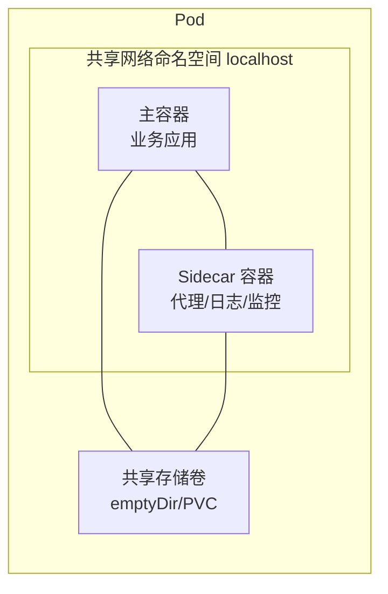
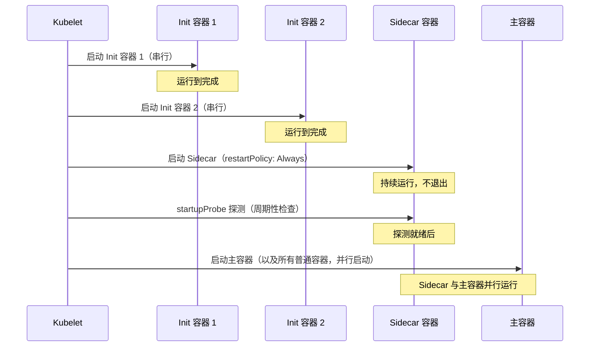
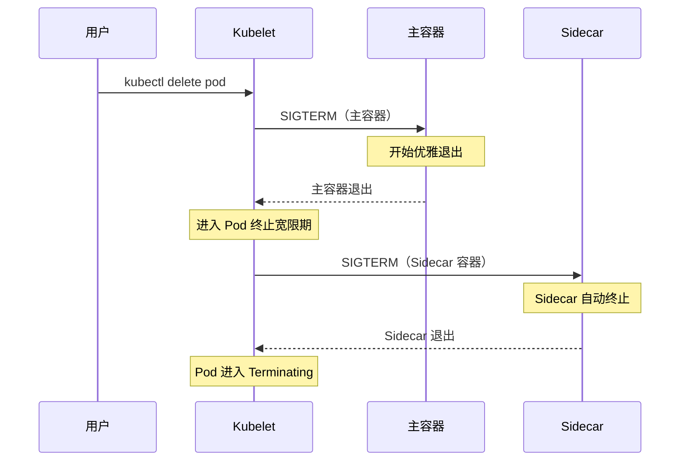
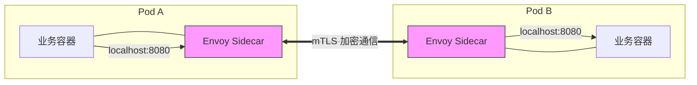
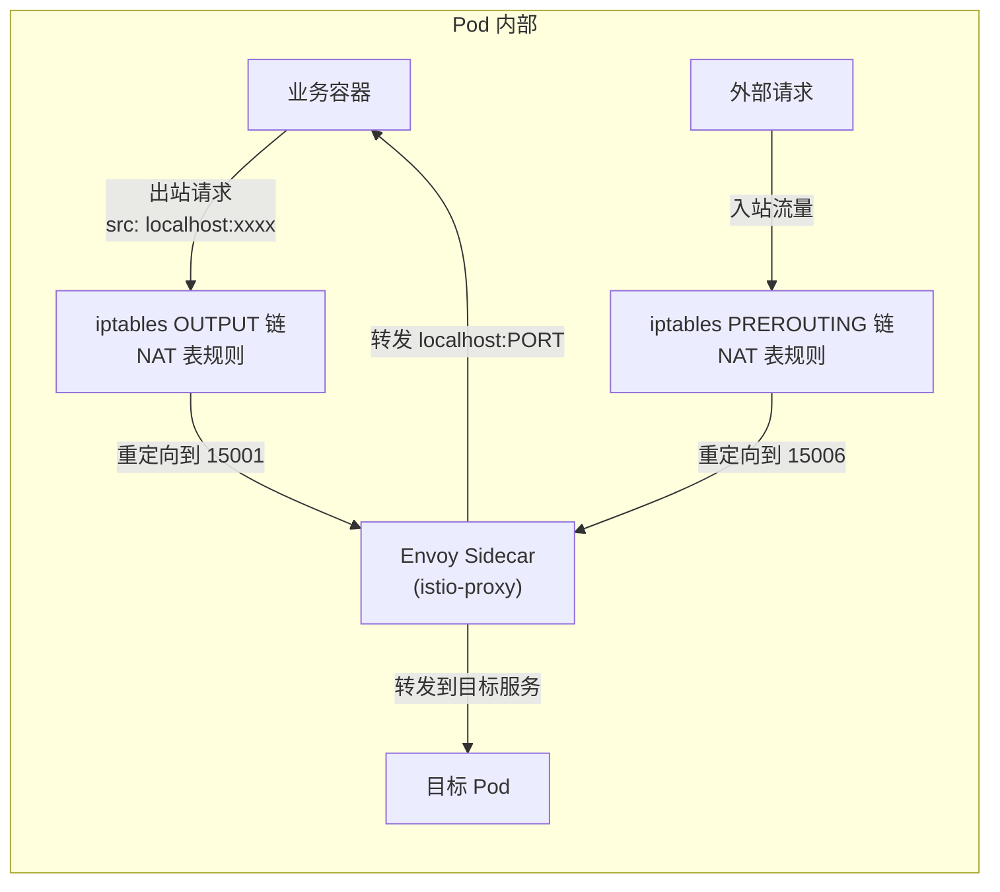
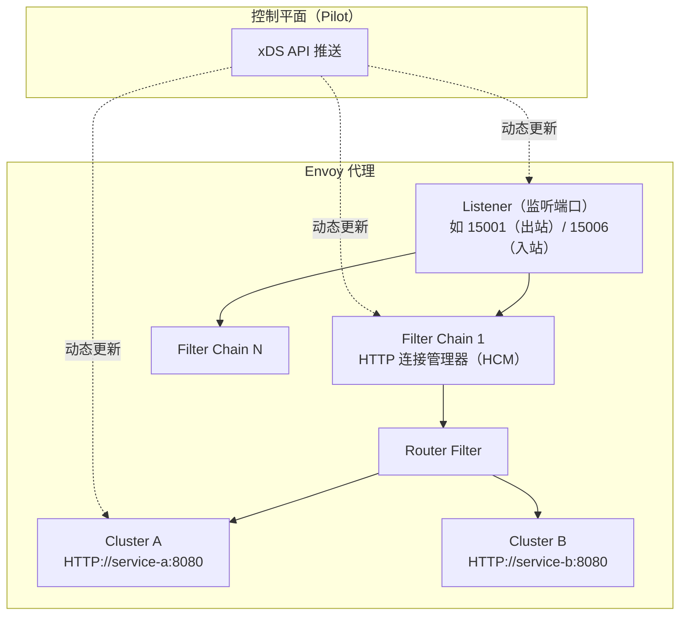
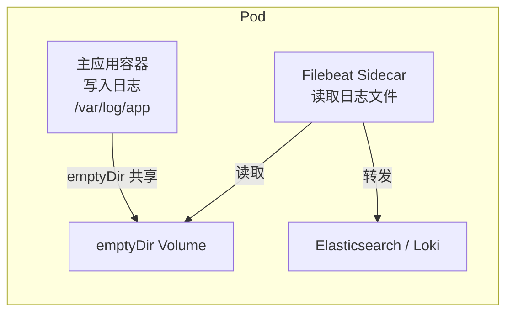
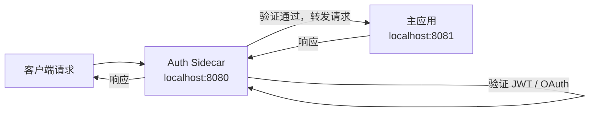
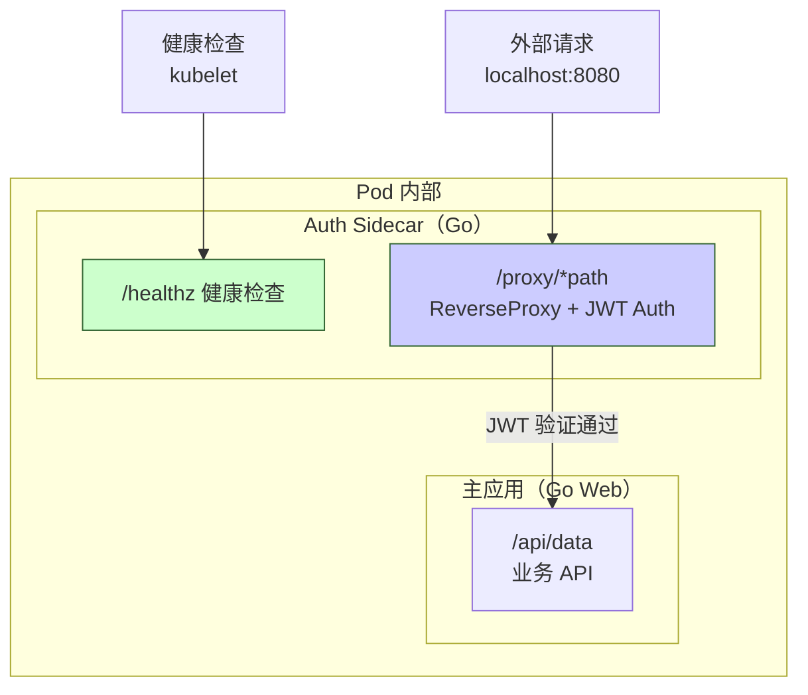
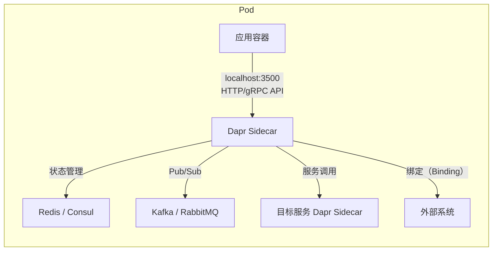

# Sidecar 机制详解

## 1. Sidecar 设计模式

### 1.1 什么是 Sidecar 模式

Sidecar 是一种分布式架构设计模式（也称 Sidekick 模式），核心思想是将辅助功能从主应用中剥离出来，以独立的进程或容器运行，并与主应用部署在同一环境中共享生命周期。

类比现实世界：三轮摩托车的边车（Sidecar）附加在车身旁，提供额外载客能力但不改变主车结构。在软件架构中，Sidecar 进程附加在主应用进程旁，提供日志、监控、代理、安全等辅助能力，主应用无需感知其存在。



### 1.2 演进历史

Sidecar 模式经历了三个阶段的演进：

| 阶段 | 架构形态 | 耦合度 | 典型问题 |
|------|---------|--------|---------|
| **单体内置** | 辅助功能作为函数/模块嵌入进程 | 强耦合（函数级） | 语言锁定、无法独立更新、资源竞争 |
| **SDK 库** | 辅助功能封装为第三方库，代码内调用 | 中等耦合（API 级） | 版本依赖冲突、升级需改代码、多语言需多套 SDK |
| **Sidecar 独立进程** | 辅助功能作为独立进程/容器，localhost 通信 | 松耦合（协议级） | 额外资源开销、通信延迟增加 |

**单体内置阶段**：早期应用将日志、监控等能力直接写在代码里，辅助功能与业务逻辑紧耦合，更换日志库或升级监控 SDK 需要修改业务代码并重新部署。

**SDK 库阶段**：辅助功能封装为 SDK，通过 API 调用集成。一定程度上实现了复用，但仍然存在版本依赖冲突、多语言需维护多套 SDK、升级 SDK 需重新编译发布等问题。

**Sidecar 独立进程阶段**：辅助功能以独立进程运行，通过 HTTP/gRPC 或共享文件系统与主应用通信。主应用完全不知道 Sidecar 的存在，实现了真正的关注点分离。

### 1.3 核心原理：Pod 多容器模型

在 Kubernetes 中，Pod 是最小调度单元，一个 Pod 内可运行多个容器。这些容器共享两个关键资源：

- **网络命名空间（Network Namespace）**：所有容器共享同一个 IP 地址和端口空间，容器之间通过 `localhost` 通信，无需 Service 发现
- **存储卷（Volume）**：通过 `emptyDir`、`hostPath` 或 `PVC` 共享文件系统，Sidecar 可以读取主容器写入的日志文件

```yaml
apiVersion: v1
kind: Pod
metadata:
  name: sidecar-demo
spec:
  containers:
    - name: app
      image: nginx
      volumeMounts:
        - name: logs
          mountPath: /var/log/nginx
    - name: sidecar-log-collector
      image: fluentd
      volumeMounts:
        - name: logs
          mountPath: /var/log/nginx
  volumes:
    - name: logs
      emptyDir: {}
```

### 1.4 Sidecar vs 其他模式的对比

| 模式 | 部署形态 | 通信方式 | 隔离性 | 独立升级 | 适用场景 |
|------|---------|---------|--------|---------|---------|
| **SDK** | 库文件嵌入应用 | 函数调用 | 无 | 需要重新编译 | 简单功能集成 |
| **Sidecar** | 同 Pod 独立容器 | localhost 网络或共享 Volume | 进程级 | 独立部署 | 辅助功能解耦 |
| **Ambassador** | 同 Pod 独立容器 | localhost 网络 | 进程级 | 独立部署 | 代理/路由功能 |
| **Adapter** | 同 Pod 独立容器 | localhost 网络 | 进程级 | 独立部署 | 协议转换/适配 |
| **独立进程** | 独立主机/VM | 网络通信 | 主机级 | 独立部署 | 需要独立扩展的服务 |

**Sidecar vs Ambassador**：Ambassador 其实是 Sidecar 的一个子模式，特指充当代理的角色（如 Redis 代理 Envoy）。所有 Ambassador 都是 Sidecar，但 Sidecar 不一定是 Ambassador。

### 1.5 适用场景

- **多语言环境**：团队使用不同语言开发微服务，Sidecar 提供语言无关的辅助能力
- **第三方组件集成**：将日志采集器、监控 Exporter 等第三方组件作为 Sidecar 与主应用捆绑部署
- **独立更新组件**：Sidecar 组件可以独立发布和升级，不影响主应用
- **细粒度资源控制**：Sidecar 和主应用可分别设置 CPU/内存 limits，实现资源隔离

### 1.6 不适用场景

- **IPC 频繁的应用**：主应用与辅助功能之间频繁通信，Sidecar 的额外网络开销无法接受
- **小型应用**：单个 Pod 多容器增加的资源开销大于收益
- **需要独立扩展的组件**：辅助功能需要根据负载独立扩缩容，绑定在 Pod 内无法实现
- **平台已提供原生能力**：K8s 已提供的功能（如 `kubectl logs` 采集 stdout/stderr）无需 Sidecar

---

## 2. Kubernetes 原生 Sidecar

### 2.1 原生支持的必要性

在 K8s 原生 Sidecar 支持之前，用户通过普通容器模拟 Sidecar 行为，存在严重缺陷：

- Job 场景下主容器退出后 Sidecar 仍在运行，Pod 无法进入 `Completed` 状态
- 无法保证 Sidecar 在主容器启动前就绪
- Pod 终止时 Sidecar 和主容器同时收到 `SIGTERM`，Sidecar 可能过早退出导致主容器异常

KEP-753（Kubernetes Enhancement Proposal 753）正是为解决这些问题而生。

### 2.2 KEP-753 演进路线

| Kubernetes 版本 | 状态 | 说明 |
|----------------|------|------|
| v1.28（2023-08） | **Alpha** | 引入 `SidecarContainers` feature gate，默认关闭 |
| v1.29（2023-12） | **Beta** | 默认启用，在 `initContainers` 上支持 `restartPolicy: Always` |
| v1.33（2025-08） | **Stable** | 正式 GA，无需 feature gate |

### 2.3 restartPolicy: Always 行为详解

K8s 原生 Sidecar 的实现方式是在 `initContainers` 字段中设置 `restartPolicy: Always`。这个字段有四个关键行为变化：

1. **退出自动重启**：无论退出码是 0 还是非 0，Sidecar 容器都会自动重启（忽略 Pod 级别的 `restartPolicy`）
2. **先于主容器启动**：Sidecar 在 init 阶段启动，确保在主容器启动前就已就绪
3. **资源计入 Pod 总量**：Sidecar 的 `requests`/`limits` 计入 Pod 的资源总和
4. **Pod 终止只依据主容器**：Kubelet 只根据普通容器的状态判断 Pod 是否终止，忽略 Sidecar 的生命周期

### 2.4 YAML 配置示例

```yaml
apiVersion: v1
kind: Pod
metadata:
  name: native-sidecar-demo
spec:
  initContainers:
    - name: sidecar-proxy
      image: envoyproxy/envoy:v1.31-latest
      restartPolicy: Always                    # 关键标记：声明为 Sidecar 容器
      ports:
        - containerPort: 9901
          name: admin
      volumeMounts:
        - name: envoy-config
          mountPath: /etc/envoy
      startupProbe:                            # 确保 Sidecar 就绪后再启动主容器
        httpGet:
          path: /ready
          port: 9901
        initialDelaySeconds: 1
        periodSeconds: 1
        failureThreshold: 30
  containers:
    - name: app
      image: nginx:latest
      ports:
        - containerPort: 80
  volumes:
    - name: envoy-config
      configMap:
        name: envoy-config
```

### 2.5 启动顺序

K8s 原生 Sidecar 改变了 Pod 的启动顺序：



1. Init 容器按声明顺序**串行**执行（每个运行到完成）
2. 声明了 `restartPolicy: Always` 的 Init 容器被视为 Sidecar，启动后**持续运行**，不等待完成
3. Sidecar 容器的 `startupProbe` 就绪后，触发后续 Init 容器启动
4. 所有 Init 容器完成后，普通容器**并行**启动

### 2.6 终止顺序

Pod 终止时，Sidecar 的终止顺序遵循"主容器先退出，Sidecar 最后终止"的原则：



关键行为：
- 主容器退出后，Pod 进入终止宽限期
- Sidecar 在宽限期内自动收到 `SIGTERM` 信号
- 如果 Sidecar 未在宽限期内优雅退出，会收到 `SIGKILL`
- 只有所有容器（包括 Sidecar）都退出后，Pod 才完成终止

### 2.7 Job 场景的原生解决

在原生 Sidecar 之前，Job Pod 主容器退出后 Sidecar 仍在运行，Pod 永远无法进入 `Completed` 状态：

```yaml
# 原生 Sidecar 正确支持 Job 场景
apiVersion: batch/v1
kind: Job
metadata:
  name: sidecar-job
spec:
  template:
    spec:
      initContainers:
        - name: sidecar-logger
          image: busybox
          command: ["sh", "-c", "while true; do sleep 1; done"]
          restartPolicy: Always                # 声明为原生 Sidecar
      containers:
        - name: worker
          image: busybox
          command: ["sh", "-c", "echo 'job done'"]
      restartPolicy: Never
```

Kubelet 检测到主容器（非 Sidecar）退出后，即使 Sidecar 仍在运行，也会将 Pod 标记为 `Completed`。这解决了困扰用户多年的 Sidecar 在 Job 场景的残留问题。

### 2.8 三种容器对比

| 特性 | Init 容器 | Sidecar 容器（原生） | 普通容器 |
|------|----------|-------------------|---------|
| **定义位置** | `initContainers[]` | `initContainers[]` + `restartPolicy: Always` | `containers[]` |
| **启动顺序** | 串行，按声明顺序 | 在 init 阶段启动，先于主容器 | init 全部完成后串行/并行 |
| **运行时间** | 运行到完成即退出 | 持续运行，Pod 整个生命周期 | 持续运行 |
| **重启策略** | 无，退出即结束 | `Always`，始终重启 | 由 Pod `restartPolicy` 控制 |
| **资源计数** | 不计入 Pod 资源总和 | 计入 Pod 资源总和 | 计入 Pod 资源总和 |
| **健康检查** | 不支持 | 支持 startup/liveness/readiness | 支持 |
| **Job 兼容性** | 不影响 | 不影响（主容器退出即算完成） | 阻止 Job 完成 |
| **终止顺序** | 完成后即终止 | 主容器之后终止 | 同时收到 SIGTERM |

---

## 3. Service Mesh 中的 Sidecar

### 3.1 什么是 Service Mesh Sidecar

Service Mesh（服务网格）将微服务的流量管理、安全通信、可观测性从应用代码中剥离，以 Sidecar 代理的形式透明地附加到每个服务 Pod 中。最流行的实现是 **Istio**，它使用 Envoy 代理作为 Sidecar。



### 3.2 Sidecar 注入方式

#### 自动注入（推荐）

1. 为命名空间打标签：`kubectl label namespace default istio-injection=enabled`
2. 在该命名空间创建 Pod 时，**MutatingAdmissionWebhook** 拦截 Pod 创建请求
3. Webhook 动态修改 Pod spec，注入 `istio-init` 和 `istio-proxy` 容器
4. 用户无需手动修改任何 Deployment YAML

```bash
# 启用自动注入
kubectl label namespace default istio-injection=enabled

# 创建 Pod 后检查是否注入成功
kubectl describe pod <pod-name>
# 输出中应有 2 个容器（业务容器 + istio-proxy）+ 1 个 Init Container

kubectl get pods
# READY 列显示 2/2 表示主容器和 Sidecar 都已就绪
```

#### 手动注入

使用 `istioctl kube-inject` 命令在 YAML 层面注入 Sidecar，适用于 CI/CD 流程：

```bash
# 部署时注入
kubectl apply -f <(istioctl kube-inject -f deployment.yaml)

# 生成注入后的 YAML 文件
istioctl kube-inject -f deployment.yaml -o deployment-injected.yaml

# 更新已有 Deployment
kubectl get deployment -o yaml | istioctl kube-inject -f - | kubectl apply -f -
```

### 3.3 istio-init / istio-proxy 双容器模型

Istio Sidecar 由两个容器组成：

| 容器 | 镜像 | 作用 | 生命周期 |
|------|------|------|---------|
| `istio-init` | `istio/proxyv2` | 设置 iptables 规则，流量劫持 | Init 容器，运行即退出 |
| `istio-proxy` | `istio/proxyv2` | 运行 Envoy 代理，处理全部流量 | 持续运行，Pod 生命周期 |

**istio-init**（普通 init 容器）负责在 Pod 网络命名空间中注入 iptables 规则，将所有进出流量透明地重定向到 Envoy（istio-proxy）。它执行以下 iptables 操作：

```bash
# iptables 规则示意（由 istio-init 自动配置）
# 将所有出站 TCP 流量重定向到 Envoy 的 15001 端口
iptables -t nat -A OUTPUT -p tcp -j REDIRECT --to-port 15001

# 将所有入站 TCP 流量重定向到 Envoy 的 15006 端口
iptables -t nat -A PREROUTING -p tcp -j REDIRECT --to-port 15006
```

### 3.4 iptables 流量劫持流程



**出站流量劫持**：
1. 业务容器发起对外部服务的 TCP 连接（如调用服务 B）
2. iptables OUTPUT 链匹配出站 TCP 包，重定向到 Envoy 的 `15001` 端口
3. Envoy 根据 xDS 配置的服务发现和路由规则，将请求转发到正确的目标

**入站流量劫持**：
1. 外部请求到达 Pod IP 的某个端口
2. iptables PREROUTING 链匹配入站 TCP 包，重定向到 Envoy 的 `15006` 端口
3. Envoy 处理请求后转发到业务容器监听的本机端口

### 3.5 Envoy 代理架构简介

Envoy 是 Istio 数据平面的核心组件，采用以下三层架构：



- **Listener**：监听指定端口接收流量（如 15001 出站、15006 入站）
- **Filter Chain**：过滤器链处理流量（HTTP 连接管理、RBAC、限流等）
- **Cluster**：上游服务集群定义（目标地址、负载均衡策略、健康检查）
- **xDS API**：Envoy 通过 xDS（Listener Discovery Service、Cluster Discovery Service 等）从 Istio 控制平面（Pilot）动态获取配置，无需重启即可生效

### 3.6 mTLS 加密通信

Istio 自动为 Pod 之间的 Sidecar 建立双向 TLS（mTLS）连接，应用层完全无感知：

- Sidecar 之间通信自动加密和双向认证
- 通过 Istio `PeerAuthentication` 资源控制 mTLS 模式（STRICT / PERMISSIVE / DISABLE）
- 证书轮换由 Istio Citadel（或 istiod）自动管理

```yaml
# 启用严格的 mTLS
apiVersion: security.istio.io/v1beta1
kind: PeerAuthentication
metadata:
  name: default
  namespace: istio-system
spec:
  mtls:
    mode: STRICT
```

### 3.7 流量管理能力

在 Sidecar 层实现流量管理，为灰度发布、蓝绿部署、金丝雀发布等提供基础设施：

| 功能 | 说明 | Istio 资源 |
|------|------|-----------|
| 灰度发布 | 按权重/Header 分流到不同版本 | `VirtualService` + `DestinationRule` |
| 熔断 | 异常阈值触发断路保护 | `DestinationRule` |
| 超时/重试 | 请求超时控制和失败重试 | `VirtualService` |
| 故障注入 | 注入延迟/错误用于混沌测试 | `VirtualService` |
| 限流 | 本地或全局速率限制 | `EnvoyFilter` / `RateLimit` |

---

## 4. 常见 Sidecar 实现模式

### 4.1 日志收集 Sidecar

**概念**：将日志采集 agent（Filebeat、Fluentd、Logstash 等）作为 Sidecar，与主应用共享日志目录，由 Sidecar 读取并转发到集中式日志系统（Elasticsearch、Loki、S3 等）。

**架构**：



**YAML 配置**：

```yaml
apiVersion: v1
kind: Pod
metadata:
  name: log-sidecar-demo
spec:
  containers:
    - name: app
      image: my-app:latest
      volumeMounts:
        - name: logs
          mountPath: /var/log/app
    - name: filebeat
      image: docker.elastic.co/beats/filebeat:8.15.0
      volumeMounts:
        - name: logs
          mountPath: /var/log/app
          readOnly: true
        - name: filebeat-config
          mountPath: /usr/share/filebeat/filebeat.yml
          subPath: filebeat.yml
  volumes:
    - name: logs
      emptyDir: {}
    - name: filebeat-config
      configMap:
        name: filebeat-config
```

### 4.2 监控 Sidecar（Prometheus Exporter）

**概念**：将 Prometheus Exporter 作为 Sidecar 部署，将主应用的服务指标暴露为 Prometheus 可采集的格式。

**典型场景**：
- MySQL Exporter：采集 MySQL 数据库指标
- Redis Exporter：采集 Redis 缓存指标
- Nginx Exporter：采集 Nginx HTTP 指标
- 自定义 Exporter：将应用自定义指标转换为 Prometheus 格式

**架构**：Exporter 通过 `localhost:PORT` 连接主应用暴露的 metrics 端点，自身在 `localhost:9104` 等端口暴露 Prometheus 采集端点。

```yaml
apiVersion: v1
kind: Pod
metadata:
  name: mysql-monitor
  labels:
    app: mysql
spec:
  containers:
    - name: mysql
      image: mysql:8.4
      env:
        - name: MYSQL_ROOT_PASSWORD
          valueFrom:
            secretKeyRef:
              name: mysql-secret
              key: password
    - name: mysqld-exporter
      image: prom/mysqld-exporter:v0.15.1
      env:
        - name: DATA_SOURCE_NAME
          value: "root:$(MYSQL_ROOT_PASSWORD)@(localhost:3306)/"
      ports:
        - containerPort: 9104
```

### 4.3 认证代理 Sidecar

**概念**：在 Sidecar 层实现认证逻辑（JWT 验证、OAuth2 代理、Basic Auth 等），主应用专注于业务逻辑，无需处理认证。

**架构**：



```yaml
# 以 OAuth2 Proxy 为例
apiVersion: v1
kind: Pod
metadata:
  name: auth-sidecar-demo
spec:
  containers:
    - name: app
      image: my-web-app:latest
      ports:
        - containerPort: 8081
    - name: oauth2-proxy
      image: quay.io/oauth2-proxy/oauth2-proxy:v7.6.0
      args:
        - --upstream=http://localhost:8081
        - --http-address=0.0.0.0:8080
        - --provider=oidc
        - --client-id=xxxx
        - --client-secret=xxxx
      ports:
        - containerPort: 8080
```

### 4.4 配置/Secret 同步 Sidecar

**概念**：Sidecar 监听外部配置源（K8s ConfigMap/Secret、Consul、Nacos 等）的变更，将最新配置同步到本地文件或通过 localhost 推送至主应用，实现热更新。

**架构**：Sidecar 通过 Watch API 监听资源变更，将配置写入共享 Volume，主应用通过文件变化通知或轮询获取最新配置。

```yaml
apiVersion: v1
kind: Pod
metadata:
  name: config-sync-sidecar
spec:
  containers:
    - name: app
      image: my-app:latest
      volumeMounts:
        - name: shared-config
          mountPath: /etc/app/config
    - name: consul-template
      image: hashicorp/consul-template:0.39.1
      volumeMounts:
        - name: shared-config
          mountPath: /etc/app/config
      args:
        - -template=/etc/consul-template/template.ctmpl:/etc/app/config/app.yml
```

### 4.5 Protocol Adapter Sidecar

**概念**：Sidecar 负责协议转换，将一种协议转换为另一种协议，隔离异构协议处理逻辑。

**典型场景**：
- **HTTP -> gRPC**：外部系统通过 HTTP REST 调用，内部服务使用 gRPC，Sidecar 做协议转换
- **TCP -> UDP**：日志采集收 TCP 连接，转发到 UDP 目标
- **格式转换**：XML -> JSON、Avro -> Protobuf 等

```yaml
apiVersion: v1
kind: Pod
metadata:
  name: protocol-adapter
spec:
  containers:
    - name: grpc-service
      image: my-grpc-service:latest
      ports:
        - containerPort: 50051
    - name: grpc-gateway
      image: my-grpc-gateway:latest
      args:
        - --grpc-server-endpoint=localhost:50051
        - --http-listen=0.0.0.0:8080
      ports:
        - containerPort: 8080
```

---

## 5. Go 实现认证代理 Sidecar 实战

本节将用 Go 构建一个完整的认证代理 Sidecar，在 Sidecar 层完成 JWT 认证，然后将请求转发给主应用。

### 5.1 整体架构



**通信流程**：
1. 客户端请求到达 Auth Sidecar（监听 `localhost:8080`）
2. Sidecar 提取 HTTP Header 中的 JWT Token
3. 验证 Token 签名、有效期和权限（Claim）
4. 验证通过后，通过 `httputil.ReverseProxy` 转发到主应用（`localhost:8081`）
5. 验证失败，返回 401/403 错误

### 5.2 主应用服务

```go
// main.go — 主应用服务（监听 8081 端口）
package main

import (
    "net/http"
    "github.com/gin-gonic/gin"
)

func main() {
    r := gin.Default()

    r.GET("/api/data", func(c *gin.Context) {
        c.JSON(http.StatusOK, gin.H{
            "message": "这是受保护的业务数据",
            "status":  "ok",
        })
    })

    r.GET("/api/public", func(c *gin.Context) {
        c.JSON(http.StatusOK, gin.H{
            "message": "这是公开数据，无需认证",
        })
    })

    // 主应用监听 8081 端口，只接受 localhost 连接
    r.Run("127.0.0.1:8081")
}
```

### 5.3 认证代理 Sidecar

```go
// sidecar.go — 认证代理 Sidecar（监听 8080 端口）
package main

import (
    "fmt"
    "net/http"
    "net/http/httputil"
    "net/url"
    "strings"
    "time"

    "github.com/gin-gonic/gin"
    "github.com/golang-jwt/jwt/v5"
)

var jwtSecret = []byte("your-256-bit-secret")

// AuthMiddleware 验证 JWT Token
func AuthMiddleware() gin.HandlerFunc {
    return func(c *gin.Context) {
        authHeader := c.GetHeader("Authorization")
        if authHeader == "" {
            c.JSON(http.StatusUnauthorized, gin.H{
                "error": "缺少 Authorization Header",
            })
            c.Abort()
            return
        }

        // 提取 Bearer Token
        tokenString := strings.TrimPrefix(authHeader, "Bearer ")
        if tokenString == authHeader {
            c.JSON(http.StatusUnauthorized, gin.H{
                "error": "Authorization 格式应为 Bearer <token>",
            })
            c.Abort()
            return
        }

        // 解析并验证 JWT
        token, err := jwt.Parse(tokenString, func(token *jwt.Token) (any, error) {
            // 验证签名算法为 HMAC
            if _, ok := token.Method.(*jwt.SigningMethodHMAC); !ok {
                return nil, fmt.Errorf("非预期的签名方法: %v", token.Header["alg"])
            }
            return jwtSecret, nil
        },
            jwt.WithValidMethods([]string{"HS256"}),
            jwt.WithLeeway(30*time.Second), // 30 秒时钟偏差容忍
        )

        if err != nil || !token.Valid {
            c.JSON(http.StatusUnauthorized, gin.H{
                "error": "Token 无效或已过期",
            })
            c.Abort()
            return
        }

        // 将 Claim 注入请求 Header，传递给主应用
        if claims, ok := token.Claims.(jwt.MapClaims); ok {
            c.Request.Header.Set("X-User-Id", fmt.Sprintf("%v", claims["sub"]))
            c.Request.Header.Set("X-User-Role", fmt.Sprintf("%v", claims["role"]))
        }

        c.Next()
    }
}

func main() {
    r := gin.Default()

    // 健康检查端点
    r.GET("/healthz", func(c *gin.Context) {
        c.JSON(http.StatusOK, gin.H{
            "status": "healthy",
        })
    })

    // 配置反向代理到主应用
    target, _ := url.Parse("http://127.0.0.1:8081")
    proxy := httputil.ReverseProxy{
        Director: func(req *http.Request) {
            req.URL.Scheme = target.Scheme
            req.URL.Host = target.Host
            req.URL.Path = strings.TrimPrefix(req.URL.Path, "/proxy")
            if req.URL.Path == "" {
                req.URL.Path = "/"
            }
        },
    }

    // 受保护的端点：需要 JWT 认证
    r.Any("/proxy/*path", AuthMiddleware(), func(c *gin.Context) {
        proxy.ServeHTTP(c.Writer, c.Request)
    })

    // 默认路由处理
    r.Any("/*path", func(c *gin.Context) {
        proxy.ServeHTTP(c.Writer, c.Request)
    })

    // Sidecar 监听 8080 端口
    r.Run("0.0.0.0:8080")
}
```

**关键代码说明**：

| 代码段 | 说明 |
|--------|------|
| `AuthMiddleware()` | Gin 中间件，提取并验证 JWT Bearer Token |
| `jwt.Parse()` | 解析 JWT，传入 Keyfunc 验证签名。使用 `WithValidMethods` 限制只接受 HS256 算法，防止算法混淆攻击 |
| `jwt.WithLeeway(30*time.Second)` | 允许 30 秒时钟偏差，避免 Token 在极端时差下被误判为过期 |
| `httputil.ReverseProxy` | Go 标准库反向代理，将认证通过后的请求转发到主应用 |
| `Director` 函数 | 修改请求 URL（去掉 `/proxy` 前缀），设置 target 为 `localhost:8081` |
| `X-User-Id` / `X-User-Role` | 将 JWT Claim 注入转发请求的 Header，主应用直接读取即可 |

### 5.4 Docker 多阶段构建

```dockerfile
# Dockerfile — 多阶段构建
# ===== 阶段 1：编译 Go 二进制 =====
FROM golang:1.23-alpine AS builder

WORKDIR /app

# 提前下载依赖（利用 Docker 层缓存）
COPY go.mod go.sum ./
RUN go mod download

# 编译主应用
COPY main.go .
RUN CGO_ENABLED=0 GOOS=linux go build -o /app/main .

# 编译 Sidecar
COPY sidecar.go .
RUN CGO_ENABLED=0 GOOS=linux go build -o /app/sidecar .

# ===== 阶段 2：运行镜像 =====
FROM alpine:3.20

RUN apk add --no-cache ca-certificates tzdata

# 注意：这是多容器 Pod，这里只构建 Sidecar 镜像
# 主应用应分别构建自己的 Docker 镜像
COPY --from=builder /app/sidecar /sidecar

EXPOSE 8080
CMD ["/sidecar"]
```

**版本要求**：Go 1.21+（`golang-jwt/jwt/v5` 要求），推荐 Go 1.23+。

### 5.5 Kubernetes 部署配置

```yaml
# deployment.yaml
apiVersion: apps/v1
kind: Deployment
metadata:
  name: auth-sidecar-app
  labels:
    app: auth-sidecar-app
spec:
  replicas: 2
  selector:
    matchLabels:
      app: auth-sidecar-app
  template:
    metadata:
      labels:
        app: auth-sidecar-app
    spec:
      containers:
        # --- 主应用容器 ---
        - name: app
          image: my-app:latest       # 替换为实际主应用镜像
          ports:
            - containerPort: 8081
              name: http-app
          env:
            - name: LISTEN_ADDR
              value: "127.0.0.1:8081"
          resources:
            requests:
              cpu: "100m"
              memory: "64Mi"
            limits:
              cpu: "500m"
              memory: "256Mi"

        # --- Auth Sidecar 容器 ---
        - name: auth-sidecar
          image: my-auth-sidecar:latest  # 替换为构建的 Sidecar 镜像
          ports:
            - containerPort: 8080
              name: http-auth
          env:
            - name: JWT_SECRET
              valueFrom:
                secretKeyRef:
                  name: jwt-secret
                  key: secret
          startupProbe:
            httpGet:
              path: /healthz
              port: 8080
            initialDelaySeconds: 1
            periodSeconds: 2
            failureThreshold: 15
          livenessProbe:
            httpGet:
              path: /healthz
              port: 8080
            initialDelaySeconds: 5
            periodSeconds: 10
          resources:
            requests:
              cpu: "50m"
              memory: "32Mi"
            limits:
              cpu: "200m"
              memory: "128Mi"
---
# service.yaml
apiVersion: v1
kind: Service
metadata:
  name: auth-sidecar-app
spec:
  selector:
    app: auth-sidecar-app
  ports:
    - port: 8080
      targetPort: 8080    # 指向 Auth Sidecar
      name: http
  type: ClusterIP
---
# jwt-secret.yaml
apiVersion: v1
kind: Secret
metadata:
  name: jwt-secret
type: Opaque
stringData:
  secret: "your-256-bit-secret-here"
```

**部署步骤**：

```bash
# 1. 创建 Secret
kubectl apply -f jwt-secret.yaml

# 2. 部署主应用和 Sidecar
kubectl apply -f deployment.yaml

# 3. 暴露 Service
kubectl apply -f service.yaml

# 4. 验证部署
kubectl get pods -l app=auth-sidecar-app
# 预期输出: READY 2/2

# 5. 测试带认证的请求
# 生成 JWT Token（使用 jwt.io 或自行签发）
TOKEN="eyJhbGciOiJIUzI1NiIs..."
curl -H "Authorization: Bearer $TOKEN" http://localhost:8080/proxy/api/data

# 6. 测试未认证请求
curl http://localhost:8080/proxy/api/data
# 预期输出: {"error":"缺少 Authorization Header"}
```

### 5.6 go.mod 依赖

```
module auth-sidecar

go 1.23

require (
    github.com/gin-gonic/gin v1.10.0
    github.com/golang-jwt/jwt/v5 v5.2.1
)
```

### 5.7 生产化增强建议

| 增强项 | 说明 | 实现方式 |
|--------|------|---------|
| **JWT 公钥验证** | 使用 RSA/ECDSA 而非 HMAC，从 JWKS 端点获取公钥 | `jwt.ParseRSAPublicKeyFromPEM()` |
| **请求速率限制** | 防止暴力破解和 DDoS | `golang.org/x/time/rate` 或 Envoy 限流 |
| **请求日志审计** | 记录所有经过 Sidecar 的请求 | Gin 中间件记录 `request_id`、`user_id`、耗时 |
| **TLS 终止** | 在 Sidecar 层终止 HTTPS | 配置 TLS 证书监听 443 端口 |
| **优雅关闭** | Sidecar 收到 SIGTERM 后排水已有连接 | `signal.Notify` + `http.Server.Shutdown` |
| **指标暴露** | 暴露 Prometheus 指标 | `promhttp.Handler` 在 `/metrics` 端点上 |

---

## 附录

### A. OpenKruise SidecarSet

[OpenKruise](https://openkruise.io/) 是阿里开源的 K8s 扩展套件，其中的 **SidecarSet** 提供了比 K8s 原生 Sidecar 更强大的声明式 Sidecar 管理能力。

| 特性 | K8s 原生 Sidecar | OpenKruise SidecarSet |
|------|-----------------|----------------------|
| **注入方式** | 手动在 Pod spec 中声明 | 自动注入（Admission Webhook + CRD selector） |
| **升级模式** | 重建 Pod | 原地升级（仅更新 Sidecar 镜像，不重启主容器） |
| **启动顺序控制** | restartPolicy: Always（保证先启动） | Container Launch Priority（精细控制） |
| **Job 兼容** | 原生支持 | SidecarTerminator 处理 |
| **资源管理** | 计入 Pod 总量 | 独立资源视图 |

```yaml
# SidecarSet 示例：自动注入日志采集 Sidecar
apiVersion: apps.kruise.io/v1alpha1
kind: SidecarSet
metadata:
  name: log-collector
spec:
  selector:
    matchLabels:
      app: my-app              # 匹配目标 Pod
  containers:
    - name: filebeat
      image: docker.elastic.co/beats/filebeat:8.15.0
      volumeMounts:
        - name: log-volume
          mountPath: /var/log
  volumes:
    - name: log-volume
      hostPath:
        path: /var/log/pods
```

### B. Dapr Sidecar

[Dapr](https://dapr.io/)（Distributed Application Runtime）以 Sidecar 模式提供分布式应用运行时能力，应用通过 HTTP/gRPC API 调用 Sidecar 获取状态管理、服务调用、发布订阅、绑定、Actor 等能力。



```bash
# 启用 Dapr Sidecar
dapr run --app-id my-app --app-port 8080 --dapr-http-port 3500 go run main.go
```

在 K8s 环境中通过注解（`dapr.io/enabled: "true"`）自动注入 Dapr Sidecar。

### C. 参考链接

- [Kubernetes 官方文档 - Sidecar Containers](https://kubernetes.io/docs/concepts/workloads/pods/sidecar-containers/)
- [Kubernetes 官方教程 - Pod Sidecar Containers](https://kubernetes.io/docs/tutorials/configuration/pod-sidecar-containers/)
- [KEP-753: Sidecar Containers](https://github.com/kubernetes/enhancements/tree/master/keps/sig-node/753-sidecar-containers)
- [Azure Architecture Center - Sidecar Pattern](https://learn.microsoft.com/en-us/azure/architecture/patterns/sidecar)
- [Istio 官方文档 - Sidecar Injection](https://istio.io/latest/docs/setup/additional-setup/sidecar-injection/)
- [OpenKruise 官方文档 - SidecarSet](https://openkruise.io/docs/user-manuals/sidecarset/)
- [Dapr 官方文档](https://docs.dapr.io/)
- [golang-jwt 库文档](https://github.com/golang-jwt/jwt)
- [Envoy 代理架构文档](https://www.envoyproxy.io/docs/envoy/latest/)
