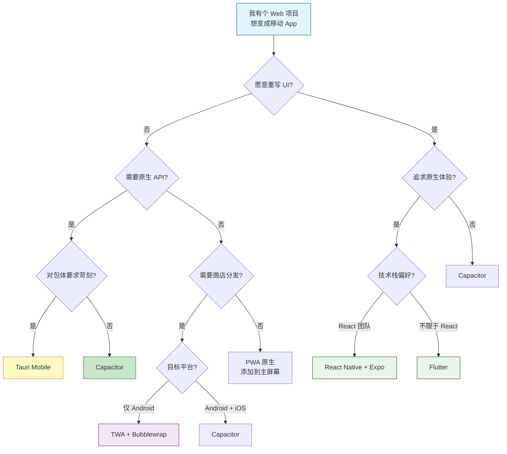

# 移动 Web 项目打包为移动端 App 技术方案调研

## 1. 引言

### 1.1 背景与动机

现代前端开发者的工作流越来越多元。你可能已经用 React、Vue 或 Angular 构建了一个功能完整的 Web 应用，现在希望把它变成一个可以上架应用商店的移动 App。这种需求的驱动力通常来自几个方面：

- **流量入口**：用户习惯从应用商店搜索和安装 App。数据显示，移动端 App 的用户日活留存率（Day-7 Retention）通常比移动端网页高出 2-3 倍。对于需要长期运营的 C 端产品，App 是更可靠的用户触点。
- **用户体验**：原生 App 拥有独立桌面图标、启动屏、离线可用、推送通知、硬件 API 调用（相机、GPS、蓝牙）等能力，这些都是移动端网页难以替代的体验。即使你的 Web 应用已经适配了移动端屏幕，在用户心目中它依然是一个"网页"，而不是一个"App"。
- **商业需求**：部分业务场景天然要求 App 形态。比如 IoT 设备的配套 App 需要蓝牙通信能力、线下门店的扫码入口依赖相机权限、支付类场景需要调用 NFC。这些在移动端网页中受限或不支持的功能，在原生 App 中可以通过 Bridge 或插件轻松调用。
- **品牌感知与市场覆盖**：上架应用商店是建立品牌可信度的重要途径。用户搜索你的产品时，应用商店的结果往往比搜索引擎结果更具信任感。此外，应用商店的推荐和排行机制也是免费流量来源。

### 1.2 本文目标读者

如果你符合以下描述，本文就是为你准备的：

> "我有一个已经写好的 Web 项目，不想（或没时间）重写 UI，如何最快把它变成能上架应用商店的 App？"

本文面向 **中级前端开发者**（1-5 年经验，熟悉至少一种现代前端框架），**不需要** Android/iOS 原生开发经验。如果你是独立开发者或小团队技术负责人，正在评估如何将 MVP 快速推向市场，本文尤其有价值。

本文不会教你如何用 Java 或 Kotlin 写 Android 原生代码，也不会教你用 Swift 开发 iOS 应用——这些知识在本场景中不是必须的。

### 1.3 你将要面对的选择

把 Web 项目变成移动 App，本质上只有四种技术路线：

1. **WebView 容器**（第 3-4 章）：用一个原生壳包裹你的 Web 应用，通过 JS Bridge 调用原生能力。代表方案：Capacitor、Cordova、Tauri。
2. **PWA 增强**（第 5 章）：把你的 Web 应用升级为 PWA（渐进式 Web 应用），再借助 Google 或微软的工具打包为应用商店安装包。代表方案：TWA + Bubblewrap、PWABuilder。
3. **跨平台重写**（第 6 章）：用 RN 或 Flutter 等框架重新开发 UI 层，获取原生或自渲染的体验。代表方案：React Native、Flutter。
4. **原生 WebView 裸封装**：在 Android Studio 或 Xcode 中手动创建一个原生项目，嵌入一个全屏 WebView。这是最原始的方式，目前只在极端简单场景下使用。

前两条路线保留了你的 Web 代码，第三条路线需要重写 UI。**这是本文最重要的分界线**——所有后续的选型讨论都以此为基础。

### 1.4 全文结构

本文按"原理 -> 方案 -> 对比 -> 决策"四层递进组织：

| 层次 | 章节 | 内容 |
|------|------|------|
| 原理 | 第 2 章 | WebView 容器与 PWA 的基础概念 |
| 方案 | 第 3-6 章 | 主流方案逐一分析（Capacitor、Cordova、Tauri、PWA 路线、跨平台框架） |
| 对比 | 第 7-8 章 | 发行差异、国内生态、综合对比总表 |
| 决策 | 第 9-10 章 | 选型决策树、场景推荐、后续行动 |

### 1.5 与已有文档的关系

本文是**方案对比与选型决策**导向的宏观调研，不深入单一方案的完整实操。如果你已选定某个方案并需要具体教程，可参考已有文档：

- [Tauri 2 打包 React 移动端应用的完整实操教程](Tauri2打包react移动端应用调研.md)（环境搭建、签名打包、CI/CD）

---

## 2. 理解技术基础 — WebView 容器与 PWA

### 2.1 WebView 容器原理

WebView 容器是目前将 Web 项目打包为 App 最主流的技术路线。其核心架构只有三层：

```
Web 应用 (HTML/CSS/JS)
     ↑  JS Bridge 通信
原生 Shell (Android WebView / iOS WKWebView)
     ↓
设备原生 API (相机、GPS、文件系统、通知...)
```

**工作流程**：

1. 原生 App 启动一个无浏览器 UI 的 WebView 实例（Android 使用 Android System WebView，iOS 使用 WKWebView）。
2. WebView 加载 Web 应用的入口 HTML（可以是本地打包的资源，也可以是远程 URL）。
3. JavaScript 通过 Bridge 层调用原生 API（如 `Camera.getPhoto()`），Bridge 将调用转发给原生端，原生执行后返回结果给 JS。

这种架构的关键优势是 **前端代码零迁移成本**——你的 React/Vue/ 原生 JS 代码直接在 App 中运行，不需要做任何框架层面的修改。这也意味着你的 Web 应用在 App 内和浏览器内的行为完全一致，复用测试、监控和构建工具链。

**Android System WebView 与 iOS WKWebView 的差异**：

| 维度 | Android System WebView | iOS WKWebView |
|------|----------------------|---------------|
| 渲染引擎 | Chromium (Blink) | WebKit (Nitro) |
| 更新方式 | 通过 Google Play 独立更新 | 随 iOS 系统更新 |
| ES 兼容性 | 良好，更新较频繁 | 良好，但受系统版本限制 |
| 调试 | Chrome DevTools (chrome://inspect) | Safari Web Inspector |

这种差异意味着：即使你的代码在 iOS 模拟器中工作正常，也需要在真机上验证；同样，Android 上的 WebView 版本取决于用户设备上的 Chrome 版本，碎片化问题不可忽视。

主流 WebView 容器方案包括 **Capacitor**、**Cordova** 和 **Tauri Mobile**。它们的技术细节将在第 3-4 章展开。

### 2.2 PWA 三要素

PWA（Progressive Web App）走的是另一条路线——**增强 Web 本身**，而不是用原生壳包裹 Web。

一个应用要成为 PWA，必须满足三个条件：

| 要素 | 作用 | 技术实现 |
|------|------|---------|
| Web App Manifest | 定义 App 名称、图标、主题色、启动方式 | `manifest.json` 文件 |
| Service Worker | 离线缓存、后台同步、推送通知 | JavaScript 脚本（独立于主线程运行） |
| HTTPS | 安全传输保障 | 必须部署在 HTTPS 下 |

PWA 安装到用户主屏幕后，可以拥有独立的启动图标、全屏启动体验、离线访问能力和推送通知。它的能力边界在 Android 上已经很接近原生 App，但在 iOS 上仍有较多限制（详见第 5 章）。

**一个常见的误解**：PWA 不是一种"打包工具"，它是一种 Web 应用的增强标准。你将现有的 Web 应用添加 manifest.json 和 Service Worker 后，它本身就是一个 PWA——不需要任何编译或打包步骤。后续是否要用 TWA 或 PWABuilder 打包为原生安装包，是在 PWA 基础上额外增加的分发层。

PWA 还有一个常被忽视的优势：**SEO 友好**。PWA 本质是 Web 应用，天然可被搜索引擎索引，这比原生 App 的内容更容易被用户搜索发现。

### 2.3 两条路线的本质差异

| 维度 | WebView 容器 | PWA |
|------|-------------|-----|
| 本质 | 原生壳 + Web 内核 | 增强后的 Web 应用 |
| 代码复用 | 100%（直接运行 Web 代码） | 100%（Web 本身就是 App） |
| 商店分发 | 可以（Google Play / App Store） | Android 可通过 TWA，iOS 受限 |
| 原生 API | 通过 Bridge 调用几乎全部 | 仅限浏览器提供的 API |
| 包体 | 几 MB（原生壳 + Web 资源） | 0MB（浏览器缓存 manifest） |

理解这一差异是后续所有方案对比的基础。简而言之：**WebView 容器方案用原生壳换取商店分发和完整 API，PWA 方案用零安装换取轻量和开放**。两者不是非此即彼的关系——许多成熟的 App 策略是同时提供 PWA（吸引轻量用户）和原生 App（满足重度用户）。Capacitor 内置的 PWA 支持使这种"双通道"策略的实现成本极低：同一份代码编译为 WebView App 上架商店，同时也是一份完整的 PWA 供浏览器直接安装。

---

## 3. Capacitor — Web 打包 App 的首选方案

### 3.1 方案定位

Capacitor 是 Ionic 团队于 2019 年推出的 WebView 容器方案，定位为 Cordova 的现代替代品。**对于"不重写 UI，快速打包 App"的需求，Capacitor 是目前最推荐的选择。**

Capacitor 8 是当前稳定版本，GitHub 16k+ Stars，生态活跃。它的核心设计理念是：**Web 优先，原生为辅**。这意味着你几乎不需要关心原生代码，专注于 Web 技术栈即可完成 App 开发和分发。

### 3.2 技术原理

Capacitor 不只是一个 CLI 工具，它包含以下组件：

- **CLI**：初始化项目、同步 Web 资源、添加/移除平台
- **原生运行时**：每个平台（Android/iOS）都有独立的原生项目模板，安装在 `android/` 和 `ios/` 目录
- **Plugin API**：TypeScript 类型安全的插件接口，官方和社区提供了大量预置插件

与 Cordova 的关键差异在于：Capacitor 生成的 Android 和 iOS 项目是**真实可编辑的独立原生项目**，你可以直接在 Android Studio 或 Xcode 中打开编辑，不需要依赖 CLI 重新生成依赖。这意味着：

1. 原生开发者可以独立修改 Android 项目的 Gradle 配置、AndroidManifest.xml 等
2. iOS 开发者可以直接编辑 Info.plist、Storyboard 等原生配置
3. 团队可以并行工作——前端改 Web 代码，原生端改平台配置

**Plugin API 通信机制**：

```
Web 应用 (JS/TS) → Bridge (Promise-based) → Plugin 原生实现
                                                      ↓
                                              Android (Java/Kotlin)
                                              iOS (Swift/ObjC)
```

每个插件调用返回 Promise，前端以标准的 async/await 方式处理结果。这种设计比 Cordova 的 callback-based 模式更符合现代 JavaScript 开发习惯。

### 3.3 最小示例：从零到真机运行

以下示例假设你已有一个 React + Vite 项目（或者任意前端项目）。

**步骤 1：安装 Capacitor CLI 和核心运行时**

```bash
npm install @capacitor/cli @capacitor/core
npx cap init "我的应用" com.mycompany.myapp
```

`cap init` 会创建 `capacitor.config.ts` 配置文件。

**步骤 2：配置 capacitor.config.ts**

```typescript
import { CapacitorConfig } from '@capacitor/cli';

const config: CapacitorConfig = {
  appId: 'com.mycompany.myapp',
  appName: '我的应用',
  webDir: 'dist',          // 指向你构建工具的产出目录
  server: {
    androidScheme: 'https', // Android 上使用 HTTPS 协议
  },
};

export default config;
```

**步骤 3：添加目标平台**

```bash
# 构建 Web 资源
npm run build

# 添加 Android 平台（会生成 android/ 目录）
npx cap add android

# 添加 iOS 平台（仅 macOS 可用）
npx cap add ios
```

**步骤 4：同步 Web 资源到原生项目**

```bash
npx cap sync
```

`cap sync` 将 `webDir`（这里是 `dist/`）的内容复制到原生项目的资源目录中。

**步骤 5：在模拟器/真机上运行**

```bash
# 打开 Android Studio
npx cap open android

# 或打开 Xcode（仅 macOS）
npx cap open ios
```

在 Android Studio 中点击运行按钮即可在模拟器或已连接的真机上看到你的 Web 应用以原生 App 形态运行。

**使用 Live Reload 进行开发**：

```bash
npx cap run android --live-reload
```

Live Reload 模式下，你在编辑器中保存代码，App 内会立即刷新，无需重新构建原生项目。

### 3.4 插件调用示例

安装官方相机插件来演示原生 API 调用：

```bash
npm install @capacitor/camera @capacitor/preferences
npx cap sync
```

在代码中使用：

```typescript
import { Camera, CameraResultType } from '@capacitor/camera';
import { Preferences } from '@capacitor/preferences';

// 拍照（自 Capacitor v8.1 起使用新 API）
const image = await Camera.takePhoto({
  quality: 90,
  editable: true,
  resultType: CameraResultType.Uri,
});

// 持久化存储
await Preferences.set({
  key: 'userAvatar',
  value: image.path!,
});
```

Capacitor 官方提供了超过 20 个常用插件（相机、文件系统、地理位置、本地通知、推送通知、生物识别等），社区插件数千个，且兼容 99% 的 Cordova 插件。

### 3.5 核心优势总结

- **100% Web 代码复用**：无需修改现有前端代码。你的 React 组件、Vue SFC、CSS 样式、路由配置——所有 Web 技术栈的工作成果在 App 中完全可用。
- **原生项目可直接编辑**：在 Android Studio / Xcode 中独立管理，原生开发者可参与。如果需要写原生代码增强功能（比如集成某个 Android 原生 SDK），可以在原生项目中直接操作。
- **Live Reload**：开发效率极高。修改前端代码后 App 自动刷新，开发反馈周期从"构建-等待-运行"的几分钟缩短到亚秒级。
- **类型安全的插件 API**：所有官方插件都提供 TypeScript 类型定义，IDE 中可获得完整的代码补全和类型检查。
- **内置 PWA 支持**：同一代码库输出 App 和 PWA，多端覆盖成本极低。
- **Cordova 迁移路径清晰**：99% 兼容 Cordova 插件，官方提供逐步骤的迁移指南。如果你的团队有 Cordova 项目维护经验，迁移到 Capacitor 通常可以在 1-2 天内完成。

### 3.6 需要注意的限制

- 仍然基于 WebView，复杂动画和交互相较原生应用仍有"网页感"。对于需要像素级控制的场景（游戏、动效密集型界面），WebView 不是最佳选择。
- 包体约 5-10MB（原生壳 + Web 资源），比原生 WebView 封装稍大，但在可接受范围内。
- OTA 更新需要借助 App Store 审核流程——每次功能迭代都需重新提交审核，无法像 PWA 或 RN 的 Expo Updates 那样绕过商店审核。这一点在需要频繁修复线上 Bug 的场景中需要特别考虑。
- 国内 Android 厂商的 WebView 版本碎片化可能带来兼容性问题（详见第 7 章国内生态部分）。

---

## 4. Cordova 与 Tauri Mobile — 两个对比参照

### 4.1 Apache Cordova：历史坐标

Cordova 的前身是 Adobe PhoneGap，曾是 2012-2018 年间混合应用开发的事实标准。它开创了"WebView + JS Bridge"的架构模式，奠定了后来所有 WebView 容器方案的基础。

**Cordova 的鼎盛时期**：在 React Native 和 Flutter 出现之前，Cordova 是唯一能同时覆盖 iOS 和 Android 的跨平台方案。大量知名应用（如 Wikipedia、Sworkit、HealthTap）在早期版本中使用 Cordova 构建。它的插件生态一度非常活跃，官方和社区提供了超过 2000 个插件。

**现状（2026 年）**：

- Cordova CLI v13.x 仍可正常使用，但已进入**维护模式**，无重大功能更新
- 许多子仓库（如 cordova-osx）已标记 DEPRECATED
- npm 下载量持续下降，社区推荐新项目选择 Capacitor
- 大量旧插件因平台 API 变更未更新，API 兼容性逐年下降
- Adobe 早已停止参与，项目由 Apache 基金会维持基本运维

**为什么新项目不推荐 Cordova**：

| 对比项 | Cordova | Capacitor |
|--------|---------|-----------|
| 原生项目可编辑 | 否（CLI 生成，不可手动改） | 是（真实 Android Studio / Xcode 项目） |
| 插件系统 | JavaScript Bridge（回调查询模式） | Promise/async-await（类型安全） |
| 开发模式 | 需重新构建 | Live Reload |
| PWA 支持 | 无 | 内置 |
| 生态前景 | 维护模式 | 活跃发展 |

如果你是维护 2015-2020 年间旧 Cordova 项目的开发者，Capacitor 提供了官方迁移指南，为现有项目升级的最佳路径。

### 4.2 Tauri Mobile：Rust + WebView 的轻量路线

Tauri 2 于 2024 年 10 月 GA，首次稳定支持 iOS 和 Android 移动端。当前版本已迭代至 v2.11+（GitHub 108k+ Stars），生产可用性已得到验证。

**技术栈**：

```
前端 (React/Vue/Svelte/任意框架) → 系统 WebView (WKWebView / Android System WebView)
                                        ↑  IPC 通信 (JSON-RPC)
Rust 核心进程 ←→ 系统 API (文件系统、窗口管理、通知...)
```

Tauri 与 Capacitor 最核心的架构差异在于它的 **IPC 通信模型**。Capacitor 的 Bridge 是 JS 直接调用原生代码，而 Tauri 的 IPC 是 JSON-RPC over WebSocket：前端通过 `@tauri-apps/api` 发送命令到 Rust 进程，Rust 端处理完成后返回结果。这种架构的好处是安全性更好——Rust 进程不会暴露在前端的执行上下文中。

**Tauri 的 capability 安全模型**：

Tauri 不采用"所有插件默认可用"的机制。相反，它要求你在 `capabilities/` 目录中显式声明前端可以调用的命令：

```json
{
  "identifier": "default",
  "description": "默认权限集",
  "windows": ["main"],
  "permissions": [
    "core:default",
    "shell:allow-open",
    "dialog:default"
  ]
}
```

凡是未在 permissions 中列出的 API，前端调用时会直接返回拒绝——这从架构层面杜绝了 XSS 攻击后调用系统 API 的风险。

**Tauri 的自定义插件开发**：

如果社区插件不能满足需求，Tauri 允许你编写 Rust 插件。一个简单的"获取设备型号"插件大致如下：

```rust
#[tauri::command]
fn get_device_model() -> String {
    let model = std::env::consts::ARCH.to_string();
    // 实际项目中会调用系统 API
    model
}

pub fn run() {
    tauri::Builder::default()
        .invoke_handler(tauri::generate_handler![get_device_model])
        .run(tauri::generate_context!())
        .expect("error running tauri app");
}
```

前端调用方式：

```typescript
import { invoke } from '@tauri-apps/api/core';
const model = await invoke('get_device_model');
console.log(model);
```

**核心优势**：

- **极致包体**：APK 通常仅 3-8MB，是 Capacitor 的一半，Flutter 的四分之一
- **安全模型**：基于 capability 的权限控制，前端只能调用明确授权的 API
- **桌面+移动统一**：一套代码可编译为 Windows/macOS/Linux 桌面端和 Android/iOS 移动端
- **Rust 后端性能**：适合计算密集型辅助功能

**主要限制**：

- 需要一定的 Rust 基础知识（至少理解 `Cargo.toml` 和项目结构）
- 移动端插件生态仍在完善中，NFC、蓝牙等原生插件不如 Capacitor 丰富
- 环境搭建较复杂（需要 Rust 工具链、Android NDK、Xcode 等）
- 团队招募 Rust 开发者比招募前端/Java 开发者困难

**实操教程参考**：

详细的 Tauri 2 环境搭建、签名打包、CI/CD 配置请参见 [Tauri 2 打包 React 移动端应用完整教程](Tauri2打包react移动端应用调研.md)。

**Capacitor vs Tauri 架构对比**：

| 维度 | Capacitor | Tauri Mobile |
|------|-----------|-------------|
| 后端语言 | 无（纯前端） | Rust |
| 前后端通信 | JS Bridge | IPC（JSON-RPC） |
| 包体 | 5-10MB | 3-8MB |
| 原生项目可编辑 | 是 | 是 |
| 安全模型 | 无特殊限制 | capability 白名单 |
| 移动端插件生态 | 丰富 | 增长中 |
| 学习曲线 | 低（仅前端） | 中（需 Rust 基础） |

---

## 5. PWA 路线 — 从浏览器到应用商店

### 5.1 三种 PWA 分发路径

PWA 本身不需要安装包——用户通过浏览器访问、添加到主屏幕即可。但如果你想把它上架应用商店，有三种路径可选：

| 路径 | 目标商店 | 原理 | 适合场景 |
|------|---------|------|---------|
| TWA + Bubblewrap | Google Play | Trusted Web Activity 包装 PWA | 仅 Android，轻量分发 |
| PWABuilder | Google Play / App Store / Microsoft Store | 输入 URL 一键生成多平台包 | 快速多商店分发 |
| 原生 PWA | 无（从浏览器安装） | 添加到主屏幕 | 不走应用商店 |

### 5.2 TWA + Bubblewrap：PWA 转 APK

**Trusted Web Activity (TWA)** 是 Google 推出的机制，允许 Android 原生 App 将 PWA 全屏加载在 Chrome Custom Tabs 中，无浏览器地址栏，体验接近原生。**Bubblewrap** 是 Google Chrome Labs 开发的 CLI 工具，自动完成 TWA 项目的创建、签名和构建。

以下是从 PWA URL 到 APK 的最小流程。

**步骤 1：安装 Bubblewrap CLI**

```bash
npm install -g @bubblewrap/cli
```

首次运行时会自动检测并安装所需的 Java 和 Android Build Tools。

**步骤 2：基于 PWA 的 manifest 初始化 TWA 项目**

```bash
bubblewrap init --manifest https://your-pwa.com/manifest.json
```

CLI 会提示确认 manifest 信息，并询问签名密钥的配置。如果尚未生成签名密钥，它会引导你创建。

**步骤 3：构建 APK**

```bash
bubblewrap build
```

该命令编译 Android 项目、签名 APK，并生成 `app-release-signed.apk`。构建过程中会提示输入密钥库密码，也可以通过环境变量 `BUBBLEWRAP_KEYSTORE_PASSWORD` 和 `BUBBLEWRAP_KEY_PASSWORD` 在 CI 中自动化。

**TWA 的前置条件**：

- PWA 必须满足完整 PWA Checklist（HTTPS、Manifest、Service Worker、离线可用等）
- PWA 的域必须通过 Digital Asset Links 验证（证明你拥有该域名的控制权）
- 仅支持 Android 5.0+（API 21+），覆盖绝大多数 Android 设备

**Digital Asset Links 配置示例**：

在 `/.well-known/assetlinks.json` 文件中声明你的 TWA 签名指纹：

```json
[{
  "relation": ["delegate_permission/common.handle_all_urls"],
  "target": {
    "namespace": "android_app",
    "package_name": "com.example.myapp",
    "sha256_cert_fingerprints": ["AA:BB:CC:..."]
  }
}]
```

这个文件需要部署到你的 PWA 域名根目录下，并且在 TWA 的 AndroidManifest.xml 中引用同一个域。配置完成后，Chrome 会验证两端的一致性，确保只有你的 App 可以以 TWA 模式加载你的 PWA。

**Bubblewrap 的局限性**：Bubblewrap 生成的 APK 约 2-5MB（主要是 WebView 壳 + Chrome 引擎资源），比原生 App 小很多。但它不能像 Capacitor 那样在原生端自定义插件——如果你想加入原生功能（如蓝牙扫描），还是需要走原生开发或 Capacitor 路线。

### 5.3 iOS PWA 关键限制

iOS 对 PWA 的支持在近两年有显著改善，但仍远落后于 Android：

| 能力 | iOS 状态 | Android 状态 |
|------|---------|-------------|
| 添加到主屏幕 | 支持（iOS 11+） | 支持（Chrome 自动提示） |
| 离线缓存 | 支持（Service Worker） | 支持 |
| 推送通知 | 支持（iOS 16.4+，需用户交互触发） | 支持 |
| 后台同步 | **不支持** | 支持（Background Sync API） |
| 蓝牙/BLE | **不支持** | 支持（Web Bluetooth API） |
| NFC | **不支持** | 支持（Web NFC API） |
| 存储配额 | 约 50MB（严格限制） | 可达数百 MB |
| App Store 分发 | **不可直接上架** | 可通过 TWA 上架 |

**做 iOS PWA 路线时务必注意**：如果你的用户群体中 iOS 用户占比高，PWA 方案需要特别权衡。iOS 上的 PWA 无法通过 App Store 分发，功能也会受限。对于需要 iOS 覆盖的场景，建议走 Capacitor 或 Tauri 方案。

**PWA 的 SEO 优势值得单独提及**。PWA 本质是 Web 应用，每个页面都有 URL，天然可被搜索引擎索引和收录。而原生 App 的内容需要依赖 App Indexing API 等额外手段才能在搜索引擎中出现。如果你的产品依赖自然搜索流量（如内容型网站、博客、电商商品页），PWA 路线在这一维度上优于所有原生壳方案。

### 5.4 PWABuilder：多商店一站式打包

PWABuilder 是微软推出的一站式 PWA 工具套件。使用方式极其简单：在 pwabuilder.com 输入你的 PWA URL，它会自动分析 PWA 合规性，然后一键生成 Google Play、Apple App Store、Microsoft Store 和 Meta Quest Store 的安装包。

**PWABuilder 的典型工作流程**：

1. 在 pwabuilder.com 输入 PWA 的 URL
2. 工具自动运行 Lighthouse 检测，告知 PWA 需要修复的问题
3. 满足合规后，选择目标商店（Android / iOS / Windows / Meta Quest）
4. 一键下载生成的安装包，或通过工具直接提交商店

对于 Android 端，PWABuilder 底层使用 Bubblewrap 生成 TWA 包；对于 iOS 端，它生成一个 WKWebView 包裹的 Xcode 项目；对于 Windows 端，它生成 MSIX 安装包；对于 Meta Quest，它生成一个独立应用。

**适用场景**：

- 已有完善的 PWA，希望快速在多个商店上线
- 团队无原生开发能力
- 定制化需求较少

**局限性**：

- iOS 包装方案为社区驱动，生成的是 WKWebView 包裹的 App Shell，非微软官方全力维护。生成的项目仍然需要在 Xcode 中打开并手动上传 App Store，不像 Android 端可以一键下载可安装的 APK。
- 定制化能力远不如直接使用 Capacitor。如果需要深度的原生功能（蓝牙、NFC、自定义推送通道），PWABuilder 生成的包无法直接满足。这些场景更适合 Capacitor。
- 对 PWA 标准的合规要求严格。如果你的 PWA 在某些检测项目上不达标，PWABuilder 可能拒绝生成安装包。

---

## 6. 跨平台框架方案（对照参考）

本章涉及的方案**不是**"Web 项目打包 App"的路线，而是"用新框架重写 UI 以获取原生体验"的路线。将它们纳入本文的目的是帮助读者理清"是否愿意重写 UI"这个关键决策点。

### 6.1 React Native + Expo

React Native（Meta 维护，GitHub 126k+ Stars）通过 JavaScript 引擎（Hermes）将 React 组件映射为原生 UI 组件，而非使用 WebView 渲染。

**与 Web 打包的本质差异**：

- Web 项目的 React 组件使用 DOM API（`<div>`、`<p>`、`<span>`），RN 组件使用原生组件（`<View>`、`<Text>`、`<ScrollView>`）
- Web 的 CSS 无法在 RN 中使用，须使用 RN 的 StyleSheet（基于 Flexbox 的 CSS 子集）
- 第三方 Web UI 组件库（如 Ant Design、Element Plus 等）完全不可用，需寻找 RN 替代品
- **逻辑层可复用**（业务逻辑、API 调用、状态管理），**UI 层必须重写**

这意味着：如果你的 Web 项目是一个"薄壳"——大部分逻辑在 API 调用层，UI 很薄——那么 RN 的迁移成本相对可控。但如果你的项目 UI 复杂度高（大量自定义组件、复杂布局、CSS 动画），迁移到 RN 的成本接近重新开发。

**Expo 的角色**：自 2024 年起，React 官方文档推荐使用 Expo 创建新 RN 项目。Expo 提供 SDK（现为 v57）、EAS Build 云构建服务（无需配置 Android Studio/Xcode）、OTA 更新等能力。2026 年 Expo 融资 4500 万美元，生态进入成熟期。

| Expo 组件 | 作用 |
|-----------|------|
| Expo SDK | 官方集成的原生模块（相机、地图、通知等） |
| EAS Build | 云端构建签名 APK/IPA，无需本地配置原生环境 |
| EAS Submit | 一键提交应用到 Google Play / App Store |
| Expo Updates | OTA 热更新，绕过商店审核推送 JS Bundle 更新 |
| Expo Development Build | 自定义原生开发构建 |

**Expo 云构建 vs 本地构建的取舍**：EAS Build 提供免费额度（每月 30 次构建），超出后按量计费。对于小团队和个人开发者，免费额度通常足够。云构建的优点是省去本地配置原生环境（Android Studio、Xcode、NDK 等）的麻烦，缺点是调试原生问题时不如本地构建灵活。

**适合场景**：已有 React 技术栈、愿意重写 UI 以获取原生体验、需要 OTA 热更新的团队。

### 6.2 Flutter

Flutter（Google 维护，GitHub 177k+ Stars）使用 Dart 语言 + Skia 自渲染引擎，**不依赖系统 WebView 或原生 UI 组件**，跨 Android/iOS/Web/Desktop 六个平台保持完全一致的渲染效果。

**关键数据**：

- 包体 15-30MB（最大的方案）
- 一套代码覆盖 6 个平台（Android、iOS、Web、Windows、macOS、Linux）
- 需完整学习 Dart 语言（包括异步编程模型、Widget 树构建方式）
- Web UI 几乎无法复用（Flutter 使用 Widget 描述 UI，而非 HTML/CSS/DOM）

**Flutter 与 WebView 容器方案的性能差异体现在**：

1. **渲染层**：Flutter 跳过系统原生组件层，直接通过 Skia 引擎绘制像素，没有 WebView 的 CSS 布局重排开销。对于高频动画（60fps/120fps）、游戏 UI、自定义绘图的场景优势明显。
2. **启动时间**：Flutter 的 Dart VM 提前编译（AOT）为原生代码，冷启动时间通常比 WebView 加载页面快。但整体包体更大，首次安装和更新下载的耗时更长。
3. **内存占用**：Flutter 基础应用约 50-80MB 内存，WebView 容器方案则在 80-150MB 之间（取决于加载的 Web 资源复杂度）。

**Google I/O 2026 发布亮点**：Flutter 3.44 引入了 Agentic Hot Reload、Android Hybrid Composition++ 和 SwiftPM 支持等重要更新，进一步降低了平台集成的摩擦。

**适合场景**：全新跨平台项目、对 UI 一致性要求极高、愿意全栈使用 Dart。

### 6.3 其他方案速览

| 方案 | 核心特点 | 与 Web 打包的关系 | 适用场景 |
|------|---------|------------------|---------|
| 原生 WebView 封装 | 手动创建 Android/iOS 项目嵌入 WebView | 无框架依赖，纯原生壳 | 极端简单展示型应用，无桥接需求 |
| NativeScript | JS/TS 直接映射原生 API (~25.5k Stars) | 不是 WebView 路线，可复用 JS 逻辑 | 小团队想保持 JS 技术栈但避免 WebView |
| KMP + Compose | Kotlin 共享业务逻辑 + 各平台原生 UI | 企业级原生方案，不是 Web 打包 | 已有 Kotlin 团队的 Android 团队扩展 iOS |
| Framework7 | 提供 iOS/Android 原生风格 HTML 组件 | 仅 UI 层，打包依赖 Capacitor/Cordova | 快速制作原生风格 Web 原型 |
| Quasar | Vue 全家桶，6 种输出模式 | 底层依赖 Capacitor/Cordova | Vue 团队的全栈跨平台需求 |

**关键认知**：Framework7 和 Quasar 本质上是 **UI 层增强工具**，它们的打包能力完全建立在 Capacitor/Cordova 之上。如果你已经选择了 Capacitor 路线，可以使用任意 UI 框架（包括 Framework7 和 Quasar）。

---

## 7. iOS/Android 发行差异与国内生态考量

### 7.1 发行前提对比

| 环节 | iOS (App Store) | Android (Google Play / 国内商店) |
|------|----------------|----------------------------------|
| 硬件要求 | 需 macOS + Xcode | macOS/Windows/Linux 均可 |
| 开发者账号 | Apple Developer 账号 $99/年 | Google Play 开发者账号 $25 一次性 |
| 签名工具 | Xcode 自动管理 | Android Studio / Bubblewrap / 命令行 |
| 审核周期 | 首次通常 24-48 小时 | 通常数小时（Google Play）；各国内商店 1-7 天 |
| 审核内容 | 功能完整性、隐私政策、UI 规范 | Google 侧重安全检测；国内商店各有侧重 |

**iOS 发行的一些特殊门槛**：

1. 即使是轻量级 App，也需要在 Info.plist 中声明所有使用权限的理由（NSCameraUsageDescription、NSLocationWhenInUseUsageDescription 等）。如果缺少权限描述，App 会在启动时崩溃。
2. App Store Connect 要求 App 必须提供隐私政策 URL，需要在应用中展示并接受。
3. 如果 App 涉及用户生成内容（UGC），需要实现内容举报和屏蔽功能才能过审。
4. Capability 配置（如推送通知、Apple Pay）需要在 Xcode 中手动启用，并生成对应的证书。

**Android 发行的关键环节**：

1. 应用签名使用 keystore 文件（JKS 格式），签名密钥一旦丢失将无法更新已发布的应用。建议在项目初期就将 keystore 安全保管备份。
2. 从 2021 年 8 月起，Google Play 要求新应用使用 Android App Bundle（AAB）格式而非 APK 发布。TWA 的 Bubblewrap 和 Capacitor 都支持生成 AAB。
3. 国内商店发布的第一步通常需要软件著作权证书（软著），申请周期约 30-60 个工作日。部分商店（如华为）接受"承诺函"作为软著替代，具体需咨询各商店开发者政策。

### 7.2 各方案在发行环节的差异

- **Capacitor / Tauri**：均需标准原生签名+商店审核流程。Android 端生成的 APK/AAB 可直接上传 Google Play。iOS 端需要在 Xcode 中 Archive 后上传 App Store Connect。
- **PWA + TWA**：Android 端通过 Bubblewrap 构建签名的 APK，可走常规 Google Play 流程。iOS 端不支持 TWA，无法以此方式上架 App Store。
- **PWABuilder**：一键生成各商店包，简化了签名和配置流程。
- **React Native / Flutter**：原生 App 标准发行流程，无特殊之处。

**OTA 更新机制对比**：

| 方案 | OTA 更新方式 | 是否需要商店审核 |
|------|-------------|----------------|
| Capacitor | App Store 审核更新 | 是（每次更新需发版） |
| Tauri | App Store 审核更新 | 是 |
| PWA (原生) | Service Worker 自动更新 | 否（即时生效） |
| TWA | Service Worker 更新 + APK 更新 | APK 更新需审核 |
| RN + Expo | Expo Updates (JS Bundle 热更新) | 否（可绕过商店审核推送 UI 更新） |
| Flutter | Shorebird 热更新 / 商店审核更新 | Shorebird 可绕过 UI 审核 |

如果你的产品需要频繁更新 UI 而无法承受 App Store 审核周期（通常 24-48 小时），PWA 的即时更新能力是一个重要优势，RN+Expo 的 Expo Updates 也提供了一个"绕过商店审核"的通道。

### 7.3 国内生态特殊考量

对于面向国内用户的 App，以下问题需要特别关注：

**Google Play 不可直接访问**

绝大多数国内 Android 用户无法访问 Google Play。应用需要通过华为、小米、OPPO、vivo 等厂商应用市场分发。这意味着：

- 依赖 Google Play Services 的功能（如 FCM 推送、Google Maps）在国内不可用
- 需要接入国内推送服务（个推、极光、华为推送、小米推送等）
- TWA 的方案在国内需要额外适配，因为国内 Chrome 版本差异大

**国内应用商店上架要求**

各厂商应用市场对 WebView 容器类 App 的审核标准较为严格：

| 商店 | 常见要求 | 审核周期参考 |
|------|---------|-------------|
| 华为 | 隐私政策链接、App 功能描述与 Web 内容一致、禁止纯 Web 壳 | 1-3 个工作日 |
| 小米 | 需要原生功能（至少一个非浏览器功能）、禁止空白壳 | 1-3 个工作日 |
| OPPO | 禁止 WebView 套壳、需要有实际原生交互功能 | 2-5 个工作日 |
| vivo | 需说明 Web 加载逻辑、需原生功能亮点 | 2-5 个工作日 |

这些审核要求意味着：纯展示型的 WebView 包装应用可能在国内商店被拒。Capacitor 等方案至少需要集成一个"实质性"的原生功能（如调用相机或获取位置）来满足审核要求。

**国产 ROM WebView 版本碎片化**

国内 Android 厂商（华为、小米、OPPO、vivo）会对 Android System WebView 进行定制，可能导致：

- 部分 Web API 行为与标准 AOSP 不一致
- WebView 版本较 Google Play 渠道落后 1-3 个大版本
- 在低端机型上渲染性能差异大，甚至出现白屏或布局错乱
- 部分厂商 ROM 默认禁用 WebView 的自动更新

**缓解策略**：在应用中集成 Android System WebView 的远程调试支持，通过用户的崩溃日志和性能监控来识别特定厂商机型的兼容性问题。另一个方案是强制要求最低 Chrome 版本，但会降低用户覆盖面。

**推送与微信生态**

- PWA 的推送通知基于 Web Push API，国内不可用（依赖 Google 服务）
- 如需微信登录/分享/支付，需集成微信 SDK（Capacitor/Tauri 都有社区插件）
- 苹果对 iOS 端的虚拟支付（如微信支付跳过内购）审核严格

**国内可用的推送服务对比**：

| 服务 | 覆盖设备 | 免费额度 | 与 Capacitor 兼容性 |
|------|---------|---------|-------------------|
| 个推（Getui） | Android + iOS | 有一定免费额度 | 社区有插件 |
| 极光（JPush） | Android + iOS | 基础功能免费 | 社区有插件 |
| 华为推送 | 华为设备 | 免费 | Capacitor 官方支持 |
| 小米推送 | 小米设备 | 免费 | Capacitor 官方支持 |
| 友盟（UMeng） | Android + iOS | 免费 | 社区有插件 |

如果你的 App 面向国内用户且需要推送能力，建议采用"多通道"策略：在华为、小米及 OPPO/vivo 设备上使用厂商推送，在其他 Android 设备上使用个推或极光兜底。Capacitor 的官方推送插件和社区插件都支持这种多通道模式。

---

## 8. 方案综合对比总表

### 8.1 横向对比表

| 维度 | Capacitor | Tauri Mobile | Cordova | PWA+TWA | RN+Expo | Flutter |
|------|-----------|-------------|---------|---------|---------|--------|
| **代码复用率** | 100% | 100%（前端） | 100% | 100% | 逻辑复用，UI 重写 | 需重写 |
| **包体大小** | 5-10MB | 3-8MB | 5-10MB | 2-5MB | 15-25MB | 15-30MB |
| **原生 API 访问** | 高（插件丰富） | 中（发展中） | 高（成熟插件） | 低（仅 PWA API） | 高（Native Module） | 高（Plugin） |
| **学习成本** | 低 | 中（需 Rust） | 低 | 低 | 中 | 高（需 Dart） |
| **iOS 构建** | 需 Xcode | 需 Xcode | 需 Xcode | 不支持 | 需 Xcode 或 EAS | 需 Xcode |
| **Android 构建** | Android Studio | Android SDK+NDK | Android Studio | Bubblewrap | EAS/本地 | Android Studio |
| **桌面端支持** | 无（已有 Electron） | 原生（Win/Mac/Linux） | 无（已废弃） | 无 | 无 | 支持 (Web/Desktop) |
| **社区活跃度** | 高 (~16k ⭐) | 高 (~108k ⭐) | 低（维护模式） | 标准（非框架） | 最高 (~126k ⭐) | 最高 (~177k ⭐) |
| **OTA 更新** | 需商店审核 | 需商店审核 | CodePush 可选 | 不适用（即时更新） | Expo Updates | Shorebird |
| **新项目推荐** | 强烈推荐 | 推荐（需 Rust） | 不推荐 | 推荐（轻量） | 推荐（重 UI） | 推荐（重 UI） |

### 8.2 包体大小排序

```
PWA+TWA (2-5MB) < Tauri (3-8MB) < Capacitor/Cordova (5-10MB)
< RN+Expo (15-25MB) < Flutter (15-30MB)
```

对于下载转化率，第三方调研数据显示：**包体每增大 1MB，下载转化率平均下降约 0.5-1%**。如果你的 App 目标是获取大量首次下载用户，包体是一个不可忽视的选型因素。

具体来说：
- 一个 5MB 的 App（PWA+TWA 或 Tauri）相比 20MB 的 App（RN 或 Flutter），在商店曝光时的下载转化率可能高出 7-15%。
- 这个差异在新兴市场（如东南亚、非洲、拉美）更为显著，因为用户设备存储空间有限、网络速度较慢。
- 对于以企业用户或已有忠诚用户为主要群体的应用（如企业管理系统），包体影响相对较小。

### 8.3 代码复用率维度

从代码复用率角度，各方案可以归为三类：

1. **100% 复用**：Capacitor、Cordova、PWA——Web 代码原封不动运行在 App 内。你的前端代码、构建工具链、测试流程完全不变。
2. **前端 100% + 后端重写**：Tauri——前端代码 100% 复用，但需要编写 Rust 后端来处理原本由 Node.js 或第三方服务处理的操作。如果你的 Web 项目不涉及后端逻辑（纯 SPA），Tauri 也是 100% 复用。
3. **逻辑层复用、UI 层重写**：RN、Flutter——业务逻辑（API 调用、状态管理、数据结构）可以复用，但所有 UI 代码必须用对应框架重新实现。这个工作量通常占项目总开发量的 40-60%。

### 8.4 各方案"一句话定位"

| 方案 | 一句话定位 |
|------|-----------|
| **Capacitor** | 不重写代码，最快上架商店的 WebView 容器首选 |
| **Tauri Mobile** | Rust + WebView，极致包体与安全性，需一定 Rust 投入 |
| **Cordova** | 历史方案，新项目不推荐，Capacitor 是其自然升级路径 |
| **PWA + TWA** | 最轻量 Android 上架方案，但 iOS 受限，适合轻量内容型 App |
| **RN + Expo** | 愿意重写 UI 换取原生体验的 React 团队首选 |
| **Flutter** | 全新跨平台项目，全栈 Dart，6 平台一致性 UI |

---

## 9. 选型决策指南

### 9.1 决策树

以"是否愿意重写 UI"为首要分叉条件，以下是完整的选型决策流程。这张图定义了本文的核心决策逻辑：



**决策路径详解**：

- **路径 1：不重写 UI，需要原生 API，对包体不敏感** → **Capacitor（默认推荐）**。这是最通用的路线，适用于大多数"Web 项目快速转 App"场景。学习成本最低，生态最成熟，插件最丰富。
- **路径 2：不重写 UI，需要原生 API，对包体要求苛刻** → **Tauri Mobile**。如果你的应用目标用户对下载包体敏感（如新兴市场用户、低端设备用户），Tauri 的 3-8MB 包体有明显优势。
- **路径 3：不重写 UI，不需要原生 API，需要双平台分发** → **Capacitor**。即使不需要原生 API，Capacitor 的零学习成本和灵活配置仍是最优选择。
- **路径 4：不重写 UI，不需要原生 API，仅 Android，需要商店分发** → **TWA + Bubblewrap**。最轻量的 Android 上架方案（2-5MB），适合内容展示型应用。
- **路径 5：不重写 UI，不需要商店分发** → **PWA 原生添加到主屏幕**。零打包成本，对用户来说体验接近 App。
- **路径 6：愿意重写 UI，追求原生体验，React 团队** → **React Native + Expo**。复用 React 知识和状态管理经验，学习曲线最平缓。
- **路径 7：愿意重写 UI，追求原生体验，不限于 React** → **Flutter**。最适合全新跨平台项目，UI 一致性最强。

### 9.2 场景化选型推荐

| 项目类型 | 推荐方案 | 理由 |
|---------|---------|------|
| 企业管理后台移动端 | **Capacitor** | 以展示和操作为主，无需高性能动画，快速交付 |
| 电商 App | **Capacitor** 或 **RN+Expo** | 起步用 Capacitor 快速上线，流量做大后可考虑 RN 重写 |
| 资讯/内容类 App | **PWA+TWA** (Android) / **Capacitor** (双平台) | 内容展示为主，对包体敏感，PWA 最轻量 |
| 工具类/计算器 | **PWA+TWA** 或 **Capacitor** | 功能简单，快速上线 |
| IoT 配套 App | **Capacitor** (有蓝牙插件) 或 **Tauri** (需 Rust 蓝牙) | 需要蓝牙/NFC 等硬件能力 |
| 游戏/富交互 App | **Flutter** 或 **原生开发** | WebView 方案性能和动画不足 |
| 已有桌面 Tauri App | **Tauri Mobile** | 一套代码扩展移动端，经济高效 |
| 微小型团队 MVP | **Capacitor** | 学习成本最低，一人可完成前端+打包+上架 |

### 9.3 PWA 与原生 App 体验差距

假设你考虑在不重写 UI 的路线中选型，以下是体验维度对比：

| 维度 | Capacitor / Tauri (WebView) | PWA | React Native / Flutter |
|------|-------------------------|-----|----------------------|
| 交互流畅度 | 中等（受 WebView 影响） | 中等 | 高（原生组件/自渲染） |
| 动画过渡 | 支持 CSS/JS 动画 | 支持 CSS/JS 动画 | 原生动画驱动 |
| 硬件访问 | 全部（通过插件） | 受限（浏览器 API） | 全部（通过 Native Modules） |
| 后台任务 | 受限（需原生插件） | 部分（Background Sync） | 完整 |
| 启动速度 | 中等 | 快（浏览器已有缓存） | 快 |
| 离线体验 | 通过 Service Worker | 通过 Service Worker | 完整本地存储 |
| 手势导航 | 需 Web 实现 | 需 Web 实现 | 原生支持 |
| 系统级 UI 集成 | 有限 | 有限 | 完整 |

**影响选型的关键差距分析**：

1. **交互流畅度**：WebView 中的滚动、缩放等手势操作由 Web 引擎处理，与原生组件的响应延迟差异一般在 50-100ms 之间。对于大部分内容浏览和表单操作场景，这个差异用户几乎感知不到。但对于列表快速滑动、游戏、绘图类应用，感知差异明显。
2. **硬件访问深度**：Capacitor/Tauri 通过插件可以访问绝大多数硬件 API（相机、GPS、蓝牙、NFC、传感器等），覆盖日常应用需求。PWA 则受限于浏览器标准，无法访问蓝牙、NFC、USB 等设备硬件——这是 PWA 路线最硬性的限制。
3. **后台任务**：如果你需要 App 在后台执行任务（如上传大文件、持续定位追踪、音频播放），WebView 方案的 Service Worker 能力不如原生方案完整。对于需要强后台能力的应用（运动追踪、即时通讯），WebView 方案可能需要额外写原生插件来支撑。

### 9.4 非技术因素

选型不仅是技术问题，以下因素同等重要：

- **团队技能匹配**：如果你的团队全是 React 开发者，选择 RN+Expo 的"重写"成本远低于 Flutter，因为状态管理（Redux/Zustand）、API 调用模式、开发工具链都可以复用。反之，一个从来没有接触过 React 的团队，Flutter 的学习曲线可能并不比 RN 更陡。
- **招聘难度**：Capacitor/PWA 路线只需要招前端开发者，市场供给最充足；Tauri 需要前端+Rust 复合型人才，招聘范围大大缩小；Flutter 需要 Dart 特定人才，虽然社区在增长，但远不如前端开发者容易招募。
- **长期维护成本**：WebView 容器方案的前端代码与 Web 站点完全共享，一次开发、两端（Web + App）同步更新，维护成本最低。重写方案（RN/Flutter）需要维护两套 UI 代码，每次 Web 设计变更需要在 App 端同步修改。如果你的 Web 和 App 团队是分开的，这个问题更明显。
- **第三方库可用性**：RN 生态最丰富（npm + 原生 Module），Capacitor 次之（官方 20+ 插件 + 社区数千 + 兼容 Cordova 插件），Tauri 移动端插件仍在增长。如果你的项目重度依赖特定原生功能（如 NFC、生物识别、蓝牙低功耗），需要提前确认对应方案是否有可用的插件。
- **项目时间预算**：如果需要 2 周内上线，Capacitor 是唯一现实的选择；1-2 个月可以考虑 Tauri 或 PWABuilder；3 个月以上才考虑 RN/Flutter 重写。
- **未来扩展性**：如果你计划未来扩展到桌面端（Windows/macOS），Tauri 的"桌面+移动"统一代码库是最优选择。Flutter 也支持桌面端，但 WebView 容器方案需要额外使用 Electron 或 Tauri 打包桌面端。

### 9.5 开发调试体验

| 方案 | 调试模式 | 体验 |
|------|---------|------|
| Capacitor | Live Reload | 保存代码 -> App 自动刷新，无需重新构建原生项目 |
| Tauri | `tauri dev` | WebView 热更新 + Rust 端 console 日志 |
| RN + Expo | Fast Refresh | 保存后组件级热更新，保留状态 |
| Flutter | Hot Reload | 亚秒级热重载，保留应用状态 |

---

## 10. 总结与下一步行动

### 10.1 各方案一句话回顾

| 方案 | 一句话总结 |
|------|-----------|
| **Capacitor** | Web 项目打包 App 的默认首选，100% 代码复用，快速上架商店 |
| **Tauri Mobile** | 追求极致包体和安全的 Rust + WebView 方案，需一定 Rust 投入 |
| **PWA + TWA** | Android 端最轻量的上架方案，零安装包消耗，适合内容型 App |
| **React Native + Expo** | 愿意重写 UI 时原生体验最佳的前端方案，React 团队首选 |
| **Flutter** | 从零开始的跨平台项目，6 平台 UI 一致性最强，需全栈 Dart |

### 10.2 选好方案后的学习路径

安装你选定的方案后，以下是推荐的学习顺序：

1. **Capacitor**：阅读[官方 Getting Started](https://capacitorjs.com/docs/getting-started) -> 学习官方插件使用（Camera、Preferences、Push Notifications）-> 了解 Cordova 迁移指南（如从旧项目迁移）
2. **Tauri**：参考 [Tauri 2 打包 React 移动端应用完整教程](Tauri2打包react移动端应用调研.md) -> 学习 Rust 基础（至少理解项目结构和命令定义）-> 探索 Tauri 插件系统 -> 尝试编写自定义 Rust 命令
3. **PWA + TWA**：确认你的 PWA 满足 PWA Checklist（可使用 Lighthouse 检测）-> 使用 Bubblewrap 构建 APK -> 配置 Digital Asset Links 验证域名 -> 考虑多商店分发时使用 PWABuilder
4. **RN + Expo**：阅读[React Native 官方文档](https://reactnative.dev/) -> 使用 Expo 创建新项目 -> 迁移业务逻辑层（API、状态管理、路由）-> 使用 EAS Build 构建和提交
5. **Flutter**：学习 Dart 语言基础（重点关注 async-await、Stream、Widget 生命周期）-> 阅读 Flutter Widget 目录（Material 组件、Cupertino 组件、Layout 组件）-> 按照现有 Web 项目功能需求逐步实现 UI 层

### 10.3 什么时候不需要这些方案

并非所有"Web 项目想变成 App"的需求都需要走上述路线。以下情况可以重新评估是否真的需要打包：

- **你的 Web 应用在移动端浏览器上运行良好**，且主要功能不依赖原生 API——可以先不做 App，做好移动端适配和 PWA 增强。很多知名产品（如 Pinterest、Spotify Web）的移动端 PWA 版本的用户体验已经非常好。
- **你的核心用户来自企业/内部团队**，通常通过浏览器访问——部署在企业微信、钉钉、飞书等平台的小程序或 H5 页面，效率和体验可能优于独立的 App。
- **你只是需要一个"移动端快捷入口"**——考虑将 Web 应用部署为浏览器书签或快捷方式引导，而非投入资源打包和上架。

### 10.4 最后检查清单

在动手之前，问自己以下 5 个问题——如果能全部回答"是"，你的方案选择就是正确的：

1. 我清楚我的项目**是否需要重写 UI**？
2. 我理解我的目标用户是**Android 为主还是 iOS 为主**？
3. 我的 App 需要的**原生 API 能力**在当前方案中是否可用？
4. 我的**团队技能**与方案的技术栈要求匹配吗？
5. 我考虑了**国内分发生态**的特殊要求吗？

---

> 本文是一份技术方案横向调研文档，旨在帮助前端开发者在面对"Web 项目打包为 App"的需求时做出合理选型，不替代单一方案的官方文档。各方案的具体操作细节请参考官方文档和已有实操教程。
