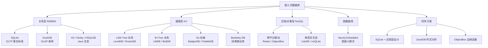
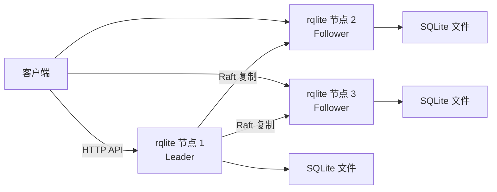

# 轻量可内嵌数据库调研

## 1. 引言：什么是嵌入式数据库

嵌入式数据库（Embedded Database）是一种与应用运行在相同进程空间的数据库引擎。它不作为独立的守护进程运行，而是以库（Library）的形式链接到应用程序中，数据操作通过函数调用完成，无需网络通信或中间件。这一本质特征——进程内模型将其与传统客户端/服务器（Client/Server，简称 C/S）架构数据库区分开来。

本章从基础概念切入，定义嵌入式数据库的核心特征，与 C/S 数据库对比明确其优势与局限，为后续章节的深度讨论建立认知锚点。

### 1.1 嵌入式数据库定义

嵌入式数据库的核心特征是"进程内集成"：DBMS 引擎作为代码库直接链接到应用进程中，数据操作以函数调用的方式完成。以 SQLite 为例，应用调用 `sqlite3_exec()` 写入数据时，数据直接写入磁盘文件，不经过任何网络栈或独立进程。这与 MySQL、PostgreSQL 等 C/S 数据库之间存在本质差异——后者需要先建立 TCP 连接、发送 SQL 协议包、等待服务端处理并返回结果。

需要澄清一个常见混淆：**嵌入式数据库**与**内存数据库**是两个不同维度的概念。内存数据库（如 Redis）将数据主体存储在内存中，持久化是可选的辅助机制；嵌入式数据库则将数据持久化在磁盘上，进程内调用是其主要访问方式。两者的划分维度不同——前者按存储介质分类，后者按部署模式分类，可以交叠存在（如 H2 可同时以嵌入式+内存模式运行）。

进一步细分，嵌入式数据库存在**纯嵌入式**与**嵌入式部署**的差别。纯嵌入式（如 SQLite、LevelDB）完全通过库函数调用工作，整个数据库引擎是应用程序的一部分；嵌入式部署（如 Neo4j Embedded）虽然嵌入在 JVM 进程中，但内部启动了独立的服务线程和协议层，本质上是一种"进程内运行的服务"。这种差异在资源开销和行为表现上都有体现。

### 1.2 嵌入式 vs C/S 架构数据库

从多个维度对比两种架构的差异，能更清晰地理解嵌入式数据库的适用范围。

| 对比维度 | 嵌入式数据库 | C/S 架构数据库 |
|---------|-------------|---------------|
| 部署复杂度 | 零配置，复制库文件即可使用 | 需安装、配置、启动独立服务进程 |
| 数据访问路径 | 函数调用（微秒级） | TCP/IP 或 IPC 网络往返（毫秒级） |
| 资源开销 | 无网络栈，内存极低（SQLite 仅数百 KB） | 需独立内存空间和网络资源 |
| 并发模型 | 以单写者多读者为典型模型 | 可支持数百到数千并发连接 |
| 可扩展性 | 受限于单机单进程资源 | 可通过主从复制、分片水平扩展 |
| 远程访问 | 默认不支持（数据文件需本地访问） | 原生支持网络远程连接 |
| 管理工具 | 通常无独立管理界面 | 提供丰富的管理监控工具 |

部署复杂度的差异最为直观——嵌入一个 SQLite 数据库只需要将它的 C 库链接到项目，调用几个初始化函数即可；而部署一套 MySQL 需要安装服务、配置权限、维护备份策略。延迟方面，函数调用通常在微秒级别完成，而即使在同一台机器上，通过 localhost TCP 的数据库查询也需要数百微秒到数毫秒——数据路径多了协议解析、线程调度和内核上下文切换。

### 1.3 核心优势与局限

嵌入式数据库的核心优势源于其架构取舍：

- **零配置部署**：没有安装程序，没有配置文件，无需 DBA 介入。将库文件与应用打包在一起即可使用。
- **函数调用级低延迟**：消除网络开销，数据操作路径极短，适合对延迟敏感的场景。
- **单文件分发**：如 SQLite 的 `.db` 文件或 LiteDB 的 `.db` 文件，整个数据库就是一个文件，便于备份、传输和版本管理。
- **系统资源极小**：内存占用可低至几百 KB，无独立进程开销，适合资源受限环境。
- **跨平台**：C/C++ 核心库可编译到几乎所有平台，从 MCU 到大型服务器。

对应的局限同样清晰：

- **并发能力有限**：单写者多读者是主流模型，高并发写入不是嵌入式数据库的设计目标。
- **无网络远程访问**：纯嵌入模式下数据仅能被本机进程访问，不适合需要远程数据共享的场景。
- **数据量受限**：受限于单机存储容量和进程地址空间，不适合海量数据场景。
- **无内置主从复制**：缺乏高可用机制，单点故障即导致数据不可用（可通过 rqlite 等衍生产品弥补）。

#### 典型适用场景

嵌入式数据库在以下场景中极具优势：移动端 App 本地存储（SQLite 是 Android/iOS 系统级组件）、IoT/嵌入式设备（资源受限的传感器和网关设备）、桌面应用（本地配置和用户数据的持久化）、测试环境与单元测试（H2 是 Spring Boot 测试默认依赖）、边缘计算节点（靠近数据源的本地处理）、以及在线原型开发（快速验证时无需配置数据库服务）。

对应地，以下场景不适合嵌入式数据库：高并发写入（如电商秒杀系统）、海量数据 OLAP（需要分布式计算引擎）、多节点强一致（需要 Raft/Paxos 集群共识）。

> **覆盖知识点**：必讲 #1（嵌入式数据库定义）、#2（嵌入式 vs C/S 架构）、#3（核心优势）、#4（核心局限）、#5（典型应用场景）；选讲 #14（嵌入式数据库与内存数据库区别）

---

## 2. 生态全景：嵌入式数据库分类谱系

嵌入式数据库经过数十年发展，已形成了覆盖关系型、键值型、文档/对象型、图数据库和时序方案五大类型的丰富生态系统。本章从数据模型、语言生态、工作负载三个维度绘制全景地图，让读者对后续章节的深入讨论建立全局预期。

### 2.1 按数据模型分类

数据模型决定了数据库的查询方式、存储组织和适用场景，是选型的最根本维度。



**关系型（RDBMS）** 是嵌入式数据库中使用最广的类型，使用固定 Schema 和标准 SQL 查询。SQLite 以 OLTP 优化占据统治地位，DuckDB 以 OLAP 优化另辟蹊径，H2、Derby、HSQLDB 则在 Java 生态中各有定位。

**键值型（KV）** 以简单的 Key-Value 接口和极高的性能著称，内部存储结构分为 LSM-Tree（LevelDB、RocksDB）和 B+Tree（LMDB、BoltDB）两大派系。键值型数据库通常不直接暴露给业务应用，而是作为上层数据库引擎的底层存储组件。

**文档/对象型（NoSQL）** 使用无 Schema 或灵活 Schema 的文档/对象模型。Realm 和 ObjectBox 面向移动端跨平台应用，LiteDB 和 UnQLite 则分别服务于 .NET 和 C 生态。

**图数据库**以属性图（Property Graph）模型为核心。Neo4j Embedded 是目前唯一的嵌入式图数据库方案，通过 Java API 嵌入 JVM 进程。

**时序方案**特殊之处在于：严格意义上的嵌入式时序数据库几乎不存在。主流时序数据库（InfluxDB、TimescaleDB、Prometheus）均以独立服务形式部署。嵌入式场景下的时序需求通常通过 SQLite 加应用层时间分区设计、DuckDB 列式存储分析，或 ObjectBox 边缘设备嵌入来实现。

### 2.2 按语言生态分类

语言生态是技术选型的实际约束——团队使用的编程语言决定了哪些嵌入方案是可行的。

| 语言生态 | 代表数据库 | 核心特点 |
|---------|-----------|---------|
| 全语言通用 | SQLite、DuckDB、LevelDB、LMDB | C/C++ 核心，多语言绑定，不受语言限制 |
| JVM 生态 | H2、Derby、HSQLDB、Neo4j Embedded | 纯 Java 实现，嵌入 Maven/Gradle 项目即可 |
| Go 生态 | BoltDB/bbolt、BadgerDB、PebbleDB | 纯 Go 实现，零 CGo 依赖（BadgerDB、PebbleDB）或极简 CGo |
| .NET 生态 | LiteDB | 纯 C# 实现，单 DLL 小于 300KB |
| 移动/跨平台 | Realm、ObjectBox | 同时支持 Android/iOS/Flutter/React Native 等多平台 |

全语言通用的数据库（SQLite、DuckDB）以其 C/C++ 核心配合多种语言绑定，几乎可以在任何编程语言中使用。而语言特有数据库（如 Go 生态的 BoltDB、.NET 生态的 LiteDB）则提供了更深度的语言集成，API 更自然，但代价是无法跨语言复用。

### 2.3 OLTP 与 OLAP 在嵌入式中的体现

联机事务处理（Online Transaction Processing，OLTP）与联机分析处理（Online Analytical Processing，OLAP）是数据库领域的基本分类，在嵌入式领域同样适用。

- **OLTP 代表——SQLite**：行式存储，面向高频小事务的增删改查。每次查询涉及的行数少，但要求响应快、事务完整。随机读写能力均衡，适合操作型工作负载。
- **OLAP 代表——DuckDB**：列式存储，面向批量聚合分析。一次查询可能扫描数百万行，但只涉及少数列。借助列式压缩和向量化执行，分析性能远超行式数据库。
- **两者的关系**：不是替代关系，而是互补分工。SQLite 负责业务事务写入，DuckDB 负责数据分析查询，两者可以共存于同一应用的不同模块中。

> **覆盖知识点**：必讲 #6（嵌入式数据库分类谱系）、#7（OLTP vs OLAP 在嵌入式中的体现）；选讲 #1（纯嵌入式 vs 嵌入式部署）

---

## 3. 关系型：通用标准与 OLTP 王者 —— SQLite

SQLite 是嵌入式数据库领域中当之无愧的事实标准。它由 D. Richard Hipp 于 2000 年创建，至今已发展了 25 年以上，被部署在数十亿台设备中——从智能手机、桌面浏览器到工业控制系统。如果不讨论 SQLite，任何一种嵌入式数据库的调研都将是不完整的。

本章深入分析 SQLite 的架构特征、并发模型和生态覆盖，帮助读者理解其"通吃场景"背后的设计取舍，以及它的适用边界在哪里。

### 3.1 SQLite 的核心设计哲学

SQLite 的设计哲学可以概括为四个关键词：零配置、无服务器、单文件和公有领域。

零配置意味着不需要安装步骤、配置文件或管理脚本——将 SQLite 库链接到项目，调用 `sqlite3_open()` 即可开始使用。无服务器是指 SQLite 不作为一个独立的守护进程运行，而是完全嵌入在宿主应用中。单文件存储是所有数据写入一个 `.db` 文件，整个数据库就是一个文件，可以像普通文件一样复制、移动和备份。

SQLite 的许可证是 Public Domain（公有领域），这意味着没有任何商业使用限制。开发者可以自由地将 SQLite 集成到任何项目中——无论是开源的还是闭源的，免费的还是商业的——无需声明、无需付费、无需遵守任何许可条款。这一授权方式是其全球普及的重要驱动力之一。

功能方面，SQLite 支持标准 SQL（虽有部分功能裁剪，如不支持 `RIGHT JOIN` 和 `FULL OUTER JOIN`），完整支持 ACID（Atomicity, Consistency, Isolation, Durability）事务。它的内存占用极低——运行时的代码体积和内存开销仅需几百 KB，可以在几乎所有硬件平台上编译运行，从 ARM Cortex-M 微控制器到 x64 服务器。

### 3.2 并发模型与性能特征

SQLite 采用**单写者多读者**的并发模型。在默认的日志模式（delete/truncate/persist）下，写操作会锁定整个数据库文件，其他读写操作在此期间被阻塞。这一设计简化了并发控制，但限制了写入吞吐。

WAL（Write-Ahead Logging）模式显著改善了这一状况。在 WAL 模式下，写操作将变更追加到独立的 WAL 日志文件尾部，而不直接修改主数据库文件；读操作读取 WAL 日志之前的旧快照。这使得**读不阻塞写、写不阻塞读**成为可能——写入进程追加日志的同时，读取进程仍可访问数据库的一致快照。WAL 模式是 SQLite 应对中等并发读写的推荐配置。

从性能边界看，SQLite 的最佳工作数据量在 10GB 以下，单表数十万到数百万条记录时表现出色。超出此范围后，写入性能开始显著下降——B-Tree 的页分裂和日志文件的管理开销随数据量指数增长。

明确不在 SQLite 设计范围内的场景包括：高并发写入（如数百线程同时 INSERT）、海量数据的复杂分析查询（SQLite 的查询优化器面对多表 JOIN 和聚合时表现有限）。

### 3.3 生态与普及度

SQLite 的生态覆盖是任何嵌入式数据库都无法比拟的：

- **语言绑定**：C 语言核心，几乎所有主流编程语言都有官方或社区绑定。Python 标准库内置 `sqlite3` 模块，Node.js 有 `better-sqlite3`（同步高性能）、Go 有 `mattn/go-sqlite3`、Rust 有 `rusqlite`。
- **操作系统原生支持**：iOS/macOS 的 Core Data、Android 的 `android.database.sqlite`、Windows 的 Microsoft.Data.Sqlite、Linux 系统级包——全平台自带 SQLite 支持。
- **移动端**：Android 应用通过 `SQLiteOpenHelper` 或 Jetpack Room ORM 使用 SQLite；iOS 应用通过 Core Data（底层 SQLite）或 FMDB/GRDB 等第三方库使用。
- **扩展能力**：FTS5 全文搜索引擎提供了高效的文本索引和搜索能力；JSON 函数支持以关系表的方式查询 JSON 数据；R*Tree 空间索引支持高效的多维范围查询。

SQLite 的单文件存储和零配置特性也使其在测试环境中极受欢迎——许多 ORM 框架（如 Prisma、TypeORM）支持在开发和测试阶段使用 SQLite，以获得快速启动和隔离性良好的测试环境。

> **覆盖知识点**：必讲 #8（SQLite 事实标准）、#9（并发模型与 WAL）、#10（适用场景与局限）、#11（生态与普及度）；选讲 #3（WAL 模式深入）

---

## 4. 关系型：OLAP 新秀 —— DuckDB

DuckDB 是近年来嵌入式数据库领域最具突破性的项目。它自 2019 年由荷兰 CWI 数据库研究组开源以来，以"嵌入式 OLAP"的独特定位迅速崛起——将列式存储、向量化执行引擎等传统 OLAP 数据库的能力压缩进一个零依赖的嵌入式中。GitHub 星数已超过 39k（截至 2026 年 7 月），成为嵌入式数据库领域成长最快的项目之一。

本章聚焦 DuckDB 的设计创新和性能特征，并重点探讨其与 SQLite 的协同生态——这对组合正在重塑嵌入式关系数据库的使用模式。

### 4.1 DuckDB 的嵌入式 OLAP 定位

DuckDB 的出现填补了嵌入式数据库在分析型工作负载上的空白。它的核心架构围绕 OLAP 优化设计：

**列式存储引擎**：数据按列而非按行存储。同一列的数据在磁盘和内存中连续排列，使得聚合查询（SUM、AVG、COUNT）只需扫描涉及的列而非整行数据。列式存储还允许高效的压缩——同一列的数据类型一致，压缩比通常远高于行式存储。

**向量化执行引擎**：以批处理（Batch Processing）的方式执行查询，每次处理一批数据（典型值为 2048 行的向量），利用 CPU SIMD（Single Instruction, Multiple Data）指令集实现数据级并行。相比传统逐行处理（Tuple-at-a-time）的火山模型，向量化执行显著减少了 CPU 指令数和缓存未命中。

DuckDB 与 SQLite 的相似之处在于：零依赖嵌入（无独立服务进程）、单文件存储（`.duckdb` 文件或纯内存运行）、多语言支持。不同之处在于它的工作负载定位——被称为"分析领域的 SQLite"。

DuckDB 采用 MIT 许可证，对商业使用完全开放。截至 2026 年 7 月，最新版本为 v1.5.0，社区极其活跃，GitHub 上已有 39k+ 星（duckdb/duckdb）。

### 4.2 关键能力与性能特征

DuckDB 最引人注目的能力之一是**直接查询外部数据**，无需导入。它原生支持通过 SQL 直接读取 Parquet、CSV、JSON 文件以及 Amazon S3 上的远程数据。这使得它非常适合做轻量级 ETL、数据湖分析和快速数据探索——无需预先建表和数据加载即可开始分析。

在分析查询性能上，DuckDB 比 SQLite 快 10-100 倍。这一差距来源于两种完全不同的设计目标：SQLite 优化单行快速查找和事务提交，DuckDB 优化全表扫描和聚合计算。两者的性能差异不是"谁更好"的问题，而是"谁更适合做什么"的问题。

DuckDB 支持处理远超物理内存容量的大数据集。当数据集超过内存大小时，它会利用磁盘交换机制将部分数据溢出到磁盘，确保查询能够完成。这一能力在资源受限的嵌入式环境中尤为实用，尽管性能会下降。

DuckDB 的语言支持覆盖广泛：Python 通过 `duckdb` 库提供极致便利的集成（DataFrame 无缝转换），同时也支持 R、Java、Node.js、Go、Rust 和 ODBC 接口，适应不同技术栈的分析需求。

### 4.3 DuckDB 与 SQLite 的协同生态

DuckDB 与 SQLite 的关系不是竞争而是互补——这一认知是理解当前嵌入式关系数据库格局的关键。

DuckDB 官方提供了 SQLite 扩展（duckdb/sqlite_scanner），可以直接打开并查询 SQLite 的 `.db` 文件，而无需将数据导入 DuckDB 格式。这意味着同一份数据文件既可以由 SQLite 服务事务型操作，也可以由 DuckDB 进行高性能分析。

典型的工作流组合是：

```text
SQLite（OLTP 层）──── 写入事务数据 ────>  .db 文件
                                              │
DuckDB（OLAP 层）──── 读取 .db 文件 ────>  分析查询结果
```

在这种架构中，SQLite 负责高频事务写入（用户注册、订单创建），DuckDB 负责复杂分析查询（月度报表、用户行为分析）。两者共享同一份数据文件，省去了 ETL 过程。

更进一步，DuckDB + MotherDuck 提供了类似 SQLite + rqlite 的分析版扩展：DuckDB 保持单机嵌入的性能优势，MotherDuck 提供云端共享存储层，使得分析数据可以在多个节点间共享和协作。这一组合在未来嵌入式分析 + 数据湖（Lakehouse）场景中展现出强大潜力。

> **覆盖知识点**：必讲 #12（DuckDB 嵌入式 OLAP 定位）、#13（关键能力与性能）、#14（SQLite 扩展）、#15（DuckDB vs SQLite 互补定位）；选讲 #15（向量化执行引擎）

---

## 5. 关系型：Java 生态三剑客 —— H2 / Derby / HSQLDB

在 Java 生态中，三款纯 Java 实现的嵌入式关系数据库——H2、Apache Derby 和 HSQLDB——长期并存。它们共享相似的基本定位（纯 Java、支持 JDBC、嵌入 JVM 进程），但在功能丰富度、性能和社区活跃度上存在显著差异。选择哪一款本质上是权衡：功能最全、社区最活跃的选择是 H2；因历史原因或特定约束选择 Derby 或 HSQLDB。

本章逐一分析三者的设计与特点，然后给出横向对比和选型建议。

### 5.1 H2 Database

H2 是当前 Java 生态中最广泛使用的嵌入式关系数据库。它由 Thomas Mueller 开发（他也是 HSQLDB 的原作者），自 2005 年发布以来已经发展到了 v2.4.240（2025 年 9 月发布）。

核心特点包括：

- **纯 Java 实现**：JAR 包仅约 2MB，嵌入任意 Java 应用只需一行 Maven 依赖。
- **三种运行模式**：嵌入式（嵌入 JVM 进程）、服务器模式（独立 TCP 服务，远程客户端连接）、集群模式（多实例同步）。
- **Spring Boot 首选**：H2 是 Spring Boot 的默认测试依赖——`spring-boot-starter-test` 自动包含 H2，开发者无需任何配置即可在测试环境中使用数据库。
- **Web 管理控制台**：内嵌轻量级 Web 界面，在开发模式下可通过浏览器直接查看表结构、执行 SQL、管理数据，极大方便了调试。
- **数据安全**：支持 AES 和 XTS 加密算法，可以对数据库文件进行透明加密。
- **全文搜索**：内置全文索引功能，支持高效的文本检索。

H2 采用 MPL 2.0（Mozilla Public License）和 EPL 1.0（Eclipse Public License）双许可证策略，对商业使用友好——可以选择遵循其中之一。

### 5.2 Apache Derby

Apache Derby 是 Java 生态嵌入式数据库中最"老牌"的项目。它最初是 IBM Cloudscape 的商业产品，IBM 于 2004 年将代码捐赠给 Apache 软件基金会，后更名为 Derby。

Derby 支持 SQL 99 和 SQL:2003 标准，提供完整的 JDBC 支持，JAR 包约 3.5MB。它支持嵌入模式和服务器模式——嵌入模式下内嵌于 JVM 中，服务器模式下作为独立网络服务运行。Derby 同样支持数据库文件的加密和压缩，在功能完整性上与 H2 接近。

然而，Derby 的社区活跃度显著低于 H2。它的更新频率较低，新功能引入缓慢，性能基准测试显示 Derby 的吞吐量明显落后于 H2。Derby 在 Apache 软件基金会旗下保持着成熟和稳定，但"成熟"的另一个含义是创新缓慢。

Derby 采用 Apache 2.0 许可证，对商业使用非常友好。它更适合遗留系统升级、已有 Apache 生态依赖的项目，或是需要更保守许可证策略的场景。

### 5.3 HSQLDB

HSQLDB（HyperSQL）是 Java 嵌入式数据库中最轻量但功能也最弱的选项。与 H2 相同的是，它也支持嵌入模式、服务器模式和内存模式；不同的是它的独特功能——支持将表数据直接导出为 CSV 文件分发，这在某些数据交换场景中可能有用。

HSQLDB 采用 BSD 许可证，在授权上最为宽松。然而，它在数据量增大时性能瓶颈明显——在数十万行规模下，HSQLDB 的查询响应时间开始显著劣化，是三款数据库中对大数据量最不友好的一款。

### 5.4 三选一决策建议

以下是三款数据库的横向对比：

| 对比维度 | H2 | Apache Derby | HSQLDB |
|---------|-----|-------------|--------|
| 纯 Java  | 是 | 是 | 是 |
| JAR 大小 | 约 2MB | 约 3.5MB | 约 1.5MB |
| 运行模式 | 嵌入/服务器/集群 | 嵌入/服务器 | 嵌入/服务器/内存 |
| 许可证 | MPL 2.0 / EPL 1.0 | Apache 2.0 | BSD |
| Spring Boot 集成 | 默认依赖 | 需手动配置 | 需手动配置 |
| Web 管理控制台 | 内置 | 无 | 无 |
| 数据加密 | AES/XTS | 支持 | 不支持 |
| 社区活跃度 | 高 | 低 | 低 |
| 大数据量性能 | 最优 | 中等 | 最弱 |
| 成熟度 | 较新但成熟 | 最老牌稳定 | 中期 |

选型建议清晰：

- **首选 H2**：功能最全、社区最活跃、性能最优、Spring 生态集成最紧密。新项目优先选择 H2。
- **考虑 Derby**：项目已有 Apache 生态依赖、需要更保守的升级节奏、或升级遗留 Cloudscape 系统时。
- **极小场景选 HSQLDB**：仅在数据量极小（数万行以下）、仅需内存模式、对性能要求不高的场景下考虑。

> **覆盖知识点**：必讲 #16（H2 Database）、#17（Apache Derby）、#18（HSQLDB）、#19（Java 三选一决策）；选讲 #9（H2 Web 管理控制台）

---

## 6. 键值型基石：LSM-Tree 原理与 LevelDB 派系

现在我们离开关系数据库的世界，进入键值型（Key-Value）数据库。与关系型数据库的 SQL 接口和固定 Schema 不同，KV 数据库以简单的 Get/Set/Delete 接口为特征，但内部存储结构——LSM-Tree 或 B+Tree——决定了性能取向的根基。本章从 LSM-Tree 的核心原理入手，解释其"将随机写转化为顺序写"的设计哲学及写放大代价，再串联 LevelDB 的奠基实现到 RocksDB 的企业级演化。

### 6.1 LSM-Tree 核心原理

LSM-Tree（Log-Structured Merge-Tree）是 LevelDB、RocksDB 等现代存储引擎的底层基石。它的核心思想来源于一个简单的观察：**顺序写入比随机写入快几个数量级**——在 HDD 上差异可达千倍，在 SSD 上也达数倍级别。

数据在 LSM-Tree 中的流向遵循一个固定的流水线：

1. **写入时**：数据先写入内存中的 MemTable（通常为跳表 Skip List，维持 Key 有序）→ MemTable 写满后冻结为不可变 MemTable → 刷入磁盘成为 SSTable（Sorted String Table）文件 → 后台 Compaction 将多层 SSTable 合并整理，清除冗余和已删除的 Key。
2. **读取时**：从 MemTable 开始 → 逐一检查不可变 MemTable → 检查 L0 层 SSTable（可能多个重叠文件）→ 逐层深入 L1、L2 等更深层，直到找到目标 Key 或确认不存在。
3. **Compaction 机制**：后台线程从一组重叠的 SSTable 中读取记录，归并排序后写入新的 SSTable，在此过程中删除被覆盖和标记删除的 Key。

这一设计的核心优势是将随机写入转化为全顺序的磁盘追加写入，在写入密集型场景下的性能远超传统的 B+Tree 方案。

### 6.2 LSM-Tree 的三重代价

LSM-Tree 的性能优势建立在三个必须接受的代价之上，它们是架构选型时必须权衡的核心因素：

**写放大（Write Amplification）**：数据从 MemTable 刷入 L0（写一次）、Compaction 到 L1（读旧文件 + 写新文件）、再到更深层（再次读写），同一份数据可能被物理写入多次。写放大系数 = `实际写入磁盘量 / 用户请求写入量`，典型 LSM-Tree 实现的 WA 值在 10-50 之间。这意味着用户写入 1MB 数据，磁盘可能实际写入 10-50MB。

**读性能一般**：数据分散在多层 SSTable 中，读取可能需要逐层查找。L0 层文件之间可能存在 Key 范围重叠，查找时需要检查所有 L0 文件。点查询（Point Lookup）需要遍历 MemTable → L0 → L1 → L2，Range Scan 更需要归并多路数据流——写入越久，层级越深，读性能衰减越明显。

**Compaction 引发 I/O 抖动**：Compaction 在后台消耗 CPU 和磁盘 I/O 资源。当大量数据同时触发 Compaction（尤其在写入爆发后），前台读写操作可能经历明显的延迟尖峰（Latency Spike）。这是 LSM-Tree 类数据库运维中最常见的挑战，需要通过限速、分层 Compaction 策略和预留 I/O 带宽来缓解。

### 6.3 LevelDB：LSM-Tree 的奠基实现

LevelDB 是 Google 于 2011 年开源的单机 KV 存储引擎，C++ 语言核心，BSD 3-Clause 许可证，代码仅约 1 万行。它在嵌入式数据库领域中扮演着一个独特的角色——**不是面向业务应用的数据库，而是更上层系统的底层存储引擎**。

核心特征：

- **随机写极优**：写入始终为顺序追加到 MemTable 和 SSTable，吞吐量稳定，不受记录大小影响。
- **随机读一般**：多层查找机制使得点查询延迟随数据量增长而劣化，Bloom Filter（LevelDB 的专属版本为基于哈希的过滤器）可部分缓解但无法根除。
- **定位独特**：不提供网络服务、不暴露 SQL 接口、甚至不处理并发请求。它的真正用户是 Database Builder——构建 TiDB、MyRocks 等分布式数据库的工程师。
- **源码学习价值**：代码量少（1 万+行）、结构清晰，被认为是学习 LSM-Tree 实现和存储引擎架构的最佳入门代码。

LevelDB 的局限在写入爆发时尤为明显：单线程 Compaction 速度跟不上写入速度时，L0 文件堆积，读性能急剧恶化。这一瓶颈直接催生了 RocksDB。

### 6.4 RocksDB：生产级企业增强

Facebook（现 Meta）在 LevelDB 基础上开发了 RocksDB，本质上是对 LevelDB 进行**企业级加固**。RocksDB 采用 Apache 2.0 / GPL 2.0 双许可证，在保留 LevelDB 架构骨架的前提下增加了以下关键增强：

| 增强特性 | 解决的问题 | 效果 |
|---------|-----------|------|
| 多线程并发 Compaction | LevelDB 单线程 Compaction 瓶颈 | 写入吞吐比 LevelDB 高数倍，L0 堆积显著减少 |
| Bloom Filter | 减少不存在 Key 的磁盘 I/O | 点查询性能显著提升，可在内存/CPU 和读性能之间折中 |
| 列族（Column Family） | 数据逻辑分组 | 类似关系型表的概念，不同列族可独立配置 Compaction/压缩策略 |
| KV 分离（WiscKey 架构） | 大 Value 在 Compaction 中的搬运开销 | 将 Value 从 LSM-Tree 中分离到独立日志，降低写放大 |
| 持久缓存（Persistent Cache） | 冷热数据访问延迟差异 | 热数据缓存在 SSD，冷数据留在 HDD 或远端 |
| 事务支持 | 跨列族原子操作 | 支持乐观/悲观事务，满足分布式一致性场景 |

生产级应用方面，RocksDB 已成为分布式系统存储引擎的事实标准：TiDB 用 RocksDB（TiKV）作为底层存储，MyRocks 将 MySQL InnoDB 替换为 RocksDB，Kafka Streams 用 RocksDB 保存状态数据，Apache Flink 也将其作为检查点状态后端。RocksDB 支持管理数十 TB 数据，并通过 ZenFS 插件适配 SMR/ZNS 分区存储设备。

### 6.5 LSM-Tree 与 B+Tree 的对比展望

回顾本章，LSM-Tree 的核心取舍可以概括为一句话：**写入性能至上，读性能和延迟稳定性为代价**。在同一份数据的生命周期中，用户每写入 1 字节，磁盘可能实际写入 10-50 字节；读取则必须跨越多个文件级别。这一取舍与下一章将介绍的 B+Tree 架构形成鲜明对比——B+Tree 追求读写均衡，以稳定的读延迟换取较低的写入性能。两种架构没有绝对优劣，选型取决于工作负载的读写特征。

> **覆盖知识点**：必讲 #20（LSM-Tree 原理）、#21（LSM-Tree 的权衡）、#22（LevelDB）、#23（RocksDB）、#24（生产级应用）、#25（LevelDB → RocksDB 演进）；选讲 #4（Bloom Filter）、#5（列族）

---

## 7. 键值型：B+Tree 派系 —— LMDB 与 BoltDB

如果说 LSM-Tree 是为写入而优化的激进派，B+Tree 则是追求读写均衡的稳健派。本章介绍的 LMDB 和 BoltDB 都以 B+Tree 为存储结构——这是一种与 LSM-Tree 互补的设计哲学。两者共享内存映射文件架构和单写者多读者模型，在语言生态和适用场景上各有侧重。

### 7.1 B+Tree 存储结构概要

B+Tree 是关系数据库中最主流的索引结构——MySQL InnoDB、PostgreSQL、Oracle 均以 B+Tree 为默认索引类型。它的核心设计包含两个关键点：

- **所有数据存在于叶子节点**：内部节点只存储索引键（Routing Keys），不存数据。叶子节点之间通过双向链表连接，形成有序的叶子链，支持高效的范围扫描。
- **扇出高、树高矮**：每个内部节点可容纳数百个键（在 4KB 页大小下典型扇出约 200-400），一颗 3 层的 B+Tree 可索引数百万条记录。

与 LSM-Tree 的对比清晰：B+Tree 的优势在于**读延迟稳定可预测**——从根到叶子的路径长度固定，每种操作的磁盘 I/O 次数已知，不会因历史写入积累而波动。代价是随机写入需要原地更新 B+Tree 节点，可能导致页分裂和写操作的随机 I/O。

### 7.2 LMDB（Lightning Memory-Mapped Database）

LMDB 由 Symas 公司开发，在 B+Tree 嵌入式 KV 数据库中性能最为极致。它的核心架构突破是**内存映射文件**（Memory-Mapped File）——将磁盘上的 `data.mdb` 文件直接映射到进程的虚拟地址空间，数据访问由操作系统的虚拟内存子系统完成，数据库引擎自身无需管理数据缓冲。

架构特征：

- **B+Tree + 内存映射**：读取直接从内存映射区域访问，零拷贝，延迟极低。操作系统按需换页（Demand Paging），主动管理数据的热度。
- **ACID + MVCC**：完整支持 ACID 事务，通过多版本并发控制（MVCC）实现读一致性。读者始终看到事务开始时的数据快照，读操作完全不使用锁，永不阻塞。
- **单写者多读者**：写操作互斥，读操作无锁并发。这一模型与 LMDB 的高读性能目标完全契合。
- **单文件存储**：主数据文件 `data.mdb` + 锁文件 `lock.mdb`，简洁清晰。

LMDB 采用 OpenLDAP Public License，C 语言核心 + 多语言绑定（Python、Java、Rust 等）。它的读取性能在所有嵌入式 KV 数据库中居于顶端，典型应用包括深度学习框架 Caffe 的默认数据集存储格式——训练中大量读取样本，写入仅在预处理阶段发生。局限在于单写者模型限制写入吞吐，高写入场景下不如 LSM-Tree 派系。

### 7.3 BoltDB / bbolt：Go 生态的 B+Tree 继承者

BoltDB 是 Ben Johnson 开发的纯 Go B+Tree KV 数据库，设计受 LMDB 启发，使用相同的**内存映射文件 + B+Tree** 架构。BoltDB 提供完全可序列化（Serializable）的 ACID 事务，API 设计以简洁著称——核心接口仅包括 `DB`、`Tx`、`Bucket` 三个类型：

```go
db, _ := bolt.Open("my.db", 0600, nil)
defer db.Close()

db.Update(func(tx *bolt.Tx) error {
    b := tx.Bucket([]byte("MyBucket"))
    return b.Put([]byte("key"), []byte("value"))
})
```

BoltDB 的现状需要特别说明：原作者 Ben Johnson 于 2017 年归档了原始仓库 `boltdb/bolt`，不再维护。etcd 团队 fork 为 `etcd-io/bbolt` 并继续活跃维护——修复了原项目的 bug，新增了 `Freelist` 类型选择等优化。bbolt 目前是 etcd 的底层存储。在实际 Go 项目选型中，应始终使用 `go.etcd.io/bbolt` 而非原版 BoltDB。

### 7.4 单写者模型的工程考量

LMDB 和 BoltDB（以及 bbolt）都采用单写者多读者模型。这一选择并非技术落后，而是经过深思熟虑的**工程取舍**：

- **为何选择单写者**：多写者并发引入了锁竞争、事务冲突、死锁检测等复杂问题。单写者模型彻底消除了这些复杂性，代码更简单、行为更可预测。对于嵌入式场景（单进程、单文件），单写者的写入吞吐已能满足绝大多数需求。
- **如何提升写入吞吐**：批量写入是最有效的优化——将多个写操作合并到一个事务中提交。WAL 优化（如 BoltDB 的页面回收机制）可减少事务提交的 fsync 开销。
- **何时需要多写者**：当多个进程可能同时写入同一数据库文件时（如分布式应用实例），RocksDB 等支持并发写入的方案是更合适的选型。

> **覆盖知识点**：必讲 #26（B+Tree 概念）、#27（LSM-Tree vs B+Tree 对比）、#28（LMDB）、#29（BoltDB/bbolt）；选讲 #6（LMDB MVCC 实现）

---

## 8. 键值型：Go 生态的创新力量 —— BadgerDB 与 PebbleDB

前两章分别讨论了 LSM-Tree 和 B+Tree 两大派系的代表数据库。在 Go 生态中，两类数据库都有纯 Go 实现，并且出现了 BadgerDB（针对 LSM-Tree 写放大进行架构创新）和 PebbleDB（RocksDB 功能的 Go 移植）这样有突破性的项目。本章聚焦这两款数据库的设计创新和 Go 生态的选型策略。

### 8.1 BadgerDB：键值分离的创新架构

BadgerDB 由 Dgraph 团队开发，纯 Go 实现，Apache 2.0 许可证，GitHub 星数超 10k。它的核心创新在于**键值分离**（Key-Value Separation）架构，源自 WiscKey 学术论文（FAST 2016）。

传统 LSM-Tree 的写放大根源在于：无论 Key 还是 Value，都随 Compaction 被反复搬运。WiscKey 的洞见是：大多数场景下 Value 远大于 Key，两者捆绑处理导致不必要的 I/O。BadgerDB 的架构将两者彻底分离：

- **Key 存储在 LSM-Tree 中**：保持 Key 的有序性，用于快速查找和范围扫描。Value 字段只存 Value Log 中的位置指针，而非实际 Value。
- **Value 存储在 Value Log 中**：Value Log 是仅追加写入的文件，不参与 Compaction。新 Value 追加到尾部，旧 Value 由 GC 异步清理。

这一设计的直接效果是显著降低写放大——Value 数据只被写入 Value Log 一次（GC 时可能再迁移一次），不再随 Compaction 多次搬运。BadgerDB 特别适合**Key 小、Value 大**的场景——比如对象存储元数据、Blob 索引、文件系统缓存等。但需要注意：海量小对象场景下，Value Log 中的大量存活指针会给 Go GC 带来显著压力。

### 8.2 PebbleDB：RocksDB 的 Go 移植

PebbleDB 由 CockroachDB 团队开发，纯 Go 实现，BSD 3-Clause 许可证。它的定位非常明确：**在 Go 生态中复现 RocksDB 的功能和性能特征**。

与追求架构创新的 BadgerDB 不同，PebbleDB 在功能兼容性上下功夫——它实现了 RocksDB 的核心接口和语义，包括列族、Bloom Filter、Compaction 策略、事务支持等。这使得已有 RocksDB 经验可以迁移到 Go 生态中。

PebbleDB 的代码比 BadgerDB 更加成熟和健壮。CockroachDB 将其作为内置存储引擎，在生产环境中经过了大规模验证。CockroachDB 团队还使用**确定性仿真测试**（Deterministic Simulation Testing）来验证 PebbleDB 在各类故障场景下的正确性，这一测试方法论本身即具有工程参考价值。

### 8.3 Go 生态嵌入式 KV 选型

Go 生态提供了三款定位各异的嵌入式 KV 数据库：

| 数据库 | 存储结构 | 核心优势 | 最佳场景 | 写放大 |
|-------|---------|---------|---------|-------|
| BoltDB / bbolt | B+Tree | API 简洁，读写均衡，事务可靠 | 中小数据量需稳定读写的 Go 项目 | 无（原地更新） |
| BadgerDB | LSM-Tree + 键值分离 | 超高写入吞吐，低写放大 | 大 Value、高写入吞吐场景 | 低（键值分离架构） |
| PebbleDB | LSM-Tree（标准） | 功能丰富，生产级验证，RocksDB 兼容 | 需要 RocksDB 级功能的 Go 项目 | 中等 |

选型决策应依据三个维度：**数据量级**（小 → BoltDB，中 → PebbleDB，大 → BadgerDB 或 PebbleDB）、**读写比例**（读多 → BoltDB，写多 → BadgerDB）、**Value 大小**（大 Value → BadgerDB 键值分离优势明显，小 KV → 三款差距不大）。

> **覆盖知识点**：必讲 #30（BadgerDB）、#31（PebbleDB）、#32（Go 生态 KV 选型）

---

## 9. 键值型：经典伯克利 —— Berkeley DB

如果说前面介绍的数据库都是现代开源实现的代表，Berkeley DB 则代表了嵌入式数据库的经典时代。它曾经是"嵌入式数据库"这个术语的代名词，今天依然被部署在无数路由器和嵌入式设备中。但许可证的变更使其在现代技术选型中的位置发生了根本性变化。

### 9.1 Berkeley DB 的历史与定位

Berkeley DB 起源于加州大学伯克利分校的 BSD Unix 项目，1996 年成立 Sleepycat 公司进行商业运营，2006 年被 Oracle 收购。在嵌入式数据库概念尚未普及的年代，Berkeley DB 已经以 300KB 的核心库体积和函数式 API 提供了企业级的数据管理能力。

核心特征包括：

- **函数式 API**：不提供 SQL 接口，通过 C/C++ 函数调用直接操作数据（`db->put(db, &key, &data)`）。这是嵌入式数据库最初的面貌，也是"嵌入"最纯粹的形式。
- **多种存储格式**：支持 BTree、Hash、Queue、Recno 四种结构，开发者可根据数据访问模式选择最优格式。
- **256TB 容量上限**：虽然是嵌入式库，数据容量上限远超 SQLite，适合大容量嵌入式场景。
- **高并发支持**：作为纯嵌入式库，Berkeley DB 可在不依赖独立进程的情况下支持上千并发用户——其内部实现了多线程安全访问和细粒度锁管理，这在早期嵌入式数据库中极为罕见。

Berkeley DB 曾是嵌入式数据库的代名词，广泛部署在 Cisco 路由器、网络存储设备、电信基础设施中。语言绑定覆盖 C、C++、Java、Python、PHP、Perl、Tcl 等，跨语言能力极为丰富。

### 9.2 许可证变更与现状

Berkeley DB 的许可证演变是决定其现代命运的关键事件：

| 阶段 | 协议 | 时间 | 对商业使用的影响 |
|-----|------|------|----------------|
| 原创 | Sleepycat License | 1996-2006 | 开源可用，商业使用需付费，被 OSI 认证为开源协议 |
| Oracle 收购 | Sleepycat License | 2006-2023 | 延续原条款，社区活跃度缓慢下降 |
| 转向 AGPL | AGPL v3 | 2023 年后 | 商业闭源几乎不可用，社区大幅萎缩 |

**AGPL v3 的影响是决定性的**。AGPL（Affero General Public License）的要求比 GPL 更为严格：即使软件仅通过**网络内部通信**提供服务，也需向所有网络用户公开源码。这意味着在商业闭源产品中嵌入 Berkeley DB，需要将整个产品以 GPL 兼容协议开源，或向 Oracle 购买商业许可证。对于绝大多数商业公司，这一条款不可接受。

目前，Berkeley DB 的社区活跃度已大幅下降，新项目几乎不再纳入选型。它的历史地位不可否认——它定义了"嵌入式数据库"的概念，影响了后来几乎所有 KV 存储的设计理念——但现代采用必须极其审慎地评估许可证约束。

> **覆盖知识点**：必讲 #33（Berkeley DB 历史与定位）、#34（Berkeley DB 许可证问题）；选讲 #2（历史地位）

---

## 10. 文档/对象型（上）：跨平台移动方案 —— Realm 与 ObjectBox

至此，我们已覆盖关系型和键值型两大主要类别。接下来进入嵌入式数据库的第三个重要分支——文档/对象型数据库。这类数据库的特点是灵活 Schema、API 面向对象直接操作、数据以自有二进制格式而非通用格式存储。本章聚焦跨平台移动方案的两大主力：Realm 与 ObjectBox。

### 10.1 MongoDB Realm（Atlas Device SDK）

Realm 最初由 Realm Inc. 于 2014 年创建，2019 年被 MongoDB 收购后更名为 Atlas Device SDK。其核心引擎保持 Apache 2.0 开源协议，同步服务（MongoDB Atlas Device Sync）基于 SSPL 许可收费。Realm 的设计理念是**直接持久化对象**——开发者操作的是原生语言的类/结构体实例，无需 SQL 语句或 ORM 映射。

核心特征：

- **C++ 核心引擎**：跨平台统一底层，各语言绑定通过桥接层调用。Android（Java/Kotlin）、iOS（Swift/Obj-C）、React Native、.NET 共享同一核心。
- **零 ORM 层**：对象变更自动追踪并持久化。读取时延迟加载（Lazy Loading），仅在访问属性时才从磁盘读取数据，读写速度显著优于 SQLite + ORM 方案。
- **离线优先**：数据在本地持久化，网络由 Atlas Device Sync 负责设备与云端的数据同步。离线时本地读写不受影响，恢复网络后自动同步。
- **实时更新**：通过订阅特定数据分区，数据变更时实时推送通知到客户端。

Realm 的 APK 增量约为 4-6MB，在 Android 端的大小开销是 ObjectBox 的 2-3 倍。核心引擎开源（Apache 2.0），MongoDB 生态加持提供了强大的云端能力，但也意味着对 MongoDB Atlas 的依赖。

### 10.2 ObjectBox

ObjectBox 由 greenrobot 团队开发——这支团队在 Android 生态中因 EventBus（事件总线框架）和 GreenDAO（ORM 框架）而享有声誉。ObjectBox 延续了 GreenDAO 的高性能基因，但彻底舍弃了 SQLite + ORM 路线，采用自有二进制格式从头构建，并率先在嵌入式场景中集成了向量数据库能力。

与 Realm 的关键性能对比如下：

| 对比项 | ObjectBox | Realm |
|-------|----------|-------|
| Android 端写性能 | 比 Realm 快 2-3 倍 | 基准 |
| APK 增量 | 1-2 MB | 4-6 MB |
| 跨平台 | Android/iOS/C++/Flutter/Dart/Go/Python | Android/iOS/React Native/.NET |
| 对象关系 | 支持对象关系 | 支持连接（Links） |
| 向量搜索（VSS） | **内置** | 无 |
| 同步方案 | 独立企业版收费 | MongoDB Atlas Device Sync（SSPL） |
| 核心许可证 | Apache 2.0 | Apache 2.0 |

ObjectBox 的最新版本内置了**向量数据库**（VSS, Vector Similarity Search）能力，支持在嵌入式设备上执行 AI 相似性搜索。这一功能对于边缘 AI 场景具有特殊意义——设备端存储数据的同时，可以基于向量距离检索语义相似的内容，无需调用云端 AI 服务。ObjectBox 也是目前唯一内置向量搜索能力的嵌入式数据库。

### 10.3 移动端存储方案演变

移动端本地存储方案的发展经历了一条清晰的演化路径：

```text
GreenDAO (SQLite ORM) → Realm (对象持久化) → ObjectBox (超高性能 + 向量搜索)
```

每个阶段解决上一阶段的核心痛点：GreenDAO 简化原生 SQLite API 的繁琐使用；Realm 消除 ORM 层的性能开销；ObjectBox 在对象持久化的基础上大幅提升性能并集成 AI 能力。

**选型建议**：

- **性能优先**：选择 ObjectBox。读写性能领先、APK 增量最小、跨平台语言覆盖最广（含 Dart/Go），内置向量搜索更已在边缘 AI 场景占得先机。
- **生态优先**：选择 Realm。MongoDB Atlas 提供强大的云端同步、数据分区管理和实时更新能力，适合需要复杂跨设备数据协作的移动应用。
- **稳妥基础方案**：SQLite + Room（Android）/ GRDB（iOS）等 ORM 方案。兼容性最广、学习成本最低、不依赖商业公司的持续投入。对大多数移动应用来说，SQLite ORM 方案的性能已足够。

> **覆盖知识点**：必讲 #35（Realm）、#36（ObjectBox）、#37（ObjectBox VSS）、#38（Realm vs ObjectBox 对比）；选讲 #10（移动端存储方案演变）

---

## 11. 文档/对象型（下）：单语言生态 —— LiteDB 与 UnQLite

前一章的 Realm 与 ObjectBox 以跨平台移动为目标，本章的两款数据库则面向特定语言生态——LiteDB 是 .NET 生态的首选嵌入式 NoSQL，UnQLite 则是 C 生态中文档 + 键值双模式的全能选手。它们的共同特点是：在各自的语言社区中提供比通用方案（SQLite）更自然的 API 和更深度的集成体验。

### 11.1 LiteDB：.NET 生态首选嵌入式 NoSQL

LiteDB 是一款纯 C# 实现的嵌入式 NoSQL 文档数据库，单 DLL 不足 300KB，MIT 许可证，GitHub 星数约 9k+（mbdavid/LiteDB）。它的设计理念可以概括为"MongoDB 的嵌入式版本"——API 风格、文档模型、查询语法都与 MongoDB 高度相似，但以内嵌方式运行，无需服务进程。

**核心能力**：

- **文档模型**：数据以 BSON 文档形式存储，支持嵌套文档和数组。与 MongoDB 不同的是，LiteDB v5 从标准 BSON 转向了 BSON+（自定义序列化格式），增加了对 `decimal`、`Guid`、`DateTimeOffset` 等 .NET 原生类型的直接支持。
- **LINQ 查询**：天然支持 .NET LINQ 表达式查询，C# 开发者可以用熟悉的 `Where()`、`Select()`、`OrderBy()` 链式语法操作数据库，无需学习 SQL 或专门的查询 DSL。
- **ACID 事务**：支持单文件范围内的事务操作。LiteDB 的 WAL（Write-Ahead Logging）模式确保写入失败时的数据可恢复。
- **数据加密**：支持 AES 加密，保护敏感数据的磁盘存储。
- **GridFS 大文件**：支持将超过文档大小限制（16MB）的大文件自动分块存储，适用于图片、附件等场景。

LiteDB 的典型应用场景包括：.NET 桌面应用（WPF/WinForms）本地数据存储、Xamarin / .NET MAUI 移动应用、小型 Web 应用的单用户数据存储、以及作为应用文件格式（以数据库文件直接作为应用文件保存格式）。

**版本说明**：LiteDB v5 是一次重大重构——从 BSON 文档格式改为 BSON+、重新设计序列化引擎、引入事务范围支持、性能大幅提升。v5 之后 LiteDB 在读写吞吐上已接近 SQLite 的 NoSQL 替代水平。

**与 SQLite 的选型对比**：在 .NET 生态中选择 LiteDB 而不是 SQLite，核心考量是 Schema 灵活性——文档模型天然适应 Schema 多变的业务场景，而关系模型在数据关联复杂时仍占优。如果项目已在使用 MongoDB 或有大量 JSON 数据交换，LiteDB 的学习成本更低。

### 11.2 UnQLite：C 生态的文档 + KV 双模式

UnQLite 是一款 C 语言实现的单文件 NoSQL 数据库，BSD-2-Clause / Sleepycat 双许可证。它在嵌入式数据库圈子中知名度不高，但功能设计颇具特色——是极少数同时原生支持**文档操作**（类似 MongoDB）和**键值操作**（类似 Redis）的嵌入式数据库。

**独特亮点**：

- **JX9 嵌入式脚本引擎**：UnQLite 内置了一个轻量级的、类似 JavaScript 的脚本引擎 JX9。开发者可以在数据库内部执行脚本逻辑，实现数据操作与业务逻辑的共置——例如在写入前进行数据校验、在查询时动态计算衍生字段。这在嵌入式数据库中是独一无二的能力，在 C/C++ 嵌入式项目的快速原型开发中尤为实用。
- **双模式切换**：通过 API `unqlite_open()` 打开数据库后，可选择文档模式（`unqlite_doc_*` 函数族）或 KV 模式（`unqlite_kv_*` 函数族）。两种模式可交替使用于同一数据库文件，这在混合数据访问模式（如配置 KV + 业务文档）中非常方便。
- **ACID 事务**：通过 WAL 模式实现崩溃安全和事务原子性，零配置开箱即用。
- **零外部依赖**：单 C 文件编译，无需第三方库，适合交叉编译到 MCU 等资源受限平台。

UnQLite 的局限性在于社区规模小、文档以英文为主且不够系统化、更新频率不固定。它更适合对库体积和功能密度有极端要求的 C/C++ 嵌入式项目，或需要将简单业务逻辑嵌入数据库以简化应用层代码的场景。

### 11.3 单语言生态选型小结

| 对比项 | LiteDB | UnQLite |
|-------|--------|---------|
| 语言生态 | .NET / C# | C/C++ |
| 数据库大小 | 单 DLL < 300KB | 单 C 文件编译 |
| 数据模型 | 文档（BSON+） | 文档 + KV 双模式 |
| API 风格 | 类似 MongoDB + LINQ | 函数式 API |
| 独特能力 | .NET 原生类型支持、LINQ 查询 | JX9 嵌入式脚本引擎 |
| 许可证 | MIT | BSD-2-Clause / Sleepycat |
| 生态活跃度 | 高（9k+ stars，社区活跃） | 低（知名度不高） |
| 最佳场景 | .NET 桌面/移动应用 | C/C++ 嵌入式设备 |

选型建议：如果身处 .NET 生态，LiteDB 是替代 SQLite 做 NoSQL 存储的首选；如果项目是 C/C++ 嵌入式系统且需要灵活的数据模型，UnQLite 值得评估。跨语言或需要长期社区支持的项目，仍应优先考虑通用方案。

> **覆盖知识点**：必讲 #39（LiteDB）、#40（UnQLite）；选讲 #11（LiteDB v5 重构）、#12（UnQLite JX9 脚本引擎）

---

## 12. 图数据库与时序方案

关系型、键值型和文档型覆盖了绝大多数业务场景，但仍有两类特殊的数据模型需要单独讨论——图模型和时间序列模型。图数据库用节点和边描述实体间关系，在大规模关联分析中不可替代；时序方案则面向持续的指标采集与监控分析。本章探讨 Neo4j 作为唯一主流嵌入式图数据库的能力，以及嵌入式时序场景下"无专用方案，但有实用替代路径"的现实。

### 12.1 Neo4j Embedded：图数据库的嵌入模式

Neo4j 是图数据库领域的标杆产品，其嵌入式模式（Neo4j Embedded）提供了一种独特的部署选择：将图引擎作为 Java 库嵌入 JVM 进程内，通过 API 调用直接操作图数据。

**核心架构**：

- **原生图存储引擎**：Neo4j 使用原生图存储（Native Graph Storage）——节点和关系在磁盘上物理相邻存储，遍历时无需通过索引间接定位。这一设计使得深度遍历（如社交网络中 5 度关系查询）的性能远优于将图数据存放在关系型数据库中。
- **ACID 事务**：完整的事务支持，写操作具备原子性和持久性保证。
- **Cypher 查询语言**：声明式图查询语言，描述"什么关系连接了什么节点"。Cypher 的语法直观易读——`MATCH (a:Person)-[:KNOWS]->(b:Person) RETURN a, b` 即表达"查找认识别人的所有人"。
- **Apache Lucene 索引**：内置 Lucene 引擎支持高效的节点属性索引和全文搜索。
- **混合模式**：同一 Neo4j 实例可同时提供嵌入 API（进程内调用）和 Bolt 协议（远程客户端通过 TCP 访问），灵活性极高。

**使用方式**：

Neo4j Embedded 通过 Maven 引入依赖后，以 Java API 方式嵌入：

```java
// 嵌入模式初始化
GraphDatabaseService graphDb = new GraphDatabaseFactory()
    .newEmbeddedDatabase(new File("data/graph.db"));

// 事务内创建节点和关系
try (Transaction tx = graphDb.beginTx()) {
    Node person = graphDb.createNode(Label.label("Person"));
    person.setProperty("name", "Alice");
    tx.success();
}
```

**适用场景**：社交网络关系分析（好友链、影响力传播）、推荐引擎（用户-物品二部图、协同过滤）、知识图谱（实体间关系的语义查询）、权限管理（基于角色的复杂继承关系）、网络拓扑分析。

**许可证注意事项**：Neo4j Community Edition 以 GPL v3 发布，嵌入式模式使用 AGPL 许可证。AGPL 要求即使通过网络内部提供服务也需公开源代码，这对商业闭源产品的嵌入式使用构成显著障碍。商业使用需购买 Neo4j 商业许可证或选择其他图计算方案（如 Apache TinkerPop + JanusGraph 的嵌入式组合）。

### 12.2 嵌入式时序方案综述

严格意义上的嵌入式时序数据库几乎不存在。主流时序数据库——InfluxDB（独立守护进程）、TimescaleDB（PostgreSQL 扩展，需 PG 服务进程）、Prometheus（独立服务）、VictoriaMetrics（独立服务）——均要求以独立进程形式部署。这并非技术上的缺失，而是时序工作负载的特性决定的：持续的写入流、数据保留策略、下采样聚合——这些功能天然适合常驻服务进程来管理。

嵌入式场景下的时序需求，通常通过以下替代路径实现：

**方案一：SQLite + 应用层时序设计**

最直接的路径——SQLite 单文件存储 + 应用层时间分区表设计。关键实践：
- **时间分区表**：按小时或天创建独立表（如 `sensor_data_20260722`），查询时按时间范围路由到对应表，避免单表膨胀。
- **物化视图/预聚合**：应用层定时执行聚合查询（`SELECT AVG(value), MAX(value) ... GROUP BY time_bucket`），将结果写入汇总表。
- **保留策略**：应用层定期 `DROP TABLE` 超期数据分片表，实现数据自动老化。
- 适合写入频率中等（每秒数十到数百点）、数据保留期明确的场景。

**方案二：DuckDB 列式时序分析**

DuckDB 的列式存储对时序分析查询天然友好——按时间范围的聚合查询只需扫描时间列和指标列，充分利用列式压缩和向量化执行。典型用法：SQLite 负责写入，DuckDB 定期负载分析查询。适合需要复杂时序聚合分析（降采样、滑动窗口、异常检测）但不要求实时性的场景。

**方案三：ObjectBox 边缘设备**

ObjectBox 嵌入在 IoT 网关或边缘设备中，直接运行在设备端。配合其内置的向量搜索能力，可在边缘同时存储设备指标数据和进行 AI 推断，适合车辆 ECU、工业传感器节点等场景。

**选型建议**：写入频率低且无分析需求选择 SQLite + 应用层设计；需要批量时序分析选择 DuckDB；边缘 AI 场景需要设备端存储 + 推断选择 ObjectBox；高频写入和大规模时序分析仍应投入独立时序数据库（InfluxDB / TimescaleDB）。

> **覆盖知识点**：必讲 #41（Neo4j Embedded）、#42（嵌入式时序方案）；选讲 #16（时序方案的嵌入式替代方案对比）

---

## 13. 轻量分布式补充方案 —— rqlite 与 MotherDuck

纯嵌入式数据库的单机本质意味着它们天然没有高可用和数据共享能力。当应用场景需要跨越单机边界时——例如边缘计算中多个节点需要协同、数据分析团队共享数据集——就需要在"纯嵌入"和"重量级分布式系统"之间寻找折中。本章介绍的 rqlite 和 MotherDuck 正是这类轻量级分布式补充方案。

### 13.1 rqlite：SQLite 的高可用增强

rqlite 是一个轻量级分布式关系数据库，将 SQLite 的存储引擎与 Raft 一致性算法结合，实现了高可用和自动故障恢复。它不是纯嵌入式方案（需要独立进程），但单二进制文件、HTTP API、Docker 一键部署使其足够轻量。

**架构原理**：



每个 rqlite 节点内部嵌入 SQLite 引擎，节点之间通过 Hashicorp Raft 库实现 Leader 选举和日志复制。客户端通过 HTTP API 与集群交互——写入请求由 Leader 节点接收并复制到多数派节点后提交，读取请求可选择由任意节点处理。

**核心特性**：

- **单二进制部署**：Go 语言编译，单文件二进制约 20MB，无外部依赖。通过 `rqlite [节点地址]` 即可启动一个服务节点。
- **HTTP API**：所有操作通过 RESTful HTTP 接口完成——`POST /db/execute` 执行写入、`GET /db/query` 执行查询。任意语言的 HTTP 客户端都可对接。
- **读一致性选择**：rqlite 支持三种读取一致性级别：
  - `weak`（弱一致）：直接读取本地节点数据，性能最好但可能读到过期数据。
  - `strong`（强一致）：确保读到 Leader 节点已提交的最新数据，性能最差。
  - `none`（无保证）：直接读取本地 SQLite 数据，性能最佳但一致性最弱。
  
  开发者可以在一致性保证和查询性能之间灵活折中。
- **自动故障切换**：Leader 节点故障时，剩余节点自动触发选举，选举完成后新 Leader 接管写入服务，应用层无须干预。
- **预写日志（Write-Ahead Logging）队列**：在节点故障恢复时，通过快照（Snapshot）和 Raft 日志回放确保数据不丢失。

资源开销：三个节点的 rqlite 集群约需 100 MB 内存和少量 CPU，远低于同等功能的分布式数据库。

**典型场景**：

- **边缘计算多节点**：多个边缘网关运行 rqlite 集群，本地数据自动复制，单个网关故障不影响数据完整性。
- **小规模分布式系统**：几十台规模的管理系统、配置中心，需要数据高可用但不需要分布式数据库的完整功能。
- **嵌入式监控**：设备状态数据的集群存储。

**与纯 SQLite 的关系**：rqlite 不是 SQLite 的替代品，而是补充。单节点场景直接使用 SQLite，多节点高可用场景升级为 rqlite。两者共享相同的 SQLite 存储格式，数据可互导。

### 13.2 DuckDB + MotherDuck：云端分析扩展

MotherDuck 是 DuckDB 的云端扩展层，思路与 rqlite 异曲同工：保持单机嵌入引擎的极致性能，通过云端服务补上共享和协作能力。

核心模式：DuckDB 仍然在本地运行（零依赖嵌入，列式向量化执行），MotherDuck 提供云端存储层。开发者将 DuckDB 数据库文件（`.duckdb`）同步到 MotherDuck 后，多个团队成员可在不同的 DuckDB 实例中查询同一份数据，实现分析数据的共享和协作。

DuckDB + MotherDuck 适合以下场景：
- 数据分析团队共享分析数据集——每人本地 DuckDB 实例操作云端数据，无需搭建数据分析服务器。
- 结合 SQLite 事务写入 + DuckDB 本地分析 + MotherDuck 云端共享的三层架构，覆盖从单机到协作的完整需求。

**横向类比**：

| 对比项 | SQLite + rqlite | DuckDB + MotherDuck |
|-------|----------------|---------------------|
| 单机引擎 | SQLite（OLTP 优化） | DuckDB（OLAP 优化） |
| 分布式机制 | Raft 一致性复制 | 云端共享存储层 |
| 目标场景 | 高可用事务存储 | 分析数据共享与协作 |
| 进程要求 | 需轻量进程 | 本地嵌入 + 云端服务 |
| 许可证 | MIT（rqlite） | MIT（DuckDB）+ 商业（MotherDuck） |

> **覆盖知识点**：必讲 #43（rqlite）、#44（DuckDB + MotherDuck）；选讲 #13（rqlite Raft 实现细节）

---

## 14. 全景对比与选型决策

前 13 章逐一分析了 15 款嵌入式数据库，覆盖关系型、键值型、文档/对象型、图数据库和轻量分布式补充方案。本章将所有这些方案汇聚到一张对比总表中，并从七个维度构建选型决策框架，最后给出典型场景下的一步到位的推荐速查。本章是全篇的实用价值核心。

### 14.1 交叉对比总表

下表汇总了 15 款嵌入式数据库在 9 个关键维度上的对比数据：

| 数据库 | 类型 | 存储格式 | 嵌入方式 | 语言生态 | 许可证 | GitHub Stars | 性能特点 | 最佳场景 |
|-------|------|---------|---------|---------|-------|-------------|---------|---------|
| SQLite | RDBMS（OLTP） | 单文件 `.db` | 纯嵌入（C 库） | 全语言 | Public Domain | 生态标准（非 GitHub 托管） | 读写均衡，最佳 <10GB | 通用嵌入式/移动/IoT/桌面 |
| DuckDB | RDBMS（OLAP） | 单文件 `.duckdb` | 纯嵌入（C++ 库） | 全语言 | MIT | 39k+ | 分析查询比 SQLite 快 10-100x | 数据分析/ETL/OLAP |
| H2 | RDBMS | 单文件/内存 | 纯嵌入（Java JAR） | Java 生态 | MPL 2.0 / EPL 1.0 | 核心较小（非 GitHub 镜像） | 功能最全的 Java 嵌入 DB | Java 开发测试/Spring Boot |
| LevelDB | KV LSM-Tree | 目录（多 SST） | 纯嵌入（C++） | C++ 多绑定 | BSD 3-Clause | 36k+ | 顺序写极优，随机读一般 | 底层存储引擎/写密集 |
| RocksDB | KV LSM-Tree | 目录（多 SST） | 纯嵌入（C++） | C++ 多绑定 | Apache 2.0 / GPL 2.0 | 28k+ | 写入比 LevelDB 高数倍，支持数十 TB | 分布式存储引擎/TiDB/Kafka |
| LMDB | KV B+Tree | 单文件 `data.mdb` | 纯嵌入（C 库） | C 多绑定 | OpenLDAP Public License | 核心项目（非独立仓库） | 极高读性能，单写者 | 深度学习数据集/极高读场景 |
| BoltDB / bbolt | KV B+Tree | 单文件 | 纯嵌入（Go） | Go 生态 | MIT | 15k+（bbolt） | 读写均衡，API 简洁 | Go 项目中等数据量 KV |
| BadgerDB | KV LSM+KV分离 | 目录 | 纯嵌入（Go） | Go 生态 | Apache 2.0 | 10k+ | 高写入吞吐，低写放大 | Go 项目大 Value/高写场景 |
| Berkeley DB | KV 多模式 | 目录（多文件） | 纯嵌入（C 库） | C/Java/Python 等 | AGPL v3 | Oracle 产品（非开源仓库） | 高并发，256TB 容量 | 遗留系统/资源受限设备 |
| Realm | 文档/对象 | 自有二进制 | 纯嵌入（C++ 引擎） | Android/iOS/RN/.NET | Apache 2.0 + SSPL | MongoDB 产品 | 比 SQLite ORM 快数倍至 10x | 移动端离线/跨设备同步 |
| ObjectBox | 对象/文档 | 自有二进制 | 纯嵌入（C++ 引擎） | 跨平台（含 Flutter/Dart） | Apache 2.0 | 7.6k+ | Android 端比 Realm 快 2-3x，APK 1-2MB | 移动端/IoT/边缘AI/向量搜索 |
| LiteDB | 文档 NoSQL | 单文件 `.db` | 纯嵌入（C#） | .NET 生态 | MIT | 9k+ | 单 DLL <300KB，MongoDB-like API | .NET 桌面/移动/小型 Web |
| UnQLite | 文档 + KV | 单文件 | 纯嵌入（C 库） | C/C++ | BSD-2-Clause / Sleepycat | 知名度低 | 双模式 + JX9 脚本引擎 | C/C++ 嵌入式设备需 NoSQL |
| Neo4j Embedded | 图（Property Graph） | 目录（多文件） | 嵌入部署（Java JAR） | Java 生态 | GPL v3 / AGPL | 13k+（主仓库） | 原生图存储，深度遍历极优 | 知识图谱/社交分析/推荐引擎 |
| rqlite | RDBMS 分布式 | SQLite 单文件 | 轻量进程（Go 二进制） | HTTP API 任意语言 | MIT | 16k+ | 三节点集群约 100MB 内存 | 高可用嵌入式SQL/边缘集群 |

> 注：GitHub Stars 数据截至 2026 年 7 月，为近似值；"纯嵌入"指以库函数调用的方式运行，与应用代码共享进程空间；"嵌入部署"指虽然嵌入在应用进程中，但内部启动了独立服务线程或协议层（如 Neo4j Embedded、rqlite）

### 14.2 七维选型决策框架

选型不是从数据库出发找场景，而是从场景需求出发过滤数据库。以下决策框架按七个维度依次过滤：

```text
第1步：数据类型 → 第2步：查询模式 → 第3步：语言生态 → 
第4步：并发要求 → 第5步：数据量级 → 第6步：部署模式 → 
第7步：许可证限制
```

**第 1 维：数据类型匹配**

这是最根本的过滤条件，决定了整个系统的数据模型：

| 数据特征 | 推荐路径 |
|---------|---------|
| 固定 Schema，关系完整 | SQLite / H2 / DuckDB |
| 灵活 Schema，频繁变更字段 | LiteDB / UnQLite / Realm / ObjectBox |
| 自然对象模型（不关心存储细节） | ObjectBox / Realm |
| 实体关系复杂，需深度遍历 | Neo4j Embedded |
| 纯 Key-Value 接口 | LevelDB / RocksDB / LMDB / BoltDB |

选择错误数据模型是选型失败的常见原因——在关系型数据库中强行存储嵌套 JSON，或在文档数据库中模拟关系 JOIN，都会造成长期的维护痛苦。

**第 2 维：查询模式（OLTP vs OLAP）**

同一数据类型下，查询模式决定存储引擎：

- **OLTP（高频小事务，增删改查为主）**：SQLite 是通用首选，H2 在 Java 生态中也是合适选项。
- **OLAP（批量聚合，往期数据分析）**：DuckDB 是唯一针对性优化的嵌入式方案。
- **混合负载**：SQLite 负责事务写入，DuckDB 通过 `sqlite_scanner` 扩展读取同一文件做分析查询。

**第 3 维：语言生态**

语言生态是实际的工程约束——团队的语言栈决定了可选项：

- **全语言通用**：SQLite、DuckDB、LevelDB、LMDB。
- **Java / JVM 生态**：H2（首选）、Derby（遗留系统）、Neo4j Embedded（图场景）。
- **Go 生态**：BoltDB / bbolt（小数据）、BadgerDB（大 Value 高写入）、PebbleDB（生产级分布式）。
- **.NET 生态**：LiteDB（NoSQL）、SQLite 的 Microsoft.Data.Sqlite 封装。
- **移动跨平台**：ObjectBox（性能优先）、Realm（生态优先）。
- **C / C++ 嵌入式**：UnQLite、Berkeley DB（遗留系统）、SQLite。

**第 4 维：并发要求**

并发模型是多数嵌入式数据库的固有设计取舍：

- **多写者并发写入**：RocksDB 支持多线程 MemTable 写入和 Compaction。其他大多数嵌入式数据库为单写者模型。
- **单写者多读者**：SQLite（WAL 模式）、LMDB、BoltDB、BadgerDB。这是嵌入式数据库最普遍的并发模型，对绝大多数单进程应用已足够。
- **极高读取并发**：LMDB 凭借内存映射和 MVCC 实现读不阻塞，是嵌入式数据库中读取性能的天花板。

**第 5 维：数据量级**

| 数据量 | 推荐方案 |
|-------|---------|
| < 10 GB | SQLite 通吃，或按语言生态选择 H2 / BoltDB / LiteDB |
| 10 GB – 数 TB | DuckDB（分析型）或 RocksDB（KV 型） |
| 文件级存储 | LevelDB / RocksDB 的 SSTable 格式，通常作为上层系统的底层引擎 |

**第 6 维：部署模式**

- **纯嵌入（零进程）**：SQLite、DuckDB、LevelDB、LMDB、BoltDB、BadgerDB、LiteDB、UnQLite。无需独立进程，与应用代码运行在同一进程空间。
- **嵌入部署（轻量进程）**：rqlite（Go 单二进制，约 20MB）、Neo4j Embedded（Java 进程内但有独立服务线程）。
- **嵌入式 + 云端混合**：Realm（Atlas Device Sync）、DuckDB + MotherDuck。

**第 7 维：许可证限制**

许可证是常被忽略但后果严重的维度。商业闭源产品尤其需要关注：

| 许可证宽松度 | 代表数据库 | 商业使用注意事项 |
|------------|-----------|----------------|
| 完全开放 | SQLite（Public Domain） | 无任何限制，可嵌入闭源商业产品 |
| 宽松 | MIT / Apache 2.0 / BSD | 可嵌入闭源，保留版权声明即可 |
| 条件限制 | MPL 2.0 / EPL 1.0（H2） | 修改部分需开源，未修改可闭源使用 |
| 传染性 | GPL v3 / AGPL v3 | Neo4j Embedded（AGPL）、Berkeley DB（AGPL）——商业闭源嵌入需购买商业许可 |

**决策流程合并示例**：

```text
场景：一个 Go 微服务，需要存储 JSON 格式配置，单节点运行，数据量 < 1GB
→ 数据类型：文档型（JSON 配置灵活）
→ 查询模式：OLTP（增删改查为主）
→ 语言生态：Go
→ 并发要求：单进程调用，无需多写者
→ 数据量级：< 1GB
→ 部署模式：纯嵌入
→ 许可证：MIT/Apache
→ 推荐：BoltDB / bbolt（最佳匹配）
```

### 14.3 场景推荐速查

以下列出 10 个典型场景及推荐的数据库组合。推荐原则是"直接可用的最小阻力路径"：

| 场景 | 首选方案 | 备选方案 | 关键考量 |
|------|---------|---------|---------|
| 移动 App 本地存储（Android/iOS） | SQLite + Room（Android）/ GRDB（iOS） | ObjectBox（性能优先） | 兼容性最广，不依赖第三方 |
| 数据分析 / 数据科学 | DuckDB + Python | DuckDB + MotherDuck（团队协作） | 分析查询比 SQLite 快 10-100x |
| Java 后端单元测试 | H2（@DataJpaTest 默认依赖） | 无 | Spring Boot 零配置集成 |
| Go 微服务本地 KV 存储 | BoltDB / bbolt | BadgerDB（高写入吞吐） | bbolt 正在维护，BoltDB 已归档 |
| .NET 桌面应用本地数据 | LiteDB（NoSQL）/ SQLite（关系） | 取决于数据模型 | LiteDB 单 DLL < 300KB |
| IoT 边缘节点 | SQLite（通用）/ ObjectBox（AI 边缘） | 组合使用 | ObjectBox 支持向量搜索 |
| AI 推理边缘设备 | ObjectBox（内置 VSS 向量搜索） | 无 | 唯一内置向量 DB 的嵌入式方案 |
| 图分析/知识图谱 | Neo4j Embedded | 注意 AGPL 许可证限制 | 商业使用需购买许可 |
| 高可用轻量集群 | rqlite（SQLite + Raft） | 自带 Leader 选举和日志复制 | 三节点即可实现高可用 |
| 测试/原型快速验证 | SQLite（内存模式）| H2（内存模式） | 零配置，用完即弃 |

**组合使用提醒**：嵌入式数据库之间不是互斥关系。一个应用可以同时使用 SQLite 存储结构化业务数据、DuckDB 做同数据文件上的分析查询、ObjectBox 在边缘做 AI 推断的向量存储——关键在于理解每种引擎的擅长领域，在恰当的位置使用恰当的工具。

> **覆盖知识点**：必讲 #45（交叉对比总表）、#46（七维选型决策框架）；选讲 #8（ACID 隔离级别在嵌入式 DB 中的差异）、#14（嵌入式数据库与内存数据库区别）

---

## 15. 前瞻与总结

### 15.1 调研核心发现

通过本次覆盖 15 款数据库、五大类型的全景调研，我们可以提炼出以下核心发现：

**发现一：嵌入式数据库已形成完整的生态系统**

嵌入式数据库不再仅仅是"小型的 SQLite"——它覆盖了关系型（OLTP 和 OLAP）、键值型（LSM-Tree 和 B+Tree 两大派系）、文档/对象型、图数据库和时序替代方案。每种数据模型都有至少一个成熟稳定的嵌入式实现。这意味着在单一应用中，不同模块可以根据自身需求选择最适合的嵌入式引擎，而非统一使用一种数据库。

**发现二：SQLite 仍是通用场景最稳健的基线选择**

在 15 款数据库中，SQLite 是唯一能够在几乎所有场景下"不一定最优但一定可用"的选项。Public Domain 许可证去除了所有法律风险，25 年以上的稳定开发和数十亿级的部署量保证了可靠性。对于不确定选型的项目，从 SQLite 起步、在遇到明确瓶颈时切换专门引擎，是最稳妥的策略。

**发现三：DuckDB 开辟了嵌入式 OLAP 的全新赛道**

DuckDB 的出现打破了"分析型数据库必须独立部署"的固有认知。列式存储 + 向量化执行引擎在嵌入式中实现了传统 OLAP 数据库的分析性能，SQLite 扩展使其可直接读取事务数据进行分析。DuckDB 与 SQLite 的互补定位正在塑造整个嵌入式关系数据库的使用模式。

**发现四：AI 与嵌入式数据库的融合正在加速**

ObjectBox 内置向量搜索（VSS）代表了嵌入式数据库与 AI 能力融合的趋势。在边缘设备上同时存储结构数据和管理向量索引的能力，将嵌入式数据库从"数据存储层"提升为"本地智能决策层"。这一趋势在 IoT、自动驾驶、工业自动化等场景中具有深远影响。

### 15.2 三大技术趋势

**趋势一：嵌入式 OLAP 的崛起**

DuckDB 的成功验证了一个关键判断：分析型工作负载并不必然需要独立部署的集群。随着硬件性能的提升和列式存储技术的成熟，更轻量、更易嵌入的分析引擎将逐步替代部分传统 OLAP 场景。DuckDB 生态的快速发展——SQLite 扩展、Parquet 直接查询、MotherDuck 云端共享——标志着嵌入式 OLAP 已经从一个实验性概念演进为生产可用的方案。

**趋势二：向量数据库的嵌入化**

向量搜索正在成为嵌入式数据库的新标配。ObjectBox 已经内置了 VSS 能力；SQLite 社区也出现了向量搜索扩展（如 sqlite-vss）。随着 AI 应用从云端向边缘迁移，嵌入式数据库需要同时承载结构化数据和向量数据的需求将快速增长。未来，"支持向量搜索"可能成为嵌入式数据库的"必备功能"而非"差异化卖点"。

**趋势三：边缘 AI 驱动的新需求**

IoT + AI 推理在设备端完成，要求嵌入式数据库具备三个能力：极致的性能（设备端资源受限）、本地智能（向量搜索、实时推断）、离线优先（不依赖网络连接）。ObjectBox 是目前最贴合这一趋势的方案，但其他数据库也在跟进——SQLite 社区引入向量扩展、RocksDB 在边缘推理框架中的使用——这一赛道仍在快速演进中。

### 15.3 延伸阅读与参考文献

**官方文档**：

- SQLite 官方文档：https://www.sqlite.org/docs.html
- DuckDB 官方文档：https://duckdb.org/docs/
- H2 Database：http://h2database.com/html/main.html
- LevelDB GitHub：https://github.com/google/leveldb
- RocksDB 官方文档：https://rocksdb.org/
- LMDB 文档：http://www.lmdb.tech/doc/
- BoltDB（归档）：https://github.com/boltdb/bolt / bbolt：https://github.com/etcd-io/bbolt
- BadgerDB：https://github.com/dgraph-io/badger
- PebbleDB：https://github.com/cockroachdb/pebble
- Berkeley DB：https://www.oracle.com/technetwork/database/database-technologies/berkeleydb/
- MongoDB Realm（Atlas Device SDK）：https://www.mongodb.com/docs/realm/
- ObjectBox：https://objectbox.io/
- LiteDB：https://www.litedb.org/
- UnQLite：https://github.com/symisc/unqlite
- Neo4j：https://neo4j.com/
- rqlite：https://rqlite.io/

**相关论文**：

- LSM-Tree 原始论文：O'Neil et al., "The Log-Structured Merge-Tree (LSM-Tree)", Acta Informatica 1996
- WiscKey：Lu et al., "WiscKey: Separating Keys from Values in SSD-conscious Storage", FAST 2016
- DuckDB 体系结构：Raasveldt & Mühleisen, "DuckDB: an Embeddable Analytical Database", SIGMOD 2019
- B+Tree 综述：Comer, "Ubiquitous B-Tree", ACM Computing Surveys 1979

**选型参考**：

- 嵌入式数据库选型全景对比：https://cloud.tencent.com/developer/article/2613813
- SQLite vs DuckDB 对比分析：https://www.idctalk.com/34836.html

---

本文档覆盖了 15 款嵌入式数据库的架构原理、性能特征和适用场景，从关系型、键值型、文档/对象型、图数据库到时序方案，构建了完整的知识图谱与选型框架。嵌入式数据库正在从"移动端的小存储方案"演进为"全场景的本地数据基础设施"——从微控制器上的 KV 存储到云端协作分析，嵌入式数据库的边界正在被不断拓宽。理解这一生态的多样性，在合适的场景选择合适的技术，是本文档希望传递给每位读者的核心价值。

> **覆盖知识点**：选讲 #14（嵌入式数据库与内存数据库区别）、#15（DuckDB 向量化执行引擎）、#17（Prisma/TypeORM 的嵌入式数据库支持）；综合全文必讲与选讲知识点

