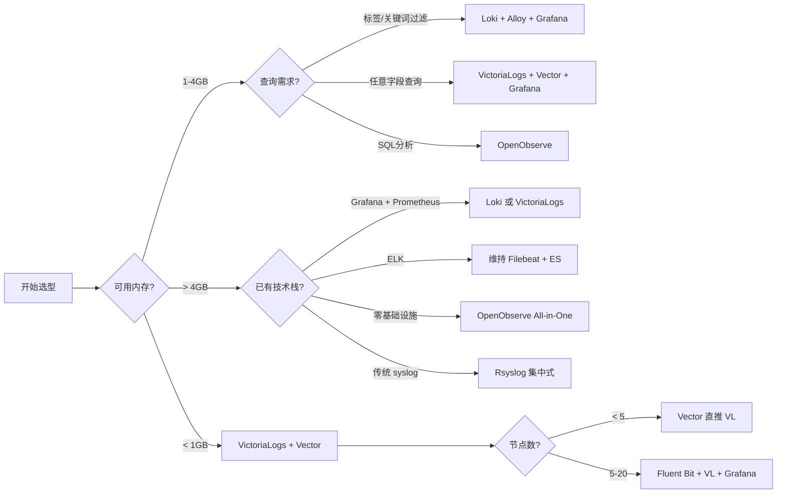

# 轻量级系统日志聚合服务调研

## 第一章 背景与需求

### 1.1 什么是日志聚合

日志聚合 (Log Aggregation) 是将分散在多台服务器上的系统日志集中采集、存储和查询的过程。它与单机日志查看有本质区别：

- **单机查看**：运维人员通过 SSH 登录每台服务器，使用 `journalctl`、`tail -f` 或 `grep` 逐个排查日志文件。这种方式在服务器数量超过 3-5 台后效率急剧下降。
- **日志聚合**：所有节点的日志自动汇集到一处，通过统一的 Web 界面或查询接口进行关联分析、过滤检索和可视化展示。

日志聚合是现代运维体系的基础设施之一，与指标监控（Prometheus / VictoriaMetrics）、链路追踪（OpenTelemetry / Jaeger）共同构成可观测性的三大支柱。

### 1.2 多服务器日志管理痛点

在管理多台 Linux 服务器时，系统日志（由 systemd-journald 管理的日志数据）面临一系列实际问题：

- **数据分散，排查困难**：排查跨多台机器的问题（如慢 SQL、网络延迟、服务调用链异常）需要依次登录每台节点执行命令。当集群规模达到数十或上百台时，这种方式基本不可操作。
- **无集中视图**：问题关联分析缺乏统一入口。某台机器发生 OOM，另一台机器的 Nginx 报 502，二者是否有时间关联？没有聚合视图就无法快速判断。
- **磁盘占用不均**：不同服务的日志量差异较大，日志轮转策略分散管理，往往等到磁盘写满触发告警才被发现。
- **安全审计缺乏统一入口**：多台服务器的登录记录、sudo 操作等审计日志分散存储，安全事件溯源时需要逐一排查每台机器的 `/var/log/secure`。

### 1.3 轻量级方案的核心诉求

与传统 ELK Stack（Elasticsearch + Logstash + Kibana）相比，轻量级日志聚合方案的核心诉求集中在以下几方面：

- **低资源占用**：采集端应避免 JVM 重量级方案（如 Logstash ~500MB+ 内存），首选 C / Rust / Go 编写的工具。存储端也应压缩索引开销，避免为每条日志内容建立倒排索引。
- **快速部署**：单二进制或包管理器安装，尽量不做多组件依赖。配置简单，开箱即用。
- **便捷查询**：具备 Web UI 或类 SQL 的查询能力，支持按时间、服务名、日志级别等字段过滤。
- **免运维或少运维**：组件少、自身不占用过多管理精力。日志轮转、数据过期策略内置或易配置。
- **与已有监控栈集成**：如果团队已使用 Prometheus + Grafana，日志方案应能无缝接入 Grafana，而不是另起一套可视化体系。

---

## 第二章 采集方案（一）：Grafana 生态

Grafana 生态在日志领域以 **Loki** 作为存储核心，采集端先后经历了 Promtail（经典）到 Grafana Alloy（新一代）的演变。

### 2.1 Promtail：经典但已 EOL

Promtail 是 Grafana Loki 的原生日志采集代理，与 Prometheus 的采集理念一脉相承——通过 `scrape_configs` 定义采集目标，支持从日志文件、systemd journal、syslog 等多种来源采集，将数据推送到 Loki。

**关键特性**：
- 通过 `scrape_configs` 配置采集目标，YAML 格式，与 Prometheus 配置风格相似
- 支持 journal 和文件两种主要采集方式
- 与 Loki / Grafana 无缝集成，自动添加 `job`、`instance` 等标签

**当前状态**：Promtail 已于 **2026 年 3 月 2 日正式 EOL**（End of Life），Grafana Labs 官方不再提供安全更新和技术支持。官方推荐迁移路径为 **Grafana Alloy**。

> 对于仍在运行 Promtail 的环境，建议尽快规划迁移。Promtail 的配置可以通过官方提供的转换工具 (promtail-to-alloy 或手动转换) 迁移至 Alloy 的 River 配置格式。

### 2.2 Grafana Alloy：官方替代方案

Grafana Alloy 是 Grafana Labs 推出的新一代统一采集代理，基于 **OpenTelemetry Collector** 构建。它不仅替代 Promtail 的日志采集功能，还统一了 metrics / logs / traces / profiles 四类数据的采集。

**核心优势**：
- 基于 OpenTelemetry Collector 发行版，遵循行业标准
- 内置 Prometheus 管道，可直接替代 Prometheus Node Exporter
- 支持日志处理管道（`loki.process`），可以在采集端完成日志清洗、字段提取
- River 配置格式（声明式），比 Promtail 的 YAML 更灵活

**journald 采集配置示例**：

以下配置从 systemd journal 读取日志，按 unit 过滤（仅采集 ssh 和 nginx 服务），添加自定义标签，然后推送到 Loki。

```alloy
// 采集 journald 日志
loki.source.journal "read" {
  max_age    = "12h"
  forward_to = [loki.process.clean.receiver]

  // 按 systemd unit 过滤，支持多条件 AND
  matches    = "_SYSTEMD_UNIT=ssh.service _SYSTEMD_UNIT=nginx.service"

  // 自定义标签
  labels     = {
    component = "systemd-journal",
    env       = "production",
  }
}

// 日志处理管道：重命名 journal 字段
loki.process "clean" {
  stage.relabel {
    // 将 __journal__systemd_unit 映射为可读的 unit 标签
    rule {
      source_labels = ["__journal__systemd_unit"]
      target_label  = "unit"
    }
    // 提取日志级别
    rule {
      source_labels = ["__journal_priority"]
      target_label  = "level"
      regex         = "^(\\d+)$"
      replacement   = "$1"
    }
  }

  forward_to = [loki.write.endpoint.receiver]
}

// 输出到 Loki
loki.write "endpoint" {
  endpoint {
    url = "http://loki:3100/loki/api/v1/push"
  }
}
```

**关键参数说明**：

| 参数 | 说明 | 默认值 |
|------|------|--------|
| `max_age` | 读取距离进程启动多久以内的日志 | `"7d"` |
| `matches` | journal 字段过滤语法，多个条件间为 AND | 无 |
| `labels` | 附加到每条日志上的静态标签 | `{}` |
| `relabel_rules` | 引用外部的 `loki.relabel` 规则，用于字段重命名 | 无 |
| `format_as_json` | 是否将原始 journal 字段以 JSON 格式保留 | `false` |

**迁移提示**：Promtail 的 journal 配置中如果使用了 `labels` 或 `relabel_configs`，在 Alloy 中对应的是 `labels` 参数和 `loki.relabel` / `loki.process` 组件，需要逐一映射转换。

---

## 第三章 采集方案（二）：高性能通用采集器

本章介绍两款语言级性能优势的通用采集器——Vector (Rust) 和 Fluent Bit (C)，它们不仅支持日志采集，还具备数据转换和路由能力，不绑定特定存储后端。

### 3.1 Vector：Rust 数据管道

Vector 是 Datadog 出品的端到端可观测性数据管道工具，Rust 编写，内存占用约 **10MB**。它的设计理念是"一次采集，任意路由"——从 journald、文件、Kafka 等 Source 采集数据，经过可选的 VRL 转换，再输出到 Loki、Elasticsearch、Kafka、S3 等任意 Sink。

**journald 采集核心能力**：
- 原生支持 journald Source，通过调用系统 `journalctl` 命令读取 journal
- 支持 `include_units` / `exclude_units` 按 unit 名称过滤
- 支持 `include_matches` / `exclude_matches` 按任意 journal 字段过滤
- 内置 checkpoint 机制，自动记录已读位置（`data_dir` 目录下持久化）
- `current_boot_only` 控制是否只读取当前启动周期的日志

**配置示例（含 unit 过滤和 checkpoint）**：

```toml
[sources.journald_main]
type = "journald"
# 批量读取大小，达到后设置一次 checkpoint
batch_size = 64
# 仅读取当前 boot 的日志
current_boot_only = true
# Checkpoint 持久化目录
data_dir = "/var/lib/vector"
# 仅采集指定 unit
include_units = ["sshd", "nginx", "docker"]
# 排除噪音 unit
exclude_units = ["systemd-journald", "dbus"]

# 按 journal 字段 AND 匹配（更精细的过滤）
[sources.journald_main.include_matches]
_SYSTEMD_UNIT = ["sshd.service", "nginx.service"]
_PRIORITY = ["6"]

# 可选：额外的 journalctl 参数
extra_args = ["--merge"]

# 转换管道：重命名优先级字段
[transforms.normalize]
type = "remap"
inputs = ["journald_main"]
source = '''
  # 将 PRIORITY 从数字映射为可读级别
  .level = match(to_string!(.PRIORITY), {
    "0" => "emerg",
    "1" => "alert",
    "2" => "crit",
    "3" => "err",
    "4" => "warning",
    "5" => "notice",
    "6" => "info",
    "7" => "debug",
  }) ?? "unknown"

  # 提取主机名
  .host = .host

  # 清理不需要的内部字段
  del(.source_type)
'''

# 输出到 Loki
[sinks.loki_output]
type = "loki"
inputs = ["normalize"]
endpoint = "http://loki:3100"
encoding.codec = "json"

[sinks.loki_output.labels]
job = "systemd-journal"
unit = "{{ _SYSTEMD_UNIT }}"
host = "{{ host }}"

# 可选：输出到 Kafka 做缓冲
[sinks.kafka_buffer]
type = "kafka"
inputs = ["normalize"]
bootstrap_servers = "kafka:9092"
topic = "system-logs"
encoding.codec = "json"
```

> **版本要求**：Vector v0.35.0+。截至 2026 年 6 月，最新版本为 v0.56.0。

**Vector 的独特优势**：VRL (Vector Remap Language) 是其内置的转换语言，支持丰富的函数库（字符串处理、正则匹配、JSON 解析、类型转换等），并且可以编写单元测试来验证转换逻辑——这在日志管道中非常罕见，对于需要复杂数据清洗的场景很有价值。

### 3.2 Fluent Bit：C 语言极简采集器

Fluent Bit 是 CNCF 毕业项目，C 语言编写，以极低资源占用著称（约 **1MB** 内存）。它是 Fluentd 的轻量级替代，专注"采集 + 转发"，不做重量级数据处理。

**journald 采集核心能力**：
- 原生 `systemd` input 插件，通过 sd-journal API 直接读取 journal（不依赖 journalctl 子进程）
- `systemd_filter` 支持按任意 journal 字段匹配
- `db` 文件（SQLite）持久化 cursor 位置，支持断点续传
- `read_from_tail` 跳过历史日志，只采集新日志
- `strip_underscores` 将 `_SYSTEMD_UNIT` 等字段名简化

**配置示例（含 unit 过滤和 db 文件）**：

```ini
[SERVICE]
    Flush        1
    Log_Level    info

[INPUT]
    Name                  systemd
    Tag                   host.*
    Path                  /var/log/journal
    DB                    /var/lib/fluent-bit/journal.db
    DB.Sync               normal
    Read_From_Tail        true
    Lowercase             true
    Strip_Underscores     true
    Max_Entries           5000
    # 多条件 AND 过滤：采集 ssh 服务的 info 级别日志
    Systemd_Filter_Type   and
    Systemd_Filter        _SYSTEMD_UNIT=ssh.service
    Systemd_Filter        PRIORITY=6

[OUTPUT]
    Name   loki
    Match  host.*
    Url    http://loki:3100/loki/api/v1/push
    Labels {job="systemd-journal", unit="$TAG"}
```

**YAML 配置等价版本**（自 v2.0 起支持）：

```yaml
pipeline:
  inputs:
    - name: systemd
      tag: host.*
      path: /var/log/journal
      db: /var/lib/fluent-bit/journal.db
      db.sync: normal
      read_from_tail: true
      lowercase: true
      strip_underscores: true
      max_entries: 5000
      systemd_filter_type: and
      systemd_filter:
        - _SYSTEMD_UNIT=ssh.service
        - PRIORITY=6
  outputs:
    - name: loki
      match: host.*
      url: http://loki:3100/loki/api/v1/push
      labels: '{"job":"systemd-journal", "unit":"$TAG"}'
```

> **版本要求**：Fluent Bit v1.6+。截至 2026 年 6 月，最新版本为 v5.0.7。

**关键参数说明**：

| 参数 | 说明 | 默认值 |
|------|------|--------|
| `db` | SQLite 数据库文件路径，用于持久化 journal cursor | 无（不持久化） |
| `db.sync` | SQLite 同步模式：`extra`/`full`/`normal`/`off` | `full` |
| `read_from_tail` | 启动时跳过已有日志，只采集新写入的日志 | `false` |
| `max_entries` | 每轮处理的最大日志条数，防止 backlog 过大 | `5000` |
| `strip_underscores` | 移除 journal 字段名的前导下划线 | `false` |
| `systemd_filter_type` | 多 filter 组合方式：`and` / `or` | `or` |
| `systemd_filter` | journal 字段匹配条件，可重复 | 无 |

**Vector vs Fluent Bit 定位差异**：

| 维度 | Vector | Fluent Bit |
|------|--------|------------|
| 语言 | Rust | C |
| 内存占用 | ~10MB | ~1MB |
| 数据处理能力 | 内置 VRL 语言，支持复杂转换 | filter 插件，适合轻量处理 |
| 聚合器角色 | 支持（可做中间聚合层） | 有限（推模式为主） |
| 配置风格 | TOML / YAML / JSON | INI / YAML |
| 与 journald 交互方式 | 调用 journalctl 子进程 | 直接使用 sd-journal API |
| 输出后端丰富度 | 极丰富（40+ sinks） | 丰富（20+ outputs） |

---

## 第四章 采集方案（三）：传统 syslog 与 ELK 生态

本章介绍三类"老牌"方案——Rsyslog（系统默认）、Syslog-ng（现代化替代）和 Filebeat（ELK 生态轻量采集器）。它们虽然不是最前沿的方案，但在特定场景下仍有不可替代的价值。

### 4.1 Rsyslog：Linux 默认日志转发方案

Rsyslog 是 Linux 发行版默认的系统日志守护进程，在多线程增强的基础上兼容传统 syslog 协议。几乎所有 Linux 发行版都预装 rsyslog，**无需额外安装**是其最大优势。

**journald 采集**：通过 `imjournal` 模块读取 systemd journal。Rsyslog 同时支持传统 `$` 指令语法（v7 及更早）和 RainerScript 语法（v8+）。

**配置示例：传统 $ 指令风格**：

```nginx
#### MODULES ####
# 加载 imjournal 模块读取 systemd journal
$ModLoad imjournal
# 通过 imuxsock 接收本地 syslog 调用（如 logger 命令）
$ModLoad imuxsock

#### GLOBAL ####
$WorkDirectory /var/lib/rsyslog
# Journal 状态文件，记录已读取的 cursor 位置
$IMJournalStateFile imjournal.state

#### RULES ####
# 将所有日志转发到远程日志服务器（UDP）
*.* @192.168.1.100:514

# 将特定程序的日志写入单独文件
if $programname == 'sshd' then /var/log/sshd.log
if $programname == 'nginx' then /var/log/nginx.log

# 停止处理符合条件的日志（防止重复写入）
& stop
```

**配置示例：RainerScript 模块语法（v8+ 推荐）**：

```nginx
module(load="imjournal" StateFile="imjournal.state")
module(load="imuxsock")

# 将 ssh 日志转发到远程服务器（TCP）
if $programname == "sshd" then {
    action(type="omfwd"
           Target="192.168.1.100"
           Port="514"
           Protocol="tcp"
           TCP_Framing="octet-counted")
}

# 所有 cron 日志写入本地文件
if $programname == "crond" then {
    action(type="omfile" file="/var/log/cron.log")
}
```

**关键参数说明**：

| 参数 | 说明 | 默认值 |
|------|------|--------|
| `StateFile` | 记录当前 journal cursor 位置的状态文件名 | `imjournal.state` |
| `PersistStateInterval` | 每处理 N 条消息持久化一次 state | `10` |
| `RateLimit.Interval` | 限速时间窗口（秒） | `5` |
| `RateLimit.Burst` | 限速窗口内允许的最大消息数 | `20000` |

**Rsyslog 的限制**：
- 配置语法偏老旧，传统 `$` 指令与 RainerScript 混用时容易出错
- 复杂过滤场景下配置较繁琐
- 社区活跃度相比 Fluent Bit / Vector 有所下降
- 存储转发缺乏内置的序列化格式（如 JSON）支持，需要额外配置模板

### 4.2 Syslog-ng：现代化 syslog 方案

Syslog-ng 是传统 syslog 的下一代实现，配置更加灵活，过滤能力更强大。它由 One Identity（原 Balabit）维护，社区版本开源。

**journald 采集**：通过 `systemd-journal()` source 驱动直接读取 journal，支持按字段过滤和结构化解析。

**配置示例**：

```nginx
@version: 4.0
@include "scl.conf"

# 定义日志源：从 systemd journal 读取
source s_journal {
    systemd-journal(
        # 采集指定 unit 的日志
        match("_SYSTEMD_UNIT" "ssh.service")
        match("_SYSTEMD_UNIT" "nginx.service")
        # 也可按优先级过滤 ：match("PRIORITY" "6")
        # journal 命名空间（systemd v245+ 支持）
        # namespace("my-namespace")
    );
};

# 定义目的地：转发到远程日志服务器
destination d_remote {
    syslog("192.168.1.100"
        transport("tcp")
        port(601)
    );
};

# 定义目的地：写入本地文件
destination d_local {
    file("/var/log/remote/${HOST}/${FACILITY}/${PROGRAM}.log"
        create-dirs(yes)
    );
};

# 日志处理路径
log {
    source(s_journal);
    # 可选：过滤特定优先级以上的日志
    # filter f_important { level(warning..emerg); };
    # 可选：JSON 格式化输出
    destination(d_remote);
    destination(d_local);
};
```

**Syslog-ng 特性亮点**：
- 支持日志解析器（JSON / CSV / KV-parser），可将结构化日志解析为字段
- 基于磁盘的消息缓冲（Disk-based buffering），网络中断不丢日志
- 完整支持 TLS 加密传输
- `systemd-journal()` source 原生支持 journal namespace（systemd v245+）

**Rsyslog vs Syslog-ng 简要对比**：

| 维度 | Rsyslog | Syslog-ng |
|------|---------|-----------|
| 预装情况 | 几乎全 Linux 发行版预装 | 需额外安装 |
| 配置风格 | 传统 `$` 指令 + RainerScript | 类 C 风格块结构 |
| journald 支持 | imjournal 模块 | systemd-journal() 驱动 |
| 过滤能力 | RainerScript if/else | filter + match，更精细 |
| TLS 支持 | 支持 | 支持，配置更直观 |
| 社区活跃度 | 中（维护模式） | 中（含商业版本） |

### 4.3 Filebeat：ELK 轻量级采集器

Filebeat 是 Elastic Beats 家族的核心成员，Go 编写，内存占用约 **15MB**。它是 ELK Stack 中的"默认采集器"，与 Elasticsearch / Logstash / Kibana 配合最紧密。

**journald 采集**：自 **v7.16** 起，独立的 Journalbeat 已合并进入 Filebeat，Filebeat 原生支持 journald 作为 input 类型。

**配置示例**：

```yaml
filebeat.inputs:
  - type: journald
    enabled: true
    # 采集指定 unit 的日志
    include_units:
      - ssh.service
      - nginx.service
    # 排除的 unit
    exclude_units:
      - systemd-journald
    # 从尾开始读取（跳过历史日志）
    seek: tail
    # 采集所有 journal 字段
    include_journal_fields:
      - _SYSTEMD_UNIT
      - PRIORITY
      - MESSAGE
      - _HOSTNAME
    # 添加自定义字段
    fields:
      env: production
      collector: filebeat

# 输出到 Elasticsearch
output.elasticsearch:
  hosts: ["http://elasticsearch:9200"]

# 或输出到 Logstash
# output.logstash:
#   hosts: ["logstash:5044"]
```

**关键参数说明**：

| 参数 | 说明 | 默认值 |
|------|------|--------|
| `include_units` | 仅采集指定 systemd unit 的日志 | `[]`（全部） |
| `exclude_units` | 排除指定 unit | `[]` |
| `seek` | 定位策略：`head`（从头/从 checkpoint）或 `tail`（从尾） | `head` |
| `include_journal_fields` | 包含的 journal 字段白名单 | `[]`（全部） |
| `backoff` | 无新日志时的轮询间隔 | `1s` |

**Filebeat 的定位**：

Filebeat 是 ELK 生态的"守门人"——它在 ELK 栈内表现最佳（天然支持 Elasticsearch 索引模板、ILM 策略、Kibana 仪表盘），但输出到非 Elastic 后端时功能不如 Vector / Fluent Bit 丰富。如果团队已经运行 Elasticsearch，Filebeat 是最省心的选择；如果还没有 ELK，不建议为了用 Filebeat 而引入 ELK。

> **历史备注**：Journalbeat 是 Elastic 官方在 v7.16 之前提供的独立 journald 采集器，v7.16 起功能合并入 Filebeat，独立的 Journalbeat 不再维护。如果是 v7.16 之前的环境，仍需使用独立的 Journalbeat，但强烈建议升级。

---

## 第五章 采集层横向对比

### 5.1 资源占用量化对比

以下数据基于各工具官方文档和社区实测。内存值为稳定运行状态下的常驻内存（RSS），CPU 占用因日志量不同而异。

| 工具 | 语言 | 常驻内存 | CPU 消耗（1K msg/s） | 二进制大小 | 启动时间 |
|------|------|----------|---------------------|-----------|---------|
| Fluent Bit | C | ~1 MB | 极低 | ~15 MB | < 1s |
| Vector | Rust | ~10 MB | 低 | ~30 MB | < 1s |
| Filebeat | Go | ~15 MB | 较低 | ~40 MB | ~1s |
| Grafana Alloy | Go | ~30-50 MB | 中等 | ~60 MB | ~2s |
| Rsyslog | C | ~5-10 MB | 极低 | 系统自带 | < 0.5s |
| Syslog-ng | C | ~5-10 MB | 极低 | ~5 MB | < 0.5s |
| **对比基线：Logstash** | Java (JVM) | **500 MB+** | 高 | ~200 MB | ~30s |

**补充说明**：
- Fluent Bit 的 ~1MB 是其最大亮点，适合 IoT / 边缘节点 / 低配机器
- Vector 的 ~10MB 包含了 VRL 引擎的开销，换取的是强大的数据处理能力
- Grafana Alloy 由于内置了 Prometheus 管道和 OTel Collector 基础设施，内存高于单纯日志采集器，但胜在统一采集四类数据
- Rsyslog / Syslog-ng 的内存消耗虽低，但数据格式化和转发能力有限

### 5.2 配置复杂度对比

| 工具 | 配置格式 | 学习曲线 | 常见陷阱 | 适用场景 |
|------|---------|---------|----------|---------|
| Vector | TOML/YAML/JSON | 中等 | `include_units` 不包含生命周期事件（如 `init.scope`） | 需要复杂数据处理管道 |
| Fluent Bit | INI/YAML | 低 | `systemd_filter_type` 默认为 `or`，不是 `and` | 简单采集+转发 |
| Grafana Alloy | River | 中高 | River 语法独特，从 Promtail YAML 迁移需转换 | 已有 Grafana 生态 |
| Rsyslog | 传统指令/RainerScript | 中 | 传统 `$` 和 RainerScript 混用 | 默认选择，无需额外安装 |
| Syslog-ng | 类 C 块结构 | 中 | filter 定义需要理解 syslog 协议 | 需要 TLS / 复杂过滤 |
| Filebeat | YAML | 低 | journald 输入需 v7.16+ | ELK 生态 |

**配置复杂度排名**（从简单到复杂）：

Filebeat / Fluent Bit -> Vector -> Grafana Alloy -> Rsyslog / Syslog-ng

### 5.3 采集能力与生态对比

**journald 原生支持程度**：

| 能力 | Vector | Fluent Bit | Alloy | Filebeat | Rsyslog | Syslog-ng |
|------|--------|------------|-------|----------|---------|-----------|
| unit 过滤 | 原生（include_units / exclude_units） | 原生（systemd_filter） | 原生（matches） | 原生（include_units） | 通过 filter | 通过 match 条件 |
| 字段级过滤 | `include_matches` | `systemd_filter` | `matches` | 无 | 通过 if 条件 | `match()` |
| Checkpoint | 自动（data_dir） | 通过 db 文件 | 自动 | 自动（registry） | StateFile | 内置 |
| 从头/尾开始策略 | `since_now` | `read_from_tail` | `max_age` | `seek` | 默认从头 | 默认从头 |
| 批量读取 | `batch_size` | `max_entries` | 内置 | 内置 | 无 | 无 |
| 当前 boot 过滤 | `current_boot_only` | 默认行为 | 默认行为 | 无 | 无 | 无 |

**数据转换能力**：

| 能力 | Vector | Fluent Bit | Alloy | Filebeat | Rsyslog | Syslog-ng |
|------|--------|------------|-------|----------|---------|-----------|
| 字段提取/重命名 | VRL | filter 插件 | loki.process | processors | template | parser |
| 条件路由 | VRL switch | filter/match | loki.process stage.match | condition | if/else | filter |
| JSON 解析 | VRL `parse_json` | parser filter | loki.process stage.json | decode_json_fields | mmnormalize | json-parser |
| 转换单元测试 | 支持（VRL test） | 无 | 无 | 无 | 无 | 无 |

**输出后端丰富度**：

| 工具 | 内置输出/接收器数 | 代表性后端 |
|------|------------------|-----------|
| Vector | 40+ | Loki, ES, Kafka, S3, ClickHouse, Datadog, Splunk, GCP, Azure |
| Fluent Bit | 20+ | Loki, ES, Kafka, S3, InfluxDB, OpenTelemetry, Datadog |
| Grafana Alloy | 10+ | Loki, Prometheus, Tempo, Pyroscope, OTLP, Kafka |
| Filebeat | 8+ | ES, Logstash, Kafka, Redis, S3 |
| Rsyslog | 10+ | 远程 rsyslog, ES (omelasticsearch), DB (ommysql), 文件 |
| Syslog-ng | 15+ | 远程 syslog, ES, MongoDB, Kafka, Redis, MQTT |

**社区活跃度与维护状态**：

| 工具 | 组织 | 仓库 Stars | 最近发版 | 维护状态 |
|------|------|-----------|---------|---------|
| Vector | Datadog | 22k+ | 2026-06 (v0.56.0) | 活跃 |
| Fluent Bit | CNCF (Calyptia) | 7.9k+ | 2026-06 (v5.0.7) | 活跃 |
| Grafana Alloy | Grafana Labs | 3k+ | 2026-06 | 活跃 |
| Filebeat | Elastic | (Beats 项目整体) | 2026-06 | 活跃 |
| Rsyslog | 社区维护 | GitHub 迁移中 | 2026 (v8.2510.0) | 维护模式 |
| Syslog-ng | One Identity | 2k+ | 2026-06 (v4.5.0) | 活跃（含商业版） |

---

## 第六章 日志存储与查询方案

采集层将日志汇集后，需要一个高效的存储后端来持久化日志数据并提供查询能力。本章对比三款在"轻量级"定位上各有特色的日志存储引擎：Loki（标签索引）、VictoriaLogs（字段级倒排索引）和 OpenObserve（列式存储 All-in-One），ELK（Elasticsearch）仅作为基线参照。

### 6.1 Loki：标签索引日志引擎

Loki 是 Grafana Labs 出品的日志聚合系统，其核心理念来源于 Prometheus 的设计哲学——**只索引标签，不索引日志内容**。每条日志流由一组标签（如 `job`、`instance`、`app`）唯一标识，日志内容以 chunk 形式压缩存储在对象存储或本地文件系统中。这种设计大幅降低了存储和索引开销，但也将查询能力与标签设计的质量紧密绑定。

**三种部署模式**：

| 模式 | 说明 | 适用场景 |
|------|------|---------|
| Single Binary（单机） | 所有组件运行在一个进程中 | 开发/测试环境，小规模生产（<20节点） |
| Simple Scalable | 读写角色分离，各组件可独立扩缩容 | 中等规模生产（20-200节点） |
| Microservices | 全分布式，每个组件独立部署 | 大规模生产（200+节点） |

最小推荐配置为 2 核 CPU / 4GB 内存（单机模式），实际消耗取决于日志吞吐量和标签基数。

**LogQL 查询语言**：

LogQL 是 Loki 的查询语言，语法与 PromQL 一脉相承，分为两部分：**日志流选择器**（必选）和 **日志管道**（可选）。

基本结构：

```logql
{流选择器} | 管道操作
```

**查询示例一：基本标签过滤 + 关键字搜索**

以下查询选择标签 `job="vector"`、`unit` 以 `ssh` 开头的日志流，然后过滤出包含 `error` 的行：

```logql
{job="vector", unit="ssh*"} |= "error"
```

`*` 通配符匹配任意后缀——`ssh.service`、`sshd.service` 等均可命中。

**查询示例二：多级过滤 + 结构化解析**

以下查询过滤 Nginx 日志中的 5xx 错误：

```logql
{job="vector", unit="nginx.service"} |= "failed" | logfmt | status_code > 499
```

`logfmt` 解析器将日志内容解析为结构化字段，然后可以用 `status_code > 499` 这样的标签过滤器做数值比较。

**查询示例三：指标聚合（Rate）**

LogQL 可以将日志聚合为指标，生成类似 Prometheus 的时间序列。以下查询统计各 unit 每 5 分钟的日志条数：

```logql
rate({job="vector"}[5m])
```

按 unit 维度分组统计：

```logql
sum by(unit) (rate({job="systemd-journal"}[5m]))
```

**查询示例四：TopK 排序**

找出日志量最大的 10 个 unit：

```logql
topk(10, sum by(unit) (rate({job="vector"}[5m])))
```

**LogQL 的关键约束**：由于 Loki 只索引标签，如果日志内容中的某个字段没有提前定义为标签（如 `user_id`、`request_id`），则无法用该字段做高效过滤，只能通过 `|= "user_id=xxx"` 做全内容扫描。这要求在使用 Loki 前做好标签设计。

### 6.2 VictoriaLogs：字段级倒排索引

VictoriaLogs 是 VictoriaMetrics 团队推出的日志存储方案，定位为 Loki 的"超轻量替代"。它的核心差异在于采用**字段级倒排索引**——所有日志字段都会被索引，不需要像 Loki 那样依赖标签设计来决定哪些字段可查询。

**核心特性**：

- **字段级倒排索引 + 块级统计**：每条日志的所有字段都可以被检索，无需预先定义标签
- **单二进制部署**：无外部依赖，一个可执行文件即可运行
- **无标签设计约束**：任何字段都可以作为过滤条件，不存在 Loki 的"高基数标签"问题
- **内置 HTTP API**：通过 RESTful 接口查询，无需专用客户端
- **与 Prometheus 和 VictoriaMetrics 生态集成**：天然支持 Grafana 数据源

官方宣称的资源效率：比 Elasticsearch 少 30 倍内存，比 Elasticsearch 少 15 倍存储空间。在实测场景中，VictoriaLogs 可以在 512MB - 1GB 内存的机器上平稳运行，远低于 Loki 的 2C4G 基线。

**LogsQL 查询语言**：

LogsQL 的语法比 LogQL 更自由——不强制要求流选择器，关键词可以直接搜索 `_msg` 字段。

**查询示例一：纯关键词搜索**

在日志消息中搜索包含 `error` 的行：

```logsql
error
```

**查询示例二：字段级精准过滤**

按 `log.level` 字段和 `unit` 字段过滤：

```logsql
log.level:error unit:"ssh.service"
```

字段名和值之间用冒号分隔，多个条件之间默认 AND。

**查询示例三：流过滤 + 关键词**

使用流过滤器缩小范围，再搜索关键词——性能最优的方式：

```logsql
error {unit="ssh.service"}
```

这里的 `{unit="ssh.service"}` 是流过滤器（类似于 Loki 的标签选择器），与 `error` 关键词做 AND 组合。

**查询示例四：时间范围 + 多条件**

```logsql
_time:5m error {app="nginx"}
```

`_time:5m` 限制最近 5 分钟，`error` 搜索消息内容，`{app="nginx"}` 限定日志流。

**查询示例五：字段排除**

排除特定应用：

```logsql
log.level:error {app not_in (buggy_app, foobar)}
```

**LogsQL 与 LogQL 的语法差异**：

| 特性 | LogQL (Loki) | LogsQL (VictoriaLogs) |
|------|-------------|----------------------|
| 流选择器 | 必选 | 可选（但推荐用于性能） |
| 字段查询 | 仅限已定义标签 | 任意字段 |
| 数值比较 | 通过 `\| logfmt` 解析后可用 | 原生支持 |
| 时间范围 | 在 Grafana 界面或通过 API 参数设定 | 内联 `_time:5m` 语法 |
| 管道操作 | `\| logfmt` `\| json` `\| regexp` | stats / sort / top / fields |
| 学习成本 | 需理解 PromQL 标签模型 | 更接近搜索引擎语法 |

### 6.3 OpenObserve：列式存储 All-in-One

OpenObserve 是一款 Rust 编写的开源可观测平台，采用 **Parquet 列式存储 + S3 原生架构**。它的定位是"Elasticsearch 的轻量级替代"，但功能远超日志存储——同时支持日志、指标、追踪和 RUM（真实用户监控）。

**核心特性**：

- **单二进制部署**：Rust 编译，一个可执行文件包含完整功能
- **内置 Web UI**：无需额外安装 Grafana 即可可视化日志
- **Parquet 列式存储**：高压缩比，官方声称存储成本相比 Datadog / Splunk 降低约 140 倍
- **双查询语言**：同时支持 SQL 和 PromQL
- **S3 原生架构**：直接使用 S3、MinIO、GCS 作为存储后端，存储与计算分离
- **无 JVM 依赖**：Rust 编写，启动快、资源低

对中等规模日志负载，OpenObserve 通常需要 1-2GB 内存，高于 VictoriaLogs 但低于 ELK。

**SQL 查询示例**：

由于 OpenObserve 将日志存储为结构化表，可以使用标准 SQL 进行查询：

```sql
SELECT _timestamp, _source, log_level, message
FROM "default"
WHERE log_level = 'error'
  AND _timestamp > NOW() - INTERVAL '1' HOUR
  AND service = 'nginx'
ORDER BY _timestamp DESC
LIMIT 100
```

**PromQL 查询示例**：

OpenObserve 兼容 PromQL，可以对日志指标做聚合分析：

```
sum by(service) (rate({log_level="error"}[5m]))
```

> 注：此语法省略了 metric 名称，是 OpenObserve 对 PromQL 的扩展支持，标准 PromQL 要求指定 metric 名称。

**OpenObserve 的独特优势**：All-in-One 架构使其适合从头搭建可观测体系的团队，一套部署即可覆盖日志、指标、追踪三类数据。内置 Web UI 的查询能力虽然不如 Grafana 丰富，但对于日常日志检索已经足够。

---

## 第七章 存储层对比

### 7.1 索引策略对比

四类存储方案采用了截然不同的索引策略，直接影响查询灵活性、资源消耗和维护成本。

| 方案 | 索引策略 | 查询灵活性 | 索引存储开销 | 高基数影响 |
|------|---------|-----------|------------|-----------|
| Loki | 标签索引（仅索引流标签） | 依赖标签设计 | 极低 | 严重（性能退化） |
| VictoriaLogs | 字段级倒排索引 | 高（任意字段可查） | 中等 | 小 |
| OpenObserve | 列式存储扫描（Parquet） | 中等（依赖 SQL 查询） | 极低（无独立索引） | 无 |
| Elasticsearch（基线） | 全文倒排索引 | 最高（分词+模糊查询） | 高 | 小 |

**各策略详解**：

- **标签索引（Loki）**：只为日志流定义一组标签（如 `{job="nginx", host="web-01"}`），每条日志流的标签数据量很小，索引内存占用极低。但代价是——没有事先定义为标签的字段无法做索引级过滤。当标签基数过高（如 `user_id` 这种成百上千个唯一值）时，索引膨胀和写入性能下降会非常明显。

- **字段级倒排索引（VictoriaLogs）**：对所有日志字段都建立索引，类似于搜索引擎但更轻量。用户可以在任何字段上做过滤，不需要事先规划。索引占用介于 Loki 和 ES 之间，高基数场景下各字段独立索引，单一字段的高基数不会像 Loki 那样拖垮全局。

- **列式存储（OpenObserve）**：不建立传统的行级倒排索引，而是利用 Parquet 列式存储的 min/max statistics 和谓词下推来加速查询。这种策略在扫描大范围数据时压缩率和性能优于行式索引，但点查询（查单条日志）的延迟略高。

- **全文倒排索引（Elasticsearch）**：将日志内容分词后建立倒排索引，支持模糊搜索、短语匹配、权重排序等最复杂的查询需求。但资源消耗最高——典型的 ES 集群需要 4C8G 起步，索引存储通常与原始数据相当或更高。

### 7.2 资源消耗量化对比

| 方案 | 内存推荐 | CPU 推荐 | 存储压缩比（相对原始文本） | 磁盘类型建议 |
|------|---------|---------|-------------------------|-------------|
| Loki | 2C4G（单机） | 2-4 核 | ~5:1（chunk gzip） | SSD 优先 |
| VictoriaLogs | ~512MB-1GB | 1-2 核 | 宣称比 ES 少 15x | HDD 亦可 |
| OpenObserve | 1-2GB | 2-4 核 | Parquet 高压缩（比 Loki 更高） | S3/对象存储 |
| Elasticsearch（基线） | 4C8G+（推荐 32GB JVM heap） | 4-8+ 核 | ~1:1 到 2:1（含副本） | 必须 SSD |

**重要说明**：

- VictoriaLogs 的"30x 内存低于 Elasticsearch"并非绝对指标——Loki 的内存消耗高度依赖标签基数（cardinality），在标签设计合理的场景下差距会缩小。但 VictoriaLogs 在低资源环境下的启动和运行能力确实远强于 Loki。
- OpenObserve 的存储成本优势来自 Parquet 列式压缩和 S3 的低价对象存储，实测压缩比通常在 5:1 到 20:1 之间，极端场景可更高。
- Elasticsearch 的 JVM heap 并不能无限增大，过大的堆会导致 GC 停顿延长，通常建议单节点 heap 不超过 32GB。

### 7.3 查询能力对比

**查询语言与适用场景**：

| 查询类型 | 最佳方案 | 说明 |
|---------|---------|------|
| 按服务名/主机名/级别过滤 | Loki / VictoriaLogs 均可 | 基础能力，所有方案都支持 |
| 日志内容全文搜索 | VictoriaLogs / Elasticsearch | Loki 的 `\|=` 是全表扫描 |
| 结构化字段过滤 | VictoriaLogs / ES | Loki 需提前定义为标签 |
| 数值范围过滤（如 status>500） | LogsQL / SQL / ES | Loki 需 `\| logfmt` 解析 |
| 时间序列聚合（rate/sum） | Loki（LogQL 原生） | 日志转指标的首选方案 |
| 多表 JOIN / 复杂聚合 | OpenObserve（SQL） | 标准 SQL 灵活度最高 |
| 模糊/通配符搜索 | VictoriaLogs / ES | Loki 仅支持 `\|~ regexp` |

**查询延迟对比**（典型场景，非精确数据）：

| 查询类型 | Loki | VictoriaLogs | OpenObserve | ES |
|---------|------|-------------|-------------|-----|
| 标签过滤 + 简单关键词 | <100ms | <50ms | <200ms | <50ms |
| 全内容模糊搜索 | 1-10s（全扫描） | <500ms | 1-5s（分区扫描） | <200ms |
| 按字段精确过滤 | 受限（仅标签） | <100ms | <500ms | <50ms |
| 时间序列聚合（1h） | <200ms（优化） | <500ms | <1s | <500ms |
| 复杂 SQL 聚合 | 不支持 | 有限支持 | <2s | <1s |

**可扩展性对比**：

| 方案 | 水平扩展 | 单机可用 | 存储后端 |
|------|---------|---------|---------|
| Loki | 支持（Simple Scalable / Microservices） | 是 | 本地文件系统 / S3 / GCS / Azure |
| VictoriaLogs | 支持（vmagent 分片 + 多副本） | 是 | 本地文件系统 |
| OpenObserve | 支持（读写分离 + S3） | 是 | S3 / MinIO / GCS |
| ES | 支持（原生分布式） | 是 | 本地文件系统 |

---

## 第八章 架构模式与标签设计

### 8.1 架构模式一：Agent 直推

这是最简单的部署模式——采集器直接推送到存储后端，中间无缓冲层。

```text
+----------+     +----------+
| 采集器节点 | --> | 存储后端  |
| (Alloy)   |     | (Loki)   |
+----------+     +----------+

+----------+     +----------+
| 采集器节点 | --> | 存储后端  |
| (Vector)  |     | (VL/OpenObserve)|
+----------+     +----------+
```

**适用场景**：<50 节点的小规模环境

**优点**：
- 架构极简，部署和运维成本最低
- 端到端延迟最低
- 组件最少，故障点少

**缺点**：
- 存储后端直接承受所有采集器的写入压力，无流量整形
- 采集器到存储的网络中断时数据会丢失（除非采集器本地缓存）
- 存储后端的滚动升级/重启可能导致采集队列积压

**典型组合**：
- Alloy -> Loki + Grafana（Grafana 生态标配）
- Vector -> VictoriaLogs（最低资源组合）
- Vector / Fluent Bit -> OpenObserve（All-in-One 方案）

### 8.2 架构模式二：Agent -> 消息队列 -> 聚合器 -> 存储

引入消息队列作为缓冲层，实现采集与存储的解耦。Vector 或 Fluent Bit 可以在中间担任"聚合器"角色，对数据进行二次处理后再写入存储后端。

```text
+----------+     +--------+     +----------+     +----------+
| 采集器节点 | --> | 消息队列 | --> | 聚合器    | --> | 存储后端  |
| (Vector)  |     | (Kafka) |     | (Vector)  |     | (Loki)   |
+----------+     +--------+     +----------+     +----------+
                                       |
                                       v
                                  +----------+
                                  | 备用存储   |
                                  | (S3/文件)  |
                                  +----------+
```

**适用场景**：100+ 节点或需要高可靠性的生产环境

**优点**：
- 消息队列缓冲：存储后端故障时不丢失数据
- 流量整形：聚合器可以控制写入速率，避免存储过载
- 多路分发：一份日志可以同时写入多个存储（如 Loki + S3 归档）
- 聚合器可以做数据过滤、去重、富化等处理

**缺点**：
- 引入 Kafka/Redis 的运维成本
- 端到端延迟增加（通常增加秒级延迟）
- 架构复杂度明显上升

**消息队列选型建议**：

| 队列 | 优势 | 劣势 | 推荐场景 |
|------|------|------|---------|
| Kafka | 高吞吐、持久化、多消费者 | 运维复杂、资源占用高 | 大规模生产（500+节点） |
| Redis List/Stream | 低延迟、部署简单 | 无持久化保障（或需 AOF） | 中小规模缓冲 |
| NATS | 轻量、高性能 | 社区生态较小 | 需要消息总线的中等规模 |

### 8.3 日志流标签设计原则

标签设计仅对 Loki 有关键影响，VictoriaLogs 和 OpenObserve 不依赖标签系统。但理解标签设计原则有助于更高效地使用日志聚合系统。

**核心原则：避免高基数标签 (High Cardinality)**

Loki 中，每一组标签值组合定义一条日志流（stream）。标签基数 = 标签值的可能组合数。高基数会直接导致：

- Loki 索引膨胀
- 写入性能下降
- 查询性能退化
- Chunk 无法合并，存储碎片化

**常见高基数标签（禁止作为 Loki 标签）**：

```text
user_id        # 每个用户一个值，基数=用户数
request_id     # 每个请求一个值，基数=请求数
ip_address     # 每个客户端IP一个值，基数=客户端数
container_id   # 每个容器一个值，重启即变更
timestamp      # 每个日志条目一个值
```

**推荐标签**（每个标签的取值数量可控）：

| 标签 | 用途 | 典型基数 | 示例值 |
|------|------|---------|--------|
| `job` | 采集任务名称 | < 10 | systemd-journal, file-logs |
| `instance` | 节点标识 | < 1000 | web-01, db-02 |
| `host` | 主机名 | <= 节点数 | prod-web-01 |
| `unit` | systemd unit 名称 | < 100 | ssh.service, nginx.service |
| `level` | 日志级别 | 8 | info, error, warning |
| `app` | 应用名称 | < 100 | nginx, postgresql |
| `env` | 环境 | < 5 | production, staging |

**VictoriaLogs 的处理方式**：

VictoriaLogs 不要求标签前缀定义——所有字段都可以作为过滤条件。它的 `_stream` 概念是自动推导的（基于日志中出现的字段组合），用户不需要手动设计"哪些字段做标签"。

```logsql
# VictoriaLogs 中这是同等的查询效率
log.level:error
unit:nginx.service
host:web-01
```

上面的三个过滤条件不需要预先"注册"为标签，每个字段的倒排索引是自动维护的。

### 8.4 各方案整体架构概览

**LAG Stack（Loki + Alloy + Grafana）**：

```text
+--------+     +--------+     +---------+
| Alloy  | --> | Loki   | --> | Grafana |
| (采集)  |     | (存储)  |     | (可视化) |
+--------+     +--------+     +---------+
```

采集：Alloy（替代 Promtail），支持 journald + 文件 + syslog 采集
存储：Loki，标签索引 + chunk 压缩
可视化：Grafana，原生支持 Loki 数据源
代码量：Alloy ~60MB, Loki ~100MB, Grafana ~200MB
内存总计：Alloy ~30MB + Loki ~4GB + Grafana ~500MB

**VLStack（Vector + VictoriaLogs + Grafana）**：

```text
+--------+     +-------------+     +---------+
| Vector | --> | VictoriaLogs| --> | Grafana |
| (采集)  |     | (存储)       |     | (可视化) |
+--------+     +-------------+     +---------+
```

采集：Vector（Rust 数据管道），支持 journald + 文件 + syslog
存储：VictoriaLogs，单二进制，字段级倒排索引
可视化：Grafana（需安装 VictoriaLogs 数据源插件）
代码量：Vector ~30MB, VictoriaLogs ~15MB
内存总计：Vector ~10MB + VictoriaLogs ~512MB + Grafana ~500MB

**O2Stack（Vector/Fluent Bit + OpenObserve）**：

```text
+-----------+     +-------------+
| Vector    | --> | OpenObserve |
| Fluent Bit|     | (存储+可视化)|
+-----------+     +-------------+
```

采集：Vector 或 Fluent Bit
存储+可视化：OpenObserve（内置 Web UI，可不依赖 Grafana）
代码量：OpenObserve ~50MB（单二进制）
内存总计：Fluent Bit ~1MB + OpenObserve ~1-2GB

**RSyslog 集中式（传统方案）**：

```text
+--------+     +------------+     +----------+
| Rsyslog | --> | 远程 Rsyslog | --> | 日志文件 |
| (imjournal)|  | (集中接收)   |     | 或 ES/DB |
+--------+     +------------+     +----------+
```

完全无商业依赖，所有节点预装。但查询能力弱，需要配合其他工具做可视化。

---

## 第九章 journald 采集技术要点

journald 是 Linux 系统日志的基石，所有采集工具都与它交互。理解 journald 的工作机制和配置要点，对于搭建稳定的日志采集管道至关重要。

### 9.1 journald 持久化配置

systemd-journald 默认将日志保存在内存中（`/run/log/journal`），重启后丢失。生产环境中必须配置为持久化。

**配置文件**：`/etc/systemd/journald.conf`

```ini
[Journal]
# 持久化模式：写入 /var/log/journal
Storage=persistent

# 日志大小限制
SystemMaxUse=4G
SystemMaxFileSize=200M

# 日志文件保留策略
MaxRetentionSec=1month

# 压缩选项（默认开启）
Compress=yes

# 转发到 syslog（如不需要可关闭）
ForwardToSyslog=no

# 日志同步到磁盘的频率（秒）
SyncIntervalSec=5m
```

**三种 Storage 模式**：

| 模式 | 存储位置 | 重启后 | 适用场景 |
|------|---------|--------|---------|
| `persistent` | `/var/log/journal/` | 保留 | 生产环境必选 |
| `auto` | 如 `/var/log/journal/` 目录存在则持久化，否则使用内存 | 视情况 | 默认模式，推荐手动创建目录确保持久化 |
| `volatile` | `/run/log/journal/` | 丢失 | 临时环境或 RAM 充足的场景 |

**持久化配置步骤**：

```bash
# 1. 修改配置文件
# Storage=persistent

# 2. 创建持久化目录（如果使用 auto 模式也需要这一步）
mkdir -p /var/log/journal

# 3. 重启 journald 服务
systemctl restart systemd-journald

# 4. 验证持久化生效
journalctl --header | grep "Journal path"
# 输出应为：Journal path: /var/log/journal/...
```

### 9.2 Cursor 与 Checkpoint 机制

journald 为每一条日志条目分配一个唯一的 **cursor** 字符串，格式如 `s=...;i=...;b=...;m=...`。日志采集器记录最后读取的 cursor 位置，重启后从该位置继续读取，实现"断点续传"。

**各工具的 Checkpoint 实现**：

| 工具 | Checkpoint 机制 | 配置文件 | 位置 |
|------|----------------|---------|------|
| Vector | 自动 checkpoint 文件 | `data_dir` 参数 | `/var/lib/vector/` |
| Fluent Bit | SQLite db 文件 | `db` 参数 | `/var/lib/fluent-bit/journal.db` |
| Grafana Alloy | 内置 checkpoint | 自动 | `data-path` 下 |
| Filebeat | registry 文件 | 自动 | `<data path>/registry/filebeat/log.json` |
| Rsyslog | StateFile 文件 | `StateFile` 参数 | `imjournal.state` |

**首次读取位置策略**：

| 策略 | 说明 | 工具实现 |
|------|------|---------|
| 从头读取 | 采集所有历史日志 | Vector 默认、Fluent Bit `read_from_tail=false` |
| 从尾读取 | 只采集部署后的新日志 | Fluent Bit `read_from_tail=true`、Filebeat `seek: tail` |
| 时间窗口 | 读取距启动 N 小时内的日志 | Alloy `max_age="12h"` |

**重要实践**：新部署采集工具到已有服务器时，如果日志量巨大（如积累了数月的 journal 数据），建议使用"从尾读取"或设置较短的时间窗口，避免存储后端被历史日志冲垮。待系统稳定后，再根据需要使用 `max_age` 补充采集。

### 9.3 systemd unit 过滤

在实际运维中，并非所有 systemd unit 的日志都需要采集。典型的需要采集的 unit 包括 `sshd.service`（SSH 登录审计）、`nginx.service`（Web 服务）、`docker.service`（容器引擎）；可以排除的包括 `systemd-journald.service` 自身日志、`dbus.service`、`systemd-timesyncd.service` 等低频或噪音日志。

**各工具的 unit 过滤配置对比**：

| 工具 | 包含过滤 | 排除过滤 | 字段级过滤 | 配置示例 |
|------|---------|---------|-----------|---------|
| Vector | `include_units` | `exclude_units` | `include_matches` | `include_units = ["sshd", "nginx"]` |
| Fluent Bit | `systemd_filter` | 无（用否定匹配） | `systemd_filter` | `Systemd_Filter _SYSTEMD_UNIT=ssh.service` |
| Grafana Alloy | `matches` | 无（用否定匹配） | `matches` | `matches = "_SYSTEMD_UNIT=ssh.service"` |
| Filebeat | `include_units` | `exclude_units` | 无 | `include_units: ["ssh.service"]` |
| Rsyslog | `if $programname ==` | `if $programname !=` | if 表达式 | `if $programname == 'sshd'` |
| Syslog-ng | `match()` | 无（用否定 match） | `match()` | `match("_SYSTEMD_UNIT" "ssh.service")` |

**配置注意事项**：

- Vector 的 `include_units` 支持短名称（`sshd` 自动匹配 `sshd.service`），而 `include_matches` 中 `_SYSTEMD_UNIT` 必须用完整名称
- Fluent Bit 的多个 `Systemd_Filter` 默认以 `OR` 组合，`Systemd_Filter_Type = and` 可切换为 AND
- Alloy 的 `matches` 语法是 journal 字段的原生过滤格式，多个条件之间为 AND
- Rsyslog 的字段过滤需要了解 journal 字段名（如 `$programname`、`$systemdunit`）

### 9.4 journalctl 底层读取机制

理解采集工具如何读取 journald 日志，有助于排查采集端故障和选择合适工具。

**两种底层访问方式**：

| 方式 | 说明 | 使用工具 | 性能 |
|------|------|---------|------|
| sd-journal C API | 直接调用 `sd_journal_open()`、`sd_journal_next()`、`sd_journal_get_cursor()` 等函数 | Fluent Bit、Rsyslog、系统原生 | 高效，无进程创建开销 |
| journalctl 子进程 | 启动 journalctl 进程并解析其标准输出 | Vector | 中等，有进程创建开销但兼容性最好 |

**Vector 使用 journalctl 的原因**：

Vector 是 Rust 编写的跨平台工具，不绑定 Linux 特定的 sd-journal 库。通过调用 journalctl 获取日志，Vector 保持了代码的可移植性。代价是：
- 每次采集需要 fork 一个子进程
- 日志格式化为文本后解析，额外开销
- journalctl 版本的差异可能导致输出格式变化

**journalctl 命令行查询示例**：

对于人工应急排查场景（非采集管道），journalctl 仍然是最直接的查询工具：

```bash
# 按 unit 和时间过滤
journalctl -u ssh.service --since "10 min ago" --until "now"

# 按优先级过滤（紧急及以上级别）
journalctl -p emerg -p alert -p crit

# JSON 格式输出（包含所有字段）
journalctl -u nginx.service --since "2026-06-24 00:00:00" --output=json

# 实时追踪日志
journalctl -u nginx.service -f

# 合并多台机器的日志（使用 --merge 标志，需在日志聚合服务器上）
journalctl --merge -u ssh.service
```

---

## 第十章 Grafana 可视化集成

### 10.1 Grafana 作为统一可视化平台

Grafana 是日志聚合方案中可视化的核心组件（除 OpenObserve 自带 UI 外）。它原生支持 Loki 数据源、Prometheus 数据源，并通过插件支持 VictoriaLogs。一个 Grafana 实例可以同时展示日志、指标和链路追踪，是"统一可观测性"的入口。

**在日志聚合方案中的角色**：

```text
+----------+     +----------+
| Loki     |     | Prometheus|      ← 数据源
+----------+     +----------+
      |               |
      v               v
+---------------------------+
|        Grafana             |      ← 统一可视化
|  - Explore: 临时查询       |
|  - Dashboard: 仪表盘       |
|  - Alerting: 告警          |
+---------------------------+
```

### 10.2 各存储后端的数据源配置概览

**Loki 数据源**：

Loki 是 Grafana 的原生数据源，开箱即支持，无需额外安装插件。

```yaml
# Grafana provisioning 配置（/etc/grafana/provisioning/datasources/loki.yaml）
apiVersion: 1

datasources:
  - name: Loki
    type: loki
    access: proxy
    url: http://loki:3100
    jsonData:
      maxLines: 5000
      derivedFields:
        - datasourceUid: prometheus
          matcherRegex: "trace_id=(\\w+)"
          name: TraceID
          url: "$${__value.raw}"
```

关键参数：
- `url`: Loki HTTP 接口地址，默认端口 3100
- `maxLines`: 单次查询返回的最大日志行数，默认 5000
- `derivedFields`: 从日志内容中提取字段关联到其他数据源（如 trace_id 关联到 Tempo）

**VictoriaLogs 数据源**：

VictoriaLogs 需要通过插件接入 Grafana。VictoriaMetrics 团队提供了官方插件。

```yaml
# Grafana provisioning 配置
apiVersion: 1

datasources:
  - name: VictoriaLogs
    type: victorialogs-datasource
    access: proxy
    url: http://victorialogs:9428
    jsonData:
      maxLines: 5000
```

插件安装步骤：
1. 在 Grafana 插件市场搜索 "VictoriaLogs" 并安装
2. 或手动下载插件文件到 `/var/lib/grafana/plugins/`
3. 重启 Grafana 使插件生效

**OpenObserve 数据源**：

OpenObserve 内置了 Web UI，可在浏览器中直接查询日志。同时也兼容 Grafana 集成。

内置 UI：
- 访问 `http://openobserve:5080` 即可进入 Web 控制台
- 支持 SQL 查询编辑器
- 内置仪表盘和告警功能

Grafana 集成：
- OpenObserve 提供专门的 Grafana 数据源插件
- 或通过 Prometheus 兼容 API 接入指标数据

### 10.3 统一仪表盘设计

一个设计良好的日志仪表盘应该兼顾"快速定位问题"和"长期趋势观察"两个目标。

**推荐的仪表盘要素**：

| 面板 | 数据源 | 用途 |
|------|--------|------|
| 日志量趋势（按 unit） | LogQL rate / LogsQL stats | 观察各服务日志量变化 |
| 错误日志 TopN | LogQL topk | 快速定位错误最多的服务 |
| 日志搜索面板 | LogQL / LogsQL Explore | 临时关键词搜索 |
| 日志级别分布 | LogQL count by level | 观察日志级别比例 |
| 关联指标面板 | Prometheus | 结合 CPU/内存/网络指标分析 |

**Loki 仪表盘示例：日志量趋势**：

```logql
# 各 unit 每 5 分钟的日志条数
sum by(unit) (rate({job="systemd-journal"}[5m]))
```

**Loki 仪表盘示例：错误日志 Top 10**：

```logql
# 按 unit 统计错误日志占比
topk(10, sum by(unit) (count_over_time({job="systemd-journal"} |= "error" [5m])))
```

**VictoriaLogs 仪表盘示例**：

```logsql
# 各 unit 最近 1 小时的日志量
_time:1h | stats count() by(unit)
```

**混合面板策略**：

Grafana 支持在一个仪表盘中混合使用多个数据源。推荐的布局：

```text
+-----------------------------------------------------+
| [Prometheus] CPU / 内存 / 网络 概览                    |
+-----------------------------------------------------+
| [Loki] 错误日志 Top 5     | [Prometheus] 告警触发情况  |
+-----------------------------------------------------+
| [Loki] 日志搜索（带时间联动）                           |
+-----------------------------------------------------+
```

联动机制：当用户在时间选择器中调整时间范围时，所有面板同时响应；用户在日志面板中选中某条日志的时间点，指标面板可以立即关联到同一时刻的系统状态。

---

## 第十一章 方案推荐与选型决策

### 11.1 方案推荐矩阵

根据部署规模、资源约束和现有技术栈，以下矩阵提供了快速参考：

| 场景 | 采集工具 | 存储后端 | 可视化 | 部署复杂度 | 内存预算 | 建议节点数 |
|------|---------|---------|--------|-----------|---------|-----------|
| 单机日志查询 | Vector | VictoriaLogs | Grafana | 低（15分钟） | < 1GB | 1-3 |
| 小规模集群（<20 节点） | Alloy / Vector | Loki | Grafana | 中（30分钟） | ~4-6GB | 5-20 |
| 极低资源环境 | Fluent Bit | VictoriaLogs | Grafana | 低（15分钟） | < 50MB（采集）+ 512MB（存储） | 1-10 |
| 已有 Grafana + Prometheus | 按需选采集 | Loki 或 VictoriaLogs | 复用现有 Grafana | 低（10分钟） | 视存储方案 | 不限 |
| 需要全文/SQL 查询 | Vector / Fluent Bit | OpenObserve | 内置 UI 或 Grafana | 中（20分钟） | ~2GB | 5-50 |
| 已有 ELK 生态 | Filebeat | Elasticsearch | Kibana | 低（10分钟） | 高（JVM 开销） | 不限 |
| All-in-One 从头搭建 | Vector / Fluent Bit | OpenObserve | 内置 UI | 中（20分钟） | ~2-3GB | 5-50 |

### 11.2 选型决策流程

选型可以简化为四步判断：

**第一步：评估资源预算**

服务器剩余资源决定了"能装什么"：
- 内存预算 < 1GB（如低配云服务器）-> 只能选择 VictoriaLogs（512MB 足够）
- 内存预算 4GB+ -> Loki 或 OpenObserve 均可
- 磁盘预算有限 -> 选择列式存储方案（Parquet 压缩比最高）

**第二步：明确查询需求**

查询方式决定了"用什么舒服"：
- 主要按服务名/主机名/级别过滤 -> 三家都能满足，Loki 的标签模型已经够用
- 需要任意字段过滤 -> VictoriaLogs（字段级索引）优于 Loki（需预先设计标签）
- 需要 SQL 聚合分析 -> OpenObserve（原生 SQL）是唯一选择
- 需要全文模糊搜索 -> VictoriaLogs 或 Elasticsearch

**第三步：盘点现有技术栈**

已有设施决定了"接入成本"：
- 已使用 Grafana + Prometheus -> Loki 或 VictoriaLogs 优先（零额外可视化成本）
- 已有 Elasticsearch 集群 -> Filebeat + ES，生态一致性比替换价值更大
- 零监控基础设施 -> OpenObserve All-in-One 一次部署覆盖日志+指标

**第四步：考虑未来规模**

规模预期决定了"架构容量的裕度"：
- <20 节点 -> 直推模式即可
- 20-100 节点 -> 考虑 Simple Scalable Loki 或 VictoriaLogs 集群
- 100+ 节点 -> 需要消息队列缓冲（Kafka），此时选择哪个存储方案影响不大

**决策树**：



### 11.3 场景化详细推荐

**场景一：个人开发机 / 单台实验室服务器**

用户画像：个人开发者，1-2 台服务器，日志量小，需要能快速查询 systemd journal，不想占用太多资源。

推荐方案：**VictoriaLogs + Vector**

```text
内存合计：~550MB（Vector ~10MB + VictoriaLogs ~512MB + journal 常驻）
部署步骤：
1. 下载 VictoriaLogs 单二进制，启动：./victoria-logs
2. 下载 Vector，配置 journald source + victorialogs sink
3. 可选：安装 Grafana 或直接使用 VictoriaLogs HTTP API 查询
```

选择理由：
- 资源占用极低，不干扰开发环境
- 无需标签设计，安装即用
- 单二进制部署 VictoriaLogs，无外部依赖
- 查询通过 `curl` 或 `logsql` CLI 即可，不强制 Grafana

**场景二：5-10 台小团队线上环境**

用户画像：小团队，5-10 台云服务器，需要集中查看日志、快速排障，团队已使用或愿意引入 Grafana。

推荐方案：**Loki + Alloy/Grafana Alloy + Grafana**

```text
部署架构：Agent 直推模式
- 每台服务器部署 Grafana Alloy（采集 journald + 系统指标）
- 1 台中央服务器部署 Loki（单机模式）+ Grafana
内存合计：~4.5GB（Alloy 30MB x 10 + Loki 4GB + Grafana 500MB）
```

选择理由：
- Grafana 全家桶生态一致性最好
- Alloy 同时采集日志和指标（替代 Prometheus Node Exporter）
- LogQL 对 PromQL 用户学习成本为 0
- 小规模下 Loki 单机模式足够稳定

注意事项：
- 需要提前规划标签（`job`、`unit`、`host`、`level`）
- 不要将 `user_id`、`request_id` 等动态值作为标签

**场景三：20-100 台中等规模集群**

用户画像：中型团队，数十台服务器，需要可靠日志管道、支持复杂过滤查询。

推荐方案：**Vector -> Kafka（可选）-> VictoriaLogs + Grafana**

```text
部署架构：
- 每台服务器部署 Vector（采集 journald + 文件日志）
- 可选：Kafka 集群做缓冲
- 1-2 台服务器部署 VictoriaLogs（可做多副本）
- 复用/部署 Grafana
```

选择理由：
- Vector 的 VRL 可以在采集端做日志清洗，减轻后端压力
- VictoriaLogs 字段级索引免标签设计，复杂度可控
- 千万日志/天的规模下 VictoriaLogs 单机即可应对
- Kafka 作为可选项：日志可靠性要求高时启用

**场景四：已有 Prometheus + Grafana 的团队**

用户画像：团队已用 Prometheus + Grafana 做指标监控，希望补充日志能力。

推荐方案：**接入 Loki 或 VictoriaLogs 作为日志数据源**

```text
无需额外可视化组件，在现有 Grafana 中：
- 添加 Loki 数据源（原生支持）
- 或安装 VictoriaLogs 插件后添加数据源
- 在现有仪表盘中加入日志面板
```

选择逻辑：
- 如果团队有 Prometheus 标签设计经验 -> Loki（标签模型一致）
- 如果团队希望免标签设计 -> VictoriaLogs（更灵活）

**场景五：从头搭建、要求 All-in-One 的团队**

用户画像：从零开始搭建可观测体系，不想维护多套系统，需要同时覆盖日志+指标+追踪。

推荐方案：**Vector / Fluent Bit + OpenObserve**

```text
部署架构：
- 每台服务器部署 Vector 或 Fluent Bit（日志采集）
- 1-2 台服务器部署 OpenObserve（单二进制 + S3/MinIO）
- 使用 OpenObserve 内置 Web UI（无需 Grafana）
```

选择理由：
- 一套方案覆盖日志+指标+追踪
- 内置 UI，不依赖 Grafana（但也可集成）
- Parquet + S3 架构存储成本低
- 双查询语言（SQL + PromQL），适应不同场景

---

## 附录

### A. 各工具版本与维护状态一览

| 工具 | 当前版本（2026-06） | 首次发版 | 语言 | 许可证 | 维护状态 |
|------|-------------------|---------|------|--------|---------|
| Grafana Loki | v3.7.2 | 2018 | Go | AGPLv3 | 活跃 |
| VictoriaLogs | v1.x | 2023 | Go | Apache 2.0 | 活跃 |
| OpenObserve | v0.91.0 | 2023 | Rust | Apache 2.0 | 活跃 |
| Grafana Alloy | v1.17.0 | 2024 | Go | AGPLv3 | 活跃 |
| Vector | v0.56.0 | 2020 | Rust | Apache 2.0 / Elastic 2.0 | 活跃 |
| Fluent Bit | v5.0.7 | 2015 | C | Apache 2.0 | 活跃 |
| Filebeat | v8.x | 2015 | Go | Elastic License 2.0 | 活跃 |
| Rsyslog | v8.2510.0 | 2004 (原 v3 起) | C | GPLv3 | 维护模式 |
| Syslog-ng | v4.5.0（2023-11） | 1998 (原 syslog-ng) | C | GPLv2 | 活跃（含商业版） |

**EOL 提醒**：
- Promtail（2026年3月 EOL，迁移至 Alloy）
- Journalbeat（v7.16 起合并入 Filebeat，不再独立维护）
- Logstash（仍维护，但非轻量级方案，仅作对比基线）

### B. 扩展阅读与参考来源

**官方文档**：

- Grafana Loki 官方文档: https://grafana.com/docs/loki/latest/
- Grafana Alloy 官方文档: https://grafana.com/docs/alloy/latest/
- Vector 官方文档 - JournalD Source: https://vector.dev/docs/reference/configuration/sources/journald/
- Fluent Bit 官方文档: https://docs.fluentbit.io/manual/
- OpenObserve GitHub: https://github.com/openobserve/openobserve
- VictoriaLogs 官方页: https://victoriametrics.com/products/victorialogs/
- Filebeat 官方文档 - systemd 集成: https://www.elastic.co/docs/reference/beats/filebeat/running-with-systemd
- Rsyslog 官方文档 - imjournal 模块: https://docs.rsyslog.com/doc/configuration/modules/imjournal.html
- Syslog-ng 官方文档: https://syslog-ng.github.io/

**社区对比文章**：

- CSDN - 日志收集工具对比（Filebeat vs Promtail）: https://blog.csdn.net/wenwenxiong/article/details/106048247
- 知乎 - Fluent Bit、Vector 等开源日志收集器对比: https://zhuanlan.zhihu.com/p/467581167
- CSDN - Logstash、Fluentd、Fluent Bit 和 Vector 对比: https://blog.csdn.net/easylife206/article/details/130908014
- CSDN - Loki 与 ELK 日志系统方案对比: https://blog.csdn.net/a13407142317/article/details/142465154
- 腾讯云 - rsyslog 搭建集中日志管理系统: https://cloud.tencent.com/developer/article/2565961
- SegmentFault - VictoriaLogs 搭建 Syslog 日志收集系统: https://segmentfault.com/a/1190000046110485
- CSDN - VictoriaLogs 轻量级日志存储方案（Loki 替代）: https://blog.csdn.net/shitidesu/article/details/161584482
