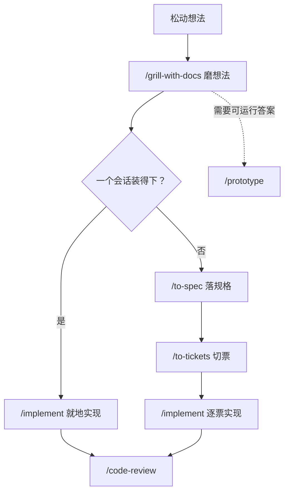

# MattSkillsDeck 工作流使用指南

这份文档讲怎么把装进 DSH 的 mattpocock/skills 工作流用起来。不逐行解释技能源码，只回答一个处境问题：现在手上是这种活，我该从哪里起手，下一段接什么，产出落在哪，什么算越界。

全文按「先建立结构、再进入场景」组织。第 1 到 3 章是地图，第 4 到 9 章是六个场景，第 10 章是速查与排错。

## 1. 概述：这是一套什么工作流

### 1.1 它是什么

你装的是 DSH 插件 `dsh-mattpocock-skills-deck`（当前 1.7.39）。它把上游仓库 mattpocock/skills 的 v1.2.3 快照整包带进来：25 个工程与效率技能，外加一块任务板、一条状态栏和一批 `deck_*` 工具。

插件不是简单的技能合集。上游技能是「流程」，插件补上「看板与读写通道」：

- 技能决定该做什么、下一步做什么、什么算做完；
- 任务板把 issue 分成可接、阻塞、已关闭三态，摆在 DSH 右侧边栏；
- `deck_*` 工具让 agent 直接建票、读票、补边、关票，而不是手敲跟踪器命令。

上游的定位是「Skills for Real Engineers」：每个技能解决工程过程中一个具体的认知动作，而不是替你写完所有代码。

### 1.2 五层结构

| 层 | 包含 | 作用 |
|----|------|------|
| 主流程（idea → ship） | grill-with-docs、to-spec、to-tickets、implement | 绝大多数工作沿这条路走 |
| 两个汇入口 | triage、diagnosing-bugs | 把外部流入的工作接上主流程 |
| 大型前置流程 | wayfinder | 一个会话装不下的迷雾工作，先寻路再汇入主流程 |
| 独立技能 | research、prototype、handoff、to-questionnaire、wizard、teach、wait-what、resolving-merge-conflicts、writing-for-agents | 点状使用，或作为主流程岔路 |
| 词汇层 | domain-modeling、codebase-design | 被别的技能反复引用，也回答「术语/接口怎么定」 |

遇到「不知道该用哪个技能」，直接问路由技能 `/ask-matt`，它按你的处境给一条路径。

### 1.3 两类触发方式（最容易误解的一点）

25 个技能分成两拨，分清这一点能省下大量困惑：

- **模型可自动调用（11 个）**：技能描述命中当前任务时，agent 自己就会加载。
- **只能由你发起（14 个）**：带 `disable-model-invocation: true`，必须你用斜杠命令（或面板技能页）显式启动。

| 只能由你发起（14） | 模型可自动调用（11） |
|-------------------|---------------------|
| `/ask-matt`、`/grill-me`、`/grill-with-docs`、`/handoff`、`/implement`、`/improve-codebase-architecture`、`/setup-matt-pocock-skills`、`/teach`、`/to-questionnaire`、`/to-spec`、`/to-tickets`、`/triage`、`/wait-what`、`/wayfinder` | `/codebase-design`、`/code-review`、`/diagnosing-bugs`、`/domain-modeling`、`/grilling`、`/prototype`、`/research`、`/resolving-merge-conflicts`、`/tdd`、`/wizard`、`/writing-for-agents` |

设计意图很清楚：**要不要开规格、要不要寻路、要不要分流**这类决定必须由人做，所以整条主流程的起手全部锁成人工触发；而「跑一次 TDD」「审一次代码」这类原子能力，让 agent 按需取用即可。

### 1.4 技能全景（按用途分组）

| 分组 | 技能 |
|------|------|
| 磨想法与写规格 | `/grill-with-docs`、`/grill-me`、`/grilling`、`/to-spec`、`/to-tickets` |
| 实现与质量 | `/implement`、`/tdd`、`/code-review` |
| 分流与寻路 | `/triage`、`/wayfinder` |
| 诊断与代码库健康 | `/diagnosing-bugs`、`/improve-codebase-architecture`、`/codebase-design`、`/domain-modeling`、`/resolving-merge-conflicts` |
| 独立工具 | `/research`、`/prototype`、`/handoff`、`/to-questionnaire`、`/wizard`、`/teach`、`/wait-what`、`/writing-for-agents` |
| 路由与初始化 | `/ask-matt`、`/setup-matt-pocock-skills` |

## 2. 快速开始：一次性配置

### 2.1 先跑一次 setup

在仓库里第一次用工程技能之前，先运行：

```text
/setup-matt-pocock-skills
```

它是提示驱动的，不是确定性脚本：先探索仓库现状，再把三件事一件一件问定，最后才写文件。

| 配置项 | 决定什么 | 本仓库取值 |
|--------|---------|-----------|
| Issue tracker | 票放在哪、技能读写用哪条通道 | GitHub Issues（ziogn/ziogn_doc），读写走 `deck_*` 工具 |
| Triage 标签 | 五个角色的实际标签字符串 | 保留默认五角色，标签名不变 |
| Domain docs | `CONTEXT.md` 与 ADR 放哪 | single-context：根 `CONTEXT.md` + `docs/adr/`，按需创建 |

跳过这一步的后果：`/to-spec`、`/to-tickets`、`/triage`、`/wayfinder` 都不知道票该写到哪，只能退化成默认的本地 markdown 约定，或在运行时停下来问你。

### 2.2 三个产物

setup 会写出三个配置文件，并在一份 agent 指令文件里挂上指针：

| 文件 | 内容 |
|------|------|
| `docs/agents/issue-tracker.md` | 票放哪、怎么读写、wayfinding operations、PR 是否算请求面 |
| `docs/agents/triage-labels.md` | 五角色映射表 + wayfinder 六标签 |
| `docs/agents/domain.md` | 域文档消费规则与布局 |
| `AGENTS.md` 的 `## Agent skills` 块 | 三行摘要 + 指向上面三份文件的指针 |

本仓库已完成初始化，三项取值见上表。要改词汇或换跟踪器，直接编辑 `docs/agents/*.md`；只有换后端或推倒重来才需要重跑 setup。

### 2.3 确认插件真的装在了对的地方

一个高频坑：插件装错 DSH profile，等于没装，重启多少次都不会加载。本仓库使用的入口是 web 服务，对应：

```bash
dsh plugin --profile web add dsh-mattpocock-skills-deck
```

装完重启对应入口（web 服务重启 `dsh web` 后刷新页面）。升级与卸载同样带 `--profile web`。更新时若被静默跳过，或报错地址是镜像源，显式指定官方源再装一次：

```bash
dsh plugin --profile web add dsh-mattpocock-skills-deck@latest --registry https://registry.npmjs.org
```

## 3. 主流程总览：从想法到上线

### 3.1 四段

主流程是一条 `idea → ship` 的路，四段各自有明确产出：

| 段 | 技能 | 输入 | 产出 |
|----|------|------|------|
| 磨想法 | `/grill-with-docs` | 一个轮廓还模糊的想法 | 问遍设计树，留下 `CONTEXT.md` 与 ADR |
| 落规格 | `/to-spec` | 已充分讨论的上下文 | 一篇 spec issue，直接打 `ready-for-agent` |
| 切票 | `/to-tickets` | spec 或一段计划 | 一批曳光弹票，每张声明阻塞边 |
| 实现 | `/implement` | 一张票或一篇 spec | 代码、测试、审查、commit |



### 3.2 两条岔路

**岔路一：有些问题只能靠跑起来回答。** 状态模型对不对、界面该长什么样，纸上谈不拢。这时在磨想法阶段开一个丢弃式原型：`/handoff` 出去，开一个干净会话，`/prototype` 用一次性代码把问题答掉，再 `/handoff` 把学到的东西带回来。原型本身留在 `prototype/<name>` 分支，作为决策的一手来源。

**岔路二：一个会话装得下就不必开规格。** 如果磨完想法发现根本没有迷雾、整件事一个窗口能做完，跳过 `/to-spec` 和 `/to-tickets`，直接 `/implement`。反过来，硬给一个小功能套规格，只会增加搬运成本。

### 3.3 上下文卫生

主流程有一条硬规则：**磨想法 → 落规格 → 切票这三步放在同一个不中断的上下文里**，中途不要 compact，不要 clear。grilling 的结论、spec 的取舍、切票时的依赖判断，全部建立在同一份思考上。

限制来自 smart zone：模型还能保持推理锐利的窗口大约 150k token。如果还没到 `/to-tickets` 就接近上限，在最近的阶段边界 `/compact` 一次，而不是带着被压缩掉细节的上下文硬推。

之后每一张票的 `/implement` 都从干净上下文开始，因为它只需要那张票，不需要上一张的现场。

## 4. 场景一：一个会话能装下的功能

**触发信号**：需求清楚到能讲出来，但没有细到能直接动手；你判断整件事一个会话做得完。

**命令序列**：

```text
/grill-with-docs    # 把设计树问遍，边问边把术语与决定写进 CONTEXT.md / ADR
/implement          # 在同一个上下文里直接实现
```

`/grill-with-docs` 的机制值得说清：它按「轮」推进。每一轮把所有当前可问的决定一次性摊开（前沿），每条问题编号并给出它的推荐答案；等你答完，前沿向外推移，下一轮再问依赖这些答案的问题。**事实由 agent 自己查，决定必须由你来做**——它不会为了省事把能查的东西拿来问你。

`/implement` 拿到 spec 或票之后的工作方式是固定的：在先前约定的 seam 上尽量用 `/tdd` 推进，定期跑类型检查和单文件测试，最后完整跑一次测试套件；收尾用 `/code-review` 审一遍 diff，再提交。

**走一个具体例子**：给现有 HTTP 客户端加一个请求重试策略。

1. `/grill-with-docs` 第一轮会问：重试次数上限怎么定、哪些状态码算可重试、退避用固定还是指数、幂等性谁来保证、超时算不算失败。每条都附推荐答案。
2. 你答完，第二轮问依赖上一轮的：指数退避的基准与上限、是否要 jitter、配置放代码还是放环境变量。
3. 前沿空掉后，agent 把术语（retry policy、idempotent request）与决定落成文档。
4. `/implement` 按 TDD 先写失败测试，再实现到绿，收尾审查并提交。

**产出**：可运行的代码、通过测试、一次 code review、一个 commit。

**边界**：如果 grilling 中途冒出「这个得先做个原型看看」，就去岔路一；如果谈着谈着发现要动的面比想象大得多、几个会话都收不住，停在这里，转场景二或场景四。

## 5. 场景二：多会话功能的规格与切票

**触发信号**：一个功能或一次改造，明确装不进一个上下文窗口；或者你希望先把工作切干净，再分头实现。

### 5.1 把讨论综合成 spec

```text
/to-spec
```

这个技能**不访谈**。它假设前面已经讨论够了，只做综合：探索代码库、用领域术语写规格、确认测试 seam，然后发布到配置好的跟踪器，并直接打上 `ready-for-agent`。

它有一件事必须和你确认：**在哪些缝上测试**。优先用已有缝，用尽可能高的缝；新缝要提在尽可能高的位置，整个代码库缝越少越好，理想是一条。确认后再落盘。

spec 的固定结构：问题陈述、解决方案、用户故事（长列表，每条写成「作为…我希望…以便…」）、实现决定（模块、接口、架构、schema、API 契约，**不写具体文件路径和代码片段**）、测试决定、范围外、补充说明。

### 5.2 把 spec 切成票

```text
/to-tickets
```

切出来的每张票是**曳光弹**：垂直切过 schema、API、UI、测试每一层的一条窄而完整的路，单独可演示、可验证，且能塞进一个干净上下文。它同时声明**阻塞边**——哪些票必须先完成。

```text
# 好的切法：每张票自身完整
票 A  加字段并在 UI 显示（垂直贯通）
票 B  基于 A 加筛选

# 坏的切法：按层横切
票 A  改 schema     ← 单独交付不可用
票 B  改 API        ← 单独交付不可用
```

**宽重构是垂直切片的例外。** 一次机械改动（改列名、改共享类型）会炸到全代码库几千个调用点时，没有哪张垂直票能单独保持绿色。这时用 expand–contract：先加新形态与旧形态并存（expand）；再按 blast radius 分批迁移调用点，每批一张票、被 expand 阻塞，批与批之间 CI 保持绿；最后确认没有调用方残留，删掉旧形态（contract）。批与批无法各自保持绿时，让它们共享一条集成分支，统一被一张最终验证票阻塞。

切完后 agent 会先**把切法拿给你确认**：粒度是否合适、阻塞边是否只连真正的前置、要不要合并或再拆。你点头之后才发布。

发布顺序是**按依赖、阻塞者在前**。本地 markdown 后端写成一票一文件（`.scratch/<feature-slug>/issues/NN-slug.md`）；真实跟踪器上发布成原生 issue，阻塞关系优先用平台原生依赖边，拿不到才退回正文首行的 `Blocked by: #n`。

### 5.3 逐票实现

```text
/implement #<ticket>
/clear
/implement #<ticket>
/clear
```

**前沿**是那些阻塞票全部关闭的票。线性链就自上而下，有并行边就任意顺序。抓票时先认领（assign）再动手，这样并行会话会自动跳过它。

**产出**：一篇 spec、一组带阻塞关系的票、每票一次实现 + 审查 + commit。

**边界**：`/to-tickets` 产出的票**已经**是 agent-ready，不要再送进 `/triage`；triage 只处理不是你创建的原始流入（bug 报告、外部需求）。如果切票时发现票与票之间的关系说不清，说明规格还没磨够，回上一段。

## 6. 场景三：让堆积的 issue 流动起来（triage）

**触发信号**：issue 列表开始积压；收到的 bug 报告或功能请求是你没创建的、原始流入的东西；你想知道「现在有什么需要我处理」。

### 6.1 状态机

triage 用两套标签描述一张票：

**分类角色（二选一）**

| 角色 | 含义 |
|------|------|
| `bug` | 有东西坏了 |
| `enhancement` | 新功能或改进 |

**状态角色（五选一）**

| 角色 | 含义 | 下一步 |
|------|------|--------|
| `needs-triage` | 待维护者评估 | 进入评估 |
| `needs-info` | 等报告者补充 | 报告者回复后回到 needs-triage |
| `ready-for-agent` | 规格完整，可交给 AFK agent | `/implement` 接手 |
| `ready-for-human` | 需要人类实现 | 人工处理 |
| `wontfix` | 不做 | 关闭 |

每张分流过的票应当**恰好一个分类加一个状态**。状态互相冲突时，技能会先停下来问你，不会自作主张。未打标签的票正常路径是先落到 `needs-triage`。

### 6.2 看「什么需要我处理」

```text
/triage 给我看有什么需要我处理的
```

它会把票分三桶、按最旧在前展示，每行一句摘要：

1. **未打标签** —— 从未分流；
2. **needs-triage** —— 正在评估；
3. **needs-info 且报告者在上次记录后有活动** —— 需要重评。

外部 PR 若被配置成请求面，也会进这三桶，并标 `[PR]` 或 `[issue]`；协作者正在推进的 PR 不算分流工作。

### 6.3 单张票的完整流程

以「用户反馈导出 CSV 偶发乱码」为例：

1. **收集上下文**：读全票正文、评论、标签、作者、时间；解析历史 triage 记录，避免重复问已答的问题；按领域术语探索代码库。然后做两项检查——**冗余**（按领域概念而非请求措辞搜现成实现）和**历史上是否已拒绝**（读 `.out-of-scope/`）。
2. **给建议**：给出分类与状态建议及理由，附上相关的代码库摘要，等你拍板。
3. **验证声明**：在开始追问之前先核对。bug 就按步骤复现；PR 就检出、跑测试或命令确认 diff 做了它声称的事。报告结论只有三种：确认（附代码路径）、失败、信息不足（这是很强的 needs-info 信号）。
4. **需要时追问**：如果请求还需要成形，运行 `/grilling` 与 `/domain-modeling`，一轮一轮问清楚，落定的术语与 ADR 顺手更新。
5. **落结果**：
   - `ready-for-agent`：贴一份 agent brief 评论；
   - `ready-for-human`：结构相同，但注明为什么不能交给 agent（判断、外部权限、设计取舍、手工测试）；
   - `needs-info`：贴 triage notes，分「已确认」与「还需要你回答」两段，问题必须具体可执行；
   - `wontfix`：关闭。已实现就指出实现位置，**不**写进 `.out-of-scope/`；拒绝的需求要写进 `.out-of-scope/` 并链接过去，再关闭。

所有分流期间发出的评论或 issue **必须**以一行声明开头：

```text
> *This was generated by AI during triage.*
```

### 6.4 边界

- **不要 triage 自己切出来的票**。`/to-tickets` 产出的票天生 agent-ready。
- 快速改状态可以直接说「把 #42 移到 ready-for-agent」，技能会确认动作后直接执行，跳过追问；但这种情况下它会问你要不要补一份 agent brief。
- 已经有 triage notes 的票再次进入时，先读记录、看报告者是否回答了悬留问题，再给更新后的判断。

## 7. 场景四：一屏看不到头的工程（wayfinder）

**触发信号**：一件大事——绿地项目、大功能、一次数据结构迁移——大到一个会话装不下，而且从当前位置到终点的路还看不清。这时不要急着写规格；规格的前提是「看清楚」，而你要先「看清路」。

`/wayfinder` 是最费认知的一种流，明显比 `/grill-with-docs` 更慢更密。它只适合真正大到需要它的工作，不要拿它包一个边界清楚的普通功能。

### 7.1 概念

| 概念 | 物理形态 | 说明 |
|------|---------|------|
| 目的地（Destination） | 地图正文第一段 | 抵达这张地图意味着什么：交付一篇 spec、锁一个决定，还是就地完成一次变更 |
| 地图（Map） | 一张打了 `wayfinder:map` 的 issue | 唯一的规范产物，是索引不是仓库：只放结论摘要与链接 |
| 票（Ticket） | 地图的子 issue | 每张解决一个决定；正文只有「Question」 |
| 票类型 | `wayfinder:<type>` 标签 | research / prototype / grilling / task |
| 阻塞（Blocking） | 跟踪器原生依赖边 | 一张票在阻塞它的票全部关闭后才解锁 |
| 前沿（Frontier） | 查询结果 | 开放 + 未被阻塞 + 未被认领的子票 |
| 迷雾（Fog） | 地图 `Not yet specified` 段 | 在范围内、但还没精确到能开票的东西——刻意留白 |
| 范围外（Out of scope） | 地图 `Out of scope` 段 | 被有意排除在这次努力之外的工作，永不毕业 |
| 认领（Claim） | 票的 assignee | 先认领再动手；开放且未分配即未被认领 |

**四种票类型**，前两种是 HITL（必须和人一起做），后两种中 `task` 可人可机：

| 类型 | 模式 | 解决什么 | 何时用 |
|------|------|---------|--------|
| research | AFK | 一个决定在等的事实 | 需要当前目录之外的资料；派 `/research` 子代理并行解决 |
| prototype | HITL | 「该长什么样 / 该怎么表现」 | 用粗糙但具体的产物提高讨论分辨率，产物作为资产链接进票 |
| grilling | HITL | 悬而未决的决定 | 默认类型；内部总是调用 `/grilling` 与 `/domain-modeling` |
| task | HITL 或 AFK | 决定之前必须先做的体力活 | 注册服务、开权限、搬数据；agent 能独做就独做，否则给人一份精确清单 |

关键区分：**迷雾还是票？** 判断标准是「现在能不能把问题说准」，不是「现在能不能答」。能说准就开票（哪怕被阻塞）；说不准就留在迷雾里。不要预先把迷雾切成票大小。

### 7.2 画出地图（chart the map）

1. **命名目的地**：先用 `/grilling` 与 `/domain-modeling` 把「到终点是什么样子」钉死。目的地决定范围，所以先定它。
2. **广度优先扫前沿**：再 grill 一次，这次横着扫全空间，列出公开的决定与现在能迈的第一步。如果扫下来**没有迷雾**——路已经清楚、整件事一个会话够——就停下来告诉你：你不需要地图。
3. **建地图**：填好 Destination 与 Notes，Decisions-so-far 留空，把迷雾草稿写进 Not yet specified。
4. **建现在能说清的票**：作为地图的子 issue 建出来。
5. **第二遍补阻塞边**：issue 要先有 id 才能互相引用，所以建票与连边分两遍。
6. **并行发 research 子代理**：每张 research 票派一个后台 `/research`，在一次性 `research/<name>` 分支上留结论，票里放上下文指针。

画完就停。画地图是一个会话的工作，它本身不解决任何票。

### 7.3 逐票推进（work through the map）

1. **载入地图**（低分辨率视图，不是每张票的正文）。
2. **选票**：你指定就按你的；没指定就取第一张前沿票。**认领它**——在任何工作之前先 assign，这样并行会话会跳过。
3. **解决它**：按需放大，取相关票或已关闭票的全文；调用 Notes 里点名的技能。拿不准就用 `/grilling` + `/domain-modeling`。
4. **记录结论**：把答案作为 resolution 评论贴出，关闭 issue，并在地图 Decisions-so-far 里追加一行指针。
5. **处理新情况**：新冒出的票先建后连边；答案让某片迷雾变得可描述时，把它毕业成新票并从 Not yet specified 移除；如果暴露出某张票已经在目的地之外，**判出范围**而不是在路线上解决它；如果决定让地图其它部分作废，更新或删除那些票。

一个会话**最多解决一张票**，research 票除外。你可以在不同会话里并行跑互不阻塞的票——这也意味着别的会话可能正在同时改跟踪器。

### 7.4 地图清空之后

wayfinder **交接，不建造**。路看清之后汇入主流程的 `/to-spec`：它把地图上互相链接的决定压成一份可建造的计划，再照常 `/to-tickets` 与逐票 `/implement`。只有整件事最后发现确实很小，才可以跳过这一步直接从地图进 `/implement`。

### 7.5 和本仓库工具的对应

本仓库的 wayfinding operations 已经写在 [issue-tracker.md](https://github.com/ziogn/ziogn_doc/blob/main/docs/agents/issue-tracker.md) 的 Wayfinding operations 一节，命令落到 `deck_*` 工具上：用 `deck_map_plan_create` 一次建出地图骨架，用 `deck_map_link` 补父子边或阻塞边，用 `deck_map_snapshot` 读子票与前沿，认领与结论用 `deck_issue_patch`。工具会优先落到 GitHub 的原生依赖边，落不了才降级并如实回报落点。

## 8. 场景五：难缠的 bug 与代码库健康

### 8.1 诊断难缠的 bug

**触发信号**：一个初看没头绪的 bug、偶发的 flake、两次已知良好状态之间悄悄出现的回归。也就是说，看一眼就能修的，不必上这个。

`/diagnosing-bugs` 有一条硬前置：**先造出紧反馈环**——一条对当前这个 bug 已经变红的命令。在拿到它之前，技能拒绝开始猜理论。之后才是定位、修复、补回归测试。

诊断后的去向有二：

- 真正的发现是「根本没有好缝把这个 bug 锁住」→ 转 `/improve-codebase-architecture`；
- 发现是术语混乱导致的误解 → 转 `/domain-modeling`。

### 8.2 保持代码库对 agent 友好

这不是功能工作，是保养：

| 技能 | 做什么 | 产出 |
|------|--------|------|
| `/improve-codebase-architecture` | 扫描代码库，找「加深」机会（深模块：大量行为躲在一个小接口后、坐在干净的缝上） | 可视化 HTML 报告；选中一条后进入追问，生成一个可以带进主流程的想法 |
| `/codebase-design` | 深模块词汇表（模块、接口、深度、缝、适配器、杠杆、局部性） | 用来设计某个模块的形状 |
| `/domain-modeling` | 磨项目领域语言；挑战模糊术语、拆解一词多义、把难以逆转的决定记成 ADR | 干净的 `CONTEXT.md` 与 `docs/adr/` |

典型用法：`/improve-codebase-architecture` 找出候选，`/codebase-design` 在选中的那条上做设计，然后把这个想法带回主流程的 `/grill-with-docs`。`/tdd` 与 `/improve-codebase-architecture` 都讲这套词汇，所以它们会互相引用。

## 9. 场景六：周边独立技能与阶段边界

### 9.1 独立技能一览

这些技能不落在主流程主干上，但每个都能在特定处境里省事：

| 技能 | 何时用 | 产出/效果 |
|------|--------|-----------|
| `/research` | 有一件必须读一手资料才能回答的事，你不想自己读 | 后台 agent 调查后，在仓库留下一份带引用的 Markdown |
| `/prototype` | 一个设计问题纸上说不清 | 一次性程序；答案折回真代码，原型留在 `prototype/<name>` 分支作为一手来源 |
| `/handoff` | 换工具、换目录、交给同事，或中途开一个支线任务 | 一份便携 Markdown，存到系统临时目录；含「建议技能」段，只引用不复制已有产物，且会脱敏 |
| `/to-questionnaire` | 卡住你的信息在别人脑子里 | 先访谈你「这问卷发给谁、要拿回什么」，再生成给对方填的问卷 |
| `/wizard` | 只有人能做的步骤：开基础设施、配凭据、点陌生第三方面板、一次性迁移 | 生成交互式 bash 向导，逐个打开链接、采集值、写进 `.env` 与 GitHub secrets |
| `/teach` | 想在多个会话里学一个东西 | 以当前目录为有状态工作区，按学习记录推进 |
| `/wait-what` | 上一段话没听懂 | 用简化英语与 `CONTEXT.md` 的词汇重讲一遍，补上你缺的上下文 |
| `/grilling` | 只想要访谈本身，不要包装 | 设计树 + 按轮推进的前沿提问 |
| `/resolving-merge-conflicts` | 已经处于 merge/rebase 冲突中 | 逐块按「意图」追溯到两侧的一手来源来解，绝不 `--abort` |
| `/writing-for-agents` | 写技能、改 AGENTS.md / CLAUDE.md、写给 agent 看的文档 | 一套「agent 怎么消费文档」的写法参考 |

### 9.2 阶段边界：五选一

一个 **phase** 是会话内的一段工作（磨想法、实现、QA）。两段之间就是**阶段边界**，也是唯一该做这个决定的地方——工作做到一半就别切，要么继续，要么把剩下的拆成子代理。

从上到下问，第一个「是」胜出：

1. **能在本会话继续吗？** 下一段需要这一段当一手来源，或 smart zone 还够（约 150k token）→ **Continue**。继续零成本、零损失，所以先排除它。
2. **当前上下文与接下来无关吗？** 探索、决定、弯路都是可丢的 → `/clear`。最便宜，整窗归还。
3. **需要交接吗？** 只在这四种情况：换 harness、换目录/仓库、交给同事、中途叉出支线任务。`/handoff` 买的是**可携带性**，没有东西要旅行就不需要它。
4. **能 AFK 做完吗？** 任务足够自洽、离开键盘也能跑 → 发 **子代理**。自动化审查是标准例子。
5. **否则 `/compact`。** 上下文相关、同 harness、同目录、你还要在环里——决策树大多落在这里。给它一句指令（例如「接下来要 QA 这块区域」），让摘要保住下一段需要的东西。

`/compact` 是**默认，不是首选**。它排在最后，是因为上面四个问题都更便宜或更精确；一上来就 compact 的失败模式，是新会话对某个被摘要抹平的决定自信地做错。

每一次除 Continue 之外的移动，都把一手来源换成了二手摘要：信息变少、噪声变少、机动空间变大。这就是为什么第一个问题必须先问。

## 10. 速查、落地现状与常见问题

### 10.1 按处境速查

| 我现在想… | 从这条命令起手 |
|-----------|---------------|
| 不知道用哪个技能 | `/ask-matt` |
| 第一次在这个仓库用工程技能 | `/setup-matt-pocock-skills` |
| 把一个模糊想法问清楚 | `/grill-with-docs`（在仓库里）或 `/grill-me`（不在仓库里） |
| 一个会话做得完的功能 | `/grill-with-docs` → `/implement` |
| 多会话的功能 | `/to-spec` → `/to-tickets` → 逐票 `/implement` |
| 整理积压 issue | `/triage` |
| 大而看不清的工程 | `/wayfinder` →（路清后）`/to-spec` |
| 一个搞不定的 bug | `/diagnosing-bugs` |
| 让代码库更适合 agent | `/improve-codebase-architecture` |
| 把一个设计问题跑出来 | `/prototype` |
| 把读资料的活外包 | `/research` |
| 换会话/换目录继续 | `/handoff` |
| 上一段没听懂 | `/wait-what` |
| 只送代码前审一遍 | `/code-review` |
| 处于冲突中 | `/resolving-merge-conflicts` |

### 10.2 25 个技能全表

| 技能 | 用途 | 触发 |
|------|------|------|
| ask-matt | 按处境路由到合适的技能或流 | 仅用户 |
| setup-matt-pocock-skills | 配置 issue tracker、triage 标签、域文档布局 | 仅用户 |
| grilling | 设计树 + 按轮追问的访谈原语 | 模型可自动 |
| grill-me | 无状态的一次性拷问 | 仅用户 |
| grill-with-docs | 拷问并顺手产出 ADR 与术语表 | 仅用户 |
| to-spec | 把讨论综合成 spec 并发到跟踪器 | 仅用户 |
| to-tickets | 把计划/spec 切成曳光弹票并声明阻塞边 | 仅用户 |
| implement | 按 spec 或票实现，内部驱动 TDD，收尾审查并提交 | 仅用户 |
| tdd | 红-绿-重构，测试先行 | 模型可自动 |
| code-review | 以固定点为基准做 Standards + Spec 双轴审查 | 模型可自动 |
| triage | 把 issue/外部 PR 推过分流状态机，写出 agent brief | 仅用户 |
| wayfinder | 为超过一个会话的迷雾工作画地图并逐票寻路 | 仅用户 |
| diagnosing-bugs | 先建紧反馈环，再诊断硬 bug 与性能回归 | 模型可自动 |
| improve-codebase-architecture | 扫描加深机会，出 HTML 报告并追问 | 仅用户 |
| codebase-design | 深模块词汇（模块/接口/深度/缝/适配器/杠杆/局部性） | 模型可自动 |
| domain-modeling | 磨领域术语，写 ADR | 模型可自动 |
| resolving-merge-conflicts | 按意图逐块解冲突，绝不 abort | 模型可自动 |
| prototype | 用丢弃式程序回答一个设计问题 | 模型可自动 |
| research | 委派后台读一手资料，留带引用的 Markdown | 模型可自动 |
| handoff | 把当前会话压成交接文档 | 仅用户 |
| to-questionnaire | 把决定写成给别人填的问卷 | 仅用户 |
| wizard | 生成只有人能走的交互式 bash 向导 | 模型可自动 |
| teach | 以当前目录为工作区，多会话学一个概念 | 仅用户 |
| wait-what | 让上一段话重讲清楚 | 仅用户 |
| writing-for-agents | 写 agent 消费的文档与技能 | 模型可自动 |

### 10.3 本仓库落地现状

- **跟踪器**：GitHub Issues（ziogn/ziogn_doc）。**票的读写走 `deck_*` 工具，不手敲 `gh` 命令**，详细约定见 [issue-tracker.md](https://github.com/ziogn/ziogn_doc/blob/main/docs/agents/issue-tracker.md)。
- **标签**：五个 triage 角色（`needs-triage`、`needs-info`、`ready-for-agent`、`ready-for-human`、`wontfix`）加六个 wayfinder 标签（`wayfinder:map` 及 research / prototype / grilling / task）都已建好，映射见 [triage-labels.md](https://github.com/ziogn/ziogn_doc/blob/main/docs/agents/triage-labels.md)。
- **域文档**：single-context。根目录 `CONTEXT.md` 与 `docs/adr/` 目前尚未创建，按规则安静跳过，等 `/domain-modeling` 第一次真正写下词条或决定时按需生成，见 [domain.md](https://github.com/ziogn/ziogn_doc/blob/main/docs/agents/domain.md)。
- **agent 指令**：三项配置的指针挂在 [AGENTS.md](https://github.com/ziogn/ziogn_doc/blob/main/AGENTS.md) 的 `## Agent skills` 块。

`deck_*` 工具清单：

| 工具 | 用途 |
|------|------|
| `deck_context` | 动 issue 前先确认 workspace 与后端 |
| `deck_issue_create` | 建票（task / bug / map），自动补必备 label |
| `deck_issue_get` | 读一张票的正文、评论、标签、父子与阻塞边 |
| `deck_issue_list` | 按状态、标签、认领人、关键词列出薄行 |
| `deck_issue_patch` | 改一张票：评论、标签、认领、开关、正文、进度段 |
| `deck_issue_report` | 上报当前正在处理或已关闭的 issue |
| `deck_map_plan_create` | 一次建出整张地图骨架（地图 + 子票 + 边） |
| `deck_map_snapshot` | 看一张地图的子票、进度与前沿 |
| `deck_map_link` | 补父子边或阻塞边，并回报落点 |

**两条纪律**：

1. 动 issue 前先调用一次 `deck_context`；若它说这个 workspace 还没选后端，说明插件不适用，就此停下。
2. **开始处理一个 issue 前必须调用 `deck_issue_report` 上报，处理完成关闭时再上报一次。** 这是强制时机，`deck_issue_patch` 关闭 issue 不等价于完成了上报。

另外，写 issue 正文时先把正文写成文件（真实换行、段落间空行），再交给工具写回；不要把正文拼进命令行，也不要把换行写成字面的 `\n`。

### 10.4 面板能帮什么

插件在 DSH 右侧边栏开一块任务板，日常高频的四件事不必回到终端：

- **任务板列表**：按可接、阻塞、已关闭归位；地图类型的行永远置顶；可按状态与标签筛选。每行右侧有动作按钮，点一下把写好的指令填进输入框。
- **底部状态栏**：每条会话输入框下面一条胶囊，显示可接数量、待修 bug、诊断、沉淀、交接等；点主要分段跳到对应面板页。
- **issue 详情与评论**：点开任意票，描述、标签、认领人与评论排好版，底部输入框直接回话。
- **新会话**：详情页顶部点新会话，标题自动起好、承接指令已预填，检查后发送即可，不打扰当前会话。
- **技能入口**：面板技能页列出技能，点加载就把斜杠指令填进输入框。

后端选择器可切 GitHub、本地 Markdown、GitLab 与 Other（无后端）。后端是与插件版本相关的可选项：当前插件以 GitHub 为主力，本地 Markdown 为预览，GitLab 暂不支持；本仓库使用 GitHub。切换只换数据源，原后端数据保留，切回来仍可见。

### 10.5 常见误解与排错

| 现象 | 原因 | 处理 |
|------|------|------|
| 技能明明装了，斜杠命令却不响应 | 插件装进了另一个 profile | 用实际入口对应的 profile 重装（本仓库为 web） |
| 更新后版本没变 | 供应链策略让新版本在几小时内被静默跳过 | 完全退出 DSH 重开并刷新；仍不行就指定官方源重装 |
| 更新报「找不到新版本」，地址是镜像源 | 镜像源尚未同步 | 显式加 `--registry https://registry.npmjs.org` |
| 把 to-tickets 的产物又送去 triage | 误以为所有票都要分流 | triage 只处理不是你创建的原始流入 |
| 想等 agent 自动触发 `/wayfinder` 或 `/to-spec` | 它们标了 disable-model-invocation | 由你以斜杠命令发起 |
| 主流程中途 compact，后面决定对不上 | 磨想法/规格/切票被拆到不同上下文 | 这三段保持同一上下文，必要时在阶段边界再 compact |
| 手敲 gh 命令建票 | 绕过插件契约层 | 用 `deck_*` 工具 |
| 处理 issue 没上报 | 漏掉强制上报时机 | 开始前与关闭时各调一次 `deck_issue_report` |

---

最后更新: 2026-10-04