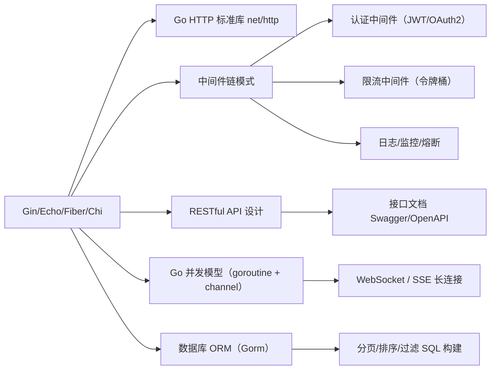

# go语言知识规划——web框架

> 本文档覆盖面试权重 15% 的 Go Web 框架知识，按"Gin 框架详解 → RESTful 设计实践 → 框架选型对比 → 追问链"的逻辑递进。与 Go 语言基础、数据库、缓存等方向的知识关联见知识体系总览文档（待补充）。

## 2.1 Gin 框架

Gin 是 Go 生态中最主流的 HTTP 框架（GitHub 78k+ stars），以出色的路由性能、极致的 API 设计和丰富的中间件生态著称。面试考察点集中在路由实现原理、中间件链、参数绑定与验证三大模块。

---

#### 高性能路由：基数树（Radix Tree）

Gin 的路由引擎基于 `httprouter` 的基数树实现。基数树（Radix Tree / Patricia Trie）是压缩前缀树——将共享前缀合并为单一路径节点，减少树的高度，实现 O(path-length) 的路由查找。

**路由注册示例**：

```go
package main

import (
    "net/http"
    "github.com/gin-gonic/gin"
)

func main() {
    r := gin.Default()

    // 静态路由
    r.GET("/users", listUsers)
    r.GET("/users/:id", getUser)      // 参数路由
    r.GET("/users/:id/posts", getUserPosts)
    r.POST("/users", createUser)

    // 通配符路由
    r.GET("/static/*filepath", serveStatic)

    r.Run(":8080")
}
```

**路由注册后的基数树结构**（以 `/users`、`/users/:id`、`/users/:id/posts` 为例）：

```text
根节点 ""
  └─ "users"（共享前缀）
       ├─ ""        → [GET] listUsers
       └─ "/:"（参数段，名称为 id）
            ├─ ""        → [GET] getUser
            └─ "/posts"  → [GET] getUserPosts
```

**查找过程**：将请求路径逐字符与树节点前缀匹配，遇到 `:` 通配段时提取参数值并继续匹配子节点。所有路由注册时已按优先级排序——静态路由优先于参数路由优先于通配符路由。

**参数获取方式**：

```go
func getUser(c *gin.Context) {
    // 获取路径参数 :id
    id := c.Param("id")

    // 获取查询参数
    page := c.DefaultQuery("page", "1")
    sort := c.Query("sort")

    c.JSON(http.StatusOK, gin.H{
        "id":   id,
        "page": page,
        "sort": sort,
    })
}
```

**方法冲突检测**：Gin 在注册路由时严格检查冲突——不能在同一位置同时注册 `:name` 和 `:id`（参数名不同但都是参数路由），也不能同时注册 `/users` 和 `/users/:id` 这样模棱两可的路径。路由冲突会在启动时 panic。

> **常见陷阱**：
> - `c.Param(name)` 只获取路径参数（`:param` 和 `*param`），不获取查询参数
> - 通配符路由 `*filepath` 会匹配所有子路径（如 `/static/js/app.js` 的 filepath 值为 `/js/app.js`），包括前缀 `/`
> - 路由冲突在启动时 panic，不是运行时——所以要确保路由注册无冲突
> - 不要用 `gin.New()` 代替 `gin.Default()` 之后手工加 Logger/Recovery，除非你明确知道自己在做什么

> **关联知识点**：基数树 → HTTP 路由匹配原理 / 参数路由 → RESTful URL 设计 / 通配符路由 → 静态文件服务实现

---

#### 中间件链：HandlerFunc 链式调用

Gin 的中间件本质是 `gin.HandlerFunc` 链：每个中间件通过 `c.Next()` 将控制权传递给下一个处理函数，形成洋葱模型。

```go
func main() {
    r := gin.New()

    // 全局中间件
    r.Use(gin.Logger())
    r.Use(gin.Recovery())

    // 路由级别中间件（认证示例）
    r.GET("/admin", AuthRequired(), adminHandler)

    // 分组中间件
    api := r.Group("/api")
    api.Use(ApiLogger(), RequestId())
    {
        api.GET("/users", listUsers)
        api.POST("/users", createUser)
    }

    r.Run(":8080")
}
```

**自定义中间件实现**：

```go
func AuthRequired() gin.HandlerFunc {
    return func(c *gin.Context) {
        token := c.GetHeader("Authorization")
        if token == "" || !validateToken(token) {
            c.AbortWithStatusJSON(http.StatusUnauthorized, gin.H{
                "code":    401,
                "message": "unauthorized",
            })
            return  // c.Abort() 终止链，不再执行后续 HandlerFunc
        }

        // 将解析后的用户信息存入上下文
        userID, _ := parseToken(token)
        c.Set("user_id", userID)

        c.Next()  // 继续执行后续中间件和最终处理函数
    }
}

func ApiLogger() gin.HandlerFunc {
    return func(c *gin.Context) {
        start := time.Now()
        path := c.Request.URL.Path

        c.Next()

        latency := time.Since(start)
        status := c.Writer.Status()
        log.Printf("[%d] %s %v", status, path, latency)
    }
}
```

**洋葱模型执行顺序**：

```text
请求到达
  ↓
Middleware 1（before Next）
  ↓
Middleware 2（before Next）
  ↓
Handler（最终处理函数）
  ↓
Middleware 2（after Next — 回复处理）
  ↓
Middleware 1（after Next — 回复处理）
  ↓
响应返回
```

`c.Next()` 是 Gin 中间件链的关键——它调用 `c.handlers[index+1](c)`，即链中的下一个 HandlerFunc。中间件在 `c.Next()` 之前的代码在请求处理前执行，`c.Next()` 之后的代码在请求处理后执行（洋葱剥皮式的后处理）。

**c.Abort() vs c.Next()**：

| 方法 | 行为 | 典型用途 |
|------|------|---------|
| `c.Next()` | 调用链中下一个 HandlerFunc | 认证通过后放行；日志记录的前后拦截 |
| `c.Abort()` | 跳过后续所有 HandlerFunc | 认证失败时直接返回；限流拒绝 |
| `c.AbortWithStatusJSON(code, obj)` | Abort + 直接返回 JSON | 统一错误响应 |

> **常见陷阱**：
> - `c.Next()` 不是协程，如果在中间件中开启 goroutine 后调 `c.Next()`，goroutine 中不能使用 `c`（上下文已释放）
> - `c.Set()` / `c.Get()` 是上下文传值（基于 `sync.Map` 实现），不是请求体参数
> - 在中间件中调 `c.Abort()` 后仍应 `return`，否则中间件函数会继续执行 `c.Next()` 后面的代码
> - 中间件的执行顺序与 `Use()` 的注册顺序一致，先注册的外层先执行

> **关联知识点**：中间件洋葱模型 → Go http.Handler 包装模式 / `c.Set/Get` → 请求级上下文（context.WithValue 的增强版）/ `c.Abort` → HTTP 拦截器模式

---

#### 参数绑定与验证：ShouldBindJSON + binding tag

Gin 支持多种数据绑定方式，核心是 `ShouldBind` 系列方法和 `binding` tag。绑定错误直接返回 JSON 描述，不需要手动解析 `r.Body`。

**请求体绑定方式**：

| 方法 | 来源 | Content-Type |
|------|------|-------------|
| `c.ShouldBindJSON(&obj)` | Request Body | `application/json` |
| `c.ShouldBindQuery(&obj)` | URL Query | 无限制 |
| `c.ShouldBindUri(&obj)` | URL Path | 无限制 |
| `c.ShouldBind(&obj)` | 自动识别 | 根据 Content-Type 自动选择 |
| `c.ShouldBindWith(&obj, binding.JSON)` | 指定方式 | 显式指定 |

**完整示例**：

```go
type CreateUserRequest struct {
    Name     string `json:"name"     binding:"required,min=2,max=50"`
    Email    string `json:"email"    binding:"required,email"`
    Age      int    `json:"age"      binding:"required,gte=18,lte=120"`
    Password string `json:"password" binding:"required,min=8,max=100"`
    Website  string `json:"website"  binding:"omitempty,url"`
}

type PageQuery struct {
    Page  int    `form:"page"  binding:"omitempty,gte=1"`
    Limit int    `form:"limit" binding:"omitempty,gte=1,lte=100"`
    Sort  string `form:"sort"  binding:"omitempty,oneof=asc desc"`
}

type UserIDPath struct {
    ID int64 `uri:"id" binding:"required,min=1"`
}

func createUser(c *gin.Context) {
    var req CreateUserRequest
    if err := c.ShouldBindJSON(&req); err != nil {
        c.JSON(http.StatusBadRequest, gin.H{
            "code":    400,
            "message": err.Error(),
        })
        return
    }
    c.JSON(http.StatusCreated, gin.H{"id": 1, "email": req.Email})
}
```

**binding tag 常用规则**：

| Tag | 说明 | 示例 |
|-----|------|------|
| `required` | 必填 | `binding:"required"` |
| `min` / `max` | 字符串最小/最大长度或数值上下界 | `binding:"min=2,max=50"` |
| `gte` / `lte` | 数值 >= / <= | `binding:"gte=18,lte=120"` |
| `gt` / `lt` | 数值 > / < | `binding:"gt=0"` |
| `email` | 邮箱格式 | `binding:"email"` |
| `url` | URL 格式 | `binding:"url"` |
| `oneof` | 枚举值之一 | `binding:"oneof=asc desc"` |
| `omitempty` | 可为空，空值时跳过后续验证 | `binding:"omitempty,url"` |
| `len` | 固定长度 | `binding:"len=11"`（手机号）|
| `uuid` | UUID 格式 | `binding:"uuid"` |
| `datetime` | 日期格式（Go 布局） | `binding:"datetime=2006-01-02"` |

**验证原理**：`c.ShouldBindJSON` 内部使用 Go 标准库 `encoding/json` 反序列化，然后调用 `binding.Validator.Struct()` 进行验证。Gin 默认的验证器底层是 `go-playground/validator/v10`，基于结构体 tag 反射驱动。

```go
// validator/v10 支持的更多验证：

type AdvancedRequest struct {
    Status string `json:"status" binding:"oneof=pending active inactive"`

    // 跨字段验证：Field1 > Field2
    StartDate string `json:"start_date" binding:"required,datetime=2006-01-02"`
    EndDate   string `json:"end_date"   binding:"required,datetime=2006-01-02,gtfield=StartDate"`

    Tags []string `json:"tags" binding:"required,dive,min=2"`
    // dive: 进入切片/数组验证每个元素

    Metadata map[string]string `json:"metadata" binding:"required,dive,keys,max=20,endkeys,required"`
    // dive,keys,endkeys: 验证字典的 key 和 value 各自满足规则
}
```

> **常见陷阱**：
> - `ShouldBindJSON` 消费了 `c.Request.Body`，多次调用会得到空体（`EOF`）——只调用一次
> - `form` tag 用于查询参数或表单，`json` tag 用于 JSON 体，`uri` tag 用于路径参数——tag 名必须和来源匹配
> - `required` 表示字段值不能为零值（0、空字符串、nil），零值字段即使传了也会报错
> - `omitempty` 与 `required` 互斥：`omitempty,url` 表示"非空时验证 url 格式"，空时跳过

> **关联知识点**：binding tag → validator/v10 验证库 / ShouldBindJSON → encoding/json 标准库反序列化 / 自定义验证器 → RegisterValidation 扩展

---

#### 分组路由（Group）

`r.Group()` 创建带有公共前缀的路由组，支持嵌套和组级别中间件：

```go
func main() {
    r := gin.Default()

    // 嵌套分组示例
    api := r.Group("/api")
    {
        // 公开接口
        api.GET("/health", healthCheck)

        // 版本分组
        v1 := api.Group("/v1")
        v1.Use(ApiVersion("v1"))
        {
            v1.GET("/users", listUsers)
            v1.POST("/users", createUser)
            v1.GET("/users/:id", getUser)
        }

        v2 := api.Group("/v2")
        v2.Use(ApiVersion("v2"))
        {
            v2.GET("/users", listUsersV2)
        }

        // 需要认证的分组
        admin := api.Group("/admin")
        admin.Use(AuthRequired(), AdminOnly())
        {
            admin.GET("/stats", getStats)
            admin.POST("/config", updateConfig)
        }
    }

    r.Run(":8080")
}
```

**分组路由的中间件叠加规则**：子分组继承父分组的全部中间件，再加上自定义中间件。执行顺序为"父→子"，即外层先注册的中间件先执行。

> **关联知识点**：分组路由 → RESTful API 路由设计 / 嵌套分组 → 版本管理和模块化设计

---

#### 渲染与文件上传

**JSON/XML/HTML 渲染**：

```go
func handler(c *gin.Context) {
    // JSON 响应
    c.JSON(http.StatusOK, gin.H{
        "id":   1,
        "name": "Alice",
    })

    // XML 响应
    c.XML(http.StatusOK, gin.H{"message": "Hello"})

    // HTML 模板渲染
    c.HTML(http.StatusOK, "index.tmpl", gin.H{
        "title": "Home",
    })

    // 纯字符串
    c.String(http.StatusOK, "OK")

    // 文件下载
    c.File("report.pdf")
}
```

**文件上传**：

```go
func main() {
    r := gin.Default()
    // 限制 multipart 表单内存（默认 32 MiB）
    r.MaxMultipartMemory = 8 << 20 // 8 MiB

    // 单文件上传
    r.POST("/upload", func(c *gin.Context) {
        file, err := c.FormFile("file")
        if err != nil {
            c.JSON(http.StatusBadRequest, gin.H{"error": err.Error()})
            return
        }

        // 保存到服务器
        dst := "./uploads/" + file.Filename
        if err := c.SaveUploadedFile(file, dst); err != nil {
            c.JSON(http.StatusInternalServerError, gin.H{"error": err.Error()})
            return
        }
        c.JSON(http.StatusOK, gin.H{
            "filename": file.Filename,
            "size":     file.Size,
        })
    })

    // 多文件上传
    r.POST("/uploads", func(c *gin.Context) {
        form, err := c.MultipartForm()
        if err != nil {
            c.JSON(http.StatusBadRequest, gin.H{"error": err.Error()})
            return
        }
        files := form.File["files"]
        for _, file := range files {
            c.SaveUploadedFile(file, "./uploads/"+file.Filename)
        }
        c.JSON(http.StatusOK, gin.H{
            "count": len(files),
        })
    })

    r.Run(":8080")
}
```

**绑定文件上传到结构体**：

```go
type FileUpload struct {
    Name string                `form:"name" binding:"required"`
    File *multipart.FileHeader `form:"file" binding:"required"`
}

func uploadHandler(c *gin.Context) {
    var upload FileUpload
    if err := c.ShouldBind(&upload); err != nil {
        c.JSON(http.StatusBadRequest, gin.H{"error": err.Error()})
        return
    }
    c.SaveUploadedFile(upload.File, "./uploads/"+upload.File.Filename)
    c.JSON(http.StatusOK, gin.H{"filename": upload.File.Filename})
}
```

> **常见陷阱**：
> - `c.FormFile()` 单次只返回一个文件字段，多文件使用 `MultipartForm()` + 遍历
> - 文件上传前务必限制请求体大小：`MaxMultipartMemory` 限制的是内存缓存大小，不是请求体大小；使用 `c.Request.Body = http.MaxBytesReader(w, r.Body, maxSize)` 限制实际请求体
> - `c.File()` 是流式传输，不会将整个文件加载到内存

> **关联知识点**：文件上传 → HTTP multipart/form-data 协议 / 模板渲染 → Go html/template 标准库

---

## 2.2 RESTful API 设计实践

RESTful API 设计考察的核心是：资源路由规划、HTTP 状态码的语义化使用、分页/过滤/排序的规范实现、统一错误响应格式、以及请求验证的完整方案。

---

#### 资源路由设计

```go
func main() {
    r := gin.Default()

    // ========== 标准 CRUD 路由模式 ==========
    users := r.Group("/api/v1/users")
    {
        // GET /api/v1/users          → 列表（带分页）
        // GET /api/v1/users/:id      → 单条详情
        // POST /api/v1/users         → 创建
        // PUT /api/v1/users/:id      → 全量更新
        // PATCH /api/v1/users/:id    → 部分更新
        // DELETE /api/v1/users/:id   → 删除
        users.GET("/", listUsers)
        users.GET("/:id", getUser)
        users.POST("/", createUser)
        users.PUT("/:id", updateUser)
        users.PATCH("/:id", patchUser)
        users.DELETE("/:id", deleteUser)
    }

    // ========== 子资源嵌套路由 ==========
    // GET /api/v1/users/:id/posts         → 用户的所有文章
    // GET /api/v1/users/:id/posts/:pid    → 具体某篇文章
    posts := r.Group("/api/v1/users/:id/posts")
    {
        posts.GET("/", listUserPosts)
        posts.GET("/:pid", getUserPost)
    }

    r.Run(":8080")
}
```

**URL 命名规范**：

| 规范 | 正确示例 | 错误示例 |
|------|---------|---------|
| 名词复数 | `/api/v1/users` | `/api/v1/user` |
| 小写连字符 | `/api/v1/order-items` | `/api/v1/orderItems` |
| 层级用斜杠 | `/users/:id/posts` | `/users_posts` |
| 版本前缀 | `/api/v1/...` | 无版本号 |

---

#### HTTP 状态码使用规范

| 状态码 | 含义 | 使用场景 |
|--------|------|---------|
| 200 OK | 请求成功 | GET / PUT / PATCH 成功 |
| 201 Created | 资源创建成功 | POST 成功（通常返回 `Location` 头） |
| 204 No Content | 成功但无返回体 | DELETE 成功 |
| 400 Bad Request | 请求参数错误 | 参数验证失败、格式错误 |
| 401 Unauthorized | 未认证 | 缺少或无效 token |
| 403 Forbidden | 已认证但无权限 | 角色不满足要求 |
| 404 Not Found | 资源不存在 | 路由匹配但资源缺失 |
| 409 Conflict | 资源冲突 | 唯一约束冲突、重复创建 |
| 422 Unprocessable Entity | 请求体语义错误 | 逻辑验证失败（如结束日期 < 开始日期） |
| 429 Too Many Requests | 限流 | 请求频率超标 |
| 500 Internal Server Error | 服务端内部错误 | 未捕获异常、数据库失败 |

---

#### 分页/过滤/排序

```go
type PaginationQuery struct {
    Page     int    `form:"page"     binding:"omitempty,gte=1"`
    PageSize int    `form:"page_size" binding:"omitempty,gte=1,lte=100"`
    Sort     string `form:"sort"     binding:"omitempty,oneof=created_at -created_at name -name"`
    Status   string `form:"status"   binding:"omitempty,oneof=active inactive all"`
    Keyword  string `form:"keyword"  binding:"omitempty,max=100"`
}

type PaginatedResponse struct {
    Data       interface{} `json:"data"`
    Page       int         `json:"page"`
    PageSize   int         `json:"page_size"`
    Total      int64       `json:"total"`
    TotalPages int         `json:"total_pages"`
}

func listUsers(c *gin.Context) {
    var q PaginationQuery
    if err := c.ShouldBindQuery(&q); err != nil {
        c.JSON(http.StatusBadRequest, NewErrorResponse(err))
        return
    }

    // 默认值
    if q.Page <= 0 {
        q.Page = 1
    }
    if q.PageSize <= 0 {
        q.PageSize = 20
    }

    offset := (q.Page - 1) * q.PageSize

    // 构建查询（伪代码）
    users, total, err := db.QueryUsers(q.Status, q.Keyword, q.Sort, offset, q.PageSize)
    if err != nil {
        c.JSON(http.StatusInternalServerError, NewErrorResponse(err))
        return
    }

    totalPages := int(math.Ceil(float64(total) / float64(q.PageSize)))
    c.JSON(http.StatusOK, PaginatedResponse{
        Data:       users,
        Page:       q.Page,
        PageSize:   q.PageSize,
        Total:      total,
        TotalPages: totalPages,
    })
}
```

**排序约定**：

```text
/users?sort=created_at         → ORDER BY created_at ASC
/users?sort=-created_at        → ORDER BY created_at DESC
/users?sort=name               → ORDER BY name ASC
```

使用 `-` 前缀表示降序（类似 Django REST framework 的约定），需要先在 `oneof` 中枚举允许排序的字段，防止 SQL 注入。

---

#### 错误响应统一格式

```go
// 统一错误响应结构
type ErrorResponse struct {
    Code    int         `json:"code"`
    Message string      `json:"message"`
    Details interface{} `json:"details,omitempty"`
}

func NewErrorResponse(err error) ErrorResponse {
    return ErrorResponse{
        Code:    400,
        Message: err.Error(),
    }
}

func NewValidationErrorResponse(err error) ErrorResponse {
    var ve validator.ValidationErrors
    if errors.As(err, &ve) {
        details := make([]map[string]interface{}, 0)
        for _, e := range ve {
            details = append(details, map[string]interface{}{
                "field":   e.Field(),
                "tag":     e.Tag(),
                "value":   e.Value(),
                "message": e.Error(),
            })
        }
        return ErrorResponse{
            Code:    422,
            Message: "请求参数验证失败",
            Details: details,
        }
    }
    return NewErrorResponse(err)
}
```

**全局错误处理中间件**：

```go
func ErrorHandler() gin.HandlerFunc {
    return func(c *gin.Context) {
        c.Next()

        // 检查是否有未处理的错误
        if len(c.Errors) > 0 {
            err := c.Errors.Last()
            c.JSON(http.StatusInternalServerError, ErrorResponse{
                Code:    500,
                Message: err.Error(),
            })
        }
    }
}
```

---

#### 请求验证综合示例

```go
// ========== validator/v10 集成示例 ==========
import (
    "github.com/go-playground/validator/v10"
)

var validate *validator.Validate

func init() {
    validate = validator.New()

    // 自定义验证器：password 必须同时包含字母和数字
    validate.RegisterValidation("strong_password", func(fl validator.FieldLevel) bool {
        pw := fl.Field().String()
        hasLetter := false
        hasDigit := false
        for _, c := range pw {
            if unicode.IsLetter(c) {
                hasLetter = true
            }
            if unicode.IsDigit(c) {
                hasDigit = true
            }
        }
        return hasLetter && hasDigit
    })
}

type CreateUserRequest struct {
    Username string `json:"username" binding:"required,min=3,max=32"`
    Email    string `json:"email"    binding:"required,email"`
    Password string `json:"password" binding:"required,min=8,max=128,strong_password"`
    Role     string `json:"role"     binding:"required,oneof=admin editor viewer"`
    Age      int    `json:"age"      binding:"required,gte=18,lte=120"`
}

// 验证中间件（通用化）
func ValidateRequest(obj interface{}) gin.HandlerFunc {
    return func(c *gin.Context) {
        if err := c.ShouldBindJSON(obj); err != nil {
            c.JSON(http.StatusUnprocessableEntity, NewValidationErrorResponse(err))
            c.Abort()
            return
        }
        c.Set("validated_body", obj)
        c.Next()
    }
}

// 使用
r.POST("/api/v1/users", ValidateRequest(&CreateUserRequest{}), createUserHandler)
```

> **常见陷阱**：
> - 不要返回 HTTP 200 + `{"code": 500}` 体——用正确的状态码表示 HTTP 语义
> - 分页参数必须在接受前验证（负值、超大值可能导致服务端异常）
> - `Sort` 参数不能直接拼接到 SQL 中，必须白名单映射或 `oneof` 校验
> - 错误响应体中的 `message` 不应暴露内部堆栈信息（生产环境）

> **关联知识点**：状态码规范 → HTTP 协议标准 / 统一错误响应 → [Go 错误处理模式](../go错误处理.md) / 参数验证 → validator/v10 库

---

## 2.3 框架选型对比

Go 生态中主流 Web 框架各有取舍，选型时需考虑性能、生态、学习曲线和团队熟悉度。

| 对比维度 | Gin | Echo | Fiber | Chi |
|---------|-----|------|-------|-----|
| 底层 HTTP 库 | `net/http` | `net/http` | `fasthttp` | `net/http` |
| 路由实现 | Radix Tree | Radix Tree | Radix Tree | 前缀树（Compact Radix）|
| 路由性能 | 极高 | 高 | 极高（fasthttp） | 中高 |
| 社区 / Stars | 78k+ | 30k+ | 35k+ | 19k+ |
| 学习曲线 | 低（API 简洁） | 低 | 低（Express 类似） | 中（标准 handler） |
| 中间件机制 | `HandlerFunc` 链 | `MiddlewareFunc` 链 | `HandlerFunc` 链 | 标准 `http.Handler` |
| 验证集成 | 内置 binding tag | 内置（需额外配置） | 需手动集成 | 无内置，自行集成 |
| 分组路由 | `Group()` | `Group()` | `Group()` | `Route()` / `Group()` / `Mount()` |
| 模板渲染 | 支持（`LoadHTMLGlob`）| 支持（`Renderer` 接口）| 支持（`Views`）| 无内置 |
| OpenAPI / Swagger | 成熟（swaggo/gin-swagger）| 支持（echo-swagger）| 支持（swagger）| 社区配套 |
| GraphQL 支持 | gqlgen + gin 适配 | gqlgen + echo 适配 | gqlgen + fiber 适配 | 自行集成 |
| 文档详尽程度 | 极好 | 好 | 好 | 较好 |
| 适用场景 | 通用生产首选 | 轻量 API 网关 | 超高吞吐边缘 | 定制化、标准库友好 |

---

#### 详细选型建议

**Gin — 通用生产首选**
- 项目启动默认选择，生态最成熟
- 社区资料丰富，bug 响应快
- 适合：绝大多数后端 API 项目、微服务、CRUD 应用
- 不适合：路由注入过度复杂的场景

**Echo — 高可扩展性**
- API 简洁，上下文方法比 Gin 更丰富
- 内置可配置的 HTTP/2 支持
- 适合：API 网关、认证层、需要细粒度 HTTP 控制的项目
- 不适合：模板渲染为主的应用

**Fiber — 极致性能**
- 基于 `fasthttp`，性能高于 `net/http` 系框架 2-3 倍
- API 设计借鉴 Express.js，Node 开发者迁移成本极低
- 适合：物联网网关、反向代理、CDN 边缘服务
- 不适合：需要大量第三方集成库的场景（fasthttp 的请求/响应类型与 `net/http` 不兼容，部分标准库中间件无法直接复用）

**Chi — 标准库风格**
- 完全兼容 `net/http` 标准接口，路由即 `http.Handler`
- 轻量无依赖，可组合性强（`Mount()` 挂载子路由）
- 适合：追求标准库兼容性、需要精细控制中间件粒度的项目
- 不适合：快速原型开发、模板渲染需求强的应用

**性能参考**（选自 Go Web Framework Benchmark）：

```text
Gin:    约 12,000 req/s （单核）
Fiber:  约 28,000 req/s （基于 fasthttp）
Echo:   约 11,000 req/s
Chi:    约  8,000 req/s （标准 handler 的开销）
```

（数据为近似参考，实际性能取决于路由复杂度、中间件链长度和业务逻辑。Fiber 的 `fasthttp` 在极端高并发下有明显优势，但牺牲了 `net/http` 的兼容性。）

> **常见陷阱**：
> - Fiber 的 `fasthttp` 不兼容标准 `http.Handler`，迁移成本高
> - Gin 和 Echo 虽然底层都基于 `net/http`，但 `gin.Context` 和 `echo.Context` 都不兼容标准库的 `http.Handler`
> - Chi 是唯一一个 handler 签名直接用 `http.HandlerFunc` 的——这是它最大的特色，也是性能略低的原因
> - 不要只看 star 数选框架，考虑团队技术栈、生态需求、第三方库兼容性

> **关联知识点**：fasthttp 性能优势 → Go 标准库 net/http 设计取舍 / 路由性能 → Radix Tree 数据结构 / net/http 兼容性 → Go 标准中间件模式 / ws 和 SSE 支持 → WebSocket 和 Server-Sent Events 的框架差异

---

**追问链**：`Gin Radix Tree 路由原理 → 静态路由 vs 参数路由匹配优先级 → 路由冲突检测机制 → 中间件洋葱模型 → c.Next() vs c.Abort() → 如何实现自定义中间件 → c.Set/Get 传值原理 → ShouldBindJSON 绑定流程 → binding tag 常用规则 → validator/v10 底层原理 → required vs omitempty 区别 → Group 分组路由与中间件叠加 → 嵌套分组面试场景（三层路由的中间件执行顺序）→ 文件上传 MultipartForm → MaxMultipartMemory 的作用 → RESTful 资源路由设计规范 → HTTP 状态码的正确使用（201 vs 204 vs 200）→ 分页参数统一设计范式 → 错误响应的统一格式设计 → 选型对比 Gin vs Echo vs Fiber vs Chi → Fiber fasthttp 优缺点 → Chi 的 net/http 兼容性 → 自己项目中用了什么框架，为什么`

---

## 跨域知识关联

Go Web 框架知识在整个后端技术栈中处于"入口层"，向下衔接 HTTP 协议和网络编程，横向关联认证授权和中间件体系。



| 关联方向 | 说明 | 联动知识点 |
|---------|------|-----------|
| Go net/http 标准库 | 框架底层都基于 `net/http`（Fiber 除外），掌握标准 handler 是理解框架的基础 | `http.Handler`、`http.ResponseWriter`、`http.Request` |
| JWT / 认证中间件 | 中间件链中嵌入 JWT 验证是标准模式 | `appleboy/gin-jwt`、`labstack/echo-jwt`、`golang-jwt/jwt/v5` |
| 接口文档 | RESTful API 需搭配 OpenAPI 文档 | `swaggo/swag`、`swaggo/gin-swagger` |
| 数据库交互 | 请求参数验证后 → 数据库查询 | `Gorm`、`sqlx`、SQL 构建与参数绑定 |
| 限流与熔断 | 框架入口层实施流量控制 | 令牌桶算法、漏桶算法、滑动窗口 |
| 并发模型 | 每个请求在 goroutine 中处理 | goroutine 池、请求上下文传递、panic 恢复 |
| 分布式跟踪 | 中间件自动注入 trace ID | OpenTelemetry、Jaeger 集成中间件 |
| WebSocket 升级 | 在框架路由中支持 WS 协议升级 | `gorilla/websocket`、框架适配层 |

> **关联知识点**：中间件模式 → 装饰器设计模式 / 路由匹配 → 前缀树数据结构 / 请求上下文 → Go context 包 / 参数验证 → 反射（reflect）包 / JSON 序列化 → encoding/json / 文件上传 → multipart 协议的 MIME 边界
