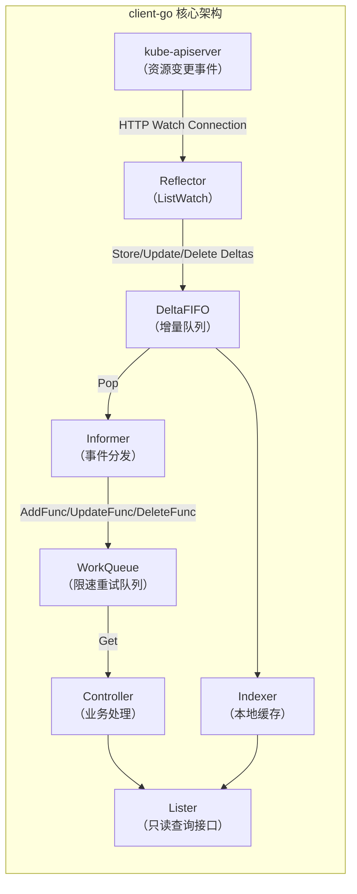
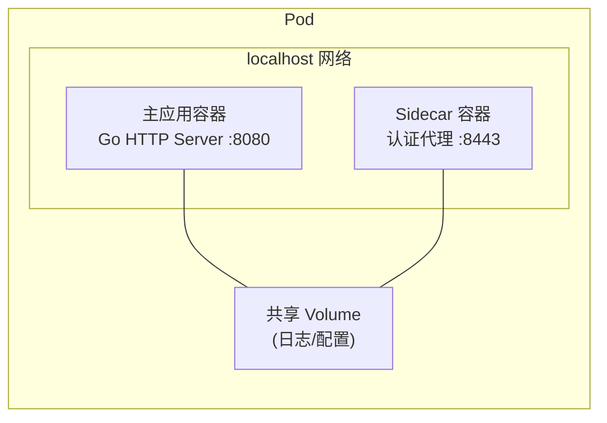

# go语言知识规划——云原生

> 云原生是 Go 语言生态中最具说服力的舞台。Kubernetes 本身由 Go 编写，Docker、containerd、Etcd、Prometheus 等云原生基础设施的基石项目也全部使用 Go。掌握云原生方向的技术栈，意味着理解 Go 语言在分布式系统中"非它不可"的生态位。本文档是总览文档中"云原生"方向的展开，权重 15%。

---

## 1. Docker 容器化 Go 应用

### 1.1 为什么需要容器化

Go 编译为静态二进制文件，天生适合容器化部署。与 Java/Python 等运行时依赖 JVM 或解释器的语言不同，Go 的编译产物是一个独立的可执行文件，可以运行在没有任何依赖的 `scratch`（空镜像）中。

容器化对 Go 应用的核心价值：

| 维度 | 说明 |
|------|------|
| **环境一致性** | 开发、测试、生产环境完全一致，消除"在我机器上能跑"问题 |
| **资源隔离** | 通过 cgroup/namespace 实现 CPU、内存、网络隔离 |
| **快速部署** | 镜像体积小（Go 静态编译后仅数 MB），秒级启动 |
| **弹性伸缩** | 配合 K8s HPA（Horizontal Pod Autoscaler）自动扩缩容 |

### 1.2 多阶段构建（Multi-stage Build）

多阶段构建是 Go 应用容器化的标准实践。它将**构建环境**与**运行环境**分离，最终镜像只包含编译产物，不包含 Go SDK、编译器、源码等构建工具。

```dockerfile
# ===== 第一阶段：构建阶段 =====
FROM golang:1.23-alpine AS builder

# 设置 Go 代理加速依赖下载（国内）
ENV GOPROXY=https://goproxy.cn,direct
ENV CGO_ENABLED=0
ENV GOOS=linux
ENV GOARCH=amd64

WORKDIR /app

# 先复制 go.mod/go.sum 利用 Docker 层缓存
COPY go.mod go.sum ./
RUN go mod download

# 复制源码并编译
COPY . .
RUN go build -ldflags="-s -w" -o /app/application ./cmd/server

# ===== 第二阶段：运行阶段 =====
FROM scratch

# 从 builder 阶段复制编译产物
COPY --from=builder /app/application /application

# 可选：添加 ca-certificates 用于 HTTPS 调用
# COPY --from=builder /etc/ssl/certs/ca-certificates.crt /etc/ssl/certs/

EXPOSE 8080

# 健康检查（scratch 镜像需使用 wget 替代 curl——实际 scratch 不含 wget/curl，
# 推荐使用 K8s livenessProbe 替代 HEALTHCHECK）
# HEALTHCHECK --interval=30s --timeout=3s --retries=3 \
#   CMD wget -qO- http://localhost:8080/health || exit 1

ENTRYPOINT ["/application"]
```

**关键参数解释**：

- `CGO_ENABLED=0`：禁用 CGO，生成纯静态二进制，确保在 `scratch` 镜像中运行
- `-ldflags="-s -w"`：剥离符号表和调试信息，进一步减小二进制体积
- `GOOS=linux GOARCH=amd64`：明确目标平台，增加构建可复现性
- `COPY go.mod go.sum ./` 在 `COPY .` 之前：利用 Docker 层缓存，源码未变时不重复下载依赖

### 1.3 Alpine 基础镜像 vs Scratch

对于 Go 应用，有两种常见的基础镜像选择：

| 镜像 | 体积 | 含 shell | 含包管理器 | 适用场景 |
|------|------|----------|-----------|---------|
| `scratch` | ~2 MB（空镜像） | 无 | 无 | 纯 Go 二进制，无需操作系统工具 |
| `alpine:latest` | ~5 MB | `/bin/sh` | `apk` | 需要 shell 调试、证书、或 curl/wget |

**选择建议**：

- 优先使用 `scratch`：Go 静态编译后无运行时依赖，scratch 是理论最小镜像
- 如需证书（HTTPS/gRPC）：改用 `FROM alpine:latest` 并 `RUN apk add --no-cache ca-certificates`
- 如需调试能力：使用 `FROM alpine:latest`，保留 shell 允许 `kubectl exec` 进入排查

```dockerfile
# 使用 alpine 的替代方案
FROM alpine:latest

RUN apk add --no-cache ca-certificates tzdata
COPY --from=builder /app/application /application

EXPOSE 8080
ENTRYPOINT ["/application"]
```

### 1.4 健康检查

容器化 Go 应用应提供健康检查端点，配合 K8s 的存活探针（livenessProbe）和就绪探针（readinessProbe）：

```go
// internal/handler/health.go
package handler

import (
    "encoding/json"
    "net/http"
)

type HealthResponse struct {
    Status  string `json:"status"`
    Version string `json:"version"`
}

func HealthHandler(version string) http.HandlerFunc {
    return func(w http.ResponseWriter, r *http.Request) {
        w.Header().Set("Content-Type", "application/json")
        json.NewEncoder(w).Encode(HealthResponse{
            Status:  "ok",
            Version: version,
        })
    }
}
```

对应的 K8s 探针配置：

```yaml
apiVersion: apps/v1
kind: Deployment
spec:
  template:
    spec:
      containers:
        - name: go-app
          image: myapp:latest
          ports:
            - containerPort: 8080
          livenessProbe:
            httpGet:
              path: /health
              port: 8080
            initialDelaySeconds: 5
            periodSeconds: 10
          readinessProbe:
            httpGet:
              path: /health
              port: 8080
            initialDelaySeconds: 3
            periodSeconds: 5
```

> **注意**：在 scratch 镜像中无法使用 `HEALTHCHECK` 指令（不含 shell），建议统一使用 K8s 探针方案。

---

## 2. Kubernetes Operator

### 2.1 Operator 模式概述

Operator 是 Kubernetes 上的**自定义控制器**，通过扩展 K8s API 将领域知识编码为自动化逻辑。典型工作流：开发者定义 CRD（CustomResourceDefinition），Operator 监听 CRD 实例的变化，通过调谐循环确保实际状态与期望状态一致。

Operator 生态核心工具：

| 工具 | 说明 | 适用阶段 |
|------|------|---------|
| **controller-runtime** | 控制器框架，封装了 informer/workqueue/event handler 等样板 | 核心开发 |
| **kubebuilder** | 脚手架工具，初始化项目结构、自动生成 CRD 和 RBAC 配置 | 项目初始化 |
| **code-generator** | 为 CRD 生成 typed client、lister、informer | 代码生成 |
| **operator-sdk** | 更上层的框架，提供评分/打包/OLM 集成 | 完整生命周期 |

### 2.2 CRD 设计（CustomResourceDefinition）

CRD 是 Operator 的"数据结构"定义。下面以定义一个 `RedisCluster` 自定资源为例：

```yaml
apiVersion: apiextensions.k8s.io/v1
kind: CustomResourceDefinition
metadata:
  name: redisclusters.cache.example.com
spec:
  group: cache.example.com
  names:
    kind: RedisCluster
    listKind: RedisClusterList
    plural: redisclusters
    singular: rediscluster
    shortNames:
      - rc
  scope: Namespaced
  versions:
    - name: v1
      served: true
      storage: true
      schema:
        openAPIV3Schema:
          description: RedisCluster 是 Redis 集群的自定义资源定义
          type: object
          properties:
            spec:
              type: object
              required:
                - replicas
              properties:
                replicas:
                  type: integer
                  minimum: 1
                  maximum: 20
                  description: Redis 集群节点数
                version:
                  type: string
                  default: "7.2"
                storageSize:
                  type: string
                  pattern: "^[0-9]+(Gi|Ti)$"
                  default: "10Gi"
            status:
              type: object
              properties:
                phase:
                  type: string
                  enum: ["Creating", "Running", "Upgrading", "Failed"]
                nodes:
                  type: array
                  items:
                    type: string
      subresources:
        status: {}
      additionalPrinterColumns:
        - name: Replicas
          type: integer
          jsonPath: .spec.replicas
        - name: Phase
          type: string
          jsonPath: .status.phase
```

**CRD 设计要点**：

- `scope: Namespaced` 或 `Cluster`：决定资源是命名空间级还是集群级
- `versions` 支持多版本转换：通过 `conversion.webhook` 实现
- `subresources.status: {}`：启用 `/status` 子资源，分离 spec 和 status 的更新权限
- `additionalPrinterColumns`：自定义 `kubectl get` 输出列
- `schema.openAPIV3Schema`：声明式校验，支持 `required`、`minimum`/`maximum`、`pattern`、`enum` 等

### 2.3 Reconcile 调谐循环

调谐循环（Reconcile Loop）是 Operator 的核心逻辑。controller-runtime 提供了 `Reconciler` 接口，开发者只需实现 `Reconcile` 方法：

```go
package controller

import (
    "context"
    "fmt"

    "sigs.k8s.io/controller-runtime/pkg/log"
    "sigs.k8s.io/controller-runtime/pkg/reconcile"
    corev1 "k8s.io/api/core/v1"
    apierrors "k8s.io/apimachinery/pkg/api/errors"
    metav1 "k8s.io/apimachinery/pkg/apis/meta/v1"
)

// RedisClusterReconciler 实现了 controller-runtime 的 Reconciler 接口
type RedisClusterReconciler struct {
    client client.Client
    scheme *runtime.Scheme
}

// +kubebuilder:rbac:groups=cache.example.com,resources=redisclusters,verbs=get;list;watch;create;update;patch;delete
// +kubebuilder:rbac:groups=cache.example.com,resources=redisclusters/status,verbs=get;update;patch
// +kubebuilder:rbac:groups=apps,resources=statefulsets,verbs=get;list;watch;create;update;patch;delete

func (r *RedisClusterReconciler) Reconcile(
    ctx context.Context,
    req reconcile.Request,
) (reconcile.Result, error) {
    logger := log.FromContext(ctx)

    // 1. 获取 CR 实例
    redisCluster := &cachev1.RedisCluster{}
    if err := r.client.Get(ctx, req.NamespacedName, redisCluster); err != nil {
        if apierrors.IsNotFound(err) {
            // 资源已删除，无需调谐
            return reconcile.Result{}, nil
        }
        return reconcile.Result{}, err
    }

    logger.Info("Reconciling RedisCluster", "replicas", redisCluster.Spec.Replicas)

    // 2. 期望状态：StatefulSet
    desiredSts := buildStatefulSet(redisCluster)
    if err := controllerutil.SetControllerReference(redisCluster, desiredSts, r.scheme); err != nil {
        return reconcile.Result{}, err
    }

    // 3. 当前状态：查询已有 StatefulSet
    foundSts := &appsv1.StatefulSet{}
    err := r.client.Get(ctx, types.NamespacedName{
        Name:      desiredSts.Name,
        Namespace: desiredSts.Namespace,
    }, foundSts)

    if err != nil {
        if !apierrors.IsNotFound(err) {
            return reconcile.Result{}, err
        }
        // 3a. 不存在则创建
        logger.Info("Creating StatefulSet")
        if err := r.client.Create(ctx, desiredSts); err != nil {
            return reconcile.Result{}, err
        }
        // 创建后更新 status
        return r.updateStatus(ctx, redisCluster, "Creating")
    }

    // 3b. 已存在则更新
    logger.Info("Updating StatefulSet")
    updatedSts := foundSts.DeepCopy()
    updatedSts.Spec = desiredSts.Spec
    if err := r.client.Update(ctx, updatedSts); err != nil {
        return reconcile.Result{}, err
    }

    // 4. 更新状态
    return r.updateStatus(ctx, redisCluster, "Running")
}

// updateStatus 更新 CR 的状态子资源
func (r *RedisClusterReconciler) updateStatus(
    ctx context.Context,
    rc *cachev1.RedisCluster,
    phase string,
) (reconcile.Result, error) {
    rc.Status.Phase = phase
    if err := r.client.Status().Update(ctx, rc); err != nil {
        return reconcile.Result{}, err
    }
    // 每 30 秒重新调谐一次
    return reconcile.Result{RequeueAfter: 30 * time.Second}, nil
}
```

**Reconcile 返回值语义**（基于 controller-runtime 源码 `reconcile.go`）：

| 返回值场景 | Result / Error 行为 |
|-----------|-------------------|
| 成功，无需重新入队 | `reconcile.Result{}, nil` |
| 成功，指定时间后重新入队 | `reconcile.Result{RequeueAfter: 30 * time.Second}, nil` |
| 失败，需要重试（指数退避） | `reconcile.Result{}, err` — Error 非 nil 时 Result 被忽略 |
| 不可恢复错误 | `reconcile.Result{}, reconcile.TerminalError(err)` — 不重新入队 |

**控制器 Builder 设置**：

```go
func (r *RedisClusterReconciler) SetupWithManager(mgr ctrl.Manager) error {
    return ctrl.NewControllerManagedBy(mgr).
        For(&cachev1.RedisCluster{}).          // 监听 RedisCluster 主资源
        Owns(&appsv1.StatefulSet{}).            // 监听拥有的 StatefulSet，变化触发重新调谐
        WithEventFilter(predicate.GenerationChangedPredicate{}). // 仅在 spec 变更时触发
        Complete(r)
}
```

### 2.4 client-go（Informer / WorkQueue / Lister）

controller-runtime 在底层封装了 client-go 的 informer/workqueue 机制，但理解底层原理对排查问题和面试都非常重要。



各组件职责：

| 组件 | 职责 |
|------|------|
| **Reflector** | 通过 `ListWatch` 与 apiserver 建立长连接，首次全量 LIST，后续持续 WATCH 增量变更 |
| **DeltaFIFO** | 去重队列，确保同一对象的多个变更不被重复处理 |
| **Indexer** | 基于 etcd 数据的本地缓存，支持通过索引快速查询（如 `ByIndex("namespace", "default")`） |
| **Informer** | 事件回调分发：`AddFunc`/`UpdateFunc`/`DeleteFunc` |
| **WorkQueue** | 限速重试队列，提供 `RateLimitingQueue`（令牌桶 + 指数退避），失败自动重入队 |
| **Lister** | 线程安全的只读查询接口，从 Indexer 中读取数据 |

> **面试高频点**：reflector 的 Watch 连接断开后如何恢复？答案是使用 `resourceVersion` 和 Watch Bookmark 机制。Reflector 在重连时带上最后处理的 `resourceVersion`，apiserver 从此版本之后继续推送事件，实现断点续传。

### 2.5 code-generator

code-generator 为自定义 CRD 类型生成以下代码：

| 生成产物 | 用途 |
|---------|------|
| `clientset` | 强类型的 CRD API 客户端 |
| `informers` | 资源变更事件的监听与缓存 |
| `listers` | 线程安全的只读查询接口 |
| `deepcopy-gen` | `DeepCopy()` / `DeepCopyInto()` 方法 |

使用方式（在 `hack/` 目录下编写生成脚本）：

```bash
#!/bin/bash
# hack/update-codegen.sh

# 代码生成器版本与 K8s 版本匹配（如 v0.30+）
CODEGEN_VERSION="v0.30.0"
PROJECT_ROOT=$(dirname "${BASH_SOURCE[0]}")/..

# 执行代码生成
k8s.io/code-generator/generate-groups.sh \
  "client,informer,lister" \
  github.com/myorg/redis-operator/pkg/client \
  github.com/myorg/redis-operator/pkg/apis \
  "cache:v1" \
  --output-base "${PROJECT_ROOT}" \
  --go-header-file "${PROJECT_ROOT}/hack/boilerplate.go.txt"
```

> 注意：kubebuilder v3+ 默认使用 controller-gen 替代 code-generator，但理解 code-generator 的生成原理对面试和手动调优仍有价值。

---

## 3. Sidecar 模式

### 3.1 模式原理

Sidecar 模式将辅助功能从主应用中剥离，以独立容器运行在同一 Pod 内，通过网络 `localhost` 或共享 Volume 通信。

核心原理：

- **共享网络命名空间**：Pod 内所有容器共享 IP 和端口空间，Sidecar 可通过 `localhost:PORT` 访问主应用
- **共享存储卷**：通过 `emptyDir` 或 `PVC` 共享文件系统，适用于日志转发、配置同步等场景
- **共享生命周期**：Sidecar 与主容器同进同出，通过 Pod 统一管理



### 3.2 K8s 原生 Sidecar（KEP-753，v1.33 Stable）

Kubernetes 从 v1.28（Alpha）开始支持原生 Sidecar 容器声明，到 v1.33 成为 Stable 特性。核心机制是在 `initContainers` 中设置 `restartPolicy: Always`，使该容器在初始化完成后不退出，而是持续运行作为 Sidecar。

```yaml
apiVersion: v1
kind: Pod
metadata:
  name: go-app-with-sidecar
spec:
  initContainers:
    # 原生 Sidecar：初始化完成后不退出，持续运行
    - name: auth-proxy
      image: my-auth-proxy:1.0
      restartPolicy: Always
      ports:
        - containerPort: 8443
      env:
        - name: UPSTREAM_URL
          value: "http://localhost:8080"
      volumeMounts:
        - name: shared-token
          mountPath: /etc/tokens
  containers:
    - name: app
      image: my-go-app:latest
      ports:
        - containerPort: 8080
      volumeMounts:
        - name: shared-token
          mountPath: /etc/tokens
  volumes:
    - name: shared-token
      emptyDir: {}
```

**KEP-753 的关键行为变化**：

| 特性 | 传统 Sidecar（非原生） | 原生 Sidecar（KEP-753） |
|------|----------------------|------------------------|
| 声明方式 | 在 `containers` 中手动定义启动顺序 | 在 `initContainers` 中设置 `restartPolicy: Always` |
| 启动顺序 | 不保证，可能主容器先于 Sidecar 启动 | Sidecar 在业务容器之前确保就绪 |
| 重启策略 | 仅 `Always`（作为普通容器） | 支持 `Always` 自动重启 |
| Pod 生命周期 | 主容器退出后 Pod 立即终止 | 等 Sidecar 也退出后才终止 |
| 退役时间 | 无等待 | 优雅终止时给 Sidecar 发送 SIGTERM |

### 3.3 常见实现场景

| 场景 | Sidecar 职责 | 通信方式 | 典型实现 |
|------|-------------|---------|---------|
| **日志采集** | 读取主应用日志文件，转发至日志中心 | 共享 Volume | Filebeat / Fluentd / Vector |
| **监控指标** | 暴露 Prometheus 指标端点 | localhost HTTP | Prometheus exporter |
| **认证代理** | 处理 JWT/OAuth 认证，转发到上游 | localhost HTTP | OAuth2 Proxy / 自实现 |
| **配置同步** | 从 ConfigMap/外部源同步配置到本地文件 | 共享 Volume | Consul Template / 自实现 |
| **TLS 终结** | 处理 HTTPS 流量，以 HTTP 转发给主应用 | localhost HTTP | Envoy / Nginx |

### 3.4 跨文档链接

Sidecar 机制的完整设计原理、KEP-753 详细演进历史、Go 实现认证代理 Sidecar 的完整实战代码，请参见独立文档：

> [sidecar机制详解](/sidecar%E6%9C%BA%E5%88%B6%E8%AF%A6%E8%A7%A3/)

该文档涵盖：
- Sidecar 设计模式的三个阶段演进历史（单体嵌入 → SDK 库 → 独立进程）
- Pod 多容器模型底层原理（网络命名空间 / Volume 共享）
- 五种模式的对比矩阵（SDK / Sidecar / Ambassador / Adapter / 独立进程）
- Istio Service Mesh 中的 Sidecar 注入与流量劫持（iptables / eBPF）
- 5 种常见实现模式的 YAML 与 Go 代码
- 完整 Go 实现认证代理 Sidecar 的实战代码

---

## 4. 面试高频追问链

### 4.1 Docker 容器化

| 追问层级 | 问题 | 考察点 |
|---------|------|--------|
| L1 | 多阶段构建解决了什么问题？ | 镜像体积、构建与运行环境分离 |
| L2 | `scratch` 和 `alpine` 镜像的区别？何时选择 scratch？ | 静态二进制、运行时依赖 |
| L3 | CGO 在容器化场景下有什么隐患？ | 动态链接导致 scratch 无法运行 |
| L4 | 如何减少 Go 镜像的构建时间？ | Docker 层缓存、go mod download 分离、BuildKit 缓存挂载 |

### 4.2 Kubernetes Operator

| 追问层级 | 问题 | 考察点 |
|---------|------|--------|
| L1 | Reconcile 函数返回 `reconcile.Result{}` 和 return error 有什么区别？ | 调谐循环语义 |
| L2 | controller-runtime 的 `Owns()` 是如何工作的？ | OwnerReference 机制、跨资源关联 |
| L3 | Reflector 断连后如何恢复？Watch Bookmark 的作用是什么？| client-go 底层机制 |
| L4 | 多版本 CRD 如何做数据迁移？Conversion Webhook 实现思路？ | CRD 版本管理 |

### 4.3 Sidecar 模式

| 追问层级 | 问题 | 考察点 |
|---------|------|--------|
| L1 | Sidecar 与 Init 容器的本质区别？ | 生命周期模式 |
| L2 | KEP-753 如何解决传统 Sidecar 的启动顺序问题？ | restartPolicy Always |
| L3 | Service Mesh 中 Sidecar 如何实现无侵入流量劫持？ | iptables 重定向/Ambient Mesh |
| L4 | eBPF 如何改进 Sidecar 的网络性能？ | Cilium / Istio Ambient |

---

## 5. 跨域知识关联

### 5.1 与 Go 核心基础联动

| 云原生知识点 | 关联的 Go 核心知识 |
|-------------|------------------|
| Dockerfile 多阶段构建 | `go build` 编译参数（`-ldflags`、`-tags`）、交叉编译 |
| Operator Reconciler | 接口（`Reconciler` 接口）、错误处理（哨兵错误 `TerminalError`） |
| client-go 缓存 | 并发编程（k8s 的 `threadsafe.Store` vs sync.Map）、Context 传递 |

### 5.2 与分布式系统联动

| 云原生知识点 | 关联的分布式系统知识 |
|-------------|------------------|
| Operator Reconcile Loop | 分布式共识（Etcd watch + leader election） |
| Sidecar 配置同步 | 一致性哈希、最终一致性、配置中心设计 |
| Docker 容器网络 | CNI 规范、Overlay 网络、NetworkPolicy |

### 5.3 全量知识矩阵（云原生方向）

```text
云原生（15%）
│
├─ Docker 容器化（4%）
│   ├─ 多阶段构建（FROM golang AS builder → FROM scratch）
│   ├─ CGO_ENABLED=0 与静态编译
│   ├─ Alpine vs Scratch 选择
│   └─ 健康检查与 K8s 探针
│
├─ Kubernetes Operator（6%）
│   ├─ CRD 设计（openAPIV3Schema）
│   ├─ controller-runtime Reconciler 接口
│   ├─ 控制器 Builder（For/Owns/Watches）
│   ├─ client-go 架构（Reflector/Informer/WorkQueue/Lister）
│   └─ code-generator / controller-gen
│
├─ Sidecar 模式（4%）
│   ├─ 概念原理（Pod 多容器共享网络/Volume）
│   ├─ K8s 原生 Sidecar（KEP-753 v1.33 Stable）
│   ├─ 实现场景（日志/监控/认证代理/配置同步）
│   └─ Service Mesh 中的 Sidecar（Istio Envoy）
│
└─ 知识关联（1%）
    ├─ Go 核心基础联动
    └─ 分布式系统联动
```
