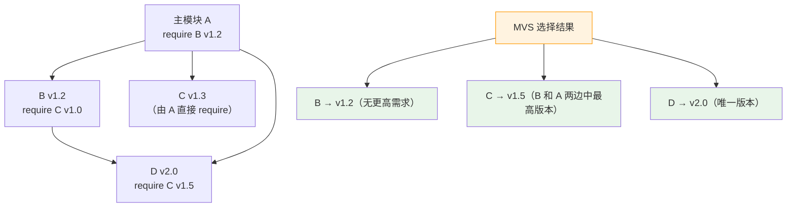
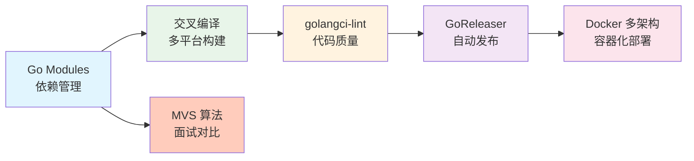

# go语言知识规划——工具链

> 本文档对应总览规划中"工具链（7%）"方向。工具链是 Go 项目开发的基础设施，贯穿从依赖管理、代码质量到发布部署的全流程。建议结合项目实践逐步积累，知识点权重：Go Modules（50%）> 代码质量工具（20%）> 交叉编译与 GoReleaser（15%）> CGO（10%）> PGO（5%）。

Go 语言工具链的核心特点是"内置优先"：编译、测试、格式化、依赖管理均由标准工具链完成，无需第三方构建工具（如 Maven/Gradle）。这与 Java 生态形成鲜明对比，也是 Go 开发体验简洁的重要原因。

**适用阅读条件**：

- 已完成至少一个 Go 项目开发，体验过 `go get / go mod tidy` 等基本操作
- 对 `go build / go run` 有基本认知
- 本文档不讲解基础语法，专注于工具链核心概念与面试重点

---

## Go Modules 详解

Go Modules 是 Go 官方依赖管理方案，自 Go 1.11 引入、1.14 起推荐用于生产、1.16 起成为默认行为。核心文件有两个：`go.mod`（声明依赖）和 `go.sum`（完整性校验）。

### go.mod 语义

`go.mod` 由若干指令（directive）组成，每行一条，支持 block 语法折叠同类型指令：

```go.mod
module github.com/user/myproject

go 1.22

require (
    github.com/gin-gonic/gin v1.10.0
    github.com/redis/go-redis/v9 v9.7.0
)

replace github.com/old/pkg => github.com/new/pkg v1.2.3

exclude github.com/broken/pkg v0.5.0

retract v1.0.0 // 发布后发现严重缺陷，撤回该版本
```

| 指令 | 作用 | 说明 |
|------|------|------|
| `module` | 声明模块路径 | 通常是仓库路径，如 `github.com/user/repo` |
| `go` | 声明 Go 版本 | 影响语言特性启用（如泛型 1.18+、循环变量语义 1.22+） |
| `require` | 声明依赖 | `module path version` 三元组，每行一条 |
| `replace` | 替换依赖来源 | 常用于本地开发调试，可将远程依赖替换为本地路径 |
| `exclude` | 排除特定版本 | 阻止特定版本被间接引入（较少使用） |
| `retract` | 撤回已发布版本 | Go 1.16+，标记某个版本不可用（发布错误版本时使用） |

**关键约束**：`replace` 和 `exclude` 指令仅在主模块（main module）生效，不传递到依赖方。这意味着下游模块的 `replace` 不会影响它的消费者——这是与 Java Maven `dependencyManagement` 和 `<exclusions>` 的重要差异。

### go.sum 完整性校验

`go.sum` 文件包含每个依赖版本的哈希记录，格式如下：

```
github.com/gin-gonic/gin v1.10.0 h1:1wqk3w=
github.com/gin-gonic/gin v1.10.0/go.mod h1:2YX/1A=
```

每一行记录一个模块版本内容的 SHA-256 哈希（`h1:` 前缀），以及其 `go.mod` 文件的独立哈希（`/go.mod` 后缀）。`go.sum` 不是 lock 文件，而是 append-only 的校验清单：新版本下载时追加记录，不会删除旧记录。

`go mod verify` 命令用于验证本地缓存中的模块内容是否与 `go.sum` 一致：

```bash
go mod verify
# 输出示例：all modules verified
```

### MVS 最小版本选择算法

MVS（Minimal Version Selection）是 Go Modules 的核心算法，与 Java Maven 的"最近优先仲裁"完全不同。

```text
MVS 核心规则：
给定依赖图，选择每个依赖的"最大需求版本"——即在传递依赖中明确 require 的最高版本。
但仅此而已：不自动升级到更高版本（除非显式 go get -u）。
```

**MVS 图解**：



**MVS vs Maven 依赖仲裁**：

| 对比维度 | Go MVS | Java Maven |
|---------|-------|-----------|
| 冲突时选择 | 选择传递依赖链中**最高 require 版本**（一致性保证） | 选择依赖树中**最近的版本**（最近优先） |
| 版本升级 | 仅当显式 `go get -u` 时才升级，从不自动引入新大版本 | 传递依赖可能静默升级 |
| 一致性 | 构建确定性：相同 `go.mod` 始终得到相同依赖图 | 依赖顺序和 `dependencyManagement` 影响仲裁结果 |
| 可复现性 | `go.sum` + GONOSUMCHECK 控制 | Maven 依赖锁定需 `maven-lockfile` 插件 |

**面试重点**：MVS 保证的是"构建一致性"而非"最小版本"——名称中的"Minimum"意思是算法只满足明确需要的最低版本需求，不做无畏升级。例如如果 B require C v1.0，A require C v1.5，MVS 选 v1.5 而非 v1.0，因为 v1.0 不满足 A 的需求。

### GOPROXY 配置

GOPROXY 环境变量控制模块下载的来源和回退策略：

```bash
# 默认值（Go 官方代理 -> 直接拉取 VCS）
go env -w GOPROXY=https://proxy.golang.org,direct

# 企业内网：私有代理 + 直接拉取（同时配置 GONOSUMDB 跳过校验）
go env -w GOPROXY=https://goproxy.company.com,direct
go env -w GONOSUMDB=git.company.com/*
go env -w GOPRIVATE=git.company.com/*

# 仅使用代理，禁用直接拉取
go env -w GOPROXY=https://goproxy.cn,direct

# 离线模式
go env -w GOPROXY=off
```

**GOPROXY 语法**：

| 分隔符 | 行为 |
|-------|------|
| `,`（逗号） | 仅当返回 404/410 时回退到下一项 |
| `\|`（竖线） | 任何错误都回退到下一项 |
| `direct` | 直接从 VCS 拉取（GitHub/GitLab 等），设置后在列表中终止 |
| `off` | 禁止网络请求，仅使用本地缓存 |

**配套环境变量**：

- `GONOPROXY`：跳过代理的模块路径模式（与 `GOPROXY=direct` 行为等价）
- `GONOSUMCHECK`：跳过校验和数据库（sum.golang.org）检查的模块路径模式
- `GONOSUMDB`：GONOSUMCHECK 的别名（旧名称）
- `GOPRIVATE`：同时设置 GONOPROXY 和 GONOSUMDB 的快捷方式
- `GOFLAGS=-mod=mod`：强制 `go build` 自动下载依赖并更新 go.mod

### go workspace 多模块工作区

Go 1.18 引入 workspace 机制，用于同时开发多个相互关联的本地模块。避免此前必须使用 `replace` 指令才能本地联调的繁琐操作。

**使用场景**：正在同时开发一个库 A 和依赖它的应用 B，希望在 A 的变更实时反映到 B 中，而无需每次修改 A 后发布新版本。

**`go.work` 文件结构**：

```go.work
go 1.22

use (
    ./myapp
    ./mylib
    ./shared
)

replace example.com/old => ./local-fork
```

**常用命令**：

```bash
# 初始化 workspace（将当前目录模块加入）
go work init

# 添加模块目录到 workspace
go work use ./mylib ./myapp

# 从 workspace 中移除模块
go work edit -dropuse ./mylib

# 查看 workspace 中的模块
go work edit -json
```

**重要行为**：

- workspace 中的模块自动成为"主模块"，其 `require` 相互可见，无需 `replace`
- `go.work` 不提交到 VCS（通常加入 `.gitignore`），是本地开发工具
- `go.work` 中的 `replace` 指令覆盖各个模块的 `go.mod replace`
- CI/CD 环境中不使用 `go.work`，依赖应通过版本发布解决

---

## 代码质量工具链

Go 生态中代码质量的保障手段以静态工具为主，配合约定优于配置的理念，门槛远低于 Java 生态的 SpotBugs + Checkstyle + PMD 组合。

### gofmt -- 格式化规范

`gofmt` 是 Go 官方格式化工具，其核心设计理念是"格式化无争议"（formatting wars are over）：

```bash
# 格式化并原地修改
gofmt -w main.go

# 仅检查差异（CI 中使用）
gofmt -d main.go
# diff -u 风格输出，便于 CI 检查

# 递归格式化整个项目
gofmt -w .
```

**关键结论**：Go 社区不存在"代码风格讨论"。一条代码缩进用 tab 还是空格、花括号如何换行——这些问题在 Go 中不存在。CI 中 `gofmt -d` 产生非空输出即视为格式化不通过。

**gofumpt**（可选）：更严格的 gofmt 超集，增加以下约束：

- 所有空代码块必须写为 `{}`，不得换行
- 结构体字段必须按逻辑分组排列
- 短变量声明 `:=` 尽量简短

```bash
go install mvdan.cc/gofumpt@latest
gofumpt -w .
```

### go vet -- 静态分析

`go vet` 是 Go 工具链内置的静态分析器，检查代码中的可疑构造：

```bash
# 检查当前包
go vet ./...

# 打印详细分析信息
go vet -v ./...
```

**go vet 检查类别（部分）**：

| 检查器 | 检测内容 | 示例问题 |
|--------|---------|---------|
| `copylocks` | 按值复制锁 | `sync.Mutex` 按值传递 |
| `printf` | Printf 格式串不匹配 | `fmt.Printf("%d", "str")` |
| `unreachable` | 不可达代码 | `return` 后的语句 |
| `lostcancel` | context.CancelFunc 未调用 | `ctx, cancel := context.WithCancel()` 后未 defer cancel |
| `shadow` | 变量遮蔽 | 内层声明与外层同名变量 |
| `stringintconv` | string 与 int 的不当转换 | `string(42)` 不会得到 "42" |

### golangci-lint -- Linter 聚合

`golangci-lint` 是 Go 社区最流行的 linter 聚合运行器，并行执行数十个 linter 并聚合结果。v2 版本（2025+）引入了以下关键变化：

| 方面 | v1 | v2 |
|------|-----|-----|
| 默认 linter 集 | `standard`（约 30 个） | `all`（所有稳定 linter） |
| 格式化工具 | `linters.enable` 中配置 | 单独的 `formatters` 节 |
| 配置格式 | YAML 无 schema 验证 | YAML 更严格的结构校验 |
| 性能 | 基础并行 | 增强缓存 + partial mode |

**推荐配置文件 `.golangci.yml`**：

```yaml
# golangci-lint v2 配置示例
version: "2"
run:
  go: "1.22"
  timeout: 3m

formatters:
  enable:
    - gofmt
    - goimports

linters:
  default: all
  enable:
    - revive
    - staticcheck
    - gosec
    - misspell
    - unconvert
  disable:
    - cyclop
    - dupl
  settings:
    staticcheck:
      checks:
        - all
        - "-SA1000"  # 排除特定检查（格式串检查，已有 printf 检查器覆盖）
    revive:
      rules:
        - name: exported
          severity: warning

issues:
  exclude-rules:
    - path: _test\.go
      linters:
        - gosec
        - errcheck
```

**关键 linter 说明**：

| Linter | 类型 | 作用 |
|--------|------|------|
| `staticcheck` | 标准 | 官方 go-tools 套件，覆盖面最广（SA/S1/ST/... 系列检查），推荐必开 |
| `revive` | 风格 | go lint 的继任者，更快速的编码规范检查，支持自定义规则 |
| `gosec` | 安全 | 检查 SQL 注入、XSS、硬编码凭证、不安全加密算法等 |
| `errcheck` | 标准 | 检查未处理的 error 返回值（Go 哲学中 error 必须处理） |
| `misspell` | 拼写 | 检查注释和字符串中的常见拼写错误 |
| `unconvert` | 类型 | 检测不必要的类型转换 |
| `usetesting` | 测试 | 检查测试函数中是否使用 `t *testing.T` 的正确用法 |

**CI 集成**：

```bash
# 在 CI 中运行（仅输出新增问题）
golangci-lint run --new-from-rev HEAD~1

# 全量检查
golangci-lint run ./...
```

### 其他质量工具速览

| 工具 | 命令安装 | 用途 |
|------|---------|------|
| `staticcheck` | `go install honnef.co/go/tools/cmd/staticcheck@latest` | 官方 go-tools 套件，可作为独立工具使用 |
| `revive` | `go install github.com/mgechev/revive@latest` | 高性能 go lint 替代品 |
| `nilaway` | `go install go.uber.org/nilaway/cmd/nilaway@latest` | Uber 出品，检测 nil 解引用（1.18+ 泛型支持） |
| `gosec` | `go install github.com/securego/gosec/v2/cmd/gosec@latest` | Go 安全扫描器 |

---

## 交叉编译与发布

### GOOS/GOARCH 矩阵

Go 交叉编译是语言级别的内置能力，无需交叉工具链（只要代码中不使用 CGO）。通过 `GOOS`（目标操作系统）和 `GOARCH`（目标架构）两个环境变量实现：

```bash
# Linux AMD64（默认）
GOOS=linux GOARCH=amd64 go build -o app-linux-amd64

# macOS ARM64（Apple Silicon）
GOOS=darwin GOARCH=arm64 go build -o app-darwin-arm64

# Windows AMD64
GOOS=windows GOARCH=amd64 go build -o app-windows-amd64.exe

# Linux ARM（树莓派）
GOOS=linux GOARCH=arm GOARM=7 go build -o app-linux-armv7

# 查看当前环境
go env GOOS GOARCH
```

**常见 GOOS/GOARCH 组合**（Go 1.26 完整支持列表参见 `src/internal/platform/zosarch.go`）：

| GOOS | GOARCH | 目标平台 |
|------|--------|---------|
| `linux` | `amd64` | Linux x86_64 服务器 |
| `linux` | `arm64` | ARM 服务器（AWS Graviton、树莓派 4/5） |
| `linux` | `arm` | ARM 嵌入式设备（需指定 GOARM） |
| `darwin` | `amd64` | Intel Mac |
| `darwin` | `arm64` | Apple Silicon Mac |
| `windows` | `amd64` | Windows x86_64 |
| `windows` | `arm64` | Windows ARM |
| `freebsd` | `amd64` | FreeBSD 服务器 |

### GoReleaser 自动发布

GoReleaser 是目前最流行的 Go 发布自动化工具，支持多平台构建、Docker 镜像发布、Homebrew tap、SBOM 生成等。

**`.goreleaser.yaml` 配置示例**：

```yaml
# .goreleaser.yaml
version: 2
project_name: myapp

before:
  hooks:
    - go mod tidy

builds:
  - env:
      - CGO_ENABLED=0
    goos:
      - linux
      - darwin
      - windows
    goarch:
      - amd64
      - arm64
    flags:
      - -trimpath
    ldflags:
      - -s -w -X main.version={{.Version}} -X main.commit={{.Commit}}

archives:
  - formats: tar.gz
    format_overrides:
      - goos: windows
        formats: zip

checksum:
  name_template: "checksums.txt"

snapshot:
  name_template: "{{ incpatch .Version }}-next"

release:
  github:
    owner: user
    name: myapp

# Docker 多架构镜像
dockers:
  - image_templates:
      - "user/myapp:{{ .Version }}-amd64"
    use: buildx
    goarch: amd64
    dockerfile: Dockerfile
    build_flag_templates:
      - "--platform=linux/amd64"
  - image_templates:
      - "user/myapp:{{ .Version }}-arm64"
    use: buildx
    goarch: arm64
    dockerfile: Dockerfile
    build_flag_templates:
      - "--platform=linux/arm64/v8"

docker_manifests:
  - name_template: "user/myapp:{{ .Version }}"
    image_templates:
      - "user/myapp:{{ .Version }}-amd64"
      - "user/myapp:{{ .Version }}-arm64"
  - name_template: "user/myapp:latest"
    image_templates:
      - "user/myapp:{{ .Version }}-amd64"
      - "user/myapp:{{ .Version }}-arm64"
```

**GoReleaser 工作流**：

```bash
# 在带有 git tag 的提交上运行
git tag v1.2.3
git push origin v1.2.3

# 本地模拟运行（不实际发布）
goreleaser release --snapshot --clean

# 实际发布
goreleaser release --clean
```

### 多架构镜像构建（Docker Buildx）

不使用 GoReleaser 时，可直接使用 Docker Buildx 构建多架构镜像：

```dockerfile
# Dockerfile（多阶段构建）
FROM golang:1.22-alpine AS builder
WORKDIR /app
COPY go.mod go.sum ./
RUN go mod download
COPY . .
RUN CGO_ENABLED=0 go build -trimpath -o server .

FROM alpine:3.20
RUN apk --no-cache add ca-certificates tzdata
COPY --from=builder /app/server /server
EXPOSE 8080
ENTRYPOINT ["/server"]
```

```bash
# 创建并使用 buildx 构建器
docker buildx create --name mybuilder --use
docker buildx build \
  --platform linux/amd64,linux/arm64 \
  -t user/myapp:latest \
  --push .
```

---

## CGO 简介

CGO 是 Go 调用 C 代码的桥梁，语法为 `import "C"` + 前置注释声明 C 代码。

### 基本互操作

```go
package main

/*
#include <stdlib.h>
#include <string.h>

// C 函数示例：计算两个 int 的和
int add(int a, int b) {
    return a + b;
}

// C 函数示例：复制字符串
char* duplicate(const char* s) {
    return strdup(s);
}
*/
import "C"
import (
    "fmt"
    "unsafe"
)

func main() {
    // 调用 C 函数：int 类型自动转换
    sum := C.add(3, 4)
    fmt.Println("3 + 4 =", sum) // 输出: 3 + 4 = 7

    // 调用 C 函数：字符串传递需转换
    cs := C.CString("hello cgo")
    defer C.free(unsafe.Pointer(cs))

    dup := C.duplicate(cs)
    defer C.free(unsafe.Pointer(dup))

    // C 字符串转回 Go 字符串
    result := C.GoString(dup)
    fmt.Println("duplicated:", result)
}
```

**CGO 类型转换速查**：

| Go 类型 | C 类型 | 转换函数 |
|---------|--------|---------|
| `string` | `char*` | `C.CString(s)`（需手动 `C.free`） |
| `*C.char` | `char*` | `C.GoString(cs)` |
| `*C.char`（限定长度） | `char*` | `C.GoStringN(cs, n)` |
| `[]byte` | `void*` | `C.CBytes(b)`（需手动 `C.free`） |
| `unsafe.Pointer` | `void*` | 直接转换 |

### 构建约束与条件编译

CGO 启用后，Go 编译会使用外部链接器（gcc/clang），构建速度变慢且无法交叉编译：

```bash
# 显式禁用 CGO（构建纯 Go 静态二进制）
CGO_ENABLED=0 go build

# 启用 CGO（默认）
CGO_ENABLED=1 go build
```

使用 **构建标签（build tags）** 控制 CGO 代码的条件编译：

```go
//go:build cgo

package native

// 此文件仅当 CGO_ENABLED=1 时编译
```

```go
//go:build !cgo

package native

// fallback 纯 Go 实现
```

### 性能开销分析

CGO 调用存在显著性能开销，主要体现在两个层面：

| 开销类型 | 原因 | 量化参考 |
|---------|------|---------|
| **goroutine 切换** | C 代码执行时，当前 goroutine 会绑定到 OS 线程，无法被 Go 调度器抢占 | 每次 CGO 边界调用约 40-80ns |
| **内存拷贝** | Go 指针传递到 C 侧时需满足 Go 内存安全约束（不允许 C 侧持有 Go 指针） | 大内存块传递时影响显著 |

**CGO 使用建议**：

- **高频调用路径避免 CGO**：热点循环中调用 C 函数会大幅降低性能
- **批处理接口**：将多次 CGO 调用合并为一次（一次性传入大量数据而非多次小数据传递）
- **纯 Go 替代方案优先**：官方的 `crypt`、`compress`、`net` 等包已多用 Go 原生实现替代 CGO
- **静态链接**：使用 `-ldflags="-linkmode=external -extldflags=-static"` 实现静态链接

---

## PGO Profile-Guided Optimization

PGO 是 Go 1.21 正式引入的编译期优化技术，通过分析生产环境的运行 profile（CPU 采样文件）指导编译器做出更好的内联、寄存器分配等优化决策，典型性能提升 2%-8%。

### 工作流程


### 启用方式

Go 1.21+ 中 PGO 默认关闭，需通过 `-pgo` 标志启用或通过 `default.pgo` 文件自动启用 (Go 1.23+ 自动检测)：

```bash
# Go 1.21-1.22：显式指定 profile 路径
go build -pgo=default.pgo -o server ./cmd/server

# Go 1.23+：自动检测项目根目录的 default.pgo
go build -o server ./cmd/server

# 禁用 PGO
go build -pgo=off -o server ./cmd/server
```

**生成 Profile 文件**：

```bash
# 使用 testing 基准测试生成 profile
go test -bench=. -cpuprofile=default.pgo ./...

# 生产环境收集（持续 30 秒以上以获得代表性样本）
curl -o default.pgo http://localhost:8080/debug/pprof/profile?seconds=30
```

### 部署最佳实践

- **版本管理**：将 `default.pgo` 提交到代码仓库，确保 CI 可复现构建
- **定期更新**：每次发版前重新收集 profile（代码变更后旧 profile 的优化效果下降）
- **A/B 验证**：在生产环境使用流量镜像或灰度部署验证 PGO 效果
- **增量优化**：profile 文件不大（通常 100KB-1MB），不影响构建时间

---

## 面试高频追问链

以下追问链覆盖工具链方向的核心面试话题，按从浅到深排列：

```text
追问链：Go Modules
├─ Q1：go.mod 和 go.sum 的作用分别是什么？
│   └─ 分层：go.mod 声明依赖 → go.sum 校验完整性
├─ Q2：replace 指令在什么场景下使用？它对下游模块有影响吗？
│   └─ 关键点：仅在 main module 生效，不传递
├─ Q3：MVS 算法的核心逻辑是什么？和 Maven 的依赖仲裁有什么区别？
│   └─ 对比点：选择最高 require 版本 vs 最近优先
├─ Q4：GOPROXY=direct 和 GOPROXY=off 的区别？
│   └─ direct = 从 VCS 拉, off = 仅本地缓存
└─ Q5：go workspace 解决什么问题？go.work 应该提交到仓库吗？
    └─ 关键点：本地多模块开发 → 不应提交

追问链：编译构建
├─ Q1：Go 交叉编译如何实现？为什么 CGO_ENABLED 会影响交叉编译？
│   └─ 关键点：GOOS/GOARCH + CGO 需外部链接器
├─ Q2：-trimpath 和 -ldflags="-s -w" 分别做什么？
│   └─ trimpath 移除构建路径, -s-w 移除符号表和 DWARF
├─ Q3：GoReleaser 在 CI 中如何工作？git tag 的作用是什么？
│   └─ 关键点：git tag 触发 → GoReleaser 构建发布
├─ Q4：Go 的 Docker 镜像为什么推荐多阶段构建？
│   └─ 原因：builder 镜像包含编译工具 → alpine/scratch 仅含二进制
└─ Q5：PGO 如何提升性能？生产环境收集 profile 时需要注意什么？
    └─ 注意：30s+ 采样的代表性、定期更新 profile
```

---

## 跨域知识关联

工具链方向知识点与其他方向的关联如下：

| 关联方向 | 关联知识点 | 关联说明 |
|---------|-----------|---------|
| 核心基础 | `go build` / `go run` | 编译过程涉及 GOPATH（历史）和 module-aware mode 的区分 |
| 核心基础 | `go vet` 检查 `copylocks` | 涉及 `sync.Mutex` 与 `sync.WaitGroup` 的值传递问题 |
| 测试调试 | `go test -bench` | PGO profile 可通过 bench 测试生成，profiling 本身属于测试调试 |
| 云原生 | 多阶段 Docker 构建 | Go 单二进制 + scratch 镜像是最佳实践 |
| 微服务 | gRPC 代码生成 | `protoc` 生成 Go 代码依赖工具链的 `protoc-gen-go-grpc` |
| 高级话题 | 逃逸分析（`-gcflags=-m`） | 编译器标志与优化分析属于工具链范畴 |
| 总览 | MVS vs Maven 仲裁 | Java 转型面试的核心对比考点 |

**核心关联链路**（Go Modules -> 交叉编译 -> 代码质量）：



这条链从依赖管理开始，经过编译构建到质量检查，最终到达发布部署，构成了 Go 项目的完整交付路径。面试中可从一段 `go mod tidy` 经历延伸到交叉编译，再到 CI/CD 中如何保证代码质量，体现工具链的系统性理解。

---

## 复习建议

1. **Go Modules 是绝对重点**（权重 50%），值得反复理解 MVS 算法及其与 Maven 的差异——这是 Java 转型面试的高频对比点
2. **golangci-lint 配置**建议在实际项目中动手配置一次，CI 集成后再理解各 lint 规则更容易
3. **交叉编译**理解 GOOS/GOARCH 矩阵即可，GoReleaser 和 Docker 多架构可按需学习
4. **CGO 了解即可**：知道基本用法和性能代价，面试中能说明 CGO 的适用边界（非高频调用 + 必须使用 C 库）
5. **PGO** 是 Go 1.21+ 新特性，面试中提及能展示对 Go 生态最新发展的关注
