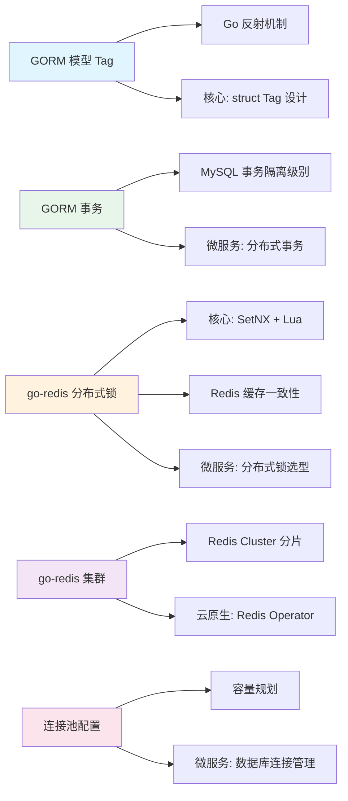

# go语言知识规划——数据库

> 本文档覆盖面试权重 10% 的数据库方向知识，按"ORM 框架 → 缓存中间件 → 连接池管理 → 其他框架解"的逻辑递进。与 Go 核心基础、Web 框架、微服务等方向的知识关联见[总览文档](/go%E8%AF%AD%E8%A8%80%E7%9F%A5%E8%AF%86%E8%A7%84%E5%88%92%E2%80%94%E2%80%94%E6%80%BB%E8%A7%88/)的跨域链路。

---

## 1. GORM 详解

GORM 是 Go 生态最主流的 ORM 框架（Star 37k+），设计理念融合了 JPA 的约定优于配置和 MyBatis 的灵活 SQL 能力。核心特征：零配置 CRUD、链式调用、关联自动映射、Hook 生命周期、AutoMigrate 自动建表。

---

#### 模型定义与 Tag

GORM 通过 struct Tag（`` `gorm:"..."` ``）定义字段映射规则。零配置时按约定自动映射（`ID` → 主键，`UserID` → 外键，`CreatedAt`/`UpdatedAt` → 自动填充，蛇形命名 → 表名）。

```go
type User struct {
    ID        uint           `gorm:"primaryKey;autoIncrement"` // 主键自增
    Name      string         `gorm:"type:varchar(100);not null;index:idx_name"`
    Email     string         `gorm:"uniqueIndex;size:255"`
    Age       int            `gorm:"default:18"`
    Salary    decimal.Decimal `gorm:"type:decimal(10,2)"`       // 自定义类型
    Status    int            `gorm:"column:user_status;default:1"` // 自定义列名
    Birthday  *time.Time     `gorm:"type:date"`                 // 指针类型可存 null
    CreatedAt time.Time      `gorm:"autoCreateTime"`            // 自动填充创建时间
    UpdatedAt time.Time      `gorm:"autoUpdateTime"`            // 自动填充更新时间
    DeletedAt gorm.DeletedAt `gorm:"index"`                     // 软删除
}

// 自定义表名（默认蛇形复数：users）
func (User) TableName() string {
    return "t_user"
}

// 组合索引
type Order struct {
    ID     uint `gorm:"primaryKey"`
    UserID uint `gorm:"index:idx_user_status"`
    Status int  `gorm:"index:idx_user_status"`
}
```

**常用 Tag 一览**：

| Tag | 示例值 | 说明 |
|-----|--------|------|
| `primaryKey` | `primaryKey` | 主键 |
| `autoIncrement` | `autoIncrement` | 自增 |
| `column` | `column:user_name` | 指定列名，默认蛇形 |
| `type` | `type:varchar(100)` | 列类型 |
| `size` | `size:255` | 列大小（varchar 长度）|
| `default` | `default:0` | 默认值 |
| `not null` | `not null` | 非空 |
| `uniqueIndex` | `uniqueIndex:idx_email` | 唯一索引 |
| `index` | `index:idx_name` | 普通索引 |
| `-` | `-` | 忽略该字段（不映射）|
| `embedded` | `embedded;embeddedPrefix:addr_` | 嵌入结构体，加前缀 |
| `serializer` | `serializer:json` | JSON 序列化（自动序列化/反序列化）|
| `comment` | `comment:用户邮箱` | 列注释 |

> **常见陷阱**：时间类型使用 `*time.Time`（可空）而非 `time.Time`（零值无法区分"未设置"和"2026-01-01 00:00:00"）。字段零值（0、""、false）在 GORM 写操作时会被忽略，可使用 `db.Model(&user).Update("age", 0)` 或 `map[string]interface{}{"age": 0}` 显式写入零值。

> **关联知识点**：GORM Tag → Go struct 反射机制 / Tag 解析 → 结构体 Tag 设计模式 / 约定优于配置 → Spring Data JPA 的命名策略 / 软删除 → gorm.DeletedAt 嵌入

---

#### CRUD 操作

**Create**：

```go
// 单条创建
user := User{Name: "Alice", Email: "alice@example.com", Age: 25}
result := db.Create(&user)        // result.Error — 错误；result.RowsAffected — 影响行数
fmt.Println(user.ID)              // 创建后回填主键

// 批量创建
users := []User{{Name: "Bob"}, {Name: "Carol"}}
db.Create(&users)

// 指定字段创建
db.Select("Name", "Email").Create(&user)  // 只写入指定字段
db.Omit("Age", "Status").Create(&user)    // 跳过指定字段

// 批量插入（分批，每批 100 条）
db.CreateInBatches(users, 100)
```

**Query（First / Find / Take）**：

```go
// First：按主键升序取第一条，未找到 → ErrRecordNotFound
var user User
err := db.First(&user, 1).Error                   // WHERE id = 1
err = db.First(&user, "email = ?", "alice@example.com").Error
err = db.Where("age > ? AND status = ?", 18, 1).First(&user).Error

// Take：不排序取第一条
db.Take(&user)                                     // SELECT * FROM users LIMIT 1

// Find：查询全部
var users []User
db.Find(&users)                                    // SELECT * FROM users
db.Where("age IN ?", []int{18, 20, 25}).Find(&users)
db.Where(&User{Name: "Alice", Age: 25}).Find(&users) // struct 查询（零值字段被忽略）
db.Where(map[string]interface{}{"name": "Alice", "age": 25}).Find(&users) // map 查询（不会忽略零值）

// 条件组合
db.Where("age > ?", 18).Or("name = ?", "Admin").Not("status = ?", 0).Find(&users)

// Order / Limit / Offset
db.Order("age DESC, id ASC").Limit(10).Offset(20).Find(&users)

// Select 指定字段
db.Select("id", "name", "age").Find(&users)
db.Select("AVG(age) as avg_age").Find(&users)       // 聚合

// Count
var count int64
db.Model(&User{}).Where("age > ?", 18).Count(&count)
```

**First vs Take vs Last 差异**：

| 方法 | 排序 | 未找到时的行为 |
|------|------|---------------|
| `First` | 主键 ASC | 返回 `ErrRecordNotFound` |
| `Take` | 不排序 | 返回 `ErrRecordNotFound` |
| `Last` | 主键 DESC | 返回 `ErrRecordNotFound` |
| `Find` | 不排序 | 无数据时返回空切片，不报错 |

**Update**：

```go
// 更新单列
db.Model(&user).Update("name", "Alice New")        // 更新非零值
db.Model(&user).Update("age", 0)                    // ❌ 零值被忽略，不会更新
db.Model(&user).Update("age", 0)                    // ✅ 用 map 或 Select 明确指定

// 更新多列（struct：零值被忽略；map：不会忽略零值）
db.Model(&user).Updates(User{Name: "Alice", Age: 0})    // ❌ Age=0 被忽略
db.Model(&user).Updates(map[string]interface{}{"name": "Alice", "age": 0}) // ✅

// 条件更新
db.Model(&User{}).Where("age > ?", 30).Update("status", 2)
db.Model(&User{}).Where("status = ?", 1).Updates(map[string]interface{}{
    "status": 2,
    "remark": "已升级",
})

// 更新选定字段
db.Model(&user).Select("name").Updates(User{Name: "Alice", Age: 0}) // 只更新 name

// 表达式更新（直接传递 SQL 表达式）
db.Model(&user).Update("age", gorm.Expr("age + ?", 1))
```

**Delete（软删除）**：

```go
// 软删除（需要模型包含 DeletedAt 字段）
db.Delete(&user)      // UPDATE users SET deleted_at=NOW() WHERE id=1 AND deleted_at IS NULL

// 物理删除
db.Unscoped().Delete(&user)   // DELETE FROM users WHERE id=1

// 条件删除
db.Where("status = ?", 0).Delete(&User{})

// 查找包含软删除的记录
db.Unscoped().Where("age > ?", 18).Find(&users)

// 查找被软删除的记录
db.Where("deleted_at IS NOT NULL").Find(&users)
```

> **常见陷阱**：
> - `Updates` 使用 struct 时会忽略零值字段，必须用 `map[string]interface{}` 显式写入零值
> - `db.Delete(&user)` 如果 user 没有 `DeletedAt` 字段，会执行物理删除
> - `Where(&User{...})` struct 查询会忽略零值字段，使用 map 或字符串条件避免此问题

> **关联知识点**：零值忽略 → Go 零值语义 / First 的 ErrRecordNotFound → Go error 处理风格 / 软删除 → gorm.DeletedAt 实现原理 / CreateInBatches → 批量插入性能优化 / 链式调用 → 构建器模式设计

---

#### 关联映射

**Belongs To（属于）**：Order 属于 User，Order 表有 `user_id` 外键。

```go
type User struct {
    ID   uint
    Name string
}

type Order struct {
    ID     uint
    UserID uint          // 外键（约定：Owner 类型名 + 主键名）
    User   User          // 关联模型
    // 自定义外键：UserID uint `gorm:"foreignKey:Refer"`
    // 自定义引用：User   User   `gorm:"foreignKey:UserID;references:ID"`
}

// CRUD
db.Preload("User").Find(&orders)          // 预加载
db.Model(&order).Association("User").Find(&order.User)
db.Model(&order).Association("User").Append(&user) // 设置关联
```

**Has One（有一个）**：User 有一个 Profile，Profile 表有 `user_id` 外键。

```go
type User struct {
    ID      uint
    Profile Profile
}

type Profile struct {
    ID     uint
    UserID uint   // 外键
    Bio    string
}

db.Preload("Profile").Find(&users)
```

**Has Many（有多条）**：User 有多条 Order。

```go
type User struct {
    ID     uint
    Orders []Order   // Has Many：User 有多条 Order
}

type Order struct {
    ID     uint
    UserID uint     // 外键在 Order 表
}

db.Preload("Orders").Find(&users)
db.Preload("Orders", "status = ?", "completed").Find(&users) // 条件预加载

// 关联操作
db.Model(&user).Association("Orders").Append(&Order{...})
db.Model(&user).Association("Orders").Delete(&order)
db.Model(&user).Association("Orders").Replace(orders)  // 替换全部关联
db.Model(&user).Association("Orders").Clear()          // 清空关联
```

**Many To Many（多对多）**：User 和 Language 通过中间表关联。

```go
type User struct {
    ID        uint
    Languages []Language `gorm:"many2many:user_languages;"` // 中间表名
}

type Language struct {
    ID      uint
    Name    string
    Users   []User `gorm:"many2many:user_languages;"`
}

// 自定义中间表（带额外字段）
type UserLanguage struct {
    UserID     uint `gorm:"primaryKey"`
    LanguageID uint `gorm:"primaryKey"`
    Level      string // 额外字段
    CreatedAt  time.Time
}

// 注册中间表
db.SetupJoinTable(&User{}, "Languages", &UserLanguage{})
db.SetupJoinTable(&Language{}, "Users", &UserLanguage{})

// 预加载
db.Preload("Languages").Find(&users)
```

**关联模式对比**：

| 关联 | 外键位置 | 加载方式 | 典型场景 |
|------|---------|---------|---------|
| Belongs To | 当前表 | `Preload("Owner")` | Order → User |
| Has One | 关联表 | `Preload("Profile")` | User → Profile |
| Has Many | 关联表 | `Preload("Orders")` | User → Orders 列表 |
| Many To Many | 中间表 | `Preload("Languages")` | User ↔ Tag / Role |

> **常见陷阱**：嵌套关联可能导致 N+1 问题；`Association("Orders").Find()` 在未预加载时会触发额外查询。关联删除时注意级联行为，GORM 默认不会自动级联删除。

> **关联知识点**：关联映射 → 外键约束设计 / N+1 → 预加载和 Joins 优化 / 多对多中间表 → JOIN 查询优化 / 关联操作 → 事务保证一致性

---

#### 预加载（Preload / Joins）

**Preload**（多表独立查询，适合关联表数据量大时）：

```go
// 基本预加载
db.Preload("Orders").Find(&users)

// 嵌套预加载
db.Preload("Orders.Items").Preload("Profile").Find(&users)

// 条件预加载
db.Preload("Orders", "status = ? AND amount > ?", "paid", 100).Find(&users)

// 预加载排序和限定
db.Preload("Orders", func(db *gorm.DB) *gorm.DB {
    return db.Order("created_at DESC").Limit(5)
}).Find(&users)

// 预加载自定义 Select
db.Preload("Orders", func(db *gorm.DB) *gorm.DB {
    return db.Select("id", "user_id", "total")
}).Find(&users)
```

**Joins**（单条 SQL JOIN 查询，适合关联表数据量小且需要 WHERE 条件跨表）：

```go
// Joins 预加载（单条 SQL）
db.Joins("Profile").Find(&users)        // INNER JOIN profiles ON users.id = profiles.user_id
db.Joins("Profile", db.Where(&Profile{Active: true})).Find(&users)

// 自定义 Joins（参数绑定）
db.Joins("JOIN orders o ON o.user_id = users.id AND o.status = ?", "paid").
   Find(&users)

// Preload + Joins 混用
db.Joins("Profile").Preload("Orders").Find(&users)
```

**Preload vs Joins 选择决策**：

| 维度 | Preload | Joins |
|------|---------|-------|
| SQL 数量 | N+1 SQL（主表 1 + 关联表 N） | 1 条 SQL |
| 数据量 | 适合关联表数据量大 | 适合关联表数据量小 |
| WHERE 跨表 | Preload 条件只作用于关联表 | 可在 JOIN ON 中跨表过滤 |
| 分页 | 预加载不支持分页，但主表可分页 | 单条 SQL 可完整分页 |
| 性能特征 | 多 RTT，单次传输小 | 单 RTT，但可能传输大量重复数据 |

> **常见陷阱**：`Joins("Profile")` 要求 Profile 中必须有外键指向 User（如 `UserID`）。Joins 预加载不会自动填充 Profile 字段为空的结构体（没有 Profile 的行不会返回），而 Preload 会。

> **关联知识点**：Preload → 懒加载 vs 预加载策略 / Joins → SQL JOIN 类型 / N+1 问题 → 数据库查询优化 / 预加载函数 → 函数式 API 设计

---

#### 事务

GORM 提供三种事务使用方式：闭包自动事务、手动事务、嵌套事务。

**闭包事务**（推荐）：

```go
// 自动提交 / 回滚：闭包返回 error 时自动回滚
err := db.Transaction(func(tx *gorm.DB) error {
    // 多个操作在同一个事务中
    if err := tx.Create(&user).Error; err != nil {
        return err  // 回滚
    }
    if err := tx.Create(&order).Error; err != nil {
        return err  // 回滚
    }
    return nil  // 提交
})
```

**手动事务**（更灵活的控制）：

```go
tx := db.Begin()

user := User{Name: "Alice"}
if err := tx.Create(&user).Error; err != nil {
    tx.Rollback()
    return err
}

order := Order{UserID: user.ID, Amount: 100}
if err := tx.Create(&order).Error; err != nil {
    tx.Rollback()
    return err
}

tx.Commit()
```

**嵌套事务（SavePoint）**：

```go
err := db.Transaction(func(tx *gorm.DB) error {
    tx.Create(&user1)

    // 嵌套事务——自动创建 SavePoint
    err := tx.Transaction(func(tx2 *gorm.DB) error {
        tx2.Create(&user2)
        return errors.New("rollback inner")  // 回滚到 SavePoint，不影响外层
    })

    tx.Create(&user3)  // 仍然执行
    return nil         // 外层提交
})
```

**事务隔离级别**：

```go
db.Transaction(func(tx *gorm.DB) error {
    return tx.Create(&user).Error
}, &sql.TxOptions{Isolation: sql.LevelSerializable})
```

| 隔离级别 | 脏读 | 不可重复读 | 幻读 |
|---------|:----:|:--------:|:----:|
| Read Uncommitted | 可能 | 可能 | 可能 |
| Read Committed（默认） | 避免 | 可能 | 可能 |
| Repeatable Read（MySQL InnoDB 默认） | 避免 | 避免 | 可能（间隙锁避免）|
| Serializable | 避免 | 避免 | 避免 |

> **常见陷阱**：
> - 嵌套事务内层 `return err` 只会回滚到 SavePoint，不会中止外层事务
> - 闭包事务如果 `panic`，GORM 默认不会自动回滚（需设置 `db.Session(&gorm.Session{SkipDefaultTransaction: false})`）
> - 高频写入场景不要用默认的单条自动事务模式，批量操作加事务性能提升明显

> **关联知识点**：事务 → ACID 特性 / SavePoint → 数据库保存点机制 / 隔离级别 → MySQL 事务 / 闭包事务 → 函数式错误处理 / 事务中并发 → 乐观锁/悲观锁

---

#### Hook 生命周期

GORM 提供模型级别的生命周期回调，在 CRUD 操作的前后触发。

```go
type User struct {
    ID        uint
    Name      string
    Password  string `gorm:"->:false"` // 只写不读
    CreatedAt time.Time
}

// BeforeCreate——创建前自动触发
func (u *User) BeforeCreate(tx *gorm.DB) error {
    if len(u.Password) < 6 {
        return fmt.Errorf("password too short, minimum 6 chars")
    }
    hashed, _ := bcrypt.GenerateFromPassword([]byte(u.Password), bcrypt.DefaultCost)
    u.Password = string(hashed)
    return nil
}

// AfterCreate——创建后自动触发
func (u *User) AfterCreate(tx *gorm.DB) error {
    log.Printf("User %d created", u.ID)
    return nil
}

// BeforeUpdate——更新前触发
func (u *User) BeforeUpdate(tx *gorm.DB) error {
    if tx.Statement.Changed("Name") {         // 检测 Name 字段是否变更
        log.Printf("Name changed from %v to %v", tx.Statement.Old("Name"), u.Name)
    }
    return nil
}

// AfterFind——查询后触发（每次查询都执行）
func (u *User) AfterFind(tx *gorm.DB) error {
    // 脱敏：Password 不可读
    u.Password = "***"
    return nil
}

// BeforeDelete——删除前触发
func (u *User) BeforeDelete(tx *gorm.DB) error {
    if u.Name == "admin" {
        return errors.New("cannot delete admin user")
    }
    return nil
}

// AfterSave——创建或更新后都触发（BeforeSave 同理）
func (u *User) AfterSave(tx *gorm.DB) error {
    // 清空缓存、通知等
    return nil
}
```

**Hook 触发条件**：

| Hook | Create | Update | Save | Delete | Find |
|------|:------:|:------:|:----:|:------:|:----:|
| `BeforeSave` | 是 | 是 | — | — | — |
| `AfterSave` | 是 | 是 | — | — | — |
| `BeforeCreate` | 是 | — | — | — | — |
| `AfterCreate` | 是 | — | — | — | — |
| `BeforeUpdate` | — | 是 | — | — | — |
| `AfterUpdate` | — | 是 | — | — | — |
| `BeforeDelete` | — | — | — | 是 | — |
| `AfterDelete` | — | — | — | 是 | — |
| `AfterFind` | — | — | — | — | 是 |

> **常见陷阱**：Hook 中不要修改 `tx.Statement` 的结构（如改变 SQL），否则可能导致不可预期的行为。`AfterFind` 不会在 `Raw` SQL 或 `Scan` 到已有 struct 时触发。Hook 返回 error 会中止当前操作并回滚事务。

> **关联知识点**：Hook → AOP 面向切面思想 / BeforeCreate 密码加密 → 字段安全处理 / Changed / Old 方法 → 变更审计 / AfterFind 脱敏 → 视图层关注点分离

---

#### 迁移（AutoMigrate）

```go
// 自动建表/加列——不会删除或修改已有列
err := db.AutoMigrate(
    &User{},
    &Order{},
    &Product{},
)

// 配置迁移选项
db.Set("gorm:table_options", "ENGINE=InnoDB DEFAULT CHARSET=utf8mb4").
   AutoMigrate(&User{})
```

**AutoMigrate 行为规则**：

| 变更类型 | AutoMigrate 行为 |
|---------|----------------|
| 新增表 | 创建 |
| 新增字段 | ALTER TABLE ADD COLUMN |
| 修改字段类型 | 不操作（不会 ALTER）|
| 删除字段 | 不操作（不会 DROP）|
| 新增索引 | CREATE INDEX |
| 删除索引 | 不操作 |
| 约束变更 | 不操作 |

> 如果需要更完整的迁移控制，可使用 GORM 的 Migrator 接口（`db.Migrator()`）逐一操作表/列/索引：

```go
// Migrator 接口——细粒度控制
migrator := db.Migrator()

migrator.CreateTable(&User{})                       // 创建表
migrator.HasTable(&User{})                          // 表是否存在
migrator.DropTable(&User{})                         // 删除表
migrator.AddColumn(&User{}, "Age")                  // 加列
migrator.DropColumn(&User{}, "TempField")           // 删列
migrator.RenameColumn(&User{}, "old_name", "new_name") // 重命名
migrator.CreateIndex(&User{}, "Name")               // 建索引
migrator.HasIndex(&User{}, "Name")                  // 索引是否存在
```

> **常见陷阱**：AutoMigrate 不会处理字段类型变更、字段删除、外键约束变更。生产环境使用 `gorm.AutoMigrate` 时结合版本迁移工具（如 golang-migrate）做正向迁移。

> **关联知识点**：AutoMigrate → 数据库版本管理 / Migrator → 策略模式 / golang-migrate → 正向/逆向迁移工具

---

#### SQL 构建器（Raw / Exec）

当 GORM 链式方法无法满足需求时，使用 Raw 和 Exec 直接执行原生 SQL。

**Raw（查询）**：

```go
type Result struct {
    Name  string
    Email string
    Count int64
}

var results []Result
db.Raw("SELECT u.name, u.email, COUNT(o.id) as count "+
    "FROM users u LEFT JOIN orders o ON u.id = o.user_id "+
    "WHERE u.age > ? GROUP BY u.id", 18).Scan(&results)

// 使用命名参数
db.Raw("SELECT * FROM users WHERE name = @name AND age = @age",
    map[string]interface{}{"name": "Alice", "age": 25}).Scan(&users)

// Scan 到已有 struct
var user User
db.Raw("SELECT * FROM users WHERE id = ?", 1).Scan(&user)
```

**Exec（写操作）**：

```go
result := db.Exec("UPDATE users SET age = age + 1 WHERE status = ?", "active")
fmt.Println(result.RowsAffected) // 受影响行数

db.Exec("DELETE FROM logs WHERE created_at < ?", time.Now().Add(-30*24*time.Hour))
```

**干跑模式（DryRun）——调试 SQL**：

```go
stmt := db.Session(&gorm.Session{DryRun: true}).
    Where("age > ?", 18).
    Find(&User{}).
    Statement

fmt.Println(stmt.SQL.String())  // SELECT * FROM users WHERE age > ?
fmt.Println(stmt.Vars)          // [18]
```

> **常见陷阱**：Raw 不会触发 GORM Hook（AfterFind 等）。参数占位符用 `?`，根据驱动自动转义避免 SQL 注入。不要拼接字符串构造 SQL。

> **关联知识点**：Raw → SQL 注入防护 / 参数绑定 → PreparedStatement 预编译 / DryRun → 调试技巧 / Scan → 反射结果映射

---

**GORM 追问链**：`模型定义 Tag 有哪些（primaryKey/column/size/index/uniqueIndex/default/not null）→ 字段零值为什么会被忽略 → 怎么写入零值（map / Select）→ First/Take/Find 行为差异 → Updates struct vs map 的区别 → 软删除怎么实现（DeletedAt）→ 物理删除（Unscoped）→ Belongs To/Has One/Has Many/Many To Many 四种关联模式对比 → 外键在哪张表 → Preload 和 Joins 选择决策（SQL 条数、分页支持）→ 条件预加载怎么写 → 闭包事务和手动事务区别 → SavePoint 嵌套事务内层 error 影响外层吗 → Hook 列表（BeforeCreate/AfterFind 等）→ AfterFind 什么情况下不会触发 → AutoMigrate 能做什么不能做什么（加列可、改字段类型不可）→ Migrator 接口提供哪些能力 → Raw 和 Exec 区别 → 参数绑定防注入`

---
---

## 2. go-redis 详解

go-redis（v9）是 Go 生态最主流的 Redis 客户端库，底层基于连接池复用 TCP 连接。所有命令通过方法调用暴露，返回值以 `.Result()`/`.Val()`/`.Err()` 三件套获取。

**上下文驱动**：所有 Redis 操作均接受 `context.Context` 作为第一个参数，支持超时和取消传播。

**安装**：

```bash
go get github.com/redis/go-redis/v9
```

**创建客户端**：

```go
import "github.com/redis/go-redis/v9"

var ctx = context.Background()

// 单机模式
rdb := redis.NewClient(&redis.Options{
    Addr:         "localhost:6379",
    Password:     "",          // 无密码
    DB:           0,           // 默认 DB
    DialTimeout:  5 * time.Second,
    ReadTimeout:  3 * time.Second,
    WriteTimeout: 3 * time.Second,
    PoolSize:     10,          // 连接池大小
    MinIdleConns: 5,           // 最小空闲连接
})
```

---

#### 基础操作（String / Hash / List）

**String**：

```go
// Set：设置键值，0 表示不过期
err := rdb.Set(ctx, "key", "value", 0).Err()

// Set 带过期时间
err = rdb.Set(ctx, "session:123", userJSON, 30*time.Minute).Err()

// SetNX：不存在才设置（分布式锁基础）
ok, err := rdb.SetNX(ctx, "lock:order:123", "node1", 10*time.Second).Result()
if ok {
    // 获取锁成功
}
// 常见错误：忘记释放锁；忘记设置过期时间（宕机死锁）

// Get：获取值，key 不存在返回 redis.Nil
val, err := rdb.Get(ctx, "key").Result()
if err == redis.Nil {
    fmt.Println("key does not exist")
} else if err != nil {
    panic(err)
}

// MGet：批量获取
vals, err := rdb.MGet(ctx, "key1", "key2", "key3").Result()

// Del：删除
rdb.Del(ctx, "key1", "key2")

// Expire：设置过期时间
rdb.Expire(ctx, "key", 10*time.Second)

// TTL：查看剩余过期时间
ttl, err := rdb.TTL(ctx, "key").Result()
```

**Hash**：

```go
// HSet：设置 Hash 字段
rdb.HSet(ctx, "user:100", "name", "Alice", "age", 25, "email", "alice@example.com")

// HGet：获取单个字段
name, _ := rdb.HGet(ctx, "user:100", "name").Result()

// HGetAll：获取所有字段
userMap, _ := rdb.HGetAll(ctx, "user:100").Result()
// userMap 是 map[string]string

// HIncrBy：哈希字段自增
rdb.HIncrBy(ctx, "user:100", "login_count", 1)

// HDel：删除字段
rdb.HDel(ctx, "user:100", "temp_field")

// 批量设置
rdb.HSet(ctx, "user:100", map[string]interface{}{
    "name":  "Alice",
    "email": "alice@ex.com",
    "age":   25,
})

// 对象序列化成 Hash（使用 go-redis 自带的 struct 支持）
// 或手动用 json.Marshal 存 String
```

**List**：

```go
// RPush：右推（队列——从右进）
rdb.RPush(ctx, "queue:notifications", "msg1", "msg2", "msg3")

// LPush：左推（栈——从左进）
rdb.LPush(ctx, "stack:tasks", "task1", "task2")

// LPop：左弹出（队列——从左出）
msg, _ := rdb.LPop(ctx, "queue:notifications").Result()

// RPop：右弹出（栈——从右出）
task, _ := rdb.RPop(ctx, "stack:tasks").Result()

// LLen：列表长度
length, _ := rdb.LLen(ctx, "queue:notifications").Result()

// LRange：区间查询（0 -1 表示全部）
items, _ := rdb.LRange(ctx, "queue:notifications", 0, -1).Result()

// BLPop：阻塞左弹出（超时 5 秒）
msg, _ := rdb.BLPop(ctx, 5*time.Second, "queue:notifications").Result()
```

> **常见陷阱**：`redis.Nil` 不等于函数返回的普通 `nil`，必须用 `err == redis.Nil` 判断 key 不存在。LPop/RPop 对空列表返回 `redis.Nil`。`SetNX` 需要配合 Lua 脚本或 `DEL` 确保锁释放（宕机时有可能锁永远不释放）。

> **关联知识点**：基础操作 → Redis 五种数据类型 / SetNX → 分布式锁 / BLPop → 消息队列模式 / HGetAll → 对象缓存序列化

---

#### Pipeline

Pipeline 将多个命令打包在一个 RTT（Round-Trip Time）中发送给 Redis，减少网络延迟。所有命令在同一连接上顺序执行，但不保证事务性。

```go
// Pipeline：打包发送，减少网络往返
pipe := rdb.Pipeline()

incr := pipe.Incr(ctx, "counter:page_views")
pipe.Expire(ctx, "counter:page_views", 1*time.Hour)
get := pipe.Get(ctx, "config:theme")

_, err := pipe.Exec(ctx) // 一次性发送
if err != nil {
    panic(err)
}

fmt.Println(incr.Val()) // 注意：结果在 Exec 后才可用
fmt.Println(get.Val())
```

**Pipeline 与 TxPipeline 对比**：

| 特性 | Pipeline | TxPipeline |
|------|----------|------------|
| 原子性 | 不保证（中间可能被其他命令插入） | 保证（MULTI/EXEC 包裹） |
| 命令缓冲 | 命令入队，不立即执行 | 命令入队，执行时按入队顺序执行 |
| 网络往返 | 1 次 RTT | 1 次 RTT |
| 适用场景 | 批量查询/写入，不需要事务一致性 | 需要原子性执行一组命令 |

```go
// TxPipeline：事务性管道，使用 MULTI/EXEC 包裹
trans := rdb.TxPipeline()

trans.IncrBy(ctx, "account:100:balance", -50)
trans.IncrBy(ctx, "account:200:balance", 50)

_, err := trans.Exec(ctx) // 原子性执行（或全部成功，或全部失败）
```

> **常见陷阱**：Pipeline 的返回值在 `Exec()` 之后才可用，不要在 Exec 前读取结果。Pipeline 如果中间某个命令失败（如类型错误），其他命令仍会执行（Pipeline 不保证原子性）。

> **关联知识点**：Pipeline → 网络 RTT 优化 / TxPipeline → Redis 事务 MULTI/EXEC / Pipeliner 接口 → 命令缓冲设计模式

---

#### 事务（WATCH / EXEC / MULTI）

go-redis 通过 `WATCH` + 闭包实现乐观锁事务。`WATCH` 监视键的变化，如果 WATCH 期间键被修改，事务被拒绝（返回 `nil`，需要重试）。

```go
// 事务示例：转账（账户余额操作）
err := rdb.Watch(ctx, func(tx *redis.Tx) error {
    // 1. 在事务开始时获取当前余额
    balance, err := tx.Get(ctx, "account:100").Int64()
    if err == redis.Nil {
        return fmt.Errorf("account not found")
    }
    if err != nil {
        return err
    }

    if balance < 100 {
        return fmt.Errorf("insufficient balance: %d", balance)
    }

    // 2. 使用 TxPipelined 包裹 MULTI/EXEC
    _, err = tx.TxPipelined(ctx, func(pipe redis.Pipeliner) error {
        pipe.DecrBy(ctx, "account:100", 100)
        pipe.IncrBy(ctx, "account:200", 100)
        return nil
    })
    return err
}, "account:100", "account:200") // WATCH 这两个 key

if err == redis.TxFailedErr {
    // 乐观锁冲突，重试
    fmt.Println("transaction failed due to concurrent modification, retrying...")
}
```

**WATCH 事务流程**：

```text
WATCH key1 key2           → 监视键（乐观锁）
  ↓
GET key1                  → 读取当前值（在事务中刚被监视）
  ↓
MULTI                     → 开始事务
  DECR key1               → 命令入队
  INCR key2               → 命令入队
EXEC                      → 执行：如果 WATCH 的 key 被修改 → 返回 nil（不执行）
                           → 如果 WATCH 的 key 未变 → 原子性执行所有命令
```

> **常见陷阱**：
> - `redis.TxFailedErr` 表示 WATCH 检测到并发修改，需要重试整个流程（包括重新 GET 值）
> - WATCH 必须在 MULTI 之前执行
> - 不要在事务内读取 WATCH 监视的 key 之后又修改它——这是典型的竞争窗口
> - 高并发竞争场景下，WATCH 重试次数过多，考虑用 Lua 脚本替代

> **关联知识点**：WATCH → 乐观锁实现 / TxPipelined → MULTI/EXEC 简化 / Lua 脚本 → 原子性替代方案 / CAS 模式 → Java 中的乐观锁对比

---

#### Pub/Sub

```go
// === 发布端 ===
val, err := rdb.Publish(ctx, "channel:orders", orderJSON).Result()
fmt.Printf("published to %d subscribers\n", val)

// === 订阅端 ===
pubsub := rdb.Subscribe(ctx, "channel:orders", "channel:notifications")
defer pubsub.Close()

// 1. 等待订阅确认（防止竞态）
_, err = pubsub.Receive(ctx)
if err != nil {
    panic(err)
}

// 2. 使用 Go channel 消费消息
ch := pubsub.Channel()

for msg := range ch {
    fmt.Printf("received from %s: %s\n", msg.Channel, msg.Payload)
    // msg.Channel — 频道名
    // msg.Payload — 消息内容
    // msg.Pattern — 模式订阅时的匹配模式
}

// 模式订阅（支持 Glob 匹配）
pubsub := rdb.PSubscribe(ctx, "channel:*")
```

**注意事项**：

```go
// 消息丢失场景：订阅者不在线期间发布的消息会丢失
// 解决方法：使用 Redis Stream（List 也可以，但 Pub/Sub 设计上就是即发即收）

// 关闭订阅
pubsub.Close()  // 关闭后 channel 也会自动 close

// 使用 ReceiveMessage 阻塞接收（替代 Channel）
msg, err := pubsub.ReceiveMessage(ctx)
```

> **常见陷阱**：Pub/Sub 不持久化消息（即发即收），订阅者不在线期间的消息永久丢失。长时间不消费消息可能导致客户端缓冲区溢出被 Redis 断连。`Subscribe` 后必须先 `Receive` 确认订阅完成，否则可能丢失刚上线时的消息。

> **关联知识点**：Pub/Sub → Redis 发布订阅模式 / 消息丢失 → Redis Stream（持久化消息队列） / Channel 消费 → Go channel 模式 / PSubscribe → Glob 模式匹配

---

#### 哨兵模式与集群模式

**哨兵模式（Failover）**：

```go
// 哨兵模式——自动故障转移
rdb := redis.NewFailoverClient(&redis.FailoverOptions{
    MasterName:       "mymaster",
    SentinelAddrs:    []string{":26379", ":26380", ":26381"},
    Password:         "",
    DB:               0,
    RouteByLatency:   true,    // 路由到延迟最低的节点
    RouteRandomly:    false,   // 随机路由
})
```

**集群模式（ClusterClient）**：

```go
// 集群模式——自动分片（16384 个 slot）
rdb := redis.NewClusterClient(&redis.ClusterOptions{
    Addrs: []string{
        "localhost:7000",
        "localhost:7001",
        "localhost:7002",
        "localhost:7003",
        "localhost:7004",
        "localhost:7005",
    },
    Password:         "",
    RouteByLatency:   true,
    MaxRedirects:     8,        // MOVED/ASK 重定向最大次数
    ReadOnly:         true,     // 从副本读取（减轻主节点压力）
})

// 集群操作——调用方式与单机一致
err := rdb.Set(ctx, "key", "value", 0).Err()
val, err := rdb.Get(ctx, "key").Result()

// 重要限制：集群模式下不支持跨 slot 的多 key 操作
// ❌ 以下操作在不同 slot 时会报错：
//    rdb.MGet(ctx, "key1", "key2")       // 如果 key1 和 key2 在不同 slot
//    rdb.Rename(ctx, "key1", "key2")
// 解决方法：使用 Hash Tag 确保 key 在同一 slot
//    rdb.MGet(ctx, "{user}:100", "{user}:200")  // {} 包围的部分用于计算 slot
```

**UniversalClient（统一客户端）**：

```go
// UniversalClient——根据配置自动选择单机/哨兵/集群模式
rdb := redis.NewUniversalClient(&redis.UniversalOptions{
    Addrs:      []string{":6379"},
    // 如果设置了 MasterName → 哨兵模式
    // 如果 Addrs 数量 > 1 → 集群模式
    // 如果仅单个 Addrs → 单机模式
    Password:   "",
})

rdb.Ping(ctx)
```

**三种模式对比**：

| 模式 | 适用规模 | 自动故障转移 | 分片 | 限制 |
|------|---------|:----------:|:----:|------|
| 单机 | 测试/小应用 | 否 | 否 | 单个 Redis 实例 |
| 哨兵 | 中小规模 | 是 | 否 | 一主多从，写压力在主节点 |
| 集群 | 大规模 | 是 | 16384 slots | 跨 slot 多 key 操作受限 |

> **常见陷阱**：
> - 集群模式下 `MGET` / `MSET` / `RENAME` 等跨 key 操作要求所有 key 在同一 slot（使用 Hash Tag `{ }`）
> - 集群模式不支持 `SELECT` 切换 DB（只有 DB0）
> - `RouteByLatency` 在集群模式下会优先路由到延迟最低的节点，适合读多写少场景
> - ClusterClient 会自动处理 MOVED/ASK 重定向，但重试次数不宜过大（`MaxRedirects: 8`）

> **关联知识点**：哨兵模式 → Redis Sentinel 原理 / 集群分片 → 一致性哈希 / Hash Tag → 槽位计算 / MOVED/ASK → 集群重定向 / RouteByLatency → 智能路由

---

**go-redis 追问链**：`基础操作 Set/Get/HSet/HGet/LPush/RPop → redis.Nil 判断 → Pipeline 减少 RTT 原理 → Pipeline 和 TxPipeline 区别（原子性）→ 事务 WATCH/MULTI/EXEC 流程 → 乐观锁冲突怎么处理（重试 + TxFailedErr）→ TxPipelined 写法 → Pub/Sub 和 Receive 确认 → 为什么不持久化 → 何时用 Redis Stream → 哨兵模式 FailoverClient → 集群模式 ClusterClient 限制（跨 slot 多 key / Hash Tag）→ UniversalClient 自动选型`

---
---

## 3. sqlx / ent 了解

#### sqlx：database/sql 扩展

sqlx 是对标准库 `database/sql` 的轻量扩展，不改变底层接口——`sqlx.DB`、`sqlx.Tx`、`sqlx.Stmt` 是 `sql.DB` 等的超集。核心能力：StructScan、Named Parameters、In 子句展开。

**安装**：

```bash
go get github.com/jmoiron/sqlx
```

**核心能力**：

```go
import "github.com/jmoiron/sqlx"

type User struct {
    ID    int    `db:"id"`
    Name  string `db:"name"`
    Email string `db:"email"`
}

// StructScan——自动映射到结构体
var users []User
err := db.Select(&users, "SELECT * FROM users WHERE age > ?", 18)
// 等价于 database/sql 手动 Rows.Next + Scan 循环

// Get——取单条
var user User
err := db.Get(&user, "SELECT * FROM users WHERE id = ?", 1)

// NamedExec——命名参数
_, err = db.NamedExec(
    `INSERT INTO users (name, email) VALUES (:name, :email)`,
    map[string]interface{}{"name": "Alice", "email": "alice@ex.com"},
)

// NamedQuery——struct 绑定
rows, err := db.NamedQuery(
    `SELECT * FROM users WHERE name = :name`,
    User{Name: "Alice"},
)

// In——IN 子句展开
query, args, err := sqlx.In("SELECT * FROM users WHERE id IN (?)", []int{1, 2, 3})
query = db.Rebind(query) // 转换为 ? 绑定（驱动无关）
rows, err := db.Query(query, args...)
```

**sqlx vs GORM 选型对比**：

| 维度 | sqlx | GORM |
|------|------|------|
| 设计理念 | database/sql 扩展，手写 SQL | 全功能 ORM，自动映射 |
| 学习曲线 | 低（熟悉 SQL 即可） | 中（需学 Tag 和 API）|
| 灵活性 | 高（完全控制 SQL） | 中（复杂 SQL 用 Raw）|
| 自动迁移 | 不支持 | AutoMigrate |
| 关联映射 | 手写 JOIN | Preload/Joins |
| Hook | 不支持 | 生命周期回调 |
| 代码量 | 多（手写 SQL 和映射） | 少（自动映射）|
| 适用场景 | 复杂查询 / SQL 偏执 | CRUD 为主的业务系统 |

> **面试常见问题**：sqlx 的 `StructScan` 底层通过反射匹配 `db` tag 到 struct 字段。`sqlx.In` 将 `IN (?)` 展开为多个占位符并返回展开后的参数列表。

#### ent：代码生成 ORM

ent 是 Facebook 开源的 Go 实体框架，通过代码生成提供类型安全的查询 API。架构：Schema 定义 → codegen → 生成的 CRUD 代码 + 类型安全的链式查询。

```text
ent 工作流：
  1. 编写 Schema（Go struct 定义）
  2. go generate ./ent → 生成代码
  3. 使用生成的 Client 进行类型安全查询
```

```go
// Schema 定义（ent/schema/user.go）
type User struct {
    ent.Schema
}

func (User) Fields() []ent.Field {
    return []ent.Field{
        field.String("name").NotEmpty().MaxLen(100),
        field.Int("age").Default(18).Positive(),
        field.String("email").Unique(),
        field.Time("created_at").Default(time.Now),
    }
}

func (User) Edges() []ent.Edge {
    return []ent.Edge{
        edge.To("orders", Order.Type),
    }
}

// 类型安全的查询代码
users, _ := client.User.
    Query().
    Where(user.Name("Alice")).
    WithOrders().
    All(ctx)

// 与 GORM 对比：编译期检查字段名和类型，避免运行时拼写错误
```

**选型建议**：

| 场景 | 推荐 |
|------|------|
| 小型项目 / 快速原型 | GORM |
| 中型业务系统 / CRUD 为主 | GORM |
| 复杂查询 / SQL 偏执 | sqlx |
| 大型项目 / 类型安全要求高 | ent |
| 团队经验丰富 / 代码生成接受度高 | ent |

> **常见陷阱**：ent 需要 codegen 环节，CI/CD 流程需集成 `go generate`，不适合快速迭代阶段。SQL 特别复杂的场景（多层嵌套子查询、动态排序）用 ent 反而增加理解成本。

> **关联知识点**：sqlx → database/sql 标准库 / ent codegen → Go generate 代码生成模式 / 选型决策 → 项目阶段和团队经验

---
---

## 4. 连接池配置

无论是 GORM 还是 sqlx，底层都使用 `database/sql` 的连接池管理数据库连接。合理配置连接池参数是数据库高可用的基础。

```go
import "database/sql"

db, _ := sql.Open("mysql", dsn) // 注意：Open 不创建连接，lazy init

// 连接池配置
db.SetMaxOpenConns(25)                   // 最大打开连接数（默认 0 = 无限制）
db.SetMaxIdleConns(10)                   // 最大空闲连接数（默认 2）
db.SetConnMaxLifetime(30 * time.Minute)  // 连接最大存活时间
db.SetConnMaxIdleTime(10 * time.Minute)  // 连接最大空闲时间
```

**GORM 中配置连接池**：

```go
// GORM 通过底层的 sql.DB 配置连接池
sqlDB, err := db.DB() // 获取底层的 *sql.DB
if err != nil {
    panic(err)
}

sqlDB.SetMaxOpenConns(25)                   // 最大打开连接数
sqlDB.SetMaxIdleConns(10)                   // 最大空闲连接数
sqlDB.SetConnMaxLifetime(30 * time.Minute)  // 连接最大存活时间
sqlDB.SetConnMaxIdleTime(10 * time.Minute)  // 连接最大空闲时间
```

**参数说明与取值建议**：

| 参数 | 说明 | 过小导致 | 过大导致 | 建议值 |
|------|------|---------|---------|-------|
| `MaxOpenConns` | 最大打开连接数 | 请求排队等待连接 | 数据库连接耗尽（too many connections）| 根据数据库上限评估，MySQL 通常 50-200 |
| `MaxIdleConns` | 最大空闲连接数 | 频繁创建/关闭连接 | 空闲连接占用数据库资源 | ≤ MaxOpenConns，通常 10-30 |
| `ConnMaxLifetime` | 连接最大存活时间 | 早期断连 | 过期连接可能导致断连异常 | 30-60 分钟 |
| `ConnMaxIdleTime` | 空闲超时 | 频繁创建连接 | 空闲连接占用资源 | 10-20 分钟 |

**连接池状态监控**：

```go
stats := sqlDB.Stats()
fmt.Printf("Open: %d, InUse: %d, Idle: %d, WaitCount: %d, WaitDuration: %v, MaxLifetimeClosed: %d\n",
    stats.OpenConnections,  // 当前打开连接数
    stats.InUse,            // 正在使用的连接数
    stats.Idle,             // 空闲连接数
    stats.WaitCount,        // 等待连接的总次数
    stats.WaitDuration,     // 等待总耗时
    stats.MaxLifetimeClosed, // 因超时关闭的连接数
)
```

**常见配置错误**：

```go
// 错误 1：MaxIdleConns > MaxOpenConns（会被自动截断）
sqlDB.SetMaxOpenConns(10)
sqlDB.SetMaxIdleConns(20) // 实际空闲最多只有 10 个

// 错误 2：ConnMaxLifetime 不设置
// 默认 0 = 永远不回收，导致长时间运行的连接在网络中间件断开后不会恢复

// 错误 3：连接池过小导致请求堆积
// WaitCount 持续增长 → 增加 MaxOpenConns

// 错误 4：多个 service 共享同一连接配置
// 每个 service 独立配置，总连接数 = 各 service 连接数之和，不能超过数据库最大连接数
```

> **常见陷阱**：
> - `sql.Open` 不会验证连接有效性（lazy init），第一个实际查询才会创建连接
> - `ConnMaxLifetime` 应该小于数据库/中间件的连接超时设置（如 MySQL `wait_timeout` 默认 8h）
> - 连接池是在客户端（Go 应用）侧，不是数据库侧。多个 Go 进程的连接池需要各自独立计算

> **关联知识点**：连接池 → database/sql 设计 / MaxOpenConns → 数据库最大连接数限制（MySQL `max_connections`）/ 连接池监控 → 容量规划 / WaitCount → 请求排队分析

---
---

## 数据库方向面试追问链

以下按"ORM 框架 → 缓存中间件 → 连接池管理 → 选型思考"的递进顺序组织，覆盖本方向全部核心知识点。

**GORM 主线**：

`GORM 模型定义 Tag（primaryKey/column/size/index/uniqueIndex/default/not null/embedded/serializer/-）→ 字段零值问题（为什么 struct Updates 忽略零值 → map 可以写入零值 → Select/Omit 指定字段）→ First vs Take vs Find（排序差异、ErrRecordNotFound 行为）→ 软删除实现（DeletedAt → Unscoped 物理删除）→ 关联映射四种模式（Belongs To 外键在当前表、Has One/Has Many 外键在关联表、Many To Many 中间表）→ 外键约定（Owner 类型名 + 主键名）→ Preload 预加载 vs Joins 查询（多 SQL vs 单 JOIN、分页支持差异、数据重复问题）→ 条件预加载怎么写（Preload 第二个参数 / 函数式回调）→ 闭包自动事务（return error 回滚、return nil 提交）→ SavePoint 嵌套事务（内层 error 是否影响外层 → 不回滚外层）→ 事务隔离级别 → Hook 生命周期（BeforeCreate 密码加密 → AfterFind 数据脱敏 → BeforeUpdate 变更检测 tx.Statement.Changed / Old → AfterSave 缓存清理）→ AutoMigrate 能做什么（加表/加列/加索引）不能做什么（改类型/删列/改约束）→ Migrator 接口细粒度控制 → Raw 原生查询 vs Exec 写操作（参数绑定防注入、不触发 Hook）→ DryRun 调试 SQL 技巧`

**go-redis 主线**：

`Redis 客户端创建（NewClient / NewFailoverClient / NewClusterClient）→ 基础操作 String（Set/Get/MGet/Del/Expire/TTL → redis.Nil 判断）→ Hash（HSet/HGet/HGetAll/HIncrBy/HDel → map[string]interface{} 批量设）→ List（RPush/LPush/LPop/RPop/BLPop → 队列/栈模式）→ Pipeline（打包减少 RTT → 结果在 Exec 后可用 → 不保证原子性）→ TxPipeline（MULTI/EXEC 包裹 → 原子执行）→ WATCH 事务（闭包内 GET → TxPipelined → 检测并发修改 → redis.TxFailedErr 重试 → 和 Lua 脚本的权衡）→ Pub/Sub（Subscribe → Receive 确认 → Channel 消费 → 消息不持久化 → Stream 替代方案）→ 哨兵模式（FailoverOptions MasterName + SentinelAddrs → 自动故障转移）→ 集群模式（ClusterOptions Addrs → 16384 slots 自动分片 → Hash Tag {} 保证多 key 同 slot → 不支持 SELECT/跨 slot 多 key 操作 → MOVED/ASK 自动重定向）→ UniversalClient 自动选型`

**连接池与扩展主线**：

`sql.DB 连接池参数（MaxOpenConns/MaxIdleConns/ConnMaxLifetime/ConnMaxIdleTime）→ GORM 中获取底层 sqlDB → stats 监控（OpenConnections/InUse/Idle/WaitCount）→ 配置错误（Idle > Open 自动截断、Lifetime 不设断连风险）→ sqlx 三个核心能力（StructScan 自动映射 → NamedExec/NamedQuery 命名参数 → sqlx.In 子句展开）→ sqlx 与 GORM 选型（手写 SQL vs 自动 ORM、关联映射、Hook、代码量）→ ent codegen 工作流（Schema → codegen → 类型安全查询）→ ent 适用场景（大型项目、类型安全高要求、codegen CI 集成成本）→ 场景选型：小项目 GORM、复杂 SQL sqlx、大项目 ent`

---
---

## 跨域知识关联

### 数据库方向与其他方向的关联



### GORM 与 Java 生态对比

| 对比维度 | Go GORM | Java MyBatis / JPA |
|---------|---------|-------------------|
| 模型定义 | struct Tag (`gorm:""`) | 注解 (`@Table`/`@Column`) / XML |
| 关联映射 | Preload/Joins 链式 | `@OneToMany`/`@ManyToOne` + FetchType |
| 事务 | 闭包函数式 | `@Transactional` 声明式 |
| Hook | 接口方法（BeforeCreate 等） | `@PrePersist`/`@PostLoad` 注解 |
| 迁移 | AutoMigrate + Migrator | Flyway / Liquibase |
| SQL 构建器 | Raw/Exec 直接传 SQL | MyBatis XML 配置 |
| 动态条件 | 链式 Where/Or/Not | MyBatis `<if>`/`<where>` 动态 SQL |

### 跨域知识点链路

**链路 1：数据库基础 → 类加载与反射**：
GORM 模型 Tag → Go 反射 `reflect.StructTag` 解析 → `reflect.Value.FieldByName` 字段映射 → GORM 链式调用构建 SQL 的 Builder 模式

**链路 2：事务 → 微服务**：
GORM 本地事务 → MySQL ACID → 分布式事务（TCC / Saga / 2PC） → [Go-Zero/DTM 分布式事务框架](/go%E8%AF%AD%E8%A8%80%E7%9F%A5%E8%AF%86%E8%A7%84%E5%88%92%E2%80%94%E2%80%94%E5%BE%AE%E6%9C%8D%E5%8A%A1/)

**链路 3：缓存 → Web 框架**：
go-redis 缓存操作 → Cache-Aside 模式 → Gin Web 框架中间件缓存（本地缓存 + Redis 二级缓存） → [Web 框架中间件链](/go%E8%AF%AD%E8%A8%80%E7%9F%A5%E8%AF%86%E8%A7%84%E5%88%92%E2%80%94%E2%80%94web%E6%A1%86%E6%9E%B6/)

**链路 4：连接池 → 测试工具**：
连接池配置和监控 → pprof 分析连接池阻塞 → 压测发现连接瓶颈 → [测试工具 pprof](/go%E8%AF%AD%E8%A8%80%E7%9F%A5%E8%AF%86%E8%A7%84%E5%88%92%E2%80%94%E2%80%94%E6%B5%8B%E8%AF%95%E8%B0%83%E8%AF%95/)

**链路 5：选型 → 项目架构**：
GORM vs sqlx vs ent 选型 → 项目阶段（快速原型 vs 大型项目） → 团队经验（SQL 熟悉度 vs codegen 接受度） → [微服务项目架构](/go%E8%AF%AD%E8%A8%80%E7%9F%A5%E8%AF%86%E8%A7%84%E5%88%92%E2%80%94%E2%80%94%E5%BE%AE%E6%9C%8D%E5%8A%A1/)

**链路 6：GORM 接口抽象 → 依赖注入**：
GORM 的 `Tabler` 接口（`TableName() string`） → Hook 接口（`BeforeCreate`/`AfterFind` 等） → 接口隐式实现设计 → [Wire 依赖注入](/go%E8%AF%AD%E8%A8%80%E7%9F%A5%E8%AF%86%E8%A7%84%E5%88%92%E2%80%94%E2%80%94%E6%A0%B8%E5%BF%83/) → 抽象模式贯穿线（见总览文档链路 D）
