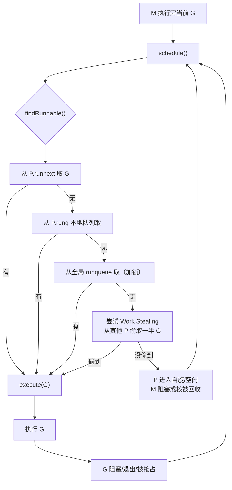
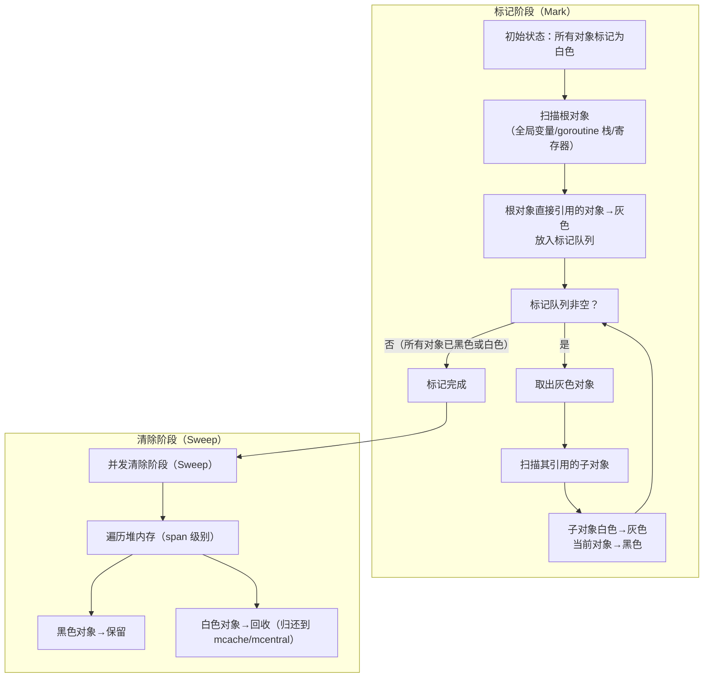

# go语言知识规划——高级话题

> 高级话题方向在 Go 面试知识体系中权重 **10%**。它不涉及日常 CRUD，而是深入 Go 运行时的底层原理——调度器如何调度 goroutine、GC 如何回收内存、网络 I/O 如何不阻塞。这部分知识区分"会用"和"懂原理"，是面试中拉开差距的关键战场。面向具备 Go 核心基础、希望深入理解运行时机制的开发者。

---

## GMP 调度器

GMP 调度器是 Go 并发模型最核心的运行时实现。goroutine 之所以能被称为"轻量级线程"（初始栈仅 2KB，可动态伸缩），根本原因在于 Go 运行时在用户态完成了 goroutine 的调度，不依赖 OS 内核调度。

### G、M、P 三大核心结构

| 结构 | 全称 | 说明 | 数量级 |
|------|------|------|:------:|
| **G** | Goroutine | 调度基本单位，包含 goroutine 栈、PC/SP 寄存器（gobuf）、状态、ID 等 | 十万~百万级 |
| **M** | Machine | 操作系统内核线程，由 OS 调度，M 必须绑定 P 才能执行 G | 与 P 1:1（非阻塞时） |
| **P** | Processor | 逻辑处理器，调度上下文，持有本地 runqueue | GOMAXPROCS（默认 CPU 核数） |

**G 结构关键字段**：

- `stack`：goroutine 栈（低地址 ~ 高地址），初始 2KB，按需增长（1.3 后连续栈，通过 copystack 实现）
- `gobuf`：调度现场寄存器保存区域（sp、pc、ret 等），用于暂停/恢复执行
- `schedlink`：全局 runqueue 链表指针
- `atomicstatus`：goroutine 状态（_Grunning/_Grunnable/_Gwaiting/_Gsyscall 等）

**P 结构关键字段**：

- `runq`：本地 runqueue，一个 [256]guintptr 的环形队列，无锁访问
- `runnext`：下一个优先执行的 G（提高局部性）
- `status`：P 状态（_Prunning/_Pidle/_Psyscall 等）
- `mcache`：与 P 绑定的内存缓存（小对象分配）

### 调度循环（schedule -> findRunnable -> execute）

GMP 调度器的核心调度循环通过 `runtime.schedule()` 函数完成，持续寻找可运行的 G 并将其绑定到 M+P 上执行：



**关键流程**：

1. **schedule()**：调度入口，调用 findRunnable 尝试获取可运行 G
2. **findRunnable()**：按优先级尝试获取 G：
   - 先取 `P.runnext`（局部性最高的 G）
   - 再取 `P.runq` 本地队列（无锁）
   - 然后取全局 runqueue（需加全局锁）
   - 最后尝试从其他 P 的 runq **偷取（Work Stealing）** 一半 G
   - 如果都没偷到，P 进入空闲状态，M 可能被回收
3. **execute(G)**：将 G 与 M 绑定（M.curg = G），跳转到 G 的执行入口开始执行
4. **G 执行完或被阻塞/抢占后**：重新进入 schedule()

**Work Stealing 机制**：当 P 的本地队列为空时，会随机选择目标 P，从其 runq 中窃取大约一半的 G。这个设计保证了多核负载均衡，避免某些 P 繁忙而其他 P 空闲。

### 抢占式调度（1.14+）

Go 1.13 及之前只支持**协作式抢占**——goroutine 只有在主动触发函数调用或 GC 时才会被暂停。这意味着一个没有函数调用的死循环会卡死整个 P。

Go 1.14 引入了**基于信号的真正抢占式调度**：

- 监控线程 sysmon 定期检查运行超过 10ms（默认）的 G
- 向占用 P 的 M 发送 SIGURG 信号
- M 的信号处理函数执行 `sigcall` -> `gopreempt_mark` -> 触发 `schedule()`
- 被抢占的 G 重新入队到本地 runqueue

```
触发条件：G 运行时间 > 10ms（由 sysmon 检测）
实现原理：信号抢占（SIGURG，非致命信号）
效果：死循环也不再能独占 P，确保调度公平性
```

### Netpoller（网络轮询器）

Netpoller 是 Go 运行时实现**异步网络 I/O** 的核心组件，它使得 goroutine 在网络操作（如 TCP read/write）阻塞时不会一直占用 M。

```text
goroutine 调用 net.Conn.Read()
  ├─ 数据已到达 → 直接返回（与同步一致）
  └─ 数据未到达 →
       ├─ 将 fd 注册到 Netpoller（epoll / kqueue / IOCP）
       ├─ G 状态变为 _Gwaiting，P 解除绑定
       ├─ M 继续执行其他 G（不阻塞等待）
       └─ Netpoller 轮询到 fd 可读 →
            ├─ 找到等待的 G
            └─ G 重新入队到本地 runqueue，恢复执行
```

**底层实现**：

| 平台 | 机制 | 内核支持 |
|------|------|---------|
| Linux | epoll（edge-triggered） | epoll_create / epoll_ctl / epoll_wait |
| macOS / FreeBSD | kqueue | kqueue / kevent |
| Windows | IOCP | GetQueuedCompletionStatus 等 |
| 其他 | poll / select | 兜底方案 |

**Netpoller 的工程意义**：Go 不需要像 Java Netty 那样依赖 Reactor 模型进行手动的事件循环管理。Go 开发者用同步风格写网络代码（一行 `conn.Read(buf)`），底层由 Netpoller 自动适配异步 I/O，goroutine 被 park 和 resume 完全透明。

### GMP vs Java 线程池对比

| 对比维度 | Go GMP | Java ThreadPoolExecutor |
|---------|--------|------------------------|
| **基本单位** | goroutine（2KB 栈，用户态调度） | 线程（1MB 栈，内核态调度） |
| **调度器** | Go 运行时自调度（schedule + findRunnable） | OS 内核调度线程 |
| **队列结构** | 本地 runqueue（per-P 无锁）+ 全局 runqueue（加锁）+ Work Stealing | 共享工作队列（BlockingQueue）+ 无 Work Stealing |
| **创建开销** | ~几百 ns，栈初始 2KB | ~几十 μs，栈默认 1MB |
| **最大数量** | 十万至百万级（受内存限制） | 千级（受线程栈内存 + OS 调度开销限制） |
| **系统调用/同步阻塞** | G 阻塞 -> P 切换 M 执行其他 G（不阻塞线程） | 线程阻塞 -> 内核挂起线程（消耗全局调度资源） |
| **抢占机制** | 1.14+ 信号抢占（SIGURG） | OS 时间片轮转（不可控） |
| **适用场景** | 高并发 I/O 密集 + 少量 CPU 密集 | CPU 密集（线程数约等 CPU 核数） |

**核心差异**：Go GMP 的核心优势在于 M 与 G 解耦——一个 M 可以顺序执行多个 G，G 阻塞不阻塞 M。Java 线程池中，一个线程在执行任务时被阻塞（如等待远程调用返回），整个线程占用的 1MB 栈空间和内核调度资源就在空等。

---

## Go GC + 逃逸分析

Go 的垃圾回收器采用**非分代并发三色标记清除算法**。理解 Go GC 是调优 Go 应用内存和延迟的前提。

### GC 演进史

| 版本 | 里程碑变化 | 最大 STW |
|:----:|-----------|:--------:|
| Go 1.0 ~ 1.3 | 顺序标记清除（STW，Stop The World） | 秒级 |
| Go 1.5 | **并发 GC**（三色标记 + 插入写屏障），默认 P 数 4 | ~10ms |
| Go 1.7 | 引入 **GC 栈扫描优化** | ~10ms |
| Go 1.8 | **混合写屏障**（插入 + 删除写屏障结合），消除栈重扫 | ~100μs |
| Go 1.10 | **Pacer 算法改进**，更精准的 GC 触发时机 | ~100μs |
| Go 1.13 | **软内存限制** + Scavenger 改进 | ~100μs |
| Go 1.14 | 改进抢占式调度与 GC 结合 | ~100μs |
| Go 1.19 | **非分代并发三色标记清除**（移除分代尝试），GOMEMLIMIT 引入 | ~100μs |
| Go 1.21+ | GC pacer 持续优化，GOMEMLIMIT 生产可用 | ~100μs |

### 三色标记清除算法

**三色抽象**：

| 颜色 | 含义 | 是否可达 |
|:----:|------|:--------:|
| 黑色 | 该对象及其所有引用都已扫描完成 | 存活（保留） |
| 灰色 | 该对象已加入扫描队列，但引用的子对象尚未扫描完成 | 存活（保留） |
| 白色 | 尚未被扫描到的对象 | 待定（清除阶段回收） |

**完整标记清除过程**：



**关键算法特性**：

- **非分代**：Go 1.19 后明确选择非分代方案（移除之前的分代尝试），理由是 Go 的对象分配模式（大量指针少、生命周期短的对象比例不如 Java 显著）不适合分代假设
- **并发**：标记阶段与应用 goroutine 并发执行，只在标记开始和结束时短暂 STW
- **三色不变性**：标记过程中保证"黑色对象不直接引用白色对象"，否则会导致存活对象被误回收

### 并发 GC 与写屏障

并发 GC 面临的核心问题是：**GC 标记过程中，应用 goroutine 可能修改对象引用，导致黑色对象引用了新创建的白色对象，而这个白色对象本应存活却被清除**。

写屏障（Write Barrier）是解决这个问题的关键机制。

**插入写屏障（Go 1.5 ~ 1.7）**：

```
当 goroutine 修改指针 a.b = c 时（a 是黑色/灰色，c 是白色）：
    插入写屏障将 c 标记为灰色（加入标记队列）
    
缺陷：需要标记结束后重扫所有 goroutine 栈（栈上对象变更无法拦截），
这个 STW 重扫是 1.5 时代延迟的主要来源
```

**混合写屏障（Go 1.8+）**：

```
混合写屏障 = 插入写屏障 + 删除写屏障

当 goroutine 修改指针时：
    a.b = c
    - 如果 a 是黑色，将 c 标记为灰色（插入屏障保护）
    - 将 b 原来的指向对象标记为灰色（删除屏障保护）

优势：标记结束不需要重扫栈（栈上对象用删除屏障保护），
这一改进将 STW 从 ~10ms 降低到 ~100μs
```

混合写屏障的精妙之处在于：它让 GC 标记结束时可以**不重扫栈**，因为栈上引用被修改时（删除旧引用），旧对象会被保护起来。

### GC 触发条件

| 触发方式 | 触发条件 | 说明 |
|---------|---------|------|
| **堆增长**（主动） | 当前堆内存达到上次 GC 后存活堆大小的 `GOGC%` 倍数 | 默认 GOGC=100，即堆翻倍时触发。例如上次 GC 后存活 10MB，堆增长到 20MB 时触发下一次 GC |
| **定时触发**（兜底） | 如果超过 2 分钟没有 GC，强制触发一次 | 由 sysmon 监控线程检测 |
| **GOMEMLIMIT**（1.19+） | 堆内存接近 GOMEMLIMIT 值时触发 | 软限制，大部分场景按此触发而非 GOGC，生产推荐设置 |
| **手动触发** | `runtime.GC()` 调用 | 同步阻塞直到 GC 完成，通常仅测试用 |

### 调优参数

| 参数 | 作用 | 默认值 | 调优建议 |
|------|------|:------:|---------|
| `GOGC` | GC 触发百分比。上一轮存活大小 \* (GOGC/100) 达到上限时触发 | 100 | 可调小（更频繁但低延迟）或调大（减少 GC 但可能突发高延迟）。`GOGC=off` 禁用自动 GC（不推荐） |
| `GOMEMLIMIT` | 硬内存限制（软限制），GOGC 计算的上限值 | 0（不限制） | 生产环境建议设置，如 `GOMEMLIMIT=1536MiB`，防止 GC 未触发时内存超限 |
| `runtime/debug.SetGCPercent()` | 运行时修改 GOGC | 100 | 可在某个阶段临时调整 |
| `runtime.GC()` | 手动触发 GC | - | 仅测试/诊断场景，生产不推荐 |

**最佳实践组合**：设置 `GOMEMLIMIT` 作为内存安全网，同时保持 `GOGC=100` 或按需调整。

### 逃逸分析

逃逸分析是 Go 编译器在编译期决定变量分配到栈（stack）还是堆（heap）的过程。

**分配决策规则**：

```text
变量分配到栈的条件（不逃逸）：
- 在函数内创建，且函数返回后不再被引用
- 没有被取地址传给其他函数
- 没有闭包捕获

变量分配到堆的条件（逃逸）：
- 作为返回值返回（"返回指针"）→ 堆分配
- 被全局变量引用 → 堆分配
- 被闭包捕获 → 堆分配
- 编译器不确定大小（如 `make([]int, n)` 中 n 不固定）→ 堆分配
- 接口值（interface{}）赋值，类型信息动态 → 可能堆分配
```

**逃逸分析诊断命令**：

```bash
# 查看逃逸分析结果
go build -gcflags '-m' main.go

# 更详细输出（展示所有优化决策）
go build -gcflags '-m -m' main.go

# 禁止内联以便观察逃逸
go build -gcflags '-N -l -m' main.go
```

**典型逃逸场景示例**：

```go
func createUser() *User {
    u := User{Name: "ziogn"}  // u 逃逸到堆（因为返回指针）
    return &u
}

func process() {
    items := make([]int, 1000)  // 分配在栈（容量已知且未逃逸）
    huge := make([]int, 65536)   // 大对象直接分配在堆（阈值约 64KB）
}

func closure() func() int {
    x := 10
    return func() int {  // x 被闭包捕获，逃逸到堆
        return x
    }
}

func interfaceEscape() {
    var v interface{}
    v = 42  // int 被装箱（boxing）为 interface{}，逃逸到堆
}
```

**栈 vs 堆分配性能差异**：

| | 栈分配 | 堆分配 |
|--|:-----:|:------:|
| 分配速度 | 1 条指令（SP 增减） | 需要 GC 管理，分配器搜索合适 span |
| 回收成本 | 函数返回即自动回收（0 成本） | 需要 GC 标记 + 清除，触发 STW |
| 局部性 | 好（连续内存，CPU 缓存友好） | 差（分散内存，碎片风险） |

**优化建议**：在性能敏感的路径中，通过调整代码结构避免不必要的逃逸——比如将返回指针改为返回值，或使用对象池（sync.Pool）复用堆对象。

---

## 网络编程与反射

### net 包 TCP/UDP 底层

Go 的网络编程基于 `goroutine-per-connection` 模型，代码写起来是同步风格，底层由 Netpoller 自动移植到异步 I/O。

**TCP Server 典型结构**：

```go
listener, _ := net.Listen("tcp", ":8080")
for {
    conn, _ := listener.Accept()
    go handleConn(conn)  // 每个连接一个 goroutine
}

func handleConn(conn net.Conn) {
    defer conn.Close()
    buf := make([]byte, 1024)
    for {
        n, err := conn.Read(buf)  // 同步风格，底层 Netpoller 异步
        // 处理 buf[:n]
    }
}
```

- `net.Listen("tcp", addr)`：创建 TCP socket（socket -> bind -> listen）
- `listener.Accept()`：接受连接，返回 net.Conn（阻塞 goroutine，不阻塞 M）
- `goroutine-per-connection`：每个连接在一个独立 goroutine 中处理，代码简洁
- 大并发下，goroutine 数量的瓶颈不再是内存（goroutine 栈 2KB），而是 goroutine 切换调度开销

**UDP 无连接通信**：

```go
pc, _ := net.ListenPacket("udp", ":9090")
buf := make([]byte, 1024)
for {
    n, addr, _ := pc.ReadFrom(buf)
    pc.WriteTo([]byte("pong"), addr)
}
```

### reflect 三法则

Go 的反射（reflect 包）在运行时动态检查类型和操作对象，是框架、序列化和 ORM 的底层基础。

**反射三法则**（出自 The Laws of Reflection，Rob Pike）：

| 法则 | 含义 | 示例 |
|:----:|------|------|
| **1** | 从 `interface{}` 值到反射对象 | `t := reflect.TypeOf(x)`，`v := reflect.ValueOf(x)` |
| **2** | 从反射对象到 `interface{}` 值 | `x := v.Interface()` |
| **3** | 要修改反射对象，其值必须可设置（settable） | `v.Elem().SetXXX()` 需要传递指针：`reflect.ValueOf(&x)` |

```go
// 法则 1：interface -> reflect
var x float64 = 3.14
v := reflect.ValueOf(x)          // x 被拷贝到 interface{} 中

// 法则 2：reflect -> interface
y := v.Interface().(float64)     // 必须断言回具体类型

// 法则 3：要修改必须传递指针，并通过 Elem() 获取可设置的对象
p := reflect.ValueOf(&x)         // &x 是 *float64
v = p.Elem()                     // 获取指针指向的值
v.SetFloat(2.718)                // 修改成功
```

**常见用途**：
- 结构体 Tag 解析（GORM/Gin/JSON 编码器等）
- 动态调用方法/创建对象（泛型前时代的兜底方案）
- 实现通用序列化/反序列化框架

### unsafe 包

`unsafe.Pointer` 绕过了 Go 的类型安全检查，用于底层系统编程。

```go
type ArbitraryType int
type Pointer *ArbitraryType  // unsafe.Pointer = 任意类型指针

// 关键操作
unsafe.Sizeof(x)    // 返回类型大小（字节）
unsafe.Offsetof(x)  // 返回结构体字段偏移量
unsafe.Alignof(x)   // 返回类型对齐要求
```

**类型转换规则**：

```text
T1 -> unsafe.Pointer -> T2
（任意类型的指针都可转换为 unsafe.Pointer，unsafe.Pointer 可转换为其他类型指针）

unsafe.Pointer -> uintptr（地址运算） -> unsafe.Pointer
（通过 uintptr 进行指针算术，但 uintptr 是整数，不保证指向的对象存活）
```

**典型用途**：
- 与 C 代码互操作（syscall.Syscall 参数传递）
- 高效序列化（直接结构体内存读写）
- 结构体字段偏移访问（如获取私有字段）

**安全警告**：unsafe 包的代码不可移植（不同架构下结构体字段对齐可能不同），且 Go 版本升级可能导致行为变化。生产代码应尽量避免，仅用于性能敏感的底层场景。

---

## 面试高频追问链

### GMP 调度器追问链

```
Q: goroutine 比线程轻量在哪里？
  → 初始栈 2KB vs 1MB，用户态调度（无 syscall），创建/切换成本低

Q: GMP 如何协作调度一个 goroutine？
  → 启动流程：go func() -> newproc -> 入队 P.runnext 
  → 执行流程：schedule -> findRunnable -> execute -> 执行 -> 阻塞/完成 -> schedule
  → findRunnable 优先级：runnext > 本地队列 > 全局队列 > Work Stealing

Q: 什么是 Work Stealing？
  → P 本地队列空时，随机选其他 P 窃取一半 G，维持负载均衡

Q: 一个 goroutine 在执行系统调用时发生了什么？
  → 进入阻塞系统调用时，P 与 M 解绑，P 去绑定其他空闲 M 或新建 M 
  → 系统调用返回时，G 尝试重新申请 P，成功则继续，失败则入全局队列

Q: 1.14 的抢占式调度如何实现？
  → sysmon 监控运行 >10ms 的 G，发 SIGURG 信号给目标 M
  → M 信号处理中执行 gopreempt_mark，触发 schedule() 重新调度

Q: GOMAXPROCS 设置多少合适？
  → 默认 CPU 核数。I/O 密集型可适当调大（更多 P 并发处理网络连接）
  → CPU 密集型保持 CPU 核数即可
  → 注意：GOMAXPROCS 限制的是 P 的数量，不是 goroutine 的数量
```

### Go GC 追问链

```
Q: Go GC 用什么算法？
  → 非分代并发三色标记清除算法（1.19+）

Q: 为什么 Go 不采用分代 GC？
  → Go 对象分配模式：大量指针少，小对象生命周期短的比例不如 Java 显著
  → 非分代方案实现简单，避免了写屏障在分代中的复杂开销

Q: 写屏障解决什么问题？1.8 混合写屏障做了什么？
  → 并发标记中，应用 goroutine 修改指针可能导致"黑色对象引用白色对象"
  → 插入写屏障：赋值时将新对象标记为灰色
  → 混合写屏障（1.8+）：插入 + 删除写屏障结合，消除栈重扫，STW 降至 ~100μs

Q: GC 什么时候触发？
  → 堆增长（默认翻倍）、超 2 分钟无 GC、接近 GOMEMLIMIT、手动 runtime.GC()

Q: GOGC = 200 和 GOGC = 50 分别有什么影响？
  → 200：GC 触发间隔变大（堆增长 200%），GC 次数减少但单次 GC 延迟更高
  → 50：GC 更频繁，堆占用更少，GC 延迟更平稳，但 CPU 开销增加

Q: GOMEMLIMIT 和 GOGC 谁优先级高？
  → 两者共同决定。以先达到的条件为准。通常 GOMEMLIMIT 作为安全上限
```

### 逃逸分析追问链

```
Q: 什么是逃逸分析？
  → 编译器 compile-time 分析变量分配位置（栈 vs 堆）的过程

Q: 哪些情况必须堆分配？
  → 返回指针、闭包捕获、全局引用、编译期不确定大小、接口装箱

Q: 如何查看逃逸分析结果？
  → go build -gcflags '-m' 查看每个变量的分配决策

Q: 逃逸分析与 GC 的关系？
  → 逃逸到堆的对象需要 GC 管理，栈分配的对象自动回收（0 GC 成本）
  → 减少不必要的逃逸可以减轻 GC 压力
```

### 写屏障追问链

```
Q: 没有写屏障会怎样？
  → 一个灰色对象 G（正在标记）引用了白色对象 W，移动指针后，
    新指针由黑色对象 B 持有，G 不再引用 W，但 W 已被标记为白色且继续存活。
    清除阶段 W 被回收 → 程序 bug

Q: 插入写屏障 vs 删除写屏障的区别？
  → 插入：保护"新写入"的引用（a.b = c → c 变成灰色）
  → 删除：保护"被移出"的引用（a.b = c, 原 a.b 指向的对象变灰色）
  → 1.8 前的插入写屏障需要重扫栈（栈是 HW 必须可见的，防止栈上的引用变更逃过）
  → 1.8 混合写屏障：插入 + 删除同时生效，栈上的旧引用变更已被删除屏障覆盖，无需重扫

Q: 混合写屏障在什么场景下触发？
  → 在 GC 标记阶段，任何 goroutine 修改指针时触发写屏障
  → GC 开始前安装写屏障（markroot），GC 结束后拆除
```

---

## 跨域知识关联

本方向的知识点与其他方向的关联链路，在总览文档中有完整图解，以下是核心链路的精要说明。

### 并发贯穿线（核心基础 -> 高级话题）

这是 Go 知识体系最核心的贯穿链路：

```
goroutine -> channel -> select -> sync 包 -> Context -> 并发模式 -> GMP 调度器 -> Netpoller
```

从核心基础的 goroutine 用法出发，深入到底层 GMP 调度器的工作原理：

- **核心基础**学习的 goroutine + channel 是"怎么用"
- **高级话题**的 GMP 调度器解释"为什么这么轻量"（2KB 栈、用户态调度、Work Stealing）
- **Netpoller** 解释"为什么网络 I/O 不阻塞 goroutine"
- 这条链贯通后，你能回答面试中最经典的问题："一个 goroutine 的完整生命周期是怎样的？"

### 内存管理链（高级话题 -> 高级话题）

```
栈分配/堆分配 -> 逃逸分析 -> 三色标记法 -> 写屏障 -> GC 调优
```

这条链完全在高级话题内部，但需要结合项目实践理解：

- **逃逸分析**决定对象在栈还是堆——这是 GC 压力的入口
- **三色标记法**是 GC 的核心算法——理解并发标记的挑战
- **写屏障**解决并发安全的标记问题——理解 1.8 混合写屏障的演进
- **调优参数**（GOGC / GOMEMLIMIT）解决生产环境的 GC 延迟问题

### 网络栈贯穿线（核心基础 -> Web 框架 -> 微服务 -> 高级话题）

```
net 包 TCP 底层 -> goroutine-per-connection -> net/http Handler -> Gin 路由 -> gRPC
```

高级话题中 net 包的网络编程知识是其他方向的基础：

- **基本网络操作**（Listener/Accept/Conn）：Web 框架底层和微服务 gRPC 的基础
- **goroutine-per-connection**：理解后就能明白为什么 Go 的 Web 框架可以用简单的代码处理高并发
- **reflect 和 unsafe**：GORM（结构体 Tag 读取）、序列化库（动态类型处理）的底层依赖

### 与 Java 生态的对比点

| Go 高级话题 | Java 对应 | 关键差异 |
|-------------|---------|---------|
| GMP 调度器 | 线程池 + JUC（ForkJoinPool 的 Work Stealing 类似） | Go 用户态调度 vs Java 内核态线程；Go G 百万级 vs Java 线程千级 |
| Netpoller | Java NIO Selector / Netty EventLoop | Go 对开发者透明（同步代码 + 异步 I/O），Java 需要显式注册事件/处理回调 |
| 三色标记 GC | G1/ZGC/Shenandoah | Go GC 实现简单（非分代），Java GC 极其复杂（分代/G1/Region/ZGC 不同实现） |
| 混合写屏障 | G1 SATB（Snapshot At The Beginning） | Go 写屏障在赋值器侧（赋值时拦截），G1 在引用侧（引用变更时记录） |
| 逃逸分析 | JVM 逃逸分析 + 标量替换 | Go 逃逸分析作用在分配决策，JVM 的标量替换更激进（拆对象场到寄存器） |
| reflect | java.lang.reflect | Go reflect 模式匹配（三法则），Java reflect 注解驱动，两者性能都差（避免在热点路径使用） |
| unsafe | sun.misc.Unsafe | 都提供底层内存操作，都"unsafe"且不保证跨版本兼容 |

---

## 学习建议

1. **先理解 GMP 的调度流程**：推荐阅读 Go 源码中 `runtime/proc.go` 的 `schedule()` -> `findRunnable()` -> `execute()` 核心函数调用链，配合 debug 观察 goroutine 状态变化
2. **GC 配合 pprof 学习**：在实际项目中用 pprof 抓 Heap profile，观察 GC 触发频率和堆使用情况，然后回头理解 GC 原理
3. **逃逸分析在实践中验证**：对项目中的热点函数执行 `go build -gcflags '-m'`，观察哪些变量逃逸了，尝试优化减少不必要的堆分配
4. **网络编程始于 net 包**：先手写一个简单的 TCP Server/Client 理解 goroutine-per-connection，再去看 Gin 源码中 HTTP Server 的初始化和连接处理
5. **reflect 和 unsafe 先理解再看场景**：这两个包不是日常工具，但在读到框架源码（GORM/Gin 参数绑定）时频繁遇见。先理解三法则和 Pointer 规则，再看框架源码会豁然开朗
